# 1. Introduction

## 1.1 What is a Compiler?

A **compiler** is what we as developers usually see as a black box. We might use the C compiler `gcc` int the following way:

```c
#include <stdio.h>

int main() {
	printf("Hello world!\n");
	return 0;
}
```

```console
% gcc -o hello hello.c
% ./hello
Hello world!
%
```

The goal of a **compiler** is to _translate one programming language to another_, typically that is translating a high-level source code to a low-level machine code (**object code**).

#### Source Code

**Source code** is optimized for human readability. This means it is:

- Expressive: match human ideas of grammar/syntax/meaning
- Redundant: more information than needed to help catch errors
- Abstract: exact computations possibly not fully determined by code

Following an example of some C source code:

```c
#include <stdio.h>

int factorial(int n) {
	int acc = 1;
	while(n > 0) {
		acc = acc * n;
		n = n - 1;
	}
	return acc;
}

int main(int argc, char *argv[]) {
	printf("factorial(6) = %d\n", factorial(6));
}
```

#### Low-level code

**Low-level code** is optimized for hardware. This means that:

- Machine code is hard to read for humans
- Redundancy and ambiguity is reduced
- Abstractions and information about intent is lost

#### Compiler Bug Types

When compiling code we might encounter different bugs. We can distinguish them into different types:

- **Miscompilation (wrong code bug)**: The compiler, maybe after enabling some optimization, gives us back a wrong code.
- **Internal compilation error (ICE)**: The compiler crashes on trying to compile some source code.
- **Compiler hang (slow compilation)**: The compiler is stuck or takes a very long time trying to compile some simple source code.
- **Missed optimizations**: The compiler might miss optimizations it could do to some given source code.

## 1.2 Compiler Structure

The following figure shows a simplified view of the **compiler structure**:

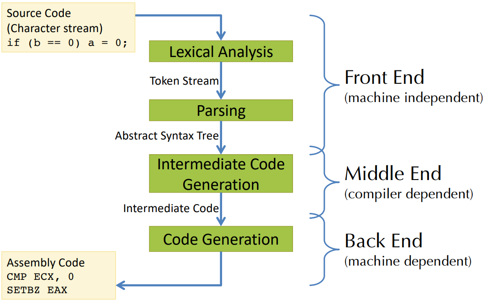{width=50%}

The typical **compiler stages** are as follows:

- Lexing -> token stream
- Parsing -> abstract syntax
- Disambiguation -> abstract syntax
- Semantic analysis -> annotated abstract syntax
- Translation -> intermediate code
- Control-flow analysis -> control-flow graph
- Data-flow analysis -> interference graph
- Register allocation -> assembly
- Code emission

**Optimization** may be done at _many_ of these stages!

Another simplified view on the compilation and execution is given by the following figure:

{width=50%}

# 2. OCaml

## 2.1 OCaml Tools

The programming language **OCaml** includes the following tools:

- `ocaml` -> The top-level interactive loop
- `ocamlc` -> The byte code compiler
- `ocamlopt` -> The native code compiler
- `ocamldep` -> The dependency analyzer
- `ocamldoc` -> The documentation generator
- `ocamllex` -> The lexer generator
- `ocamlyacc` -> The parser generator

In addition to the above-mentioned tools, one might use the following additional tools:

- `menhir` -> A more modern parser generator
- `ocamlbuild` -> A compilation manager
- `utop` -> A more fully-featured interactive top-level
- `opam` -> Package manager

## 2.2 OCaml Characteristics

OCaml has the following two main distinguishing characteristics:

#### Functional and mostly pure

- Programs manipulate values rather than issue commands
- Functions are first-class entities
- Results of computations can be "named" using `let`
- Has relatively few "side effects"

#### Strongly and statically typed

- Compiler typechecks every expression of the program, issues errors if it can't prove that the program is type safe
- Good support for type inference and generic polymorphic types
- Rich user-defined "algebraic data types" with pervasive use of pattern matching
- Very strong and flexible module system for constructing large projects

## 2.3 Factorial on OCaml

Consider the following implementation of the factorial function in a hypothetical programming language:

```pseudo
x = 6;
ANS = 1;
whileNZ (x) {
	ANS = ANS * x;
	x = x + -1;
}
```

For this hypothetical language, we need to describe the following two constructs:

- **Syntax**: which sequences of characters count as a leg program?
- **Semantics**: what is the meaning of a legal program?

## 2.4 Grammar for a Simple Language

### 2.4.1 Grammar and Interpreter

We introduce the following two **nonterminals** for our simple language:

```bnf
<exp> ::=
	|	<X>
	|	<exp> + <exp>
	|	<exp> * <exp>
	|	<exp> < <exp>
	|	<integer constant>
	|	(<exp>)

<cmd> ::=
	|	skip
	|	<X> = <exp>
	|	ifNZ <exp> { <cmd> } else { <cmd> }
	|	whileNZ <exp> { <cmd> }
	|	<cmd>; <cmd>
```

The above given syntax (or _grammar_) for a simple imperative language has the following properties:

- It is written in _Backus-Naur form_
- The symbols `::=`, `|`, and `<...>` are part of the **meta language**
- Keywords like `skip`, `ifNZ`, and `whileNZ` and symbols like `{` and `+` are part of the **object language**

#### Example: Define Grammar in OCaml

With the above definition of our grammar in BNF, we can transform this into OCaml. It looks the following way:

```ocaml
type var = string;

type exp =
	| Var of var
	| Add of (exp * exp)
	| Mul of (exp * exp)
	| Lt  of (exp * exp)
	| Lit of int

type cmd =
	| Skip
	| Assn    of var * exp
	| IfNZ    of exp * cmd * cmd
	| WhileNZ of exp * cmd
	| Seq     of cmd * cmd
```

With the definition of our hypothetical language, we can build a command for the factorial function in OCaml the following way:

```ocaml
let factorial : cmd =
	let x = "X" in
	let ans = "ANS" in
	Seq (Assn (x, Lit 6)),
		Seq (Assn (ans, Lit 1)),
			WhileNZ(Var x,
				Seq (Assn (ans, Mul (Var and, Var x)),
					Assn (x, Add (Var x, Lit (-1)))))
```

With the above two examples we can now finally build a simple **interpreter** for our simple language:

```ocaml
type state = var -> int

let rec interpret_exp (s:state) (e:exp) : int =
	match e with
	| Var x -> s x
	| Add (e1, e2) -> (interpret_exp s e1) + (interpret_exp s e2)
	| Mul (e1, e2) -> (interpret_exp s e1) * (interpret_exp s e2)
	| Lt  (e1, e2) -> if (interpret_exp s e1) < (interpret_exp s e2) then 1 else 0
	| Lit n -> n

let update s x v =
	fun y -> if x = y then v else s y

let rec interpret_cmd (s:state) (c:cmd) : state =
	match c with
	| Skip -> s
	| Assn (x, e1) ->
	  let v = interpret_exp s e1 in
	  update s x v
	| IfNZ (e1, c1, c2) ->
	  if (interpret_exp s e1) = 0 then interpret_cmd s c2 else interpret_cmd s c1
	| WhileNZ (e, c) ->
	  if (interpret_exp s e) = 0 then s else interpret_cmd s (Seq (c, WhileNZ (e, c)))
	| Seq (c1, c2) ->
```

#### Main Function

We might write and invoke a `main` function in the following way:

```ocaml
let main() =
	Printf.printf("Hello world!")

(* let _ = main () *)
;; main ()
```

### 2.4.2 Optimizer

We might `optimize` our interpreter. This could be that we evaluate simple expressions ourselves, instead of letting the compiler evaluate it completely. Examples:

```ocaml
(*
e + 0 -> e
e * 1 -> e
e * 0 -> 0
0 + e -> e
e - e -> 0
...

skip; c -> c

ifNZ 0 then c1 else c2 -> c2
ifNZ 1 then c1 else c2 -> c1

whileNZ 0 c -> skip
*)
```

In general, we want to make our program as simple as possible based on some rewriting rules before interpreting it.

We might realize an _optimizer for commands_ in the following way:

```ocaml
let rec optimize_cmd (c:cmd) : cmd =
	match c with
		| Assn(x, Var y) -> if x = y then Skip else c
		| Assn(_, _) -> c
		| WhileNZ(Lit 0, c) -> Skip
		| WhileNZ(Lit _, c) -> loop
		| WhileNZ(e, c) -> WhileNZ(e, optimize_cmd c)
		| Skip -> Skip
		| IfNZ(Lit 0, c1, c2) -> optimize_cmd c2
		| IfNZ(Lit _, c1, c2) -> optimize_cmd c1
		| IfNZ(e, c1, c2) -> IfNZ(e, optimize_cmd c1, optimize_cmd c2)
		| Seq(c1, c2) ->
			begin match (optimize_cmd c1, optimize_cmd c2) with
				| (Skip, c2') -> c2'
				| (c1', Skip) -> c1'
				| (c1', c2') -> Seq(c1', c2')
			end
```

### 2.4.3 Translator

We might imagine trying to build a translator from _Simple_ to _OCaml_. This process consists of several different steps.

#### Set of Variables

In the following code we explore how to get the set of variables from a given expression.

```ocaml
;; open Simple

module OrderedVars = struct
	type t = var
	let compare = String.compare
end

module VSet = Set.Make(OrderedVars)
let (++) = VSet.union

(* Calculate the set of variables mentioned in either an expression or a command *)

let rec vars_of_exp (e:exp) : VSet.t =
	begin match e with
		| Var x -> VSet.singleton x
		| Add(e1, e2)
		| Mul(e1, e2)
		| Lt (e1, e2) ->
			(vars_of_exp e1) ++ (vars_of_exp e2)
		| Lit _ -> VSet.empty
	end

let rec vars_of_cmd (c:cmd) : VSet.t =
	begin match c with
		| Skip -> VSet.empty
		| Assn(x, e) -> (VSet.singleton x) ++ (vars_of_exp e)
		| IfNZ(e, c1, c2) ->
			(vars_of_exp e) ++ (vars_of_cmd c1) ++ (vars_of_cmd c2)
		| WhileNZ(e, c) ->
			(vars_of_exp e) ++ (vars_of_cmd c)
		| Seq(c1, c2) ->
			(vars_of_cmd c1) ++ (vars_of_cmd c2)
	end
```

#### Translation

The translation invariants are guided by the _types_ of the operations:

- variables are a global state, so the become mutable references
- expressions denote integers
- commands denote imperative actions of type unit

We might build our translator the following way:

```ocaml
let trans_var (x:var) : string =
	"V_" ^ x

let rec trans_exp (e:exp) : string =
	let trans_op (e1:exp) (e2:exp) (op:string) =
		Printf.sprintf "(%s %s %s)"
			(trans_exp e1) op (trans_exp e2)
	in
		begin match e with
			| Var x -> "!" ^ (trans_var x)
			| Add(e1, e2) -> trans_op e1 e2 "+"
			| Mul(e1, e2) -> trans_op e1 e2 "*"
			| Lt (e1, e2) ->
				Printf.sprintf "(if %s then 1 else 0)"
					(trans_op e1 e2 "<")
			| Lit 1 -> string_of_int 1
		end

let rec trans_cmd (c:cmd) : string =
	begin match c with
		| Skip -> "()"
		| Ass(x, e) ->
			Printf.sprintf "%s := %s"
				(trans_var x) (trans_exp e)
		| IfNZ(e, c1, c2) ->
			Printf.sprintf "if %s <> 0 then (%s) else (%s)"
				(trans_exp e) (trans_cmd c1) (trans_cmd c2)
		| WhileNZ(e, c) ->
			Printf.sprintf "while %s <> 0 do \n %s done"
				(trans_exp e) (trans_cmd c)
		| Seq(c1, c2) ->
			Printf.sprintf "%S; \n %s"
				(trans_cmd c1) (trans_cmd c2)
	end

let trans_prog (c:cmd) : string =
	let vars = vars_of_cmd c in
		let decls =
			VSet.fold (fun x s ->
				Printf.sprintf " let %s = ref 0 \n %s \n"
					(trans_var x) d)
				vars
				""
		in
			Printf.sprintf "module Program = struct \n %s let run () = \n %s \n end"
			decls (trans_cmd c)

(* Do some testing using the factorial code: Simple.factorial *)
let _ =
	Printf.printf ("%s \n") (trans_prog factorial)
```

# 3. X86 LITE

## 3.1 Simplified Compiler Structure

A simplified compiler structure looks as follows:

{width=50%}

## 3.2 X86 vs. X86Lite

`X86` assembly is very complicated:

- 8-, 16, 32-, and 64-bit values + floating point, etc.
- Intel 64 and IA 32 have a _huge_ number of functions
- For machine code, the instruction range is in size from 1 to 17 bytes

`X86Lite` assembly is a very simple subset of X86

- Only 64-bit signed integers (no floating point, no 16-bit, no etc.)
- Only about 20 instructions
- Sufficient as a target language for general-purpose computing

## 3.3 X86 Schematic

The X86 schematic looks as follows:

{width=50%}

### 3.3.1 Registers

There are three special **registers**:

- `rip`: The _instruction pointer_, holds the address of the next instruction
- `rbp`: The _base pointer_, used for call-stack manipulation
- `rsp`: _The stack pointer_, used for call-stack manipulation

### 3.3.2 Memory

The memory consists of three parts:

- _Code & Data_: Holds the actual program instructions as well as program constants and globals
- _Stack_: Used for function calls and local variables
- _Heap_: Dynamically allocated memory, e.g. via calls to `malloc()`

## 3.4 Instructions

### 3.4.1 `mov`

The `mov` instructions is of the following form:

```x86
movq SRC, DEST
```

Here, `SRC` and `DEST` are _operands_. `DEST` is treated as a location, either a register or a memory address. `SRC` is treated as a value and is the content of either a register or a memory address or an immediate constant or a label.

Example of a `mov` instruction:

{width=50%}

#### A Note About Instruction Syntax

The most important note is that we have the source _before_ the destination. Furthermore:

- Immediate values are prefixed with `$`
- Registers are prefixed with `%`
- Mnemonic suffixed (`movq` vs `mov):
  - `q` -> quadword (4 words)
  - `l` -> long (2 words)
  - `w` -> word (16 bits)
  - `b` -> byte (8 bits)

### 3.4.2 X86 Operands

| **Type** | **Description**                                                            | **Example**                 |
| -------- | -------------------------------------------------------------------------- | --------------------------- |
| Imm      | 64-bit literal signed integer ("immediate")                                | `move $4, %rax`             |
| Lbl      | a "label" representing a machine address                                   | `call FOO`                  |
| Reg      | one of the 16 registers                                                    | `move %rbx, %rax`           |
| Ind      | machine address: [base:Reg][index:reg][disp:int32](base + index\*8 + disp) | `move 12(%rax, %rcx), %rbx` |

### 3.4.3 Arithmetic Instructions

| **Instruction**  | **Description**                              | **Example**      | **Notes**                                      |
| ---------------- | -------------------------------------------- | ---------------- | ---------------------------------------------- |
| `negs DEST`      | 2's complement negation                      | `negs %rax`      |                                                |
| `add SRC, DEST`  | `DEST <- DEST + SRC`                         | `add %rbx, %rax` |                                                |
| `Subq SRC, DEST` | `DEST <- DEST - SRC`                         | `subq $4, %rsp`  |                                                |
| `Imulq SRC, Reg` | `Reg <- Reg * Src` (truncated 128-bit mult.) | `imulq $2, %rax` | `Reg` must be a register, not a memory address |

### 3.4.4 Logical/Bit Manipulation Instructions

| **Instruction**  | **Explanation**        | **Example**       | **Notes**              |
| ---------------- | ---------------------- | ----------------- | ---------------------- | ---------- |
| `notq DEST`      | logical negation       | `notq %rax`       | bitwise not            |
| `andq SRC, DEST` | `DEST <- DEST & SRC`   | `andq %rbx, %rax` | bitwise and            |
| `orq SRC, DEST`  | `DEST <- DEST          | SRC`              | `orq $4, %rsp`         | bitwise or |
| `xorq SRC, DEST` | `DEST <- DEST xor SRC` | `xorq $2, %rax`   | bitwise xor            |
| `sarq Amt, DEST` | `DEST <- DEST >> Amt`  | `sarq $4, %rax`   | arithmetic shift right |
| `shlq Amt, DEST` | `DEST <- DEST <<< Amt` | `shlq %rbx, %rax` | logical shift left     |
| `shrq Amt, DEST` | `DEST <- DEST >>> Amt` | `shrq $1. %rsp`   | logical shift right    |

### 3.4.5 Condition Flags & Codes

Some X86 instructions set flags as side effects:

- `OF`: _overflow_ is set when the result is too big/small to fit in a 64-bit register
- `SF`: _sign_ is set to the sign of the result (`0` means positive, `1` means negative)
- `ZF`: _zero_ is set when the result is `0`

From these three flags, we can define **condition codes**. If we want to compare `SRC1` to `SRC2`, we compute `SRC1 - SRC2`. We can then define the following condition codes based on the resulting condition flags:

| **Code**                 | **Condition**            |
| ------------------------ | ------------------------ |
| `e` (equality)           | `ZF` is set              |
| `ne` (inequality)        | `(not ZF)`               |
| `g` (greater than)       | `(not ZF) and (SF = OF)` |
| `l` (less than)          | `SF <> OF`               |
| `ge` (greater or equal)  | `(SF = OF)`              |
| `le`(less than or equal) | `SF <> OF or ZF`         |

### 3.4.6 Conditional Instructions

We might write conditional instructions in the following way in X86:

```c
// Conditional instruction in C
if (a == b) {
  // something
} else {
  // somethingElse
}
  // commonCode
```

```assembly
; Conditional instruction in x86
  cmpq %rax, %rbx
  je

somethingElse:
  <instruction>
  ;...
  jmp commonCode

something:
  <instruction>
  ;...

commonCode:
  <instruction>
  ;...
```

We support the following three **conditional instructions**:

| **Instruction**   | **Description**                              |
| ----------------- | -------------------------------------------- |
| `cmpq SRC2, SRC1` | Compute `SRC1 - SRC2`, set condition flags   |
| `setbCC DEST`     | `DEST`'s lower byte <- `if CC then 1 else 0` |
| `jCC SRC`         | `rip <- if CC then SRC else fallthrough`     |

### 3.4.7 Code Blocks and Labels

x86 assembly code is organized into **labeled blocks**. Labels indicate code locations than can be jump targets. Labels are translated away by the linker and loader -- instructions live in the _code segment_.

An x86 program begins executing at a designated code label (usually `main`).

### 3.4.8 Jumps, Call and Return

We might code function calls in the following way in x86:

```c
void bar() {
  // ...
}

void foo() {
  // ...
  bar();
}
```

```assembly
bar:
  <instruction>
  ;...
  <instruction>
  ret

foo:
  <instruction>
  ; ...
  <instruction>
  call bar
  ;...
```

The different instructions one might use are given by the following table:

| **Instruction** | **Description**                             | **Notes**                                                                                                                                    |
| --------------- | ------------------------------------------- | -------------------------------------------------------------------------------------------------------------------------------------------- |
| `jmp SRC`       | `rip <- SRC`                                | Jump to location in `SRC`                                                                                                                    |
| `call SRC`      | Push `rip`, `rip <- SRC` (call a procedure) | Push the program counter to the stack (decrementing `rsp`), and then jump to the machine instruction at the address given by `SRC`           |
| `ret`           | Pop into `rip` (return from procedure)      | Pop the current top of the stack into `rip` (incrementing `rsp`). This instruction effectively jumps to the address at the top of the stack. |

## 3.5 x86Lite Addresses

### 3.5.1 x86Lite Addressing

We show how **addressing** in x86Lite works with the following simple example:

```c
long a[0, 42, 2020;]

long b = (long)a;     // b = address(a)
long b = *a;          // b = a[0] = 0
long b = *(a+2);      // b = a[2] = 2020

long c = 1;
long b = a[c];        // b = 42
long b = a[c+1];      // b = 2020
```

```assembly
; Array [0, 42, 2020]
; Array address 0xBEEF

movq %0xBEEF, %rax

movq %rax,     %rbx        ; rbx = 0xBEEF
movq (%rax),   %rbx        ; rbx = 0
movq 16(%rax), %rbx        ; rbx = 2020

movq $1, %rcx
movq (%rax, %rcx), %rbx    ; rbx = 42
movq 8(%rax, %rcx), %rbx   ; rbx = 2020
```

In general, there are three components to an **indirect address**:

- _Base_: a machine address stored in a register
- _Index_: a variable offset from the base
- _Disp_: a constant offset (displacement) from the base

We therefore have: `addr(ind) = Base + [Index * 8] + Disp`. When used as a location, `ind` denotes the address `addr(ind)`. When used as a value, `ind` denotes `Mem[addr(ind)]`, the contents of the memory address.

Examples:

| **Expression**  | **Address**         |
| --------------- | ------------------- |
| `-8(%rsp)`      | `rsp - 8`           |
| `(%rax, %rcx)`  | `rax + 8 * rcx`     |
| `8(%rax, %rcx)` | `rax + 8 * rcx + 8` |

### 3.5.2 x86Lite Memory Model

The x86Lite memory consists of `2^64` bytes numbered `0x00000000` through `0xffffffff`. The memory is treated as consisting of 64-bit (8 byte) words. Therefore: _legal x86Lite memory addresses consists of 64-bit, quadword-aligned pointers_. This means, that all memory addresses are evenly divisible by 8.

To load a pointer into `DEST`, we use `leaq Ind, DEST` (`DEST <- addr(Ind)`).

By convention, the stack grows from high addresses to low addresses.

The register `rsp` points to the top of the stack:

- `pushq SRC`: `rsp <- rsp - 8; Mem[rsp] <- SRC`
- `popq DEST`: `DEST <- Mem[rsp]; rsp <- rsp + 8`

> Here is a nice website to explore assembly code given some code snippet in another language: [Compiler Explorer](https://godbolt.org/)

### 3.6 Example: Handcoding x86Lite

Let's look at how we would implement the **factorial** function in **x86Lite**:

```assembly
;  long factorial(long i) {
;  if (i > 1l) {
;    return i * factorial(i-1l);
;  }
;  return 1l;
;}

.text
.global factorial

factorial:
  ; i is in %rdi

  ; boilerplate
  pushq   %rbp
  movq    %rsp, %rbp

  ; if (i > 1l)
  cmpq    $1, %rdi      ; computes %rdi - 1
  jle     .BASECASE     ; if (i <= 1)

  ; (i > 1l) holds at this point
  pushq   %rdi          ; stores the current value of i on top of the calls tack

  subq    $1, %rdi
  callq   factorial

  ; %rax holds factorial(i - 1)
  popq    %rdi          ; %rdi holds again the original value of i
  imulq   %rdi, %rax    ; i * factorial(i - 1)

  jmp     .EXIT

.BASECASE:
  movq    $1, %rax

.EXIT:
  ; rest of boilerplate
  movq    %rbp, %rsp
  popq    %rbp
  ret     ; return the value in %rax

.data
```

_Remark: By convention, compilers often use a `.` in front of a label that is internal, i.e. not a global label (compare `factorial` to `.EXIT` in the code above)._

## 3.7 Programming in x86Lite

### 3.7.1 Three parts of the C memory model

We want to quickly revisit the three different parts of the C memory model, shown in the picture below.

{width=50%}

- The **code & data** (or `.text`) segment: contains compile code, constant strings, etc.
- The **heap**: stores dynamically allocated objects, is allocated via `malloc` and deallocated via `free`
- The **stack**: stores local variables, the return address of a function and other bookkeeping information

### 3.7.2 Local vs. Temporal Variable Storage

We somehow need space to store things like global variables, values passed as arguments to procedures, and local variables. The processor provides two options for storing stuff:

- _Registers_: fast, small size, very limited number
- _Memory (Stack)_: slow, very large amount of space

Example:

```assembly
; int i = 5

; Option 1:
; store to a register
; register is "blocked"
movq    $5, %rax

; Option 2:
; store on the stack
subq    $8, %rsp
movq    $5, (%rsp)
;...
movq    (%rsp), %rax
```

### 3.7.3 The Stack

The following picture shows how we use the stack in a program with different calls. This corresponds to the "boilerplate" code in the previous example with the `factorial`. We adjust the pointers to the bottom and the top of the stack before and after calling a "function", such that the function has its own **stack frame**.

{width=50%}

### 3.7.4 Calling Conventions

The **calling conventions** cover three main topics:

- Specify the locations of arguments
  - Passed to a function, and
  - Returned by a function
- Designate registers as either
  - Caller Save -- e.g. freely usable by the called code
  - Callee Save -- e.g. must be restored by the called code
- Define the protocol for deallocating stack-allocated arguments, either
  - Caller cleans up
  - Callee cleans up

The widely used calling conventions for x86-64 systems are as follows:

- Callee save registers: `rbp, rbx, r12-r15`
- Caller save: all others
- Call parameters:
  - Parameter 1-6: `rdi, rsi, rdx, rcx, r8, r9`
  - Parameter 7+: on the stack (in right-to-left order), thus, for `n > 6`, the nth argument is at `((n - 7) + 2) * 8 + rbp`
- Return value is in `rax`
- 128-byte "red zone" -- scratchpad for the callee's data

### 3.7.5 Directly Generating x86

For simple languages, there is no need for intermediate representations, e.g. the arithmetic expression language as in `(X1 + X2) - X3`. The main idea is to **maintain invariants**, e.g. code emitted for a given expression computes the answer into `rax`.

The key challenges are:

- storing intermediate values needed to compute complex expressions
- some instructions use specific registers (e.g. shift)

One simple strategy for directly generating x86 is based on the following ideas:

- Compilation emits instructions into an instruction stream
- To compile an expression `e1 op e2`:
  1. Recursively compile its sub-expressions
  2. Process the results
- Invariants:
  - Compilation of an expression yields its result in `rax`
  - Argument `Xi` is store in a dedicated operand
  - Intermediate values are pushed onto the stack
  - The stack is popped after use (such that the space is reclaimed)
- Resulting code is wrapped to comply with cdecl calling conventions

# 4. Intermediate Representations

Up until now, we followed a simple _syntax-directed_ translation, this meant that:

- Input syntax uniquely determined the output, i.e. no complex analysis or code transformation was done
- Worked fine for simple languages

However, the resulting _code quality is poor_. Example: The expression `(X1 - X1) + 3` is turned into the following code:

```assembly
.text
.globl _program

_program:
    pushq       %rbp
    movq        %rsp, %rbp
    movq        %rdi, %rax
    pushq       %rax
    movq        %rdi, %rax
    imulq       $-1, %rax
    popq        %r10
    addq        %r10, %rax
    pushq       %rax
    movq        $3, %rax
    popq        %r10
    addq        %r10, %rax
    popq        %rbp
    retq
```

But, obviously `(X1 - X1)` is 0 and the program therefore could be much more simple.

## 4.1 Intermediate Representations (IR's)

**Abstract machine code** (IR) hides the details of the target architecture and allows machine independent code generation and optimization.

The goal of this is to get the program closer to machine code without losing the information needed to do analysis and optimization. We might also have multiple IR's.

{width=50%}

### 4.1.1 What makes a good IR?

A good IR should tick the following points:

- Easy translation target (from the level above)
- Easy to translate (to the level below)
- Narrow interface (fewer constructs means simpler phases/optimizations)

_Example_: Source languages may have "while", "for", and "for each" loops while the IR might only have "while" loops and sequencing.
A "for" loop may be translated as follows:

```bnf
    [[for(pre; cond; post) {body}]]
    [[pre; while(cond) {body; post}]]
```

_Remark: Here, the notation `[[cmd]]` denotes the "translation/compilation" of `cmd`._

## 4.2 Simple Let-Based IR (SLL)

### 4.2.1 Eliminating Nested Expressions

One fundamental problem is compiling complex and nested expression forms to simple operations. As an example, consider the following steps of translations:

```bnf
    # Source
    ((1 + X4) + (3 + (X1 * 5)))

    # AST
    Add(Add(Const 1, Var X4),
        Add(Const 3, Mul(Var X1,
            Const 5)))
```

How would the IR-translation of the above example look like? The idea is to name intermediate values and to make the order of evaluation explicit, i.e. not to have any nested operations.

### 4.2.2 Translation to SLL

Considering the given example in the previous section, we can translate the code to the desired SLL form:

```llvm
    let tmp0 = add 1L varX4 in
    let tmp1 = mul varX1 5L in
    let tmp2 = add 3L tmp1 in
    let tmp3 = add tmp0 tmp2 in
        tmp3
```

We take the following notes on the translation above:

- Translation makes the order of evaluation explicit
- Translation names intermediate values
- Introduced temporaries are never modified

### 4.2.3 Basic Blocks and CFGs

A **basic block** is a sequence of instructions that is always executed starting at the first instruction and always exits at the last instruction:

- Starts with a label that names the _entry point_ of the basic block
- Ends with a control-flow instruction (e.g. branch or return), i.e. the _link_
- Contains no other control-flow instruction
- Contains no interior label used as a jump target

Basic blocks can be arranged into a **control-flow graph (CFG)**:

- The nodes of the graph are basic blocks
- There is a directed edge from node A to node B if the control flow instruction at the end of block A might jump to the label of block B

# 5. LLVM

Originally, **LLVM** stood for _Low-Level Virtual Machine_, however, this name doesn't much sense anymore. LLVM is an open-source compiler infrastructure.

## 5.1 LLVM Compiler Infrastructure

{width=50%}

## 5.2 LLVM overview

Consider the following code example:

```c
int s = 42;

long use(long a);

long foo(long a, long *b) {
    long sum = a + 42;

    if(sum > 100) {
        use(sum);
        return sum;
    } else {
        *b = sum;
        return sum;
    }
}
```

The translation down to LLVM (LLVM IR) will look like this:

```llvm
@s = globl i32 42

declare void @use(i64)

define i64 “foo (i64 %a, i64* %b) {
    %sum = add nsw i64 %a, 42
    %cond = icmp sgt i64 %sum, 100
    br i1 %cond, label t%then, label %else

then:
    call void @use(i64 %sum)
    ret i64 %sum

else:
    store i64 %sum, i64* %b
    ret i64 %sum
}
```

_Instruction_, i.e. the body of functions and if/else branches consists of the following part:

- _Opcode_, such as `add`, `icmp sgt`, `br i1`, `call`, etc.
- One or Zero _SSA Return Values_, such as `%sum` in the expression `%sum = add nsw i64 %a, 42`. Single static assignment (SSA) means, that each value, such as `%sum`, can only be once on the left-hand side of an assignment (i.e. can only be assigned once and not be changed afterwards).
- _Operands_, such as `%a`, `42`, etc.
- _Explicitly typed_

The main important _instruction classes_ are:

- Arithmetic
- Comparison
- Control flow
- Call/Return
- Load/Store

We furthermore use **labeled basic blocks** in LLVM:

- The first BB label is optional
- Last instruction is called the terminator

## 5.3 LLVM IR

### 5.3.1 LLVMLite Arithmetic and Bin Instructions

Arithmetic instructions:

| **LLVMLite**             | **Meaning**      | **x86Lite Equivalent** |
| ------------------------ | ---------------- | ---------------------- |
| `%L = add i64 OP1, OP2`  | `%L = OP1 + OP2` | `add SRC, DEST`        |
| `%L = subb i64 OP1, OP2` | `%L = OP1 - OP2` | `subq SRC, DEST`       |
| `%L = mul i64 OP1, OP2`  | `%L = OP1 * OP2` | `Imulq SRC, DEST`      |

Bin instructions:

| **LLVMLite**             | **Meaning**        | **x86Lite Equivalent** |
| ------------------------ | ------------------ | ---------------------- | ---- | --------------- |
| `%L = and i64 OP1, OP2`  | `%L = OP1 && OP2`  | `andq SRC, DEST`       |
| `%L = or i64 OP1, OP2`   | `%L = OP1          |                        | OP2` | `orq SRC, DEST` |
| `%L = xor i64 OP1, OP2`  | `%L = OP1 ^ OP2`   | `xorq SRC, DEST`       |
| `%L = shl i64 OP1, OP2`  | `%L = OP1 << OP2`  | `sarq AMT, DEST`       |
| `%L = lshr i64 OP1, OP2` | `%L = OP1 >> OP2`  | `shlq AMT, DEST`       |
| `%L = ashr i64 OP1, OP2` | `%L = OP1 >>> OP2` | `shrq AMT, DEST`       |

Code example:

```c
long sqnorm2(long x, long y) {
    return (x * x + y * y) * 2;
}
```

```llvm
define i64 @sqnorm2(i64 %0, i64 %1) {
    %3 = mul i64 %0, %0
    %4 = mul i64 %1, %1
    %5 = add i64 %4, %3
    %6 = shl i64 %5, 1
    ret i64 %6
}
```

### 5.3.2 LLVM Storage Models

In LLVM, there are several kinds of storage models:

- _Local variables_ (or temporaries); `%uid`
- _Global declarations_ (e.g. for string constants): `@gid`
- _Abstract locations_: references to stack-allocated storage created by the `alloca` instruction
- Heap-allocated structures created by external calls (e.g. to `malloc`)

#### Locals

_Local variables:_

- Defined by the instructions of the form `%uid = ...`
- Must satisfy the _single static assignment_ invariant: Each `%uid` appears on the left-hand side of an assignment only once in the entire control flow graph
- Analogous to `let %uid = e in ...` in OCaml
- Intended to be an _abstract version of machine registers_

#### `alloca`

The `alloca` instruction allocates stack space and returns a reference to it:

- The returned reference is stored in local: `%ptr = alloca type`
- The amount of space allocated is determined by the type

The contents of the slot are accessed via the `load` and `store` instructions:

```llvm
%acc = alloca i64
store i64 341, i64* %acc
%x = load i64, i64* %acc
```

Intended to be an _abstract version of stack slots_.

#### LLVMLite Memory Instructions

| **LLVMLite**                | **Meaning**       | **x86Lite Equivalent**    |
| --------------------------- | ----------------- | ------------------------- |
| `%L = load <ty>* OP`        | `%L = *OP`        | `movq (SRC), DEST`        |
| `store <ty> OP1, <ty>* OP2` | `*OP2 = OP1`      | `movq SRC, (DEST)`        |
| `%L = alloca <ty>`          | alloc. stack slot | `subq sizeof(<ty>), %rsp` |

Example:

{width=50%}

### 5.3.3 LLVMLite Control Flow Instructions

| **LLVMLite**                                     | **Meaning**               | **x86Lite equivalent**                                 |
| ------------------------------------------------ | ------------------------- | ------------------------------------------------------ |
| `%L = call <ty1> OP1(<ty2> OP2, ..., <tyN> OPN)` | `%L = OP1(OP2, ..., OPN)` | OP2, ..., OPN handled according to calling conventions |
| `call void OP1(<ty2> OP2, ..., <tyN> OPN)`       | `OP1(OP2, ..., OPN)`      | "                                                      |
| `ret void`                                       | return                    | `retq`                                                 |
| `ret <ty> OP`                                    | return OP                 | `retq`                                                 |
| `br label %LAB`                                  | unconditional branch      | `jmp %LAB`                                             |
| `br i1 OP, label %LAB1, label %LAB2`             | conditional branch        | `jne/je/... %LAB1; jmp %LAB2`                          |

### 5.3.4 LLVMLite Misc Instructions

| **LLVMLite**                                        | **Meaning**                                                   | **x86Lite Equivalent**                                           |
| --------------------------------------------------- | ------------------------------------------------------------- | ---------------------------------------------------------------- | ------------------ | ---------------------------------------------------------- | -------------------- |
| `%L = icmp (eq                                      | ne                                                            | slt                                                              | ...) i64 OP1, OP2` | Compare OP1 and OP2, typically used together with branches | No direct equivalent |
| `%L = getelementptr T1* OP1, i64 OP2, ..., i64 OPN` | Address computation (typically used for indexing into arrays) | Sometimes `leaq` but typically unrolled to multiple instructions |
| `%L = bitcast <ty1>* OP to <ty2>*`                  | `(<ty2>*) OP`                                                 | No types in x86                                                  |

## 5.4 More on LLVM

### 5.4.1 Factorial Example

```c
#include <stdint.h>

int64_t factorial(int64_t n) {
    int64_t acc = 1;
    while(n > 0) {
        acc = acc * n;
        n = n - 1;
    }
    return acc;
}
```

```llvm
define i64 @factorial(i64 @0) {
    %2 = alloca i64
    %3 = alloca i64
    store i64 %0, i64* %2
    store i64 1, i64* %3
    br label %4

4:
    %5 = load i64, i64* %2
    &6 = icmp sgt i64 %5, 0
    br i1 %6, label %7, label %13

7:
    %8 = load i64, i64* %3
    %9 = load i64, i64* %2
    %10 = mul nsw i64 %8, %9
    store i64 %10, i64* %3
    %11 = load i64, i64* %2
    %12 = sub nsw i64 %11, 1
    store i64 %12, i64* %2
    br label %4

13:
    %14 = load i64, i64* %3
    ret i64 %14
}
```

### 5.4.2 Basic Blocks

A **basic block** is a sequence of instructions that is always executed starting at the first instruction and always exits at the last instruction:

- Starts with a label that names the _entry point_ of the basic block
- Ends with a control-flow instruction, i.e. the _link_
- Contains no other control-flow instructions
- Contains no interior label used as a jump target

_Example_: Representation in OCaml:

```ocaml
type block = {
    insns : (uid * insn) list;
    term  : (uid * terminator)
}
```

### 5.4.3 Control-flow Graphs

A **control-flow graph** is represented as a list of labeled basic blocks with these invariants:

- No two blocks have the same label
- All terminators mention only labels that are defined among the set of basic blocks
- There is a distinguished, potentially unlabeled, entry block

_Example_: Representation in OCaml:

```ocaml
type cfg = block * (lbl * block) list
```

_Example_: Control-flow graph of the factorial function:

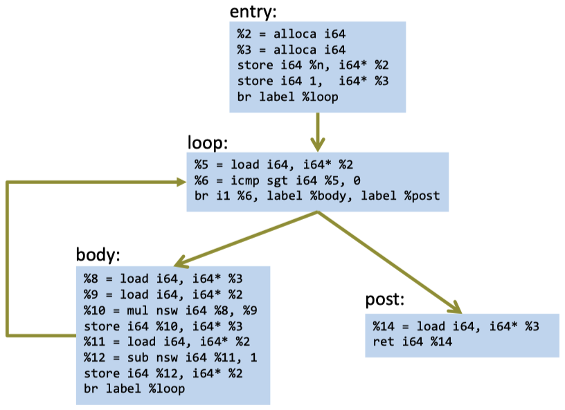{width=50%}

_Example_: `foo` function:

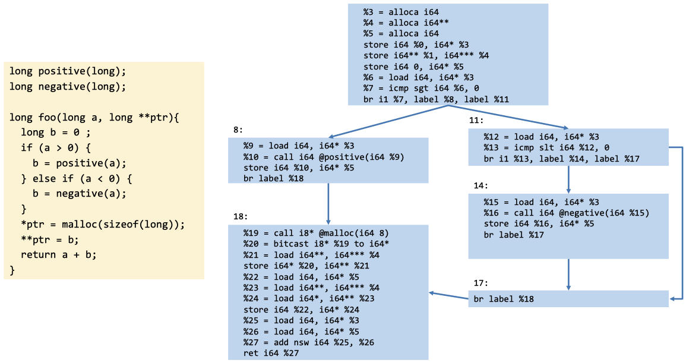{width=50%}

### 5.4.4 Generating Code for Loops

A **loop** has the following general form:

```c
for(initializationStatement; testExpression; updateStatement) {
    // statement inside the body of the loop
}
```

We therefore have the following five elements:

1. BB with the initialization
2. BB with the test expression
3. BB for the update statement
4. BB for the body of the loop
5. Connect the different BB's with the conditional statements

The general CFG for a loop looks as follows:

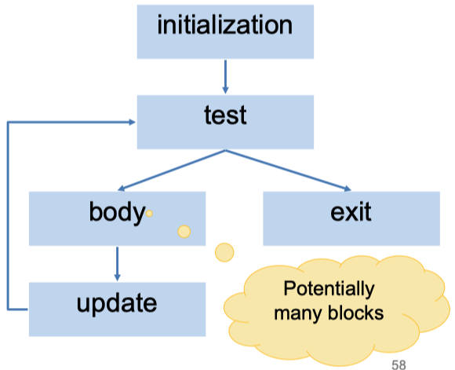{width=50%}

### 5.4.5 LLVM Cheat Sheet

```shell
# Extract LLVM-IR from C code - with optimization
clang -S -emit-llvm -O3 -o file.ll file.c

# Extract LLVM_IR from C code - no optimization
clang -S -emit-llvm -O0 -o file.ll file.c -Xclang -disable-llvm-passes

# View the CFG of a file
opt -view-cfg file.ll

# Compile .ll file to .o file
clang file.ll -c -o file.o

# Compile .ll file to executable
clang file.ll -o file.exe
```

## 5.5 Structured Data

### 5.5.1 Example LL Types

_`C`-Code:_

```c
struct Node {
    long a;
    struct Node* next;
};

struct List {
    struct Node head;
    long length;
};

struct ListOfLists {
    struct List *lists1;
    struct List *lists2;
}

void foo() {
    long a[4];
    long b[3][4];
    struct Node c;
    struct List d;
    struct ListsOfLists f;
    long(*g)(long, long);
}
```

_`LLVM-IR`-Code:_

```llvm
%struct.Node = type { i64, %struct.Node* }

%struct.List = type { %struct.Node, i64 }

%struct.ListsOfLists = type { %struct.List*, %struct.List* }

Define void @foo() #0 {
    %1 = alloca [4 x i64]               ;a
    %2 = alloca [3 x [4 x i64]]         ;b
    %3 = alloca %struct.Node            ;c
    %4 = alloca %struct.List            ;d
    %5 = alloca %struct.ListsOfLists    ;f
    %6 alloca i64 (i64, i64)*           ;g
    ret void
}
```

### 5.5.2 Datatypes in LLVM

- LLVM's IR uses types to describe the structure of data
- `<#elts>` is an integer constant >= 0
- Structure types can be named at the top level: such structure types can be recursive

```bnf
t ::=
    void
    i1 | i8 | i64       # N-bit integers
    [<#elts> x t]       # arrays
    fty                 # function types
    {t1, t2, ..., tn}   # structures
    t*                  # pointers
    %Tident             # named types

fty ::=                 # function types
    t (t1, ..., tn)     # return, argument types

%T1 = type {t1, t2, ..., tn}    # named type
```

#### Point struct example

```c
struct Point {
    long x;
    long x;
};

void foo() {
    struct Point p;
    p.x = 1;
    p.y = 2;
}
```

```llvm
%struct.Point = type { i64, i64 }

define void @foo() {
    %1 = alloca %struct.Point
    %2 = getelementptr,
            %struct.Point* %1, i32 0, i32 0
    atore i64 1, i64* %2
    %3 = getelementptr,
            %structPoint* %1, i32 0, i32 1
    store i64 2, i64* %3
    ret void
}
```

#### `getelementptr`

LLVM provides the `getelementptr` (**GEP**)instruction to compute pointer values:

- Given a pointer and a path through the structured data pointed to by that pointer, `getelementptr` computes an address
- This is the abstract analog of the X86 `lea`. It does not access memory
- It is a type indexed operation, since the size computations depend on the type

```llvm
<result> = getelementptr <ty>* <ptrval>{, <ty> <idx>}*
```

_GEP example:_

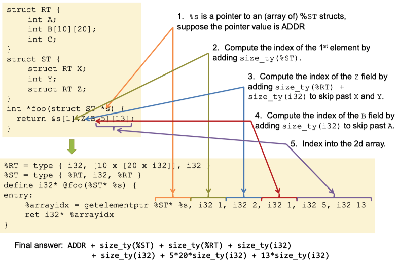{width=50%}

_Remarks:_

- GEP never dereferences the address it's calculating!
  - GEP only produces pointers by doing arithmetic
  - It doesn't actually traverse the links of datastructure
- To index into a deeply nested structure, we need to follow the pointer by loading it from the computed pointer

#### Array Indexing

```c
struct Point {
    long x;
    long y;
};

void foo(struct Point *ps, long n) {
    ps[n].y = 42;
}
```

```llvm
%Point = type { i64, i64 }

define void @foo(%Point* %0, i64 %1) {
    %3 = getelementptr, %Point* %0, i64 %1, i32 1
    store i64 42, i64* %3
    ret void
}
```

#### Struct parameters and return values

```c
struct Point {
    long x;
    long y;
};

long foo(struct Point p) {
    return p.x + p.y;
}

// Assume this is in a different file
struct Point {
    long x;
    long y;
    long z;
}

struct Point bar(long x, long y, long z) {
    struct Point p;
    p.x = x;
    p.y = y;
    p.z = z;
    return p;
}
```

```llvm
%struct.Point = type { i64, i64 }

; Remark here that struct parameters are unpacked!
define i64 @foo(i64 %0, i64 %1) {
    %3 = add nsw i64 %1, %0
    ret i64 %3
}

; Assume this is in a different file
%struct.Point = type { i64, i64, i64 }

; Return strcut allocated by the caller and passed as pointer argument
define void @ bar(%struct.Point* %0,
                    i64 %1, i64 %2, i64 %3) {
    %5 = getelementptr, %struct.Point* %0, i64 0, i32 0
    store i64 %1, i64* %5
    %6 = getelementptr, %struct.Point* %0, i64 0, i32 1
    store i64 %2, i64* %6
    %7 = getelementptr, %struct.Point* %0, i64 0, i32 2
    store i64 %3, i64* %7
    ret void
}
```

### 5.5.3 Compiling LLVMLite to x86 (With LLVM's Help)

#### LLVMLite Types to x86

- `[[i1]], [[i64]], [[t*]]` = quad word (8 bytes, 8-byte aligned)
- raw `i8` values are not allowed (they must be manipulated via `i8*`)
- array and struct types are laid out sequentially in memory
- `getelementptr` computations must be relative to the LLVMLite size definitions (i.e. `[[i1]] = quad`)

#### Compiling LLVM Locals

How do we manage storage for each `%uid` defined by an LLVM instruction?

_Option 1:_

- Map each `%uid` to an x86 register
- Efficient!
- Difficult to do effectively: many `%uid` values but only 16 registers

_Option 2:_

- Map each `%uid` to a stack-allocated space
- Less efficient!
- Simple to implement

#### `C` -> `LLVMLite` -> `x86Lite` Example

```c
long bar(long n);
long foo(long n) {
    long a = n;
    return bar(a);
}
```

```llvm
define i64 @foo(i64 %0) {
    %2 = alloca i64
    %3 = alloca i64
    store i64 %0, i64* %2
    %4 = load i64, i64* %2
    store i64 %4, i64* %3
    %5 = load i64, i64* %3
    %6 = call i64 @bar(i64 %5)
    ret i64 %6
}

declare i64 @bar(i64)
```

```x86
foo:
    pushq   %rbp
    movq    %rsp, %rbp
    subq    $16, %rsp
    movq    %rdi, -8(%rbp)
    movq    -8(%rbp), %rax
    movq    %rax, -16(%rbp)
    movq    -16(%rbp), %rdi
    callq   bar
    addq    $16, %rsp
    popq    %rbp
    retq
```

_Remarks:_

- For each `alloca Ty` -> `subq sizeof(Ty), %rsp` (optimization: combine them!)
- Loads from/stores to stack slots -> `movq & offset(%rbp)`
- Storing args/temporaries to stack slots simplifies code: no need to keep track if a register was overwritten, instead load it before every use
- Arguments and return values handled according to calling conventions (in this example: `%0 -> %rdi, %5 -> % rdi, %6 -> %rax`)

#### `getelementptr` -> `x86`

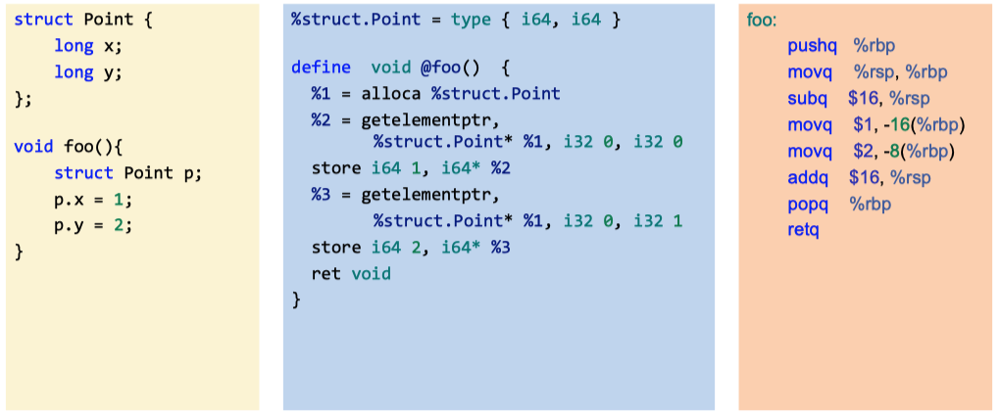{width=50%}

_Remarks:_

- `%1` in this case corresponds to `-16(%rbp)`: `getelementptr -> base address + offset`
- _Compilation of GEP:_
  1. Translate GEP's base pointer to an actual address (e.g. a stack slot)
  2. Compute the offset specified by the indices and add it to the base address

#### Array Indexing

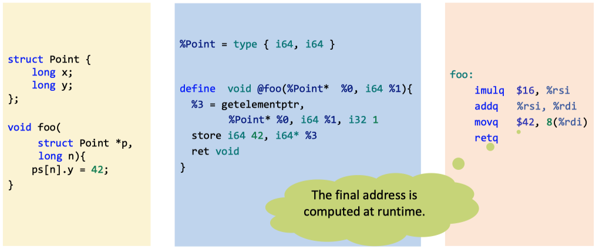{width=50%}

#### If-statements and Loops

- If-statements and loops correspond to branching in the CFG
- Basic blocks are mostly generated independently
- The resulting x86 BB's are connected via jumps

_Example:_

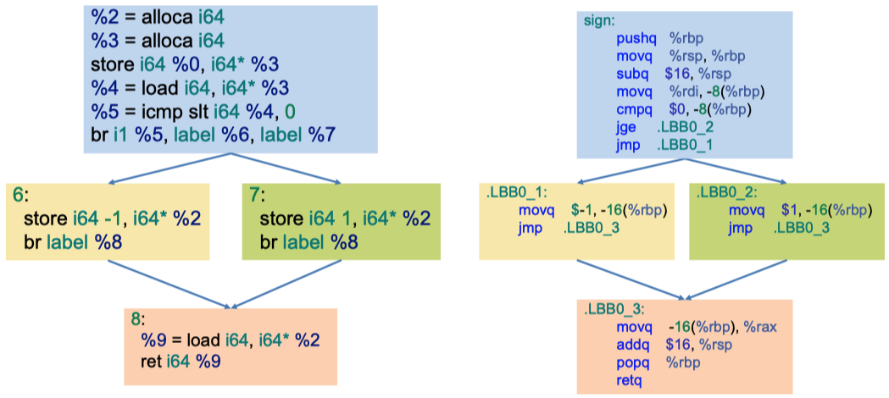{width=50%}

# 6. Lexing

## 6.1 Compilation in a Nutshell

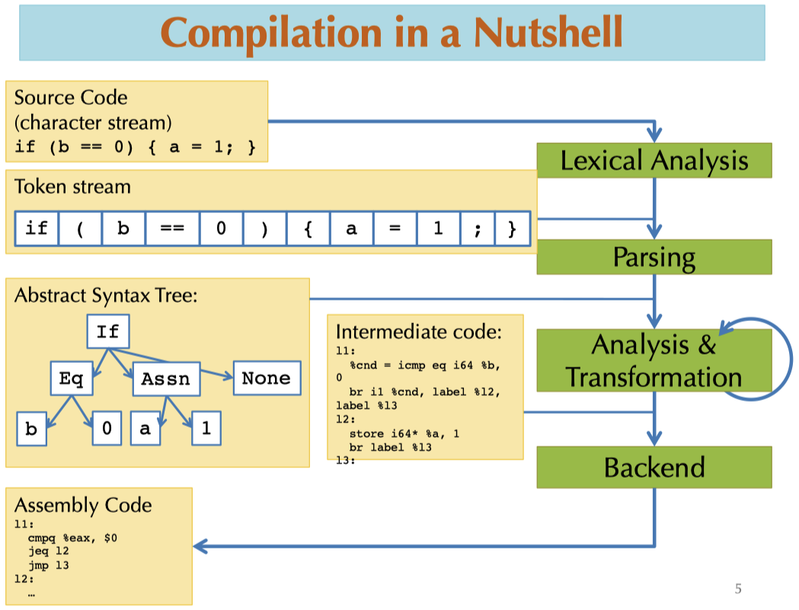{width=50%}

## 6.2 Lexical Analysis

The first step of lexing is the **lexical analysis**. Its goal is to change the _character stream_, e.g. "`if (b == 0) a = 1;`" into _tokens:_

```bnf
if (b == 0) a = 1;
=>
IF; LPAREN; Ident("b"); EQEQ; Int(0); RPAREN; LBRACE; Ident("a"); Eq; Int(1); Semi; RBRACE;
```

A **token** is a data type that represents indivisible chunks of text;

- Identifiers; `a y11 elsex _100`
- Keywords: `if else while`
- Integers: `2 200 -500 5L`
- Floating point: `2.0 .02 1e5`
- Symbols: `+ * { } ( ) ++ << >> >>>`
- Strings: `"x" "He said, \"Are you?\""`
- Comments: `(* Compiler Design: Project 1 ...*)`

Often delimited by _whitespace_ (`' ', \t` etc.). In some languages (e.g. Python or Haskell) whitespace is significant!

## 6.3 Principled Solution to Lexing

### 6.3.1 Regular Expressions

**Regular expressions** precisely describe sets of strings. A regular expression `R` has one of the following forms:

- $\epsilon$ : stands for the empty string
- `'a'` : an ordinary character stands for itself
- `R_1 | R_2` : alternatives, stands for a choice of `R_1` or `R_2`
- `R_1R_2` : concatenation, stands for `R_1` or `R_2`
- `R*` : Kleene start, stands for zero or more repetitions of `R`

There are some useful extensions to the above-mentioned forms:

- `"foo"` : strings, equivalent to `'f''o''o'`
- `R+` : one or more repetitions of `R`, equivalent to `RR*`
- `R?` : zero or one occurrence of `R`, equivalent to ($\epsilon$ | R)
- `['a'-'z']` : one of `a`, `b`, ..., or `z`, equivalent to `(a|b|...|z)`
- `[^'0'-'9']` : any character except `0` through `9`
- `R as x` : name the string matched by `R` as `x`

_Examples:_

- Recognize the keyword "if" : `"if"`
- Recognize a digit: `['0'-'9']`
- Recognize an integer literal: `'-'?['0'-'9']+`

In practice, it is useful to _name_ regular expressions:

```bnf
let lowercase = ['a'-'z']
let uppercase = ['A'-'Z']
let character = uppercase | lowercase
```

### 6.3.2 Chomsky Hierarchy

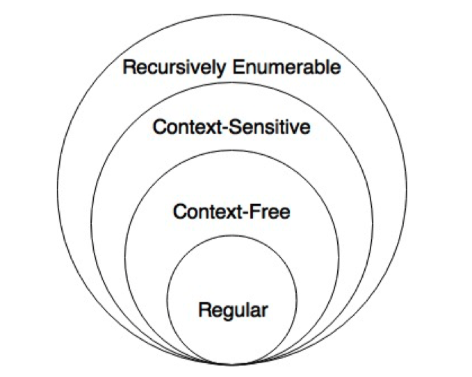{width=50%}

### 6.3.3 How to Match?

Consider the input string "`ifx = 0`". We could lex this input as either `'if''x''=''0'` or as `'ifx''=''0'`. Thus, regular expressions alone can be ambiguous. We need a rule for choosing between the options above:

- Most languages choose the **longest match**
- In that case, the second option would be chosen above

We get **conflicts** with tokens whose regular expressions have a shared prefix. How do we resolve this?

- Ties are broken by giving some matches higher priority (example, give keywords priority over identifiers)
- Usually specified by the order the rules appear in the lex input file

## 6.4 Lexer Generator

The **lexer generator** reads a list of regular expressions: `R_1, ..., R_n`, one per token.
Each token has an attached _action_ `A_i`, which is simply a piece of code to run when the regular expression is matched:

```bnf
rule token = parse
    | '-'?digit+                        { Int (Int32.of_string(lexeme lexbuf)) }
    | '+'                               { PLUS }
    | 'if'                              { IF }
    | character (digit|character|'_')*  { Ident(lexeme lexbuf) }
    | whitespace+                       { token lexbuf }
```

## 6.5 Finite Automata

### 6.5.1 Deterministic Finite Automaton

A **deterministic finite automaton** (DFA) can be represented as:

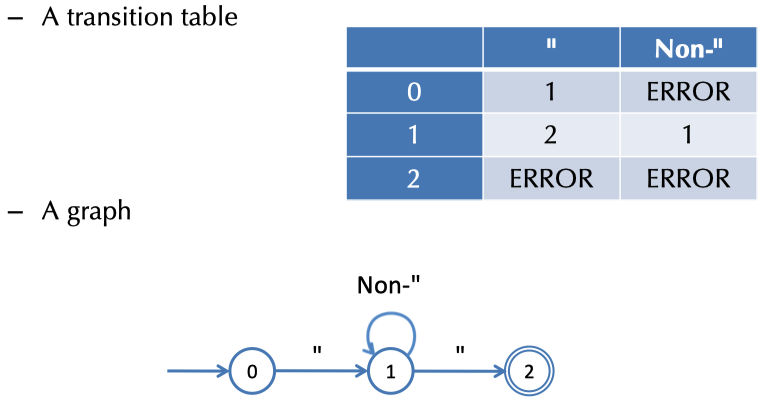{width=50%}

> We can build a finite automaton for every regular expression!

### 6.5.2 Nondeterministic Finite Automaton

A **nondeterministic finite automaton** (NFA) is built the same way as a DFA (i.e. finite set of states, start state, accepting states, transition arrows connecting states, etc.). However, different to DFA's, NFA's can have two arrows leaving the same state with the same label!

Sums and Kleene stars can easily be represented with NFA's:

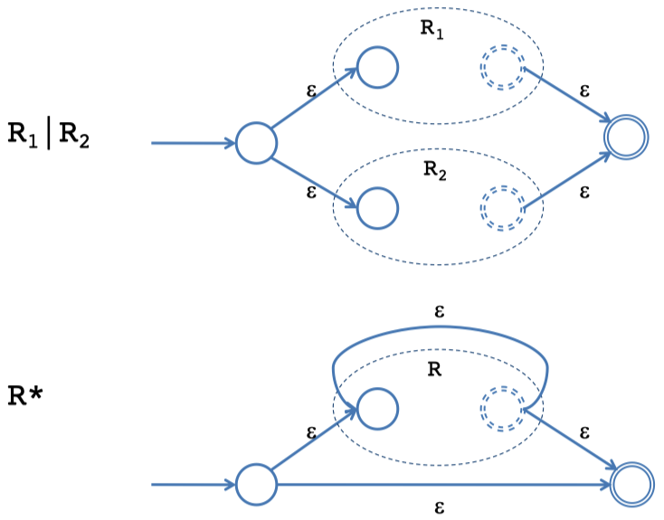{width=50%}

### 6.5.3 DFA vs. NFA

- _DFA_
  - action of the automaton for each input is fully determined
  - accepts if the input is consumed upon reaching an accepting state
  - obvious table-based implementation
- _NFA_
  - automaton potentially has a choice at every step
  - accepts an input if there exists a way to reach an accepting state
  - less obvious how to implement efficiently

### 6.5.4 NFA to DFA conversion

The idea to convert a NFA to a DFA is to run all possible executions of the NFA in "parallel" and meanwhile keep track of a set of possible states (so-called "finite fingers").

_Example:_ Consider `-?[0-9]+`:

{width=50%}

## 6.6 Summary of Lexer Generator Behavior

1. Take each regular expression `R_i` and its action `A_i`
2. Compute the NFA formed by `(R_1 | R_2 | ... | R_n)`
3. Compute the DFA for the big NFA computed in the previous step
4. Compute the minimal equivalent DFA
5. Produce the transition table
6. Implement the longest match
   1. Start from initial state
   2. Follow transitions, remember the last accepted state entered
   3. Accept the input until no transition is possible
   4. Perform the highest-priority action associated with the last accepted state

# 7. Parsing

**Parsing** describes the process of finding a syntactic structure, such as an **abstract syntax tree** (AST).

## 7.1 Overview

Parsing, i.e. syntactic analysis, works as follows:

- Input: stream of tokens
- Output: abstract syntax tree

The strategy is to parse the token stream to traverse the "concrete" syntax. During the traversal, we build a tree representing the "abstract" syntax.

However, for this to work, we need to know how our concrete syntax looks like. In other words, we need to describe our language syntax precisely and conveniently.

## 7.2 Context Free Grammars

### 7.2.1 Overview

The idea of **context free grammars** (CFG) is to derive a string in the language starting from some element and rewrite it according to the given rules.

_Example:_ Consider the specification of the language of balances `parens`:

$$
\text{S} \to (\text{S})\text{S} \\ \text{S} \to \epsilon
$$

A derivation could look like:

$$
\text{S} \to (\text{S})\text{S} \to ((\text{S})\text{S})\text{S} \to ((\epsilon)\text{S})\text{S} \to ((\epsilon)\text{S})\epsilon \to ((\epsilon)\epsilon)\epsilon = (())
$$

### 7.2.2 CFG's Mathematically

A **context free grammar** (CFG) consists of:

- a set of _terminals_
- a set of _nonterminals_
- a designated nonterminal called the _start symbol_
- a set of _productions_ `LHS -> RHS`:
  - LHS is a nonterminal
  - RHS is a string of terminals and nonterminals

_Example:_ A grammar that accepts parenthesized sums of numbers:

$$
\text{S} \to \text{E} + \text{S} \, | \, \text{E} \\ \text{E} \to \text{number} \, | \, (\text{S})
$$

### 7.2.3 Derivations

For arbitrary strings $\alpha, \, \beta, \, \gamma$ and production rule $A \to \beta$, a **single step of derivation** is:

$$
\alpha A \gamma \to \alpha \beta \gamma
$$

We might represent a derivation as a tree where:

- Leaves: terminals
- Internal nodes: nonterminals

_Example:_ Derivation tree of `(1 + 2 + (3 + 4)) + 5`:

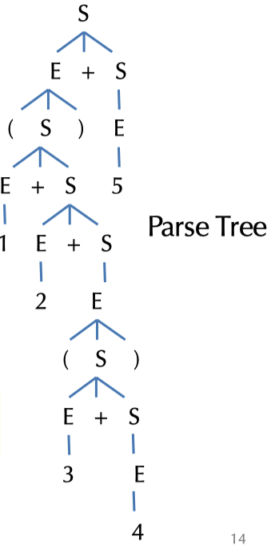{width=50%}

#### From Parse Trees to Abstract Syntax Trees

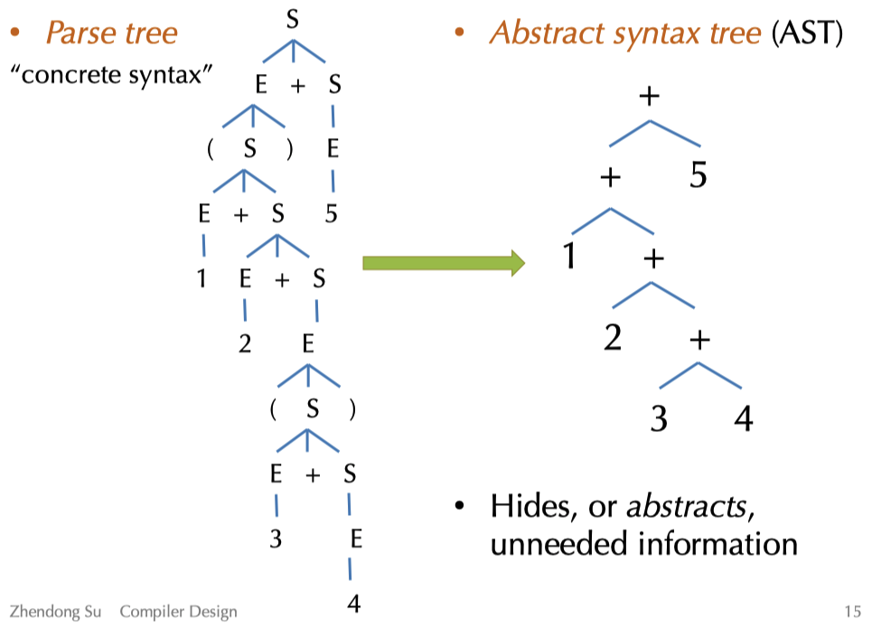{width=50%}

#### Derivation Orders

Production of a grammar can be applied in any order, however, there are two standard orders:

- _Leftmost derivation_: Find the left-most nonterminal and apply a production to it
- _Rightmost derivation_: Find the right-most nonterminal and apply a production there

_Remark_: Both strategies and any other order yield the same parse tree!

### 7.2.4 Loops and Termination

Some care is needed when defining CFG's:

$$
\text{S} \to \text{E} \\ \text{E} \to \text{S}
$$

- This grammar has nonterminal definitions that are _non-productive_, i.e. they don't mention any terminal symbols
- There is no finite derivation starting from $\text{S}$, so the language is empty

$$
\text{S} \to (\text{S})
$$

- This grammar is productive, but again there is no finite derivation string from $\text{S}$, so the language is _empty_

## 7.3 Grammars for Programming Languages

### 7.3.1 Associativity

Consider the following grammar:

$$
\text{S} \to \text{E} + \text{S} \, | \, \text{E} \\ \text{E} \to \text{number} \, | \, (\text{S})
$$

This grammar makes the `+` _right associative_, i.e. the AST is the same for both `1 + 2 + 3` and `1 + (2 + 4)`. Note also that the grammar is _right recursive_ due to the production $\text{S} \to \text{E} + \text{S}$.

How would we make the `+` _left associative_? Simple:

$$
\text{S} \to \text{S} + \text{E} \, | \, \text{E} \\ \text{E} \to \text{number} \, | \, (\text{S})
$$

### 7.3.2 Ambiguity

Consider the following grammar:

$$
\text{S} \to \text{S} + \text{S} \, | \, (\text{S}) \, | \, \text{number}
$$

This accepts the same set of strings as the previously mentioned grammar. We can get both right and left associativity for the `+` operator.

> **Non-ambiguous** means that for every input string, there is only one way to parse it!

However, not all operations are associative. Moreover, if there are multiple operations, ambiguity in the grammar leads to ambiguity in their _precedence_.

Consider the grammar:

$$
\text{S} \to \text{S} + \text{S} \, | \, \text{S} * \text{S} \, | \, (\text{S}) \, | \, \text{number}
$$

The input `1 + 2 * 3` might be parsed either:

- `(1 + 2) * 3 = 9`
- `1 + (2 * 3) = 7`

#### Eliminating Ambiguity

We can often eliminate ambiguity by adding nonterminals and allowing recursion only on the left (or right).

To disambiguate the previously introduced grammar:

- Decide to make `*` higher precedence than `+`
- Make `+` left associative
- Make `*` right associative

_Note_: `S_2` corresponds to "atomic" expressions:

$$
S_0 \to S_0 + S_1 \, | \, S_1 \\ S_1 \to S_2 * S_1 \, | \, S_2 \\ S_2 \to \text{number} \, | \, (S_0)
$$

# 8. LL & LR Parsing

## 8.1 LL(1) Grammars

One problem with grammars is that not all grammars can be parsed "top-down" with a _single lookahead_. _Top-down_ means that we start from the start symbol, i.e. the root of the parse tree, and go down.

**LL(1)** means:

- Left-to-right scanning
- Left-most derivation
- 1 lookahead symbol

### 8.1.1 Making a Grammar LL(1)

The main problem is that we can't decide which $S$ production to apply until we see the symbol after the first expression. The solution is to _left-factor_ the grammar. There is a common $S$ prefix for each choice, so add a new non-terminal $S'$ at the decision point:

This means that we transform our example grammar

$$
S \to E + S \, | \, E \\ E \to \text{number} \, | \, (S)
$$

to the following "left-factor" grammar:

$$
S \to ES' \\ S' \to \epsilon \\ S' \to + S \\ E \to \text{number} \, | \, (S)
$$

However, we also need to _eliminate left-recursion_ somehow. In general, this is done by rewriting the following left-recursive rule

$$
S \to S \alpha_1 \, | \, \cdots \, | \, S \alpha_n \, | \, \beta_1 \, | \, \cdots \, | \, \beta_m
$$

to a rule of the form:

$$
S \to \beta_1 S' \, | \, \cdots \, | \, \beta_m S' \\ S' \to \alpha_1 S' \, | \, \cdots \, | \, \alpha_n S' \, | \, \epsilon
$$

In our running example, this would mean to rewrite

$$
S \to S + E \, | \, E \\ E \to \text{number} \, | \, (S)
$$

to the following left-recursion-eliminating grammar:

$$
S \to ES' \\ S' \to +ES' \, | \, \epsilon \\ E \to \text{number} \, | \, (S)
$$

### 8.1.2 Predictive Parsing

Given an LL(1) grammar:

- For a given non-terminal, the lookahead symbol uniquely determines the production to apply
- The parsing is driven by a predictive parsing table
- It is convenient to add a special _end-of-file token_ $ and a start symbol $T$ that requires $

_Example:_ Let us look at the following LL(1) grammar:

$$
T \to S\$ \\ S \to ES' \\ S' \to \epsilon \\ S' \to + S \\ E \to \text{number} \, | \, (S)
$$

We then propose the following **predictive parsing table:**

|      | **number**          | **+**     | **(**     | **)**          | **$ (EOF)**    |
| ---- | ------------------- | --------- | --------- | -------------- | -------------- |
| $T$  | $\to S$           |           | $\to S$ |                |                |
| $S$  | $\to ES'$           |           | $\to ES'$ |                |                |
| $S'$ |                     | $\to + S$ |           | $\to \epsilon$ | $\to \epsilon$ |
| E    | $\to \text{number}$ |           | $\to (S)$ |                |                |

### 8.1.3 Construction of Parse Table

How do we construct the parse table? We examine two possible cases by considering the following production: $A \to \gamma$

#### Case 1

Construct the set of all input tokens that may appear _first_ in strings that can be derived from $\gamma$. Then add the production $\to \gamma$ to the entry $(A, \, \text{token})$ for each such token.

#### Case 2

If $\gamma$ can derive $\epsilon$, then we construct the set of all input tokens that may _follow_ the nonterminal $A$ in the grammar. We then add the production $\to \gamma$ to the entry $(A, \, \text{token})$ for each such token.

_Note:_ If there are two different productions for a given entry, then the grammar is not LL(1).

_Example:_

{width=50%}

### 8.1.4 Converting The Parsing Table to Code

When we want to convert a parsing table to code, we proceed as follows:

- Define $N$ mutually recursive functions, one for each non-terminal $A$: `parse_A`
- `parse_A` is of type `unit -> ast` if £A$ is not an auxiliary non-terminal
- Otherwise, `parse_A` takes additional ast's as inputs, one for each non-terminal in the "factored" prefix

Then, each function `parse_A`:

- "Peeks" at the lookahead token
- Follows the production rule in the corresponding entry
- Consumes the terminal tokens from the input stream
- Calls `parse_X` to create the sub-tree for the non-terminal $X$
- If the rule ends in an auxiliary non-terminal, it is called with the appropriate ast's
- Otherwise, this function builds the ast tree itself and returns it

### 8.1.5 LL(1) Summary

**LL(1)** is top-down based parsing that finds the left-most derivation. The process proceeds with the following steps:

1. Language grammar =>
2. LL(1) grammar =>
3. Prediction table =>
4. Recursive-descent parser

## 8.2 LR Grammars

### 8.2.1 Bottom-up Parsing

**LR(k) parser** are _bottom-up parser_:

- Left-to-right scanning
- Right-most derivation
- k lookahead symbols

LR grammars are _more expressive_ than LL grammars:

- They can handle left-recursive (and right-recursive) grammars (i.e. virtually all programming languages)
- They make it easier to express programming language syntax (e.g. no left factoring)

The most common technique are **Shift-Reduce parsers:**

- Work bottom up instead of top down
- Construct the right-most derivation of a program in the grammar
- Better error detection/recovery

### 8.2.2 Shift/Reduce Parsing

In shift/reduce parsing, the parser has a **parser state** described as follows:

- Stack of terminals and non-terminals
- Unconsumed input is a string of terminals
- The current derivation step is `stack + input`

**Parsing** is a sequence of `shif` and `reduce` operations:

- Shift: Move lookahead token to the stack
- Reduce: Replace symbols $\gamma$ at the top of the stack with a non-terminal $X$ s.t. $X \to \gamma$ is a production, i.e. `pop gamma, push X`

_Example:_ We consider our previous example

$$
S \to S + E \, | \, E \\ E \to \text{number} \, | \, (S)
$$

{width=50%}

## 8.3 LR(0) Grammars

### 8.3.1 LR Parser States

Our goal it is to know _what set of reductions are legal_ at any given point. The idea to solve this problem is to summarize all possible stack prefixes $\alpha$ as a finite parser state:

- The parser state is computed by a DFA that reads the stack $\sigma$
- Accept states of the DFA correspond to unique reductions that apply

### 8.3.2 Example LR(0) Grammar: Tuples

The following grammar is an example grammar for non-empty tuples and identifiers:

$$
S \to (L) \, | \, \text{id} \\ L \to S \, | \, L, \, S
$$

Now, if we apply parsing as a sequence of shift and reduce operations, we end up with the following parse operation:

{width=50%}

### 8.3.3 Action Selection Problem

Given a stack $\sigma$ and a lookahead symbol $b$, should the parser either:

- Shift $b$ onto the stack (new stack is $\sigma b$), or
- Reduce a production $X \to \gamma$, assuming that $\sigma = \alpha \gamma$ (new stack is $\alpha X$) ?

The main idea to solve this problem is to decide based on a prefix $\alpha$ of the stack plus the lookahead. The prefix $\alpha$ is different for different possible reductions since in productions $X \to \gamma$ and $Y \to \beta$, $\gamma$ and $\beta$ might have different lengths.

### 8.3.4 LR(0) States

An **LR(0) state** consists of items to track progress on possible upcoming reductions. An **LR(0) item** is a production with an extra separator `.` in the RHS. Example items could be: $S \to .(L)$ or $S \to (.L)$ or $L \to S.$

The intuition for the meaning of the dot is:

- Stuff before the `.` is already on the stack
- Stuff after the `.` is what might be seen next

### 8.3.5 Constructing The DFA

We will consider the following grammar:

$$
S' \to S \$ \\ S \to (L) \, | \, \text{id} \\ L \to S \, | \, L, \, S
$$

The first step when creating the DFA is to add a new production $S' \to S$ to the grammar. The _start state_ of the DFA is the empty stack, so it contains the item $S' \to .S$. We then proceed to add the **closure of the state** to our DFA:

- Add items for all productions whose LHS non-terminal occurs in an item in the state just after the `.` (e.g. $S$ in $S' \to .S$)
- The added items have the `.` located at the beginning
- Note that newly added items may cause yet more items to be added to the state, we keep iterating until a _fixed point_ is reached

_Example:_

$$
\text{Closure}(\{S' \to .S \$ \}) = \{S' \to .S \$, \, S \to .(L), \, S \to .\text{id} \}
$$

Next we need to add the _transitions:_

1. First, we see what terminals and non-terminals can appear after the `.` in the source state.
2. The target state initially includes all items from the source state that have the edge-label symbol after the `.`, but we advance the `.` to simulate shifting the item onto the stack.
3. Finally, for each new state, we again take the closure of it.

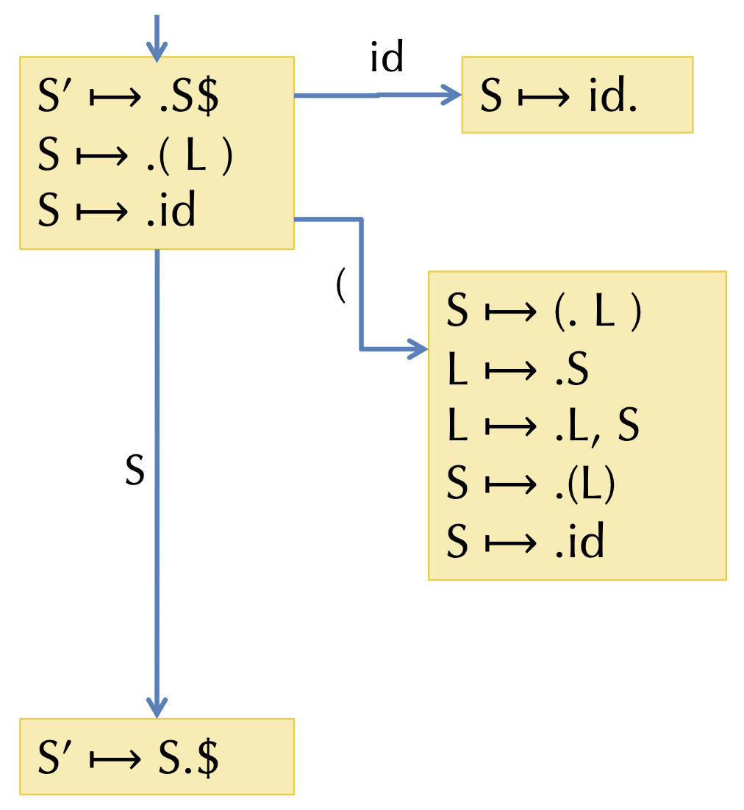{width=50%}

By continuing the above approach, we will reach the following **full DFA** for our example:

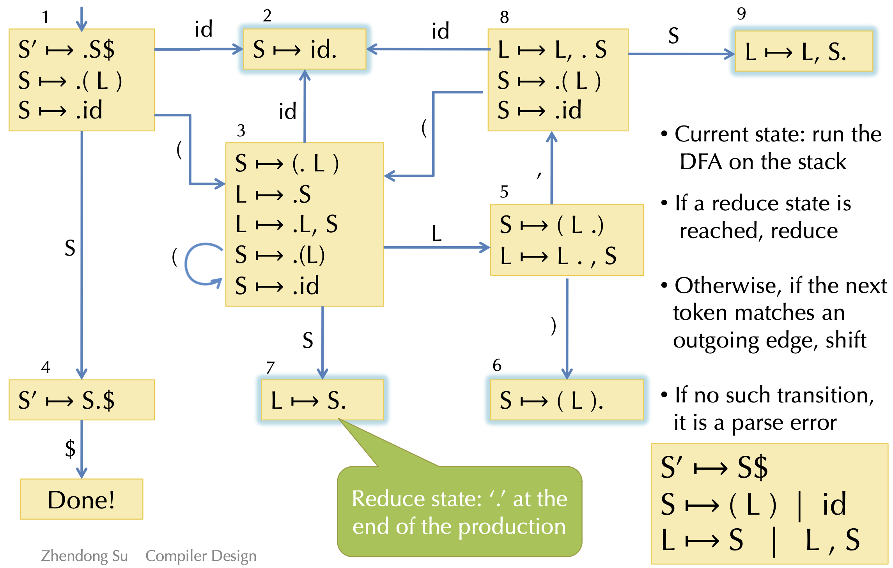{width=50%}

### 8.3.6 Using The DFA

To use our DFA now, we run the parser stack $\sigma$ through the DFA. The resulting state tells us what productions may be reduced next:

- If not in a reduce state, we shift the next symbol and transition w.r.t. the DFA
- If in a reduce state, $X \to \gamma$ with stack $\alpha \gamma$, we `pop gamma` and `push X`

**Optimization:** There is no need to rerun the DFA from the beginning at each step. We might simply store the state with each symbol on the stack, e.g. $_1(_3)_3L_5)_6$. Then:

- On a reduction $X \to \gamma$, we `pop` the stack to reveal the state too, e.g. from stack $_1(_3)_3L_5)_6$ we reduce $S \to (L)$ to reach stack $_1(_3$
- Next, we push the reduction symbol, e.g. to reach the stack $_1(_3S$
- Then we take just one step in the DFA to find the next state $_1(_3S_7$

### 8.3.7 Implementing The Parsing Table

We represent the DFA as a table of shape `state * (terminals + nonterminals)`.

Entries for the **action table** specify two kinds of actions:

- Shift and go to state $n$
- Reduce using the reduction $X \to \gamma$: First, `pop gamma` of the stack to reveal the state, second, look up $X$ in the **goto table** and go to that state

_Example:_

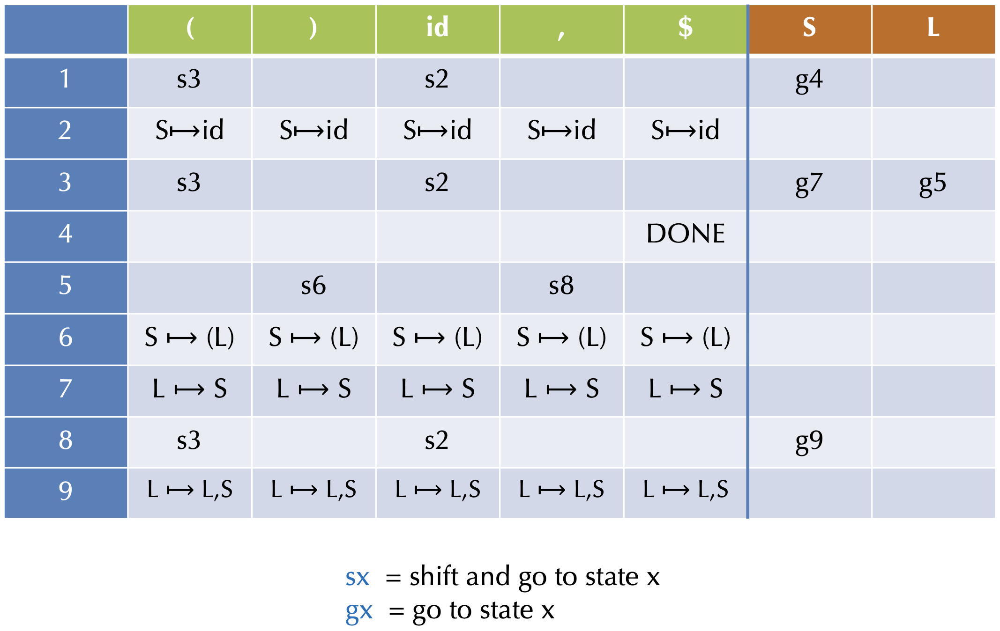{width=50%}

### 8.3.8 LR(0) Limitations

An LR(0) machine only works if states with reduce actions have a _single_ reduce action. In such states, the machine always reduces, ignoring lookahead.

With more complex grammars, the DFA construction will yield states with _sift/reduce_ and _reduce/reduce_ problems:

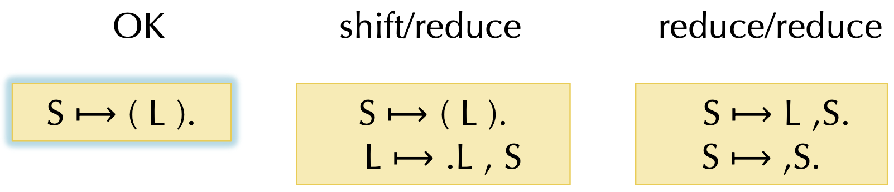{width=50%}

## 8.4 LR(1) Parsing

The algorithm for **LR(1) parsing** is similar to LR(0) DFA construction:

- LR(1) state is the set of all LR(1) items
- An LR(1) item is an LR(0) item plus a set of lookahead symbols, i.e. $A \to \alpha.\beta, \, \mathcal{L}$

However, the **LR(1) closure** is a little more complex:

1. We first form the set of items just as we did in the LR(0) algorithm
2. Whenever a new item $C \to .\gamma$ is added, because the item $A \to \beta.C \delta, \, \mathcal{L}$ is already in the set, we need to compute its lookahead set $\mathcal{M}$:
   1. The lookahead set $\mathcal{M}$ includes $\text{FIRST}(\delta)$, i.e. the set of terminals that may start strings derived from $\delta$
   2. If $\delta$ is or can derive $\epsilon$, then the lookahead $\mathcal{M}$ also contains $\mathcal{L}$

### 8.4.1 Example Closure in LR(1)

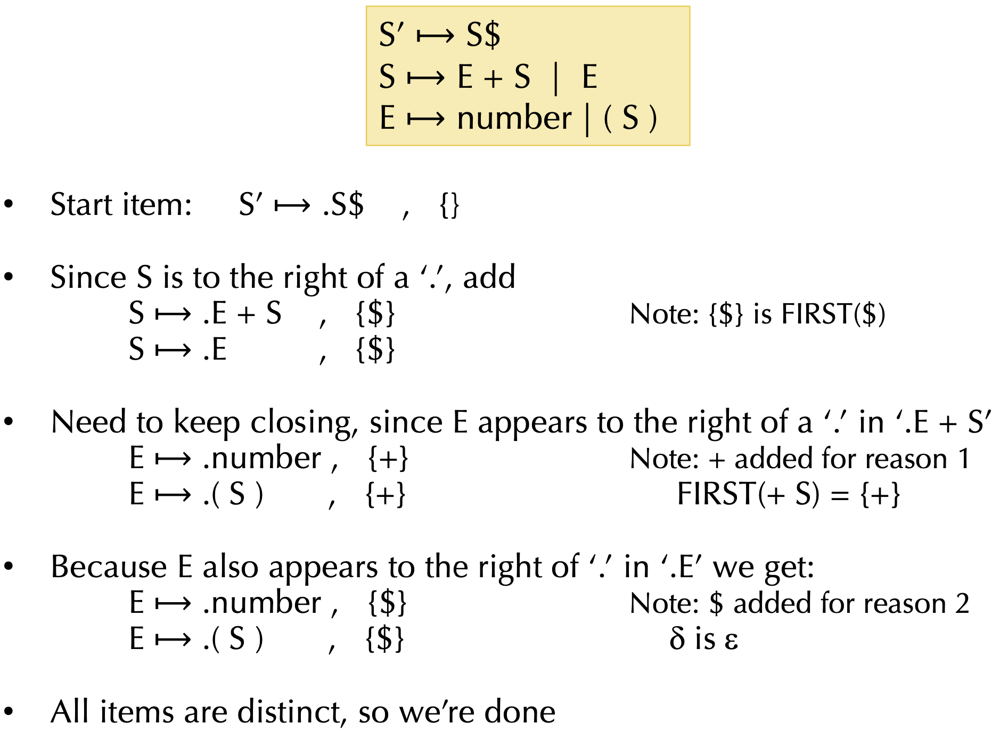{width=50%}

### 8.4.2 Using The DFA

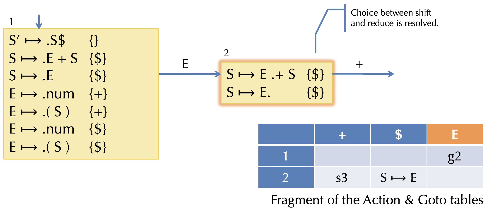{width=50%}

The behavior is determined if:

- There is no overlap among the lookahead sets for each reduce item, and
- None of the lookahead symbols appear to the right a `.`

### 8.4.3 LR Variant: LALR(1)

Consider for example the following two LR(1) states:

$$
S_1: \quad \{[X \to \alpha., \, a], \, [Y \to \beta., \, c]\} \\ S_2: \quad \{[X \to \alpha., \, b], \, [Y \to \beta., \, d] \}
$$

They have the same core and can therefore be _merged_. The merged state contains:

$$
\{[X \to \alpha., \, a/b], \, [Y \to \beta., \, c/d] \}
$$

These are so-called **LALR(1)** states. Typically, there are 10 times fewer LALR(1) states than LR(1). However, LALR(1) may introduce new reduce/reduce conflicts (but not new shift/reduce conflicts).

# 9. Menhir In Practice

## 9.1 Menhir Output

You can get verbose ocamlyacc debugging information by doing:

```console
menhir --examplain
```

or, if using `ocamlbuild`:

```console
ocamlbuild -use-menhir -yaccflag --explain
```

The result is a `<basename>.conflicts` file describing the error. The flag `--dump` generates a full description of the automaton.

## 9.2 Precedence and Associativity Declarations

Parser generators often support **precedence/associativity declarations**. Those hint to the parser about how to resolve conflicts.

- Pros:
  - Avoids having to manually resolve those ambiguities by manually introducing extra non-terminals
  - Easier to maintain the grammar
- Cons:
  - Can't as easily re-use the same terminal
  - Introduces another level of debugging


# 10 Untyped Lambda Calculus

## 10.1 Functional Languages

Languages like ML, Haskell, Scheme, Python etc. support different operations on and with functions:

- Functions can be passed as arguments (e.g. `map` or `fold`)
- Functions can be returned as values (e.g. `compose`)
- Functions can be nested, i.e. inner functions refer to variables bound in the outer function

_Example:_

```ocaml
let add = fun x -> fun y -> x + y
let inc = add 1
let dec = add -1

let compose = fun f -> fun g -> fun x -> f (g x)
let id = compose inc dec
```

But how do we implement such functions in an interpreter or in a compiled language?

## 10.2 Lambda Calculus

The **lambda calculus** is a minimal programming language. It has variables, functions, and function application. That's it! It is, however, still touring complete.

The abstract syntax in OCaml is:

```ocaml
type exp =
    | Var of var        (* variables *)
    | Fun of var * exp  (* functions: fun x -> e *)
    | App of exp * exp  (* function application *)
```

The concrete syntax is:

```bnf
exp ::=
    | x
    | fun x -> exp
    | exp_1 exp_2
    | (exp)
```

## 10.3 Values and Substitution

The only **values** of the lambda calculus are (closed) functions:

```bnf
val ::=
    | fun x -> exp
```

To **substitute** value `v` for variable `x` in expression `e`:

- Replace all _free occurrences_ of `x` in `e` by `v`
- In OCaml written as `subst v x e`

Function application is interpreted by substitution:

```bnf
(fun x -> fun y -> x + y) 1
= subst 1 x (fun y -> x + y)
= (fun y -> 1 + y)
```

## 10.4 Lambda Calculus Operational Semantics

{width=50%}

## 10.5 Free Variables and Scoping

We look at the following example code:

```ocaml
let add = fun x -> fun y -> x + y
let inc = add 1
```

The result of `add 1` is a function. After calling `add`, we can't throw away its arguments (or its local variables) because those are needed in the function returned by `add`.

- We say that variable `x` is **free** in `fun y -> x + y` (the variable is defined in the outer scope)
- We say that variable `y` is **bound** by `fun y`. Its scope is the body `x + y` in `fun y -> x + y`

A term with no free variables is called **closed**. In contrast, a term with one or more free variables is called **open**.

## 10.6 Free Variable Calculation

The following OCaml code computes the set of free variables in lambda expressions:

```ocaml
let rec free_vars (e:exp) : VarSet.t =
    begin match e with
        | Var x         -> VarSet.singleton x
        | Fun (x, body) -> VarSet.remove x (free_vars body)
        | App (e1, e2)  -> VarSet.union (free_vars e1) (free_vars e2)
    end
```

We then say a lambda expression `e` is _closed_ if `free_vars e` is `VarSet.empty`.

## 10.7 Variable Capture

Note that if we try to naively substitute an open term, a bound variable might **capture** the free variables. Example:

```bnf
(fun x -> (x y)) {(fun z -> x)/y}   // x is free in (fun z -> x)
= fun x -> (x (fun z -> x))         // the free x is now captured
```

This is usually not the desired behavior! The meaning of `x` is determined by where it is bound dynamically, not where it is bound statically (_dynamic scoping_).

## 10.8 Alpha Equivalence

Note that the names of bound variables don't matter. `(fun x -> y x)` is the same as `(fun z -> y z)`.
Two terms that differ only by consistent renaming of bound variables are called **alpha equivalent.**

However, the names of free variables do matter! `(fun x -> y x)` is not the same as `(fun x -> z x)`.

## 10.9 Fixing Substitution

We can fix the substitution problem. For this, let us consider the following substitution operation: $e_1{e_2/x}$

To avoid capture, we define the substitution to pick an alpha equivalent version of $e_1$, such that the bound names of $e_1$ don't mention the free names of $e_2$. Then we can do the simple naive substitution.

_Example:_

```bnf
(fun x -> (x y)) {(fun z -> x)/y}
= (fun x' -> (x' (fun z -> x)))     // rename x to x'
```

## 10.10 Operational Semantics

{width=50%}

## 10.11 Adding Integers to Lambda Calculus

We might extend our previously described Lambda Calculus with **integer values** by modifying our previous definitions in the following way:

```bnf
exp ::=
    | ...
    | n             // constant integers
    | exp1 + exp2   // binary arithmetic operation

val ::=
    | fun x -> exp  // functions are values
    | n             // integers are values

n{v/x} = n          // constants have no free variables
(e1 + e2){v/x} = (e1{v/x} + e2{v/x})
```

# 11. Static Analysis

## 11.1 Variable Scoping

We have the following problem: How do we determine whether a declared variable is in scope?

_Example:_ The code below is syntactically correct, but not well-formed! `y` and `q` are used without being defined anywhere.

```c
int fact(int x) {
    var acc = 1;
    while(x > 0) {
        acc = acc * y;
        x = q - 1;
    }
    return acc;
}
```

## 11.2 Contexts and Inference Rules

We somehow need to keep track of **contextual information**, i.e. what variables are in the current scope and what their types are.

One way to describe this is that the compiler keeps a mapping from variables to information about them using a **symbol table.**

### 11.2.1 Inference Rules

A **judgement** is of the form $G;L \vdash e : t$ is read as "_the expression `e` is well typed and has type `t`_".

For any **environment** $G;L$, expression `e`, and statements `s1, s2`:

$$
G;L;rt \vdash \text{if } (e) \, s_1 \text{ else } s_2
$$

holds if $G;L \vdash e : \text{bool}$, $G;L;rt \vdash s_1$, $G;L;rt \vdash s_2$ all hold.

More succinctly, we can summarize these constraints as an **inference rule:**

$$
\frac{G;L \vdash e : \text{bool} \quad G;L;rt \vdash s_1 \quad G;L;rt \vdash s_2}{G;L;rt \vdash \text{if } (e) \, s_1 \text{ else } s_2}
$$

### 11.2.2 Checking Derivations

We can build a **derivation tree** by making the nodes to be judgements and the edges to connect premises to a conclusion (according to the inference rules). Leaves of the tree are **axioms**, i.e. rules with no premises. The goal of the **type checker** is to verify that such a _tree exists._

### 11.2.3 Compilation as Translating Judgements

Consider the typing judgement for source expressions: $C \vdash e : t$. How do we interpret this information in the target language? I.e. $[[C \vdash e : t]] = \, ?$ We have that:

- $[[t]]$ is a target type
- $[[e]]$ translates to a (possibly empty) sequence of instructions

We can state the following _invariant:_ If $[[C \vdash e : t]] = \text{ ty, operand, stream}$, then the type of the operand is $ty = [[t]]$.

_Example:_ What is $[[C \vdash 341 + 5 : int]]$ ?

{width=50%}

### 11.2.4 Contexts

What is $[[C]]$ ? Source level $C$ has bindings like $x:\text{ int}, \, y:\text{ bool},$ etc. $[[C]]$ maps source identifiers $x$ to source types $[[x]]$.

The interpretation of a variable $[[x]]$ can is:

{width=50%}

### 11.2.5 Other Judgements

_Establish invariant for expressions:_

{width=50%}

_Statements:_

{width=50%}

{width=50%}

_Declaration:_

{width=50%}

## 11.3 Compiling Control

### 11.3.1 Translating while

{width=50%}

### 11.3.2 Translating If-Then-Else

{width=50%}

## 11.4 Optimizing Control

### 11.4.1 Standard Evaluation

Consider compiling the following program fragment:

```c
if(x & !y | !w) {
    z = 3;
} else {
    z = 4;
}
return 7;
```

```llvm
    %tmp1 = icmp Eq [[y]], 0
    %tmp2 = and [[x]], %tmp1
    %tmp3 = icmp Eq [[w]], 0
    %tmp4 = or %tmp2, %tmp3
    %tmp5 = icmp Eq %tmp4, 0
    br %tmp5, label %else, label %then

then:
    store [[z]], 3
    br %merge

else:
    store [[z]], 4
    br %merge

merge:
    %tmp6 = laod [[z]]
    ret %tmp 6
```

What we observe is that usually, we want the translation `[[e]]` to produce a value $[[C \vdash e_1 + e_2 : int]] = (\text{ty, operand, stream})$ = `i64, %tmp, [%tmp = add [[e1]] [[e2]]])`. 

But, when the compiled expression appears in a test, the program jumps to one label or another after the comparison (besides that, it never uses the value). In many cases, we can avoid _materializing_ the value (i.e. storing it in a temporary) and thus produce better code.

### 11.4.2 Short Circuit Boolean Compilation

Instead of the usual expression translation of the form:

$$[[C \vdash e : t]] = (\text{ty, operand, stream})$$

we can use a _conditional branch translation of Booleans,_ without materializing the value:

$$[[C \vdash e : \text{bool}@]] \text{ Itrue Ifalse} = \text{stream}$$
$$[[C, \, rt \vdash \text{if } (e) \text{ then } s_1 \text{ else } s_2 \Rightarrow C']] = [[C']]$$

This takes two extra arguments, namely the "true" branch label and the "false" branch label, and doesn't return a value.

#### Expressions

{width=50%}

#### Evaluation

{width=50%}

If we reconsider our previous code example, we might translate it, using short circuit evaluation, into the following code fragment:

```llvm
    %tmp1 = icmp Eq [[x]], 0
    br %tmp1, label %right2, label %right1

right1:
    %tmp2 = icmp Eq [[y]], 0
    br %tmp2, label %then, label %right2

right2:
    %tmp3 = icmp Eq [[w]], 0
    br %tmp3, label %then, label %else

then:
    store [[z]], 3
    br %merge

else:
    store [[z]], 4
    br %merge

merge:
    %tmp5 = load [[z]]
    ret %tmp6
```

## 11.5 Closure Conversion

As we have already seen, in functional languages such as ML, Haskell, Scheme, Python, etc, functions can be:

- passed as arguments (such as `map` or `fold`)
- returned as values (such as `compose`)
- nested, i.e. an inner function can refer to variables bound to an outer function

We can show a simple example with the following code fragment:

```ocaml
let add = fun x -> fun y -> x + y
let inc = add 1
let dec = add -1

let compose = fun f -> fun g -> fun x -> f (g x)
let id = compose inc dec
```

But how do we implement such functions in an interpreter or in a compiled language?

### 11.5.1 Compiling First-class Functions

To implement first-class functions on a processor, there are 2 main problems:

- We must implement substitution of free variables
- We must separate "code" from "data"

We can do those things by:

- _Reify the substitution:_ Move the substitution from the meta language to the object language by making the data structure and lookup operation explicit
- _Closure conversion:_ Eliminates free variables by packaging up the needed environment in the data structure
- _Hoisting:_ Separates code from data, pulling closed code to the top level

#### Closure Creation

Recall the `add` function `let add = fun x -> fun y -> x + y` and consider the inner function `fun y -> x + y`.

When we run the function application `add 4`, the program builds a closure and returns it (the **closure** is a pair of the _environment_ and a _code pointer_):

{width=50%}

The code pointer takes a pair of parameters: `env` and `y`. The function code is essentially:

```ocaml
fun (env y) -> let x = nth env 0 in x + y
```

#### Representing Closures

The simple closure conversion doesn't generate very efficient code:

- It stores all the values for variables in the environment, even if they aren't needed by the function body
- It copies the environment values each time a nested closure is created
- It uses a linked-list data structure for tuples

There are many options to solve those shortcomings, such as:

- Store only the values for free variables in the body of the closure
- Share subcomponents of the environment to avoid copying
- Use vectors or arrays rather than linked structures

**Array-based closure with N-ary functions:**

{width=50%}

# 12. Statically Ruling Out Partiality: Type Checking

## 12.1 Introduction

### 12.1.1 Contexts and Inference Rules

We need to keep track of contextual information, such as:

- What variables are in scope?
- What are their types?
- What information do we have about each syntactic construct?

How do we describe this information?

- In the compiler, there's a mapping from variables to information we know about them, i.e. the _context_
- The compiler has a collection of (mutually recursive) functions that follow the structure of the syntax

### 12.1.2 Type Judgements

In the _judgement_ $E \vdash e : t$

- $E$ is a typing environment or a type context
- $E$ maps variables to types and is simply a set of bindings of the form: $x_1 : t_1, \, x_2 : t_2, \, ..., \, x_n : t_n$

These mappings could be, for example, $x : int, \, b : \text{if } (b) \, 3 \text{ else } x : int$.

What do we need to know to decide whether $\text{if } (b) \, 3 \text{ else } x$ has type $int$ in the environment $x : int, \, b : bool$ ?

- $b$ must be a bool, i.e. $x : int, \, b : bool \vdash b : bool$
- $3$ must be an $int$, i.e. $x : int, \, b : bool \vdash 3 : int$
- $x$ must be an $int$, i.e. $x : int, \, b : bool \vdash x : int$

### 12.1.3 Simply-typed Lambda Calculus

{width=50%}

### 12.1.4 Type Checking Derivations

We can make a derivation of a proof tree:

- Nodes are judgements
- Edges connect premises to a conclusion (according to the inference rules)
- Leaves are axioms (i.e., rules with no premises)

The _goal of the type checker_ is to verify that such a tree exists.

_Example:_ Find a tree for the following code using the previously given inference rules:

$$\vdash (\text{fun}(x : int) \to x + 3)5 : int$$

{width=50%}

Notes:

- The OCaml function `typecheck` verifies the existence of this tree
- Recursive calles for running `typecheck` follow the same shape as the tree above
- $x : int \in E$ is implemented by the `lookup` function

### 12.1.5 Type Safety

> **Theorem:** If $\vdash e : t$, then there exists a value $v$ such that $e \Downarrow v$.

This is a _very_ strong property:

- Well-typed programs never execute undefined code like $3 + (\text{fun } x \to 2)$
- Simply-typed lambda calculus terminates, i.e. not Turing complete

### 12.1.6 Type Safety For General Languages

> **Theorem:** If $\vdash P : t$ is a well-typed program, then either:
> - the program terminates in a well-defined way, or
> - the program continues computing forever

_Note:_

- Well-defined termiantion could includes halting with a return value or raising an exception
- Type safety rules out undefined behavior_
    - abusing "unsafe" casts, such as converting pointers to integers, etc.
    - treating non-code values as code and vice-versa
    - breaking the type abstraction of the language

## 12.2 Basic Types

### 12.2.1 Arrays

{width=50%}

### 12.2.2 Tuples

{width=50%}

### 12.2.3 References

{width=50%}

## 12.3 Types, More Generally

### 12.3.1 What are Types?

A **type** is just apredicate on the set of values in a system, i.e. the type `int` can be thought of as a boolean function that returns "true" on integers and "false" otherwise.

For efficiency and tractability, the predicates are usually very simple.

We can easily add new types that distinguish different subsets of values:

```ocaml
type tp =
    | IntT                  (* type of integers *)
    | PosT | NegT | ZeroT   (* refinements of ints *)
    | BoolT                 (* type of booleans *)
    | TrueT | FalseT        (* subsets of booleans *)
    | AnyT                  (* any value *)
```

When introducing those new types, we also need to redefine the typing rules.

### 12.3.2 What about "if" ?

Two cases are very easy:

{width=50%}

But what if we don't know statically which branch will be taken? Consider the following type checking problem:

$$x : bool \vdash \text{if } (x) \, 3 \text{ else } -1 : ?$$

The true branch has type $Pos$ while the false branch has type $Neg$, so what should be the result type of the whole if-statement?

### 12.3.3 Subtyping and Upper Bounds

If we view types as sets of values, there is a natural _inclusion relation:_ $Pos \subseteq Int$. This subset relation gives rise to a **subtype relation:** $Pos <: Int$.

Such inclusions give rise to a **subtyping hierarchy:**

{width=50%}

The subtyping relation is a _partial order:_

- Reflexive: $T <: T$ for any type $T$
- Transitive: $T:1 <: T_2$ and $T_2 <: T_3$ then $T_1 <: T_3$
- Antisymmetric: $T_1 <: T_2$ and $T_2 <: T_1$ then $T_1 = T_2$

A subtyping relation $T_1 <: T_2$ is **sound** if it approximates the underlying semantic subset relation. Formally, we write $[[T]]$ for the subset of closed values of type $T$, i.e. $[[T]] = \{v \, | \, \vdash v : T \}$. If $T_1 <: T_2$ implies $[[T_1]] \subseteq [[T_2]]$, then $T_1 <: T_2$ is _sound._

For types $T_1, \, T_2,$ we define their **least upper bound** (LUB) w.r.t. the hierarchy. Examples: $\text{LUB}(\text{True, False}) = Bool, \, \text{LUB}(Int, \, Bool) = Any.$

_Note:_ The LUB of $T_1$ and $T_2$ is sometimes written as $T_1 \lor T_2$.

### 12.3.4 "if" Typing Rule Revisited

For statically unknown conditionals, we want the return value to be the LUB of the types of the branches:

{width=50%}

### 12.3.5 Subsumption Rule

When we add subtyping judgements of the form $T <: S$, we can uniformly integrate it into the type system generically:

{width=50%}

**Subsumption** allows values of type $T$ to be treated as $S$ whenever $T <: S$.

### 12.3.6 Downcasting

What happens if we have an $Int$, but need something of type $Pos$?

- At compile time, we don't know whether the $Int$ is greater than zero
- At runtime, we do

We can add a **checked downcast:**

{width=50%}

At runtime, the $ifPos$ checks whether $e_1 > 0$.

## 12.4 Subtyping Other Types

### 12.4.1 Subtyping for Tuples

Intuition: whenever a program expects something of type $S_1 * S_2$, it is sound to give it type $T_1 * T_2$, if $T_1 <: S_1$ and $T_2 <: S_2$:

{width=50%}

### 12.4.2 Subtyping for Function Types

On way to see it is explained by the following graph:

{width=50%}

We need to convert an $S_1$ to a $T_1$ and $T_2$ to $S_2$, so the argument type is **contravariant** and the output type is **covariant:**

{width=50%}

### 12.4.3 Immutable Records

The records type is given by: $\{lab_1:T_1: \, lab_2:T_2; \, ...; \, lab_n:T_n \}$. Each $lab_i$ is a label drawn from a set of identifiers.

{width=50%}

We can do two different forms of _subtyping for immutable records:_

{width=50%}

## 12.5 Mutability & Subtyping

### 12.5.1 NULL

What is the type of `null`? Consider the following:

```bnf
int[] a  = null;     // OK
int x    = null;     // not OK
string s = null;    // OK
```

Null has _any reference type_, it is _generic._

This requires a defined behavior when dereferencing `null` (e.g. Java's NullPointerException) and a safety check for every dereference operation.

### 12.5.2 Subtyping and References

What is the proper subtyping relationship for **references** and **arrays?**

Covariant reference types are unsound, i.e. `(NonZero ref) <: (Int ref)` is unsound! The contravariant reference types are also unsound, that is, if `T_1 <: T_2`, then `ref T_2 <: ref T_1` is unsound too.

In conclusion, mutable structures are **invariant** in the sens that: `T_1 ref <: T_2 ref` implies `T_1 = T_2`. The same holds for arrays, OCaml-style mutable records, object fields, etc.

## 12.6 Structural vs. Nominal Types

IS the type equality defined by the _structure_ or _name_ of the data? Example:

```ocaml
type cents = int
type age   = int

let foo (x:cents) (y:age) = x + y
```

Type abbreviations as seen in this OCaml example are treated _structurally._ In contrast, `newtypes` (as seen in Haskell) are treated by _name._

## 12.7 OAT's Type System

### 12.7.1 OAT's Treatment of Types

- Primitive (i.e. non-reference) types: `int` and `bool`
- Definitely non-null reference types: (named) mutable structs with width subtyping, strings, arrays (including length information)
- Possibly-null reference types: `R?`, subtyping `R <: R?`, checked downcast syntax `if?`

_Example:_

```oat
int sum(int[]? arr) {
    var z = 0;
    if?(int[] a = arr) {
        for(var i = 0; i < length(a); i = i + 1) {
            z = z + a[i];
        }
    }
    return z;
}
```

### 12.7.2 OAT Features

- Named structure types with mutable fields
- Typed function pointers
- Polymorphic operations: `length`, and `==` or `!=`
- Type-annotated null values: `t null` always has type `t?`
- Definitely-not-null values: "atomic" array initialization syntax

# 13. Compiling Classes And Objects

## 13.1 Code Generation for Objects

- _Classes:_ 
    - Generate data structure types
    - Generate the class tables for dynamic dispatch
- _Methods:_
    - Method body code is similar to functions/closures
    - Method calls require dispatch
- _Fields:_
    - Issues are the same as for records
    - Generating access code
- _Constructors:_
    - Object initialization
- _Dynamic types:_
    - Checked downcasts
    - `instanceof` and similar type dispatch

## 13.2 Compiling Objects

Objects contain a pointer to a **dispatch vector** (also called _virtual table_ or _vtable_) with pointers to method code.

{width=50%}

Code receiving `set:IntSet` only knows that `set` has an initial dispatch vector pointer and the layout of that vector.

{width=50%}

## 13.3 Multiple Inheritance

### 13.3.1 Overview

A class may declare more than one superclass. This leads to a semantic problem: _ambiguity_

_Example:_

```c++
class A { int m(); }
class B { int m(); }
class C extends A, B { ... }    // which m()?
```

The same problem can also happen with fields. In C++, fields and methods can be duplicated when such ambiguities arise.

In Java, a class may implement more than one interface:

```java
interface A { int m(); }
interface B { int m(); }
class C implements A, B { int m() { ... }}  // only one m()
```

However, this doesn't lead to any semantic ambiguity since the class will implement a single method.

## 13.4 Dispatch Vector Layout Strategy

Let's consider the following code example:

```java
    interface Shape {                           // D.V.Index
        void setCorner(int w, Point p);         // 0
    }

interface Color {
    float get(int rgb);                         // 0
    void set(int rgb, float value);             // 1
}

class Blob implements Shape, Color {
    void setCorner(int w, Point p) {...}        // 0?
    float get(int rgb) {...}                    // 0?
    void set(int rgb, float value) {...}        // 1?
}
```

### 13.4.1 General Approaches

The problem we encounter in the above shown example is that we cannot directly identify methods by their position anymore. There are three general approaches to solve this problem:

- Option 1: Allow multiple D.V. tables (C++)
    - Choose which D.V. to use based on the static type
    - Casting from/to a class may require runtime operations
- Option 2: Use a level of indirection
    - Map method identifiers to code pointers
    - Use a hash table
    - May need to search up the class hierarchy
- Option 3: Give up separate compilation
    - Use "sparse" dispatch vectors, or binary decision trees
    - Must know the entire class hierarchy

### 13.4.2 Option 1: Multiple Dispatch Vectors

The idea is to duplicate the D.V. pointers in the object representation. The static type of the object determines which D.V. is used:

{width=50%}

Another example:

```c++
class A {
    public:
        int x;
        virtual void f();
}

class B {
    public:
        int y;
        virtual void g();
        virtual void f();
}

class C: public A, public B {
    public:
        int z;
        virtual void f();
}

C *pc = new C;
B *pb = pc;
A *pa = pc;

// Three pointers to the same object, but different static types.
```

{width=50%}

### 13.4.3 Option 2: Search and Inline Cache

The idea is that for each class/interface, we keep a table of the form `method names -> method code`. We then recursively walk up the hierarchy looking for the method name.

{width=50%}

One optimization would be to store the class and code pointer at a call site in a cache. On a method call, we check whether the class matches the cached value.

Consider for example the following compilation: `Shape s = new Blob(); s.get();`

{width=50%}

A **cached interface dispatch** could look as follows:

```x86
    movq    [%rax], tmp
    cmpq    tmp, [cacheClass434]
    Jnz     __miss434
    callq   [cacheCode434]
__miss434:
```

### 13.4.4 Option 3: Sparse D.V. Tables

We have access to the whole class hierarchy and must ensure that no two methods in the same class are allocated at the same D.V. offset:

- We allow holes in the D.V. just like in the hashtable variant for the search cache
- Unlike the hashtable however, there is never a conflict

The obvious advantage is that we have an identical dispatch and performance compared to a single-inheritance case. The disadvantage is that we must know the entire class hierarchy.

{width=50%}

## 13.5 Classes & Objects In LLVM

### 13.5.1 Representing Classes in the LLVM

During typechecking, we create a _class hierarchy,_ which maps each class to its interface:

- Superclass
- Constructor type
- Fields
- Method types

We then compile the class hierarchy to produce:

- An LLVM IR struct type for each object instance
- An LLVM IR struct type for each vtable
- Global definitions that implement the class tables

### 13.5.2 Method Arguments

Method bodies are compiled just like top-level procedures, except that they have an implicit extra argument: `this` or `self`:

{width=50%}

### 13.5.3 LLVM Method Invocation Compilation

Consider the method invocation $$[[H;G;L \vdash e.m(e_1,...,e_n):t]]$ :

1. Compile $[[H;G;L \vdash e : C]]$ to get a pointer to an object value of class type $C$. Call this value `obj_ptr`
2. Use `getelementptr` to extract the vtable pointer from `obj_ptr`
3. Load the vtable pointer
4. Use `getelementptr` to extract the function pointer's address from the vtable
5. Load the function pointer
6. Call through the function pointer, passing `obj_ptr` for `this`: `call (cmp_typ t) m(obj_ptr, [[e1]],...,[[e_n]])`

## 13.6 Compiling For OO

### 13.6.1 Compiling Static Methods

Java supports _static_ methods, these are methods belonging to a class, not the instances of the class. They have no `this` parameter.

They are compiled exactly like normal top-level procedures:

- No slots needed in the dispatch vectors
- No implicit `this` parameter

### 13.6.2 Compiling Constructors

Java and C++ classes can declare constructors that create new objects. The initialization code may have parameters supplied to the constructor.

Constructors are compiled just like static methods, except:

- The `this` variable is initialized to a newly allocated block of memory, big enough to hold the D.V. pointer plus the fields according to the object layout.
- Constructor code initializes all the fields
- The D.V. pointer is initialized

### 13.6.3 Compiling Checked Casts

Consider the generalization of Oat's _checked cast:_ `if? (t x = exp) {...} else {...}

We then reason by case distinction:

- If `t` is `null`: The static type of `exp` must be `ref?`. If `exp == null`, then take the true branch, else take the false branch.
- If `t` is `string` or `t[]`: The static type of `exp` must be the corresponding `string?` or `t[]?`. If `exp == null`, take the false branch, else take the true branch
- If `t` is `C`: The static type of `exp` must be `D` or `D?` where `C <: D`. If `exp == null`, take the false branch, otherwise emit the code to walk up the class hierarchy, starting at `T` to look for `C` (`T` is `exp`'s dynamic type). If found, take the true branch, else take the false branch
- If `t` is `C?`: The static type of `exp` must be `D?` where `C <: D`. If `exp == null`, take the true branch, otherwise emit the code to walk up the class hierarchy, starting at `T` to look for `C` (`T` is `exp`'s dynamic type). If found, take the true branch, else take the false branch

# 14. Optimizations

## 14.1 Introduction

### 14.1.1 Simple Example

The code generated by our OAT compiler so far is pretty _inefficient:_

- Lots of redundant moves
- Lots of unnecessary arithmetic instructions

Consider the following OAT program:

```oat
int foo(int w) {
    var x = 3 + 5;
    var y = x * w;
    var z = z * 4;
}
```

With our OAT compiler, this would generate assembly code of about 50 lines of code. However, our hand optimized solution could look something like this:

```x86
_foo:
    shlq    $5, %rdi
    movq    %rdi, %rax
    ret
```

### 14.1.2 When to Apply Optimization

{width=50%}

### 14.1.3 Where to Optimize?

The usual goal is to improve the time performance. The problem here is that many optimizations trade space for time.

_Example:_ Consider **loop unrolling:**

```c
for (int i = 0; i < 100; i = i + 1) {
    s = s + a[i];
}

// unrolled version
for (int i = 0; i < 99; i = i + 2) {
    s = s + a[i];
    s = s + a[i + 1];
}
```

This has the following tradeoffs:

- Increasing the code space slows down the whole program a tiny bit, but speeds up the loop a lot!
- For frequently executed code with long loops, generally a win
- Interacts with instruction cache and branch prediction hardware

### 14.1.4 Safety

Whether an optimization is _safe_ depends on the language semantics. Languages with weaker guarantees permit more optimizations, but have more ambiguity in their behavior.

_Example: Loop-invariant code motion (LICM)_ describes the idea of hoisting invariant code out of a loop:

```c
while(b) {
    z = x/y;
    ...
    // x and y are not updated
}

// After LICM
z = x/y;
while(b) {
    ...
    // x and y are not updated
}
```

## 14.2 Constant Folding

### 14.2.1 Idea

The idea of **constant folding** is that if operands are statically know, we compute the value at compile-time. For example:

```bnf
int x = (2 + 3) * y  ->  int x = 5 * y
b & false            ->  false
```

### 14.2.2 Conditionals

We have the following foldings for conditionals:

```bnf
if(true) S          -> S
if(false) S         -> ;
if(true) S else S'  -> S
if(false) S else S' -> S'
while(false) S      -> ;
if(2 > 3) S         -> ;
```

### 14.2.3 Algebraic Simplification

A more general from of _constant folding_ is done by taking advantage of mathematically sound simplification rules.

_Identities:_

```bnf
a * 1       -> 1
a + 0       -> a
b | false   -> b
a * 0       -> 0
a - 0       -> a
b & true    -> b
```

_Reassociation & commutativity:_

```bnf
(a + 1) + 2  ->  a + (1 + 2)  ->  a + 3
(2 + a) + 4  ->  (a + 2) + 4  ->  a + (2 + 4)  ->  a + 6
```

_Strength reduction:_

```bnf
a * 4      ->  a << 2
a * 7      ->  (a << 3) - a
a / 32767  ->  (a >> 15) + (a >> 30)
```

_Note:_ One must be careful with floating-point and integer arithmetic, e.g. rounding and overflow/underflow.

### 14.2.4 Constant Propagation

**Constant propagation** describes the process of replacing all uses of a variable with a constant, if the variable's values is defined to be a constant. The value of the variable is propagated forward from the point of assignment.

_Example:_

```bnf
int x = 5;
int y = x * 2;  ->  int y = 5 * 2;  ->  int y = 10;
int z = a[y];   ->  int z = a[y];   ->  int z = a[y];  ->  int z = a[10];
```

### 14.2.5 Copy Propagation

**Copy propagation** describes the process of replacing all variables `x` with `y`, if `y` was previously assigned to `x`.

_Example:_

```c
x = y;
if(x > 1) {
    x =x * f(x - 1);
}

// After copy propagation
if(y > 1) {
    x = y * f(y - 1)
}
```

This makes the first assignment to `x` so-called _dead code_ and can thus be eliminated.

## 14.3 Other Optimizations

### 14.3.1 Dead Code Elimination (DCE)

If side effect free code can never be observed, it is safe to eliminate it. This process is called **dead code elimination** (DCE).

_Example:_

```c
x = y * y;  // x is dead
...         // x is never used
x = z * z;

// After DCE
...
x = z * z;
```

A variable is therefore said to be **dead** if it's never used after it's defined. Dead variables can be created by other optimizations!

### 14.3.2 Unreachable/Dead Code

Basic blocks unreachable from the entry block can be deleted. This is usually done at the IR or assembly level.

**Dead code** is similar to unreachable blocks. A value might be computed but never subsequently used, this means that the code used for computing the value can be dropped.
However, that's only possible if it's _pure,_ i.e. if it has no externally visible side effects.

_Note:_ Pure functional languages (e.g. Haskell) make reasoning about the safety of optimizations generally easier.

### 14.3.3 Inlining

**Inlining** describes the process of replacing a function call with the body of the function (with the arguments rewritten to be local variables).

_Example:_

```c
int g(int x) { return x + pow(x); }
int pow(int a) { int b = 1; int n = 0;
                 while(n < a) { b = 2 * b; return b; } }

// After inlining
int g(int x) { int a = x; int b = 1; int n = 0;
               while(n < a) { b = 2 * b; } tmp = b; return x + tmp; }
```

### 14.3.4 Code Specialization

The idea is to create specialized versions of a function that is called from different places with different arguments.

_Example:_ Specialized function `f` in:

```c
class A implements I { int m() {...} }
class B implements I { int m() {...} }
int f(I x) { x.m(); }   // don't know which m()
A a = new A(); f(a);    // know it's A.m()
B b = new B(); f(b);    // know it's B.m()
```

This way, `f_A` would have code specialized to `A.m()` and `f_B` to `B.m()`.

### 14.3.5 Common Subexpression Elimination (CSE)

In some sense, **common subexpression elimination** (CSE) is the opposite of inlining: we try to fold redundant computations together.

_Example:_

```c
a[i] = a[i] + 1
// will be compiled to something like
[a + i * 4] = [a + i * 4] + 1

// Application of CSE
t = a + i * 4; [t] = [t] + 1;
```

This optimization is _safe_ if the shared expression always have the same value in both places!

## 14.4 Loop Optimizations

### 14.4.1 Loop Invariant Code Motion - Revisited

LICM is another form of redundancy elimination. If the result of a statement or expression does not change during the loop, and it's pure, then it can be hoisted outside the loop body.

_Example:_

```c
for(i = 0; i < a.length; i++) {
    // a is not modified in the body
}

// After LICM
t = a.length;
for(i = 0; i < t; i++) {
    // same body as above
}
```

### 14.4.2 Strength Reduction - Revisited

Strength reduction can work for loops to by replacing expensive operations, such as `*, /`, by cheaper ones, such as `+, -`.

_Example:_

```c
for(int i = 0; i < n; i++) {
    a[i * 3] = 1;
}

// After strength reduction
int j = 0;
for(int i = 0; i < n; i++) {
    a[j] = 1;
    j = j + 3;
}
```

### 14.4.3 Loop Unrolling - Revisited

Branches can be very expensive, therefore it's a good practice to avoid them.

_Example:_

```c
for(int i = 0; i < n; i++) { S; }

// After loop unrolling (4 times)
int i;
for(i = 0; i < n - 3; i += 4) { S; S; S; S; }
for(; i < n; i++) { S; }    // left over iterations
```

With $k$ unrollings, we eliminate $\frac{k - 1}{k}$ conditional branches!

## 14.5 Code Analysis

### 14.5.1 Liveness

We observe the following: If `%uid1` and `%uid2` will never be needed at the same time, then they can be assigned to the same register.

If we mean that a variable is _needed,_ we mean that its contents will be used as a source operand in a later instruction. Such a variable is called **live.**

Two variables can therefore share any register if they are never live at the same time.

### 14.5.2 Scope vs. Liveness

We can already get some coarse liveness information from _variable scoping._ Consider the following program:

```c
int f(int x) {
    var a = 0;
    if(x > 0) {
        var b = x * x;
        a = b + b;
    }
    var c = a * x;
    return c;
}
```

Due to OAT's scoping rules, `b` and `c` can never be live at the same time. So, we can assign `b` and  `c` to the same slot and potentially to the same register.

However, scope is _too coarse._ Consider this program:

```c
int f(int x) {
    int a = x + 2;  // -> x is live
    int b = a * a;  // -> a and x are live
    int c = b + x;  // -> b and x are live
    return c;       // -> c is live
}
```

The scopes of `a`, `b`, `c`, and `x` all overlap, they are all in the scope at the end of the block. But, `a`, `b`, and `c` are never live at the same time, so they can share the same stack slot or register.

### 14.5.3 Live Variable Analysis

We say that variable `v` is **live** at program point `L` if:

- `v` is defined before `L`
- `v` is used after `L`

Liveness is therefore defined in terms of where variables are defined and used. **Liveness analysis** describes the process of computing the live variables between each statement. Liveness analysis is one example of _dataflow analysis._

### 14.5.4 Control-Flow Graphs - Revisited

For **dataflow analysis,** we use the _control-flow graph_ (CFG) intermediate form. Recall that a _basic block_ is a sequence of instructions such that:

- There is a distinguished, labeled entry point (no jumps into the middle of a basic block)
- There is a (possibly empty) sequence of non-control-flow instructions
- A block ends with a single control-flow instruction, such as a jump, branch, return, etc.

A _control-flow graph_ consists of:

- Nodes are the basic blocks
- An edge from `B1` to `B2` if `B1`'s control-flow instruction may jump to the entry label of `B2`
- There are no "dangling" edges, i.e. there is a block for every jump target

#### Liveness is Associated with Edges

With an _exploded CFG,_ i.e. a CFG where we display each instruction as a block, we can put the information of which variable is live between each instruction onto the edge. This is useful as the same register can be used for different temporaries in the same statement.

_Example:_

{width=50%}

### 14.5.5 Uses and Definitions

Every instruction or statement _uses_ some set of variables, and also _defines_ some set of variables.

For a node or statement `s` we define:

- `use[s]` as the set of variables used by `s`
- `def[s]` as the set of variables defined by `s`

_Examples:_

```bnf
a = b + c  ->  use[s] = {b, c}  &  def[d] = {a}
a = a + 1  ->  use[s] = {a}  &  def[s] = {a}
```

### 14.5.6 Liveness - Formally

A variable `v` is said to be **live** if there is:

- A node `n` in the CFG such that `use[n]` contains `v`, and
- A directed path from `e` to `n` such that for every statement `s'` in the path, `def[s']` does not contain `v`

The first clause says that `v` will be used on some path starting from edge `e`, and the second clause says that `v` wont be redefined on that path before its use.

### 14.5.7 Simple Liveness Algorithm

We can use a simple _backtracking algorithm_ to compute the above two conditions for a variable to be live:

1. For each variable `v`
2. Try all paths from each use of `v`, tracking backwards through the control-flow graph until either `v` is defined or a previously visited node is reached
3. Mark the variable `v` live across each edge traversed

This is very _inefficient_ since it explores the same paths many times for different uses and different variables!

## 14.6 Dataflow Analysis

### 14.6.1 Introduction

The main idea of **dataflow analysis** is to compute the liveness information for all variables simultaneously. This is done by the following approach: define equations that must hold by any liveness determination, with equations based on "obvious" constraints.

We then solve those equations by iteratively converging to a solution:

- Start with a "rough" approximation to the answer
- Refine the answer at each iteration
- Keep going until no more refinement is possible, i.e. a _fixpoint_ has been reached

### 14.6.2 Dataflow Value Set for Liveness

Nodes in our CFG are statements, so:

- `use[n]`: set of variables used by `n`
- `def[n]`: set of variables defined by `n`
- `in[n]`: set of variables live on entry to `n`
- `out[n]`: set of variables live on exit from `n`

#### Dataflow Constraints

We can put some constraints on those dataflow value sets:

$$\text{use}[n] \subseteq \text{in}[n]$$

- A variable must be live on entry to `n` if it is used by `n`.

$$\text{out}[n] \setminus \text{def}[n] \subseteq \text{in}[n]$$

- If a variable is live on exit from `n`, and `n` doesn't define it, it is live on entry to `n`.

$$\text{in}[n'] \subseteq \text{out}[n], \, \text{if } n' \in \text{succ}[n]$$

- If a variable is live on entry to a successor node of `n`, it must be live on exit from `n`.

### 14.6.3 Iterative Dataflow Analysis

The idea to find a solution to those constraints is by starting from a rough guess. We simply say that $\text{in}[n] = \emptyset$ and $\text{out}[n] = \emptyset$.

We then iteratively re-compute `in[n]` and `out[n]` where forced to by constraints. Each iteration will add variables to the two mentioned sets. We stop when `in[n]` and `out[n]` satisfy the following equations (which are derived from the constraints above):

- $\text{in}[n] = \text{use}[n] \cup (\text{out}[n] - \text{def}[n])$
- $\text{out}[n] = \bigcup_{n' \in \text{succ}[n]}\text{in}[n']$

### 14.6.4 A Worklist Algorithm

The idea here is to use a FIFO queue of nodes that might need to be updated:

```pseudo
for all n, in[n] := null, out[n] = null
w = new queue with all nodes
repeat until w is empty:
    let n = w.pop()
    old_in = in[n]
    out[n] = union of in[n'] where n' is in succ[n]
    in[n] = use[n] union (out[n] - def[n])
    if(old_in != in[n]):
        for all m in pred[n], w.push(m)
```

## 14.7 Register Allocation

### 14.7.1 Register Allocation Problem

Given an IR program using an unbounded number of termporaries, find a mapping from temporaries to machine registers such that:

- program semantics are preserved
- register usage is maximized
- moves between registers are minimized
- calling conventions and archtiecture requirements are obeyed

_Stack spilling_ describes the following observation: If there are `k` available registers and `m > k` temporaries live at the same time, not all temporaries will fit into the registers. We therefore have to _spill_ the excess temporaries onto the stack.

### 14.7.2 Linear-Scan Register Allocation

We introduce a simple, greedy _register-allocation strategy:_

1. Compute liveness information `live(x)`, which is the set of uids that are live on entry to `x`'s definition
2. Let `pal` be the set of usable registers (we usually reserve a couple of registers for splii code, in our implementation those registers are `rax` and `rcx`)
3. Maintain a layout `uid_loc` that maps uids to locations, those include registers and stack slots
4. Scan through the program, for each isntruction that defines a uid `x`:
    - `used = {r | reg r = uid_loc(y) s.t. y in live(x)}`
    - `available = pal - used`
    - If `available` is empty: `uid_loc(x) := slot n; n = n + 1`
    - Otherwise, pick `r` in `available`: `uid_loc(x) = reg r`

### 14.7.3 Graph Coloring

#### Register Allocation

The basic process for register allocation goes as follows:

1. Compute liveness information for each temporary
2. Create an _interference graph:_ nodes are temporaries and there is an edge between nodes `n` and `m` if they are live at the same time
3. Try to color the graph, each color corresponds to a register
4. If step 3 fails, spill a register to the stack and repeat from step 1
5. Rewrite the program to use the allocated register

#### Interference Graphs

We build **interference graphs** in the following way:

- Nodes of the graph are `%uids`
- Edges connect variables that _interfere_ with each other, that is, if their live range intersects.

Once we have build such a graph, register allocation becomes a _graph coloring problem._ A graph coloring assigns each nodein the graph a color (i.e. a register). Any two nodes connected by an edge must have different colors.

_Example:_

{width=50%}

#### Coloring a Graph: Kempe's Algorithm

Kempe provides a algorithm for K-coloring a graph. It's a recursive algorithm that works in three steps:

1. Find a node with degree < K and cut it out of the graph. Remove the nodes and corresponding edges. This is called _simplifying_ the graph.
2. Recursively K-color the remaining subgraph.
3. When the remaining graph is colored, there must be at least one free color available for the deleted node (since its degree was < K).

_Example:_ 3-color the following graph:

{width=50%}

{width=50%}

#### Failure of the Algorithm

If the graph cannot be colored, it will simplify to a graph where every node has >= K neighbors. However, this can also happen even when the graph is K-colorable! This is a symptom of NP-hardness.

### 14.7.4 Spilling

If we can't K-color a graph, we need to store one temporary on the stack. Which variable to we choose? Multiple options are possible:

- One that isn't used frequently
- One that isn't used in a deeply nested loop
- One that has high interference

In practice, some weighted combination of the above criteria is used. When coloring the graph, we simply mark a node as spilled, remove it from the graph, and then keep on recursively coloring.

_Example:_

{width=50%}

#### Optimistic Coloring

If we get lucky with the choices of colors made earlier, it is sometimes possible to color a node marked for spilling.

_Example:_

{width=50%}

#### Accessing Spilled Registers

If optimistic coloring fails, we need to generate code to move the spilled temporaries to and from memory.

- Option 1: Reserve registers specifically for moving to and from memory. We need at least two registers, so we decrease the number of total available registers by 2, but we only need to color the graph once.
- Option 2: Rewrite the program to use a new temporary with explicit move to and from memory. This allows us to reserve fewer register but introduces a change in live ranges, so we must recompute the liveness and recolor the graph.

### 14.7.5 More On Coloring

#### Precolored Nodes

Some variables must be pre-assigned to register, e.g. on X86 the multiplication instruction `imul` must define `%rax`. To properly allocate temps, we treat registers as nodes in the interference graph with pre-assigned colors. A trick to handle this case when coloring the graph is to treat pre-colored nodes as having "infinite" degree in the interference graph to guarantee that they won't be simplified.

#### Picking Good Colors

When choosing colors during the coloring phase, any choice is semantically correct, but some choices are better for perfomance.

_Example:_ `movq t1, t2`
If `t1` and `t2` can be assigned to the same color, this move is redundant and can be eliminated.

A simple color choosing strategy is to add a new kind of "move related" edge between `t1` and `t2` in the interference graph. When choosing a color for `t1` (or `t2`), if possible we pick a color of an already colored node, reachable by a move-related edge.

#### Coalescing Interference Graphs

A more agressive strategy is to _coalesce_ nodes of the interference graph if they are connected by move-related edges. Coalescing those nodes forces them to be assigned to the same register.

{width=50%}

The idea is to interleave simplification and coalescing to maximize the number of moves that can be eliminated. However, one problem introduced by coalescing is that it may increase the degree of a node.

#### Conservative Coalescing

There are two strategies for _conservative coalescing_ which guarantee to preserve the k-colorability of an interference graph:

- _Briggs' strategy:_ It's safe to coalesce `x` and `y` if the resulting node will have fewer than K neighbors that have degree >= K, since the merged node `(x, y)` can still be removed.
- _George's strategy:_ We can safely coalesce `x` and `y` if for every neighbor `t` of `x`, either `t` already interferes with `y` or has degree < K.

In practice we use George's strategy if one of `x` and `y` is precolored and we use Briggs' strategy if both are temporaries.

### 14.7.6 Complete Register Allocation Algorithm

{width=50%}

## 14.8 Other Dataflow Analyses

### 14.8.1 `def` And `use` For SSA

{width=50%}

## 14.9 Reaching Definitions

### 14.9.1 Reaching Definition Analysis

The **reaching definition analysis** is used for constant propagation and copy propagation:

- _Constant propagation:_ If only one definition reaches a particular use, we can replace the use by the definition
- _Copy propagation:_ Additionally requires that the copied value still has its same value, computed using an available expression analysis

The input to this analysis is a CFG and the output `in[n]` and `out[n]` are the sets of nodes defining some variable such that the definition may reach the beginning/end of node `n`.

_Example:_

{width=50%}

### 14.9.2 Reaching Definitions Analyis - Algorithm

#### Step 1

Define the set of interest for the analysis. Let `defs[a]` be the set of nodes that define the variable `a`. Define `gen[n]` and `kill[n]` as follows:

{width=50%}

#### Step 2

Define the cosntraints that a reaching definitions solution must satisfy:

$$\text{gen}[n] \subseteq \text{out}[n]$$

- Definitions reaching the end of a node at least include the definitions generated by the code.

$$\text{if } n' \text{ is in pred}[n], \text{ then out}[n'] \subseteq \text{ in}[n]$$

- Definitions reaching the beginning of a node include those that reach the exit of _any_ predecessor.

$$\text{in}[n] \subseteq \text{out}[n] \cup \text{kill}[n]$$

- Definitions coming into a node `n` either reach the end of `n` or are killed by it.

#### Step 3

We convert the constraints to iterated update equations:

- $\text{in}[n] := \bigcup_{n' \in \text{pred}[n]} \text{out}[n']$
- $\text{out}[n] := \text{gen}[n] \cup (\text{in}[n] \setminus \text{kill}[n])$

The algorithm starts to initialize `in[n]` and `out[n]` to be empty. We iterate the update equations until a fixed point is reached.

## 14.10 Available Expressions

### 14.10.1 Available Expressions Analysis

The idea is that we want to perform common subexpression elimination (CSE).

_Example:_

```bnf
a = x + 1:
b = x + 1;

// After CSE
a = x + 1;
b = a;
```

We have the following dataflow values:

- `in[n]` is the set of nodes whose values are available on entry to `n`
- `out[n]` is the set of nodes whose values are available on exit of `n`

### 14.10.2 Available Expressions Analysis - Algorithm

#### Step 1

Define the set of values and the sets `gen[n]` and `kill[n]` as follows:

{width=50%}

#### Step 2

Define the constraints that an available expressions solution must satisfy:

$$\text{gen}[n] \subseteq \text{out}[n]$$

- Expressions made available by `n` reach the end of the node.

$$\text{if } n' \text{ is in pred}[n], \text{ then in}[n] \subseteq \text{out}[n']$$

- Expressions available at the beginning of a node include those that reach the exit of every predecessor.

$$\text{in}[n] \subseteq \text{out}[n] \cup \text{kill}[n]$$

- Expressions available on entry either reach the end of the node or are killed.

#### Step 3

Convert the cosntraints to iterated update equations:

- $\text{in}[n] := \bigcap_{n' \in \text{pred}[n]}\text{out}[n']$
- $\text{out}[n] := \text{gen}[n] \cup (\text{in}[n] \setminus \text{kill}[n])$

The algorithm is to initialize `in[n]` and `out[n]` to the set of all nodes and then iterate the update equations until a fixed point is reached.

## 14.11 Comparing Dataflow Analyses

### 14.11.1 Overview

{width=50%}

### 14.11.2 Very Busy Expressions

Expression `e` is said to be **very busy** at location `p` if every path from `p` must evaluate `e` before any variable in `e` is redefined.
This is a _backward-must-analysis._

### 14.11.3 Common Features

All of these analyses have a _domain_ over which they solve constraints:

- For liveness, the domain is sets of variables
- For reaching definitions and available expressions, the domain is sets of nodes

Each analysis has a notion of `gen[n]` and `kill[n]`.

Each analysis propagates information either _forward_ or _backward:_

- Forward: `in[n]` is defined in terms of predecessor nodes' `out[n]`
- Backward: `out[n]` is defined in terms of predecessor nodes' `in[n]`

Each analysis has a way of aggregating information:

- Liveness and reaching definitions take the union
- Available expressions use intersection
- Union expresses a property that holds for some path (_may_)
- Intersection expresses a property that holds for all paths (_must_)

### 14.11.4 Data Flow Analysis Framework

{width=50%}

### 14.11.5 Generig Iterative Analysis

```pseudo
for all n, in[n] := T, out[n] := T
repeat until no change:
    for all n:
        in[n] := \cap_{n' in pred[n]}out[n']
        out[n] := F_n(in[n])
    end
end
```

`T` $\in \mathcal{L}$ (_top_) represents having the maximum amount if information.

### 14.11.6 Structure of $\mathcal{L}$

The domain has a structure that reflects the amount of information cotnained in each dataflow value. Some dataflow values are more informative than others:

- Write $\mathcal{l}_1 \sqsubseteq \mathcal{l}_2$ whenever $\mathcal{l}_2$ provides at least as much information as $\mathcal{l}_1$.

#### Meets and Joins

The combining operator $\sqcap$ is called the _meet_ operator. It constructs the greates lower bound:

- $l_1 \sqcap l_2 \sqsubseteq l_1$ and $l_1 \sqcap l_2 \sqsubseteq l_2$ (the meet is a lower bound)
- If $l \sqsubseteq l_1$ and $l \sqsubseteq l_2$ then $l \sqsubseteq l_1 \sqcap l_2$ (there is no greater lower bound)

Dually, the $\sqcup$ operator is called the _join_ operator, it constructs the least upper bound:

- $l_1 \sqsubseteq l_1 \sqcup l_2$ and $l_2 \sqsubseteq l_1 \sqcup l2$ (the join is an upper bound)
- If $l_1 \sqsubseteq l$ and $l_2 \sqsubseteq l$ then $l_1 \sqcup l_2 \sqsubseteq l$ (there is no smaller upper bound)

### 14.11.7 Classic Constant Propagation

_Constant propagation_ can be formulated as a dataflow analysis. The idea os to propagate and fold integer constants in one pass:

```bnf
x = 1;      -> x = 1
y = 5 + x;  -> y = 6;
z = y * y;  -> z = 36
...
```

## 14.12 Quality of Dataflow Analysis Solutions

### 14.12.1 Best Possible Solution

Suppose we have some GFC. If there exists a path $p_1$ starting from the root node traversing the nodes $n_0, \, n_1, \, ..., \, n_k$, then the best possible information along $p_1$ is given by:

$$l_{p1} = F_{nk}(...F_{n2}(F_{n1}(F_{n0}(T)))...)$$

The best solution at the output is some $l \sqsubseteq l_p$ for all paths $p$.

We can define the **meet-over-paths (MOP)** solution as:

$$\sqcap_{p \in \text{paths-to}[n]}l_p$$

The iterative solution computes the MOP solution if the flow functions distribute over $\sqcap$, that is, if $\sqcap_iF_n(l_i) = F_n(\sqcap_il_i)$.

The Reaching Definitions analysis with iterative analysis always terminates with the MOP! In fact, the other three analyses (i.e. liveness, available expressions, and very busy expressions) are all MOP!

### 14.12.2 Flow Functions

Consider the node `x = y op z`. We define the following flow functions for this node:

- $F(l_x,T,l_z) = (T,T,l_z)$ and $F(l_x,l_y,T) = (T,l_y,T)$ -> "if either input might have multiple values, the result of the operation might too"
- $F(l_x,\bot,l_z) = (\bot,\bot, l_z)$ and $F(l_x,l_y,\bot) = (\bot,l_y,\bot)$ -> "if either input is undefined, the result of the operation is too"
- $F(l_x,i,j) = (i \text{ op }j,i,j)$ -> "if the inputs are known constants, calculate the output statically"

## 14.13 Dataflow Analysis: Summary

Many dataflow analyses fit into a common framework. The key idea is to fond an iterative solution of a system of equations over a lattice:

- The iteration terminates if the flow functions are monotonic
- The solution is equivalent to the MOP answer if the flow functions distribute over the meet operator ($\sqcap$)

# 15. Loops and Dominators

## 15.1 Loops

### 15.1.1 Introduction

Taking into account loops is important for optimizations. The 90/10 rule applies, so optimizing loop bodies is important!

But how do we identify loops in the control-flow graph?

### 15.1.2 Definition Of A Loop

A **loop** is a set of nodes in the CFG which have one distinguished entry: the _header._

- Each node is reachable from the header
- Header is reachable from each node
- No edges enter a loop except the header
- _Exit nodes_ are nodes with outgoing (in the sense of "out of the loop") edges

{width=50%}

Loops may contain other loops, so-called _nested loops._

### 15.1.3 Goal of Control-flow Analysis

The goal of the control-flow analysis is to identify loops and the nesting structure in a CFG.

Control-flow analysis is based on the idea of _dominators:_

- `A` **dominates** `B` if the only way to reach `B` from the start node is via `A`.

An edge in the CFG is called a _back edge_ if its target dominates the source. A _loop_ contains >=1 back edge!

{width=50%}

## 15.2 Dominators

### 15.2.1 Dominator Trees

- Domination is _transitive:_ `A dom B, B dom C => A dom C`
- Domination is ant-symmetric: `A dom B, B dom A => A = B`

Every flow graph has a **dominator tree** which is equal to the Hasse diagram of the dominates relation:

{width=50%}

### 15.2.2 Dominator Dataflow Analysis

We can define `Dom[n]` as a forward dataflow analysis:

- `Dom[n]` is the set of all the nodes that dominate `n`
- We can use the same framework as we've seen earlier: `Dom[n] = out[n]` where:
    - `B` is dominated by `A` if `A` dominates _all_ of `B`'s predecessors: $\text{in}[n] := \bigcup_{n' \in \text{pred}[n]}out[n']$
    - Every node dominates itself: $\text{out}[n] := \text{in}[n] \cup \{n\}$

Formally, we can define our analysis as follows: $\mathcal{L}$ is the set of nodes ordered by $\subseteq$, and:

- $T = \{\text{all the nodes}\}$
- $F_n(x) = x \cup \{n\}$
- $\sqcap$ is $\cap$

### 15.2.3 Improving The Algorithm

Instead of storing all those nodes along the path in a dominator tree from root to `b`, it is much more efficient to store only the immediate dominator of `b` in some set called `doms[b]`.

To compute `Dom[b]`, we simply have to walk through `doms[b]`.

### 15.2.4 Completing Control-flow Analysis

Dominator analysis identifies _back edges:_

- Edge `(n, h)` is a back edge if `h` dominates `n`

Each back edge has a _natural loop:_

- `h` is the header
- All nodes dominated by `h` that also reach `n` without going through `h` are included in the loop body

For each back edge `(n, h)` we can find a natural loop with:

$$\{n' \, | \, h \text{ dom } n' \, \land \, n \text{ is reachable from } n' \text{ in } G \setminus \{h\} \} \cup \{h \}$$

### 15.3 Example: Natural Loops

{width=50%}

# 16. Revisiting SSA

## 16.1 Introduction

### 16.1.1 Single Static Assignment (SSA)

For example, LLVM IR names, via `%uids`, _all_ intermediate values. This makes the order of evaluation explicit. Each `%uid` is assigned only once.

A naive backup implementation would be to map `%uids` to stack slots, however it would be much better to map as many `%uids` as possible to registers.

### 16.1.2 Alloca vs. %UID

The current compilation strategy looks as follows:

{width=50%}

But what happens if we directly map source variables into `%uids`?

{width=50%}

Does this always work? So, see the following if-then-else example.

### 16.1.3 What About If-Then-Else?

{width=50%}

What do we put for `???` ?

## 16.2 Phi Functions

### 16.2.1 Introduction

The solution to our problem in the previous chapter are so-called $\phi$ **functions:**

- Those are fictitious operators, used only for the analysis
- Choose versions of a variable by the path hwo control enters the phi node

```
%uid = phi <ty> v1, <label1>,..., vn, <labeln>
```

{width=50%}

### 16.2.2 Phi Nodes and Loops

Importantly, `%uids` on the RHS of phi nodes can be defined "later" in the CFG, meaning that `%uids` can hold values "around a loop". The scope of `%uids` is defined by the dominance.

{width=50%}

## 16.3 Alloc "Promotion"

### 16.3.1 Introduction

Not all source variables can be allocated to registers:

1. If the address of the variable is taken

```llvm
entry:
    %x = alloca i64             // %x cannot be promoted
    %y = call malloc(i64 8)
    %ptr = bitcast i8* %y to i64**
    store i64** %ptr, %x        // store the pointer into the heap
```

2. If the address of the variable "escapes" by being passed to a function

```llvm
entry:
    %x = alloca i64         // %x cannot be promoted
    %y = call foo(i64* %x)  // foo may store the pointer into the heap
```

A `alloca` instruction is said to be **promotable** if neither of the above conditions hold. Luckily, mostlocal variables declared in source programs are promotable and therefore can be register allocated.

### 16.3.2 Convertig to SSA

To convert to SSA we proceed with the following steps:

1. Start with the ordinary CFG that uses allocas, identify promotable allocas
2. Compute dominator tree information
3. Calculate def/use information for each such allocated variable
4. Insert $\phi$ functions for each variable at necessary "join points"
5. Replace loads/stores to alloc'ed variables with freshly-generated `%uids`
6. Eliminate the now unneeded load/store/alloca instructions

### 16.3.3 Where to Place $\phi$ Functions?

To know where we need to place the $\phi$ functions we need to calculate the **dominance frontier.**

- Node `A` _strictly dominates_ `B` if `A dom B & A != B`

The _dominance frontier_ of a node `B` is the set of all CFG nodes `y` such that `B` dominates a predecessor of `y`, but does not strictly dominate `y`. We write `DF[n]` to denote the dominance frontier of node `n`.

{width=50%}

### 16.3.4 Algorithm For Computing `DF[n]`

We assume that `doms[n]` store the dominator tree.

The following algorithm adds each `B` to the DF set to which it belongs to:

```pseudo
for all nodes B
    if #(pred[B]) >= 2:
        for each p in pred[B]:
            runner := p
            while (runner != droms[B]):
                DF[runner] := DF[runner] union {B}
                runner := doms[runner]
```

### 16.3.5 Insert $\phi$ at Join Points

Lift the `DF[n]` to a set of nodes `N` in the obvious way:

$$DF[N] = \bigcup_{n \in N}DF[n]$$

Suppose variable `x` is defined at a set of nodes `N` with

- `DF_0[N] = DF[N]`
- `DF_i+1[N] = DF[DF_i[N] union N]``

Let `J[N]` be the _least fixed point_ of the sequence:

$$DF_0[N] \subseteq DF_1[N] \subseteq DF_2[N] ...$$

That is, `J[N] = DF_k[N]` for some `k` such that `DF_k[N] = DF_k+1[N]`.

We insert $\phi$ **functions** for the variable `x` at each node in `J[N]`.

_Example:_

{width=50%}

### 16.3.6 Phi Placement Alternative

This alternative is less efficient, but easier to understand.

The idea is to place phi nodes _maximally_, i.e. at every node with >= 2 predecessors.
If all values flowing into the phi node are the same, we eliminate it.

### 16.3.7 SSA Optimization Example

{width=50%}

{width=50%}

# 17. Automatic Memory Management (GC)

## 17.1 Why Automatic Memory Management (AMM)?

### 17.1.1 Introduction

Store mamangement is still a hard problem in modern programming. Especially C/C++ programs have many storage bugs:

- forgetting to free unused memory
- dereferencing a dangling pointer
- overwriting parts of a data structure by accident

Storage bugs are hard to find! A bug can manifest far away in time and program text from its source.

### 17.1.2 Type Safety and Memory Management

Some storage bugs can be prevented in a strongly typed language, e.g. we cannot overrun the array limits, dereference a null pointer, etc.

However, if we want type safety, we typically must use AMM (GC).

### 17.1.3 The Basic Idea

The basic idea of AMM is as follows:

1. When an object is created, unused space is automaticall allocated. 
2. After a while there is no more unused space.
3. Some space is occupied by objects that will never be used again.
4. This space can be freed to be reused later.

The main problem is: How do we tell whether an object will never be used again? In general, this is impossible to tell.
One key idea is based on the following observation: A program can use only objects that it can find.

_Example:_

```bnf
let x : A = new A in {x = y; ...}
```

After `x = y`, there is no way to access the newly allocated object.

## 17.2 Garbage Collection

### 17.2.1 Introduction

An object `x` is called **reachable** if and only if:

- A _register_ contains a pointer to `x`, or
- Another reachable object `y` contains a pointer to `x`

One can find all reachable objects by:

- Starting from registers, and
- Following all the pointers

Unreachable objects can never be reference by the program. These objects are called **garbage.**

### 17.2.2 Simple Example

{width=50%}

1. We start tracing from `acc` and `stack`, they are called the _roots_
2. Note that `B` and `D` are not reachable from `acc` or `stack`
3. Thus, we can reuse their storage

### 17.2.3 Elements of Garbage Collection

Every **garbage collection scheme** has the following steps:

1. Allocate space as needed for new objects
2. When space runs out:
    1. Compute what objects might be used again (generally by tracing objects reachable from a set of root registers)
    2. Free the sapce used by objects not found in the previous steps

## 17.3 Three Different Techniques

### 17.3.1 Mark and Sweep

When memory runs out, GC executes two phases:

- **Mark phase:** traces reachable objects
- **Sweep phase:** collects garbage objects

Every object has an extra bit, the _mark bit:_

- reserved for memory management
- initially the mark is set to 0
- the bit is set to 1 for the reachable objects in the mark phase

#### Example

{width=50%}

#### The Mark Phase

```pseudo
let todo = {all roots}
while todo != empty do:
    pick v in todo
    todo = todo \ {v}
    if mark(v) = 0 then:
        matk(v) = 1
        let v1,...,vn be the pointers contained in v
        todo = todo union {v1,..., vn}
```

#### The Sweep Phase

The sweep phase scans the heap for objects with a mark bit equal to 0, these objects have not been visited in the mark phase and are therefore garbage:

- Any such object is added to the free list
- The objects with a mark bit 1 have their mark bit reset to 0

```pseudo
p = bottom of heap
while p < top of heap do:
    if mark(p) = 1 then:
        mark(p) = 0
    else:
        add block p...(p + sizeof(p)-1) to freelist
    p = p + sizeof(p)
```

#### Details

A serious problem with the mark phase is that it is invoked when we are out of space, yet we need space to construct the todo list!
The size of the todo list is unbounded, so we cannot reserver space a riori.

There is a trick to allow the auxiliary data (todo list) to be stored in the objects:

- **pointer reversal:** when a pointer is followed, we reverse it to point to its parent

Similarly, the free list is stored in the free objects themselves.

### 17.3.2 Stop and Copy

In this technique, memory is organized into two areas:

- The _old space_, which is used for allocation
- The _new space_, which is used as a reserve for GC

The heap pointer points to the next free word in the old space. Allocation simply advances the heap pointer.

#### Stop and Copy Process

The garbage collection starts when the old space is full:

1. It copies all reachable objects from the old space into the new space
    - The garbage is left behind
    - After the copy phase, new space uses less space than the old space before GC
2. After the copy, the roles of the old and new spaces are reversed, and the program resumes

#### Example

{width=50%}

#### Implementation

We need to find all reachable objects, as it is the same for mark and sweep. As we find a reachable object, we copy it into the new space.
After this, we need to fix _all_ the pointers pointing to it!

As we copy an object:

- We store in the old copy a _forwarding pointer_ to the new copy.
- Any object reached later with a forwarding pointer was already copied.

By partitioning the new space into three contiguous regions, we can solve the problem of implementing the traversal without using extra space:

{width=50%}

#### Algorithm

```pseudo
while scan <> alloc do:
    let O be the object at scan pointer
    for each pointer p in O do:
        find O' that p points to
        if O' is without a forwarding pointer:
            copy O' to new space and update alloc pointer
            set 1st word of old O' to point to the new copy
            change p to point to the new copy of O'
        else:
            set p in O equal to the forwarding pointer
    increment scan pointer to the next object
```

### 17.3.3 Reference Counting

**Reference counting** is based on the idea that rather than wait for memory to run out, we try to collect an object when there are no more pointers to it.
We store in each object the number of pointers to that object, this is called the _reference count._ Each assignment operation has to manipulate that reference count.

#### Implementation

`new` returns an object with a reference count of 1. If `x` points to an object, let `rc(x)` refer to the object's reference count.

Every assignment `x := y` must be changed:

```pseudo
rc(y) = rc(y) + 1
rc(x) = rc(x) - 1
if(rc(x) == 0) { mark x as free}
x := y
```

#### Evaluation

Advantages:

- Easy to implement
- Collects garbage incrementally without large pauses in the execution

Disadvantages:

- Manipulating reference counts at each assignment is very slow
- Cannot collect circular structures

## 17.4 Garbage Collection: Evaluation

Automatic memory management avoids some serious storage bugs. But, it takes away control from the programmer, e.g. layout of data in memory and when memory is allocated.
Most GC implementations stop the execution during collection, which is not acceptable in real-time applications.

There are already advanced garbage collection algorithms:

- _Concurrent:_ allow the program to run while the collection is happening
- _Generational:_ do not scan long-lived objects at every collection
- _Parallel:_ several collector working in parallel
