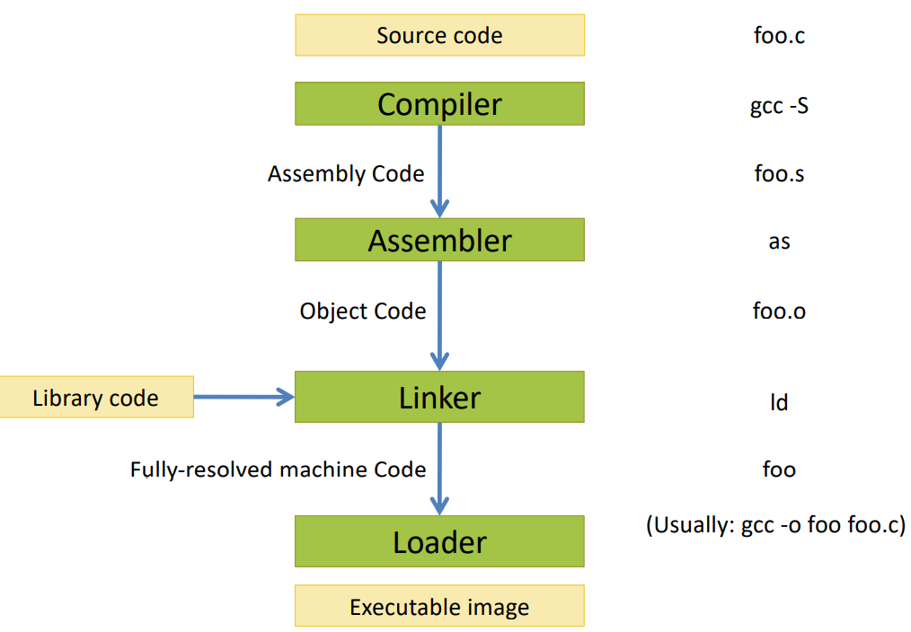

**Computer Design - Lecture note week 1**

- Author: Ruben Schenk
- Date: 23.09.2021
- Contact: ruben.schenk@inf.ethz.ch

# 1. Introduction

## 1.1 What is a Compiler?

A **compiler** is what we as developers usually see as a black box. We might use the C compiler `gcc` int the following way:

```c
#include <stdio.h>

int main() {
	printf("Hello world!\n");
	return 0;
}
```

```console
% gcc -o hello hello.c
% ./hello
Hello world!
%
```

The goal of a **compiler** is to *translate one programming language to another*, typically that is translating a high-level source code to a low-level machine code (**object code**).

#### Source Code

**Source code** is optimized for human readability. This means it is:

- Expressive: match human ideas of grammar/syntax/meaning
- Redundant: more information than needed to help catch errors
- Abstract: exact computations possibly not fully determined by code

Following an example of some C source code:

```c
#include <stdio.h>

int factorial(int n) {
	int acc = 1;
	while(n > 0) {
		acc = acc * n;
		n = n - 1;
	}
	return acc;
}

int main(int argc, char *argv[]) {
	printf("factorial(6) = %d\n", factorial(6));
}
```

#### Low-level code

**Low-level code** is optimized for hardware. This means that:

- Machine code is hard to read for humans
- Redundancy and ambiguity is reduced
- Abstractions and information about intent is lost

#### Compiler Bug Types

When compiling code we might encounter different bugs. We can distinguish them into different types:

- **Miscompilation (wrong code bug)**: The compiler, maybe after enabling some optimization, gives us back a wrong code.
- **Internal compilation error (ICE)**: The compiler crashes on trying to compile some source code.
- **Compiler hang (slow compilation)**: The compiler is stuck or takes a very long time trying to compile some simple source code.
- **Missed optimizations**: The compiler might miss optimizations it could do to some given source code.

## 1.2 Compiler Structure

The following figure shows a simplified view of the **compiler structure**:


The typical **compiler stages** are as follows:

- Lexing -> token stream
- Parsing -> abstract syntax
- Disambiguation -> abstract syntax
- Semantic analysis -> annotated abstract syntax
- Translation -> intermediate code
- Control-flow analysis -> control-flow graph
- Data-flow analysis -> interference graph
- Register allocation -> assembly
- Code emission

**Optimization** may be done at *many* of these stages!

Another simplified view on the compilation and execution is given by the following figure:



# 2. OCaml

## 2.1 OCaml Tools

The programming language **OCaml** includes the following tools:

- `ocaml` -> The top-level interactive loop
- `ocamlc` -> The bytecode compiler
- `ocamlopt` -> The native code compiler
- `ocamldep` -> The dependency analyzer
- `ocamldoc` -> The documentation generator
- `ocamllex` -> The lexer generator
- `ocamlyacc` -> The parser generator

In addition to the above mentioned tools, one might use the following additional tools:

- `menhir` -> A more modern parser generator
- `ocamlbuild` -> A compilation manager
- `utop` -> A more fully-featured interactive top-level
- `opam` -> Package manager

## 2.2 OCaml Characteristics

OCaml has the following two main distinguishing characteristics:

#### Functional and mostly pure

- Programs manipulate values rather than issue commands
- Functions are first-class entitites
- Results of computations can be "named" using `let`
- Has realtively few "side effects"

#### Strongly and statically typed

- Compiler typechecks every expression of the program, issues errors if it can't prove that the program is type safe
- Good support for type inference and generic polymorphic types
- Rich user-defined "algebraic data types" with pervasive use of pattern matching
- Very strong and flexible module system for cosntructing large projects

## 2.3 Factorial on OCaml

Consider the following implementation of the factorial function in a hypothetical programming language:

```pseudo
x = 6;
ANS = 1;
whileNZ (x) {
	ANS = ANS * x;
	x = x + -1;
}
```

For this hypothetical language, we need to describe the following two constructs:

- **Syntax**: which sequences of characters count as a leg program?
- **Semantics**: what is the meaning of a legal program?

## 2.4 Grammar for a Simple Language

### 2.4.1 Grammar and Interpreter

We introduce the following two **nonterminals** for our simple language:

```bnf
<exp> ::=
	|	<X>
	|	<exp> + <exp>
	|	<exp> * <exp>
	|	<exp> < <exp>
	|	<integer constant>
	|	(<exp>)

<cmd> ::=
	|	skip
	|	<X> = <exp>
	|	ifNZ <exp> { <cmd> } else { <cmd> }
	|	whileNZ <exp> { <cmd> }
	|	<cmd>; <cmd>
```

The above given syntax (or *grammar*) for a simple imperative language has the following proeprties:

- It is written in *Backus-Naur form*
- The symbols `::=`, `|`, and `<...>` are part of the **meta language**
- Keywords like `skip`, `ifNZ`, and `whileNZ` and symbols like `{` and `+` are part of the **object language**

#### Example: Define Grammar in OCaml

With the above definition of our grammar in BNF, we can transform this into OCaml. It looks the following way:

```ocaml
type var = string;

type exp =
	| Var of var
	| Add of (exp * exp)
	| Mul of (exp * exp)
	| Lt  of (exp * exp)
	| Lit of int

type cmd =
	| Skip
	| Assn    of var * exp
	| IfNZ    of exp * cmd * cmd
	| WhileNZ of exp * cmd
	| Seq     of cmd * cmd
```

With the definition of our hypothetical language, we can build a command for the factorial function in OCaml the following way:

```ocaml
let factorial : cmd =
	let x = "X" in
	let ans = "ANS" in
	Seq (Assn (x, Lit 6)),
		Seq (Assn (ans, Lit 1)),
			WhileNZ(Var x,
				Seq (Assn (ans, Mul (Var and, Var x)),
					Assn (x, Add (Var x, Lit (-1)))))
```

With the above two examples we can now finally build a simple **interpreter** for our simple language:

```ocaml
type state = var -> int

let rec interpret_exp (s:state) (e:exp) : int =
	match e with
	| Var x -> s x
	| Add (e1, e2) -> (interpret_exp s e1) + (interpret_exp s e2)
	| Mul (e1, e2) -> (interpret_exp s e1) * (interpret_exp s e2)
	| Lt  (e1, e2) -> if (interpret_exp s e1) < (interpret_exp s e2) then 1 else 0
	| Lit n -> n

let update s x v =
	fun y -> if x = y then v else s y

let rec interpret_cmd (s:state) (c:cmd) : state =
	match c with
	| Skip -> s
	| Assn (x, e1) ->
	  let v = interpret_exp s e1 in
	  update s x v
	| IfNZ (e1, c1, c2) ->
	  if (interpret_exp s e1) = 0 then interpret_cmd s c2 else interpret_cmd s c1
	| WhileNZ (e, c) ->
	  if (interpret_exp s e) = 0 then s else interpret_cmd s (Seq (c, WhileNZ (e, c)))
	| Seq (c1, c2) ->
```

#### Main Function

We might write and invoke a `main` function in the following way:

```ocaml
let main() =
	Printf.printf("Hello world!")

(* let _ = main () *)
;; main ()
```

### 2.4.2 Optimizer

We might `optimize` our interpreter. This could be that we evaluate simple expressions ourselves, instead of letting the compiler evaluate it completely. Examples:

```ocaml
(*
e + 0 -> e
e * 1 -> e
e * 0 -> 0
0 + e -> e
e - e -> 0
...

skip; c -> c

ifNZ 0 then c1 else c2 -> c2
ifNZ 1 then c1 else c2 -> c1

whileNZ 0 c -> skip
*)
```

In general, we want to make our program as simple as possible based on some rewriting rules before interpreting it.

We might realize an *optimizer for commands* in the following way:

```ocaml
let rec optimize_cmd (c:cmd) : cmd =
	match c with
		| Assn(x, Var y) -> if x = y then Skip else c
		| Assn(_, _) -> c
		| WhileNZ(Lit 0, c) -> Skip
		| WhileNZ(Lit _, c) -> loop
		| WhileNZ(e, c) -> WhileNZ(e, optimize_cmd c)
		| Skip -> Skip
		| IfNZ(Lit 0, c1, c2) -> optimize_cmd c2
		| IfNZ(Lit _, c1, c2) -> optimize_cmd c1
		| IfNZ(e, c1, c2) -> IfNZ(e, optimize_cmd c1, optimize_cmd c2)
		| Seq(c1, c2) ->
			begin match (optimize_cmd c1, optimize_cmd c2) with
				| (Skip, c2') -> c2'
				| (c1', Skip) -> c1'
				| (c1', c2') -> Seq(c1', c2')
			end
```

### 2.4.3 Translator

We might imagine trying to build a translator from *Simple* to *OCaml*. This process consists of several different steps.

#### Set of Variables

In the following code we explore how to get the set of variables from a given expression.

```ocaml
;; open Simple

module OrderedVars = struct
	type t = var
	let compare = String.compare
end

module VSet = Set.Make(OrderedVars)
let (++) = VSet.union

(* Calculate the set of variables mentioned in either an expression or a command *)

let rec vars_of_exp (e:exp) : VSet.t =
	begin match e with
		| Var x -> VSet.singleton x
		| Add(e1, e2)
		| Mul(e1, e2)
		| Lt (e1, e2) ->
			(vars_of_exp e1) ++ (vars_of_exp e2)
		| Lit _ -> VSet.empty
	end

let rec vars_of_cmd (c:cmd) : VSet.t =
	begin match c with
		| Skip -> VSet.empty
		| Assn(x, e) -> (VSet.singleton x) ++ (vars_of_exp e)
		| IfNZ(e, c1, c2) ->
			(vars_of_exp e) ++ (vars_of_cmd c1) ++ (vars_of_cmd c2)
		| WhileNZ(e, c) ->
			(vars_of_exp e) ++ (vars_of_cmd c)
		| Seq(c1, c2) ->
			(vars_of_cmd c1) ++ (vars_of_cmd c2)
	end
```

#### Translation

The translation invariants are guided by the *types* of the operations:

- variables are a global state, so the become mutable references
- expressions denote integers
- commands denote imperative actions of type unit

We might build our translator the following way:

```ocaml
let trans_var (x:var) : string =
	"V_" ^ x

let rec trans_exp (e:exp) : string =
	let trans_op (e1:exp) (e2:exp) (op:string) =
		Printf.sprintf "(%s %s %s)"
			(trans_exp e1) op (trans_exp e2)
	in
		begin match e with
			| Var x -> "!" ^ (trans_var x)
			| Add(e1, e2) -> trans_op e1 e2 "+"
			| Mul(e1, e2) -> trans_op e1 e2 "*"
			| Lt (e1, e2) ->
				Printf.sprintf "(if %s then 1 else 0)"
					(trans_op e1 e2 "<")
			| Lit 1 -> string_of_int 1
		end

let rec trans_cmd (c:cmd) : string =
	begin match c with
		| Skip -> "()"
		| Ass(x, e) ->
			Printf.sprintf "%s := %s"
				(trans_var x) (trans_exp e)
		| IfNZ(e, c1, c2) ->
			Printf.sprintf "if %s <> 0 then (%s) else (%s)"
				(trans_exp e) (trans_cmd c1) (trans_cmd c2)
		| WhileNZ(e, c) ->
			Printf.sprintf "while %s <> 0 do \n %s done"
				(trans_exp e) (trans_cmd c)
		| Seq(c1, c2) ->
			Printf.sprintf "%S; \n %s"
				(trans_cmd c1) (trans_cmd c2)
	end

let trans_prog (c:cmd) : string =
	let vars = vars_of_cmd c in
		let decls =
			VSet.fold (fun x s ->
				Printf.sprintf " let %s = ref 0 \n %s \n"
					(trans_var x) d)
				vars
				""
		in
			Printf.sprintf "module Program = struct \n %s let run () = \n %s \n end"
			decls (trans_cmd c)

(* Do some testing using the factorial code: Simple.factorial *)
let _ =
	Printf.printf ("%s \n") (trans_prog factorial)
```
