**Compiler Design — Lecture notes week 10**

- Author: Ruben Schenk
- Date: 30.11.2021
- Contact: ruben.schenk@inf.ethz.ch

## 14.5 Code Analysis

### 14.5.1 Liveness

We observe the following: If `%uid1` and `%uid2` will never be needed at the same time, then they can be assigned to the same register.

If we mean that a variable is _needed,_ we mean that its contents will be used as a source operand in a later instruction. Such a variable is called **live.**

Two variables can therefore share any register if they are never live at the same time.

### 14.5.2 Scope vs. Liveness

We can already get some coarse liveness information from _variable scoping._ Consider the following program:

```c
int f(int x) {
    var a = 0;
    if(x > 0) {
        var b = x * x;
        a = b + b;
    }
    var c = a * x;
    return c;
}
```

Due to OAT's scoping rules, `b` and `c` can never be live at the same time. So, we can assign `b` and  `c` to the same slot and potentially to the same register.

However, scope is _too coarse._ Consider this program:

```c
int f(int x) {
    int a = x + 2;  // -> x is live
    int b = a * a;  // -> a and x are live
    int c = b + x;  // -> b and x are live
    return c;       // -> c is live
}
```

The scopes of `a`, `b`, `c`, and `x` all overlap, they are all in the scope at the end of the block. But, `a`, `b`, and `c` are never live at the same time, so they can share the same stack slot or register.

### 14.5.3 Live Variable Analysis

We say that variable `v` is **live** at program point `L` if:

- `v` is defined before `L`
- `v` is used after `L`

Liveness is therefore defined in terms of where variables are defined and used. **Liveness analysis** describes the process of computing the live variables between each statement. Liveness analysis is one example of _dataflow analysis._

### 14.5.4 Control-Flow Graphs - Revisited

For **dataflow analysis,** we us the _control-flow graph_ (CFG) intermediate form. Recall that a _basic block_ is a sequence of isntructions such that:

- There is a distinguished, labeled entry point (no jumps into the middle of a basic block)
- There is a (possibly empty) sequence of non-control-flow instructions
- A block ends with a single control-flow isntruction, such as a jump, branch, return, etc.

A _control-flow graph_ consists of:

- Nodes are the basic blocks
- An edge from `B1` to `B2` if `B1`'s control-flow instruction may jump to the entry label of `B2`
- There are no "dangling" edges, i.e. there is a block for every jump target

#### Liveness is Associated with Edges

With an _exploded CFG,_ i.e. a CFG where we display each instruction as a block, we can put the information of which variable is live between each instruction onto the edge. This is useful as the same register can be used for different temporaries in the same statement.

_Example:_

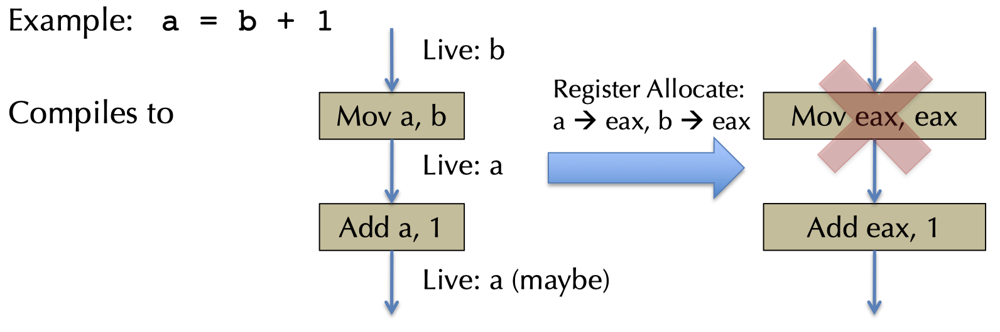

### 14.5.5 Uses and Definitions

Every instruction or statement _uses_ some set of variables, and also _defines_ some set of variables.

For a node or statement `s` we define:

- `use[s]` as the set of variables used by `s`
- `def[s]` as the set of variables defined by `s`

_Examples:_

```bnf
a = b + c  ->  use[s] = {b, c}  &  def[d] = {a}
a = a + 1  ->  use[s] = {a}  &  def[s] = {a}
```

### 14.5.6 Livenes - Formally

A variable `v` is said to be **live** if there is:

- A node `n` in the CFG such that `use[n]` contains `v`, and
- A directed path from `e` to `n` such that for every statement `s'` in the path, `def[s']` does not contain `v`

The first clause says that `v` will be used on some path starting from edge `e`, and the second clause says that `v` won^t be redefined on that path before its use.

### 14.5.7 Simple Liveness Algorithm

We can use a simple _backtracking algorithm_ to compute the above two conditions for a variable to be live:

1. For each variable `v`
2. Try all paths from each use of `v`, tracking abckwards through the control-flow graph until either `v` is defined or a previously visited node is reached
3. Marh the variable `v` live across each edge traversed

This is very _inefficient_ since it explores the same paths many time for different uses and different variables!

## 14.6 Dataflow Analysis

### 14.6.1 Introduction

The main idea of **dataflow analysis** is to compute the liveness information for all variables simultaneously. This is done by the following approach: define equations that must hold by any liveness determination, with equations based on "obvious" constraints.

We then solve those equations by iteratively converging to a solution:

- Start with a "rough" approximation to the answer
- Refine the answer at each iteration
- Keep going until no more refinement is possible, i.e. a _fixpoint_ has been reached

### 14.6.2 Dataflow Value Set for Liveness

Nodes in our CFG are statements, so:

- `use[n]`: set of variables used by `n`
- `def[n]`: set of variables defined by `n`
- `in[n]`: set of variables live on entry to `n`
- `out[n]`: set of variables live on exit from `n`

#### Dataflow Constraints

We can put some constraints on those dataflow value sets:

$$\text{use}[n] \subseteq \text{in}[n]$$

- A variable must be live on entry to `n` if it is used by `n`.

$$\text{out}[n] \setminus \text{def}[n] \subseteq \text{in}[n]$$

- If a variable is live on exit from `n`, and `n` doesn't define it, it is live on entry to `n`.

$$\text{in}[n'] \subseteq \text{out}[n], \, \text{if } n' \in \text{succ}[n]$$

- If a variable is live on entry to a successor node of `n`, it must be live on exit from `n`.

### 14.6.3 Iterative Dataflow Analysis

The idea to find a solution to those constraints is by starting from a rough guess. We simply say that $\text{in}[n] = \emptyset$ and $\text{out}[n] = \emptyset$.

We then iteratively re-compute `in[n]` and `out[n]` where forced to by constraints. Each iteration will add variables to the two mentioned sets. We stop when `in[n]` and `out[n]` satisfy the following equations (which are derived from the constraints above):

- $\text{in}[n] = \text{use}[n] \cup (\text{out}[n] - \text{def}[n])$
- $\text{out}[n] = \bigcup_{n' \in \text{succ}[n]}\text{in}[n']$

### 14.6.4 A Worklist Algorithm

The idea here is to use a FIFO queue of nodes that might need to be updated:

```pseudo
for all n, in[n] := null, out[n] = null
w = new queue with all nodes
repeat until w is empty:
    let n = w.pop()
    old_in = in[n]
    out[n] = union of in[n'] where n' is in succ[n]
    in[n] = use[n] union (out[n] - def[n])
    if(old_in != in[n]):
        for all m in pred[n], w.push(m)
```

## 14.7 Register Allocation

### 14.7.1 Register Allocation Problem

Given an IR program using an unbounded number of termporaries, find a mapping from temporaries to machine registers such that:

- program semantics are preserved
- register usage is maximized
- moves between registers are minimized
- calling conventions and archtiecture requirements are obeyed

_Stack spilling_ describes the following observation: If there are `k` available registers and `m > k` temporaries live at the same time, not all temporaries will fit into the registers. We therefore have to _spill_ the excess temporaries onto the stack.

### 14.7.2 Linear-Scan Register Allocation

We introduce a simple, greedy _register-allocation strategy:_

1. Compute liveness information `live(x)`, which is the set of uids that are live on entry to `x`'s definition
2. Let `pal` be the set of usable registers (we usually reserve a couple of registers for splii code, in our implementation those registers are `rax` and `rcx`)
3. Maintain a layout `uid_loc` that maps uids to locations, those include registers and stack slots
4. Scan through the program, for each isntruction that defines a uid `x`:
    - `used = {r | reg r = uid_loc(y) s.t. y in live(x)}`
    - `available = pal - used`
    - If `available` is empty: `uid_loc(x) := slot n; n = n + 1`
    - Otherwise, pick `r` in `available`: `uid_loc(x) = reg r`

### 14.7.3 Graph Coloring

#### Register Allocation

The basic process for register allocation goes as follows:

1. Compute liveness information for each temporary
2. Create an _interference graph:_ nodes are temporaries and there is an edge between nodes `n` and `m` if they are live at the same time
3. Try to color the graph, each color corresponds to a register
4. If step 3 fails, spill a register to the stack and repeat from step 1
5. Rewrite the program to use the allocated register

#### Interference Graphs

We build **interference graphs** in the following way:

- Nodes of the graph are `%uids`
- Edges connect variables that _interfere_ with each other, that is, if their live range intersects.

Once we have build such a graph, register allocation becomes a _graph coloring problem._ A graph coloring assigns each nodein the graph a color (i.e. a register). Any two nodes connected by an edge must have different colors.

_Example:_

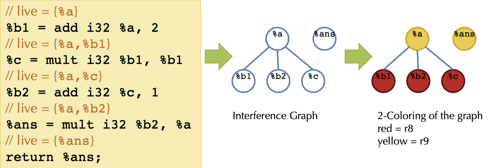

#### Coloring a Graph: Kempe's Algorithm

Kempe provides a algorithm for K-coloring a graph. It's a recursive algorithm that works in three steps:

1. Find a node with degree < K and cut it out of the graph. Remove the nodes and corresponding edges. This is called _simplifying_ the graph.
2. Recursively K-color the remaining subgraph.
3. When the remaining graph is colored, there must be at least one free color available for the deleted node (since its degree was < K).

_Example:_ 3-color the following graph:

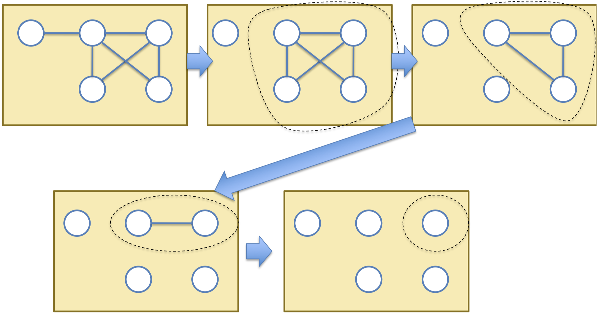

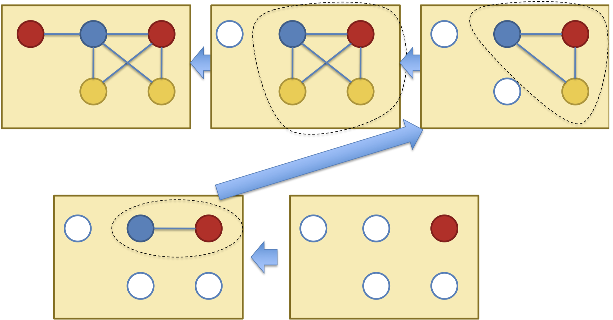

#### Failure of the Algorithm

If the graph cannot be colored, it will simplify to a graph where every node has >= K neighbors. However, this can also happen even when the graph is K-colorable! This is a symptom of NP-hardness.

### 14.7.4 Spilling

If we can't K-color a graph, we need to store one temporary on the stack. Which variable to we choose? Multiple options are possible:

- One that isn't used frequently
- One that isn't used in a deeply nested loop
- One that has high interference

In practice, some weighted combination of the above criteria is used. When coloring the graph, we simply mark a node as spilled, remove it from the graph, and then keep on recursively coloring.

_Example:_

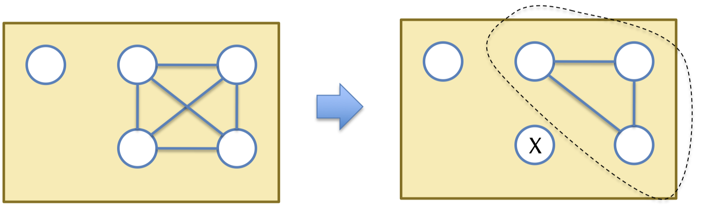

#### Optimistic Coloring

If we get lucky with the choices of colors made earlier, it is sometimes possible to color a node marked for spilling.

_Example:_

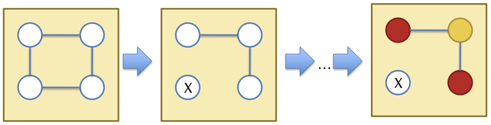

#### Accessing Spilled Registers

If optimistic coloring fails, we need to generate code to move the spilled temporaries to and from memory.

- Option 1: Reserve registers specifically for moving to and from memory. We need at least two registers, so we decrease the number of total available registers by 2, but we only need to color the graph once.
- Option 2: Rewrite the program to use a new temporary with explicit move to and from memory. This allows us to reserve fewer register but introduces a change in live ranges, so we must recompute the liveness and recolor the graph.

### 14.7.5 More On Coloring

#### Precolored Nodes

Some variables must be pre-assigned to register, e.g. on X86 the multiplication instruction `imul` must define `%rax`. To properly allocate temps, we treat registers as nodes in the interference graph with pre-assigned colors. A trick to handle this case when coloring the graph is to treat pre-colored nodes as having "infinite" degree in the interference graph to guarantee that they won't be simplified.

#### Picking Good Colors

When choosing colors during the coloring phase, any choice is semantically correct, but some choices are better for perfomance.

_Example:_ `movq t1, t2`
If `t1` and `t2` can be assigned to the same color, this move is redundant and can be eliminated.

A simple color choosing strategy is to add a new kind of "move related" edge between `t1` and `t2` in the interference graph. When choosing a color for `t1` (or `t2`), if possible we pick a color of an already colored node, reachable by a move-related edge.

#### Coalescing Interference Graphs

A more agressive strategy is to _coalesce_ nodes of the interference graph if they are connected by move-related edges. Coalescing those nodes forces them to be assigned to the same register.

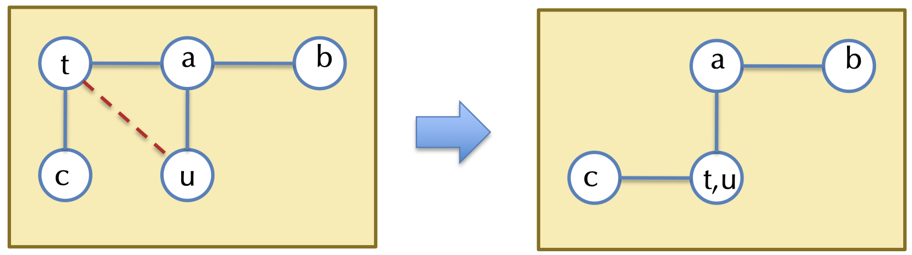

The idea is to interleave simplification and coalescing to maximize the number of moves that can be eliminated. However, one problem introduced by coalescing is that it may increase the degree of a node.

#### Conservative Coalescing

There are two strategies for _conservative coalescing_ which guarantee to preserve the k-colorability of an interference graph:

- _Briggs' strategy:_ It's safe to coalesce `x` and `y` if the resulting node will have fewer than K neighbors that have degree >= K, since the merged node `(x, y)` can still be removed.
- _George's strategy:_ We can safely coalesce `x` and `y` if for every neighbor `t` of `x`, either `t` already interferes with `y` or has degree < K.

In practice we use George's strategy if one of `x` and `y` is precolored and we use Briggs' strategy if both are temporaries.

### 14.7.6 Complete Register Allocation Algorithm

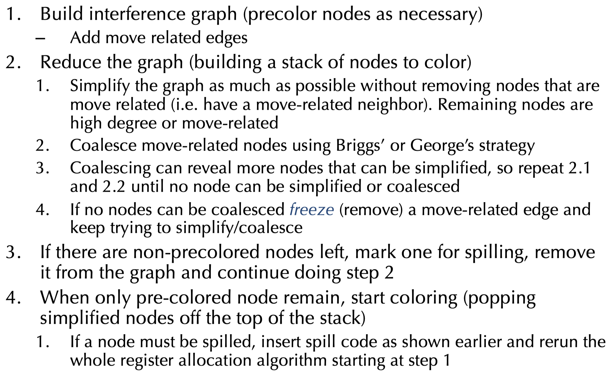

## 14.8 Other Dataflow Analyses

### 14.8.1 `def` And `use` For SSA

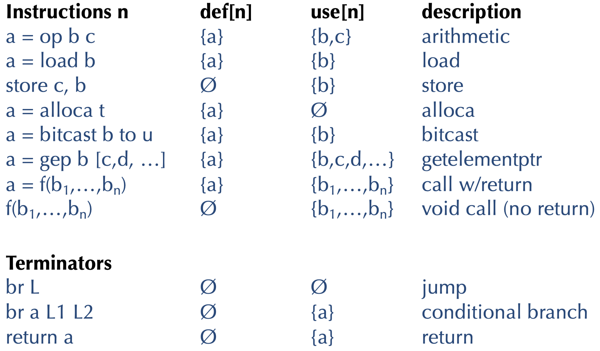

## 14.9 Reaching Definitions

### 14.9.1 Reaching Definition Analysis

The **reaching definition analysis** is used for constant propagation and copy propagation:

- _Constant propagation:_ If only one definition reaches a particular use, we can replace the use by the definition
- _Copy propagation:_ Additionally requires that the copied value still has its same value, computed using an available expression analysis

The input to this analysis is a CFG and the output `in[n]` and `out[n]` are the sets of nodes defining some variable such that the definition may reach the beginning/end of node `n`.

_Example:_

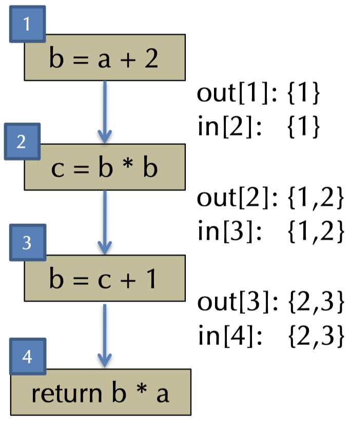

### 14.9.2 Reaching Definitions Analyis - Algorithm

#### Step 1

Define the set of interest for the analysis. Let `defs[a]` be the set of nodes that define the variable `a`. Define `gen[n]` and `kill[n]` as follows:

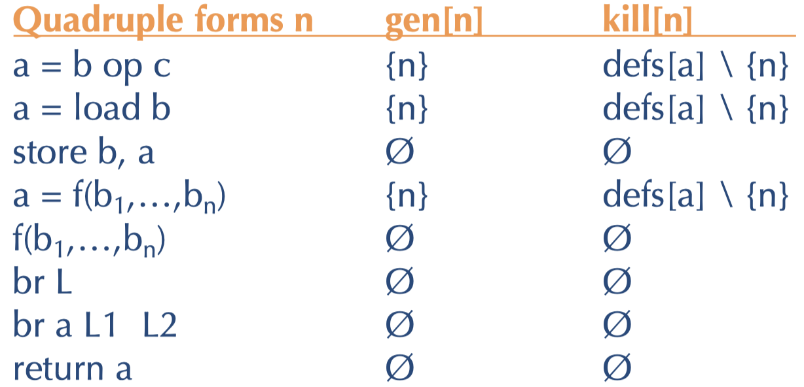

#### Step 2

Define the cosntraints that a reaching definitions solution must satisfy:

$$\text{gen}[n] \subseteq \text{out}[n]$$

- Definitions reaching the end of a node at least include the definitions generated by the code.

$$\text{if } n' \text{ is in pred}[n], \text{ then out}[n'] \subseteq \text{ in}[n]$$

- Definitions reaching the beginning of a node include those that reach the exit of _any_ predecessor.

$$\text{in}[n] \subseteq \text{out}[n] \cup \text{kill}[n]$$

- Definitions coming into a node `n` either reach the end of `n` or are killed by it.

#### Step 3

We convert the constraints to iterated update equations:

- $\text{in}[n] := \bigcup_{n' \in \text{pred}[n]} \text{out}[n']$
- $\text{out}[n] := \text{gen}[n] \cup (\text{in}[n] \setminus \text{kill}[n])

The algorithm starts to initialize `in[n]` and `out[n]` to be empty. We iterate the update equations until a fixed point is reached.

## 14.10 Available Expressions

### 14.10.1 Available Expressions Analysis

The idea is that we want to perform common subexpression elimination (CSE).

_Example:_

```bnf
a = x + 1:
b = x + 1;

// After CSE
a = x + 1;
b = a;
```

We have the following dataflow values:

- `in[n]` is the set of nodes whose values are avilable on entry to `n`
- `out[n]` is the set of nodes whose values are available on exit of `n`

### 14.10.2 Available Expressions Analysis - Algorithm

#### Step 1

Define the set of values and the sets `gen[n]` and `kill[n]` as follows:

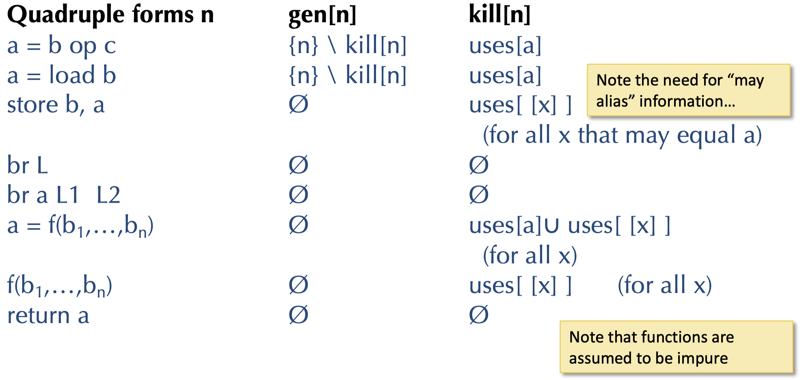 

#### Step 2

Define the constraints that an avilavle expressions solution must satisfy:

$$\text{gen}[n] \subseteq \text{out}[n]$$

- Expressions made available by `n` reach the end of the node.

$$\text{if } n' \text{ is in pred}[n], \text{ then in}[n] \subseteq \text{out}[n']$$

- Expressions available at the beginning of a node include those that reach the exit of every predecessor.

$$\text{in}[n] \subseteq \text{out}[n] \cup \text{kill}[n]$$

- Expressions available on entry either reach the end of the node or are killed.

#### Step 3

Convert the cosntraints to iterated update equations:

- $\text{in}[n] := \bigcap_{n' \in \text{pred}[n]}\text{out}[n']$
- $\text{out}[n] := \text{gen}[n] \cup (\text{in}[n] \setminus \text{kill}[n])$

The algorithm is to initialize `in[n]` and `out[n]` to the set of all nodes and then iterate the update equations until a fixed point is reached.

## 14.11 Comparing Dataflow Analyses

### 14.11.1 Overview

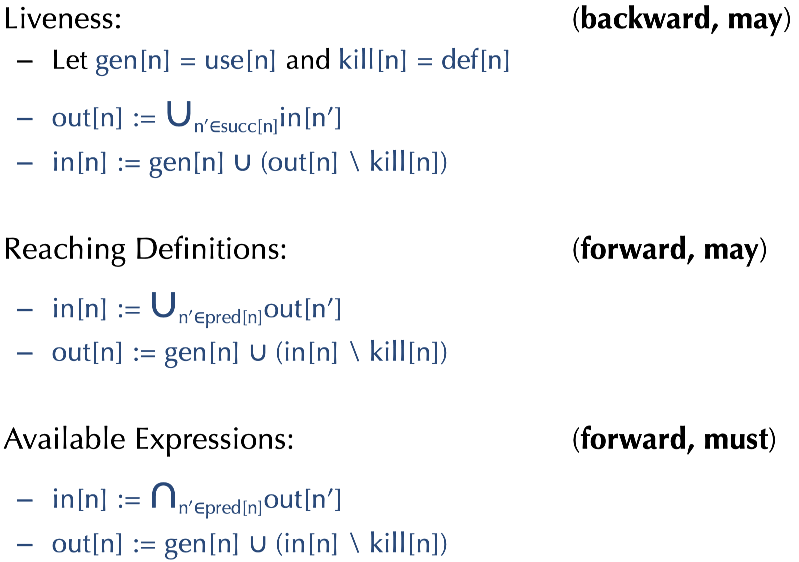

### 14.11.2 Very Busy Expressions

Expression `e` is said to be **very busy** at location `p` if every path from `p` must evaluate `e` before any variable in `e` is redefined.
This is a _backward-must-analysis._

### 14.11.3 Common Features

All of these analyses have a _domain_ over which they solve constraints:

- For liveness, the domain is sets of variables
- For reaching definitions and available expressions, the domain is sets of nodes

Each analysis has a notion of `gen[n]` and `kill[n]`.

Each analysis propagates information either _forward_ or _backward:_

- Forward: `in[n]` is defined in terms of predecessor nodes' `out[n]`
- Backward: `out[n]` is defined in terms of predecessor nodes' `in[n]`

Each analysis has a way of aggregating information:

- Liveness and reaching definitions take the union
- Available expressions use intersection
- Union expresses a property that holds for some path (_may_)
- Intersection expresses a property that holds for all paths (_must_)

### 14.11.4 Data Flow Analysis Framework

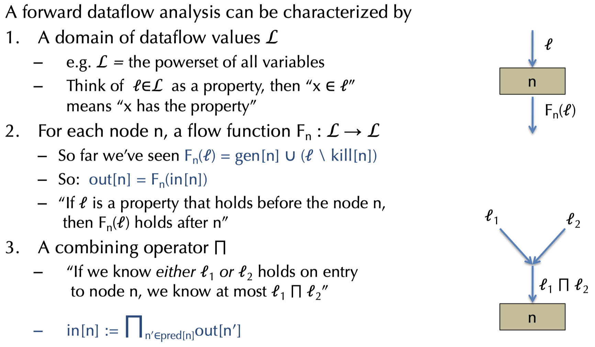

### 14.11.5 Generig Iterative Analysis

```pseudo
for all n, in[n] := T, out[n] := T
repeat until no change:
    for all n:
        in[n] := \cap_{n' in pred[n]}out[n']
        out[n] := F_n(in[n])
    end
end
```

`T` $\in \mathcal{L}$ (_top_) represents having the maximum amount if information.

### 14.11.6 Structure of $\mathcal{L}$

The domain has a structure that reflects the amount of information cotnained in each dataflow value. Some dataflow values are more informative than others:

- Write $\mathcal{l}_1 \sqsubseteq \mathcal{l}_2$ whenever $\mathcal{l}_2$ provides at least as much information as $\mathcal{l}_1$.

#### Meets and Joins

The combining operator $\sqcap$ is called the _meet_ operator. It constructs the greates lower bound:

- $l_1 \sqcap l_2 \sqsubseteq l_1$ and $l_1 \sqcap l_2 \sqsubseteq l_2$ (the meet is a lower bound)
- If $l \sqsubseteq l_1$ and $l \sqsubseteq l_2$ then $l \sqsubseteq l_1 \sqcap l_2$ (there is no greater lower bound)

Dually, the $\sqcup$ operator is called the _join_ operator, it constructs the least upper bound:

- $l_1 \sqsubseteq l_1 \sqcup l_2$ and $l_2 \sqsubseteq l_1 \sqcup l2$ (the join is an upper bound)
- If $l_1 \sqsubseteq l$ and $l_2 \sqsubseteq l$ then $l_1 \sqcup l_2 \sqsubseteq l$ (there is no smaller upper bound)

### 14.11.7 Classic Constant Propagation

_Constant propagation_ can be formulated as a dataflow analysis. The idea os to propagate and fold integer constants in one pass:

```bnf
x = 1;      -> x = 1
y = 5 + x;  -> y = 6;
z = y * y;  -> z = 36
...
```
