**Compiler Design — Lecture notes week 11**

- Author: Ruben Schenk
- Date: 07.12.2021
- Contact: ruben.schenk@inf.ethz.ch

## 14.12 Quality of Dataflow Analysis Solutions

### 14.12.1 Best Possible Solution

Suppose we have som GFC. If there exists a path $p_1$ starting from the root node traversing the nodes $n_0, \, n_1, \, ..., \, n_k$, then the best possible information along $p_1$ is given by:

$$l_{p1} = F_{nk}(...F_{n2}(F_{n1}(F_{n0}(T)))...)$$

The best solution at the output is some $l \sqsubseteq l_p$ for all paths $p$.

We can define the **meet-over-paths (MOP)** solution as:

$$\sqcap_{p \in \text{paths-to}[n]}l_p$$

The iterative solution computes the MOP solution if the flow functions distribute over $\sqcap$, that is, if $\sqcap_iF_n(l_i) = F_n(\sqcap_il_i)$.

The Reaching Definitions analysis with iterative analysis always terminates with the MOP! In fact, the other three analyses (i.e. liveness, available expressions, and very busy expressions) are all MOP!

### 14.12.2 Flow Functions

Consider the node `x = y op z`. We define the following flow functions for this node:

- $F(l_x,T,l_z) = (T,T,l_z)$ and $F(l_x,l_y,T) = (T,l_y,T)$ -> "if either input might have multiple values, the result of the operation might too"
- $F(l_x,\bot,l_z) = (\bot,\bot, l_z)$ and $F(l_x,l_y,\bot) = (\bot,l_y,\bot)$ -> "if either input is undefined, the result of the operation is too"
- $F(l_x,i,j) = (i \text{ op }j,i,j)$ -> "if the inputs are known constants, calculate the output statically"

## 14.13 Dataflow Analysis: Summary

Many dataflow analyses fit into a common framework. The key idea is to fond an iterative solution of a system of equations over a lattice:

- The iteration terminates if the flow functions are monotonic
- The solution is equivalent to the MOP answer if the flow functions distribute over the meet operator ($\sqcap$)

# 15. Loops and Dominators

## 15.1 Loops

### 15.1.1 Introduction

Taking into account loops is important for optimizations. The 90/10 rule applies, so optimizing loop bodies is important!

But how do we identify loops in the control-flow graph?

### 15.1.2 Definition Of A Loop

A **loop** is a set of nodes in the CFG which have one distinguished entry: the _header._

- Each node is reachable from the header
- Header is reachable from each node
- No edges enter a loop except the header
- _Exit nodes_ are nodes with outgoing (in the sense of "out of the loop") edges

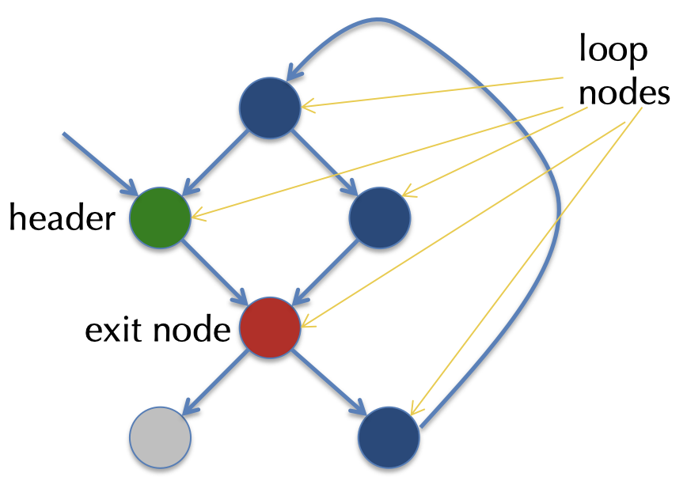

Loops may contain other loops, so-called _nested loops._

### 15.1.3 Goal of Control-flow Analysis

The goal of the control-flow analysis is to identify loops and the nesting structure in a CFG.

Control-flow analysis is based on the idea of _dominators:_

- `A` **dominates** `B` if the only way to reach `B` from the start node is via `A`.

An edge in the CFG is called a _back edge_ if its target dominates the source. A _loop_ contains >=1 back edge!

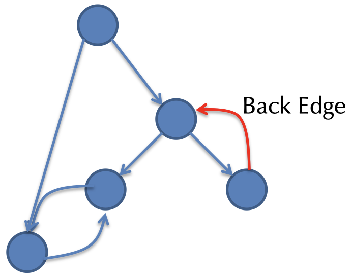

## 15.2 Dominators

### 15.2.1 Dominator Trees

- Domination is _transitive:_ `A dom B, B dom C => A dom C`
- Domination is ant-symmetric: `A dom B, B dom A => A = B`

Every flow graph has a **dominator tree** which is equal to the Hasse diagram of the dominates relation:

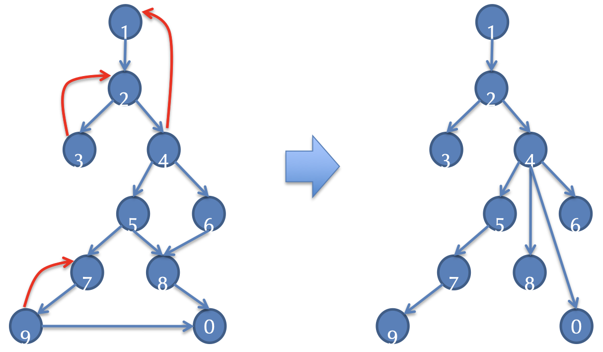

### 15.2.2 Dominator Dataflow Analysis

We can define `Dom[n]` as a forward dataflow analysis:

- `Dom[n]` is the set of all the nodes that dominate `n`
- We can use the same framework as we've seen earlier: `Dom[n] = out[n]` where:
    - `B` is dominated by `A` if `A` dominates _all_ of `B`'s predecessors: $\text{in}[n] := \bigcup_{n' \in \text{pred}[n]}out[n']$
    - Every node dominates itself: $\text{out}[n] := \text{in}[n] \cup \{n\}$

Formally, we can define our analysis as follows: $\mathcal{L}$ is the set of nodes ordered by $\subseteq$, and:

- $T = \{\text{all the nodes}\}$
- $F_n(x) = x \cup \{n\}$
- $\sqcap$ is $\cap$

### 15.2.3 Improving The Algorithm

Instead of storing all those nodes along the path in a dominator tree from root to `b`, it is much more efficient to store only the immediate dominator of `b` in some set called `doms[b]`.

To compute `Dom[b]`, we simply have to walk through `doms[b]`.

### 15.2.4 Completing COntrol-flow Analysis

Dominator analysis identifies _back edges:_

- Edge `(n, h)` is a back edge if `h` dominates `n`

Each back edge has a _natural loop:_

- `h` is the header
- All nodes dominated by `h` that also reach `n` without going through `h` are included in the loop body

For each back edge `(n, h)` we can find a natural loop with:

$$\{n' \, | \, h \text{ dom } n' \, \land \, n \text{ is reachable from } n' \text{ in } G \setminus \{h\} \} \cup \{h \}$$

### 15.3 Example: Natural Loops

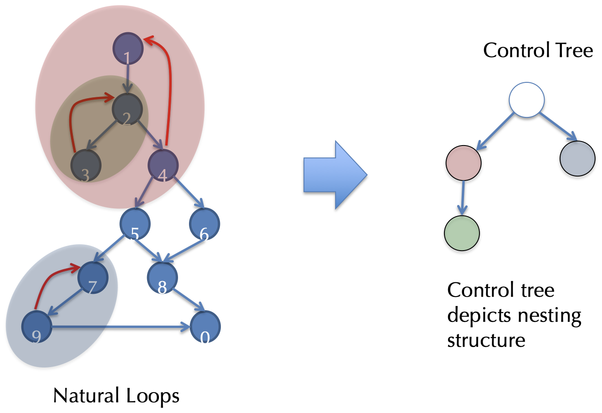

# 16. Revisiting SSA

## 16.1 Introduction

### 16.1.1 Single Static Assignment (SSA)

For example, LLVM IR names, via `%uids`, _all_ intermediate values. This makes the order of evaluation explicit. Each `%uid` is assigned only once.

A naive backup implementation would be to map `%uids` to stack slots, however it would be much better to map as many `%uids` as possible to registers.

### 16.1.2 Alloca vs. %UID

The current compilation strategy looks as follows:

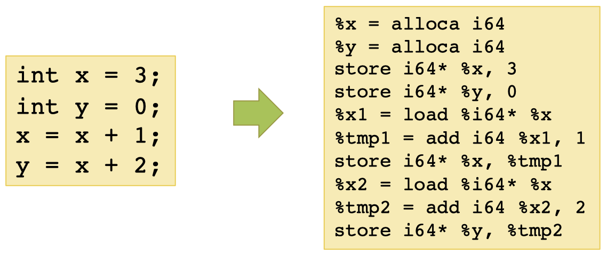

But what happens if we directly map source variables into `%uids`?

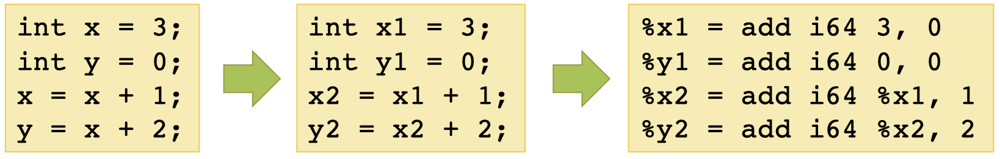

Does this always work? So, see the following if-then-else example.

### 16.1.3 What About If-Then-Else?

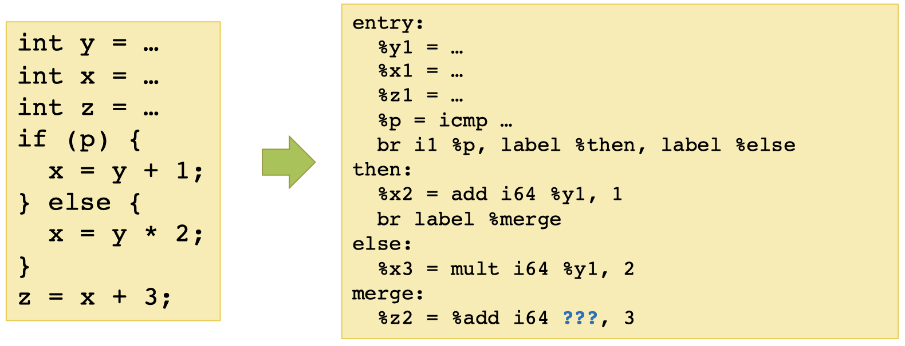

What do we put for `???` ?

## 16.2 Phi Functions

### 16.2.1 Introduction

The solution to our problem in the previous chapter are so-called $\phi$ **functions:**

- Those are fictitious operators, used only for the analysis
- Choose versions of a variable by the path hwo control enters the phi node

```
%uid = phi <ty> v1, <label1>,..., vn, <labeln>
```

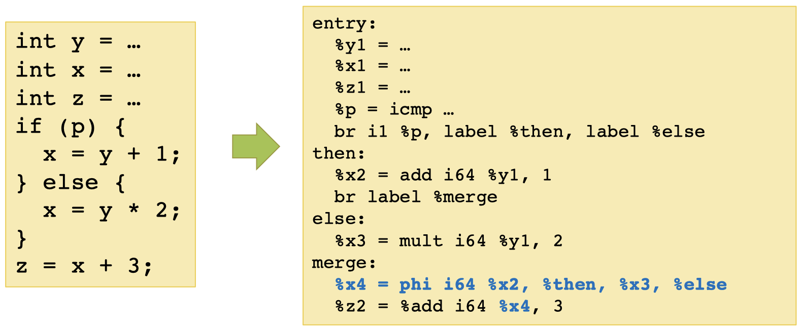

### 16.2.2 Phi Nodes and Loops

Importantly, `%uids` on the RHS of phi nodes can be defined "later" in the CFG, meaning that `%uids` can hold values "around a loop". The scope of `%uids` is defined by the dominance.

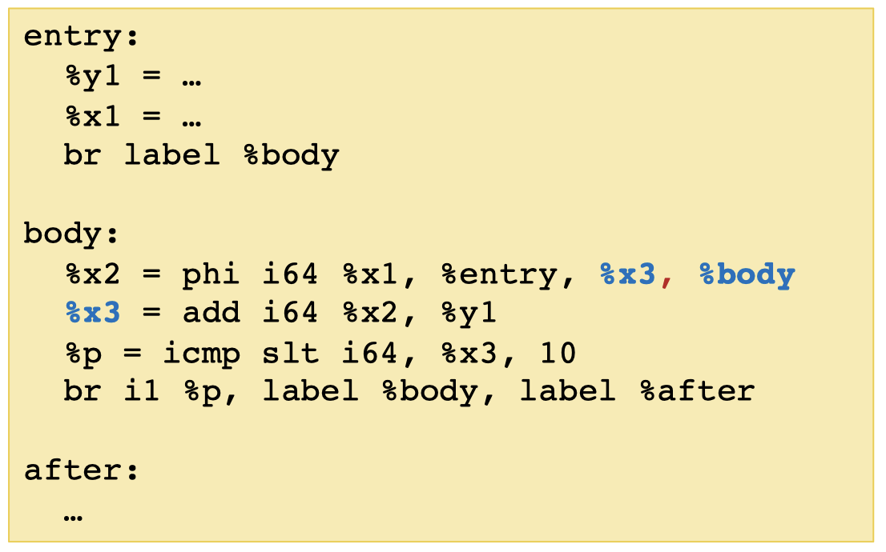

## 16.3 Alloc "Promotion"

### 16.3.1 Introduction

Not all source variables can be allocated to registers:

1. If the address of the variable is taken

```llvm
entry:
    %x = alloca i64             // %x cannot be promoted
    %y = call malloc(i64 8)
    %ptr = bitcast i8* %y to i64**
    store i64** %ptr, %x        // store the pointer into the heap
```

2. If the address of the variable "escapes" by being passed to a function

```llvm
entry:
    %x = alloca i64         // %x cannot be promoted
    %y = call foo(i64* %x)  // foo may store the pointer into the heap
```

A `alloca` instruction is said to be **promotable** if neither of the above conditions hold. Luckily, mostlocal variables declared in source programs are promotable and therefore can be register allocated.

### 16.3.2 Convertig to SSA

To convert to SSA we proceed with the following steps:

1. Start with the ordinary CFG that uses allocas, identify promotable allocas
2. Compute dominator tree information
3. Calculate def/use information for each such allocated variable
4. Insert $\phi$ functions for each variable at necessary "join points"
5. Replace loads/stores to alloc'ed variables with freshly-generated `%uids`
6. Eliminate the now unneeded load/store/alloca instructions

### 16.3.3 Where to Place $\phi$ Functions?

To know where we need to place the $\phi$ functions we need to calculate the **dominance frontier.**

- Node `A` _strictly dominates_ `B` if `A dom B & A != B`

The _dominance frontier_ of a node `B` is the set of all CFG nodes `y` such that `B` dominates a predecessor of `y`, but does not strictly dominate `y`. We write `DF[n]` to denote the dominance frontier of node `n`.

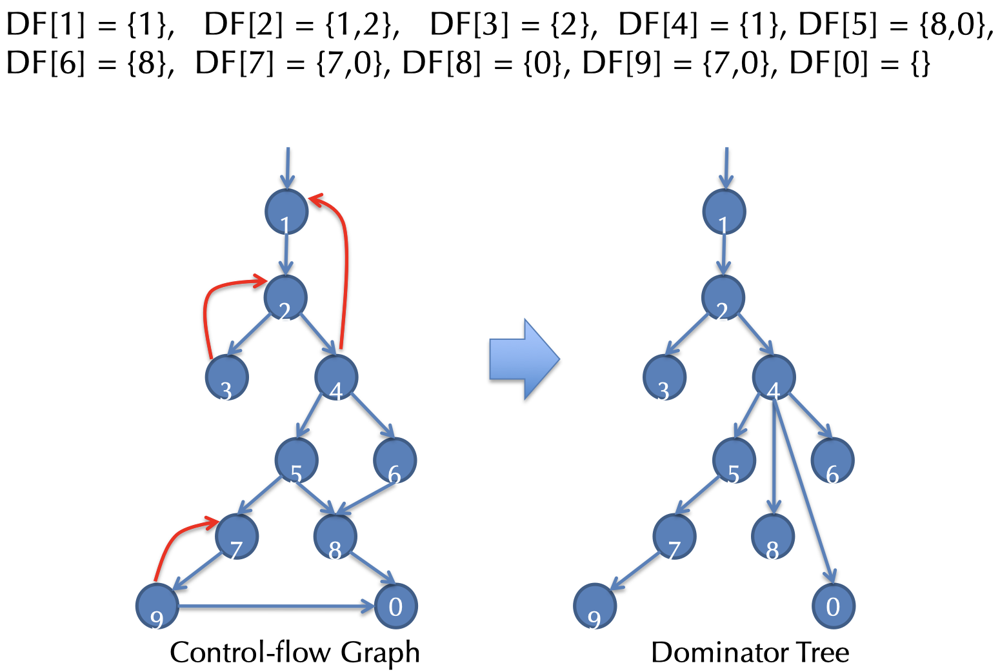

### 16.3.4 Algorithm For Computing `DF[n]`

We assume that `doms[n]` store the dominator tree.

The following algorithm adds each `B` to the DF set to which it belongs to:

```pseudo
for all nodes B
    if #(pred[B]) >= 2:
        for each p in pred[B]:
            runner := p
            while (runner != droms[B]):
                DF[runner] := DF[runner] union {B}
                runner := doms[runner]
```

### 16.3.5 Insert $\phi$ at Join Points

Lift the `DF[n]` to a set of nodes `N` in the obvious way:

$$DF[N] = \bigcup_{n \in N}DF[n]$$

Suppose variable `x` is defined at a set of nodes `N` with

- `DF_0[N] = DF[N]`
- `DF_i+1[N] = DF[DF_i[N] union N]``

Let `J[N]` be the _least fixed point_ of the sequence:

$$DF_0[N] \subseteq DF_1[N] \subseteq DF_2[N] ...$$

That is, `J[N] = DF_k[N]` for some `k` such that `DF_k[N] = DF_k+1[N]`.

We insert $\phi$ **functions** for the variable `x` at each node in `J[N]`.

_Example:_

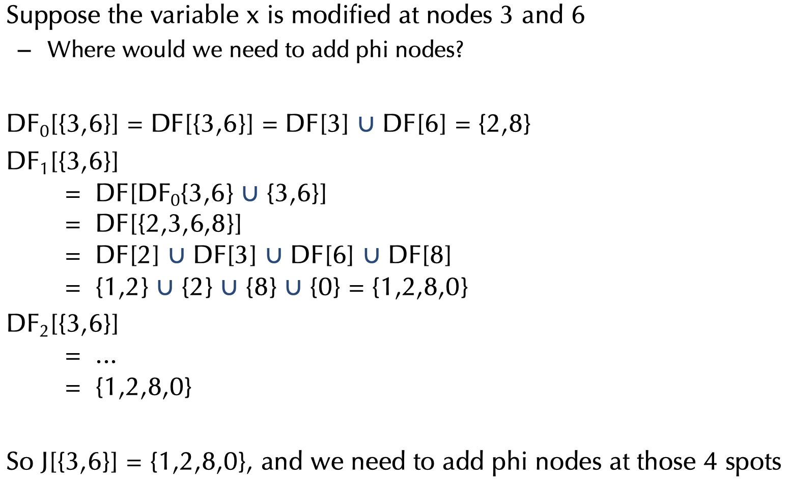

### 16.3.6 Phi Placement Alternative

This alternative is less efficient, but easier to understand.

The idea is to place phi nodes _maximally_, i.e. at every node with >= 2 predecessors.
If all values flowing into the phi node are the same, we eliminate it.

### 16.3.7 SSA Optimization Example

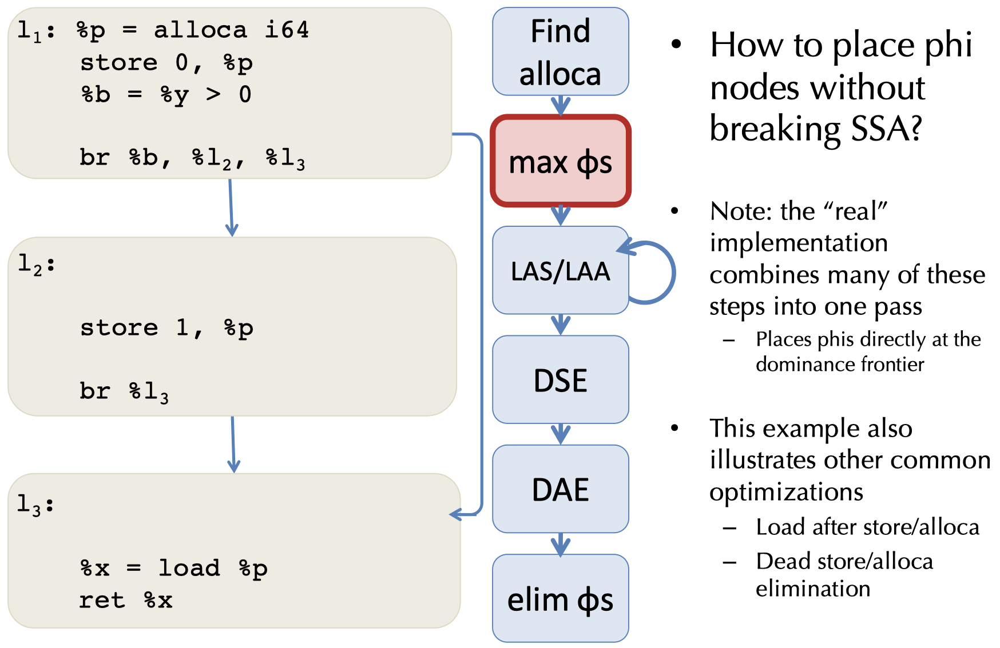

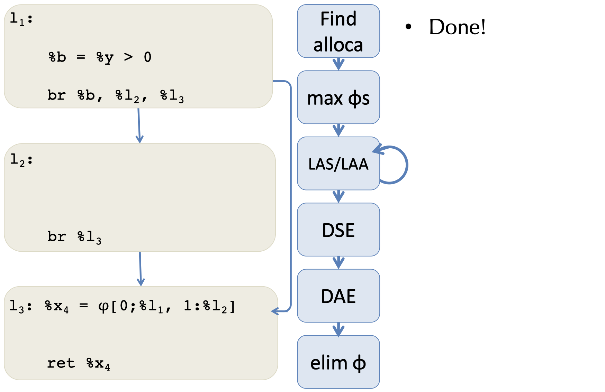

# 17. Automatic Memory Management (GC)

## 17.1 Why Automatic Memory Management (AMM)?

### 17.1.1 Introduction

Store mamangement is still a hard problem in modern programming. Especially C/C++ programs have many storage bugs:

- forgetting to free unused memory
- dereferencing a dangling pointer
- overwriting parts of a data structure by accident

Storage bugs are hard to find! A bug can manifest far away in time and program text from its source.

### 17.1.2 Type Safety and Memory Management

Some storage bugs can be prevented in a strongly typed language, e.g. we cannot overrun the array limits, dereference a null pointer, etc.

However, if we want type safety, we typically must use AMM (GC).

### 17.1.3 The Basic Idea

The basic idea of AMM is as follows:

1. When an object is created, unused space is automaticall allocated. 
2. After a while there is no more unused space.
3. Some space is occupied by objects that will never be used again.
4. This space can be freed to be reused later.

The main problem is: How do we tell whether an object will never be used again? In general, this is impossible to tell.
One key idea is based on the following observation: A program can use only objects that it can find.

_Example:_

```bnf
let x : A = new A in {x = y; ...}
```

After `x = y`, there is no way to access the newly allocated object.

## 17.2 Garbage Collection

### 17.2.1 Introduction

An object `x` is called **reachable** if and only if:

- A _register_ contains a pointer to `x`, or
- Another reachable object `y` contains a pointer to `x`

One can find all reachable objects by:

- Starting from registers, and
- Following all the pointers

Unreachable objects can never be reference by the program. These objects are called **garbage.**

### 17.2.2 Simple Example

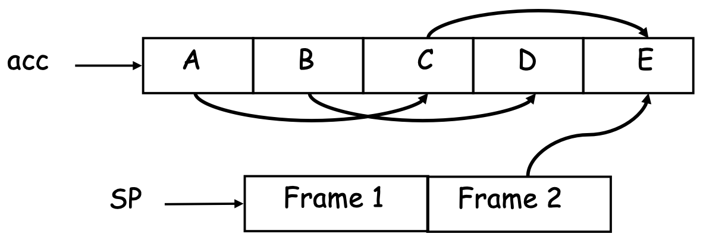

1. We start tracing from `acc` and `stack`, they are called the _roots_
2. Note that `B` and `D` are not reachable from `acc` or `stack`
3. Thus, we can reuse their storage

### 17.2.3 Elements of Garbage Collection

Every **garbage collection scheme** has the following steps:

1. Allocate space as needed for new objects
2. When space runs out:
    1. Compute what objects might be used again (generally by tracing objects reachable from a set of root registers)
    2. Free the sapce used by objects not found in the previous steps

## 17.3 Three Different Techniques

### 17.3.1 Mark and Sweep

When memory runs out, GC executes two phases:

- **Mark phase:** traces reachable objects
- **Sweep phase:** collects garbage objects

Every object has an extra bit, the _mark bit:_

- reserved for memory management
- initially the mark is set to 0
- the bit is set to 1 for the reachable objects in the mark phase

#### Example

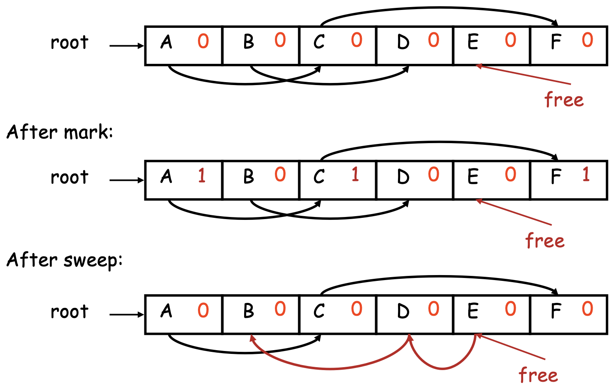

#### The Mark Phase

```pseudo
let todo = {all roots}
while todo != empty do:
    pick v in todo
    todo = todo \ {v}
    if mark(v) = 0 then:
        matk(v) = 1
        let v1,...,vn be the pointers contained in v
        todo = todo union {v1,..., vn}
```

#### The Sweep Phase

The sweep phase scans the heap for objects with a mark bit equal to 0, these objects have not been visited in the mark phase and are therefore garbage:

- Any such object is added to the free list
- The objects with a mark bit 1 have their mark bit reset to 0

```pseudo
p = bottom of heap
while p < top of heap do:
    if mark(p) = 1 then:
        mark(p) = 0
    else:
        add block p...(p + sizeof(p)-1) to freelist
    p = p + sizeof(p)
```

#### Details

A serious problem with the mark phase is that it is invoked when we are out of space, yet we need space to construct the todo list!
The size of the todo list is unbounded, so we cannot reserver space a riori.

There is a trick to allow the auxiliary data (todo list) to be stored in the objects:

- **pointer reversal:** when a pointer is followed, we reverse it to point to its parent

Similarly, the free list is stored in the free objects themselves.

### 17.3.2 Stop and Copy

In this technique, memory is organized into two areas:

- The _old space_, which is used for allocation
- The _new space_, which is used as a reserve for GC

The heap pointer points to the next free word in the old space. Allocation simply advances the heap pointer.

#### Stop and Copy Process

The garbage collection starts when the old space is full:

1. It copies all reachable objects from the old space into the new space
    - The garbage is left behind
    - After the copy phase, new space uses less space than the old space before GC
2. After the copy, the roles of the old and new spaces are reversed, and the program resumes

#### Example

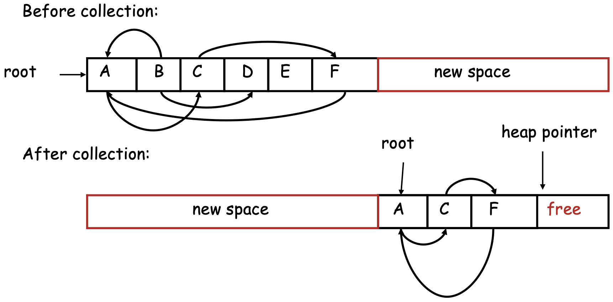

#### Implementation

We need to find all reachable objects, as it is the same for mark and sweep. As we find a reachable object, we copy it into the new space.
After this, we need to fix _all_ the pointers pointing to it!

As we copy an object:

- We store in the old copy a _forwarding pointer_ to the new copy.
- Any object reached later with a forwarding pointer was already copied.

By partitioning the new space into three contiguous regions, we can solve the problem of implementing the traversal without using extra space:

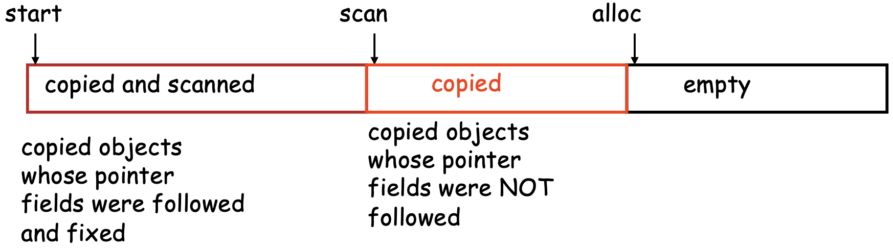

#### Algorithm

```pseudo
while scan <> alloc do:
    let O be the object at scan pointer
    for each pointer p in O do:
        find O' that p points to
        if O' is without a forwarding pointer:
            copy O' to new space and update alloc pointer
            set 1st word of old O' to point to the new copy
            change p to point to the new copy of O'
        else:
            set p in O equal to the forwarding pointer
    increment scan pointer to the next object
```

### 17.3.3 Reference Counting

**Reference counting** is based on the idea that rather than wait for memory to run out, we try to collect an object when there are no more pointers to it.
We store in each object the number of pointers to that object, this is called the _reference count._ Each assignment operation has to manipulate that reference count.

#### Implementation

`new` returns an object with a reference count of 1. If `x` points to an object, let `rc(x)` refer to the object's reference count.

Every assignment `x := y` must be changed:

```pseudo
rc(y) = rc(y) + 1
rc(x) = rc(x) - 1
if(rc(x) == 0) { mark x as free}
x := y
```

#### Evaluation

Advantages:

- Easy to implement
- Collects garbage incrementally without large pauses in the execution

Disadvantages:

- Manipulating reference counts at each assignment is very slow
- Cannot collect circular structures

## 17.4 Garbage Collection: Evaluation

Automatic memory management avoids some serious storage bugs. But, it takes away control from the programmer, e.g. layout of data in memory and when memory is allocated.
Most GC implementations stop the execution during collection, which is not acceptable in real-time applciations.

There are already advanced garbage collection algorithms:

- _Concurrent:_ allow the program to run while the collection is happening
- _Generational:_ do not scan long-lived objects at every collection
- _Parallel:_ several collector working in parallel
