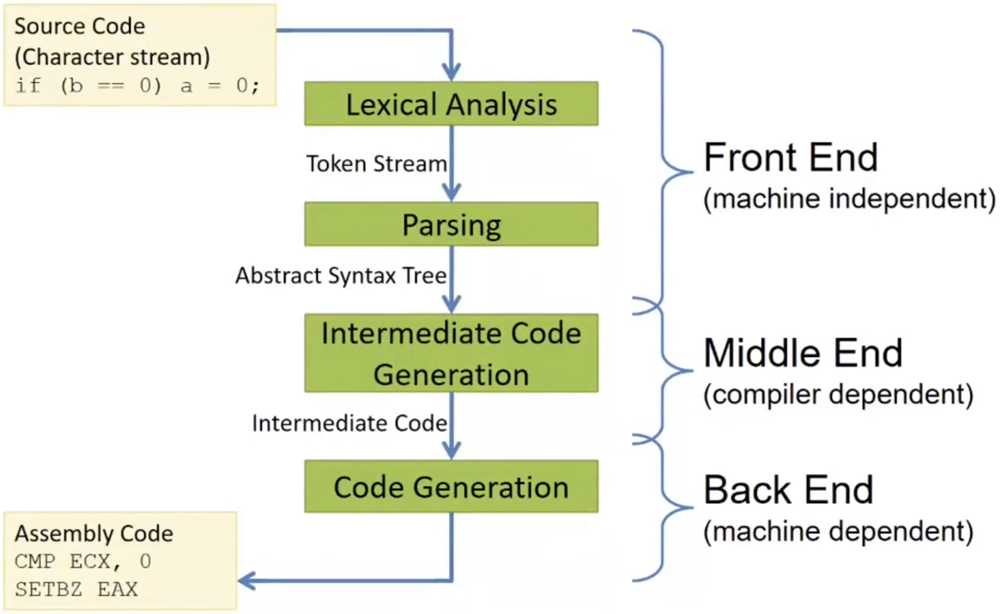
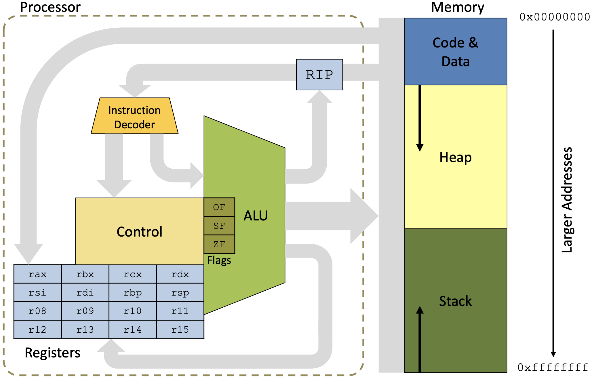
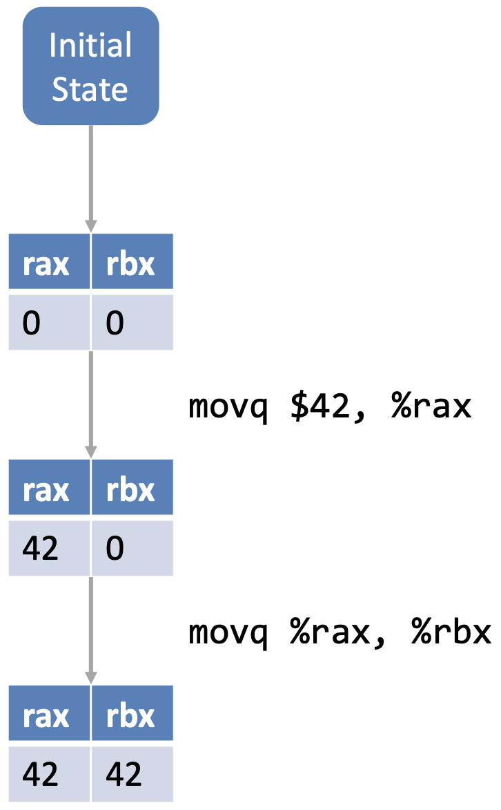

**Compiler Design - Lecture note week 2**

- Author: Ruben Schenk
- Date: 11.10.2021
- Contact: ruben.schenk@inf.ethz.ch

# 3. X86 LITE

## 3.1 Simplified Compiler Structure

A simplified compiler structure looks as follows:



## 3.2  X86 vs. X86Lite

`X86` assembly is very complicated:

- 8-, 16, 32-, and 64-bit values + floating point, etc.
- Intel 64 and IA 32 have a *huge* number of functions
- For machine code, the instruction range is in size from 1 to 17 bytes

`X86Lite` assembly is a very simple subset of X86

- Only 64-bit signed integers (no floating point, no 16-bit, no etc.)
- Only about 20 instructions
- Sufficient as a target language for general-purpose computing

## 3.3 X86 Schematic

The X86 schematic looks as follows:



### 3.3.1 Registers

There are three special **registers**:

- `rip`: The *instruction pointer*, holds the address of the next instruction
- `rbp`: The *base pointer*, used for call-stack manipulation
- `rsp`: *The stack pointer*, used for call-stack manipulation

### 3.3.2 Memory

The memory consists of thee parts:

- *Code & Data*: Holds the actual program instructions as well as program constants and globals
- *Stack*: Used for function calls and local variables
- *Heap*: Dynamically allocated memory, e.g. via calls to `malloc()`

## 3.4 Instructions

### 3.4.1 `mov`

The `mov` instructions is of the following form:

```x86
movq SRC, DEST
```

Here, `SRC` and `DEST` are *operands*. `DEST` is treated as a location, either a register or a memory address. `SRC` is treated as a values and is the content of either a register or a memory address or an immediate constant or a label.

Example of a `mov` instruction:



#### A Note About Instruction Syntax

The most important note is that we have the source *before* the destination. Furthermore:

- Immediate values are prefixed with `$`
- Registers are prefixed with `%`
- Mnemonic suffixed (`movq` vs `mov):
  - `q` -> quadword (4 words)
  - `l` -> long (2 words)
  - `w` -> word (16 bits)
  - `b` -> byte (8 bits)

### 3.4.2 X86 Operands

| **Type** | **Description**                                                           | **Example**                 |
|----------|---------------------------------------------------------------------------|-----------------------------|
| Imm      | 64-bit literal signed integer ("immediate")                               | `move $4, %rax`             |
| Lbl      | a "label" representing a machine address                                  | `call FOO`                  |
| Reg      | one of the 16 registers                                                   | `move %rbx, %rax`           |
| Ind      | machine address: [base:Reg][index:Reg][disp:int32](base + index*8 + disp) | `move 12(%rax, %rcx), %rbx` |

### 3.4.3 Arithmetic Instructions

| **Instruction**  | **Description**                              | **Example**      | **Notes**                                      |
|------------------|----------------------------------------------|------------------|------------------------------------------------|
| `negs DEST`      | 2's complement negation                      | `negs %rax`      |                                                |
| `add SRC, DEST`  | `DEST <- DEST + SRC`                         | `add %rbx, %rax` |                                                |
| `Subq SRC, DEST` | `DEST <- DEST - SRC`                         | `subq $4, %rsp`  |                                                |
| `Imulq SRC, Reg` | `Reg <- Reg * Src` (truncated 128-bit mult.) | `imulq $2, %rax` | `Reg` must be a register, not a memory address |

### 3.4.4 Logical/Bit Manipulation Instructions

| **Instruction**  | **Exaplanation**       | **Example**       | **Notes**             |
|------------------|------------------------|-------------------|-----------------------|
| `notq DEST`      | logical negation       | `notq %rax`       | bitwise not           |
| `andq SRC, DEST` | `DEST <- DEST & SRC`   | `andq %rbx, %rax` | bitwise and           |
| `orq SRC, DEST`  | `DEST <- DEST | SRC`   | `orq $4, %rsp`    | bitwise or            |
| `xorq SRC, DEST` | `DEST <- DEST xor SRC` | `xorq $2, %rax`   | bitwise xor           |
| `sarq Amt, DEST` | `DEST <- DEST >> Amt`  | `sarq $4, %rax`   | arithmetic shit right |
| `shlq Amt, DEST` | `DEST <- DEST <<< Amt` | `shlq %rbx, %rax` | logical shift left    |
| `shrq Amt, DEST` | `DEST <- DEST >>> Amt` | `shrq $1. %rsp`   | logical shift right   |

### 3.4.5 Condition Flags & Codes

Some X86 instructions set flags as side effects:

- `OF`: *overflow* is set when the result is too big/small to fit in a 64-bit register
- `SF`: *sign* is set to the sign of the result (`0` means positive, `1` means negative)
- `ZF`: *zero* is set when the result is `0`

From these three flags, we can define **condition codes**. If we want to compare `SRC1` to `SRC2`, we compute `SRC1 - SRC2`. We can then define the following condition codes based on the resulting condition flags:

| **Code**                 | **Condition**            |
|--------------------------|--------------------------|
| `e` (equality)           | `ZF` is set              |
| `ne` (inequality)        | `(not ZF)`               |
| `g` (greater than)       | `(not ZF) and (SF = OF)` |
| `l` (less than)          | `SF <> OF`               |
| `ge` (greater or equal)  | `(SF = OF)`              |
| `le`(less than or equal) | `SF <> OF or ZF`         |

*Example*: We might write conditional instructions in the following way in X86:

```c
// Conditional instruction in C
if (a == b) {
  // something
} else {
  // somethingElse
}
  // commonCode
```

```x86
; Conditional instruction in x86
  cmpq %rax, %rbx
  je

somethingElse:
  <instruction>
  ;...
  jmp commonCode

something:
  <instruction>
  ;...

commonCode:
  <instruction>
  ;...
```