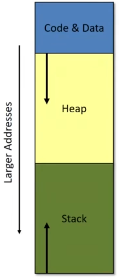
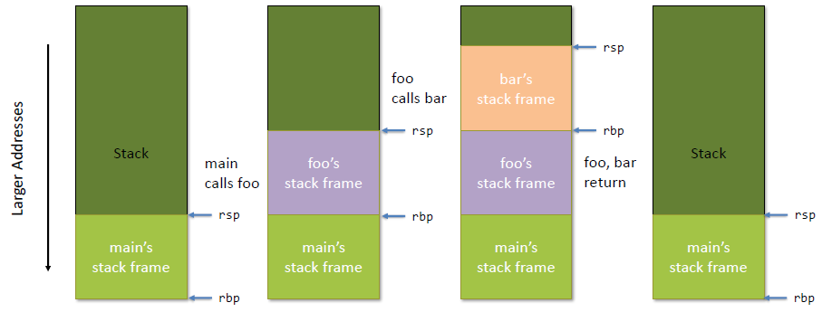

**Compiler Design — Lecture note week 2**

- Author: Ruben Schenk
- Date: 11.10.2021
- Contact: ruben.schenk@inf.ethz.ch

# 3. X86 LITE

## 3.1 Simplified Compiler Structure

A simplified compiler structure looks as follows:


## 3.2 X86 vs. X86Lite

`X86` assembly is very complicated:

- 8-, 16, 32-, and 64-bit values + floating point, etc.
- Intel 64 and IA 32 have a *huge* number of functions
- For machine code, the instruction range is in size from 1 to 17 bytes

`X86Lite` assembly is a very simple subset of X86

- Only 64-bit signed integers (no floating point, no 16-bit, no etc.)
- Only about 20 instructions
- Sufficient as a target language for general-purpose computing

## 3.3 X86 Schematic

The X86 schematic looks as follows:


### 3.3.1 Registers

There are three special **registers**:

- `rip`: The *instruction pointer*, holds the address of the next instruction
- `rbp`: The *base pointer*, used for call-stack manipulation
- `rsp`: *The stack pointer*, used for call-stack manipulation

### 3.3.2 Memory

The memory consists of three parts:

- *Code & Data*: Holds the actual program instructions as well as program constants and globals
- *Stack*: Used for function calls and local variables
- *Heap*: Dynamically allocated memory, e.g. via calls to `malloc()`

## 3.4 Instructions

### 3.4.1 `mov`

The `mov` instructions is of the following form:

```x86
movq SRC, DEST
```

Here, `SRC` and `DEST` are *operands*. `DEST` is treated as a location, either a register or a memory address. `SRC` is treated as a value and is the content of either a register or a memory address or an immediate constant or a label.

Example of a `mov` instruction:


#### A Note About Instruction Syntax

The most important note is that we have the source *before* the destination. Furthermore:

- Immediate values are prefixed with `$`
- Registers are prefixed with `%`
- Mnemonic suffixed (`movq` vs `mov):
  - `q` -> quadword (4 words)
  - `l` -> long (2 words)
  - `w` -> word (16 bits)
  - `b` -> byte (8 bits)

### 3.4.2 X86 Operands

| **Type** | **Description**                                                           | **Example**                 |
|----------|---------------------------------------------------------------------------|-----------------------------|
| Imm      | 64-bit literal signed integer ("immediate")                               | `move $4, %rax`             |
| Lbl      | a "label" representing a machine address                                  | `call FOO`                  |
| Reg      | one of the 16 registers                                                   | `move %rbx, %rax`           |
| Ind      | machine address: [base:Reg][index:Reg][disp:int32](base + index*8 + disp) | `move 12(%rax, %rcx), %rbx` |

### 3.4.3 Arithmetic Instructions

| **Instruction**  | **Description**                              | **Example**      | **Notes**                                      |
|------------------|----------------------------------------------|------------------|------------------------------------------------|
| `negs DEST`      | 2's complement negation                      | `negs %rax`      |                                                |
| `add SRC, DEST`  | `DEST <- DEST + SRC`                         | `add %rbx, %rax` |                                                |
| `Subq SRC, DEST` | `DEST <- DEST - SRC`                         | `subq $4, %rsp`  |                                                |
| `Imulq SRC, Reg` | `Reg <- Reg * Src` (truncated 128-bit mult.) | `imulq $2, %rax` | `Reg` must be a register, not a memory address |

### 3.4.4 Logical/Bit Manipulation Instructions

| **Instruction**  | **Explanation**       | **Example**       | **Notes**             |
|------------------|------------------------|-------------------|-----------------------|
| `notq DEST`      | logical negation       | `notq %rax`       | bitwise not           |
| `andq SRC, DEST` | `DEST <- DEST & SRC`   | `andq %rbx, %rax` | bitwise and           |
| `orq SRC, DEST`  | `DEST <- DEST | SRC`   | `orq $4, %rsp`    | bitwise or            |
| `xorq SRC, DEST` | `DEST <- DEST xor SRC` | `xorq $2, %rax`   | bitwise xor           |
| `sarq Amt, DEST` | `DEST <- DEST >> Amt`  | `sarq $4, %rax`   | arithmetic shift right |
| `shlq Amt, DEST` | `DEST <- DEST <<< Amt` | `shlq %rbx, %rax` | logical shift left    |
| `shrq Amt, DEST` | `DEST <- DEST >>> Amt` | `shrq $1. %rsp`   | logical shift right   |

### 3.4.5 Condition Flags & Codes

Some X86 instructions set flags as side effects:

- `OF`: *overflow* is set when the result is too big/small to fit in a 64-bit register
- `SF`: *sign* is set to the sign of the result (`0` means positive, `1` means negative)
- `ZF`: *zero* is set when the result is `0`

From these three flags, we can define **condition codes**. If we want to compare `SRC1` to `SRC2`, we compute `SRC1 - SRC2`. We can then define the following condition codes based on the resulting condition flags:

| **Code**                 | **Condition**            |
|--------------------------|--------------------------|
| `e` (equality)           | `ZF` is set              |
| `ne` (inequality)        | `(not ZF)`               |
| `g` (greater than)       | `(not ZF) and (SF = OF)` |
| `l` (less than)          | `SF <> OF`               |
| `ge` (greater or equal)  | `(SF = OF)`              |
| `le`(less than or equal) | `SF <> OF or ZF`         |

### 3.4.6 Conditional Instructions

We might write conditional instructions in the following way in X86:

```c
// Conditional instruction in C
if (a == b) {
  // something
} else {
  // somethingElse
}
  // commonCode
```

```assembly
; Conditional instruction in x86
  cmpq %rax, %rbx
  je

somethingElse:
  <instruction>
  ;...
  jmp commonCode

something:
  <instruction>
  ;...

commonCode:
  <instruction>
  ;...
```

We support the following three **conditional instructions**:

| **Instruction**   | **Description**                              |
|-------------------|----------------------------------------------|
| `cmpq SRC2, SRC1` | Compute `SRC1 - SRC2`, set condition flags   |
| `setbCC DEST`     | `DEST`'s lower byte <- `if CC then 1 else 0` |
| `jCC SRC`         | `rip <- if CC then SRC else fallthrough`     |

### 3.4.7 Code Blocks and Labels

x86 assembly code is organized into **labeled blocks**. Labels indicate code locations than can be jump targets. Labels are translated away by the linker and loader -- instructions live in the *code segment*.

An x86 program begins executing at a designated code label (usually `main`).

### 3.4.8 Jumps, Call and Return

We might code function calls in the following way in x86:

```c
void bar() {
  // ...
}

void foo() {
  // ...
  bar();
}
```

```assembly
bar:
  <instruction>
  ;...
  <instruction>
  ret

foo:
  <instruction>
  ; ...
  <instruction>
  call bar
  ;...
```

The different instructions one might use are given by the following table:

| **Instruction** | **Description**                             | **Notes**                                                                                                                                    |
|-----------------|---------------------------------------------|----------------------------------------------------------------------------------------------------------------------------------------------|
| `jmp SRC`       | `rip <- SRC`                                | Jump to location in `SRC`                                                                                                                    |
| `call SRC`      | Push `rip`, `rip <- SRC` (call a procedure) | Push the program counter to the stack (decrementing `rsp`), and then jump to the machine instruction at the address given by `SRC`           |
| `ret`           | Pop into `rip` (return from procedure)      | Pop the current top of the stack into `rip` (incrementing `rsp`). This instruction effectively jumps to the address at the top of the stack. |

## 3.5 x86Lite Addresses

### 3.5.1 x86Lite Addressing

We show how **addressing** in x86Lite works with the following simple example:

```c
long a[0, 42, 2020;]

long b = (long)a;     // b = address(a)
long b = *a;          // b = a[0] = 0
long b = *(a+2);      // b = a[2] = 2020

long c = 1;
long b = a[c];        // b = 42
long b = a[c+1];      // b = 2020
```

```assembly
; Array [0, 42, 2020]
; Array address 0xBEEF

movq %0xBEEF, %rax

movq %rax,     %rbx        ; rbx = 0xBEEF
movq (%rax),   %rbx        ; rbx = 0
movq 16(%rax), %rbx        ; rbx = 2020

movq $1, %rcx
movq (%rax, %rcx), %rbx    ; rbx = 42
movq 8(%rax, %rcx), %rbx   ; rbx = 2020
```

In general, there are three components to an **indirect address**:

- *Base*: a machine address stored in a register
- *Index*: a variable offset from the base
- *Disp*: a constant offset (displacement) from the base

We therefore have: `addr(ind) = Base + [Index * 8] + Disp`. When used as a location, `ind` denotes the address `addr(ind)`. When used as a value, `ind` denotes `Mem[addr(ind)]`, the contents of the memory address.

Examples:

| **Expression**  | **Address**         |
|-----------------|---------------------|
| `-8(%rsp)`      | `rsp - 8`           |
| `(%rax, %rcx)`  | `rax + 8 * rcx`     |
| `8(%rax, %rcx)` | `rax + 8 * rcx + 8` |

### 3.5.2 x86Lite Memory Model

The x86Lite memory consists of `2^64` bytes numbered `0x00000000` through `0xffffffff`. The memory is treated as consisting of 64-bit (8 byte) words. Therefore: *legal x86Lite memory addresses consists of 64-bit, quadword-aligned pointers*. This means, that all memory addresses are evenly divisible by 8.

To load a pointer into `DEST`, we use `leaq Ind, DEST` (`DEST <- addr(Ind)`).

By convention, the stack grows from high addresses to low addresses.

The register `rsp` points to the top of the stack:

- `pushq SRC`: `rsp <- rsp - 8; Mem[rsp] <- SRC`
- `popq DEST`: `DEST <- Mem[rsp]; rsp <- rsp + 8`

> Here is a nice website to explore assembly code given some code snippet in another language: [Compiler Explorer](https://godbolt.org/)

### 3.6 Example: Handcoding x86Lite

Let's look at how we would implement the **factorial** function in **x86Lite**:

```assembly
;  long factorial(long i) {
;  if (i > 1l) {
;    return i * factorial(i-1l);
;  }
;  return 1l;
;}

.text
.global factorial

factorial:
  ; i is in %rdi

  ; boilerplate
  pushq   %rbp
  movq    %rsp, %rbp

  ; if (i > 1l)
  cmpq    $1, %rdi      ; computes %rdi - 1
  jle     .BASECASE     ; if (i <= 1)

  ; (i > 1l) holds at this point
  pushq   %rdi          ; stores the current value of i on top of the calls tack

  subq    $1, %rdi
  callq   factorial

  ; %rax holds factorial(i - 1)
  popq    %rdi          ; %rdi holds again the original value of i
  imulq   %rdi, %rax    ; i * factorial(i - 1)

  jmp     .EXIT

.BASECASE:
  movq    $1, %rax

.EXIT:
  ; rest of boilerplate
  movq    %rbp, %rsp
  popq    %rbp
  ret     ; return the value in %rax

.data
```

*Remark: By convention, compilers often use a `.` in front of a label that is internal, i.e. not a global label (compare `factorial` to `.EXIT` in the code above).*

## 3.7 Programming in x86Lite

### 3.7.1 Three parts of the C memory model

We want to quickly revisit the three different parts of the C memory model, shown in the picture below.



- The **code & data** (or `.text`) segment: contains compile code, constant strings, etc.
- The **heap**: stores dynamically allocated objects, is allocated via `malloc` and deallocated via `free`
- The **stack**: stores local variables, the return address of a function and other bookkeeping information

### 3.7.2 Local vs. Temporal Variable Storage

We somehow need space to store things like global variables, values passed as arguments to procedures, and local variables. The processor provides two options for storing stuff:

- *Registers*: fast, small size, very limited number
- *Memory (Stack)*: slow, very large amount of space

Example:

```assembly
; int i = 5

; Option 1:
; store to a register
; register is "blocked"
movq    $5, %rax

; Option 2:
; store on the stack
subq    $8, %rsp
movq    $5, (%rsp)
;...
movq    (%rsp), %rax
```

### 3.7.3 The Stack

The following picture shows how we use the stack in a program with different calls. This corresponds to the "boilerplate" code in the previous example with the `factorial`. We adjust the pointers to the bottom and the top of the stack before and after calling a "function", such that the function has its own **stack frame**.



### 3.7.4 Calling Conventions

The **calling conventions** cover three main topics:

- Specify the locations of arguments
  - Passed to a function, and
  - Returned by a function
- Designate registers as either
  - Caller Save -- e.g. freely usable by the called code
  - Callee Save -- e.g. must be restored by the called code
- Define the protocol for deallocating stack-allocated arguments, either
  - Caller cleans up
  - Callee cleans up

The widely used calling conventions for x86-64 systems are as follows:

- Callee save registers: `rbp, rbx, r12-r15`
- Caller save: all others
- Call parameters:
  - Parameter 1-6: `rdi, rsi, rdx, rcx, r8, r9`
  - Parameter 7+: on the stack (in right-to-left order), thus, for `n > 6`, the nth argument is at `((n - 7) + 2) * 8 + rbp`
- Return value is in `rax`
- 128-byte "red zone" -- scratchpad for the callee's data
