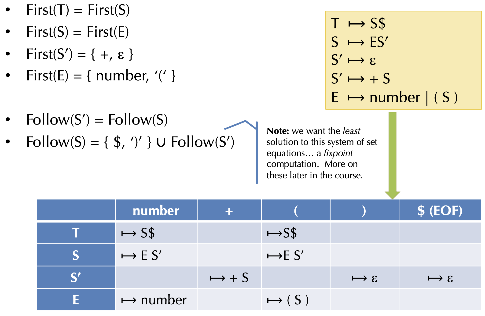
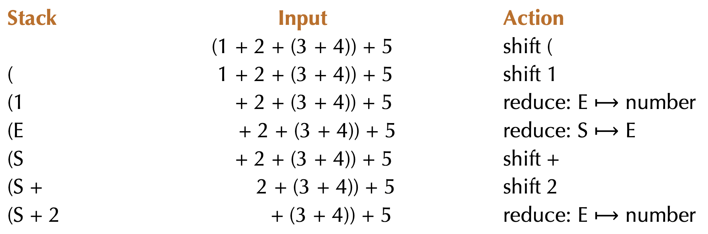
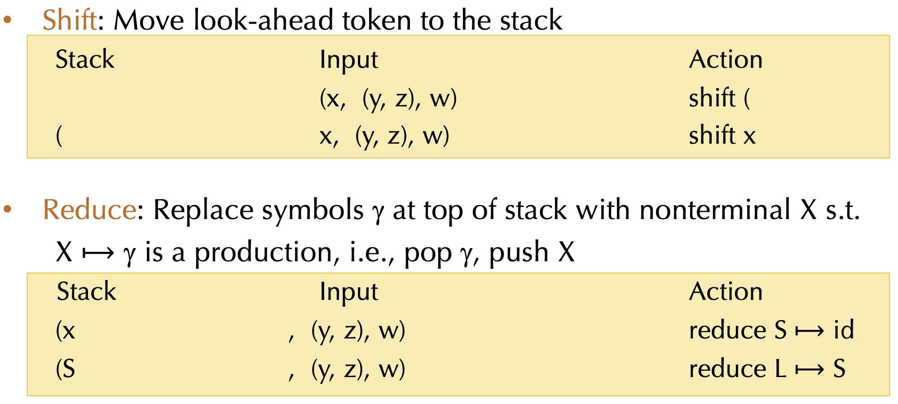

**Compiler Design — Lecture notes week 6**

- Author: Ruben Schenk
- Date: 26.10.2021
- Contact: ruben.schenk@inf.ethz.ch

# 8. LL & LR Parsing

## 8.1 LL(1) Grammars

One problem with grammars is that not all grammars can be parsed "top-down" with a _single lookahead_. _Top-down_ means that we start from the start symbol, i.e. the root of the parse tree, and go down.

**LL(1)** means:

- Left-to-right scanning
- Left-most derivation
- 1 lookahead symbol

### 8.1.1 Making a Grammar LL(1)

The main problem is that we can't decide which $S$ production to apply until we see the symbol after the first expression. The solution is to _left-factor_ the grammar. There is a common $S$ prefix for each choice, so add a new non-terminal $S'$ at the decision point:

This means that we transform our example grammar

$$S \to E + S \, | \, E \\ E \to \text{number} \, | \, (S)$$

to the following "left-factor" grammar:

$$S \to ES' \\ S' \to \epsilon \\ S' \to + S \\ E \to \text{number} \, | \, (S)$$

However, we also need to _eliminate left-recursion_ somehow. In general, this is done by rewriting the following left-recursive rule

$$S \to S \alpha_1 \, | \, \cdots \, | \, S \alpha_n \, | \, \beta_1 \, | \, \cdots \, | \, \beta_m$$

to a rule of the form:

$$S \to \beta_1 S' \, | \, \cdots \, | \, \beta_m S' \\ S' \to \alpha_1 S' \, | \, \cdots \, | \, \alpha_n S' \, | \, \epsilon$$

In our running example, this would mean to rewrite

$$S \to S + E \, | \, E \\ E \to \text{number} \, | \, (S)$$

to the following left-recursion-eliminating grammar:

$$S \to ES' \\ S' \to +ES' \, | \, \epsilon \\ E \to \text{number} \, | \, (S)$$

### 8.1.2 Predictive Parsing

Given an LL(1) grammar:

- For a given non-terminal, the lookahead symbol uniquely determines the production to apply
- The parsing is driven by a predictive parsing table
- It is convenient to add a special _end-of-file token_ $ and a start symbol $T$ that requires $

_Example:_ Let us look at the following LL(1) grammar:

$$T \to S\$ \\ S \to ES' \\ S' \to \epsilon \\ S' \to + S \\ E \to \text{number} \, | \, (S)$$

We then propose the following **predictive parsing table:**

|      | **number**          | **+**     | **(**     | **)**          | **$ (EOF)**    |
| ---- | ------------------- | --------- | --------- | -------------- | -------------- |
| $T$  | $\to S$ $           |           | $\to S$ $ |                |                |
| $S$  | $\to ES'$           |           | $\to ES'$ |                |                |
| $S'$ |                     | $\to + S$ |           | $\to \epsilon$ | $\to \epsilon$ |
| E    | $\to \text{number}$ |           | $\to (S)$ |                |                |

### 8.1.3 Construction of Parse Table

How do we construct the parse table? We examine two possible cases by considering the following production: $A \to \gamma$

#### Case 1

Construct the set of all input tokens that may appear _first_ in strings that can be derived from $\gamma$. Then add the production $\to \gamma$ to the entry $(A, \, \text{token})$ for each such token.

#### Case 2

If $\gamma$ can derive $\epsilon$, then we construct the set of all input tokens that may _follow_ the nonterminal $A$ in the grammar. We then add the production $\to \gamma$ to the entry $(A, \, \text{token})$ for each such token.

_Note:_ If there are two different productions for a given entry, then the grammar is not LL(1).

_Example:_

### 8.1.4 Converting The Parsing Table to Code

When we want to convert a parsing table to code, we proceed as follows:

- Define $N$ mutually recursive functions, one for each non-terminal $A$: `parse_A`
- `parse_A` is of type `unit -> ast` if £A$ is not an auxiliary non-terminal
- Otherwise, `parse_A` takes additional ast's as inputs, one for each non-terminal in the "factored" prefix

Then, each function `parse_A`:

- "Peeks" at the lookahead token
- Follows the production rule in the corresponding entry
- Consumes the terminal tokens from the input stream
- Calls `parse_X` to create the sub-tree for the non-terminal $X$
- If the rule ends in an auxiliary non-terminal, it is called with the appropriate ast's
- Otherwise, this function builds the ast tree itself and returns it

### 8.1.5 LL(1) Summary

**LL(1)** is top-down based parsing that finds the left-most derivation. The process proceeds with the following steps:

1. Language grammar =>
2. LL(1) grammar =>
3. Prediction table =>
4. Recursive-descent parser

## 8.2 LR Grammars

### 8.2.1 Bottom-up Parsing

**LR(k) parser** are _bottom-up parser_:

- Left-to-right scanning
- Right-most derivation
- k lookahead symbols

LR grammars are _more expressive_ than LL grammars:

- They can handle left-recursive (and right-recursive) grammars (i.e. virtually all programming languages)
- They make it easier to express programming language syntaxt (e.g. no left factoring)

The most common technqiue are **Shift-Reduce parsers:**

- Work bottom up instead of top down
- Construct the right-most derivation of a program in the grammar
- Better error detection/recovery

### 8.2.2 Shift/Reduce Parsing

In shift/reduce parsing, the parser has a **parser state** described as follows:

- Stack of terminals and non-terminals
- Unconsumed input is a string of terminals
- The current derivation stepis `stack + input`

**Parsing** is a sequence of `shif` and `reduce` operations:

- Shift: Move lookahead token to the stack
- Reduce: Repalce symbols $\gamma$ at the top of the stack with a non-terminal $X$ s.t. $X \to \gamma$ is aproduction, i.e. `pop gamma, push X`

_Example:_ We consider our previous example

$$S \to S + E \, | \, E \\ E \to \text{number} \, | \, (S)$$

## 8.3 LR(0) Grammars

### 8.3.1 LR Parser States

Our goal it is to know _what set of reductions are legal_ at any given point. The idea to solve this problem is to summarize all possible stack prefixes $\alpha$ as a finite parser state:

- The parser state is computed by a DFA that reads the stack $\sigma$
- Accept states of the DFA correspond to unique reductions that apply

### 8.3.2 Example LR(0) Grammar: Tuples

The following grammar is an example grammar for non-empty tuples and identifiers:

$$S \to (L) \, | \, \text{id} \\ L \to S \, | \, L, \, S$$

Now, if we apply parsing as a sequence of shift and reduce operations, we end up with the following parse operation:

### 8.3.3 Action Selection Problem

Given a stack $\sigma$ and a lookahead symbol $b$, should the parser either:

- Shift $b$ onto the stack (new stack is $\sigma b$), or
- Reduce a production $X \to \gamma$, assuming that $\sigma = \alpha \gamma$ (new stack is $\alpha X$) ?

The main idea to solve this problem is to decide based on a prefix $\alpha$ of the stack plus the lookahead. The prefix $\alpha$ is different for different possible reductions since in productions $X \to \gamma$ and $Y \to \beta$, $\gamma$ and $\beta$ might have different lengths.

### 8.3.4 LR(0) States

A **LR(0) state** consists of items to track progress on possible upcoming reductions. A **LR(0) item** is a production with an extra separator `.` in the RHS. Example items could be: $S \to .(L)$ or $S \to (.L)$ or $L \to S.$

The intuition for the meaning of the dot is:

- Stuff before the `.` is already on the stack
- Stuff after the `.` is what might be seen next

### 8.3.5 Constructing The DFA

We will consider the following grammar:

$$S' \to S \$ \\ S \to (L) \, | \, \text{id} \\ L \to S \, | \, L, \, S$$

The first step when creating the DFA is to add a new production $S' \to S$$ to the grammar. The _start state_ of the DFA is the empty stack, so it contains the item $S' \to .S$$. We then proceed to add the **closure of the state** to our DFA:

- Add items for all productions whose LHS non-terminal occurs in an item in the state just after the `.` (e.g. $S$ in $S' \to .S$$)
- The added items have the `.` located at the beginning
- Note that newly added items may cause yet more items to be added to the state, we keep iterating until a _fixed point_ is reached

_Example:_

$$\text{Closure}(\{S' \to .S \$ \}) = \{S' \to .S \$, \, S \to .(L), \, S \to .\text{id} \}$$
