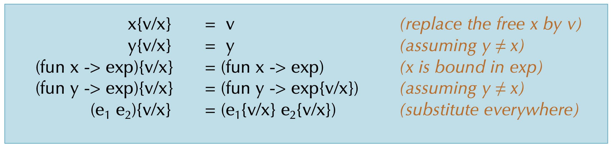
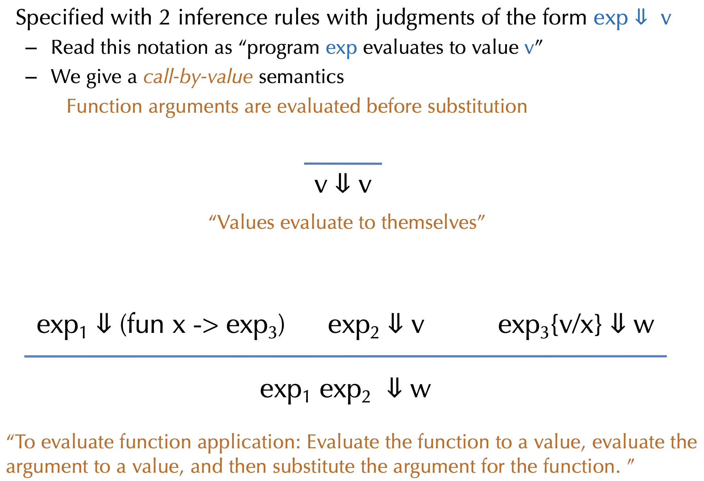
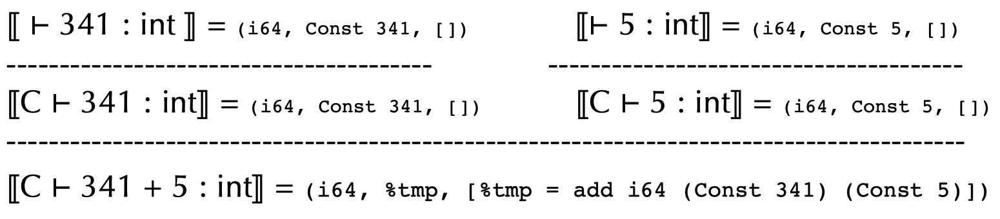
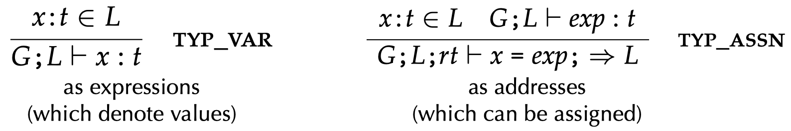
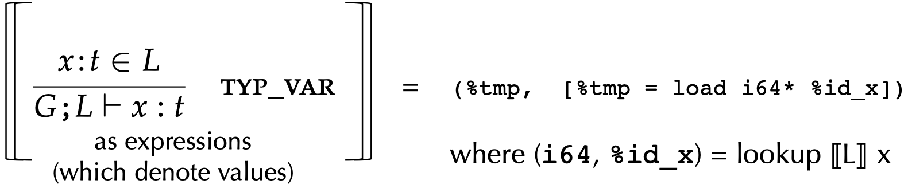
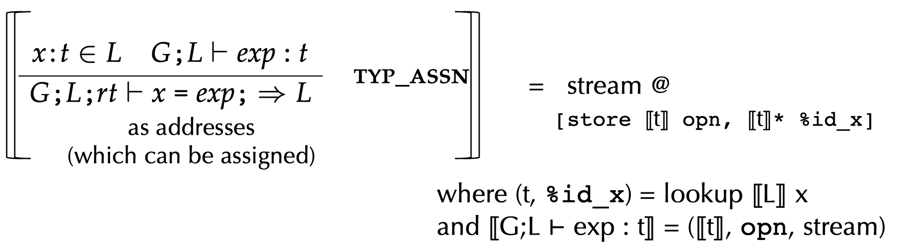
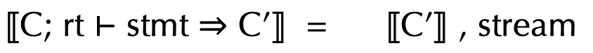
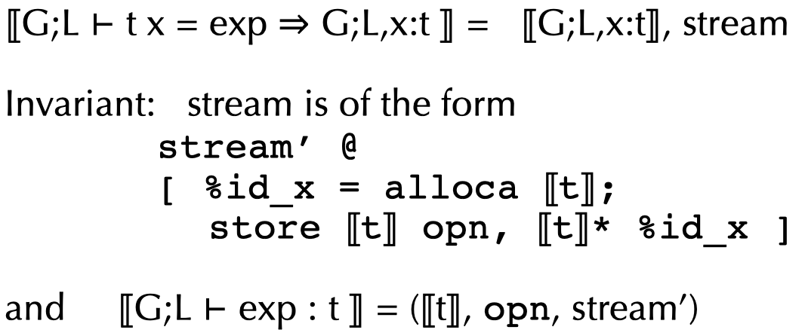
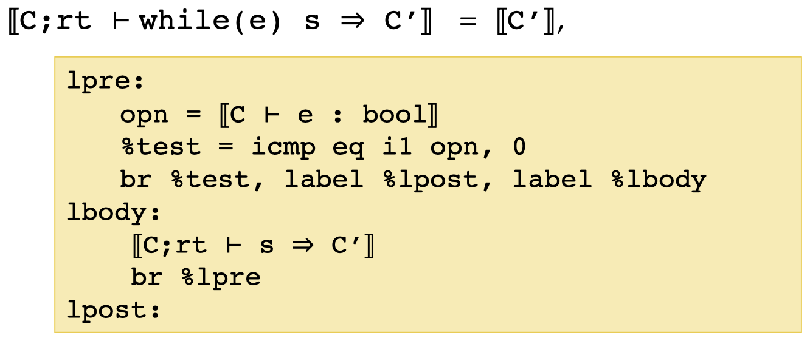
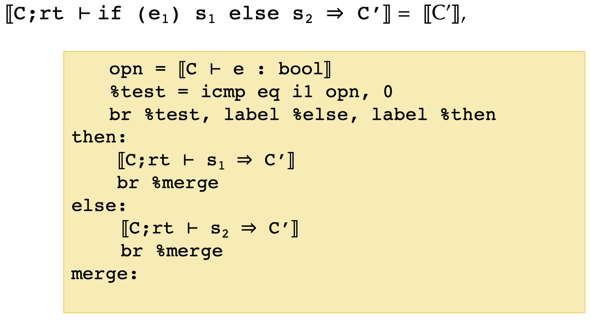

**Compiler Design — Lecture notes week 7**

- Author: Ruben Schenk
- Date: 09.11.2021
- Contact: ruben.schenk@inf.ethz.ch

# 9. Menhir In Practice

## 9.1 Menhir Output

You can get verbose ocamlyacc debugging information by doing:

```console
menhir --examplain
```

or, if using `ocamlbuild`:

```console
ocamlbuild -use-menhir -yaccflag --explain
```

The result is a `<basename>.conflicts` file describing the error. The flag `--dump` generates a full description of the automaton.

## 9.2 Precedence and Associativity Declarations

Parser generators often support **precedence/associativity declarations**. Those hint to the parser about how to resolve conflicts.

- Pros:
  - Avoids having to manually resolve those ambiguities by manually introducing extra non-terminals
  - Easier to maintain the grammar
- Cons:
  - Can't as easily re-use the same terminal
  - Introduces another level of debugging


# 10 Untyped Lambda Calculus

## 10.1 Functional Languages

Languages like ML, Haskell, Scheme, Python etc. support different operations on and with functions:

- Functions can be passed as arguments (e.g. `map` or `fold`)
- Functions can be returned as values (e.g. `compose`)
- Functions can be nested, i.e. inner functions refer to variables bound in the outer function

_Example:_

```ocaml
let add = fun x -> fun y -> x + y
let inc = add 1
let dec = add -1

let compose = fun f -> fun g -> fun x -> f (g x)
let id = compose inc dec
```

But how do we implement such functions in an interpreter or in a compiled language?

## 10.2 Lambda Calculus

The **lambda calculus** is a minimal programming language. It has variables, functions, and function application. That's it! It is, however, still touring complete.

The abstract syntax in OCaml is:

```ocaml
type exp =
    | Var of var        (* variables *)
    | Fun of var * exp  (* functions: fun x -> e *)
    | App of exp * exp  (* function application *)
```

The concrete syntax is:

```bnf
exp ::=
    | x
    | fun x -> exp
    | exp_1 exp_2
    | (exp)
```

## 10.3 Values and Substitution

The only **values** of the lambda calculus are (closed) functions:

```bnf
val ::=
    | fun x -> exp
```

To **substitute** value `v` for variable `x` in expression `e`:

- Replace all _free occurrences_ of `x` in `e` by `v`
- In OCaml written as `subst v x e`

Function application is interpreted by substitution:

```bnf
(fun x -> fun y -> x + y) 1
= subst 1 x (fun y -> x + y)
= (fun y -> 1 + y)
```

## 10.4 Lambda Calculus Operational Semantics



## 10.5 Free Variables and Scoping

We look at the following example code:

```ocaml
let add = fun x -> fun y -> x + y
let inc = add 1
```

The result of `add 1` is a function. After calling `add`, we can't throw away its arguments (or its local variables) because those are needed in the function returned by `add`.

- We say that variable `x` is **free** in `fun y -> x + y` (the variable is defined in the outer scope)
- We say that variable `y` is **bound** by `fun y`. Its scope is the body `x + y` in `fun y -> x + y`

A term with no free variables is called **closed**. In contrast, a term with one or more free variables is called **open**.

## 10.6 Free Variable Calculation

The following OCaml code computes the set of free variables in lambda expressions:

```ocaml
let rec free_vars (e:exp) : VarSet.t =
    begin match e with
        | Var x         -> VarSet.singleton x
        | Fun (x, body) -> VarSet.remove x (free_vars body)
        | App (e1, e2)  -> VarSet.union (free_vars e1) (free_vars e2)
    end
```

We then say a lambda expression `e` is _closed_ if `free_vars e` is `VarSet.empty`.

## 10.7 Variable Capture

Note that if we try to naively substitute an open term, a bound variable might **capture** the free variables. Example:

```bnf
(fun x -> (x y)) {(fun z -> x)/y}   // x is free in (fun z -> x)
= fun x -> (x (fun z -> x))         // the free x is now captured
```

This is usually not the desired behavior! The meaning of `x` is determined by where it is bound dynamically, not where it is bound statically (_dynamic scoping_).

## 10.8 Alpha Equivalence

Note that the names of bound variables don't matter. `(fun x -> y x)` is the same as `(fun z -> y z)`.
Two terms that differ only by consistent renaming of bound variables are called **alpha equivalent.**

However, the names of free variables do matter! `(fun x -> y x)` is not the same as `(fun x -> z x)`.

## 10.9 Fixing Substitution

We can fix the substitution problem. For this, let us consider the following substitution operation: $e_1{e_2/x}$

To avoid capture, we define the substitution to pick an alpha equivalent version of $e_1$, such that the bound names of $e_1$ don't mention the free names of $e_2$. Then we can do the simple naive substitution.

_Example:_

```bnf
(fun x -> (x y)) {(fun z -> x)/y}
= (fun x' -> (x' (fun z -> x)))     // rename x to x'
```

## 10.10 Operational Semantics



## 10.11 Adding Integers to Lambda Calculus

We might extend our previously described Lambda Calculus with **integer values** by modifying our previous definitions in the following way:

```bnf
exp ::=
    | ...
    | n             // constant integers
    | exp1 + exp2   // binary arithmetic operation

val ::=
    | fun x -> exp  // functions are values
    | n             // integers are values

n{v/x} = n          // constants have no free variables
(e1 + e2){v/x} = (e1{v/x} + e2{v/x})
```

# 11. Static Analysis

## 11.1 Variable Scoping

We have the following problem: How do we determine whether a declared variable is in scope?

_Example:_ The code below is syntactically correct, but not well-formed! `y` and `q` are used without being defined anywhere.

```c
int fact(int x) {
    var acc = 1;
    while(x > 0) {
        acc = acc * y;
        x = q - 1;
    }
    return acc;
}
```

## 11.2 Contexts and Inference Rules

We somehow need to keep track of **contextual information**, i.e. what variables are in the current scope and what their types are.

One way to describe this is that the compiler keeps a mapping from variables to information about them using a **symbol table.**

### 11.2.1 Inference Rules

A **judgement** is of the form $G;L \vdash e : t$ is read as "_the expression `e` is well typed and has type `t`_".

For any **environment** $G;L$, expression `e`, and statements `s1, s2`:

$$
G;L;rt \vdash \text{if } (e) \, s_1 \text{ else } s_2
$$

holds if $G;L \vdash e : \text{bool}$, $G;L;rt \vdash s_1$, $G;L;rt \vdash s_2$ all hold.

More succinctly, we can summarize these constraints as an **inference rule:**

$$
\frac{G;L \vdash e : \text{bool} \quad G;L;rt \vdash s_1 \quad G;L;rt \vdash s_2}{G;L;rt \vdash \text{if } (e) \, s_1 \text{ else } s_2}
$$

### 11.2.2 Checking Derivations

We can build a **derivation tree** by making the nodes to be judgements and the edges to connect premises to a conclusion (according to the inference rules). Leaves of the tree are **axioms**, i.e. rules with no premises. The goal of the **type checker** is to verify that such a _tree exists._

### 11.2.3 Compilation as Translating Judgements

Consider the typing judgement for source expressions: $C \vdash e : t$. How do we interpret this information in the target language? I.e. $[[C \vdash e : t]] = \, ?$ We have that:

- $[[t]]$ is a target type
- $[[e]]$ translates to a (possibly empty) sequence of instructions

We can state the following _invariant:_ If $[[C \vdash e : t]] = \text{ ty, operand, stream}$, then the type of the operand is $ty = [[t]]$.

_Example:_ What is $[[C \vdash 341 + 5 : int]]$ ?



### 11.2.4 Contexts

What is $[[C]]$ ? Source level $C$ has bindings like $x:\text{ int}, \, y:\text{ bool},$ etc. $[[C]]$ maps source identifiers $x$ to source types $[[x]]$.

The interpretation of a variable $[[x]]$ can is:



### 11.2.5 Other Judgements

_Establish invariant for expressions:_



_Statements:_





_Declaration:_



## 11.3 Compiling Control

### 11.3.1 Translating while



### 11.3.2 Translating If-Then-Else


