## 11.4 Optimizing Control

### 11.4.1 Standard Evaluation

Consider compiling the following program fragment:

```c
if(x & !y | !w) {
    z = 3;
} else {
    z = 4;
}
return 7;
```

```llvm
    %tmp1 = icmp Eq [[y]], 0
    %tmp2 = and [[x]], %tmp1
    %tmp3 = icmp Eq [[w]], 0
    %tmp4 = or %tmp2, %tmp3
    %tmp5 = icmp Eq %tmp4, 0
    br %tmp5, label %else, label %then

then:
    store [[z]], 3
    br %merge

else:
    store [[z]], 4
    br %merge

merge:
    %tmp6 = laod [[z]]
    ret %tmp 6
```

What we observe is that usually, we want the translation `[[e]]` to produce a value $[[C \vdash e_1 + e_2 : int]] = (\text{ty, operand, stream})$ = `i64, %tmp, [%tmp = add [[e1]] [[e2]]])`. 

But, when the compiled expression appears in a test, the program jumps to one label or another after the comparison (besides that, it never uses the value). In many cases, we can avoid _materializing_ the value (i.e. storing it in a temporary) and thus produce better code.

### 11.4.2 Short Circuit Boolean Compilation

Instead of the usual expression translation of the form:

$$[[C \vdash e : t]] = (\text{ty, operand, stream})$$

we can use a _conditional branch translation of Booleans,_ without materializing the value:

$$[[C \vdash e : \text{bool}@]] \text{ Itrue Ifalse} = \text{stream}$$
$$[[C, \, rt \vdash \text{if } (e) \text{ then } s_1 \text{ else } s_2 \Rightarrow C']] = [[C']]$$

This takes two extra arguments, namely the "true" branch label and the "false" branch label, and doesn't return a value.

#### Expressions

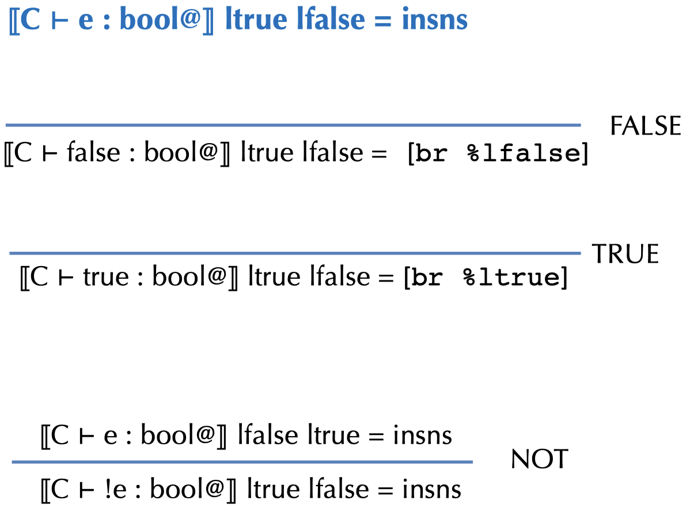{width=50%}

#### Evaluation

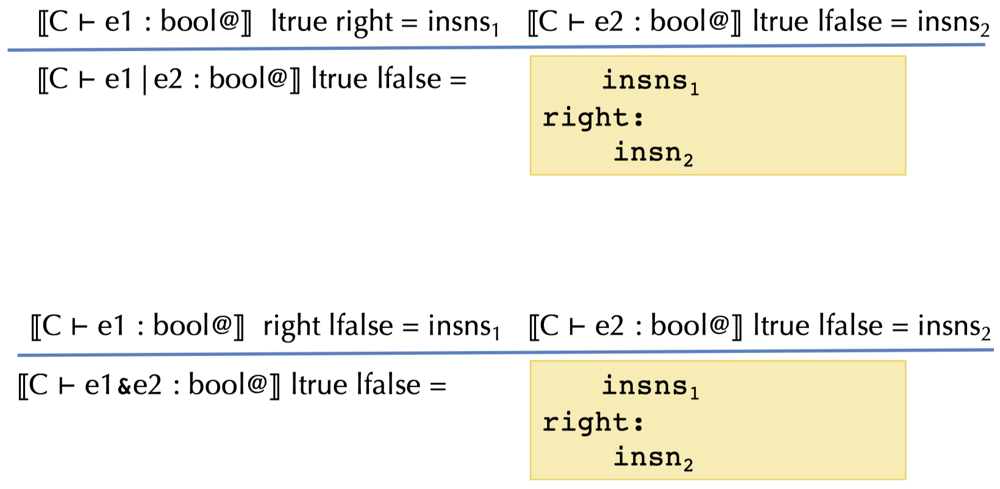{width=50%}

If we reconsider our previous code example, we might translate it, using short circuit evaluation, into the following code fragment:

```llvm
    %tmp1 = icmp Eq [[x]], 0
    br %tmp1, label %right2, label %right1

right1:
    %tmp2 = icmp Eq [[y]], 0
    br %tmp2, label %then, label %right2

right2:
    %tmp3 = icmp Eq [[w]], 0
    br %tmp3, label %then, label %else

then:
    store [[z]], 3
    br %merge

else:
    store [[z]], 4
    br %merge

merge:
    %tmp5 = load [[z]]
    ret %tmp6
```

## 11.5 Closure Conversion

As we have already seen, in functional languages such as ML, Haskell, Scheme, Python, etc, functions can be:

- passed as arguments (such as `map` or `fold`)
- returned as values (such as `compose`)
- nested, i.e. an inner function can refer to variables bound to an outer function

We can show a simple example with the following code fragment:

```ocaml
let add = fun x -> fun y -> x + y
let inc = add 1
let dec = add -1

let compose = fun f -> fun g -> fun x -> f (g x)
let id = compose inc dec
```

But how do we implement such functions in an interpreter or in a compiled language?

### 11.5.1 Compiling First-class Functions

To implement first-class functions on a processor, there are 2 main problems:

- We must implement substitution of free variables
- We must separate "code" from "data"

We can do those things by:

- _Reify the substitution:_ Move the substitution from the meta language to the object language by making the data structure and lookup operation explicit
- _Closure conversion:_ Eliminates free variables by packaging up the needed environment in the data structure
- _Hoisting:_ Separates code from data, pulling closed code to the top level

#### Closure Creation

Recall the `add` function `let add = fun x -> fun y -> x + y` and consider the inner function `fun y -> x + y`.

When we run the function application `add 4`, the program builds a closure and returns it (the **closure** is a pair of the _environment_ and a _code pointer_):

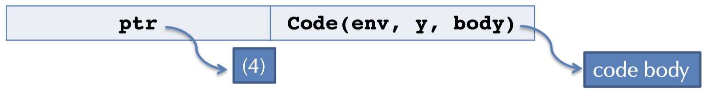{width=50%}

The code pointer takes a pair of parameters: `env` and `y`. The function code is essentially:

```ocaml
fun (env y) -> let x = nth env 0 in x + y
```

#### Representing Closures

The simple closure conversion doesn't generate very efficient code:

- It stores all the values for variables in the environment, even if they aren't needed by the function body
- It copies the environment values each time a nested closure is created
- It uses a linked-list data structure for tuples

There are many options to solve those shortcomings, such as:

- Store only the values for free variables in the body of the closure
- Share subcomponents of the environment to avoid copying
- Use vectors or arrays rather than linked structures

**Array-based closure with N-ary functions:**

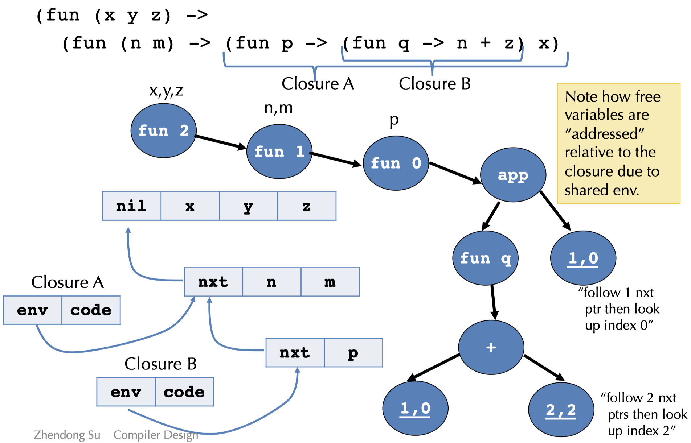{width=50%}

# 12. Statically Ruling Out Partiality: Type Checking

## 12.1 Introduction

### 12.1.1 Contexts and Inference Rules

We need to keep track of contextual information, such as:

- What variables are in scope?
- What are their types?
- What information do we have about each syntactic construct?

How do we describe this information?

- In the compiler, there's a mapping from variables to information we know about them, i.e. the _context_
- The compiler has a collection of (mutually recursive) functions that follow the structure of the syntax

### 12.1.2 Type Judgements

In the _judgement_ $E \vdash e : t$

- $E$ is a typing environment or a type context
- $E$ maps variables to types and is simply a set of bindings of the form: $x_1 : t_1, \, x_2 : t_2, \, ..., \, x_n : t_n$

These mappings could be, for example, $x : int, \, b : \text{if } (b) \, 3 \text{ else } x : int$.

What do we need to know to decide whether $\text{if } (b) \, 3 \text{ else } x$ has type $int$ in the environment $x : int, \, b : bool$ ?

- $b$ must be a bool, i.e. $x : int, \, b : bool \vdash b : bool$
- $3$ must be an $int$, i.e. $x : int, \, b : bool \vdash 3 : int$
- $x$ must be an $int$, i.e. $x : int, \, b : bool \vdash x : int$

### 12.1.3 Simply-typed Lambda Calculus

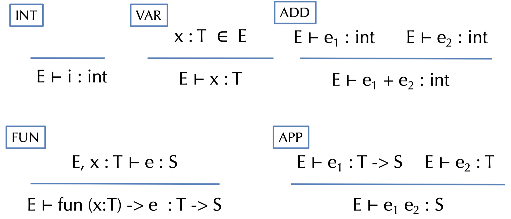{width=50%}

### 12.1.4 Type Checking Derivations

We can make a derivation of a proof tree:

- Nodes are judgements
- Edges connect premises to a conclusion (according to the inference rules)
- Leaves are axioms (i.e., rules with no premises)

The _goal of the type checker_ is to verify that such a tree exists.

_Example:_ Find a tree for the following code using the previously given inference rules:

$$\vdash (\text{fun}(x : int) \to x + 3)5 : int$$

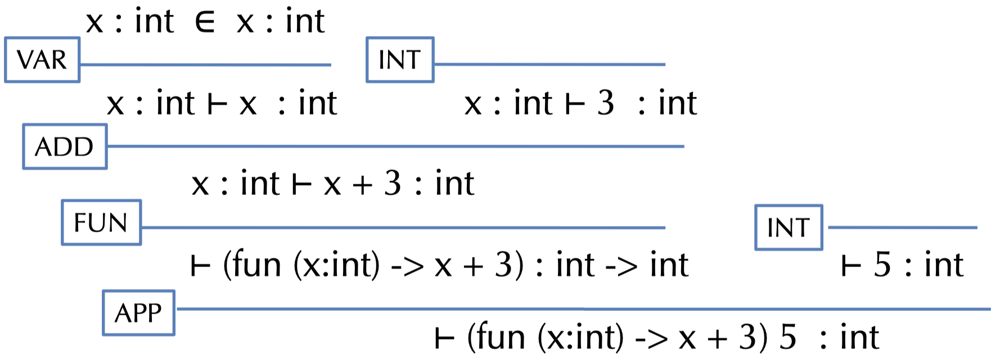{width=50%}

Notes:

- The OCaml function `typecheck` verifies the existence of this tree
- Recursive calles for running `typecheck` follow the same shape as the tree above
- $x : int \in E$ is implemented by the `lookup` function

### 12.1.5 Type Safety

> **Theorem:** If $\vdash e : t$, then there exists a value $v$ such that $e \Downarrow v$.

This is a _very_ strong property:

- Well-typed programs never execute undefined code like $3 + (\text{fun } x \to 2)$
- Simply-typed lambda calculus terminates, i.e. not Turing complete

### 12.1.6 Type Safety For General Languages

> **Theorem:** If $\vdash P : t$ is a well-typed program, then either:
> - the program terminates in a well-defined way, or
> - the program continues computing forever

_Note:_

- Well-defined termiantion could includes halting with a return value or raising an exception
- Type safety rules out undefined behavior_
    - abusing "unsafe" casts, such as converting pointers to integers, etc.
    - treating non-code values as code and vice-versa
    - breaking the type abstraction of the language

## 12.2 Basic Types

### 12.2.1 Arrays

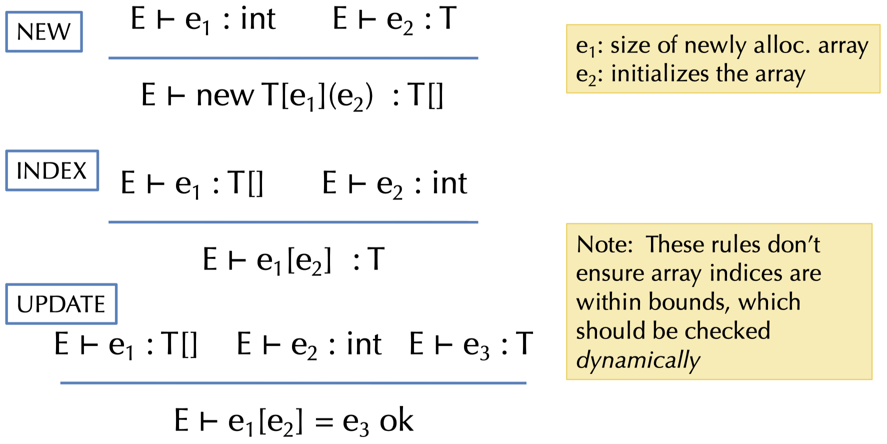{width=50%}

### 12.2.2 Tuples

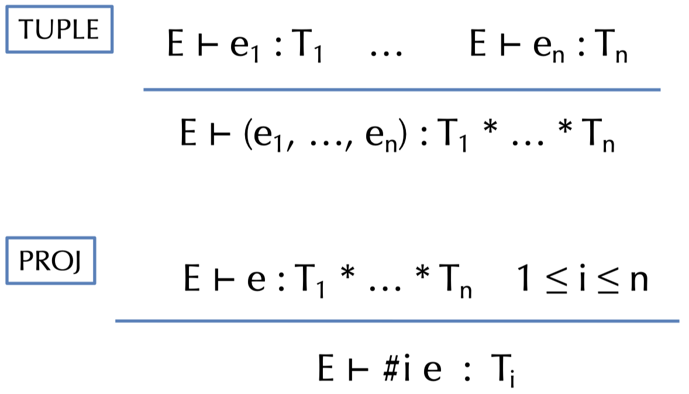{width=50%}

### 12.2.3 References

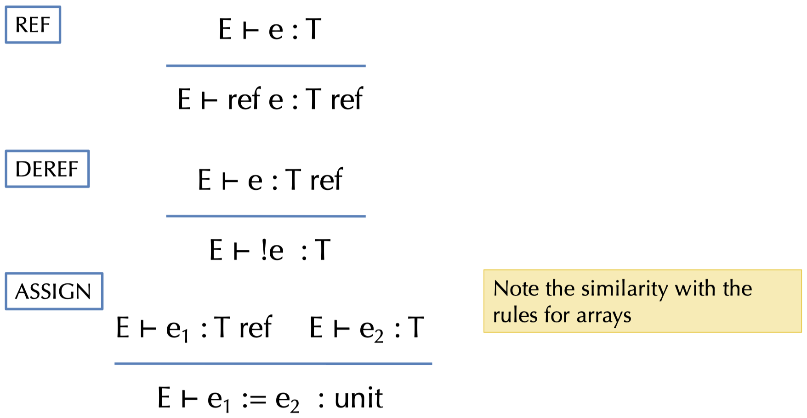{width=50%}

## 12.3 Types, More Generally

### 12.3.1 What are Types?

A **type** is just apredicate on the set of values in a system, i.e. the type `int` can be thought of as a boolean function that returns "true" on integers and "false" otherwise.

For efficiency and tractability, the predicates are usually very simple.

We can easily add new types that distinguish different subsets of values:

```ocaml
type tp =
    | IntT                  (* type of integers *)
    | PosT | NegT | ZeroT   (* refinements of ints *)
    | BoolT                 (* type of booleans *)
    | TrueT | FalseT        (* subsets of booleans *)
    | AnyT                  (* any value *)
```

When introducing those new types, we also need to redefine the typing rules.

### 12.3.2 What about "if" ?

Two cases are very easy:

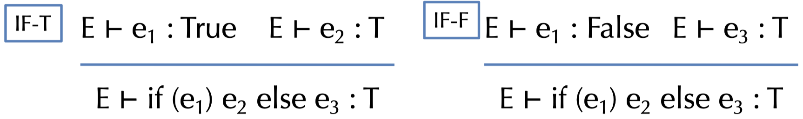{width=50%}

But what if we don't know statically which branch will be taken? Consider the following type checking problem:

$$x : bool \vdash \text{if } (x) \, 3 \text{ else } -1 : ?$$

The true branch has type $Pos$ while the false branch has type $Neg$, so what should be the result type of the whole if-statement?

### 12.3.3 Subtyping and Upper Bounds

If we view types as sets of values, there is a natural _inclusion relation:_ $Pos \subseteq Int$. This subset relation gives rise to a **subtype relation:** $Pos <: Int$.

Such inclusions give rise to a **subtyping hierarchy:**

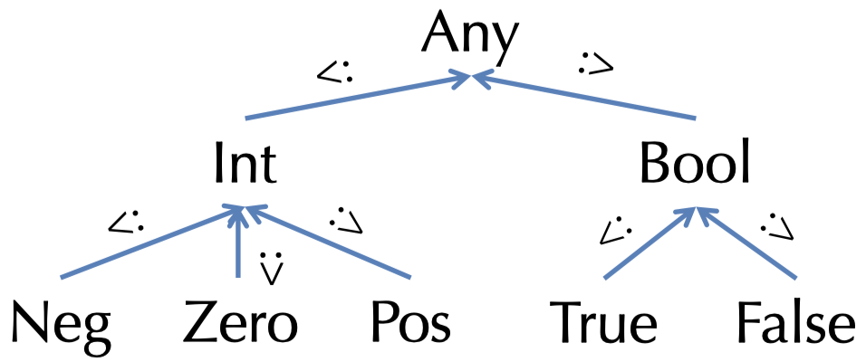{width=50%}

The subtyping relation is a _partial order:_

- Reflexive: $T <: T$ for any type $T$
- Transitive: $T:1 <: T_2$ and $T_2 <: T_3$ then $T_1 <: T_3$
- Antisymmetric: $T_1 <: T_2$ and $T_2 <: T_1$ then $T_1 = T_2$

A subtyping relation $T_1 <: T_2$ is **sound** if it approximates the underlying semantic subset relation. Formally, we write $[[T]]$ for the subset of closed values of type $T$, i.e. $[[T]] = \{v \, | \, \vdash v : T \}$. If $T_1 <: T_2$ implies $[[T_1]] \subseteq [[T_2]]$, then $T_1 <: T_2$ is _sound._

For types $T_1, \, T_2,$ we define their **least upper bound** (LUB) w.r.t. the hierarchy. Examples: $\text{LUB}(\text{True, False}) = Bool, \, \text{LUB}(Int, \, Bool) = Any.$

_Note:_ The LUB of $T_1$ and $T_2$ is sometimes written as $T_1 \lor T_2$.

### 12.3.4 "if" Typing Rule Revisited

For statically unknown conditionals, we want the return value to be the LUB of the types of the branches:

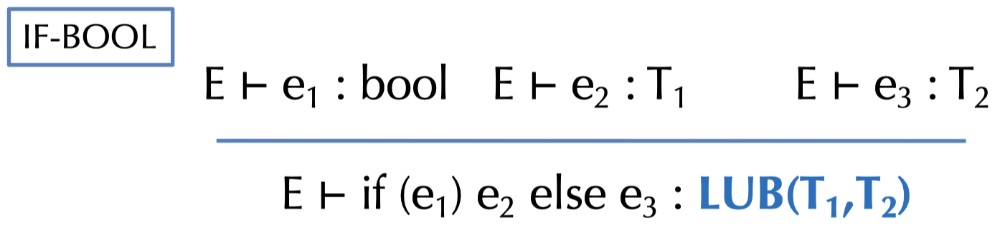{width=50%}

### 12.3.5 Subsumption Rule

When we add subtyping judgements of the form $T <: S$, we can uniformly integrate it into the type system generically:

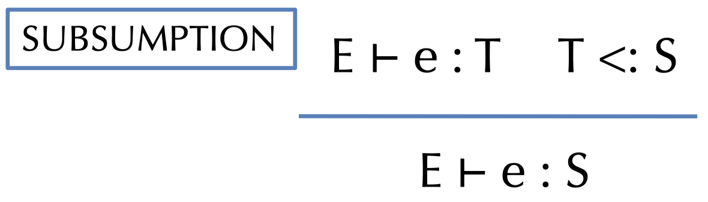{width=50%}

**Subsumption** allows values of type $T$ to be treated as $S$ whenever $T <: S$.

### 12.3.6 Downcasting

What happens if we have an $Int$, but need something of type $Pos$?

- At compile time, we don't know whether the $Int$ is greater than zero
- At runtime, we do

We can add a **checked downcast:**

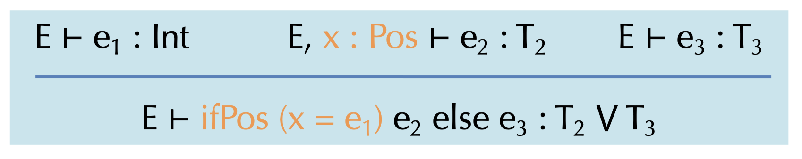{width=50%}

At runtime, the $ifPos$ checks whether $e_1 > 0$.

## 12.4 Subtyping Other Types

### 12.4.1 Subtyping for Tuples

Intuition: whenever a program expects something of type $S_1 * S_2$, it is sound to give it type $T_1 * T_2$, if $T_1 <: S_1$ and $T_2 <: S_2$:

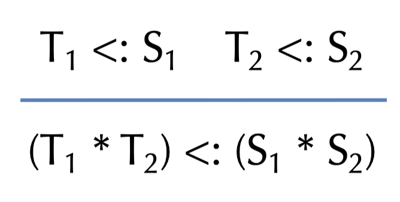{width=50%}

### 12.4.2 Subtyping for Function Types

On way to see it is explained by the following graph:

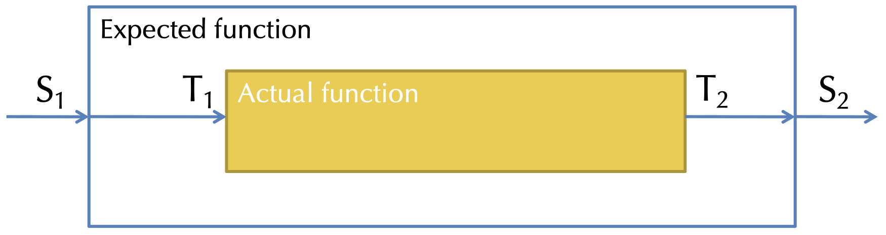{width=50%}

We need to convert an $S_1$ to a $T_1$ and $T_2$ to $S_2$, so the argument type is **contravariant** and the output type is **covariant:**

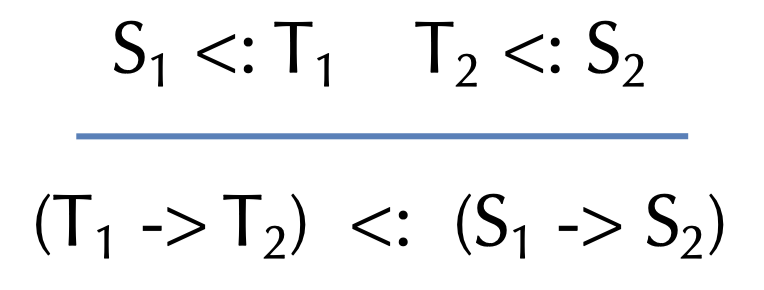{width=50%}

### 12.4.3 Immutable Records

The records type is given by: $\{lab_1:T_1: \, lab_2:T_2; \, ...; \, lab_n:T_n \}$. Each $lab_i$ is a label drawn from a set of identifiers.

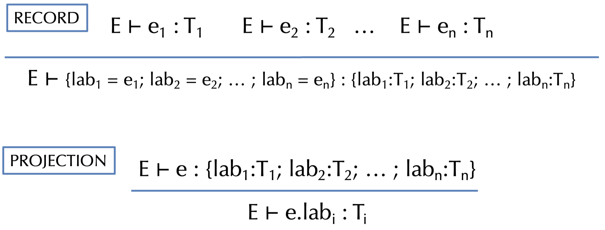{width=50%}

We can do two different forms of _subtyping for immutable records:_

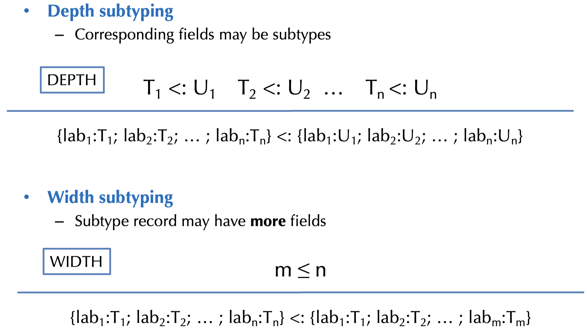{width=50%}

## 12.5 Mutability & Subtyping

### 12.5.1 NULL

What is the type of `null`? Consider the following:

```bnf
int[] a  = null;     // OK
int x    = null;     // not OK
string s = null;    // OK
```

Null has _any reference type_, it is _generic._

This requires a defined behavior when dereferencing `null` (e.g. Java's NullPointerException) and a safety check for every dereference operation.

### 12.5.2 Subtyping and References

What is the proper subtyping relationship for **references** and **arrays?**

Covariant reference types are unsound, i.e. `(NonZero ref) <: (Int ref)` is unsound! The contravariant reference types are also unsound, that is, if `T_1 <: T_2`, then `ref T_2 <: ref T_1` is unsound too.

In conclusion, mutable structures are **invariant** in the sens that: `T_1 ref <: T_2 ref` implies `T_1 = T_2`. The same holds for arrays, OCaml-style mutable records, object fields, etc.

## 12.6 Structural vs. Nominal Types

IS the type equality defined by the _structure_ or _name_ of the data? Example:

```ocaml
type cents = int
type age   = int

let foo (x:cents) (y:age) = x + y
```

Type abbreviations as seen in this OCaml example are treated _structurally._ In contrast, `newtypes` (as seen in Haskell) are treated by _name._

## 12.7 OAT's Type System

### 12.7.1 OAT's Treatment of Types

- Primitive (i.e. non-reference) types: `int` and `bool`
- Definitely non-null reference types: (named) mutable structs with width subtyping, strings, arrays (including length information)
- Possibly-null reference types: `R?`, subtyping `R <: R?`, checked downcast syntax `if?`

_Example:_

```oat
int sum(int[]? arr) {
    var z = 0;
    if?(int[] a = arr) {
        for(var i = 0; i < length(a); i = i + 1) {
            z = z + a[i];
        }
    }
    return z;
}
```

### 12.7.2 OAT Features

- Named structure types with mutable fields
- Typed function pointers
- Polymorphic operations: `length`, and `==` or `!=`
- Type-annotated null values: `t null` always has type `t?`
- Definitely-not-null values: "atomic" array initialization syntax

# 13. Compiling Classes And Objects

## 13.1 Code Generation for Objects

- _Classes:_ 
    - Generate data structure types
    - Generate the class tables for dynamic dispatch
- _Methods:_
    - Method body code is similar to functions/closures
    - Method calls require dispatch
- _Fields:_
    - Issues are the same as for records
    - Generating access code
- _Constructors:_
    - Object initialization
- _Dynamic types:_
    - Checked downcasts
    - `instanceof` and similar type dispatch

## 13.2 Compiling Objects

Objects contain a pointer to a **dispatch vector** (also called _virtual table_ or _vtable_) with pointers to method code.

{width=50%}

Code receiving `set:IntSet` only knows that `set` has an initial dispatch vector pointer and the layout of that vector.

{width=50%}
