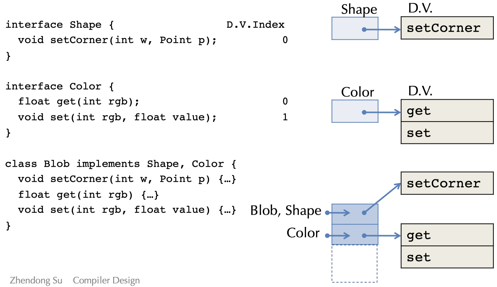
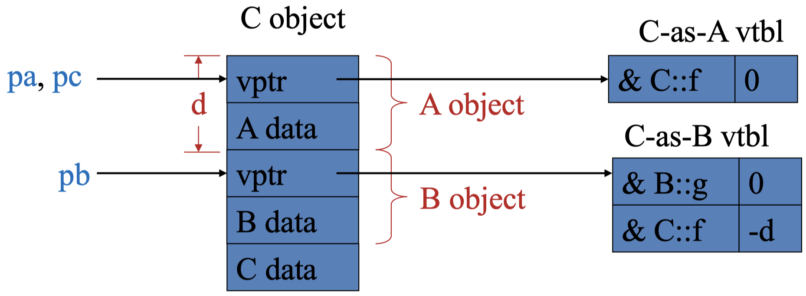
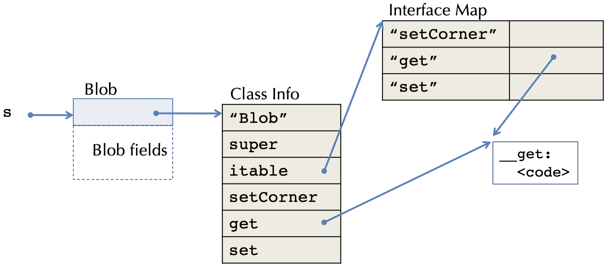
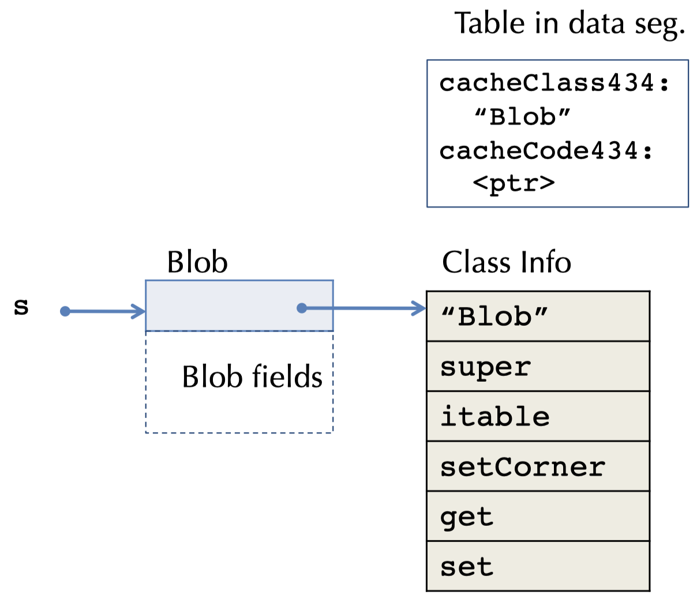
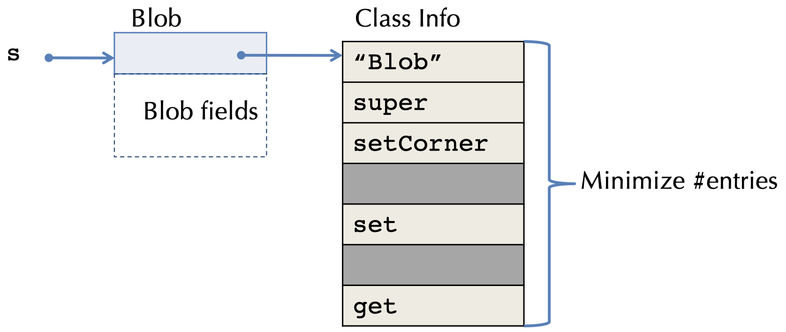
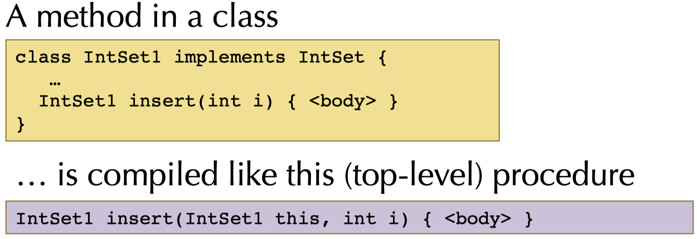

**Compiler Design — Lecture notes week 9**

- Author: Ruben Schenk
- Date: 29.11.2021
- Contact: ruben.schenk@inf.ethz.ch

## 13.3 Multiple Inheritance

### 13.3.1 Overview

A class may declare more than one sueprclass. This leads to a semantic problem: _ambiguity_

_Example:_

```c++
class A { int m(); }
class B { int m(); }
class C extends A, B { ... }    // which m()?
```

The same problem can also happen with fields. In C++, fields and methods can be duplicated when such ambiguities arise.

In Java, a class may implement more than one interface:

```java
interface A { int m(); }
interface B { int m(); }
class C implements A, B { int m() { ... }}  // only one m()
```

However, this doesn't lead to any semantic ambiguity since the class will implement a single method.

## 13.4 Dispatch Vector Layout Strategy

Let's consider the following code example:

```java
    interface Shape {                           // D.V.Index
        void setCorner(int w, Point p);         // 0
    }

interface Color {
    float get(int rgb);                         // 0
    void set(int rgb, float value);             // 1
}

class Blob implements Shape, Color {
    void setCorner(int w, Point p) {...}        // 0?
    float get(int rgb) {...}                    // 0?
    void set(int rgb, float value) {...}        // 1?
}
```

### 13.4.1 General Approaches

The problem we encounter in the above shown example is that we cannot directly identify methods by their position anymore. There are three general approaches to solve this problem:

- Option 1: Allow multiple D.V. tables (C++)
    - Choose which D.V. to use based on the static type
    - Castin from/to a class may require runtime operations
- Option 2: Use a level of indirection
    - Map method identifiers to code pointers
    - Use a hash table
    - May need to search up the class hierarchy
- Option 3: Give up separate compilation
    - Use "sparse" dispatch vectors, or binary decision trees
    - Must know the entire class hierarchy

### 13.4.2 Option 1: Multiple Dispatch Vectors

The idea is to duplicate the D.V. pointers in the object representation. The static type of the object determines which D.V. is used:



Another example:

```c++
class A {
    public:
        int x;
        virtual void f();
}

class B {
    public:
        int y;
        virtual void g();
        virtual void f();
}

class C: public A, public B {
    public:
        int z;
        virtual void f();
}

C *pc = new C;
B *pb = pc;
A *pa = pc;

// Three pointers to the same object, but different static types.
```



### 13.4.3 Option 2: Search and Inline Cache

The idea is that for each class/interface, we keep a talbe of the form `method names -> method code`. We then recursively walk up the hierarchy looking for the method name.



One optimization would be to store the class and code pointer at a call site in a cache. On a method call, we check whether ot not the class matches the cached value.

Consider for example the following compilation: `Shape s = new Blob(); s.get();`



A **cached interface dispatch** could look as follows:

```x86
    movq    [%rax], tmp
    cmpq    tmp, [cacheClass434]
    Jnz     __miss434
    callq   [cacheCode434]
__miss434:
```

### 13.4.4 Option 3: Sparse D.V. Tables

We have acces to the whole class hierarchy and must ensure that no two methods in the same class are allocated at the same D.V. offset:

- We allow holes in the D.V. just like in the hashtable variant for the search cache
- Unlike the hashtable however, there is never a conflict

The obvious advantage is that we have an identical dispatch and performance compared to a single-inheritance case. The disadvantage is that we must know the entire class hierarchy.



## 13.5 Classes & Objects In LLVM

### 13.5.1 Representing Classes in the LLVM

During typechecking, we create a _class hierarchy,_ which maps each class to its interface:

- Superclass
- Constructor type
- Fields
- Method types

We then compile the class hierarchy to produce:

- An LLVM IR struct type for each object instance
- An LLVM IR struct type for each vtable
- Global definitions that implement the class tables

### 13.5.2 Method Arguments

Method bodies are compile just like top-level procedures, except that they have an implicit extra argument: `this` or `self`:



### 13.5.3 LLVM Method Invocation Compilation

Consider the method invocation $$[[H;G;L \vdash e.m(e_1,...,e_n):t]]$ :

1. Compile $[[H;G;L \vdash e : C]]$ to get a pointer to an object value of class type $C$. Call this value `obj_ptr`
2. Use `getelementptr` to extract the vtable pointer from `obj_ptr`
3. Load the vtable pointer
4. Use `getelementptr` to extarct the function pointer's address from the vtable
5. Load the function pointer
6. Call through the function pointer, passing `obj_ptr` for `this`: `call (cmp_typ t) m(obj_ptr, [[e1]],...,[[e_n]])`

## 13.6 Compiling For OO

### 13.6.1 Compiling Static Methods

Java supports _static_ methods, these are methods belongig to a class, not the instances of the class. They have no `this` parameter.

They are compiled exactly like normal top-level procedures:

- No slots needed in the dispatch vectors
- No implicit `this` parameter

### 13.6.2 Compiling Constructors

Java and C++ classes can declare constructors that create new objects. The initialization code may have parameters supplied to the constructor.

Constructors are compiled just like static methods, except:

- The `this` variable is initialized to a newly allocated block of memory, big enough to hold the D.V. pointer plus the fields according to the object layout.
- Constructor code initializes all the fields
- The D.V. pointer is initialized

### 13.6.3 Compiling Checked Casts

Consider the generalization of Oat's _checked cast:_ `if? (t x = exp) {...} else {...}

We then reason by case distinction:

- If `t` is `null`: The static type of `exp` must be `ref?`. If `exp == null`, then take the true branch, else take the false branch.
- If `t` is `string` or `t[]`: The static type of `exp` must be the corresponding `string?` or `t[]?`. If `exp == null`, take the false branch, else take the true branch
- If `t` is `C`: The static type of `exp` must be `D` or `D?` where `C <: D`. If `exp == null`, take the false branch, otherwise emit the code to walk up the class hierarchy, starting at `T` to look for `C` (`T` is `exp`'s dynamic type). If found, take the true branch, else take the false branch
- If `t` is `C?`: The static type of `exp` must be `D?` where `C <: D`. If `exp == null`, take the true branch, otherwise emit the code to walk up the class hierarchy, starting at `T` to look for `C` (`T` is `exp`'s dynamic type). If found, take the true branch, else take the false branch

# 14. Optimizations

## 14.1 Introduction

### 14.1.1 Simple Example

The code generated by our OAT compiler so far is pretty _inefficient:_

- Lots of redundant moves
- Lots of unnecessary arithmetic instructions

Consider the following OAT program:

```oat
int foo(int w) {
    var x = 3 + 5;
    var y = x * w;
    var z = z * 4;
}
```

With our OAT compiler, this would generate assembly code of about 50 lines of code. However, our hand optimized solution could look something like this:

```x86
_foo:
    shlq    $5, %rdi
    movq    %rdi, %rax
    ret
```

### 14.1.2 When to Apply Optimization


### 14.1.3 Where to Optimize?

The usual goal is to improve the time performance. The problem ehre is that many optimizations trade space for time.

_Example:_ Consider **loop unrolling:**

```c
for (int i = 0; i < 100; i = i + 1) {
    s = s + a[i];
}

// unrolled version
for (int i = 0; i < 99; i = i + 2) {
    s = s + a[i];
    s = s + a[i + 1];
}
```

This has the following tradeoffs:

- Increasing the code space slows down the whole program a tiny bit, but speeds up the loop a lot!
- For frequently executed code with long loops, generally a win
- Interacts with instruction cache and branch prediction hardware

### 14.1.4 Safety

Whether an optimization is _safe_ depends on the language semantics. Languages with weaker guarantees permit more optimizations, but have more ambiguity in their behavior.

_Example: Loop-invariant code motion (LICM)_ describes the idea of hositing invariant code out of a loop:

```c
while(b) {
    z = x/y;
    ...
    // x and y are not updated
}

// After LICM
z = x/y;
while(b) {
    ...
    // x and y are not updated
}
```

## 14.2 Constant Folding

### 14.2.1 Idea

The idea of **constant folding** is that if operands are statically know, we compute the value at compile-time. For example:

```bnf
int x = (2 + 3) * y  ->  int x = 5 * y
b & false            ->  false
```

### 14.2.2 Conditionals

We have the following foldings for conditionals:

```bnf
if(true) S          -> S
if(false) S         -> ;
if(true) S else S'  -> S
if(false) S else S' -> S'
while(false) S      -> ;
if(2 > 3) S         -> ;
```

### 14.2.3 Algebraic Simplification

A more general from of _cosntant folding_ is done by taking advantage of mathematically sound simplification rules.

_Identities:_

```bnf
a * 1       -> 1
a + 0       -> a
b | false   -> b
a * 0       -> 0
a - 0       -> a
b & true    -> b
```

_Reassociation & commutativity:_

```bnf
(a + 1) + 2  ->  a + (1 + 2)  ->  a + 3
(2 + a) + 4  ->  (a + 2) + 4  ->  a + (2 + 4)  ->  a + 6
```

_Strength reduction:_

```bnf
a * 4      ->  a << 2
a * 7      ->  (a << 3) - a
a / 32767  ->  (a >> 15) + (a >> 30)
```

_Note:_ One must be careful with floating-point and integer arithmetic, e.g. rounding and overflow/underflow.

### 14.2.4 Constant Propagation

**Constant propagation** describes the process of replacing all uses of a variable with a constant, if the variable's values is defined to be a constant. The value of the variable is propagated froward from the point of assignment.

_Example:_

```bnf
int x = 5;
int y = x * 2;  ->  int y = 5 * 2;  ->  int y = 10;
int z = a[y];   ->  int z = a[y];   ->  int z = a[y];  ->  int z = a[10];
```

### 14.2.5 Copy Propagation

**Copy propagation** describes the process of replacing all variables `x` with `y`, if `y` was previously assigned to `x`.

_Example:_

```c
x = y;
if(x > 1) {
    x =x * f(x - 1);
}

// After copy propagation
if(y > 1) {
    x = y * f(y - 1)
}
```

This makes the first assignment to `x` so-called _dead code_ and can thus be eliminated.

## 14.3 Other Optimizations

### 14.3.1 Dead Code Elimination (DCE)

If side-effect free code can never be observed, it is safe to eliminate it. This process is called **dead code elimination** (DCE).

_Example:_

```c
x = y * y;  // x is dead
...         // x is never used
x = z * z;

// After DCE
...
x = z * z;
```

A variable is therefore said to be **dead** if it's never used after it's defined. Dead variables can be created by other optimizations!

### 14.3.2 Unreachable/Dead Code

Basic blocks unreachable from the entry block can be deleted. This is usually done at the IR or assembly level.

**Dead code** is similar to unreachable blocks. A value might be computed but never subsequently used, this means that the code used for computing the value can be droppped.
However that's only possible if it's _pure,_ i.e. if it has no externally visible side effects.

_Note:_ Pure functional languages (e.g. Haskell) make reasoning about the safety of optimizations generally easier.

### 14.3.3 Inlining

**Inlining** describes the process of replacing a function call with the body of the function (with the arguments rewritten to be local variables).

_Example:_

```c
int g(int x) { return x + pow(x); }
int pow(int a) { int b = 1; int n = 0;
                 while(n < a) { b = 2 * b; return b; } }

// After inlining
int g(int x) { int a = x; int b = 1; int n = 0;
               while(n < a) { b = 2 * b; } tmp = b; return x + tmp; }
```

### 14.3.4 Code Specialization

The idea is to create specialized versions of a function that is called from different places with different arguments.

_Example:_ Specialized function `f` in:

```c
class A implements I { int m() {...} }
class B implements I { int m() {...} }
int f(I x) { x.m(); }   // don't know which m()
A a = new A(); f(a);    // know it's A.m()
B b = new B(); f(b);    // know it's B.m()
```

This way, `f_A` would have code specialized to `A.m()` and `f_B` to `B.m()`.

### 14.3.5 Common Subexpression Elimination (CSE)

In some sense, **common subexpression elimination** (CSE) is the opposite of inlining: we try to fold redundant computations together.

_Example:_

```c
a[i] = a[i] + 1
// will be compiled to something like
[a + i * 4] = [a + i * 4] + 1

// Application of CSE
t = a + i * 4; [t] = [t] + 1;
```

This optimization is _safe_ if the shared expression always have the same value in both places!

## 14.4 Loop Optimizations

### 14.4.1 Loop Invariant Code Motion - Revisited

LICM is another form of redundancy elimination. If the result of a statement or expression doesn not change during the loop and it's pure, then it can be hoisted outside the loop body.

_Example:_

```c
for(i = 0; i < a.length; i++) {
    // a is not modified in the body
}

// After LICM
t = a.length;
for(i = 0; i < t; i++) {
    // same body as above
}
```

### 14.4.2 Strength Reduction - Revisited

Strength reduction can work for loops to by repalcing expensive operations, such as `*, /`, by cheaper ones, such as `+, -`.

_Example:_

```c
for(int i = 0; i < n; i++) {
    a[i * 3] = 1;
}

// After strength reduction
int j = 0;
for(int i = 0; i < n; i++) {
    a[j] = 1;
    j = j + 3;
}
```

### 14.4.3 Loop Unrolling - Revisited

Branches can be very expensive, therefore it's a good practice to aboid them.

_Example:_

```c
for(int i = 0; i < n; i++) { S; }

// After loop unrolling (4 times)
int i;
for(i = 0; i < n - 3; i += 4) { S; S; S; S; }
for(; i < n; i++) { S; }    // left over iterations
```

With $k$ unrollings, we eliminate $\frac{k - 1}{k}$ conditional branches!
