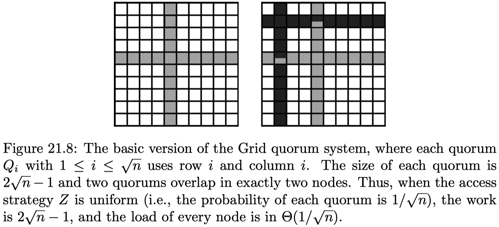
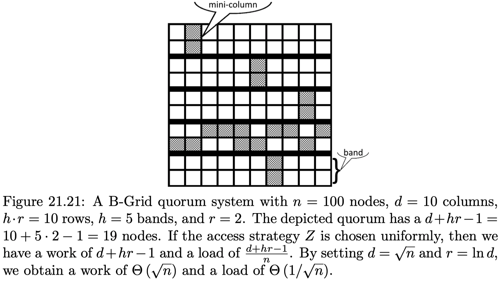
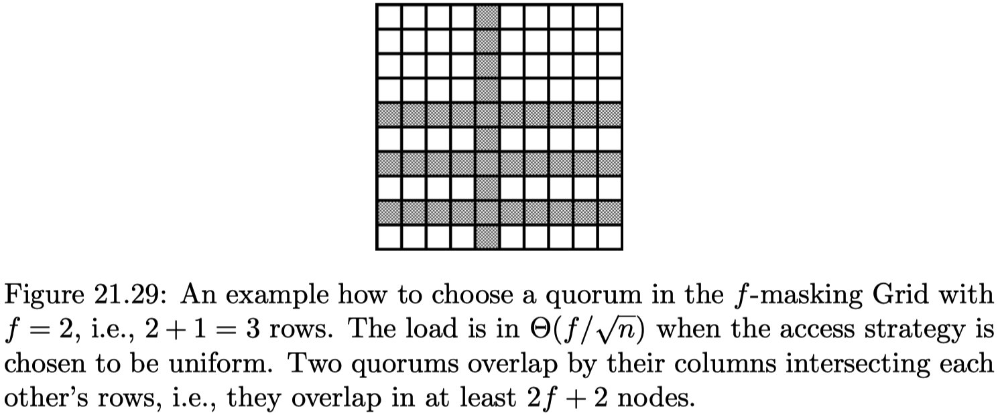
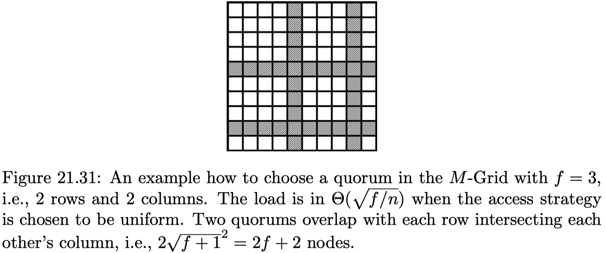
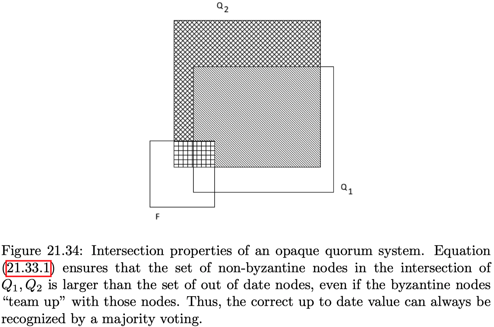

# Chapter 21: Quorum Systems & Distributed Storage

What happens if a single server is no longer powerful enough to service all your customers? The obvious choice is to add more servers and to use the majority approach to guarantee consistency. However, even if you buy one million servers, a client still has to access more than half of them per request! While you gain faul-tolerance, your efficiency can at most be doubled. We used majorities because majority sets always overlap. But are majority sets the only sets that guarantee overlap? In this chapter we study the theory behind overlapping sets, known as _quorum systems._

Let $V = \{v_1,..., \, v_n \}$ be a set of nodes. A **quorum** $Q \subseteq V$ is a subset of these nodes. A **quorum system** $S \subset S^V$ is a set of quorums s.t. every two quorums intersect, i.e. $Q_1 \cap Q_2 \neq \emptyset$ for all $Q_1, \, Q_2 \in S$.

_Remarks:_

- When a quorum system is being used, a client selects a quorum, acquires a lock (or ticket) on all nodes of the quorum, and when done releases all locks again. The idea is that no matter which quorum is chosen, its nodes will intersect with the nodes of every other quorum.
- A quorum system $S$ is called **minimal** if $\forall Q_1, \, Q_2 \in S: Q_1 \nsubseteq Q_2$.
- The simplest quorum system imaginable consists of just one quorum, which in turn just consists of one server. It is known as a **singleton.**
- In the **majority** quorum system, every quorum has $\lfloor \frac{n}{2} \rfloor + 1$ nodes.

## 21.1 Load and Work

An **access strategy** Z defines the probability $P_Z(Q)$ of accessing a quorum $Q \in S$ s.t. $\sum_{Q \in S} P_Z(Q) = 1$.

Definition of **load:**

- The _load_ of access strategy $Z$ on a node $v_i$ is $L_Z(v_i) = \sum_{Q \in S; \, v_i \in Q} P_Z(Q)$. The load is the probability that $v_i \in Q$ if $Q$ is sampled from $S$.ß
- The _load_ included by access strategy $Z$ on a quorum system $S$ is the maximal load induced by $Z$ on any node in $S$, i.e. $L_Z(S) = \max_{v_i \in S}L_Z(v_i)$.
- The _load_ of a quorum system $S$ is $L(S) = \min_Z L_Z(S)$.

Definition of **work:**

- The _work_ of a quorum $Q \in S$ is the number of nodes in $Q$, $W(Q) = |Q|$.
- The _work_ induced by access strategy $Z$ on a quorum system $S$ is the expected number of nodes accessed, i.e. $W_Z(S) = \sum_{Q \in S} P_Z(Q) \cdot W(Q)$.
- The _work_ of a quorum system $S$ in $W(S) = \min_Z W_Z(S)$.

_Example:_ We illustrate the above concepts with a small example. Let $V = \{v_1, \, v_2, \, v_3, \, v_4, \, v_5 \}$ and $S = \{Q_1, \, Q_2, \, Q_3, \, Q_4 \}$, with $Q_1 = \{v_1, \, v_2 \}, \, Q_2 = \{v_1, \, v_2, \, v_3 \}, \, Q_3 = \{v_2, \, v_3, \, v_5 \}, \, Q_4 = \{v_2, \, v_4, \, v_5 \}$. If we choose the access strategy $Z$ s.t. $P_Z(Q_1) = \frac{1}{2}$ and $P_Z(Q_2) = P_Z(Q_3) = P_Z(Q_4) = \frac{1}{6}$, then node with the highest load is $v_2$ with $L_Z(v_2) = \frac{1}{2} + \frac{1}{6} + \frac{1}{6} = \frac{5}{6}$, i.e. $L_Z(S) = \frac{5}{6}$. Regarding work, we have $Z_Z(S) = $\frac{1}{2} \cdot 2 + \frac{1}{6} \cdot 3 + \frac{1}{6} \cdot 3 + \frac{1}{6} \cdot 3 = \frac{15}{6}$. If every quorum $Q$ in a quorum system $S$ has the same number of elements, $S$ is called **uniform.**

> **_Theorem 21.6:_** Let $S$ be a quorum system. Then $L(S) \geq \frac{1}{\sqrt{n}}$ holds.

## 21.2 Grid Quorum System

Assume $\sqrt{n} \in \mathbb{N}$ and arrange the $n$ nodes in a square matrix with side length of $\sqrt{n}$, i.e. in a grid. The basic **grid quorum system** consists of $\sqrt{n}$ quorums, with each containing a full row $i$ and the full column $i$, for $i \leq i \leq \sqrt{n}$.

{width=50%}

```pseudo
# Algorithm 21.10: Sequential Locking Strategy for a Quorum Q
1:  Attempt to lock the nodes one by one, ordered by their identifiers
2:  Should a node be already locked, release all locks and start over
```

> **_Theorem 21.11:_** If each quorum is accessed by Algorithm 21.10, at least one quorum will obtain a lock for all of its nodes.

```pseudo
# Algorithm 21.12: Concurrent Locking Strategy for a Quorum Q
Invariant: Let v_Q in Q be the highest identifier of a node locked by Q s.t. all nodes v_i in Q with v_i < v_Q are locked by Q as well. Should Q not have any lock, then v_Q is set to 0.
1:  repeat:
2:      Attempt to lock all nodes of the quorum Q
3:      for each node v in Q that was not able to be locked by Q do:
4:          exchange v_Q and v_Q' with the quorum Q' that locked v
5:          if v_Q > v_Q' then:
6:              Q' releases lock on v and Q acquires lock on v
7:          end if
8:      end for
9:  until all nodes of the quorum Q are locked
```

> **_Theorem 21.13:_** If the nodes and quorums use Algorithm 21.12, at least one quorum will obtain a lock for all of its nodes.

## 21.3 Fault Tolerance

If any $f$ nodes from a quorum system $S$ can fail s.t. there is still a quorum $Q \in S$ without failed nodes, then $S$ is $f$**-resilient.** The largest such $f$ is the **resilience** $R(S)$.

> **_Theorem 21.15:_** Let $S$ be a grid quorum system where each of the $n$ quorums consists of a full row and a full column. $S$ has a resilience of $\sqrt{n} - 1$.

Assume that every node works with a fixed probability $p$. The **failure probability** $F_p(S)$ of a quorum system $S$ is the probability that at least one node of every quorum fails. The **asymptotic failure probability** is $F_p(S)$ for $n \to \infty.$

A version of a **Chernoff bound** states the following: Let $x_1,..., \, x_n$ be independent Bernoulli-distributed random variables with $Pr[x_i = 1] = p_i$ and $Pr[x_i = 0] = 1-p_i$, then for $X := \sum_{i = 1}^n x_i$ and $\mu := \mathbb{E}[X] = \sum_{i=1}^n p_i$, then the following holds:

$$
\text{for all } 0 < \delta < 1 : Pr[X \leq (1- \delta)\mu] \leq e^{-\mu\delta^2/2}.
$$

> **_Theorem 21.18:_** The asymptotic failure probability of the majority quorum system is $0$, for $p > \frac{1}{2}$.

> **_Theorem 21.19:_** The asymptotic failure probability of the grid quorum system is $1$ for $p > 0$.

Consider $n = dhr$ nodes, arranged in a rectangular grid with $h \cdot r$ rows and $d$ columns. Each group of $r$ rows is a band, and $r$ elements in a column restricted to a band are called a mini-column. A quorum consists of one mini-column in every band and one element from each mini-column of one band; thus every quorum has $d + hr - 1$ elements. The **B-grid quorum system** consists of all such quorums.

{width=50%}

> **_Theorem 21.22:_** The asymptotic failure probability of the B-grid quorum system is $0$, for $p \geq \frac{2}{3}$.

| **Measure** | **Singleton** | **Majority** | **Grid** | **B-Grid** $^*$ |
| :---------- | :-----------: | :----------: | :------: | :-------------: |
| Work        | $1$           | $\simeq n/2$ | $\Theta(\sqrt{n})$ | $\Theta(\sqrt{n})$ |
| Load        | $1$           | $\simeq 1/2$ | $\Theta(1/\sqrt{n})$ | $\Theta(1/\sqrt{n})$ |
| Resilience  | $0$           | $\simeq n/2$ | $\Theta(\sqrt{n})$ | $\Theta(\sqrt{n})$ |
| F.Prob. $^{**}$ | $1-p$     | $\to 0$      | $\to 1$  | $\to 0$         |

The table above shows and overview of the different quorum systems regarding resilience, work, load, and their asymptotic failure probability:

- *: Setting $d = \sqrt{n}$ and $r = \ln d$
- **: Assuming prob. $q = 1 - p$ is constant but significantly less than $\frac{1}{2}$

## 21.4 Byzantine Quorum Systems

Byzantine nodes make life more difficult, as they can pretend to be a regular node, i.e. one needs more sophisticated methods to deal with them. We need to ensure that the intersection of two quorums always contains a non-byzantine (correct) node and furthermore, the byzantine nodes should not be allowed to infiltrate every quorum.

A quorum system $S$ is $f$**-disseminating** if (1) the intersection of two different quorums always contains $f+1$ nodes, and (2) for any set of $f$ byzantine nodes, there is at least one quorum without byzantine nodes.

A quorum system $S$ is $f$**-masking** if (1) the intersection of two different quorums always contains $2f + 1$ nodes, and (2) for any set of $f$ byzantine nodes, there is at least one quorum without byzantine nodes.

> **_Theorem 21.26:_** Let $S$ be an $f$-disseminating quorum system. Then $L(S) \geq \sqrt{(f + 1) / n}$ holds.

> **_Theorem 21.27:_** Let $S$ be an $f$-masking quorum system. Then $L(S) \geq \sqrt{(2f + 1)/n}$ holds.

A $f$**-masking grid quorum system** is constructed as the grid quorum system, but each quorum contains one full column and $f + 1$ rows of nodes, with $2f + 1 \leq \sqrt{n}$.

{width=50%}

The **M-grid quorum system** is constructed as the grid quorum as well, but each quorum contains $\sqrt{f + 1}$ rows and $\sqrt{f + 1}$ columns of nodes, with $2f + 1 \leq \sqrt{n}$.

{width=50%}

The $f$-masking grid quorum system and the M-grid quorum system are $f$-masking quorum systems.

A quorum system $S$ is $f$**-opaque** if the following two properties hold for any set of $f$ byzantine nodes $F$ and any two different quorums $Q_1, \, Q_2$:

$$
|Q_1 \cap Q_2 \setminus F| > |(Q_1 \cap F) \cup (Q_2 \setminus Q_1)| \\ F \cap Q = \empty \text{ for some } Q \in S  
$$

> **_Theorem 21.35:_** Let $S$ be an $f$-opaque quorum system. Then, $f < n/5.$

{width=50%}

> **_Theorem 21.36:_** Let $S$ be an $f$-opaque quorum system. Then $L(S) > \frac{1}{2}$ holds.
