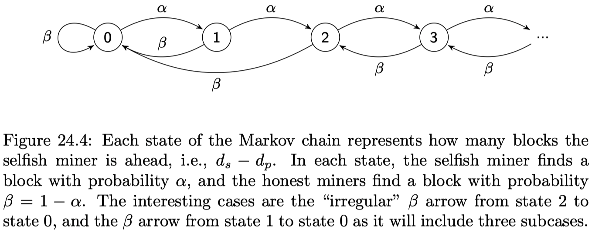
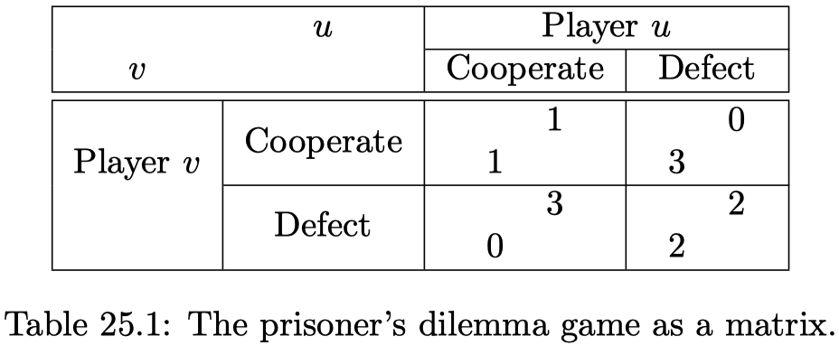
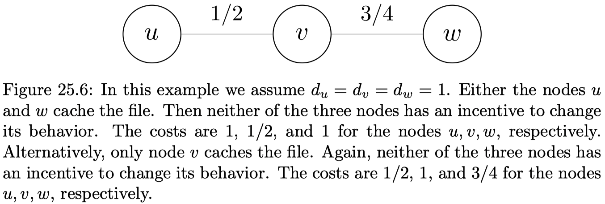
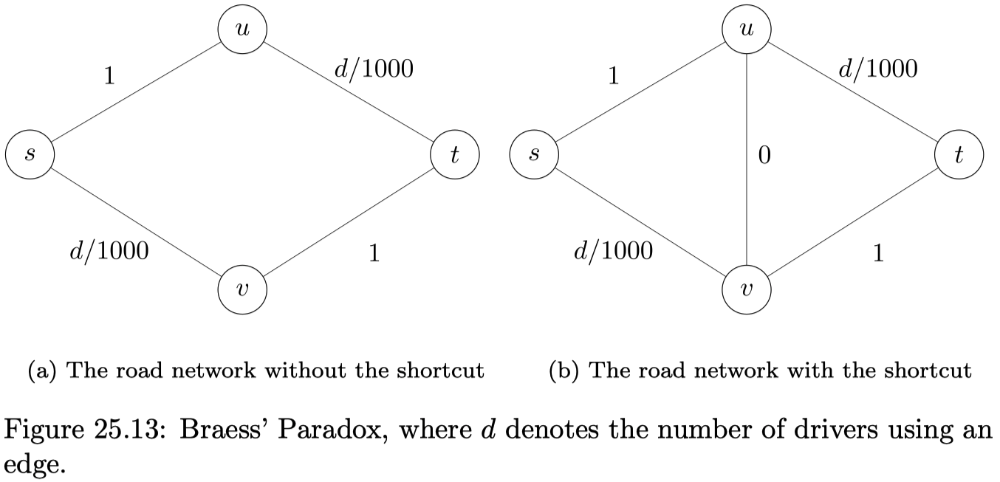
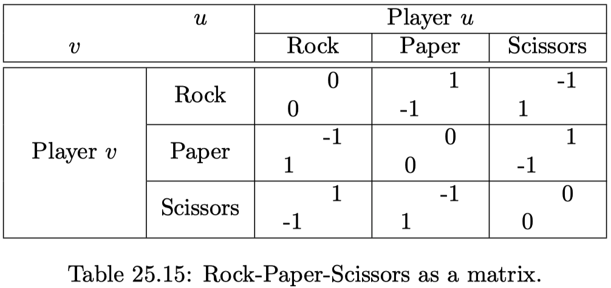
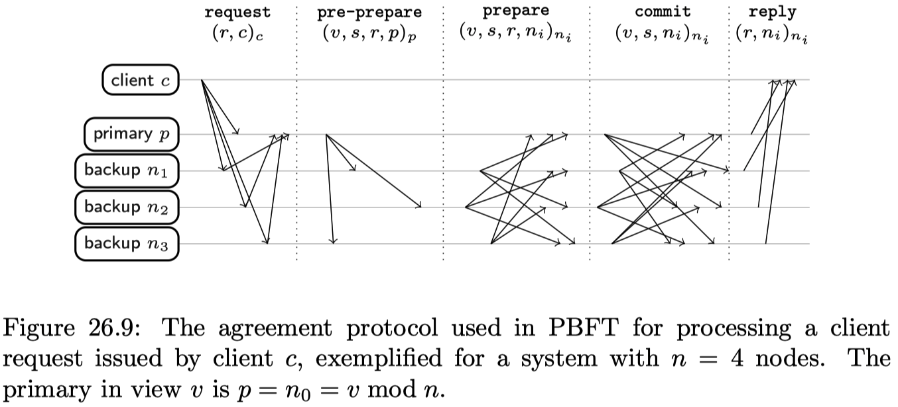
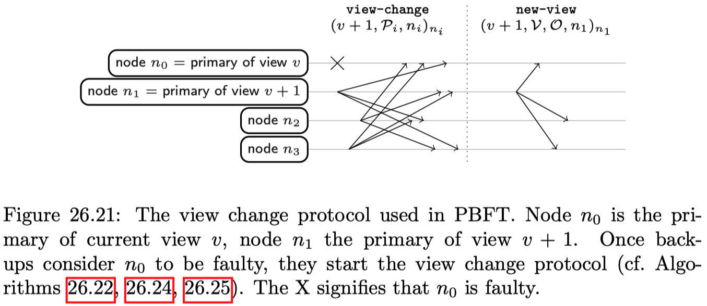

# Chapter 23: Eventual Consistency & Bitcoin

How would you implement an ATM? Does the following implementation work satisfactorily?

```psuedo
# Algorithm 23.1: Naive ATM
1:  ATM makes withdrawal request to bank
2:  ATM waits for response from bank
3:  if balance of customer sufficient then:
4:      ATM dispenses cash
5:  else:
6:      ATM displays error
7:  end if
```

A connection problem between the bank and the ATM may block Algorithm 23.1 in line 2. A **network partition** is a failure where a network splits into at least two parts that cannot communicate with each other. Intuitively any non-trivial distributed system cannot proceed during a partition and maintain consistency.

## 23.1 Consistency, Availability and Partitions

**Consistency** means that all nodes in the system agree on the current state of the system. **Availability** means that the system is operational and instantly processing incoming requests. **Partition tolerance** is the ability of a distributed system to continue operating correctly even in the presence of a network partition.

> **_Theorem 23.5 (CAP Theorem):_** It is impossible for a distributed system to simultaneously provide Consistency, Availability, and Partition Tolerance. A distributed system can satisfy any two of these but not all three.

```pseudo
# Algorithm 23.6: Partition tolerant and available ATM
1:  if bank reachable then:
2:      Synchronize local view of balances between ATM and bank
3:      if balance of customer insufficient then:
4:          ATM displays error and aborts user interaction
5:      end if
6:  end if
7:  ATM dispenses cash
8:  ATM logs withdrawal for synchronization
```

_Remarks:_

- The ATM's local view of the balance may diverge from the balances as seen by the bank, therefore consistency is no longer guaranteed.
- The algorithm will synchronize any changes it made to the local balances back to the bank once connectivity is re-established. This is known as eventual consistency.

**Eventual consistency** means that if no new updates to the shared state are issued, then eventually the system is in a quiescent state, i.e. no more messages need to be exchanged between nodes, and the shared state is consistent.

_Remarks:_

- Eventual consistency is a form of _weak consistency._
- Eventual consistency guarantees that the state is eventually agreed upon, but the nodes may disagree temporarily.
- During a partition, different updates may semantically conflict with each other. A _conflict resolution_ mechanism is required to resolve the conflicts and allow the nodes to eventually agree on a common state.

## 23.2 Bitcoin

The **Bitcoin network** is a randomly connected overlay network of a few tens of thousand of individually controlled _nodes._ The lack of structure is intentional: it ensures that an attacker cannot strategically position itself in the network and manipulate the information exchange. Old nodes re-entering the system try to connect to peers that they were earlier connected to. New nodes entering the system face to bootstrap problem, and can find active peers in any which way they want.

Users can generate any number of private keys. From each private key a corresponding public key can be derived using arithmetic operations over a finite field. A public key may be used to identify the recipient of funds in Bitcoin, and the corresponding private key can spend these funds.

**Bitcoin,** the currency, is an integer value that is transferred in Bitcoin transactions. This integer value is measured in _Satoshi:_ 100 million Satoshi are 1 Bitcoin.

A **transaction** is a data structure that describes the transfer of bitcoins from spenders to recipients. It consists of inputs and outputs. Outputs are tuples consisting of an amount of bitcoins and a spending condition. Inputs are references to outputs of previous transactions. Inputs reference the output that is being spent by a $(h, \, i)$-tuple, where $h$ is the hash of the transaction that created the output, and $i$ specifies the index of the output in that transaction.

```pseudo
# Algorithm 23.12: Node Receives Transaction (Naive)
1:  Receive transaction t
2:  for each input (h, i) in t do:
3:      if ouput (h, i) is not in local UTXO set or signature is invalid then:
4:          Drop t and stop
5:      end if
6:  end for
7:  if sum of values of inputs < sum of values of new outputs then:
8:      Drop t and stop
9:  end if
10: for each input (h, i) in t do:
11:     Remove (h, i) from local UTXO set
12: end for
13: for each ouput o in t do:
14:     add o to local UTXO set
15: end for
16: Forward t to neighbors in the Bitcoin network
```

A **doublespend** is a situation in which multiple transactions attempt to spend the same output. Only one transaction can be valid since outputs can only be spent once. When nodes accept different transactions in a doublespend, the shared state across nodes becomes inconsistent. Doublespends may occur naturally, e.g. if outputs are co-owned by multiple users who all know the corresponding private key. However, doublespends can be malicious as well - we call these doublespend-attack: An attacker creates two transactions both using the same input. One transaction would transfer the money to a victim, the other transaction would transfer the money back to the attacker.

**Proof-of-Work (PoW)** is a mechanism that allows a party to prove to another party that a certain amount of computational resources has been utilized for a period of time. A function $\mathcal{F}_d(c, \, x) \to \{\text{true, false} \}$, where difficulty $d$ is a positive number, while challenge $c$ and nonce $x$ are usually bit-strings, is called a Proof-of-Work function if it has the following properties:

1. $\mathcal{F}_d(c, \, x)$ is fast to compute if $d$, $c$, and $x$ are given.
2. For fixed parameters $d$ and $c$, finding $x$ such that $\mathcal{F}_d(c, \, x) = \text{true}$ is computationally difficult but feasible. The difficulty $d$ is used to adjust the time to find such an $x$.

The **Bitcoin PoW** function is given by

$$
\mathcal{F}_d(c, \, x) \to \text{SHA256}(\text{SHA256}(c | x)) < \frac{2^{244}}{d}.
$$

This function concatenates the challenge $c$ and nonce $x$, and hashes them twice using SHA256. The output of SHA256 is a cryptographic hash with a numeric value in $\{0,..., \, 2^{256}-1 \}$ which is compared to a target value $\frac{2^{224}}{d}$, which gets smaller with increasing difficulty. SHA256 is a cryptographic hash function with pseudorandom output. No better algorithm is known to find a nonce $x$ such that the function $\mathcal{F}_d(c, \, x)$ returns true than simply iterating over possible inputs.

A **block** is a data structure used to communicate incremental changes to the local state of a node. A block consists of a list of transactions, a timestamp, a reference to a previous block and a nonce. A block lists some transactions the block creator ("_miner_") has accepted to its memory pool since the previous block. A node finds and broadcasts a block when it finds a valid nonce for its PoW function.

```pseudo
# Algorithm 23.17: Node Creates (Mines) Block
1:  block b_t = {coinbase_tx}
2:  while size(b_t) <= 1 MB do:
3:      Choose transaction t in the memory pool that is consistent with b_t and local UTXO set
4:      Add t to b_t
5:  end while
6:  nonce x = 0, difficulty d, previous block b_{t-1}, timestamp = t_s
7:  challenge c = (merkle(b_t), hash(b_{t-1}), t_s, d)
8:  repeat:
9:      x = x + 1
10: until F_d(c, x) = true
11: Gossip block b_t
12: update local UTXO set to reflect b_t
```

The function `mekkle(b_t)` creates a cryptographic representation of the set of transactions in $b_t$. It is compact and has a fixed length no matter how large the set is.

The first transaction in a block is called the **coinbase transaction.** The block's miner is rewarded for confirming transactions by allowing it to mint new coins. The coinbase transaction has a dummy input, and the sum of outputs is determined by a fixed subsidy plus the sum of the fees of transactions confirmed in the block.

The longest path from the genesis block, i.e. the _root_ of the tree, to the deepest leaf is called the **blockchain.** The blockchain acts as a consistent transaction history on which all nodes eventually agree. If multiple blocks are mined more or less concurrently, the system is said to have **forked.** Forks happen naturally because mining is a distributed random process and two new blocks may be found at roughly the same time.

```pseudo
# Algorithm 23.20: Node Receives Block
1:  Receive block b_t
2:  For this node, the current head is block b_max at height h_max
3:  For this node, b_max defines the local UTXO set
4:  From b_t, extract reference to b_{t-1}, and find b_{t-1} in the nodes local copy of the blockchain
5:  h_b = h_b_{t-1} + 1
6:  if h_b > h_max and is_valid(b_t) then:
7:      h_max = h_b
8:      b_max = b
9:      Update UTXO set to reflect transactions in b_t
10: end if
```

Algorithm 23.20 describes how a node updates its local state upon receiving a block. Like Algorithm 23.12, this describes the local policy and may also result in node state diverging.

> **_Theorem 23.21:_** Forks are eventually resolved, and all nodes eventually agree on which is the longest blockchain. The system therefore guarantees _eventual consistency._

The `is_valid` function in Algorithm 23.20 represents the consensus rules of Bitcoin. All nodes will converge on the same shared state if and only if all nodes agree on this function.
If nodes have different implementations of the `is_valid` function, some nodes will reject blocks that other nodes will accept. This is called a **hard fork,** which is different from a regular fork. A regular fork happens because different nodes see different blocks that are mined at around the same time. Hard forks happen because the rules of Bitcoin itself have changed.

If the set of valid transactions is expanded, we have a hard fork. If the set of valid transactions is reduced, we have a _soft fork._

## 23.3 Layer 2

A **smart contract** is an agreement between two or more parties, encoded in such a way that the correct execution is guaranteed by the blockchain.

Bitcoin provides a mechanism to make transactions invalid until some time in the future: **timelocks.** A transaction may specify a locktime: the earliest time, expressed in either a Unix timestamp or a blockchain height, at which it may be included in a block and therefore be confirmed.

When an output can be claimed by providing a single signature is called a **singlesig output.** In contrast, the script of **multisig outputs** specifies a set of $m$ public keys and requires $\text{k-of-m}$ (with $k \leq m$) valid signatures from distinct matching public keys from that set in order to be valid.

```pseudo
# Algorithm 23.27: Parties A and B create a 2-of-2 multisig output o
1:  B sends a list I_B of inputs with c_B coins to A
2:  A selects its own inputs I_A with c_A coins
3:  A creates transactions t_s{[I_A, I_B], [o = c_A + c_B -> (A, B)]}
4:  A creates timelocked transaction t_r{[o], [c_A -> A, c_B -> N]} and signs it
5:  A sends t_s and t_r to B
6:  B signs both t_s and t_r and sends them to A
7:  A signs t_s and broadcasts it to the Bitcoin network
```

$t_s$ is called a **setup transaction** and uses to lock in funds into a shared account. If $t_s$ is signed and broadcasted immediately, one of the parties could not collaborate to spend the multisig output, and the funds become unspendable. To avoid a situation where the funds cannot be spent, the protocol also creates a timelocked _refund transaction_ $t_r$ which guarantees that, should the funds not be spent before the timelock expires, the funds are returned to the respective party.

```pseudo
# Algorithm 23.28: Simple Micropayment Channel from s to r with capacity c
1:  c_s = c, c_r = 0
2:  a and r use Algorithm 23.27 to set up output o with value c from s
3:  Create settlement transaction t_f{[o], [c_s -> s, c_r -> r]}
4:  while channel open and c_r < c do:
5:      In exchange for good with value delta
6:      c_r = c_r + delta
7:      c_s = c_s - delta
8:      Update t_f with outputs [c_r -> r, c_s -> s]
9:      s signs and sends t_f to r
10: end while:
11: r signs last t_f and broadcasts it
```

Algorithm 23.28 implements a Simple Micropayment Channel, a smart contract that is used for rapidly adjusting micropayments from a spender to a recipient. Only two transactions are ever broadcast and inserted into the blockchain: this setup transaction $t_s$ and the last settlement transaction $t_f$.

## 23.4 Weak Consistency

Under **monotonic read consistency** we understand that if a node $u$ has seen a particular value of an object, any subsequent accesses of $u$ will never return any older values.

For **monotonic write consistency,** we require that a write operation by a node on a data item is completed before any successive write operation by the same node (i.e. system guarantees to serialize writes by the same node).

**Read-your-write consistency** requires that after a node $u$ has updated a data item, any later reads from node $u$ will never see an older value.

The following pairs of operations are said to be **casually related:**

- Two writes by the same node to different variables.
- A read followed by a write of the same node.
- A read that returns the value of a write from any node.
- Two operations that are transitively related according to the above conditions.

A system provides casual consistency if operations that potentially are casually related are seen by every node of the system in the same order. Concurrent writes are not casually related, and may be seen in different orders by different nodes.

# Chapter 24: Advanced Blockchain

In this chapter we study various advanced blockchain concepts, which are popular in research.

## 24.1 Selfish Mining

Satoshi Nakamoto suggested that it is rational to be altruistic, e.g. by always attaching newly found blocks to the longest chain. But is this true?

A **selfish miner** hopes to earn the reward of a larger share of blocks than its hardware would allow. The selfish miner achieves this by temporarily keeping newly found blocks secret.

```pseudo
# Algorithm 24.2: Selfish Mining
1:  Idea: Mine secretly, without immediately publishing newly found blocks
2:  Let d_p be the depth of the public blockchain
3:  Let d_s be the depth of the secretly mined blockchain
4:  if a new block b_p is published, i.e. d_p has increased by 1 then:
5:      if dp > ds then:
6:          Start mining on that newly published block b_p
7:      else if dp = ds
8:          Publish secretly mined block b_s
9:          Mine on b_s and publish newly found block immediately
10:     else if d_p = d_s - 1 then:
11:         Publish all secretly mined blocks
12:     end if
13: end if
```

> **_Theorem 24.3:_** It may be rational to mine selfishly, depending on two parameters $\alpha$ and $\gamma$, where $\alpha$ is the ratio of the mining power of the selfish miner, and $\gamma$ is the share of the altruistic mining power the selfish miner can reach in the network if the selfish miner publishes a block right after seeing a newly published block. Precisely, the selfish miner share is
> $$
> \frac{\alpha(1 - \alpha)^2(4 \alpha + \gamma(1 - 2 \alpha)) - \alpha^3}{1 - \alpha(1 + (2 - \alpha) \alpha)}.
> $$



_Remarks:_

- If the miner is honest (altruistic), then a miner with a computational share $\alpha$ should expect to find an $\alpha$ fraction of the blocks.
- In particular, if $\gamma = 0$, the break even of selfish mining happens at $\alpha = 1/3$.
- If $\gamma = 1/2$, already $\alpha = 1/4$ is enough to have a higher share in expectation.
- And if $\gamma = 1$, any $\alpha > 0$ justifies selfish mining.

## 24.2 DAG-Blockchain

_Not exam relevant._

## 24.3 Ethereum

**Ethereum** is a distributed state machine. Unlike Bitcoin, Ethereum promises to run arbitrary computer programs in a blockchain.

_Remarks:_

- Like the Bitcoin network, Ethereum consists of nodes that are connected by a random virtual network.
- Like in Bitcoin, users broadcast cryptographically signed transactions in the network. Nodes collate these transactions and decide on the ordering of transactions by putting them in a block on the Ethereum blockchain.

**Smart contracts** are programs deployed on the Ethereum blockchain that have associated storage and can execute arbitrarily complex logic.

Ethereum knows two kinds of **accounts.** Externally Owned Accounts (EOAs) are controlled by individuals, with a secret key. Contract Accounts (CAs) are for smart contracts. CAs are not controlled by a user.

An **Ethereum transaction** is sent by a user who control an EOA to the Ethereum network. A transaction contains:

- Nonce: This "number only used once" is simply a counter that counts how many transactions the account of the sender of the transaction has already sent
- 160-bit address of the recipient
- The transaction is signed by the user controlling the EOA
- Value: The amount of _Wei_ (the native currency of Ethereum) to transfer from the sender to the recipient
- Data: Optional data field, which can be accessed by smart contracts
- StarGas: A value representing the maximum amount of computation this transaction is allowed to use
- GasPrice: How many Wei per unit of Gas the sender is paying. Miners will probably select transactions with a higher GasPrice, so a high GasPrice will make sure that the transaction is executed more quickly.

There are three types of transactions:

1. A **simple transaction** in Ethereum transfers some native currency, called Wei, from one EOA to another.
2. A **smart contract creation transaction,** i.e. a transaction whose recipient address field is set to 0 and whose data field is set to compiled EVM code is used to deploy that code as a smart contract on the Ethereum blockchain. The contract is considered deployed after it has been mined in a block and is included in the blockchain at a sufficient depth.
3. A **smart contract execution transaction**, i.e. a transaction that has a smart contract address in its recipient field and code to execute a specific function of that contract in its data field.

_Remarks:_

- Smart contracts can execute computations, store data, send Ether to other accounts or smart contracts, and invoke other smart contracts.
- Smart contracts can be programmed to self-destruct. This is the only way to remove them again from the Ethereum blockchain.

**Gas** is the unit of an atomic computation, like swapping two variables. Complex operations sue more than 1 Gas, e.g. adding two numbers costs 3 Gas.

In Ethereum, like in Bitcoin, a block is a collection of transactions that is considered a part of the canonical history of transactions. Among other things, a block contains: pointers to parent and up to two uncles, the hash of the root node of a tree structure populated with each transaction of the block; the hash of the root node of the state tree (after transaction have been executed).

## 24.4 Payment Hubs

Multiple parties can send payments to each other by means of a **payment hub.** A **smart contract hub** is a payment hub that is realized by a smart contract on a blockchain and an off-chain server. The smart contract and the server together enable off-chain payments between users that joined the hub.

```pseudo
# Algorithm 24.26: Smart Contract Hub
1:  Users join the hub by depositing some native currency of the blockchain into the smart contract
2:  Funds of all other participants are maintained together as a fungible pool in the smart contract
3:  Time is divided into epochs: in each epoch users can send each other payment transactions through the server
4:  The server does the bookkeeping of who has paid how much to thowm during the epoch
5:  At the end of the epoch, the server aggregates all balances into a commitment, which is sent to the smart contract
6:  Also at the end of the epoch, the server sends a proof to each user, informing about the current account balance
7:  Each user can verify that its balance is correct; if not the user can call the smart contract with its proof to get its money back
```

## 24.5 Proof-of-Stake

Almost all the energy consumption of permissionless blockchains is wasted because of proof-of-work. Proof-of-stake avoids these wasteful computations, without going all the way to permissioned systems such as Paxos or PBFT.

**Proof-of-work** awards block rewards to the lucky miner that solved a cryptopuzzle. In contrast, **proof-of-stake** awards block rewards proportionally to the economic stake in the system.

_Remarks:_

- Literally, "the rich get richer".
- Ethereum is expected to move to proof-of-stake eventually.
- There are multiple flavors of proof-of-stake algorithms.

A **chain based proof-of-stake** looks like this. Accounts hold lottery tickets according to their stake. The lottery is pseudo-random, in the sense that hash functions computed on the state of the blockchain will select which account is winning. The winning account can extend the longest chain by a block, and earn the block reward.

The lottery winner only gets to propose a block to be added to the blockchain. A committee the votes (yes, byzantine fault tolerance) whether to accept that block into the blockchain. If no agreement is reached, this process is repeated.

_Remarks:_

- Proof-of-stake can be attacked in various ways. Let us discuss the two most prominent attacks.
- Most importantly, there is the "nothing at stake" attack: In blockchains, forks occur naturally. In proof-of-work, a fork is resolved because every miner has to choose which blockchain fork to extend, as it does not pay off to mine on a hopeless fork. Eventually, some chain will end up with more miners, and that chain is considered to be the real blockchain, whereas other (childless) blocks are just not being extended. In a proof-of-stake system, a user can trivially extend all prongs of a fork. As generating a block costs nothing, the miner has no incentive to not extend all the prongs of the fork. This results in a situation with more and more forks, and no canonical order of transactions. If there is a double-spend attack, there is no way to tell which blockchain is valid, as all blockchains are the same length.
- Long range attack: As there are no physical resources being used to produced blocks in a proof-of-stake system, nothing prevents a bad player from creating an alternate blockchain starting at the genesis block, and make it longer than the canonical blockchain. New nodes may have difficulties to determine which blockchain is the real established blockchain.

# Chapter 25: Game Theory

> "Game theory is a sort of umbrella or 'unified field' theory for the rational side of social science, where 'social' is interpreted broadly, to include humans as well as non-human players." - Robert Aumann, 1987

## 25.1 Introduction

Int his chapter we look at a distributed system from a different perspective. Nodes no longer ha a common goal, but are _selfish._ The nodes are not byzantine (actively malicious), instead they try to benefit from a distributed system - possibly without contributing.
Game theory attempts to mathematically capture behavior in strategic situations, in which an individual's success depends on the choices of others.

## 25.2 Prisoner's Dilemma

A team of two prisoners (player $u$ and $v$) are being questioned by the police. They are both held in solitary confinement and cannot talk to each other. The prosecutors offer a bargain to each prisoner: snitch on the other prisoner to reduce your prison sentence.

{width=50%}

- If both of them stay silent (_cooperate), both will be sentenced to one year of prison on a lesser charge.
- If both of them testify against their fellow prisoner (_defect_), the police has a stronger case, and they will be sentenced to two years each.
- If player $u$ defects and the player $v$ cooperates, then player $u$ will go free and player $v$ will have to go to hail for three years; and vice versa.

A **game** requires two rational players, and each player can choose from at least two options (**strategies**). In every possible outcome (**strategy profile**) each player gets a certain payoff (or cost). The payoff of a player depends on the strategies of the other players.

A strategy profile is called **social optimum (SO)** if and only if it minimizes the sum of all costs (or maximizes payoff). The social optimum for the prisoner's dilemma is when both players cooperate -- the corresponding cost sum is 2.

A strategy is **dominant** if a player is never worse off by playing this strategy. A **dominant strategy profile** is a strategy profile in which each player plays a dominant strategy. The dominant strategy profile in the prisoner's dilemma is when both players defect -- the corresponding cost sum is 4.

A **Nash Equilibrium (NE)** is a strategy profile in which no player can improve by unilaterally (the strategies of the other players do not change) changing its strategy.

_Remarks:_

- A game can have multiple Nash Equilibria.
- In the prisoner's dilemma, both players defecting is the only Nash Equilibrium.
- If every player plays a dominant strategy, then this is by definition a Nash Equilibrium.
- The **best response** is the best strategy given a belief about the strategy of the other players. In this game, the best response to both strategies of the other player is to defect. If one strategy is the best response to any strategy of the other players, it is a dominant strategy.

## 25.3 Selfish Caching

Computers in a network want to access a file regularly. Each node $v \in V$, with $V$ being the set of nodes and $n = |V|$, has a demand $d_v$ for the file and wants to minimize the cost for accessing it. In order to access the file, node $v$ can either cache the file locally which costs 1 or request the file from another node $u$ which costs $c_{v \leftarrow u}$. If a node does not cache the file, the cost it incurs is the minimal cost to access the file remotely. Note that if no node caches the file, then every node incurs cost $\infty$. There is an example in the figure below.

{width=50%}

```pseudo
# Algorithm 25.7: Nash Equilibrium for Selfish Caching
1:  S = {}
2:  repeat:
3:      Let v be a node with maximum demand d_v in set V
4:      S = S union {v}, V = V \ {v}
5:      Remove every node u from V with c_{u <- v} <= 1
6:  until V = {}
```

> **_Theorem 25.8:_** Algorithm 25.7 computes a Nash Equilibrium for Selfish Caching.

Let $NE_-$ denote the Nash Equilibrium with the _highest cost_ (smallest payoff). The **Price of Anarchy (PoA)** is defined as

$$
PoA = \frac{cost(NE_-)}{cost(SO)}.
$$

Let $NE_+$ denote the Nash Equilibrium with the _smallest cost_ (highest payoff). The **Optimistic Price of Anarchy (OPoA)** is defined as

$$
OPoA = \frac{cost(NE_+)}{cost(SO)}.
$$

_Remarks:_

- The Price of Anarchy measures how much a distributed system degrades because of selfish nodes.
- We have $PoA \geq OPoA \geq 1$.

> **_Theorem 25.11:_** The (Optimistic) Price of Anarchy of Selfish Caching can be $\Theta(n)$.

## 25.4 Braess' Paradox

Consider the graph in the figure below, it models a road network. Let us assume that there are 1000 drivers that want to travel from node $s$ to $t$. Traveling along the road from $s$ to $u$ (or $v$ to $t$) always takes 1 hour. The travel time from $s$ to $v$ (or $u$ to $t$) depends on the traffic and increases by $1/1000$ of an hour per car, i.e. when there are 500 cars driving, it takes 30 minutes to use this road.

{width=50%}

To reduce congestion, a superfast road (delay is 0) is built between nodes $u$ and $v$. This results in the following Nash Equilibrium: every driver now drives from $s$ to $u$ to $t$. The total cost is now $2 > 1.5$.

> **_Lemma 25.14:_** Adding a superfast road (delay is 0) between $u$ and $v$ can increase the travel time from $s$ to $t$.

## 25.5 Rock-Paper-Scissors

There are two players, $u$ and $v$. Each player simultaneously chooses one of the tree options: rock, paper, or scissors. The rules are simple: paper beats rock, rock beats scissors, and scissors beat paper. A matrix representation of this game is shown in the following figure:

{width=50%}

_Remarks:_

- None of the three strategies is a Nash Equilibrium. Whatever player $u$ chooses, player $v$ can always switch her strategy such that she wins.
- This is highlighted in the best response concept. The best response to e.g. scissors is to play rock. The other player switches to paper. And so on.

A **Mixed Nash Equilibrium (MNE)** is a strategy profile in which at least one player is playing a randomized strategy (choose strategy profiles according to probabilities), and no player can improve their expected payoff by unilaterally changing their (randomized) strategy.

> **_Theorem 25.17:_** Every game has a Mixed Nash Equilibrium.

_Remarks:_

- The Mixed Nash Equilibrium of this game is if both players choose each strategy with probability $1/3$. The expected payoff is 0.
- In a pure Nash Equilibrium, the strategies are chosen deterministically. Rock-Paper-Scissors does not have a pure Nash Equilibrium.

## 25.6 Mechanism Design

Whereas game theory analyzes existing systems, there is a related area that focuses on designing games -- mechanism design. The task is to create a game where nodes have an incentive to behave "nicely".

One good is sold to a group of bidders in an **auction.** Each bidder $v_i$ has a secret value $z_i$ for the good and tells his bid $b_i$ to the auctioneer. The auctioneer sells the good to one bidder for a price $p$. For simplicity, we assume that now two bids are the same, and that $b_1 > b_2 > b_2 > ...$

```pseudo
# Algorithm 25.19: First Price Auciton
1:  every bidder v_i submits his bid b_i
2:  the good is allocated to the highest biffer v_1 for the price p = b_1
```

An auction is **truthful** if no player $v_i$ can gain anything by not stating the truth, i.e. $b_i = z_i$.

> **_Theorem 25.21:_** A First Price Auction (Algorithm 25.19) is not truthful.

```pseudo
# Algorithm 25.22: Second Price Algorithm
1:  every bidder v_i submits his bid b_i
2:  the good is allocated to the highest bidder v_1 for p = b_2
```

> **_Theorem 25.23:_** Truthful bidding is a dominant strategy in a Second Price Auction.

_Remarks:_

- Let us use this for Selfish Caching. We need to choose a node that is the first to cache the file. But how? By holding an auction. Every node says for which price it is willing to cache the file. We pay the node with the lowest offer to ensure truthful offers.
- Since a mechanism designer can manipulate incentives, she can implement a strategy profile by making all the strategies in this profile dominant.

> **_Theorem 25.24:_** Any Nash Equilibrium of Selfish Caching can be implemented for free.

# Chapter 26: Authenticated Agreement

## 26.1 Agreement with Authentication

Every node can digitally **sign** its message in a way that no other node can forge, thus nodes can reliably determine which node a signed message originated from. We denote a message $msg(x)$ signed by node $u$ with $msg(x)_u$.

```pseudo
# Algorithm 26.2: Byzantine Agreement with Authentication
    # Code for primary p
1:  if input is 1 then:
2:      broadcast value(1)_p
3:      decide 1 and terminate
4:  else:
5:      decide 0 and termiante
6:  end if
    # Code for all other nodes v
7:  for all rounds i in {1,..., f+1} do:
8:      S is the set of accepted messages value(1)_u
9:      if |S| >= i and vaue(1)_p in S then:
10:         broadcast S union {value(1)_v}
11:         decide 1 and terminate
12:     end if
12: end for
13: decide 0 and terminate
```

> **_Theorem 26.3:_** Algorithm 26.2 can tolerate $f < n$ byzantine failures while terminating in $f + 1$ rounds.

## 26.2 Practical Byzantine Fault Tolerance

Practical Byzantine Failure Tolerance (PBFT) is one of the first and perhaps the most instructive protocol for achieving state replication among node as previously defined with byzantine nodes in an asynchronous network. We present a simplified version PBFT without any optimizations.

We consider a system with $n = 3f + 1$ nodes, and additionally an unbounded number of clients. There are at most $f$ byzantine nodes, and clients can be byzantine as well. The network is asynchronous, and messages have variable delay and can get lost. Clients send requests that correct nodes have to order to achieve state replication.

A **view** $v$ is a non-negative integer representing the node's local perception of the system. We say that node $u$ _is in view_ $v$ as long as node $u$ considers node $p = v \mod n$ to be the primary.

During a view, a node relies on the primary to assign consecutive **sequence numbers** (integers) that function as indices in the global order for the requests that clients send.

A correct node that is in view $v$ will only _accept_ a message that it can authenticate, that follow the specification of the protocol, and that also belong to view $v$.

> **_Lemma 26.8:_** Let $S_1$ with $|S_1| \geq 2f + 1$ and $S_2$ with $|S_2| \geq 2f + 1$ each be sets of nodes. Then there exists a correct node in $S_1 \cap S_2$.

## 26.3 PBFT: Agreement Protocol

First we describe how PBFT achieves agreement on a unique order of requests within a single view. The figure below shows how the nodes come to an agreement on a sequence number for a client request. Informally, the protocol has these five steps:

1. The nodes receive a request and relay it to the primary.
2. The primary sends a `pre-prepare`-message to all backups, informing them that it wants to execute that request with the sequence number specified in the message.
3. Backups send `prepare`-messages to all nodes, informing them that they agree with the suggestion.
4. All nodes send `commit`-messages to all nodes, informing them that they agree with that suggestion.
5. They execute the request and inform the client.

{width=50%}

To make sure byzantine nodes cannot force the execution of a request, every node waits for a certain number of `prepare`- and `commit`-messages with the correct content before executing the request.

In the **pre-prepare phase** of the agreement protocol, the nodes execute Algorithm 26.11.

```pseudo
# Algorithm 26.11: PBFT Agreement Protocol: Pre-Prepare Phase
    # Code for primary p in view v
1:  accept request(r, c)_c that originated from client c
2:  pick next sequence number s
3:  send pre-prepare(v, s, r, p)_p to all backups
    # Code for backup b
4:  accept request(r, c)_c from client c
5:  relay request(r, c)_c to primary p
```

In the **prepare phase** of the agreement protocol, every backup $b$ executes Algorithm 26.13. Once it has sent the `prepare`-message, we say that $b$ has **pre-prepared** $r$ for $(v, \, s)$.

```pseudo
# Algorithm 26.13: PBFT Agreement Protocol: Prepare Phase
    # Code for backup b in view v
1:  accept pre-prepare(v, s, r, p)_p
2:  if b has not yet accepted a pre-prepare-message for (v, s, r') with r' != r then:
3:      send prepare(v, s, r, b)_b to all nodes
4:  end if
```

A node $n_i$ that has pre-prepared a request executes Algorithm 26.15. It waits until it has collect $2f$ `prepare`-messages (including $n_i$'s own, if it is a backup) in line 1. Together with the `pre-prepare`-essages for $(v, \, s, \, r)$, they from a **prepared-certificate.**

```pseudo
# Algorithm 26.15: PBFT Agreement Protocol: Commit Phase
    # Code for node n_i, that has pre-prepared r for (v, s)
1:  wait until 2f prepare-messages matching (v, s, r) have been accepted
2:  create prepared-certificate for (v, s, r)
3:  send commit(v, s, n_i)_{n_i} to all nodes
```

A node $n_i$ that has created a prepared-certificate for a request executes Algorithm 26.17. It waits until it has collected $2f + 1$ `commit`-messages (including $n_i$'s own) in line 1. They form a **committed-certificate** and allow to safely execute the request once all requests with lower sequence numbers have been executed.

```pseudo
# Algorithm 26.17: PBFT Agreement Protocol: Execute Phase
    # Code for n_i that has created a prepared-certificate for (v, s, r)
1:  wait until 2f + 1 commit-messages matching (v, s) have been accepted
2:  create committed-certificate for (v, s, r)
3:  wait until all requests with lower sequence numbers have been executed
4:  execute request r
5:  send reply(r, n_i)_{n_i} to client
```

> **_Lemma 26.18:_** If a node was able to create a prepared-certificate for $(v, \, s, \, r)$, then no node can create a prepared-certificate for $(v, \, s, \, r')$ with $r' \neq r$.

## 26.4 PBFT: View Change Protocol

If the primary is faulty, the system has to perform a view change to move to the next primary, so the system can make progress. To that end, nodes use a local faulty-timer to decide whether they consider the primary to be faulty.

When backup $b$ accepts request $r$ in Algorithm 26.11 line 4, $b$ starts a local **faulty-timer** (if the timer is not already running) that will only stop once $b$ executes $r$. If the faulty-timer expires, the backup considers the primary faulty and triggers a view change. When triggering a view change, a correct node will no longer participate in the protocol for the current view.

In the view change protocol, a node whose faulty-timer has expired enters the **view change phase** by running Algorithm 26.22. During the **new view phase** (which all nodes continuously listen for), the primary of the next view runs Algorithm 26.24 while all other nodes run Algorithm 26.25.

{width=50%}

_Remarks:_

- The idea behind the view change protocol is as follows: during the view change protocol, the new primary collects prepared-certificates from $2f + 1$ nodes, so for every request that some correct node executed, the new primary will have at least one prepared-certificate.
- After gathering that information, the primary distributes it and tells all backups which requests need to be executed with which sequence numbers.
- Backups can check whether the new primary makes the decision required by the protocol, and if it does not, then the new primary must be byzantine and the backups can directly move to the next view change.

```pseudo
# Algorithm 26.22: PBFT View Change Protocol: View Change Phase
    # Code for node n_i in view v whose faulty-timer has expired
1:  stop accepting pre-prepare/prepare/commit-messages for v
2:  let P_i be the set of all prepared-certificates that n_i has collected since the system was started
3:  send view-change(v+1, O_i, b_i)_{n_i} to all nodes
```

$2f+1$ `view-change`-messages for the same view $v$ form a **new-view-certificate.**

```pseudo
# Algorithm 26.24: PBFT View Change Protocol: New View Phase - Primary
    # Code for new primary p of view v + 1
1:  accept 2f+1 view-change-messages (including possibly p's own) in a set V (this is the new-view-certificate)
2:  let O be a set of pre-prepare(v + 1, s , r, p)_p for all pairs (s, r) where at least one preapred-certificate for (s, r) exists in V
3:  let s^V_max be the highest sequence number for which O contains a pre-prepare-message
4: add to O a message pre-preapre(v + 1, s', null, p)_p for every sequence number s' < s^V_max for which O does not contain a pre-prepare-message
5:  send new-view(v + 1, V, O, p)_p to all nodes
6:  start processing requests for view v + 1 according to Algorithm 26.11 starting from sequence number s^V_max + 1
```

> **_Theorem 26.26:_** Together, the PBFT agreement protocol and the PBFT view change protocol guarantee that if a correct node executes a request $r$ in view $v$ with sequence number $s$, then no correct node will execute any $r' \neq r$ with sequence number $s$ in any view $v' \geq v$.

```pseudo
# Algorithm 26.25: PBFT View Change Protocol: New View Phase - Backup
    # Code for backup b of view v + 1if b's local view is v' < v + 1
1:  accept new-view(v+1, V, O, p)_p
2:  stop accepting pre-prepare-/prepare-/commit-messages for v
3:  set local view to v+1
4:  if p is primary of v + 1 then:
5:      if O was correctly constructed from V according to Algorithm 26.24 lines and 4 then:
6:          respond to all pre-prepare-messages in O as in the agreement protocol, starting from Algorithm 26.13
7:          start accepting messages for view v+1
8:      else
9:          trigger view change to v+2 using Algorithm 26.22
10:     end if
11: end if
```

_Remarks:_

- We have shown that PBFT protocol guarantees safety or nothing bad ever happens, i.e. the correct nodes never disagree on requests that were committed with the same sequence numbers. But does PBFT also guarantee liveness?
- To prove liveness, we need message delays being finite and bounded. With unbounded message delays in an asynchronous system and even one faulty process, it is impossible to solve consensus with guaranteed termination.
- A faulty new primary could delay the system indefinitely by never sending a `new-view`-message. To prevent this, as soon as a node sends its `view-change`-message for view $v + 1$, it starts its faulty-timer and stops it once it accepts a `new-view`-message for $v + 1$. If the timer fires before receiving this message, the node triggers another view change.
- Since message delay are unknown, timers are doubling with every view. Eventually, the timeout is larger than the maximum message delay, and all correct messages are received before any timer expires.
