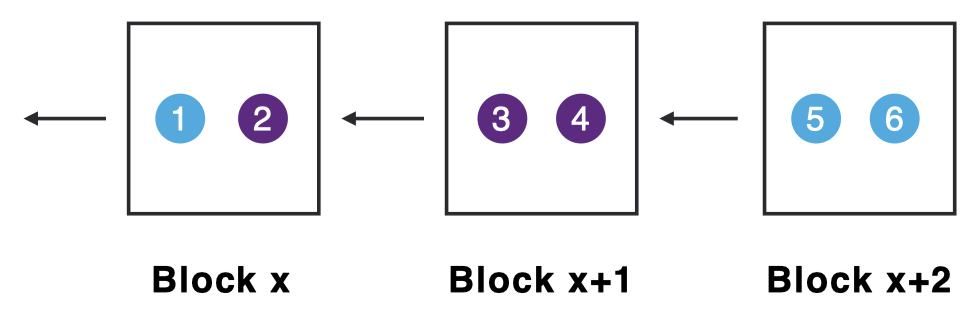
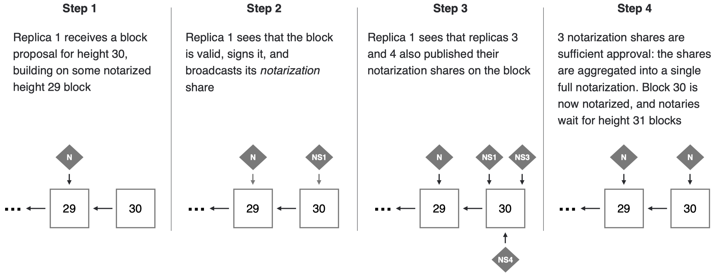
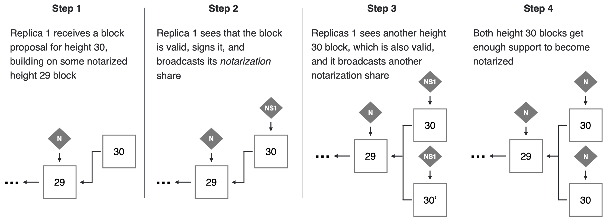
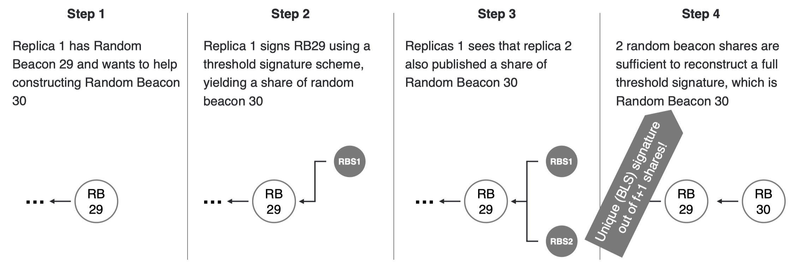
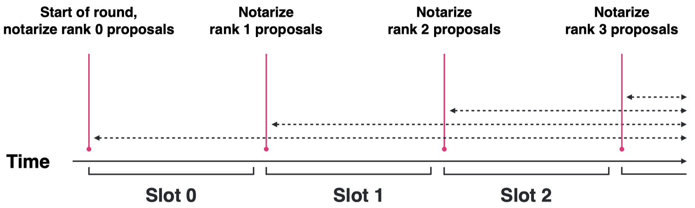
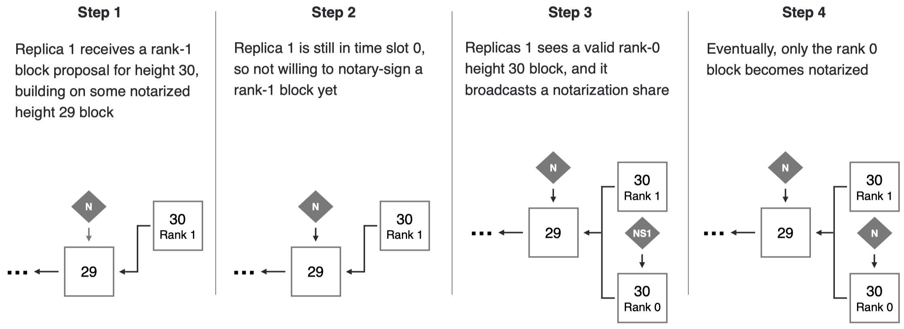
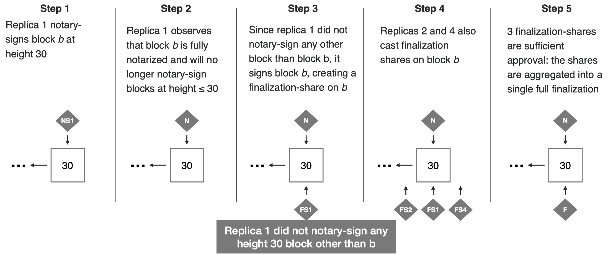
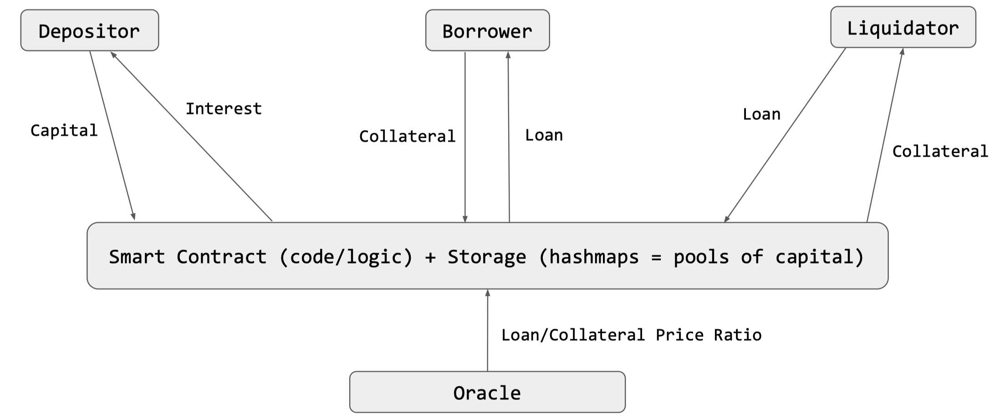

# Chapter 27: The Internet Computer

## 27.1 What Is The Internet Computer?

The **Internet Computer (IC)** is a platform to run any computation, using blockchain technology for decentralization and security.

The **Internet Computer Protocol (ICP)** is a protocol for the coordination of nodes in _independent_ datacenters, jointly performing any computation for _anyone._ ICP creates the Internet Computer blockchains and guarantees safety and liveness of smart contract execution despite Byzantine participant.

The above idea is based on **canister smart contracts,** which are a combination of data (in memory pages) and code (in WebAssembly bytecode). Developers and users interact directly with canisters on the IC.

_Scalability_ is achieved through nodes and subnets. Nodes are partitioned into _subnets._ Canister smart contracts are assigned to different subnets. One subnet is special: it hosts the **Network Nervous System (NNS)** canisters which govern the IC.

ICP token holders vote on:

- Creation of new subnets
- Upgrades to new protocol versions
- Replacement of nodes
- etc.

The **chain key technology** is based on the following three principles:

- One public key of NNS never changes and the nodes in the NNS share the same private key
- The NNS generates key for new subnets and certifies them
- Nodes in a subnet use these keys for secure communication

Each subnet is a replicated **state machine:**

- State: canisters and their queues
- Inputs: new canisters to be installed, messages from users and other canisters
- Outputs: responses to users and other canisters
- Transition function: message routing and scheduling as well as canister code

## 27.2 Consensus On The Internet Computer

**Consensus** orders the different messages in the network. Replicas may receive input messages in different orders, but must process them in the same order as the other replicas.

The **consensus properties** say that messages are placed in _blocks._ We reach an agreement using a blockchain.

{width=50%}

The following properties must hold even if up to $f < n/3$ nodes misbehave:

- _Safety:_ For any $i$, if two honest replicas think that the $i$-th block is agreed upon, they must have the same block.
- _Liveness:_ For any $i$, at some point every honest replica will think that the $i$-zh block is agreed upon.
- _Validity:_ All agreed upon blocks are valid.

A **block maker** selects available messages and combines them into a block and broadcasts it. However, we need more than one block maker in each round, otherwise the IC would not be fault-tolerant.

The **notarization** process ensures that a valid block proposal is published for every round.

{width=100%}

Replicas may notary-sign multiple blocks to ensure that at least one block becomes fully notarized.

{width=100%}

Multiple notarized blocks may exist at the same height. At every height, there is a **Random Beacon,** an unpredictable random value shared by the replicas.

{width=100%}

The Random Beacon ranks block makers. Rounds are divided into time slots defining when block maker proposals are considered.

{width=50%}

Through notarization with block maker ranking we can reduce the number of notarized blocks.

{width=100%}

With **finalization,** replicas create finalization shares if they did not sign any other block at that height. This way, a finalization on block $b$ at height $h$ is a proof that no other block is notarized at height $h$.

{width=100%}

# Chapter 28: DeFi

## 28.1 Decentralized Finance

We introduce quickly some important terms about **finance:**

| Money     | Cryptocurrencies / Token |
| :-------: | :----------------------: |
| Banks | Blockchains / Lending Protocols / Vaults |
| Stocks | Tokens / Synths |
| Stock or Currency Exchanges | Automated Market Makers |
| PE / VC / Hedge-Funds | Decentralized Autonomous Organizations |

## 28.2 Money & Banks

**Money** is native to the blockchain (the first level hashmap). The hashmap is the blockchain, which is everywhere. A **token** on the blockchain is essentially a nested hashmap.

**Banks** are simply blockchains or smart contracts, or, in other words, hashmaps and nested hashmaps.

## 28.3 Lending Protocol

{width=50%}
