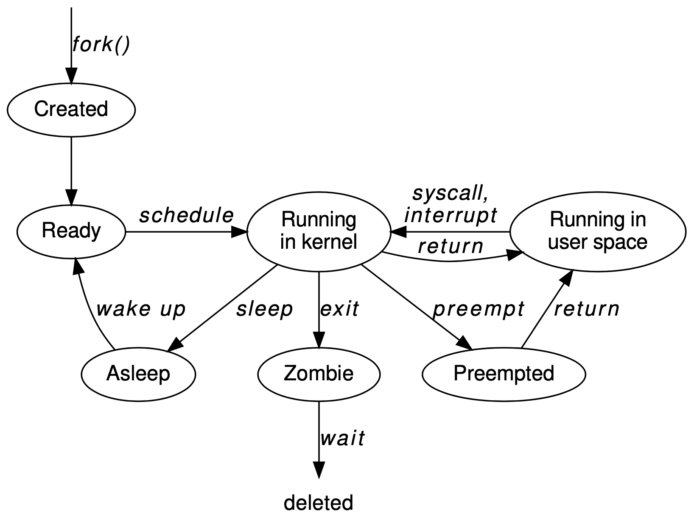

**Computer System -- Notes week 2**

- Author: Ruben Schenk
- Date: 13.10.2021
- Contact: ruben.schenk@inf.ethz.ch

# Chapter 3 : Classical Operating Systems and the Kernel

## 3.1 The role of the OS

The **operating system** for a unit of computing hardware is that part of the software running on the machine which fulfills three particular roles:

- As a **Referee**, the OS multiplexes the hardware of the machine among different principals (users, programs, etc.), and protects these principals from each other.
- As an **Illusionist**, the OS provides the illusion of *real* hardware resources to resource principals through *virtualization*.
- As **Glue**, the OS provides abstractions to tie different resources together, and hides details of the hardware to allow programs portability across different platforms.

## 3.2 Domains

A **domain** is a collection of resources or principals which can be traded as a single uniform unit with respect to some particular property. Some examples are:

- *NUMA domain:* cores sharing a group of memory controllers in a NUMA system.
- *Coherence domain:* caches which maintain coherence between themselves.
- *Failure domain:* the collection of computing resources which are assumed to fail together.
- *Shared memory domain:* cores which share the same physical address space.
- *Administrative domain:* resources which are all managed by a single central authority or organization.
- *Trust domain:* a collection of resources which mutually trust each other.
- *Protection domain:* the set of objects which are all accessible to a particular security principal.
- *Scheduling domain:* set of processes or threads which are scheduled as a single unit.

## 3.3 OS components

The **kernel** is that part of an OS which executes in privileged mode.

- While most computer systems have a kernel, very small embedded systems do not.
- The kernel is just a computer program, typically an *event driven server*. It responds to multiple entry points: *system calls, hardware interrupts, and program traps.*

**System libraries** are libraries which are there to support all programs running on the system, performing either common low-level functions or providing a clean interface to the kernel and daemons.

A **daemon** is a user-space process running as part of the operating system.

- Daemons are different from in-kernel threads. They execute OS functionality that can't be in a library, but is better off outside the kernel (for reasons of modularity, fault tolerance, and ease of scheduling).

## 3.4 Operating System models

A **monolithic kernel**-based OS implements most of the operating systems functionality inside the kernel.

- It can be efficient, since almost all the functionality runs in a single, privileged address space.
- Containing faults in a monolithic kernel is hard. This results in reduced reliability.

A **microkernel**-based OS implements minimal functionality in the kernel, typically only memory protection, context switching, and inter-process communication. All other OS functionality is moved out into user-space server processes.

- The motivation for microkernels is to make the OS more robust to bugs and failures, since dependencies between components are in theory more controlled.
- Microkernels can be slower since more kernel-mode transitions are needed to achieve any particular result, increasing overhead. However, the very small size of microkernels can actually improve performance due to much better cache locality.

An **exokernel**-based system moves as much functionality as possible out off the kernel into the system libraries linked into each application.

- Moving OS functionality into application-linked libraries is, at first sight, an odd idea, but greatly simplifies reasoning about security in the system and providing performance guarantees to applications which also need to invoke OS functionality.

A **multikernel**-based system targets multiprocessor machines, and runs different kernels on different cores in the system.

- Multikernels are a relatively new idea.
- The key characteristic is that the kernels themselves do not share memory or state, but communicate via messages.

## 3.5 Bootstrap

**Bootstrapping**, or more commonly these day simply **booting**, is the process of starting the operating system when the machine is powered on or reset up to the point where it is running regular processes.


The *boot sequence steps* are as follows:

1. When a processor is powered on, it starts executing instructions at a fixed address in memory.
2. The *Basic Input/Output System* (**BIOS**) starts initializing the hardware.
3. The BIOS sets up a standard execution environment for the next program to run such that it does not need to know specifics of the system.
4. The next program is typically the **boot loader**, and its job is to find the operating system kernel itself, load it into memory, and start executing it.
5. The OS kernel itself, once it is entered, initializes its own data structures and creates the first processes. Finally, it starts this new process executing, and the system is now in regular steady state.

## 3.6 Entering and leaving the kernel

**Mode transfer** is the process of software execution transitioning between different hardware processor modes and one of the *most important pieces of modern OSes*.

> Remarks:
> - This typically involves switching between user mode and kernel mode.
> - The key goal of user to kernel mode transfer is to protect the kernel from malicious or buggy user processes.
> - The kernel is entered from user space as a result of processor exception: either a synchronous trap or an asynchronous fault.

A **system call** is a trap (synchronous exception) deliberately invoked by a user program to request a service from the kernel. A system call is defined as taking arguments and returning values.

*Example*: Consider the `write()` system call in Unix. `write()` has the following functional prototype:

```c
ssize_t write(int fd, const void *buf, size_t count);
```

Such a call would be implemented as follows:

```algo
# Procedure in user space
1: Load fd, buf, and count into processor register
2: Load system call number for write into a register
3: Trap
4: Read result from register
5: return Result

# Execution in the kernel (the trap handler)
6: Set up execution environment (stack etc.)
7: Read system call number from register
8: Jump to write code based on this
9: Read fd, buf, and count from processor register
10: Check buf and count for validity
11: Copy count bytes from user memory into kernel buffer
12: Do the rest of the code for write
13: Load the return value into a register
14: Resume the calling process, transfer to user mode
```

# Chapter 4 : Processes

The **process** is a fundamental concept in operating systems. In this chapter, we look at what a process is, the concept of an execution environment, how processes are created and destroyed, and how they interact with threads.

## 4.1 Basic definitions

A **process** is the execution of a program on a computer with restricted rights.

- A process can be though of as an *instance* of a program
- A process combines execution, running the program, and protection
- A process is a resource principal: In terms of implementation, a process bundles a set of hardware and software resources together

## 4.2 Execution environment

The **execution environment** of a process is the virtual platform on which it executes: the virtual address space, available system calls, etc.

- The execution environment of the kernel is purely defined by the machine hardware
- A process can be thought of as a *virtual machine* for executing the user's program
- The process's *virtual processor* doesn't have a simple relationship to the real processors that the OS kernel is managing

## 4.3 Process creation

When a process creates (via the OS) another new process, the creating process is called the **parent** and the newly created process the **child**. This creates a **process tree**: every process in the system has a parent (except the root of the tree).

An OS **spawns** a child process by creating it from scratch in a single operation, with a program specified by the parent.

- Unless you're familiar with `fork()`, this is the obvious way to create a process.
- Windows creates processes by spawning using the `CreateProcess()` system call.

In Unix, a `fork` operation creates a new child process as an exact copy of the calling parent. An `exec` operation replaces the contents of the calling process with a new program, specified as a set of command-line arguments.

- `exec()` does *not* create a new process, instead it is the complement to `fork()` -- without it, you could not run any new programs
- `exec()` never returns (except if it fails), instead the new program starts where you might expect `main()`

The **initial process**, often called `init`, is the first process to run as a program when a machine boots.

## 4.4 Process life cycle

Each process is said to be in one of a set of states at any point in time. **Running** processes are actually executing code, either in kernel mode or in user space. **Runnable** (also called *waiting* or *ready*) processes can execute, but are not currently doing so. **Blocked** (also called *asleep*) processes are waiting for an event to occur before they can run.

*Example*: The figure below shows a slightly simplified process state machine for Unix.



A process which exits is generally not removed completely from the system, but enters a state between being alive and being deleted from the OS. A process in this state is a **zombie**. A process which is alive, but whose parent has exited, is an **orphan**.

## 4.5 Coroutines

A **coroutine** is a generalization of the concept of a subroutine. A coroutine can be entered at multiple times, at multiple points, and return multiple times. Programming with coroutines is sometimes referred to as **cooperative multitasking**.

## 4.6 Threads

**User threads** are implemented entirely within a user process. They are sometimes known as *lightweight processes*, but this latter term is a bit ambiguous.

**Kernel threads** are implemented by the OS kernel directly, and appear as different virtual processors to the user process.
