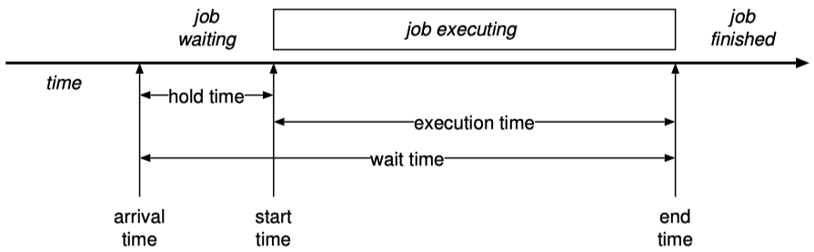

# Chapter 5 : Inter-process communication

## 5.1 Hardware support for synchronization

The most basic hardware mechanism to an OS for synchronizing threads is to disable interrupts:

```pseudo
# Algorithm 5.1: Protecting a critical section by disabling interrupts
1: Disable all interrupts and traps
2: Access state in a critical section
3: Enable interrupts
```

### 5.1.1 Shared-memory synchronization instructions

```c
# Algorithm 5.2: Test-And-Set
inputs:
    p {Pointer to a word in memory}
outputs:
    v {Flag indicating if the test was successful}
do atomically:
    v <- *p
    *p <- 1
end do atomically
return v
```

```c
# Algorithm 5.3: Compare-and-Swap
inputs:
    p {Pointer to a word in memory}
    v1 {Comparison value}
    v2 {New value}
outputs:
    {Original value}
do atomically:
    if *p = v1 then:
        *p <- v2
        return v1
    else
        return *p
    end if
end do atomically
```

*Remark*: CAS is strictly more powerful than TAS. You can show that any other atomic operation can be efficiently simulated with CAS, though not with TAS.

### 5.1.2 Hardware Transactional Memory

**Transactional Memory** is a programming model whereby loads and stores on a particular thread can be grouped into transactions. The **read set** and **write set** of a transaction are the set of addresses read from and written to respectively. A **data conflict** occurs in a transaction if another processor reads or writes a value from the transaction's write set, or write to an address in the transaction's read set.

*Remarks*:

- HTM us usually implemented using the cache coherency protocol to make lines in the cache as part of the read and write sets. Conflict detection is therefore actually done at the granularity of entire cache lines rather than just words.
- There is a limit to the size of read and write sets that can be checked (such as the L1 cache). If this limit is exceeded, the transaction aborts and should not be retried, since it's always going to abort.

## 5.2 Shared-memory synchronization models

We'll assume you're already familiar with semaphores (and `P`, `V` operations), mutexes (Acquire, Release), condition variables (Wait, Signal/Notify, Broadcast/NotifyAll), and monitors (Enter, Exit).

A **spinlock** is a multiprocessor mutual exclusion primitive based on one processor spinning on a memory location written by another.

```c
# Algorithm 5.8: TAS-based spinlock
inputs:
    p is the address of a word in memory
    
# Acquire the lock
repeat:
    v <- TAS(*p)
until v = 0
# ...
# Release the lock
*p <- 0
```

The **spin-block** problem is to come up with a strategy for how long a thread should spin waiting to acquire a lock before giving up and blocking, given particular values for the cost of blocking, and the probability distribution of lock hold times.

In the absence of any other information about the lock hold time, spinning for a time equal to the cost of a context switch results in overhead at most twice that of the optimal offline algorithm (which has perfect knowledge about the future).

## 5.3 Messages: IPC without shared memory

The alternative to communication using shared data structures protected by thread synchronization primitives is to send messages instead. You have already seen this in networking using sockets.

In **asynchronous** or **buffered IPC** the sender does not block, but the send operation instead returns immediately. The receiving process is not waiting for the message, the message is buffered until the receive call is made. On the receive side, the receive call blocks if no message is available.

In contrast, in a **synchronous** or **unbuffered IPC** system, both sender and receiver may block until both are ready to exchange data.

*Remarks*:

- Asynchronous IPC implies a buffer to hold messages which have been sent but not yet received. If this buffer becomes full, it's not clear what to do.
- Synchronous IPC, on the other hand, requires no buffering, merely two threads synchronizing in the OS kernel.

**Pipes** are the more fundamental IPC mechanism in Unix, and are closely related to `fork()`. One might reasonably claim that Unix *is* any OS based on `fork()` and `pipe()`.

A **pipe** is a unidirectional, buffered communication channel between two processes, created by:

```c
int pipe(int pipefd[2])
```

Each end is identified by a file descriptor, returned by reference in the array `pipefd`. One sets up a pipe between two processes by creating the pipe, then forking the other processes.

### 5.4 Upcalls

An **upcall** is an invocation by the operating system of a function inside a user process. The called function in the user program is called the *entry point*, or the *upcall handler*.

## 5.5 Client-Server and RPC

In the **client-server** paradigm of distributed computing, a *server* offers a service to potentially multiple *clients*, who connect to it to invoke the service.

**Remote Procedure Call** or **RPC** is a programming technique whereby remote client-server interactions are made to look to the programmer of both the client and the server as simple procedure calls: the client program calls the server using a simple procedure call, and the server program implements the service purely as a procedure with the appropriate name.

How this works is as follows: The **signature** of the remote procedure is fed into a **stub compiler**, which outputs two chunks of code that go into libraries. The first is the **client stub** (or *proxy*) which implements the client side procedure: this takes its arguments, *marshals* them into a buffer, sends the buffer to the server, and waits for a message in reply. When this comes back, it *unmarshals* the return values from the call, and returns to the client program. The second is the **server stub**, which performs the corresponding actions on the server side: wait for a message, unmarshal the arguments, call the server code with the arguments, marshal the return values into a buffer, and send it back to the client.

An **interface Definition Language** or **IDL** is a small, domain-specific language for writing RPC interface definitions.

## 5.6 Distributed objects

A **name server** is a service which holds the addresses of the RPC services. The data that the name server stores and hands out for a service is sometimes called an **interface reference**.

To contact an RPC service, a client has to acquire an interface reference from the service, and then **establish a binding** to the service. Binding can be **explicit**, in which case the client has to call some kind of "bind" or "connect" procedure to establish it. However, **implicit** binding is also possible: as part of unmarshalling an interface reference, the binding is established immediately and an invocation reference returned to the client.

A **distributed object system** is an RPC system with implicit binding where interface references are viewed as object references, and the IDL defines classes of which services are instances.

A local datastructure called the **object table** holds a mapping from interface references to invocation references, so that when an interface reference arrives, only a single client stub is created.

# Chapter 6: CPU Scheduling

In general, *scheduling* is deciding how to allocate a single temporal resource among multiple clients, in what order, and for how long. CPU scheduling involves deciding which task to run next on a given CPU, how long to run it for, and which CPU a given task should run on.

**Scheduling** is the problem of deciding, at any point in time, which process or thread on ever core in a system is currently executing.

**Dispatching** refers to the mechanism for (re)starting a particular process or thread running on a particular core.

## 6.1 Non-preemptive Uniprocessor Batch-oriented Scheduling

**Uniprocessor scheduling** is the problem of scheduling tasks on a single processor core (or, more precisely, hardware execution context).

A **batch workload** consists of a set of _batch jobs,_ each of which runs for a finite length of time and then terminates. _Batch scheduling_ is the problem of scheduling a set of batch jobs, which appear according to some arrival process.

A **non-preemptive** scheduler always allows a job to run to completion once it has started.

### 6.1.1 Batch Scheduling Terminology

{width=50%}

- _Arrival time:_ (or request time, or release time) The point, at which a job enters the scheduling system.
- _Start time:_ The point in time at which a job starts executing.
- _End time:_ (or completion time) The point in time at which a job terminates.
- _Execution time:_ (or runtime) The number of seconds it takes to complete from its start time.
- _Hold time:_ The time taken to start executing a job from the point where it arrives.
- _Wait time:_ (or turnaround time) The time it takes to finish the job from the point where it entered the system.

### 6.1.2 Batch Scheduling Metrics

The **throughput** of a batch scheduler is the number of jobs the scheduler completes per unit time. The **overhead** of a scheduler is the proportion of CPU time spend running the scheduler itself, as opposed to a client job. Overhead consists of the _context switch time_ plus the _scheduling cost._

_Example:_ Suppose the scheduling cost plus context switch time is 1ms, and each job runs for 4ms. The overhead is therefore $\frac{1}{(4+1)} = 20 \%$.

```pseudo
# Algorithm 6.16: First-come-first-served (FCFS) scheduling
1: Assume each job P_i arrives at time t_i
    # When the scheduler is entered:
2: Dispatch the job P_j with the earliest arrival time t_j
```

The **convoy phenomenon** occurs in FIFO schedulers when many short processes back up behind long-running processes, greatly inflating mean wait times.

```pseudo
# Algorithm 6.19: Shortes-Job First (SJF) scheduling
1: Assume each job P_j has an execution time of t_j seconds
    # When the scheduler is entered:
2: Dispatch the job P_j with the shortes execution time t_j
```

> **Theorem:** _Shortest-job first_ is optimal in the sense that it minimizes the average (mean) waiting time for all jobs in the system, at least for the case when all jobs have the same release time.

## 6.2 Uniprocessor Preemptive Batch Scheduling

A scheduler which can interrupt a running job and switch to another one is **preemptive.**

```pseudo
# Algorithm 6.22: SJF with preemption
    # When a new job enters the system or the running job terminates:
1: Preempt and suspend the currently running job
2: Dispatch the job P_j with the shortes execution time
```

## 6.3 Uniprocessor Interactive Scheduling

In contrast to batch-oriented job scheduling, an **interactive workload** consists of long-running processes most of which are blocked waiting for an external event, such as user-input.

The **response time** of an interactive program is the time taken to respond to a request for service.

> _Remark:_ The response time is different from wait time: it refers to long-running processes which handle a sequence of external requests. Examples include a game responding to user control, a word processor responding to typing, etc.

```pseudo
# Algorithm 6.25: Round-robin (RR) scheduling
1: Let R be the double-ended queue of runnable processes
2: Let q be the scheduling quantum (a fixed time period)
    # When the scheduler is entered
3: Push the previously-running job on the tail of R
4: Set an interval timer for an interrupt q seconds in the future
5: Dispatch the job at the head of R
```

_Example:_ Suppose we have 50 processes, the process switch time is $10 \mu s$, and the scheduling quantum is $100 \mu s$. This leads to a scheduling overhead of about $9 \%$, but an average response time of $49 \cdot \frac{110}{2} = 2695 \mu s$. Alternatively, if we increase the quantum to $1000 \mu s$, the overhead is reduced to $0.99 \%$, but average response time increases to $49 \cdot \frac{1010}{2} = 24745 \mu s$.

### 6.3.1 Priority-based Scheduling

**Priority-based scheduling** is a broad class of scheduling algorithms in which each process is assigned a numeric priority, and the scheduler always dispatches the highest priority runnable task. A _strict priority scheduling_ algorithm is one where these priorities do not change.

Strict priority scheduling can lead to **starvation:** low-priority processes may be starved by high-priority ones which remain runnable and do not block. For this reason, strict priority systems are rare. Instead, most priority-based schedulers are not strict but **dynamic:** the priorities of tasks change over time in response to system event and application behavior. **Aging** is one solution to starvation: tasks which have waited a long time are gradually increased in priority.

In practice, priority-based schedulers are based on **multi-level queues:** there are a finite number of priorities, and each has a queue of processes at that priority. Priority levels are grouped into classes; queues in different classes are scheduled differently.

_Priority inversion_ occurs when a low-priority $P_l$ process holding a lock $R$ is preempted by a high-priority process $P_h$, which attempts to acquire $R$. If when $P_h$ blocks, a runnable medium-priority process $P_m$ gets to run, this inverts the effect of priority in the schedule.

Classically, there are two approaches to dealing with priority inversion:

- In a system with **priority inheritance,** a process holding a lock temporarily acquires the priority of the highest-priority process waiting for the lock until it releases the lock. This comes at some cost: the scheduler must now be involved in every lock acquire/release. This increases runtime overhead.
- In a system with **priority ceiling,** a process holding a lock runs at the priority of the highest-priority process which can ever hold the lock, until it releases the lock. Priority ceiling incurs much less runtime overhead than priority inheritance, but potentially requires static analysis of the entire system to work.

A **hierarchical scheduler** is a further generalization of multi-level queues: queues are instead organized in a nested hierarchy or tree of _scheduling domains._ Within each domain, sub-nodes are scheduled according to a potentially different policy. A **multilevel feedback queue scheduler** is a class of multi-level queue which aims to deliver good response for interactive jobs plus good throughput for background tasks. The key idea is to penalize CPU-bounds tasks in favor of I/O bound tasks.

## 6.4 Real-time Scheduling

An application is **hard real-time** if its correctness depends on not only on the I/O actions it performs, but also the time it takes to execute. Hard real-time task correctness is often expressed in terms of _deadlines:_ each task has a specific point in time by which it must have completed in order to be correct.

> Remarks: For hard-real time systems, the following holds:
>
> - In the general case, hard-real time scheduling is impossible: tasks can appear at any time, with any deadlines.
> - If the task set is not known in advance, the system must reject tasks for which no feasible schedule is possible, a process called admission control.

**Rate-monotonic scheduling (RMS)** schedules periodic tasks by always running the task with the shortest period first. Suppose there are $m$ (periodic) tasks, each task $i$ has execution time $C_i$ and period $P_i$. Then RMS will find a feasible schedule if:

$$
\sum_{i = 1}^n \frac{C_i}{P_i} \leq n(2^{\frac{1}{n}}-1)
$$

RM is one of the two classic real-time schedulers: it is extremely efficient provided that tasks are periodic, and the full workload is known in advance -- this is the case in many embedded control applications.

**Earliest deadline first (EDF)** scheduling sorts tasks by deadline and always runs the earliest deadline first. It is dynamic and online, and tasks are not necessarily periodic. EDF is guaranteed to find a feasible schedule if:

$$
\sum_{i = 1}^n \frac{C_i}{P_i} \leq 1,
$$

i.e. it can use $100 \%$ of a processor, if we ignore the overhead of scheduling and context switching. EDF is more complex (scheduling decisions can be $o(\log n)$ in the number of tasks). It is typically implemented by maintaining a priority queue of jobs sorted by deadline, often represented as a heap.

In contrast to hard real-time systems, a **soft real-time** task has timing requirements which are non-strict, but nevertheless affect the quality and utility of the result.

In contrast to conventional priority-based schedulers, a **reservation-based scheduling policy** guarantees a minimum number of CPU time units to each job.

## 6.5 Multiprocessor Scheduling

Fully general multiprocessor scheduling is NP-hard -- it tends to reduce to 2-dimensional bin-packing. The two-dimensionality comes from having to decide which core to run a given thread on as well as when to dispatch it on that core. We start with some simplifying assumptions:

- The system can always preempt a task.
- The scheduler is work-conserving.

A scheduler is **work-conserving** if no other processor is ever idle when there is a runnable task.

### 6.5.1 Sequential Programs on Multiprocessors

The simplest model for multiprocessor scheduling maintains a single system-wide run queue. Whenever an individual processor makes a scheduling decision, it picks a thread from the run queue to remove and dispatch.

To remove the bottleneck of a single run queue and improve cache locality of running processes, **affinity-based scheduling** tries to keep jobs on one core as much as possible. Each core has its own run queue, and jobs are periodically re-balanced between all the individual queues. This is much more efficient, but note that it is not work conserving anymore. A processor can end up with an empty run queue when other queues have jobs which are runnable, but not currently running.

A **work-stealing** scheduler allows once core which would otherwise be idle to "steal" runnable jobs from neighboring cores so as keep doing useful work.
