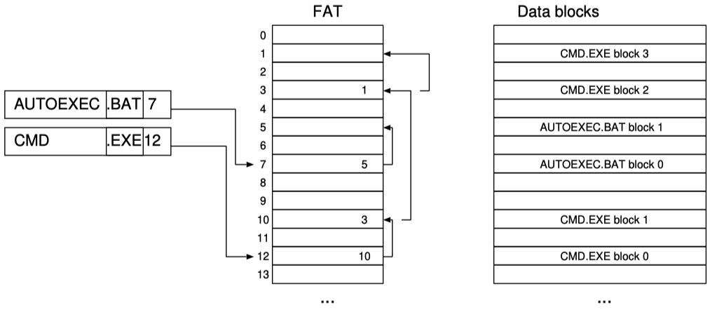
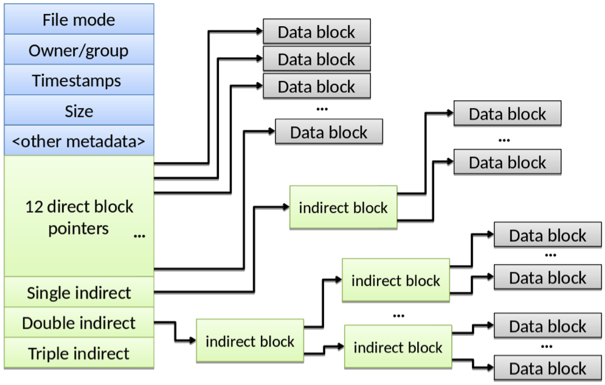

# Chapter 11: File System Implementation

## 11.1 Low-level File System Basics

A **volume** is the generic name for a storage device, or something which resembles it. A volume consists of a contiguous set of fixed size **blocks,** each of which can be read from or written to. It is convenient to refer to every block on a volume using its **logical block address (LBA),** treating the volume as a compact linear array of usable blocks.

At a level below files, disks or other _physical volumes_ are divided into contiguous regions called **partitions,** each of which can function as a volume. A _partition table_ stored in sectors are the start of the physical volume lays out the partitions. Partitions coarsely multiplex a disk among file systems, but aren't really much of a file system themselves.

_Example:_ Here is a Linux system with a single hard disk drive with four different partitions on it:

```shell
troscoe@emmentaler1:$ sudo parted
GNU Parted 3.2
Using /dev/sda
Welcome to GNU Parted!
Model: SEAGATE ST3600057SS (scsi)
Disk /dev/sda: 600GB
Sector size (logical/physical): 512B/512B
Partition Table: msdos
Disk Flags:

Number      Start       End     Size    Type    File system     Flags
1           1049kB      16.0GB  16.0GB  primary ext4            boot
2           16.0GB      20.0GB  4000MB  primary ext4            
3           20.0GB      36.0GB  16.0GB  primary linus-swap(v1)
4           36.0GB      600GB   564.0GB primary ext4
```

In addition to splitting a single physical device into multiple volumes, **logical volumes** are created by merging multiple physical devices into a single volume. The best framework for thinking about logical volumes is _distributed storage:_ data can be replicated across physical volumes for durability or striped across them for performance.

**A file system** (as opposed to _the_ file system) is a set of data structures which fill a volume and collectively provide file storage, naming, and protection. The term can also mean the _implementation_ (class) of the file system. _The_ file system we saw in the previous chapter provides the interface to, and implementation of, one or more of the file systems defined above.

_Example:_ In the following output, there are 15 different individual file systems which collectively make up the file name space of the machine:

```shell
troscoe@emmentaler1:$ df
Filesystem      1K-blocks       Used        Available       Use%        Mounted on
udev            12316068        0           12316068        0%          /dev
tmpfs           2467336         1120        2466216         1%          /run
/dev/sda1       15247760        10435252    4014916         73%         /
...
```

A **mount point** in a hierarchically-named OS (like UNIX) is a directory under which is _mounted_ a complete other file system. One file system, the _root file system,_ sits at the top, and all other file systems accessible in the name space are mounted in directories below this. In the example above, the root file system is the volume `/dev/sda1`, which is the first partition of the disk `/dev/sda`.

> Remarks:
>
> - A file system can, in principle, be mounted over any existing directory in the name space, regardless of which file system that directory is part of.
> - When a directory has a file system mounted over, its contents and that of all its children become inaccessible.
> - Mount points allow great flexibility in reconfiguring the name space, and have grown more flexible over the years.

A **virtual file system (VFS)** interface is an abstraction layer inside the kernel which allows different file system implementations to coexist in different parts of the name space.

## 11.2 File System Goals

What does the file system need to provide? We've seen the user-visible functionality, but the implementation is also concerned with:

- _Performance:_ How long does it take to open a file? To read it? To write it?
- _Reliability:_ What happens when a disk fails? Or Flash memory is corrupted? Or the machine crashes in the middle of a file operation?

## 11.3 On-disk Data Structures

For the rest of this section, it's better to describe specific examples of filing systems rather than try to present abstract principles. We'll look at FAT, BSD, FFS, and Windows NTFS. For each, we'll look at:

- Directories and indexes: Where on the disk is the data for each file?
- Index granularity: What is the unit of allocation for files?
- Free space maps: How to allocate more sectors on the disk?
- Locality optimizations: How to make it go fast in the common sense?

### 11.3.1 The FAT File System

**FAT** is the file system created for MS-DOS and the original IBM PC, based on earlier designs that Microsoft had used for other microcomputers. Over time, FAT has evolved to handle larger and larger storage devices which stressed hard limits in the original design: thus, we talk about FAT, FAT12, FAT16, FAT32, exFAT, etc. All use the same basic structure we describe here.

{width=50%}

The **File Allocation Table (FAT)** is a linear array of block numbers, with an entry for every block on the volume.

> Remarks:
>
> - Directories in FAT are a special kind of file which the OS interprets differently. The directory is a simple table of entries, which give the name, metadata, and the block number of the start of the file, i.e. an initial pointer into the File Allocation Table.
> - Each FAT entry marks the corresponding block on the volume as free, or used.
> - Random access to a file is slow, since it requires traversing the list of file blocks inside the FAT.
> - Resilience is poor: if the FAT is corrupted or lost, you really have lost everything.
> - The file system has poor locality, since there is nothing to prevent a file's block from being scattered over the disk.

### 11.3.2 The Berkeley Fast Filing System

An index node or **inode** in a file system is a contiguous region of data on a disk that contains all the necessary metadata for a file (including where the file's data is stored).

> Remarks:
>
> - The inode is the heart of the file: all names for the file point to the inode, and all data blocks comprising the file are listed by the inode.
> - FFS has an area of disk called the _inode array,_ which holds a table of complete inodes, indexed by number.
> - Directories in FFS are lists of file names and corresponding inode numbers.

The structure if an inode (somewhat simplified) is shown in the figure below:

{width=50%}

> Remarks:
>
> - The first part of the inode holds standard file metadata, which is typically about 512 bytes.
> - For small files (< 3.5kB), the file's data is stored in the inode, making for very fast access.
> - Otherwise, the inode is filled with a list of addresses of the blocks holding the file data. If block addresses are 64 bits in size (8 bytes), there is room for $(4096 - 512) / 8 = 448$ block pointers, so files up to $448 \times 4096 = 1792kB$ in size could be represented with a single node.
> - To circumvent this limit, the final 3 block addresses in the node are special. The first points to a block which only contains further block addresses. The second points to a block filled with the block addresses of further blocks which contain addresses of data blocks. The final pointer takes this scheme one stage further. This allows truly huge files to be accesses randomly with an upper bound of 4 disk reads per block!

A **block group** in FFS is a contiguous subset of the disk tracks where related inodes, directories, free space map, and file data blocks are gathered together. Block groups are not perfect, but they aim at increasing the locality of reference for most file system operations.

The **superblock** is the area of a disk which holds all information about the overall layout of the file system: how large it is, where the block groups are, etc.

> Remarks:
>
> - Most file systems have some equivalent of the superblock (in FAT, for example, it is stored in the front of the File Allocation Table itself, in the _master boot record_).
> - Losing the superblock is catastrophic. For this reason, it is replicated several times throughout the disk, at regular, predictable intervals.

### 11.3.3 Windows NTFS

NTFS is organized around a single **Master File Table** of _file entries,_ each of which is 1kB in size. Each MFT entry describes a file.

> Remarks:
>
> - The MFT itself is a file, described by the first entry in the MFT. Its name is `$MFT`.
> - Each possible name for a file is an attribute of its MFT entry.
> - For very small files, the data itself is an attribute of its MFT entry.
> - File data for non-tiny files is stored in _extents._
> - If the MFT entry is not big enough to hold all the file attributes, the first attribute is an "attribute list" which indexes the rest.

An **extent** is a contiguous, variable-sized region of a storage volume, identified by its start LBA and length in blocks.

## 11.4 In-memory Data Structures

The **per-process open file table** is an array mapping file descriptors or file handles to entries in the system-wide open file table. The **system open file table** contains an entry for every open file in the OS, including its state: the seek pointer, the layout of the file itself on its volume, and any other state of the open file.

The file system **block cache,** or _buffer cache,_ is a system-wide cache of blocks read from and written to storage volumes. A **unified buffer cache** manages most of a computers main memory, and allows cached pages to be accessed via loads and stores from user space (having been mapped into a virtual address space), and/or accessed as file contents using read/write system calls.

# Chapter 12: The Network Stack

The **network stack** is the component of the OS which handles all network I/O, including _packet transmit and receive, multiplexing_ and _demultiplexing,_ and other kinds of _protocol processing._

## 12.1 Network Stack Functions

The network stack's purpose is to move data between user programs on different machines. This can be broken down into various functions, all of which happen at multiple places in the stack:
**Multiplexing** is the process of sending packets from multiple connections at one layer in the protocol stack down a single connection at a lower layer. **Demultiplexing** is the reverse process: taking packets received on a connection at one layer, and directing each one to the appropriate channel in an upper layer.

While multiplexing refers to sharing a single lower-level channel among multiple higher-level connections, **encapsulation** is the mechanism by which this is usually achieved: by wrapping a packet on one channel as the payload of a lower-layer connection, adding a _header_ and/or _trailer_ in the process. **De-encapsulation** is the reverse: interpreting the payload of one packet as a packet for a different, higher-layer protocol.

The networking stack needs to do more than simply move packets between the network interface and main memory. In addition, it must maintain, and execute, **state machines** for some network protocols. Such _protocol state processing_ not only means that the network stack needs to maintain more states than simply the set of active connections, but it may also need to generate new packets if the state machine requires so.

_Example:_ TCP is a good example of protocol state processing. The TCP state for a given TCP connection in the kernel, generally held in a data structure called the TCP Control Block, is much more than simply the state you are familiar with from the networking course. It includes the congestion and flow control windows, a buffer of all unacknowledged data it might need to resend, plus a collection if _timers_ that trigger the state transitions that are not initiated by packets arriving.

The network stack also needs to move packet data through the system, both _buffering_ it and _transferring_ it between different protocol processing elements.

## 12.2 Header Space

The **header space** is an abstract vector space which represents the set of all possible headers of a packet.

## 12.3 Protocol Graphs

The **protocol graph** of a network stack is a directed-graph representation of the forwarding and multiplexing rules at any point in time in the OS. Nodes in the protocol graph represent a protocol acting on a communication channel, performing encapsulation or de-encapsulation, and possibly multiplexing and demultiplexing.

_Example:_ Nodes in the protocol graph might include:

- Demultiplexing an LLC/SNAP packet based on whether the protocol field is IP, or Appletalk, or ...
- Demultiplexing UDP packets based on the destination IP address and port
- Processing a single, bidirectional TCP connection
- etc.

## 12.4 Network I/O

We've already seen how a NIC operates at the lowest level in Chapter 7: packets that are received are copied into buffers supplied by the OS and enqueued onto a descriptor queue, and these filled buffers are then returned to the OS using the same, or possibly a different, queue. Similarly, packets to be sent are enqueued on a descriptor queue, and the NIC is notified. When a packet has been sent over the networks, its buffer is returned to the OS by the NIC. Synchronization over the queues is handled using device registers, flags in memory, and interrupts.
The _first-level interrupt handler_ for packet receive therefore looks like this:

```pseudo
# Algorithm 12.10: First-level interrupt handler for receiving packets
1:  inputs:
2:      rxq: the receive descriptor queue
    # Device interrupt handler:
3:  Acknowledge interrupt
4:  while not(rxq.empty()) do:
5:      buf <- rxq.dequeue()
6:      sk_buf <- sk_buf_allocate(b)
7:      enqueue(sk_buf) for processing
8:      post as DPC (software interrupt)
9:  end while
10: return
```

## 12.5 Data Movement Inside The Network Stack

**Packet descriptors,** known as *sk_bufs* in Linux, and *m_bufs* in BSD UNIX, are data structures which describe an area of memory holding network packet data.

> Remarks:
>
> - A packet descriptor holds metadata about a packet, but also a reference to multiple areas of memory that hold the actual packet data.
> - A packet descriptor can also identify a subset of a buffer in memory that is of interest.

To simplify somewhat, a UNIX *m_buf* contains the following fields:

```c
struct mbuf {
    struct mbuf *m_next;        /* next mbuf in chain */
    struct mbuf *m_nextpkt;     /* next packet in list */
    char        *m_data;        /* location of data */
    int32_t      m_len;         /* amount of data in this mbuf */
    uint32_t     m_type:8,      /* type of data in this mbuf */
                 m_flags:24;    /* flafs, see below */
    char         m_dat[0];
}
```

A single m_buf `b` describes `b.m_len` bytes of data, starting in memory at address `b.m_data`. This data might be stored in the m_buf itself, in the array `b.m_dat`, or alternatively somewhere else in memory. The `b.m_type` field specified which case it is. An *m_buf chain* represents a single contiguous packet, using non-contiguous areas of memory. An m_buf chain is a singly-linked list of m_bufs chained with the `m_next` field. Moreover, packets themselves can be hooked together in lists or queues using the `m_nextpkt` field.

## 12.6 Protocol State Processing

Protocol state processing generally also happens in the "bottom half" of the network stack, even though it is generally independent of the particular NIC device driver. To understand why, consider TCP.

_Example:_ The code implementing a single TCP connection has to run in response to many external events: the user sending a segment, or the network receiving data on the connection, but also timers expiring, or acknowledgments received by the network, etc. Many of these events don't involve the user program at all. What's more, these events require TCP to send packets that the user will never see. For this reason, if TCP is to run in the "top half", it has to be scheduled to run at all kinds of events _not_ scheduled by the user program. UNIX-like operating systems avoid this problem by running most of TCP in the bottom half, as a set of DPCs.

## 12.7 Top-half Handling

Moving up the stack further, we come to the top half: that invoked by user programs. You're already familiar with the common sockets interface: `bind(), listen(), accept(), connect(), send(), recv()`, etc. Some protocol processing happens in the kernel directly as a result of top half invocations, but for the most part the top half is concerned with copying network payload data and metadata between queues of protocol descriptors in the kernel and user-space buffers.

## 12.8 Performance Issues

Instead of conventional interrupt-driven descriptor queues, a network receive queue can be serviced by a processor **polling** it continuously.

> Remarks:
>
> - Polling eliminates the overhead of interrupts, context switches, and even kernel entry and exit if there is a way to access the queues from user space.
> - Even polling, however, is insufficient to handle modern high-speed networks. For one thing, it is not clear how to scale this to multiple cores.

## 12.9 Network Hardware Acceleration

The solution is to put more functionality into hardware.

Modern NICs support **multiple send and receive queues** per port. Received packets are demultiplexed in hardware based on a set of _flow tables_ which determine which descriptor queue to put each packet onto.

Sending received packets to the right receive queue is only part of the solution. **Flow steering** not only picks a receive queue based on the network flow that the packet is part of, but can send and interrupt to a specific core that is waiting for that packet. **Receive-side scaling (RSS)** uses a deterministic hash function on the packet header to balance flows across receive queues and interrupts.

**TCP chimney offload,** sometimes called _partial TCP offload,_ allows the entire state machine for a TCP connection -- once it has been established -- to be pushed down the hardware, which will then handle timers, acknowledgments, retries, etc. and simply deliver in-order TCP segments to the kernel.

**Remote Direct Memory Access (RDMA)** is a completely different set of network protocols and hardware implementations. RDMA supports Ethernet-style descriptor rings for messages, but also supports so-called _one-sided operations_ which allow main memory on a machine to be written and read directly over the network without involving the host CPU: the NIC receives packets requesting such an operation, executes it itself, and returns the result.

## 12.10 Routing And Forwarding

Typically, the network stack in an OS not only sends, and receives packets, but also forwards them between its network interfaces, much as a router or switch does.

- Packet **forwarding** is the process of deciding, based on a packet and the interface on which the packet was received, which interface to send the packet out on.
- Packet **routing** is the process of calculating rules to determine how all possible packets are to be forwarded.

The **forwarding information base (FIB)** in a router is the set of data structures which are traversed for each packet received to determine what actions to perform on it, such as sending it out on a port or putting it into a memory buffer.
