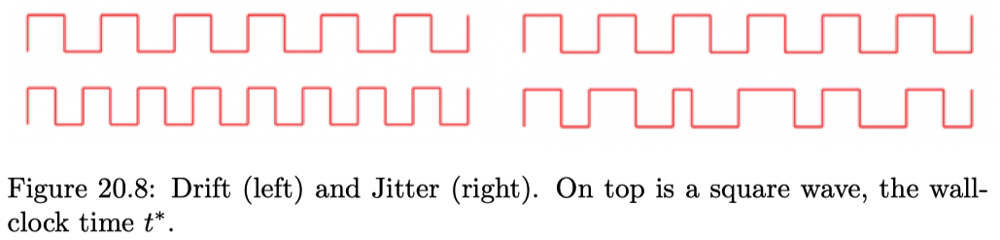

# Chapter 19: Consistency & Logical Time

## 19.1 Consistency Models

An **object** is a variable or a data structure storing information. An **operation** $f$ accesses or manipulates an object. The operation $f$ starts at wall-clock time $f_*$ and ends at wall-clock time $f_{\dagger}$. If for two operations $f$ and $g$ it holds that $f_{\dagger} < g_*$, we simply write $f < g>$. An **execution** $E$ is a set of operations on ore more multiple objects that are executed by a set of nodes.

An execution restricted to a single node is a **sequential execution.** All operations are executed sequentially, which means that no two operations $f$ and $g$ are concurrent, i.e. we have $f < g$ or $g < f$. Two executions are **semantically equivalent** if they contain exactly the same operations. Moreover, each pair of corresponding operations has the same effect in both executions.

An execution $E$ is called **linearizable** (or atomically consistent), if there is a sequence of operations (sequential execution) $S$ such that:

- $S$ is correct and semantically equivalent to $E$.
- Whenever $f < g$ for two operations, $f$ and $g$ in $E$, then also $f < g$ in $S$.

A _linearization point_ of operation $f$ is some $f_{\bullet} \in [f_*, \, f_{\dagger}]$.

> **_Lemma 19.8:_** An execution $E$ is linearizable if and only if there exists linearization points such that the sequential execution $S$ that results in ordering the operations according to those linearization points is semantically equivalent to $E$.

An execution $E$ is called **sequentially consistent,** if there is a sequence of operations $S$ such that:

- $S$ is correct and semantically equivalent to $E$.
- Whenever $f < g$ for two operations, $f$ and $g$ _on the same node_ in $E$, then also $f < g$ in $S$.

> **_Lemma 19.10:_** Every linearizable execution is also sequentially consistent, i.e. $\text{linearizability} \Rightarrow \text{sequential consistency}$.

An execution $E$ is called **quiescently consistent,** if there is a sequence of operations $S$ such that:

- $S$ is correct and semantically equivalent to $E$.
- Let $t$ be some _quiescent point,_ i.e. for all operations $f$ we have $f_{\dagger} < t$ or $f_* > t$. Then for every $t$ and every pair of operations $g, \, h$ with $g_{\dagger} < t$ and $h_* > t$ we also have $g < h$ in $S$.

> **_Lemma 19.12:_** Every linearizable execution is also quiescently consistent, i.e. $\text{linearizability} \Rightarrow \text{quiescent consistency}$.

> **_Lemma 19.13:_** Sequentially consistent and quiescent consistency do not imply one another.

A system or an implementation is called **linearizable** if it ensures that every possible execution is linearizable. Analogous definitions exist for sequential and quiescent consistency.

Let $E$ be an execution involving operations on multiple objects. For some object $o$ we let the **restricted execution** $E|o$ be the execution $E$ filtered to only contain operations involving object $o$. A consistency model is called **composable** if the following holds: If for every object $o$ the restricted execution $E|o$ is consistent, then also $E$ is consistent.

> **_Lemma 19.17:_** Sequential consistency is not composable.

> **_Theorem 19.18:_** Linearizability is composable.

## 19.2 Logical Clocks

Let $S_u$ be a sequence of operations on some node $u$ and define "$\to$" to be the **happened-before relation** on $E := S_1 \cup \cdots \cup S_n$ that satisfies the following three conditions:

1. If a local operation $f$ occurs before operation $g$ on the same node ($f < g$), then $f \to g$.
2. If $f$ is a send operation of one node, and $g$ is the corresponding receive operation of another node, then $f \to g$.
3. If $f, \, g, \, h$ are operations such that $f \to g$ and $g \to h$, then also $f \to h$.

If for two distinct operations $f$ and $g$ neither $f \to g$ nor $g \to f$, then we also say that $f$ and $g$ are _independent_ and write $f \sim g$.

An execution $E$ is called **happened-before consistent,** if there is a sequence of operations $S$ such that:

- $S$ is correct and semantically equivalent to $E$.
- Whenever $f \to g$ for two operations $f, \, g$ in $E$, then also $f < g$ in $S$.

> **_Lemma 19.21:_** Happened-before consistency = sequential consistency.

A **logical clock** is a family of functions $c_u$ that map every operation $f \in E$ on node $u$ to some logical time $c_u(f)$ such that the happened-before relation "$\to$" is respected, i.e. for two operations $g$ on node $u$ and $h$ on node $v$:

$$
g \to h \Rightarrow c_u(g) < c_v(h)
$$

If it additionally holds that $c_u(g) < c_v(h) \Rightarrow g \to h$, then the clock is called a **strong logical clock.**
The simplest logical clock is the _Lamport clock_, given in the algorithm below. Every message includes a timestamp, such that the receiving node may update its current logical time.

```pseudo
# Algorithm 19.24: Lamport clock (code for node u)
1: Initialize c_u := 0
2: Upon local operation: Increment current local time c_u := c_u + 1
3: Upon send operation: Increment c_u := c_u + 1 and include c_u as T in the message
4: Upon receive operation: Extract T from message and update c_u := max(c_u, T) + 1
```

> **_Theorem:_** Lamport clocks are logical clocks.

To achieve a strong logical clock, nodes also have to gather information about other clocks in the system, i.e. node $u$ needs to have an idea of node $v$'s clock, for every $u, \, v$. This is what _vector clocks_ in Algorithm 19.26 do: Each node $u$ stores its knowledge about other node's logical clocks in n $n$-dimensional vector $c_u$.

```pseudo
# Algorithm 19.26: Vector clocks (code for node u)
1: Initialize c_u[v] := 0 for all other nodes v
2: Upon local operation: Increment current local time c_u[u] := c_u[u] + 1
3: Upon send operation: Increment c_u[u] := c_u[u] + 1 and include the whole vector c_u as d in message
4: Upon receive operation: Extract vector d from message and update c_u[v] := max(d[v], c_u[v]) for all entries v. Increment c_u[u] = c_u[u] + 1
```

> **_Theorem 19.27:_** Define $c_u < c_v$ if and only if $c_u[w] \leq c_v[w]$ for all entries $w$, and $c_u[x] < c_v[x]$ for at least one entry $x$. Then the vector clocks are _strong logical clocks._

## 19.3 Application: Mutual Exclusion

When multiple nodes compete for exclusive access to shared resource, we need a protocol which coordinates the order in which the resource gets assigned to the nodes. The most obvious algorithm is letting a leader organize everything:

```pseudo
# Algorithm 19.28: Centralized Mutual Exclusion Algorithm
1: To access shared resource: Send request message to leader and wait for permission
2: To release shared resource: Send release message to leader
```

An obvious disadvantage is that the leader is a single point of failure and performance bottleneck. Assuming an asynchronous system, this protocol also does not achieve first come first server fairness. We can solve these issues with a distributed algorithm using logical clocks:

```pseudo
# Algorithm 19.29: Distributed Mutual Exclusion Algorithm
1: To access shared resource: Send message to all nodes containing the node ID and the current timestamp
2: Upon received request message: If access to the same resource is needed and the won timestamp is lwoer than the timestamp in the received message, defer the response. Otherwise send back a response
3: Upon responses from all nodes received: enter critical section. Afterwards send deferred responses.
```

The algorithm guarantees mutual exclusion without deadlocks or starvation of a requesting process. There is no single point of failure. Yet, whenever a node crashes, it will not reply with a response and the requesting node waits forever. Can we fix this? Indeed: Change step 2 in Algorithm 19.29 such that upon receiving request there will always be an answer, either Denied or OK. This way crashes will be detected.

## 19.4 Consistent Snapshots

A **cut** is some prefix of a distributed execution. More precisely, if a cut contains an operation $f$ on some node $u$, then it also contains all the preceding operation of $u$. The set of last operations one very node included in the cut is called the **frontier** of the cut. A cut $C$ is called **consistent** if for every operation $g$ in $C$ with $f \to g$, $C$ also contains $f$.

A **consistent snapshot** is a consistent cut $C$ plus all messages in transit at the frontier of $C$.

_Remarks:_

- In a consistent snapshot it is forbidden to see an effect without its cause.
- One extreme is a sequential computation, where stopping one node halts the whole system. Let $q_u$ be the number of operations on node $u \in \{1,..., \, n \}$. Then the number of consistent snapshots (including the empty cut) in the sequential case is $\mu_s := 1 + q_1 + q_2 + \cdots + q_n$.
- On the other hand, in an entirely concurrent computation the nodes are not dependent on one another and therefore stopping one node does not impact others. The number of consistent snapshots in this case is $\mu_c := (1 + q_1) \ccdot (1 + q_2) \cdots (1 + q_n)$.

The **concurrency measure** of an execution $E = (S_1,.., \, S_n)$ is defined as the ratio

$$
m(E) := \frac{\mu - \mu_s}{\mu_c - \mu_s},
$$

where $\mu$ denotes the number of consistent snapshot of $E$.

While a configuration describes the intractable state of a system at one point in time, a snapshot extracts all relevant tractable information of the system state.

```pseudo
# Algorithm 19.34: Distributed Snapshot Algorithm
1: Initiator: Save loval state, send a snap message to all other nodes and collect incoming states and messages of allother nodes
2: All other nodes:
3: Upon receiving a snap message for the first time: send own state (before message) to the initiator and propagate snap by adding snap tag to future messages
4: If afterwards receiving a message m without snap tag: Forward m to the initiator
```

> **_Theorem 19.35:_** Algorithm 19.35 collects a consistent snapshot.

## 19.5 Distributed Tracing

A **microservice architecture** refers to a system composed of loosely coupled services. These services communicate by various protocols and are either decentrally coordinated (also known as _choreography_) or centrally (_orchestration_).

_Remarks:_

- There is no exact definition for microservices. A rule of thumb is that you should be able to program a microservice from scratch within two weeks.
- Tracing enables tracking the set of services which participate in some task, and their interactions.

A **span** is a named and timed operation representing a contiguous sequence of operations on one node. A span $s$ has a start time $s_*$ and finish time $s_{\dagger}$. Spans represent tasks, like a client submitting a request or a server processing this request. Snaps often trigger several child spans or forwards the work to another service.

A span may casually depend on other spans. The two possible relations are **ChildOf** and **FollowsFrom** references. In a ChildOf reference, the parent span depends on the result of the child, and therefore parent and child span must overlap. In FollowsFrom references parents spans to not depend on any way on the result of their child spans, the parent simply invokes the child.

A **trace** is a series-parallel directed acyclic graph representing the hierarchy of spans that are executed to server some request. Edges are annotated by the type of the reference, either ChildOf or FollowsFrom.

The algorithm below shows what is needed if you want to trace requests to your system:

```pseudo
# Algorithm 19.40: Inter-Service Tracing
1: Upon requesting another service: Inject information of current trace and span (IDs or timing information) into the request header
2: Upon receiving request from another service: Extract trace and span information from the request header and create new span as child span
```

# Chapter 20: Time, Clocks & GPS

## 20.1 Time & Clocks

A **second** is the time that passes during 9'192'631'770 oscillation cycles of a caesium-133 atom. The **wall-clock time** $t^*$ is the true time, i.e. the time a perfectly accurate clock would show. The **clock error** or clock skew is the difference between two clocks, e.g. $t-t^*$ or $t-t'$. In practice the clock error is often modeled as $t = (1 + \delta)t^* + \xi(t^*)$.

{width=50%}

The **drift** $\delta$ is the predictable clock error. Drift is relatively constant over time, but may change with supply voltage, temperature, and age of an oscillator. Clock drift is indicated in **parts per million (ppm).** One ppm corresponds to a time error growth of one microsecond per second.

The **jitter** $\xi$ is the unpredictable, random noise of the clock error. In other words, jitter is the irregularity of the clock. Unlike drift, jitter can vary fast.

## 20.2 Clock Synchronization

**Clock synchronization** is the process of matching multiple clocks (nodes) to have a common time.

```pseudo
# Algorithm 20.10: Networ Time Protocol NTP
1:  Two nodes, client u and server v
2:  while true do:
3:      Node u sends request to v at time t_u
4:      Node v receives request at time t_v
5:      Node v processes the request and replies at time t'_v
6:      Node u receives the response at time t'_u
7:      Propagation delay delta
8:      Clock scew theta
9:      Node u adjusts clock by +theta
10:     Sleep before next synchronization
11:  end while
```

Where $\delta$ and $\theta$ are given by:

$$
\delta = \frac{(t'_u - t_u) - (t'_v - t_v)}{2}, \quad \theta = \frac{(t_v-t_u) + (t'_v - t'_u)}{2}
$$

The **Precision Time Protocol (PTP)** is a clock synchronization protocol similar to NTP, but which uses _medium access control (MAC)_ layer timestamps.

**Global** synchronization establishes a common time between _any_ two nodes in the system.

```pseudo
# Algorithm 20.13: Local Time Synchronization
1:  while true do:
2:      Exchange current time with neighbors
3:      Adapt time to neighbors, e.g. to average or median
4:      Sleep before next synchronization
5:  end while   
```

```pseudo
# Algorithm 20.14: Wireless Clock Synchronization with Known Delays
1:  Given: transmitter s, receivers u and v, with known transmission delays d_u and d_v for transmitter s, respectively.
2:  s sends signal at time t_2
3:  u receives signal at time t_u
4:  v receives signal at time t_v
5:  delta_u = t_u - (t_s + d_u)
6:  delta_v = t_v - (t_s + dv)
7:  Clock skew between u and v: theta = delta_v - delta_u = t_v - d_v + d_u - t_u
```

## 20.3 Time Standards

The **International Atomic Time (TAI)** is a time standard derived from over 400 atomic clocks distributed worldwide. Using a weighted average of all involved clocks, TAI is an order of magnitude more stable than the best clock.

A **leap second** is an extra second added to a minute to make it irregularly 61 instead of 60 seconds long. Time standards use leap seconds to compensate for the slowing of the Earth's rotation.

The **Coordinated Universal Time (UTC)** is a time standard based on TAI with leap seconds added at irregular intervals to keep it close to mean solar time at $0{\degree}$ longitude.

## 20.4 Clock Sources

An **atomic clock** is a clock which keeps time by counting oscillations of atoms. Atomic clocks are the most accurate clocks known. They can have a drift of only about one second in 150 million years, about $2e-10$ ppm!

The **system clock** in a computer is an oscillator used to synchronize all components on the motherboard. Usually, a quartz crystal oscillator with a frequency of some tens to hundreds MHz is used. The **real-time clock (RTC)** in a computer is a battery backed oscillator which is running even if the computer is shut down or unplugged.

_Remarks:_

- The RTC is read at system startup to initialize the system clock.
- This keeps the computer's time close to UTC even when the time cannot be synchronized over a network.
- RTCs are relatively inaccurate, with a common maximum drift of 5, 20 or even 100 ppm, depending on quality and temperature.

A **Radio Time Signal** is a time code transmitted via radio waves by a time signal station, referring to a time in a given standard such as UTC.

A **power line clock** measures the oscillations from electric AC power lines, e.g. 50 Hz.

## 20.5 GPS

The **Global Positioning System (GPS)** is a _Global Navigation Satellite System (GNSS),_ consisting of at least 24 satellites orbiting around the Earth, each continuously transmitting its position and time code.

```pseudo
# Algorithm 20.26 GPS Satellite
1:  Given: Each satellite has a unique 1023 bit (+-1, see below) PRN sequence, plus some current navigation data D (also +-1)
2:  The code below is a bit simplified, concentrating on the digital aspects, ignoring that the data is sent on a carrier frequency of 1575.42 MHz

3:  while true do:
4:      for all bits D_i in D do:
5:          for j = 0..19 do:
6:              for k = 0..1022 do {this loop takes exactly 1 ms}
7:                  Send bit PRN_k * D_i
8:              end for
9:          end for
10:     end for
11: end while
```

**Pseudo-Random Noise (PRN)** sequences are pseudo-random bit strings. Each GPS satellite uses a unique PRN sequence with a length of 1023 bits for its signal transmission.

**Navigation Data** is the data transmitted from satellites, which includes orbit parameters to determine satellite positions, timestamps of signal transmissions, atmospheric delays estimations and status information of the satellites and GPS as a whole, such as the accuracy and validity of the data.

The **circular cross-correlation** is a similarity measure between two vectors of length $N$, _circularly_ shifted by a given displacement $d$:

$$
cxcorr(a, \, b, \, d) = \sum_{i = 0}^{N-1} a_i \cdot b_{i + d \mod N}
$$

```pseudo
# Algorithm 20.30: Acquisition
1:  Received 1 ms signal s with sampling rate r * 1023 kHz
2:  Possible Doppler shifts F, e.g. {-10 kHz, -9.8 kHz,..., +10 kHz}
3:  Tensor A = 0: Satellite * carrier frequency * time

4:  for all satellites i do:
5:      PRN'_i = PRN_i streched with ratio r
6:      for all Doppler shifts f in F do:
7:          Build modulated PRN''_i with PRN'_i and Doppler frequency f
8:          for all delays d in {0, 1,..., 1023 * r - 1} do:
9:              A_i(f, d) = |cxcorr(s, PRN''_i, d)|
10:         end for
11:     end for
12:     Select d* that maximizes max_d max_f A_i(f, d)
13:     Signal arrival time r_i = d* / (r * 1023 kHz)
14: end for
```

**Acquisition** is the process in a GPS receiver that finds the visible satellite signals and detects the delays of the PRN sequences and the Doppler shifts of the signals.

```pseudo
# Algorithm 20.32: Classic GPS Receiver
1:  h: Unknown receiver handset position
2:  theta: Unknown handset time offset to GPS system time
3:  r_i:measured signal arrival time in handset time system
4:  c: signal propagation speed (GPS: speed of light)

5:  Perform Acquisition (Algorithm 20.30)
6:  Track signals and decode navigation data
7:  for all satellites i do:
8:      Using navigation data, determine signal transmit time s_i and position p_i
9:      Measured satellite transmission delays d_i = r_i - s_i
10: end for
11: Solve the following system of equations for h and theta:
12: ||p_i - h||/c = d_i - theta, for all i
```

In total, the positioning problem contains four unknown variables, three for the handset's spatial position and one for its time offset from the system time. Therefore, signals from at least four transmitters are needed to find the correct solution.

An **Assisted GPS (A-GPS)** receiver fetches the satellite orbit parameters and other navigation data from the Internet, for instance via a cellular network. A **snapshot receiver** is a GPS receiver that captures one or a few milliseconds of raw GPS signal for a position fix.

**Coarse Time Navigation (CTN)** is a snapshot receiver positioning technique measuring sub-millisecond satellite ranges from correlation peaks, like conventional GPS receivers.

```pseudo
# Algorithm 20.36: Collective Detection Receiver
1:  Given: A raw 1 ms GPS sample s, a set H of location/time hypotheses
2:  In addition, the receiver learned all navigation and atmospheric data

3:  for all hypotheses h in H do:
4:      Vector r = 0
5:      Set V = satellites that should be visiple with hypothesis h
6:      for all satellites in in V do
7:          r = r + r_i, where r_i is expected signal of satellite i
8:      end for
9:  Probability P_h = cxcorr(s, r, 0)
10: end for
11: Solution: hypothesis h in H maximizing P_h
```

**Collective detection (CD)** is a maximum likelihood snapshot receiver localization method, which does not determine an arrival time for each satellite, but rather combine all the available information and take a decision only at the end of the computation.

## 20.6 Lower Bounds

In the _clock synchronization problem,_ we are given a network (graph) with $n$ nodes. The goal for each node is to have a logical clock such that the clock values are well synchronized, and close to real time. Each node is equipped with a hardware system clock, that ticks more or less in real time, i.e. the time between two pulses is arbitrary between $[1- \epsilon, \, 1 + \epsilon],$ for a constant $\epsilon << 1$. We assume that messages sent over the edges of the graph have a delivery time between $[0, \, 1]$. In other words, we have a bounded but variable drift on the hardware clocks and an arbitrary jitter in the delivery times. The goal is to design a message-passing algorithm that ensures that the logical clock skew of adjacent nodes is as small as possible at all times.

In a network of nodes, the **local clock skew** is the skew between neighboring nodes, while the **global clock skew** is the maximum skew between any two nodes.

> **_Theorem 20.39:_** The global clock is $\Omega(D)$, where $D$ is the diameter of the network graph.

_Remarks:_

- From Theorem 20.39, it directly follows that any reasonable clock synchronization algorithm must have a global skew of $\Omega(D)$.
- Many natural algorithms manage to achieve a global clock skew of $O(D)$.

Let us look at the following algorithm:

```pseudo
# Algorithm 20.40: Local Clock Synchronization (at node v)
1:  repeat:
2:      send logical time t_v to all neighbors
3:      if Receive logical time t_u, where t_u > t_v, from any neighbor u then:
4:          t_v = t_u
5:      end if
6:  until done
```

> **_Lemma 20.41:_** The clock synchronization protocol of Algorithm 20.40 has a local skew of $\Theta(n)$.

_Remark:_ It was shown that the local clock skew is $\Theta(\log D)$, i.e. there is a protocol that achieves this bound, and there is a proof that no algorithm can be better than this bound!
