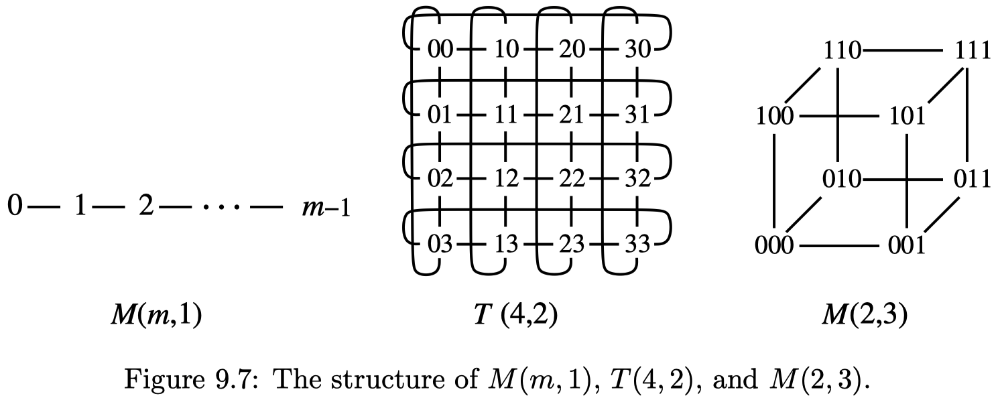
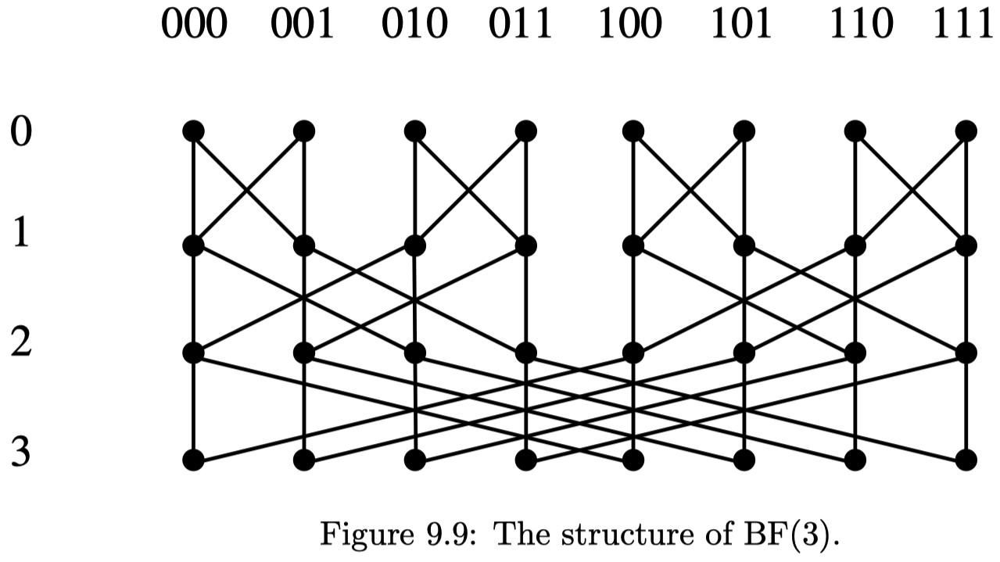
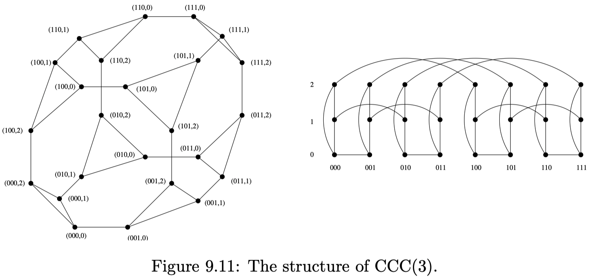
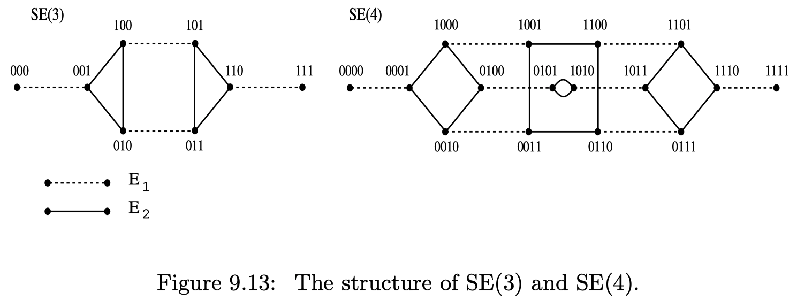
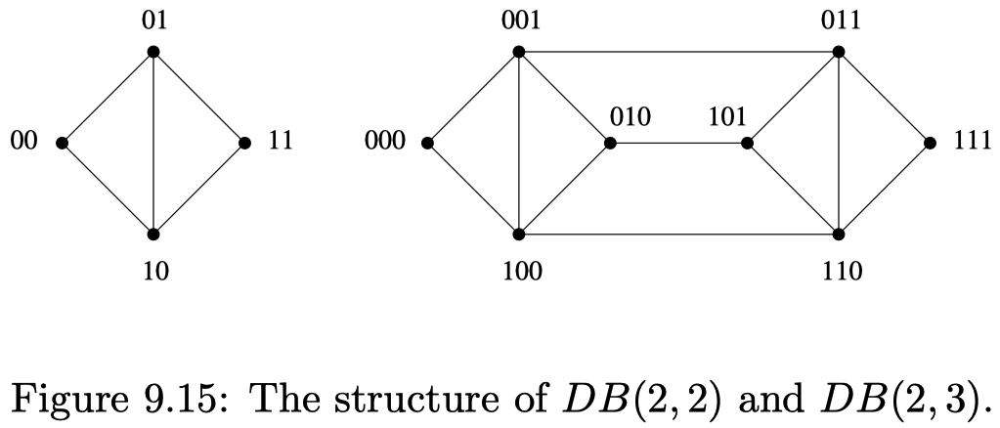

# Chapter 1 : Introduction

**Computer Systems** is the field of computer science that studies the design, implementation, and behavior of real, complete systems of hardware and software.

# Chapter 2 : Naming

## 2.1 Basic definitions

A **name** is an identifier used to refer to an object in a system. It might be a character string, or a string of bits - in principle any concrete value. A **binding** is an association of a name to an object and a **context** is a particular set of bindings. We might also refer to a context as a *namespace* or *name scope*.

**Resolution** describes the process of, given a name and a context, finding the object to which the name is bound in that context.

> Remark: For a name to designate an object, it must be bound to the object in some context. In other words, whenever names are being used, there is always a context, even if it's implicit.

## 2.2 Naming networks

A **naming network** is a directed graph whose nodes are either naming contexts or objects, and whose arcs are bindings of names in one context to another context. A **pathname** is an ordered list of names, also referred to as *path components*, which therefore specify a path in the network.

A naming network which is a tree is called a **Naming hierarchy**. Pathnames in a naming hierarchy are sometimes called *tree names*. The unique starting point in a naming hierarchy is called the root.

*Example (UNIX name resolution):* A UNIX filename is a pathname. The UNIX file system is, for the most part, a naming hierarchy of directories which contain references to other directories of files:

- A UNIX filename which stats with `/`, such as `/usr/bin/dc`, is resolved using the root of the file system, i.e. all paths are bound to the current directory but `/` has an implicit binding to the root.
- A filename which doesn't start with a `/` is resolved using the current working directory as the first context.
- Every context (i.e. directory) in the UNIX file system has a binding of the name `.` to the context itself.
- Each context also has a binding of the name `..`. This is always bound to the parent directory of the context.
- A **file** object can have *more than one name bound to it*, but a **directory** *cannot*.

## 2.3 Indirect entries and symbolic links

An **indirect entry** is a name which is bound not to an object per se, but instead to another path name.

> Remark: Indirect entries can complicate name resolution since there is no guarantee that the binding will end up at an object at all, or if the name to which the indirect entry is bound is even syntactically valid in the context in which it is to be resolved.

## 2.4 Pure names and addresses

A **pure name** encodes no useful information about whatever object it refers to.

> Remark: The names we have considered so far are arguably pure names - in particular, the only thing we have done with them is to bind them to an object in a context, and look them up in a context to get the object again. Some people use the word *identifier* to mean a pure name.

An **address** is a name which encodes some information about the location of the object it refers to.

> Remark: An IP address is not a pure name, since it can be used to route a packet to the corresponding network interface without you needing to know anything more about the interface.

## 2.5 Search paths

A **search path** is an ordered list of contexts which are treated as a single context. To look up a name in such a context, each constituent context is tried in turn until a binding for the name is found.

> Remark: The UNIX shell `PATH` variable, for example:
> `/home/ruben/bin:/usr/bin:/bin:/sbin:/usr/sbin:/etc`
> - is a search path context for resolving command names: each directory in the search path is tried in turn to look for a command.

## 2.6 Synonyms and Homonyms

**Synonyms** are different names that ultimately resolve to the same object. **Homonyms** are bindings of the same name to different objects.

> Remark: The existence of synonyms turns a naming hierarchy into a directed, possibly cyclic, graph. For this reason, the UNIX file system disallows most cycles by preventing directories from having synonyms except for `.` and `..` - *only files can have multiple names.*

# Chapter 3 : Classical Operating Systems and the Kernel

## 3.1 The role of the OS

The **operating system** for a unit of computing hardware is that part of the software running on the machine which fulfills three particular roles:

- As a **Referee**, the OS multiplexes the hardware of the machine among different principals (users, programs, etc.), and protects these principals from each other.
- As an **Illusionist**, the OS provides the illusion of *real* hardware resources to resource principals through *virtualization*.
- As a **Glue**, the OS provides abstractions to tie different resources together, and hides details of the hardware to allow programs portability across different platforms.

## 3.2 Domains

A **domain** is a collection of resources or principals which can be traded as a single uniform unit with respect to some particular property. Some examples are:

- *NUMA domain:* cores sharing a group of memory controllers in a NUMA system.
- *Coherence domain:* caches which maintain coherence between themselves.
- *Failure domain:* the collection of computing resources which are assumed to fail together.
- *Shared memory domain:* cores which share the same physical address space.
- *Administrative domain:* resources which are all managed by a single central authority or organization.
- *Trust domain:* a collection of resources which mutually trust each other.
- *Protection domain:* the set of objects which are all accessible to a particular security principal.
- *Scheduling domain:* set of processes or threads which are scheduled as a single unit.

## 3.3 OS components

The **kernel** is that part of an OS which executes in privileged mode.

- While most computer systems have a kernel, very small embedded systems do not.
- The kernel is just a computer program, typically an *event driven server*. It responds to multiple entry points: *system calls, hardware interrupts, and program traps.*

**System libraries** are libraries which are there to support all programs running on the system, performing either common low-level functions or providing a clean interface to the kernel and daemons.

A **daemon** is a user-space process running as part of the operating system.

- Daemons are different from in-kernel threads. They execute OS functionality that can't be in a library, but is better off outside the kernel (for reasons of modularity, fault tolerance, and ease of scheduling).

## 3.4 Operating System models

A **monolithic kernel**-based OS implements most of the operating systems functionality inside the kernel.

- It can be efficient, since almost all the functionality runs in a single, privileged address space.
- Containing faults in a monolithic kernel is hard. This results in reduced reliability.

A **microkernel**-based OS implements minimal functionality in the kernel, typically only memory protection, context switching, and inter-process communication. All other OS functionality is moved out into user-space server processes.

- The motivation for microkernels is to make the OS more robust to bugs and failures, since dependencies between components are in theory more controlled.
- Microkernels can be slower since more kernel-mode transitions are needed to achieve any particular result, increasing overhead. However, the very small size of microkernels can actually improve performance due to much better cache locality.

An **exokernel**-based system moves as much functionality as possible out off the kernel into the system libraries linked into each application.

- Moving OS functionality into application-linked libraries is, at first sight, an odd idea, but greatly simplifies reasoning about security in the system and providing performance guarantees to applications which also need to invoke OS functionality.

A **multikernel**-based system targets multiprocessor machines, and runs different kernels on different cores in the system.

- Multikernels are a relatively new idea.
- The key characteristic is that the kernels themselves do not share memory or state, but communicate via messages.

## 3.5 Bootstrap

**Bootstrapping**, or more commonly these days simply **booting**, is the process of starting the operating system when the machine is powered on or reset up to the point where it is running regular processes.


The *boot sequence steps* are as follows:

1. When a processor is powered on, it starts executing instructions at a fixed address in memory.
2. The *Basic Input/Output System* (**BIOS**) starts initializing the hardware.
3. The BIOS sets up a standard execution environment for the next program to run such that it does not need to know specifics of the system.
4. The next program is typically the **bootloader**, and its job is to find the operating system kernel itself, load it into memory, and start executing it.
5. The OS kernel itself, once it is entered, initializes its own data structures and creates the first processes. Finally, it starts this new process executing, and the system is now in regular steady state.

## 3.6 Entering and leaving the kernel

**Mode transfer** is the process of software execution transitioning between different hardware processor modes and one of the *most important pieces of modern OSes*.

> Remarks:
> - This typically involves switching between user mode and kernel mode.
> - The key goal of user to kernel mode transfer is to protect the kernel from malicious or buggy user processes.
> - The kernel is entered from user space as a result of processor exception: either a synchronous trap or an asynchronous fault.

A **system call** is a trap (synchronous exception) deliberately invoked by a user program to request a service from the kernel. A system call is defined as taking arguments and returning values.

*Example*: Consider the `write()` system call in Unix. `write()` has the following functional prototype:

```c
ssize_t write(int fd, const void *buf, size_t count);
```

Such a call would be implemented as follows:

```algo
# Procedure in user space
1: Load fd, buf, and count into processor register
2: Load system call number for write into a register
3: Trap
4: Read result from register
5: return Result

# Execution in the kernel (the trap handler)
6: Set up execution environment (stack etc.)
7: Read system call number from register
8: Jump to write code based on this
9: Read fd, buf, and count from processor register
10: Check buf and count for validity
11: Copy count bytes from user memory into kernel buffer
12: Do the rest of the code for write
13: Load the return value into a register
14: Resume the calling process, transfer to user mode
```

# Chapter 4 : Processes

The **process** is a fundamental concept in operating systems. In this chapter, we look at what a process is, the concept of an execution environment, how processes are created and destroyed, and how they interact with threads.

## 4.1 Basic definitions

A **process** is the execution of a program on a computer with restricted rights.

- A process can be though of as an *instance* of a program
- A process combines execution, running the program, and protection
- A process is a resource principal: In terms of implementation, a process bundles a set of hardware and software resources together

## 4.2 Execution environment

The **execution environment** of a process is the virtual platform on which it executes: the virtual address space, available system calls, etc.

- The execution environment of the kernel is purely defined by the machine hardware
- A process can be thought of as a *virtual machine* for executing the user's program
- The process's *virtual processor* doesn't have a simple relationship to the real processors that the OS kernel is managing

## 4.3 Process creation

When a process creates (via the OS) another new process, the creating process is called the **parent** and the newly created process the **child**. This creates a **process tree**: every process in the system has a parent (except the root of the tree).

An OS **spawns** a child process by creating it from scratch in a single operation, with a program specified by the parent.

- Unless you're familiar with `fork()`, this is the obvious way to create a process.
- Windows creates processes by spawning using the `CreateProcess()` system call.

In Unix, a `fork` operation creates a new child process as an exact copy of the calling parent. An `exec` operation replaces the contents of the calling process with a new program, specified as a set of command-line arguments.

- `exec()` does *not* create a new process, instead it is the complement to `fork()` -- without it, you could not run any new programs
- `exec()` never returns (except if it fails), instead the new program starts where you might expect `main()`

The **initial process**, often called `init`, is the first process to run as a program when a machine boots.

## 4.4 Process life cycle

Each process is said to be in one of a set of states at any point in time. **Running** processes are actually executing code, either in kernel mode or in user space. **Runnable** (also called *waiting* or *ready*) processes can execute, but are not currently doing so. **Blocked** (also called *asleep*) processes are waiting for an event to occur before they can run.

*Example*: The figure below shows a slightly simplified process state machine for Unix.

{width=50%}

A process which exits is generally not removed completely from the system, but enters a state between being alive and being deleted from the OS. A process in this state is a **zombie**. A process which is alive, but whose parent has exited, is an **orphan**.

## 4.5 Coroutines

A **coroutine** is a generalization of the concept of a subroutine. A coroutine can be entered at multiple times, at multiple points, and return multiple times. Programming with coroutines is sometimes referred to as **cooperative multitasking**.

## 4.6 Threads

**User threads** are implemented entirely within a user process. They are sometimes known as *lightweight processes*, but this latter term is a bit ambiguous.

**Kernel threads** are implemented by the OS kernel directly, and appear as different virtual processors to the user process.

# Chapter 5 : Inter-process communication

## 5.1 Hardware support for synchronization

The most basic hardware mechanism to an OS for synchronizing threads is to disable interrupts:

```pseudo
# Algorithm 5.1: Protecting a critical section by disabling interrupts
1: Disable all interrupts and traps
2: Access state in a critical section
3: Enable interrupts
```

### 5.1.1 Shared-memory synchronization instructions

```c
# Algorithm 5.2: Test-And-Set
inputs:
    p {Pointer to a word in memory}
outputs:
    v {Flag indicating if the test was successful}
do atomically:
    v <- *p
    *p <- 1
end do atomically
return v
```

```c
# Algorithm 5.3: Compare-and-Swap
inputs:
    p {Pointer to a word in memory}
    v1 {Comparison value}
    v2 {New value}
outputs:
    {Original value}
do atomically:
    if *p = v1 then:
        *p <- v2
        return v1
    else
        return *p
    end if
end do atomically
```

*Remark*: CAS is strictly more powerful than TAS. You can show that any other atomic operation can be efficiently simulated with CAS, though not with TAS.

### 5.1.2 Hardware Transactional Memory

**Transactional Memory** is a programming model whereby loads and stores on a particular thread can be grouped into transactions. The **read set** and **write set** of a transaction are the set of addresses read from and written to respectively. A **data conflict** occurs in a transaction if another processor reads or writes a value from the transaction's write set, or write to an address in the transaction's read set.

*Remarks*:

- HTM us usually implemented using the cache coherency protocol to make lines in the cache as part of the read and write sets. Conflict detection is therefore actually done at the granularity of entire cache lines rather than just words.
- There is a limit to the size of read and write sets that can be checked (such as the L1 cache). If this limit is exceeded, the transaction aborts and should not be retried, since it's always going to abort.

## 5.2 Shared-memory synchronization models

We'll assume you're already familiar with semaphores (and `P`, `V` operations), mutexes (Acquire, Release), condition variables (Wait, Signal/Notify, Broadcast/NotifyAll), and monitors (Enter, Exit).

A **spinlock** is a multiprocessor mutual exclusion primitive based on one processor spinning on a memory location written by another.

```c
# Algorithm 5.8: TAS-based spinlock
inputs:
    p is the address of a word in memory
    
# Acquire the lock
repeat:
    v <- TAS(*p)
until v = 0
# ...
# Release the lock
*p <- 0
```

The **spin-block** problem is to come up with a strategy for how long a thread should spin waiting to acquire a lock before giving up and blocking, given particular values for the cost of blocking, and the probability distribution of lock hold times.

In the absence of any other information about the lock hold time, spinning for a time equal to the cost of a context switch results in overhead at most twice that of the optimal offline algorithm (which has perfect knowledge about the future).

## 5.3 Messages: IPC without shared memory

The alternative to communication using shared data structures protected by thread synchronization primitives is to send messages instead. You have already seen this in networking using sockets.

In **asynchronous** or **buffered IPC** the sender does not block, but the send operation instead returns immediately. The receiving process is not waiting for the message, the message is buffered until the receive call is made. On the receive side, the receive call blocks if no message is available.

In contrast, in a **synchronous** or **unbuffered IPC** system, both sender and receiver may block until both are ready to exchange data.

*Remarks*:

- Asynchronous IPC implies a buffer to hold messages which have been sent but not yet received. If this buffer becomes full, it's not clear what to do.
- Synchronous IPC, on the other hand, requires no buffering, merely two threads synchronizing in the OS kernel.

**Pipes** are the more fundamental IPC mechanism in Unix, and are closely related to `fork()`. One might reasonably claim that Unix *is* any OS based on `fork()` and `pipe()`.

A **pipe** is a unidirectional, buffered communication channel between two processes, created by:

```c
int pipe(int pipefd[2])
```

Each end is identified by a file descriptor, returned by reference in the array `pipefd`. One sets up a pipe between two processes by creating the pipe, then forking the other processes.

### 5.4 Upcalls

An **upcall** is an invocation by the operating system of a function inside a user process. The called function in the user program is called the *entry point*, or the *upcall handler*.

## 5.5 Client-Server and RPC

In the **client-server** paradigm of distributed computing, a *server* offers a service to potentially multiple *clients*, who connect to it to invoke the service.

**Remote Procedure Call** or **RPC** is a programming technique whereby remote client-server interactions are made to look to the programmer of both the client and the server as simple procedure calls: the client program calls the server using a simple procedure call, and the server program implements the service purely as a procedure with the appropriate name.

How this works is as follows: The **signature** of the remote procedure is fed into a **stub compiler**, which outputs two chunks of code that go into libraries. The first is the **client stub** (or *proxy*) which implements the client side procedure: this takes its arguments, *marshals* them into a buffer, sends the buffer to the server, and waits for a message in reply. When this comes back, it *unmarshals* the return values from the call, and returns to the client program. The second is the **server stub**, which performs the corresponding actions on the server side: wait for a message, unmarshal the arguments, call the server code with the arguments, marshal the return values into a buffer, and send it back to the client.

An **interface Definition Language** or **IDL** is a small, domain-specific language for writing RPC interface definitions.

## 5.6 Distributed objects

A **name server** is a service which holds the addresses of the RPC services. The data that the name server stores and hands out for a service is sometimes called an **interface reference**.

To contact an RPC service, a client has to acquire an interface reference from the service, and then **establish a binding** to the service. Binding can be **explicit**, in which case the client has to call some kind of "bind" or "connect" procedure to establish it. However, **implicit** binding is also possible: as part of unmarshalling an interface reference, the binding is established immediately and an invocation reference returned to the client.

A **distributed object system** is an RPC system with implicit binding where interface references are viewed as object references, and the IDL defines classes of which services are instances.

A local datastructure called the **object table** holds a mapping from interface references to invocation references, so that when an interface reference arrives, only a single client stub is created.

# Chapter 6: CPU Scheduling

In general, *scheduling* is deciding how to allocate a single temporal resource among multiple clients, in what order, and for how long. CPU scheduling involves deciding which task to run next on a given CPU, how long to run it for, and which CPU a given task should run on.

**Scheduling** is the problem of deciding, at any point in time, which process or thread on ever core in a system is currently executing.

**Dispatching** refers to the mechanism for (re)starting a particular process or thread running on a particular core.

## 6.1 Non-preemptive Uniprocessor Batch-oriented Scheduling

**Uniprocessor scheduling** is the problem of scheduling tasks on a single processor core (or, more precisely, hardware execution context).

A **batch workload** consists of a set of _batch jobs,_ each of which runs for a finite length of time and then terminates. _Batch scheduling_ is the problem of scheduling a set of batch jobs, which appear according to some arrival process.

A **non-preemptive** scheduler always allows a job to run to completion once it has started.

### 6.1.1 Batch Scheduling Terminology

{width=50%}

- _Arrival time:_ (or request time, or release time) The point, at which a job enters the scheduling system.
- _Start time:_ The point in time at which a job starts executing.
- _End time:_ (or completion time) The point in time at which a job terminates.
- _Execution time:_ (or runtime) The number of seconds it takes to complete from its start time.
- _Hold time:_ The time taken to start executing a job from the point where it arrives.
- _Wait time:_ (or turnaround time) The time it takes to finish the job from the point where it entered the system.

### 6.1.2 Batch Scheduling Metrics

The **throughput** of a batch scheduler is the number of jobs the scheduler completes per unit time. The **overhead** of a scheduler is the proportion of CPU time spend running the scheduler itself, as opposed to a client job. Overhead consists of the _context switch time_ plus the _scheduling cost._

_Example:_ Suppose the scheduling cost plus context switch time is 1ms, and each job runs for 4ms. The overhead is therefore $\frac{1}{(4+1)} = 20 \%$.

```pseudo
# Algorithm 6.16: First-come-first-served (FCFS) scheduling
1: Assume each job P_i arrives at time t_i
    # When the scheduler is entered:
2: Dispatch the job P_j with the earliest arrival time t_j
```

The **convoy phenomenon** occurs in FIFO schedulers when many short processes back up behind long-running processes, greatly inflating mean wait times.

```pseudo
# Algorithm 6.19: Shortes-Job First (SJF) scheduling
1: Assume each job P_j has an execution time of t_j seconds
    # When the scheduler is entered:
2: Dispatch the job P_j with the shortes execution time t_j
```

> **Theorem:** _Shortest-job first_ is optimal in the sense that it minimizes the average (mean) waiting time for all jobs in the system, at least for the case when all jobs have the same release time.

## 6.2 Uniprocessor Preemptive Batch Scheduling

A scheduler which can interrupt a running job and switch to another one is **preemptive.**

```pseudo
# Algorithm 6.22: SJF with preemption
    # When a new job enters the system or the running job terminates:
1: Preempt and suspend the currently running job
2: Dispatch the job P_j with the shortes execution time
```

## 6.3 Uniprocessor Interactive Scheduling

In contrast to batch-oriented job scheduling, an **interactive workload** consists of long-running processes most of which are blocked waiting for an external event, such as user-input.

The **response time** of an interactive program is the time taken to respond to a request for service.

> _Remark:_ The response time is different from wait time: it refers to long-running processes which handle a sequence of external requests. Examples include a game responding to user control, a word processor responding to typing, etc.

```pseudo
# Algorithm 6.25: Round-robin (RR) scheduling
1: Let R be the double-ended queue of runnable processes
2: Let q be the scheduling quantum (a fixed time period)
    # When the scheduler is entered
3: Push the previously-running job on the tail of R
4: Set an interval timer for an interrupt q seconds in the future
5: Dispatch the job at the head of R
```

_Example:_ Suppose we have 50 processes, the process switch time is $10 \mu s$, and the scheduling quantum is $100 \mu s$. This leads to a scheduling overhead of about $9 \%$, but an average response time of $49 \cdot \frac{110}{2} = 2695 \mu s$. Alternatively, if we increase the quantum to $1000 \mu s$, the overhead is reduced to $0.99 \%$, but average response time increases to $49 \cdot \frac{1010}{2} = 24745 \mu s$.

### 6.3.1 Priority-based Scheduling

**Priority-based scheduling** is a broad class of scheduling algorithms in which each process is assigned a numeric priority, and the scheduler always dispatches the highest priority runnable task. A _strict priority scheduling_ algorithm is one where these priorities do not change.

Strict priority scheduling can lead to **starvation:** low-priority processes may be starved by high-priority ones which remain runnable and do not block. For this reason, strict priority systems are rare. Instead, most priority-based schedulers are not strict but **dynamic:** the priorities of tasks change over time in response to system event and application behavior. **Aging** is one solution to starvation: tasks which have waited a long time are gradually increased in priority.

In practice, priority-based schedulers are based on **multi-level queues:** there are a finite number of priorities, and each has a queue of processes at that priority. Priority levels are grouped into classes; queues in different classes are scheduled differently.

_Priority inversion_ occurs when a low-priority $P_l$ process holding a lock $R$ is preempted by a high-priority process $P_h$, which attempts to acquire $R$. If when $P_h$ blocks, a runnable medium-priority process $P_m$ gets to run, this inverts the effect of priority in the schedule.

Classically, there are two approaches to dealing with priority inversion:

- In a system with **priority inheritance,** a process holding a lock temporarily acquires the priority of the highest-priority process waiting for the lock until it releases the lock. This comes at some cost: the scheduler must now be involved in every lock acquire/release. This increases runtime overhead.
- In a system with **priority ceiling,** a process holding a lock runs at the priority of the highest-priority process which can ever hold the lock, until it releases the lock. Priority ceiling incurs much less runtime overhead than priority inheritance, but potentially requires static analysis of the entire system to work.

A **hierarchical scheduler** is a further generalization of multi-level queues: queues are instead organized in a nested hierarchy or tree of _scheduling domains._ Within each domain, sub-nodes are scheduled according to a potentially different policy. A **multilevel feedback queue scheduler** is a class of multi-level queue which aims to deliver good response for interactive jobs plus good throughput for background tasks. The key idea is to penalize CPU-bounds tasks in favor of I/O bound tasks.

## 6.4 Real-time Scheduling

An application is **hard real-time** if its correctness depends on not only on the I/O actions it performs, but also the time it takes to execute. Hard real-time task correctness is often expressed in terms of _deadlines:_ each task has a specific point in time by which it must have completed in order to be correct.

> Remarks: For hard-real time systems, the following holds:
>
> - In the general case, hard-real time scheduling is impossible: tasks can appear at any time, with any deadlines.
> - If the task set is not known in advance, the system must reject tasks for which no feasible schedule is possible, a process called admission control.

**Rate-monotonic scheduling (RMS)** schedules periodic tasks by always running the task with the shortest period first. Suppose there are $m$ (periodic) tasks, each task $i$ has execution time $C_i$ and period $P_i$. Then RMS will find a feasible schedule if:

$$
\sum_{i = 1}^n \frac{C_i}{P_i} \leq n(2^{\frac{1}{n}}-1)
$$

RM is one of the two classic real-time schedulers: it is extremely efficient provided that tasks are periodic, and the full workload is known in advance -- this is the case in many embedded control applications.

**Earliest deadline first (EDF)** scheduling sorts tasks by deadline and always runs the earliest deadline first. It is dynamic and online, and tasks are not necessarily periodic. EDF is guaranteed to find a feasible schedule if:

$$
\sum_{i = 1}^n \frac{C_i}{P_i} \leq 1,
$$

i.e. it can use $100 \%$ of a processor, if we ignore the overhead of scheduling and context switching. EDF is more complex (scheduling decisions can be $o(\log n)$ in the number of tasks). It is typically implemented by maintaining a priority queue of jobs sorted by deadline, often represented as a heap.

In contrast to hard real-time systems, a **soft real-time** task has timing requirements which are non-strict, but nevertheless affect the quality and utility of the result.

In contrast to conventional priority-based schedulers, a **reservation-based scheduling policy** guarantees a minimum number of CPU time units to each job.

## 6.5 Multiprocessor Scheduling

Fully general multiprocessor scheduling is NP-hard -- it tends to reduce to 2-dimensional bin-packing. The two-dimensionality comes from having to decide which core to run a given thread on as well as when to dispatch it on that core. We start with some simplifying assumptions:

- The system can always preempt a task.
- The scheduler is work-conserving.

A scheduler is **work-conserving** if no other processor is ever idle when there is a runnable task.

### 6.5.1 Sequential Programs on Multiprocessors

The simplest model for multiprocessor scheduling maintains a single system-wide run queue. Whenever an individual processor makes a scheduling decision, it picks a thread from the run queue to remove and dispatch.

To remove the bottleneck of a single run queue and improve cache locality of running processes, **affinity-based scheduling** tries to keep jobs on one core as much as possible. Each core has its own run queue, and jobs are periodically re-balanced between all the individual queues. This is much more efficient, but note that it is not work conserving anymore. A processor can end up with an empty run queue when other queues have jobs which are runnable, but not currently running.

A **work-stealing** scheduler allows once core which would otherwise be idle to "steal" runnable jobs from neighboring cores so as keep doing useful work.

# Chapter 7: Input / Output

Every OS has an **I/O subsystem,** which handles all interaction between the machine and the outside worlds. The I/O subsystem abstracts individual hardware devices to present a more or less uniform interface, provides a way to name I/O devices, schedules I/O operations and integrates them with the rest of the system, and contains the low-level code to interface with individual hardware devices.

To an OS programmer, a **device** is a piece of hardware visible from software. It typically occupies some location on a **bus** or I/O interconnect, and exposes a set of hardware **registers** which are either **memory mapped** or in **I/O space.** A device is also usually a source of **interrupts,** and many initiate **Direct Memory Access (DMA)** transfers.

The **device driver** for a particular device is the software in the OS which understands the specific register and descriptor formats, interrupt models, and internal state machines of a given device and abstracts this to the rest of the OS. The driver can be thought of as sitting between hardware and rest of the OS.

## 7.1 Devices and Data Transfer

A **device register** is a physical address location which is used for communicating with a device using reads and writes. A hardware register is not memory, but sits in the physical address space. There is no guarantee that reading from a device register will return the same value that was last written to it.

**Programmed I/O** consists of causing input/output to occur by writing data values to hardware registers from software, or reading values from hardware registers into CPU registers in software.

```pseudo
# Algorithm 7.6: Programmed I/O
1: inputs
2:  l: the number of words to read from input
3:  d: buffer of size l
4: d <- empty buffer
5: while length(d) < l do
6:  repeat
7:      s <- read from status register
8:  until s indicates data register
9:  d.append(w)
10: end while
11: return
```

An **interrupt** is a signal from a device to a CPU which causes the latter to take an exception and execute an **interrupt service routine (ISR),** also known as an **interrupt handler.**

Using **Direct Memory Access** or DMA, a device can be given a pointer to buffers in main memory and transfer data to and from those buffers without further involvement from the CPU. DMA is typically performed by the device. It saves bandwidth, since the data doesn't need to be copied to through the CPU's register.

## 7.2 Dealing With Asynchrony

Device drivers have to deal with the fundamentally **asynchronous** nature of I/O: the system must respond to unexpected I/O events, or to events which it knows are going to happen, but not when. Input data arrives without warning, and an input operation takes an unknown period of time.

The **First-level Interrupt Service Routine (FLISR)** is the code that executes immediately as a result of the interrupt.

Since I/O is for the most part interrupt-driven, but data is transferred to and from processes which perform explicit operations, data must be _buffered_ between the processes and the interrupt handler, and the two must somehow _rendezvous_ to exchange data. There are three canonical solutions to this problem: deferred procedure calls, driver threads, and non-blocking kernels.

A **deferred procedure call,** sometimes known as a _2nd-level interrupt handler,_ a _soft interrupt handler,_ or a _slow interrupt handler,_ is a program closure created by the 1st-level interrupt handler. It is run later by any convenient process, typically just before the kernel is exited. DPCs are extremely efficient, and a common solution to the rendezvous problem.

A **driver thread,** sometimes called and _interrupt handler thread,_ serves as an intermediary between interrupt service routines and processes. The thread starts blocked waiting for a signal either from the user process or the ISR. When an interrupt occurs or a user process issues a request, the thread is unblocked, and it performs whatever I/O processing is necessary before going back to sleep.

> Remarks: Driver threads are heavyweight: even if they only run in the kernel, they still require a stack and a context switch to and from them to perform any I/O requests. They are however conceptually simple, and can be understood more intuitively than DPCs.

The third alternative, used in microkernels and exokernels, is to have the FLISR convert the interrupt into a message to be sent to the driver process. This is conceptually similar to a DPC, but is even simpler: it simply directs the process to look at the device. However, it does require the FLISR to synthesize an IPC message, which might be expensive.

The part of the device driver code which executes either in the interrupt context or as a result of the interrupt is the **bottom half.** The part of a device driver which is called "from above", i.e. from a user or an OS process, is the **top half.**

## 7.3 Device Models

The **device model** of an OS is the set of key abstractions that define how devices are represented to the rest of the system by their individual drivers:

- A _character device_ in UNIX is used for "unstructured I/O", and presents a byte-stream interface with no block boundaries. Character devices are accessed by single byte or short string get/put operations. Examples include keyboards, mice, etc.
- A _network device_ in UNIX corresponds to a real or virtual network interface adapter. It is accessed through a rather different API to character and block devices.
- A _pseudo-device_ is a software service provided by the OS kernel which it is convenient to abstract as a device, even though it does not correspond to a physical piece of hardware.

_Example:_ UNIX systems have a variety of pseudo-devices, such as:

- `/dev/mem`: A character device corresponding to the entire main memory of the machine.
- `/dev/random`: Generates a random number when read from.
- `/dev/null`: Anything written is discarded, read always returns end-of-file.

In older UNIX systems, devices were named inside the kernel by a pair of bytes:

- The **major device number** identified the class of device (e.g. disk, CD-ROM, keyboard, etc.)
- The **minor device number** identified a specific device within a class.

In addition, a third "bit" determined whether the device was a character or block device.

Most modern OSes perform **device discovery:** the process of finding and enumerating all hardware devices in the system and storing metadata about them in some kind of queryable data store.

## 7.4 Device Configuration

In addition to simply discovering a device, and finding out how to access it, the OS often has to configure the device and other devices in order to make it work.

_Example:_ When a USB device (such as a USB thumb drive) is plugged in, a number of different devices are involved, at the very least:

- The USB drive itself.
- The USB _host bus adapter_ or HBA, which interfaces the USB device network to the rest of the computer.
- The USB _hub_ that the device was plugged into. This can easily not be a physically separate hub, but one integrated onto the motherboard or built into another device (such as the HBA).

Broadly speaking, when the device is plugged in, the HBA notifies the OS that something has been plugged in. The HBA driver then talks to the HBA to enumerate the devices attached to it, including the hubs - USB is organized approximately as a tree of devices where the non-leaf nodes are hubs. The HBA adapter then has to assign new bus and device identifiers to anything that has changed and reconfigure the HBA and switches. It also discovers the new device by finding out what it is - USB devices, like PCI devices, describe themselves with a 4-byte code.

**Interrupt routing** is the process of configuring _interrupt controllers_ in the system to ensure that when a device raises an interrupt, it is delivered to the correct vector on the correct core. Interrupt routing is one of the things that is getting much more complex overtime.  It is not unusual for a modern PC to have 4 or 5 interrupt controllers between a device and the CPU.

## 7.5 Naming Devices

One configured, an OS needs a way to refer to devices from user space. This is, of course, a naming problem, and it is important to understand what kind of problem.

On older versions of UNIX, where every device was identified by a `(major, minor)` pair of integers, devices were named using the file system by creating a special kind of file to represent each device, using the `mknod` command. As a preview, the major and minor device numbers were stored in the **inode,** meaning the "device file" took up very little space. Devices are traditionally grouped in the directory `/dev`. For example:

- `/dev/sda`: First SCSI/SATA/SAS disk
- `/dev/sda5`: Fifth partition on the above
- `/dev/cdrom0`: First DVD-ROM drive

## 7.6 Protection

Another function of the I/O subsystem is to perform protection:

- Ensuring that only authorized processes can directly access devices.
- Ensuring that only authorized processes can access the services offered by the device driver.
- Ensuring that a device cannot be configured to do something malicious to the rest of the system.

There are a number of mechanisms for achieving this. Putting device drivers in the kernel makes it easy to control access to the hardware, but you have to trust the device drivers to do the right thing since they are now part of the kernel. UNIX controls access to the drivers themselves by representing them as files, and thereby leveraging the protection model of the file system.

# Chapter 8: Memory Management and Virtual Memory

## 8.1 Segments

Before paging, there were segments. Segments evolved from basic protection mechanisms.

A **base and limit register pair** is a couple of hardware registers containing two addresses $B$ and $L$. A CPU access to an address $a$ is permitted IFF $B \leq a < L$.

A **relocation register** is an enhanced form of base register. All CPU accesses are relocated by adding the offset: a CPU access to an address $a$ is translated to $B + a$ and allowed IFF $B \leq B + a < L$.

> Remarks:
>
> - With relocation registers, each program can be compiled to run at the same address, e.g. `0x0000`.
> - Relocation registers don't allow sharing code and data between processes, since each process has a single region of memory.

A **segment** is a triple $(I, \, B_I, \, L_I)$ of values specifying a contiguous region of memory address space with base $B_I$, limit $L_I$, and an associated _segment identifier_ $I$ which names the segment. Memory in a segmented system uses a form of _logical addressing:_ each address is a pair $(I, \, O)$ of segment identifier and offset. A load or store to or from a logical address $(i, \, o)$ succeeds IFF $0 \leq o < L_i$ and the running process is authorized to access segment $i$. If it does succeed, it will access physical address $B_i + o$.

A **segment table** is an in-memory array of base and limit values $(B_i, \, L_i)$ indexed by segment identifier, and possibly with additional protection information. The _Memory Management Unit (MMU)_ in a segmentation system holds the location and size of this table in a **segment table base register (STBR)** and **segment table length register (STLR).** Logical memory accesses cause the MMU to look up the segment ID in this table to obtain the physical address and protection information.

> Remarks:
>
> - Segmentation is fast. As with pages, segment information can be cached in a TLB.
> - Sharing is trivially easy at a segment granularity.
> - The OS and hardware might have a single, system-wide segment table, or a per-process table.
> - The principal downside of segmentation is that segments are still contiguous in physical memory, which leads to external fragmentation.

Paging solves the external fragmentation problem associated with segments, at some cost in efficiency.

A paging system divides the physical address space into fixed-size regions called _frames_ or _physical pages,_ indexed by a **physical frame (or page) number (PFN),** the high bits of the address. The virtual address space is similarly divided into fixed-size regions called _virtual pages,_ identified by a **virtual page number (VPN),** the high bits of the virtual address. The MMU translates from virtual addresses to physical addresses by looking up the VPN in a **page table** to obtain a PFN. Page table entries (PTEs) also hold protection metadata for the virtual page, including validity information. Access via invalid PTE causes a _page fault_ processor exception. VPN-to-PFN translations are cached in a **Translation Lookaside Buffer (TLB).**

A **hierarchical page table** is organized in multiple layers, each one translating a different set of bits in the virtual address.

The process of translating a virtual address to physical address using a hierarchical page table is called a **page table walk.** Most MMUs have a _hardware table walker_ which is used on TLB-misses to find and load the appropriate page table entry into TLB, but others require the OS to provide a _software page table walker._

In practice, software in the operating system always has to map virtual to physical addresses:

- A software-loaded TLB simply has no hardware to walk the page table.
- In a case, when a page fault occurs, the OS needs to map the faulting (virtual) address to the relevant PTE, so that it can figure out what kind of fault occurred and also where to find a physical page to satisfy the fault. This requires a table walk.

To facilitate tracking the mappings between virtual and physical addresses, an OS typically divides an address space into a set of contiguous _virtual memory regions._

## 8.3 Segment Paging

It is possible to combine segmentation and paging: A **page segmentation** memory management scheme is one where memory is addresses by a pair `(segment_id, offset)`, as in a segmentation scheme, but each segment is itself composed of fixed-size pages whose page numbers are then translated to physical page numbers by a paged MMU.

## 8.4 Page Mapping Operations

Each process has its own page table. At high level, all operating systems provide three basic operations on page mappings, which in turn manipulate the page table for a given process:

A page **map** operation on an address space $A$

$$
A.map(v, \, p)
$$

takes a virtual page number $v$ and a physical page number $p$, and creates a mapping $v \to p$ in the address space.

A page **unmap** operation on an address space $A$:

$$
A.unmap(v)
$$

takes a virtual page number $v$ and removes any mapping from $v$ in the address space.

A page **protect** operation on an address space $A$:

$$
A.protect(v, \, rights)
$$

takes a virtual page number $v$ and changes the page protection on the page.

An MMU typically allows different protection rights on pages:

- `READABLE`: the process can read from the virtual address
- `WRITABLE`: the process can write to the virtual address
- `EXECUTABLE`: the process can fetch machine code instructions from the virtual address

## 8.5 Copy-On-Write

Recall that the `fork()` operation in UNIX makes a complete copy of the address space of the parent process, and that this might be an expensive operation.

To avoid allocating all the physical pages needed for a process at startup time, **on-demand page allocation** is used to allocate physical pages lazily when they are first touched.

```pseudo
# Algorithm 8.16: On-demand page allocation
inputs:
    A {An address space}
    {(v_i), i = 1...n} {A set of virtual pages in A}
    # Setup the region
for i = 1...n do:
    A.unmap(v_i) {Ensure al mappings in region are invalid}
end for
    # Page fault
inputs:
    v' {Faulting virtual address}
    n <- VPN(v')
    p <- AllocateNewPhysicalPage()
    A.map(v' -> p)
return
```

**Copy-on-write** or COW is a technique which optimizes the copying of large regions of virtual memory when the subsequent changes to either copy are expected to be small.

```pseudo
# Algorithm 8.18: Copy-On-Write
inputs:
    A_p {Parent address space}
    A_c {Child address space}
    {(v_i, p_i), i = 1...n} {A set of virtual to physical mappings in A_p}
    # Setup
for i = 1...n do:
    A_p.protect(v_i, READONLY)
    A_c.map(v_i -> p_i)
    A_c.protect(v_i, READONLY)
end for
    #Page fault in child
inputs:
    V {VAulting virtal address}
n <- VPN(V)
p' <- AllocateNewPhyiscalPAge()
CopyPageContent(p' <- p_n)
A_c.map(v_n -> p')
A_p.protect(v_n, WRITABLE)
return
```

## 8.6 Managing Caches

Before looking at why and how the OS needs to manage the processor caches, let's go through the operations it can use from software on a cache:

- An **invalidate** operation on a cache (or cache line) marks the contents of the cache (or line) as invalid, effectively discarding the data.
- A **clean** operation on a cache writes any dirty data held in the cache to memory.
- A **flush** operation writes back any dirty data from the cache and then invalidates the line (or the whole cache).

### 8.6.1 Homonyms and Synonyms

**Synonyms** are different cache entries (virtual addresses) that refer to the same physical addresses. Synonyms can result in cache _aliasing,_ where the same data appears in several copies in the cache at the same time. Synonyms case problems because an update to one copy in the cache will not necessarily update others, leaving the view of physical memory inconsistent.

In contrast, cache **homonyms** are multiple physical addresses referred to using the same virtual address (for example, in different address spaces). Homonyms are a problem since the cache tag may not uniquely identify cache data, leading to the cache accessing the wrong data.

### 8.6.2 Cache Types

These days, almost all processor caches are write-back, write-allocate, and set-associative. The main differences are to do with where the tag and index bits come from during a lookup.

- A _virtually-indexed, virtually-tagged_ or _VIVT_ cache is one where the virtual address of the access determines both the cache index and cache tag to lookup. VIVT caches are simple to implement, and fast. However, they suffer from homonyms. The problem can be alleviated by allowing cache entries to be annotated with "address space tags".

**Address-space tags** or _ASIDs_ are small additional cache or TLB tags which match different processes or address spaces and therefore allow multiple contexts in a cache or TLB at the same time.

- A _physically-indexed, physically-tagged_ or _PIPT_ cache is one where the physical address after TLB translation determines the cache index and tag. PIPT caches are easier to manage, since nothing needs to change on a context switch, and they do not suffer from homonyms or synonyms. The downside is that they are slow: you can only start to access a PIPT cache after the TLB has translated the address.
- A _virtually-indexed, physically-tagged_ or _VIPT_ cache is one where the virtual address before TLB translation determines the cache index, but the physical address after translation gives the tag. VIPT caches are a great choice for L1 D-caches these days, if they can be made to work.
- A _physically-indexed, virtually-tagged_ or _PIVT_ cache is one where the physical address after TLB translation determines the cache index to look up, but the virtual address before translation supplies the tag to then look up in the set. It is hard to imagine anyone building such a cache, and even harder to figure out why, but they do exist.

## 8.7 Managing The TLB

The **TLB coverage** of a processor is the total number of bytes of virtual address space which can be translated by a TLB at a given point in time. Modern processors are quite complex, with multiple TLBs: primary and secondary TLBs (as with L1 and L2 caches), separate TLBs for instructions and data, and even different TLBs for different page sizes.

**TLB shootdown** on a multiprocessor is the process of ensuring that no out-of-date virtual-to-physical translations are held in any TLB in the system following a change to a page table. Since the TLB is a cache, it should be coherent with other TLBs in the system, and with each process' page tables. Shootdown is basically a way to invalidate certain mappings in every TLB, if they refer to the affected process.

# Chapter 9: Demand Paging

## 9.1 Basic Mechanism

**Demand paging** uses page faults to exchange virtual pages on demand between physical pages in main memory, and locations on a larger _page file_ held on cheaper persistent storage. This is the traditional use of virtual memory: making a small main memory plus a large disk look like a large main memory. Demand paging is _lazy:_ it only loads a page into memory when a virtual address in the page has been touched by the processor -- a demand pager was sometimes called a lazy swapper for this reason.

The process works roughly as follows:

```pseudo
# Algorithm 9.2: Demand paging: page fault handling
    # On a page fault with faulting VPN v_fault:
1:  if there are free physical pages then:
2:      p <- get_new_pfn()
3:  else:
4:      p <- get_victim_pfn()
5:      v_old <- VPN mapped to p
6:      invalidate all TLB entries and page table mappings to p
7:      if p is dirty (modified) then:
8:          write contents of p into v_old's area in storage
9:      end if
10: end if
11: read page v_fault in from disk into physical page p
12: install mapping from v_fault to p
13: return
```

## 9.2 Paging Performance

The performance of a demand paging systems is critically dependent on how many page faults are generated for a workload. The goal is to minimize these page faults. The critical part of Algorithm 9.2 for performance is what happens in `get_victim_pfn()`, in other word what the _page replacement algorithm_ is.

The **page replacement policy** of a demand paging systems is the algorithm which determines which physical page (the _victim page_) will be used when paging a virtual page in from storage.

The average time taken to access memory, over all memory references in a program, is the **Effective Access Time.** Consider a page fault rate $p$, $0 \leq p \leq 1.0$. If $p = 0$, we have no page faults. Similarly, if $p = 1$, then every memory reference causes a page fault. Then, the Effective Access Time is given by:

$$
EAT = ((1-p) \times m) + (p \times (o + m)),
$$

where $m$ is the memory access latency, and $o$ is the paging overhead.

_Example:_ Suppose $m = 50ns$, and on average $o$ is $4ms$. Then the EAT in nanoseconds is $(((1p) \times 50) + (p \times 4'000'050))$. If only one access in 1'000 causes a page fault, i.e. $p = 0.01$, then $EAT = 4 \mu s$, and we have a slowdown over main memory of a factor of 80.

A **reference string** is a trace of page-level memory accesses. A given page replacement algorithm can be evaluated relative to a given reference string.

## 9.3 Page Replacement Policies

```pseudo
# Algorithm 97: Optimal page replacement
    # When a victim page is required
1: return the virtual page that will not be referenced again for the longest period of time
```

This algorithm is optimal, in that it minimizes the number of page faults for any given reference string. However, it requires knowing the reference string in advance, which is generally not case.

The following algorithm requires no knowledge at all about the reference string:

```pseudo
# Algorithm 9.8: FIFO page replacement
    # Return a new victim page on a page fault
1: inputs:
2:  pq: a FIFO queue of all used PFNs in the system
3: p <- pq.pop-head()
4: pq.push_tail(p)
5: return p
```

**Bélády's Anomaly** is the behavior exhibited by some replacement algorithms in caching systems (notably demand paging), where increasing the size of the cache actually reduces the hit rate for some reference strings.

_Example:_ FIFO page replacement exhibits Bélády's Anomaly. Consider the following reference string:

$$
1 \, 2 \, 3 \, 4 \, 1 \, 2 \, 5 \, 1 \, 2 \, 3 \, 4 \, 5
$$

In a machine with 3 physical pages available, this reference string will result in 9 page faults. With 4 physical pages available, the result is 10-page faults.

```pseudo
# Algorithm 9.11: A Least Recently Used (LRU) page replacement implementation
    # Initialization
1: inputs:
2:  S: stack of all physical pages p_i, 0 <= i <= N
3: for all p_i do:
4:  p_i.referenced <- False
5:  S.push(p_i)
6: end for
    # When a page p_r is referenced
7: S.remove(p_r)
8: S.push(p_r)
    # When a victim page is needed
9: return S.remove_from_bottom()
```

LRU is hard to beat performance wise. It can easily be implemented using a stack, as shown above. No stack-based algorithm exhibits Bélády's Anomaly.

```pseudo
# Algorithm 9.12: 2nd-chance page replacement using reference bits
    # Initialization
1:  inputs
2:      F: FIFO queue of all phyiscal pages p_i, o <= i <= N
3:  for all p_i do:
4:      p_i.referenced <- False
5:      F.add_to_tail(p_i)
6:  end for
    # When a physical page p_r is referenced
7:  p_r.referenced <- True
    # When a victim page is needed
8:  repeat:
9:      p_h <- F.remove_from_head()
10:     if p_h.referenced = True then:
11:         p_h.referenced <- False
12:         F.add_to_tail(p_h)
13:     end if
14: until p_h.referenced = False
15: return p_h
```
This algorithm is called "2nd-chance" because each referenced virtual page gets a "second chance" before being evicted.

On x86 machines, the MMU hardware provides a "referenced" bit, in addition to a dirty bit, inside the PTE. On ARM machines, this is not the case. The workaround for lack of hardware reference bits is to mark the virtual page invalid at the point where one would otherwise clear the reference bit. The next time the virtual page is referenced, the OS will take a trap on the reference, and set the bit in software before making the page valid and continuing.

```pseudo
# Algorithm 9.13: "Clock" page replacement using reference bits
    # Initialization
1:  for all physical pages p_i, 0 <= i <= N do:
2:      p_i.referenced <- False
3:  end for
4:  Next physical page number n <- 0
    # When physical page p_r is referenced
5:  p_r.referenced <- True
    # When a victim page is needed
6:  while p_n.referenced = True do:
7:      p_n.referenced = False
8:      n <- (n + 1) mod N
9:  end while
10: return p_n
```

This classic clock algorithm is the basis for most modern page replacement policies when detailed reference information is not available. The term "clock" algorithm comes from the visual image of a clock hand (the next pointer `n`) sweeping round through the memory, clearing the referenced bits.

## 9.4 Allocating Physical Pages Between Processes

In **global physical page allocation,** the OS selects a replacement physical page from the set of all such pages in the system. However, this doesn't quite work: each process needs to have some minimum number of physical pages in order to be runnable at all.

Instead, with **local physical page allocation,** a replacement physical page is allocated from the set of physical pages currently held by the faulting process.

The **working set** $W(t, \, \tau)$ of a process at time $t$ is the set of virtual pages referenced by the process during the previous time interval $(t-\tau, \, t)$. The _working set size_ $w(t, \, \tau)$ of a process at time $t$ is the amount $|W(t, \, \tau)|$. The working set size of a process is usually a good approximation to how many pages of physical memory a process needs to avoid excessively paging pages to and from storage.

The standard approach uses sampling at an interval $\sigma = \tau / K$, where $K$ is an integer. For each page table entry, we keep a hardware-provided "accessed" bit $u_0$ and $K-1$ software-maintained "use bits" $u_i, \, 0 < i < K$.

```pseudo
# Algorithm 9.17: Estimating the working set by sampling
    # On an interval timer every sigma time unites
1:  WS <- {}
2:  for all page table entries do:
3:      for all use bits u_i, 0 < i < K do:
4:          u_i <- u_i-1 {Shift all use bits right}
5:      end for
6:      u_0 <- 0
7:      U <- {Logical-or all the use bits together}
8:      if U = 1 then:
9:          WS.add(page)
10:     end if
11: end for
12: return WS {The working set W(t, sigma K)}
```

A paging system is **thrashing** when the total working set significantly exceeds the available physical memory, resulting in almost all application memory accesses triggering a page fault. Performance falls to near zero. Working set estimation provides a basis for how many physical pages to ideally allocate to each process.

Nevertheless, this concept of _virtualization,_ which we will see later in other forms, is fundamental to computer science, and is possibly unique to computers. The thing that makes a computer special is its ability to virtualize itself.

The **Filing System** is the functionality in an operating system which provides the abstractions of files in some system-wide namespace.

> Remarks:
>
> - The filing system virtualizes the collection of stable storage devices in the system, in the same way that the virtual memory system virtualizes main memory.
> - As with any other virtualization function, this is a combination of _multiplexing_ (sharing the storage between applications and users), _abstraction_ (making the device appear as a more convenient collection of files with consistency properties), and _emulation_ (creating this illusion over an arbitrary set of storage devices).

## 10.1 Access Control

A security **principal** or subject is the entity to which particular access _rights_ are ascribed, which grant the ability to access particular objects.

_Example:_ In a file system, for example, the principals can be system users, objects are files, and rights include `read`, `write`, `execute`, etc.

The **protection domain** of a principal is the complete set of objects that the principal has some rights over. The **access control matrix** is a table whose rows correspond to principals, and whose columns correspond to objects. Each element of the matrix is a list of the rights that the corresponding principal has over the corresponding object.

An **access control list (ACL)** is a compact list of non-zero entries for a column of the access control matrix; i.e. an encoding of the set of principals that have any rights over the object, together with what those rights are.

_Example:_ Traditional UNIX access control is a rather simplified form of ACLs, which limits each ACL to exactly 3 principals:

1. A single user, the _owner_ of the file.
2. A single group of users. Groups are defined on a system-wide basis.
3. "Everyone else", i.e. the implicit group composed of all users excluding the owner and the named group.

Moreover, for each principal, the ACL defines three rights: `read` (or list, if the file is a directory), `write` (or create a file, for directories), and `execute` (or traverse, if a directory).

## 10.2 Files

A **file** is an abstraction created by the operating system that corresponds to a set of data items (often bytes), with associated metadata. Files in UNIX are _unstructured:_ their contents are simply vectors of bytes.

The **metadata** of a file is additional information about a file which is separate from its actual contents (data), such as its size, file type, access control information, time of creation, time of last update, etc. It also includes, critically, where the file's data is _located_ on the storage devices.

## 10.3 The Namespace

A **filename** is a name which is bound to a file in the namespace implemented by the filing system.

> Remarks:
>
> - More than one name can refer to the same file, in general, though some file system forbid this.
> - The organization of the file system namespace can vary quite a bit.

## 10.4 The POSIX Namespace And Directories

What follows is a lengthy description of the API of the UNIX file system, but written from a more abstract perspective, relating it to the ideas we saw back in the Naming chapter, for example. In UNIX, the file system consists of a single, system-wide namespace organized as a directed acyclic graph.

A UNIX **directory** (also called a _folder_ on other systems) is a non-lead node in the naming graph. It implements a naming context. Every process has, as part of its context, a _current working directory._ Any path name which does not start with a `/` is resolved starting at this directory. There is a distinguished directory whose name is simple `/`. This is called the _root_ of the file system. All path names which start with `/` are resolved relative to this root.

> Remark: In the root, both `.` and `..` are bound to the root. In other words, the root is its own parent.

A **symbolic link** or symlink is a name in a directory bound not to a file or directory, but instead to another name.

There is a clear distinction between a file itself, and the directory entry referring to the file -- there can be multiple instances of the latter corresponding to the same file.

## 10.5 Open UNIX Files

An **open file** is an object which represents the context for reading from, writing to, and performing other operations on, a file. An open file is identified in user space by means of an _open file descriptor.

An **access method** defines how the contents of a file are read and written. _Direct access_ (or random access) is an access method whereby any part of the file can be accessed by specifying its offset. _Sequential access_ is an access method under which the file is read (or written) strictly in sequence from start to end.

In contrast to files which are represented simply as a vector of bytes, **structured files** contain _records_ which are, to some extent, understood by the file system.

## 10.6 Memory-mapped Files

A **memory mapped file** is an open file which is accessed through the virtual memory system.

## 10.7 Executable Files

An **executable file** is one which the OS can use to create a process.

# Chapter 11: File System Implementation

## 11.1 Low-level File System Basics

A **volume** is the generic name for a storage device, or something which resembles it. A volume consists of a contiguous set of fixed size **blocks,** each of which can be read from or written to. It is convenient to refer to every block on a volume using its **logical block address (LBA),** treating the volume as a compact linear array of usable blocks.

At a level below files, disks or other _physical volumes_ are divided into contiguous regions called **partitions,** each of which can function as a volume. A _partition table_ stored in sectors are the start of the physical volume lays out the partitions. Partitions coarsely multiplex a disk among file systems, but aren't really much of a file system themselves.

_Example:_ Here is a Linux system with a single hard disk drive with four different partitions on it:

```shell
troscoe@emmentaler1:$ sudo parted
GNU Parted 3.2
Using /dev/sda
Welcome to GNU Parted!
Model: SEAGATE ST3600057SS (scsi)
Disk /dev/sda: 600GB
Sector size (logical/physical): 512B/512B
Partition Table: msdos
Disk Flags:

Number      Start       End     Size    Type    File system     Flags
1           1049kB      16.0GB  16.0GB  primary ext4            boot
2           16.0GB      20.0GB  4000MB  primary ext4            
3           20.0GB      36.0GB  16.0GB  primary linus-swap(v1)
4           36.0GB      600GB   564.0GB primary ext4
```

In addition to splitting a single physical device into multiple volumes, **logical volumes** are created by merging multiple physical devices into a single volume. The best framework for thinking about logical volumes is _distributed storage:_ data can be replicated across physical volumes for durability or striped across them for performance.

**A file system** (as opposed to _the_ file system) is a set of data structures which fill a volume and collectively provide file storage, naming, and protection. The term can also mean the _implementation_ (class) of the file system. _The_ file system we saw in the previous chapter provides the interface to, and implementation of, one or more of the file systems defined above.

_Example:_ In the following output, there are 15 different individual file systems which collectively make up the file name space of the machine:

```shell
troscoe@emmentaler1:$ df
Filesystem      1K-blocks       Used        Available       Use%        Mounted on
udev            12316068        0           12316068        0%          /dev
tmpfs           2467336         1120        2466216         1%          /run
/dev/sda1       15247760        10435252    4014916         73%         /
...
```

A **mount point** in a hierarchically-named OS (like UNIX) is a directory under which is _mounted_ a complete other file system. One file system, the _root file system,_ sits at the top, and all other file systems accessible in the name space are mounted in directories below this. In the example above, the root file system is the volume `/dev/sda1`, which is the first partition of the disk `/dev/sda`.

> Remarks:
>
> - A file system can, in principle, be mounted over any existing directory in the name space, regardless of which file system that directory is part of.
> - When a directory has a file system mounted over, its contents and that of all its children become inaccessible.
> - Mount points allow great flexibility in reconfiguring the name space, and have grown more flexible over the years.

A **virtual file system (VFS)** interface is an abstraction layer inside the kernel which allows different file system implementations to coexist in different parts of the name space.

## 11.2 File System Goals

What does the file system need to provide? We've seen the user-visible functionality, but the implementation is also concerned with:

- _Performance:_ How long does it take to open a file? To read it? To write it?
- _Reliability:_ What happens when a disk fails? Or Flash memory is corrupted? Or the machine crashes in the middle of a file operation?

## 11.3 On-disk Data Structures

For the rest of this section, it's better to describe specific examples of filing systems rather than try to present abstract principles. We'll look at FAT, BSD, FFS, and Windows NTFS. For each, we'll look at:

- Directories and indexes: Where on the disk is the data for each file?
- Index granularity: What is the unit of allocation for files?
- Free space maps: How to allocate more sectors on the disk?
- Locality optimizations: How to make it go fast in the common sense?

### 11.3.1 The FAT File System

**FAT** is the file system created for MS-DOS and the original IBM PC, based on earlier designs that Microsoft had used for other microcomputers. Over time, FAT has evolved to handle larger and larger storage devices which stressed hard limits in the original design: thus, we talk about FAT, FAT12, FAT16, FAT32, exFAT, etc. All use the same basic structure we describe here.

{width=50%}

The **File Allocation Table (FAT)** is a linear array of block numbers, with an entry for every block on the volume.

> Remarks:
>
> - Directories in FAT are a special kind of file which the OS interprets differently. The directory is a simple table of entries, which give the name, metadata, and the block number of the start of the file, i.e. an initial pointer into the File Allocation Table.
> - Each FAT entry marks the corresponding block on the volume as free, or used.
> - Random access to a file is slow, since it requires traversing the list of file blocks inside the FAT.
> - Resilience is poor: if the FAT is corrupted or lost, you really have lost everything.
> - The file system has poor locality, since there is nothing to prevent a file's block from being scattered over the disk.

### 11.3.2 The Berkeley Fast Filing System

An index node or **inode** in a file system is a contiguous region of data on a disk that contains all the necessary metadata for a file (including where the file's data is stored).

> Remarks:
>
> - The inode is the heart of the file: all names for the file point to the inode, and all data blocks comprising the file are listed by the inode.
> - FFS has an area of disk called the _inode array,_ which holds a table of complete inodes, indexed by number.
> - Directories in FFS are lists of file names and corresponding inode numbers.

The structure if an inode (somewhat simplified) is shown in the figure below:

{width=50%}

> Remarks:
>
> - The first part of the inode holds standard file metadata, which is typically about 512 bytes.
> - For small files (< 3.5kB), the file's data is stored in the inode, making for very fast access.
> - Otherwise, the inode is filled with a list of addresses of the blocks holding the file data. If block addresses are 64 bits in size (8 bytes), there is room for $(4096 - 512) / 8 = 448$ block pointers, so files up to $448 \times 4096 = 1792kB$ in size could be represented with a single node.
> - To circumvent this limit, the final 3 block addresses in the node are special. The first points to a block which only contains further block addresses. The second points to a block filled with the block addresses of further blocks which contain addresses of data blocks. The final pointer takes this scheme one stage further. This allows truly huge files to be accesses randomly with an upper bound of 4 disk reads per block!

A **block group** in FFS is a contiguous subset of the disk tracks where related inodes, directories, free space map, and file data blocks are gathered together. Block groups are not perfect, but they aim at increasing the locality of reference for most file system operations.

The **superblock** is the area of a disk which holds all information about the overall layout of the file system: how large it is, where the block groups are, etc.

> Remarks:
>
> - Most file systems have some equivalent of the superblock (in FAT, for example, it is stored in the front of the File Allocation Table itself, in the _master boot record_).
> - Losing the superblock is catastrophic. For this reason, it is replicated several times throughout the disk, at regular, predictable intervals.

### 11.3.3 Windows NTFS

NTFS is organized around a single **Master File Table** of _file entries,_ each of which is 1kB in size. Each MFT entry describes a file.

> Remarks:
>
> - The MFT itself is a file, described by the first entry in the MFT. Its name is `$MFT`.
> - Each possible name for a file is an attribute of its MFT entry.
> - For very small files, the data itself is an attribute of its MFT entry.
> - File data for non-tiny files is stored in _extents._
> - If the MFT entry is not big enough to hold all the file attributes, the first attribute is an "attribute list" which indexes the rest.

An **extent** is a contiguous, variable-sized region of a storage volume, identified by its start LBA and length in blocks.

## 11.4 In-memory Data Structures

The **per-process open file table** is an array mapping file descriptors or file handles to entries in the system-wide open file table. The **system open file table** contains an entry for every open file in the OS, including its state: the seek pointer, the layout of the file itself on its volume, and any other state of the open file.

The file system **block cache,** or _buffer cache,_ is a system-wide cache of blocks read from and written to storage volumes. A **unified buffer cache** manages most of a computers main memory, and allows cached pages to be accessed via loads and stores from user space (having been mapped into a virtual address space), and/or accessed as file contents using read/write system calls.

# Chapter 12: The Network Stack

The **network stack** is the component of the OS which handles all network I/O, including _packet transmit and receive, multiplexing_ and _demultiplexing,_ and other kinds of _protocol processing._

## 12.1 Network Stack Functions

The network stack's purpose is to move data between user programs on different machines. This can be broken down into various functions, all of which happen at multiple places in the stack:
**Multiplexing** is the process of sending packets from multiple connections at one layer in the protocol stack down a single connection at a lower layer. **Demultiplexing** is the reverse process: taking packets received on a connection at one layer, and directing each one to the appropriate channel in an upper layer.

While multiplexing refers to sharing a single lower-level channel among multiple higher-level connections, **encapsulation** is the mechanism by which this is usually achieved: by wrapping a packet on one channel as the payload of a lower-layer connection, adding a _header_ and/or _trailer_ in the process. **De-encapsulation** is the reverse: interpreting the payload of one packet as a packet for a different, higher-layer protocol.

The networking stack needs to do more than simply move packets between the network interface and main memory. In addition, it must maintain, and execute, **state machines** for some network protocols. Such _protocol state processing_ not only means that the network stack needs to maintain more states than simply the set of active connections, but it may also need to generate new packets if the state machine requires so.

_Example:_ TCP is a good example of protocol state processing. The TCP state for a given TCP connection in the kernel, generally held in a data structure called the TCP Control Block, is much more than simply the state you are familiar with from the networking course. It includes the congestion and flow control windows, a buffer of all unacknowledged data it might need to resend, plus a collection if _timers_ that trigger the state transitions that are not initiated by packets arriving.

The network stack also needs to move packet data through the system, both _buffering_ it and _transferring_ it between different protocol processing elements.

## 12.2 Header Space

The **header space** is an abstract vector space which represents the set of all possible headers of a packet.

## 12.3 Protocol Graphs

The **protocol graph** of a network stack is a directed-graph representation of the forwarding and multiplexing rules at any point in time in the OS. Nodes in the protocol graph represent a protocol acting on a communication channel, performing encapsulation or de-encapsulation, and possibly multiplexing and demultiplexing.

_Example:_ Nodes in the protocol graph might include:

- Demultiplexing an LLC/SNAP packet based on whether the protocol field is IP, or Appletalk, or ...
- Demultiplexing UDP packets based on the destination IP address and port
- Processing a single, bidirectional TCP connection
- etc.

## 12.4 Network I/O

We've already seen how a NIC operates at the lowest level in Chapter 7: packets that are received are copied into buffers supplied by the OS and enqueued onto a descriptor queue, and these filled buffers are then returned to the OS using the same, or possibly a different, queue. Similarly, packets to be sent are enqueued on a descriptor queue, and the NIC is notified. When a packet has been sent over the networks, its buffer is returned to the OS by the NIC. Synchronization over the queues is handled using device registers, flags in memory, and interrupts.
The _first-level interrupt handler_ for packet receive therefore looks like this:

```pseudo
# Algorithm 12.10: First-level interrupt handler for receiving packets
1:  inputs:
2:      rxq: the receive descriptor queue
    # Device interrupt handler:
3:  Acknowledge interrupt
4:  while not(rxq.empty()) do:
5:      buf <- rxq.dequeue()
6:      sk_buf <- sk_buf_allocate(b)
7:      enqueue(sk_buf) for processing
8:      post as DPC (software interrupt)
9:  end while
10: return
```

## 12.5 Data Movement Inside The Network Stack

**Packet descriptors,** known as *sk_bufs* in Linux, and *m_bufs* in BSD UNIX, are data structures which describe an area of memory holding network packet data.

> Remarks:
>
> - A packet descriptor holds metadata about a packet, but also a reference to multiple areas of memory that hold the actual packet data.
> - A packet descriptor can also identify a subset of a buffer in memory that is of interest.

To simplify somewhat, a UNIX *m_buf* contains the following fields:

```c
struct mbuf {
    struct mbuf *m_next;        /* next mbuf in chain */
    struct mbuf *m_nextpkt;     /* next packet in list */
    char        *m_data;        /* location of data */
    int32_t      m_len;         /* amount of data in this mbuf */
    uint32_t     m_type:8,      /* type of data in this mbuf */
                 m_flags:24;    /* flafs, see below */
    char         m_dat[0];
}
```

A single m_buf `b` describes `b.m_len` bytes of data, starting in memory at address `b.m_data`. This data might be stored in the m_buf itself, in the array `b.m_dat`, or alternatively somewhere else in memory. The `b.m_type` field specified which case it is. An *m_buf chain* represents a single contiguous packet, using non-contiguous areas of memory. An m_buf chain is a singly-linked list of m_bufs chained with the `m_next` field. Moreover, packets themselves can be hooked together in lists or queues using the `m_nextpkt` field.

## 12.6 Protocol State Processing

Protocol state processing generally also happens in the "bottom half" of the network stack, even though it is generally independent of the particular NIC device driver. To understand why, consider TCP.

_Example:_ The code implementing a single TCP connection has to run in response to many external events: the user sending a segment, or the network receiving data on the connection, but also timers expiring, or acknowledgments received by the network, etc. Many of these events don't involve the user program at all. What's more, these events require TCP to send packets that the user will never see. For this reason, if TCP is to run in the "top half", it has to be scheduled to run at all kinds of events _not_ scheduled by the user program. UNIX-like operating systems avoid this problem by running most of TCP in the bottom half, as a set of DPCs.

## 12.7 Top-half Handling

Moving up the stack further, we come to the top half: that invoked by user programs. You're already familiar with the common sockets interface: `bind(), listen(), accept(), connect(), send(), recv()`, etc. Some protocol processing happens in the kernel directly as a result of top half invocations, but for the most part the top half is concerned with copying network payload data and metadata between queues of protocol descriptors in the kernel and user-space buffers.

## 12.8 Performance Issues

Instead of conventional interrupt-driven descriptor queues, a network receive queue can be serviced by a processor **polling** it continuously.

> Remarks:
>
> - Polling eliminates the overhead of interrupts, context switches, and even kernel entry and exit if there is a way to access the queues from user space.
> - Even polling, however, is insufficient to handle modern high-speed networks. For one thing, it is not clear how to scale this to multiple cores.

## 12.9 Network Hardware Acceleration

The solution is to put more functionality into hardware.

Modern NICs support **multiple send and receive queues** per port. Received packets are demultiplexed in hardware based on a set of _flow tables_ which determine which descriptor queue to put each packet onto.

Sending received packets to the right receive queue is only part of the solution. **Flow steering** not only picks a receive queue based on the network flow that the packet is part of, but can send and interrupt to a specific core that is waiting for that packet. **Receive-side scaling (RSS)** uses a deterministic hash function on the packet header to balance flows across receive queues and interrupts.

**TCP chimney offload,** sometimes called _partial TCP offload,_ allows the entire state machine for a TCP connection -- once it has been established -- to be pushed down the hardware, which will then handle timers, acknowledgments, retries, etc. and simply deliver in-order TCP segments to the kernel.

**Remote Direct Memory Access (RDMA)** is a completely different set of network protocols and hardware implementations. RDMA supports Ethernet-style descriptor rings for messages, but also supports so-called _one-sided operations_ which allow main memory on a machine to be written and read directly over the network without involving the host CPU: the NIC receives packets requesting such an operation, executes it itself, and returns the result.

## 12.10 Routing And Forwarding

Typically, the network stack in an OS not only sends, and receives packets, but also forwards them between its network interfaces, much as a router or switch does.

- Packet **forwarding** is the process of deciding, based on a packet and the interface on which the packet was received, which interface to send the packet out on.
- Packet **routing** is the process of calculating rules to determine how all possible packets are to be forwarded.

The **forwarding information base (FIB)** in a router is the set of data structures which are traversed for each packet received to determine what actions to perform on it, such as sending it out on a port or putting it into a memory buffer.

# Chapter 13: Virtualization

We've seen lots of examples of virtualization. This is another: a **virtual machine monitor.** A VMM virtualizes an entire hardware machine.

A **guest operating system** is an OS, plus associated applications, etc. which is running inside a virtual machine.

Many people draw a distinction between a VMM, and a **hypervisor.** A VMM is the functionality required to create the illusion of real hardware for a single guest OS -- that is, it creates a single virtual machine. A hypervisor is the software that runs on real, physical hardware and supports multiple virtual machines.

A **type 1 hypervisor** runs "on the metal", that is to say, it functions as an OS kernel. In contrast, a **type 2 hypervisor** runs on top of, or as a part of, a conventional OS like Linux or Windows. For example, IBM VM and VMWare ESX are type 1 hypervisors, and VMWare Workstation and VirtualBox are all type 2 hypervisors.

**Operating system-level virtualization** uses a single OS to provide the illusion of multiple instances or **containers** of that OS. Code running in a container have the same system call interface as the underlying OS, but cannot access any devices.

## 13.1 The Uses Of Virtual Machines

The industry (marketing) term **server consolidation** refers to a set of services, each running on a dedicated server, and _consolidating_ them onto a single physical machine so that each one runs in a virtual machine. **Backward compatibility** is the ability of a new machine to run programs (including operating systems) written for an old machine. **Cloud computing** is, broadly speaking, the business of renting computing resources as a utility to paying customers, rather than selling hardware.

When multiple applications contend for resources (CPU time, physical memory, etc.), the performance of one or more may degrade in ways outside the control of the OS. **Resource isolation** is the property of an OS guaranteeing to one application that its performance will not be impacted by others.

The above uses are the most common, and the most commercially important, cases where virtual machines are used. There are many more as it turns out:

- OS development and testing
- Recording and replaying the entire state of machine, for debugging, auditing, etc.
- Sandboxing for security
- Lock-step replication of arbitrary code
- etc.

## 13.2 Virtualizing The CPU

In a sense, threads or processes virtualize the processor, but only in "user mode". To run an OS inside a VM, we need to completely virtualize the processor _including kernel mode._ By default, if the processor tries to execute a privileged operation in user space, the result is a trap or fault. We can use this to catch the attempt to do something privileged and simulate its effect.

**Trap-and-emulate** is a technique for virtualization which runs privileged code (such as the guest OS kernel) in non-privileged mode. Any privileged instruction causes a trap to the VMM, which then emulates the instruction and returns to the VM guest code.

An instruction set architecture (ISA) is **strictly virtualizable** IFF it can be perfectly emulated over itself, with all non-privileged instructions executed natively, and all privileged instructions emulated via traps.

_Example:_ The `PUSHF` and `POPF` instructions are among 20 or so in the x86 ISA that cannot be virtualized. They push and pop the condition register, which includes the interrupt enable flag (`IF`). In kernel mode, this really can enable and disable interrupts, but not in user space. In this case, the VMM can't determine if Guest OS wants interrupts disabled. We can't cause a trap on a privileged `POPF`.

What can we do? There are several solutions, including:

- Full software emulation: A **software emulator** creates a virtual machine by interpreting all kernel-mode code in software.
- Paravirtualization: A **paravirtualized** guest OS is one which has been specially modified to run inside a virtual machine. Critical calls are replaced with explicit trap instructions to the VMM. A **hypercall** is the virtual machine equivalent of a system call: it explicitly causes the VM to trap into the hypervisor. Paravirtualized VMs use this to ask the hypervisor to do something for them.
- Binary rewriting: Virtualization using **binary rewriting** scans kernel code for unvirtualizable instructions, and rewrites them -- essentially patching the kernel on the fly.
- Change the hardware architecture: An instruction set architecture which cannot be strictly virtualized can be converted into one that is by adding **virtualization extensions.** This typically takes the form of a new processor mode.

## 13.3 Virtualizing The MMU

So much for processor, but what about the MMU?
The guest OS kernel is going to create page tables and install them in the MMU. How do we virtualize this, that is to say, how does the VMM let the guest OS do this and create a result which is, from the point of view of the guest kernel, correct, given that we only have one MMU per core?

We define **virtual address** now to mean an address in a virtual address space created by the guest OS. We define **physical address** to mean an address that the guest OS thinks is a physical address. In practice, this is likely to be in virtual memory as seen by the VMM. We define a **machine address** to be a "real" physical address, that is, a physical address as seen by the hypervisor. Guest physical addresses are translated into machine addresses, but the guest OS is typically unaware of this extra layer of translation.

What's happening under the cover is that the hypervisor is allocating machine memory to the VM, and somehow ensuring that the MMU translates a guest virtual address not to a guest physical address but instead to a machine address. There are basically three ways to achieve this:

1. Direct writable page tables
2. Shadow page tables
3. Hardware-assisted nested paging

In the first approach, the guest OS creates the page tables that the hardware uses to directly translate guest virtual to machine addresses.

- Clearly, this requires paravirtualization: the guest must be modified to do this
- The VM has to enforce two conditions on each update to a PTE:
    - The guest may only map pages that it owns
    - Page table pages may only be mapped RO
- The VMM needs to validate all updates to page tables, to ensure that the guest is not trying to "escape" its VM by installing a rogue mapping
- In fact, we need more than that: the VMM needs to check _all_ writes to _any_ PTE in the system

A **shadow page table** is a page table maintained by the hypervisor which contains the result of translating virtual addresses through first the guest OS's page tables, and then the VMM's physical-to-machine page table.

- With shadow page tables, the guest OS sets up its own page tables, but these are never used by the hardware
- Instead, the VMM maintains shadow page tables which map directly from guest VAs to machine addresses
- The VMM must keep the shadow table consistent with both the guest's page tables and the hypervisors own physical-to-machine table. It does this by write-protecting all the guest OS page tables, and trapping writes to them
- As with direct page tables, this can incur significant overhead, but many clever optimizations can be applied

**Nested paging,** also known as _second level page translation_ or _extended page table,_ is an enhancement to the MMU hardware that allows it to translate though two page tables (guest-virtual to guest-physical, and guest-physical to machine), caching the end result (guest-virtual to machine) in the TLB.

- Most modern processors which support virtualization offer nested paging
- Nested paging reduces TLB coverage, the TLB tends to hold both guest-virtual to machine and host-virtual to machine translations.
- TLB miss costs are correspondingly higher, and TLB fill can itself miss in the TLB
- Nested paging is also much, much easier to write the VMM for

## 13.4 Virtualizing Physical Memory

That takes care of the page tables and MMU, but what about allocating memory to a virtual machine? A VM guest OS is, typically, expecting a fixed area of physical memory. It is certainly not expecting its allocation of "physical" memory to change dynamically. The amount of physical memory allocated to a VM should be able to change over time. This leads to two problems:

1. How can the hypervisor "overcommit" RAM, as an OS does with regular processes, and obtain the same dramatic increase in efficiency as a result?
2. How can the hypervisor reallocate machine memory between VMs without them crashing?

In theory, this is just demand paging: if the hypervisor demand pages guest-physical memory to disk, it can reallocate machine memory between VMs exactly how an OS reallocates physical memory among process. The problem is:

**Double paging** is the following sequence of events:

1. The hypervisor pages out a guest physical page P to storage.
2. A guest OS decides to page out the virtual page associated with P, and touches it.
3. This triggers a page fault in the hypervisor, which pages P back into memory.
4. The page is immediate written out to disk and discarded by the guest OS.

Again, this might be fixable by using paravirtualization. A more elegant solution was created by VMWare: _ballooning._

**Memory ballooning** is a technique to allow hypervisors to reallocate machine memory between VMs without incurring the overhead of double paging. A loadable device driver (the _balloon driver_) is installed in the guest OS kernel. This driver is "VM-aware": it can make hypercalls, and also receive messages from the underlying VMM. Thus, ballooning allows memory to be reclaimed from a guest OS:

1. The VMM asks the balloon driver to return $n$ physical pages from the guest OS to the hypervisor.
2. The balloon driver uses the guest OS memory allocator to allocate $n$ pages of kernel memory for its own private use.
3. It then communicates the guest-physical addresses of these frames to the VMM using a hypercall.
4. The VMM then unmaps these pages from the guest OS kernel, and reallocates them elsewhere.

Deflating the balloon, i.e. reallocating machine memory back to a VM, is similar:

1. The VMM maps the newly-allocated machine pages into guest-physical pages inside the balloon, i.e. page numbers previous handed by the balloon driver to the VMM.
2. The VMM then notifies the balloon driver that these pages are now returned.
3. The balloon driver returns these guest-physical pages to the rest of the guest OS, which can now use them for any purpose.

## 13.5 Virtualizing Devices

How do we virtualize devices? That is to say, how do we give each guest OS a set of devices to access? Recall that, to software, a device is something that the kernel communicates by using:

- Memory-mapped I/O register access from the CPU
- Interrupts from the device to the CPU
- DMA access by the device to and from main memory

A **device model** is a software model of a device that can be used to emulate a hardware device inside a virtual machine, using a trap-and-emulate to catch CPU writes to device registers.

> Remarks:
>
> - Device models emulate real, commonly-found hardware devices, that the guest OS is already likely to have drivers for.
> - "Interrupts" from the emulated device are simulated using upcalls from the hypervisor into the guest OS kernel at its interrupt vector.

A **paravirtualized device** is a hardware device design which only exists as an emulated piece of hardware. The driver of the device in the guest OS is aware that it's running in a virtual machine, and can communicate efficiently with the hypervisor using shared memory buffers and hypercalls instead of trap-and-emulate.

**Device passthrough** maps a real hardware device into the physical address space of a guest OS, allowing it exclusive access to the hardware device as if it were running on a real hardware.

A **driver domain** is a virtual machine whose purpose is not to run user applications, but instead to provide drivers for devices mapped into its physical address space using device passthrough.

A **self-virtualizing device** is a hardware device which is designed to be shared between different virtual machines on the same physical machine by having different parts of the device mapped into each virtual machine's physical address space. The most common from of self-virtualizing devices today is SR-IOV.

**Single-Root I/O Virtualization (SR-IOV)** is an extension to the PCI Express standard which is designed to give virtual machines fast, direct, but safe access to real hardware. An SR-IOV-capable device appear initially as a single PCI device, known as the _physical function (PF)._ This device, however, can be configured to make further _virtual functions (VFs)_ to appear in the PCI device space: each of this is a restricted version of the PF, but otherwise looks like a completely different, new device.

## 13.6 Virtualizing The Network

Networking is a particularly interesting case for virtualization, as it is often the main interface between the virtual machine and the "real" world.

A **soft switch** is a network switch implemented inside a hypervisor, which switches network packets sent from paravirtualized network interfaces in virtual machines to other VMs and/or one or more physical network interfaces.

# Chapter 14: Introduction To Distributed Systems

## 14.1 Why Distributed Systems?

Today's computing and information systems are inherently _distributed._ Many companies are operating on a global scale, with thousands or even millions of machines on all the continents. Data is stored in various data centers, computing tasks are performed on multiple machines. In summary, today almost all computer systems are distributed, for different reasons:

- Geography: Large organizations and companies are inherently geographically distributed, and a computer system needs to deal with this issue anyway.
- Parallelism: To speed up computation, we employ multicore processors or computing clusters.
- Reliability: Data is replicated on different machines to prevent data loss.
- Availability: Data is replicated on different machines to allow for access at any time, without bottlenecks, minimizing latency.

## 14.2 Distributed Systems Overview

We introduce some basic techniques to building distributed systems, with a focus on fault-tolerance. We will study different protocols and algorithms that allow for fault-tolerant operation, and we will discuss practical systems that implement these techniques. Furthermore, we will see different models that can be studies. The focus is on protocols and systems that matter in practice.

# Chapter 15: Fault-Tolerance & Paxos

How do you create a fault-tolerant distributed system? In this chapter we start out with simple questions, and, step by step, improve our solutions until we arrive at a system that works even under adverse circumstances: Paxos.

## 15.1 Client/Server

We call a single actor in the system **node.** In a computer network the computers are the nodes, in the classical client-server model both the server and the client are nodes, and so on. If not stated otherwise, the total number of nodes in the system is $n$.

**_Model 15.2:_** In the **message passing model** we study distributed systems that consist of a set of nodes. Each node can perform local computations, and can send messages to every other node.

```pseudo
# Algorithm 15.3: Naive Client-Server Algorithm
1:  Client sends commands one at a time to the server
```

**_Model 15.4:_** In the message passing model with **message loss,** for any specific message, it is not guaranteed that it will arrive safely at the receiver.
Algorithm 15.3 does not work correctly if there is message loss, so we need a little improvement.

```pseudo
# Algorithm 15.5: Client-Server Algorithm with Acknowledgments
1:  Client sends commands one at a time to the server
2:  Server acknowledges every command
3:  If the client does not receive an acknowledgment within a reasonable time, the client resends the command
```

_Remark:_ Since not only messages sent by the client can be lost, but also acknowledgments, the client might resend a message that was already received and executed on the server. To prevent multiple executions of the same command, one can add a _sequence number_ to each message, allowing the receiver to identify duplicates.

**_Model 15.6:_** In practice, messages might experience different transmission times, even if they are being sent between the same two nodes.

_Remark._ Throughout this chapter, we assume the variable message delay model.

> **_Theorem 15.7:_** If Algorithm 15.5 us used with multiple clients and multiple servers, the servers might see the commands in different order, leading to an inconsistent state.

A set of nodes achieves **state replication** if all nodes execute a potentially infinite sequence of commands $c_1, \, c_2, \, c_3,...$ in the same order.
State replication is a fundamental property for distributed systems! Since state replication is trivial with a single server, we can designate a single server as a _serializer._ By letting the serializer distribute the commands, we automatically order the requests and achieve state replication.

```pseudo
# Algorithm 15.9: State Replication with a Serializer
1:  Clients send commands one at a time to the serializer
2:  Serializer forwards commands one at a time to all other servers
3:  Once the serializer received all acknowledgments, it notifies the client about the success
```

Can we have a more distributed approach of solving state replication? Instead of directly establishing a consistent order of commands, we can use a different approach: We make sure that there is always at most one client sending a command, i.e. we use _mutual exclusion,_ respectively _locking._

```pseudo
# Algorithm 15.10: Two-Phase Protocol
    # Phase 1
1:  Client asks all servers for the lock
    # Phase 2
2:  if client receives lock from every server then:
3:      Client sends command reliably to each other server, and gives the lock back
4:  else:
5:      Clients gives the received locks back
6:      Client waits, and then starts with Phase 1 again
7:
```

## 15.2 Paxos

A **ticket** is a weaker form of a lock, with the following properties:

- _Reissuable:_ A server can issue a ticket, even if previously issued tickets have not yet been returned.
- _Ticket expiration:_ If a client sends a message to a server using a previously acquired ticket $t$, the server will only accept $t$, if $t$ is the most recently issued ticket.

_Remarks:_
 
  - There is no problem with crashes: If a client crashes while holding a ticket, the remaining clients are not affected, as servers can simply issue a new ticket.
  - Tickets can be implemented with a counter: Each time a ticket is requested, the counter is increased. When a client tries to use a ticket, the server can determine if the ticket is expired.

```pseudo
# Algorithm 15.12: Naive Ticket Protocol
    # Phase 1
1:  Client asks all servers for a ticket
    # Phase 2
2:  if a majority of the servers replied then:
3:      Client sends command together with ticket to each server
4:      Server stores command only if ticket is still valid, and replies to client
5:  else
6:      Client waits, and then starts with Phase 1 again
7:  end if
    # Phase 3
8:  if client hears a positive answer from a majority of the servers then:
9:      Client tells servers to execute the stored command
10: else
11:     Client waits, and then starts with Phase 1 again
12: end if
```

_Remarks:_

- There are problems with this algorithm: Let $u_1$ be the first client that successfully stores its command $c_1$ on a majority of the servers. Assume that $u_1$ becomes very slow just before it can notify the servers (line 9), and a client $u_2$ updates the stored command in some servers to $c_2$. Afterwards, $u_1$ tells the servers to execute the command. Now some servers will execute $c_1$ and other $c_2$!
- We know that every client $u_2$ that updates the stored command after $u_1$ must have used a newer ticket than $u_1$. As $u_1$'s ticket was accepted in Phase 2, it follows that $u_2$ must have acquired its ticket after $u_1$ already stored its value in the respective server.
- Idea: What if a server, instead of only handing out tickets in Phase 1, also notifies clients about its currently stored command? Then, $u_2$ learns that $u_1$ already stored $c_1$ and instead of trying to store $c_2$, $u_2$ could support $u_1$ by also storing $c_1$. As both clients try to store and execute the same command, the order in which they proceed is no longer a problem.

```pseudo
# Algorithm 15.13: Paxos
Client (Proposer)                           Server (Acceptor)
    # Initialization
    c <- command to execute                     T_max = 0 <- largest issued ticket
    t = 0 <- ticket number to try
                                                C = bot <- stored command
                                                T_store = 0 <- ticket used to store C
   # Phase 1
1:  t = t + 1
2:  Ask all servers for ticket t
                                            3:  if t > T_max then:
                                            4:      T_max = t
                                            5:      Answer with ok(T_store, C)
                                            6:  end if
    # Phase 2
7:  if a majority answer with ok then:
8:      Pick(T_store, C) with largest T_store
9:      if T_store > 0 then
10:         c = C
11:     end if
12:     Send propose(t, c) to same majority
13: end if
                                            14: if t = T_max then:
                                            15:     C = c
                                            16:     T_store = t
                                            17:     Answer success
                                            18: end if
    # Phase 3
19: if a majority answers success then:
20:     Send execute(c) to every server
21: end if
```

Unlike previously mentioned algorithms, there is no step where a client explicitly decides to start a new attempt and jumps back to Phase 1. This has the advantage that we do not need to be careful about selecting "good" values for timeouts, as correctness is independent of the decisions when to start new attempts.

> **_Lemma 15.14:_** We call a message `propose(r, c)` sent by clients on line 12 a **proposal for (t, c).** A proposal for (t, c) is **chosen,** if it is stored by a majority of servers (line 15). For every issued `propose(t', c')` with $t' > t$, it holds that $c' = c$, if there was a chosen `propose(t, c)`.

> **_Theorem 15.15:_** If a command $c$ is executed by some servers, all servers eventually execute $c$.

If the client with the first successful proposal does not crash, it will directly tell every server to execute $c$. However, if the client crashes before notifying any of the servers, the servers will execute the command only once the next client is successful. Note that Paxos cannot make progress if half (or more) of the servers crash, as clients cannot achieve a majority anymore.

# Chapter 16: Consensus

## 16.1 Two Friends

Alice wants to arrange dinner with Bob. She sends a text message suggesting meeting for dinner at 6pm. However, Alice cannot be sure that the message arrives at Bob's phone, hence she will only go to the meeting point if she receives a confirmation message from Bob. But Bob cannot be sure that his confirmation message is received. Therefore, Bob demands a confirmation message from Alice, to be sure that she will be there. But as this message can also be lost...

Such a protocol cannot terminate. Can Alice and Bob use Paxos?

## 16.2 Consensus

There are $n$ nodes, of which at most $f$ might crash, i.e. at least $n-f$ nodes are _correct._ Node $i$ starts with an input value $v_i$. The nodes must decide for one of those values, staisfying the following properties:

- _Agreement:_ All correct nodes decide for the same value.
- _Termination:_ All correct nodes terminate in finite time.
- _Validity:_ The decision value must be the input value of a node.

_Remarks:_

- We assume that every node can send messages to every other node, and that we have reliable links.
- There is no broadcast medium. If a node wants to send a message to multiple nodes, it needs to send multiple individual messages.
- Does Paxos satisfy all three criteria? No, one will notice that Paxos does no guarantee termination.
- In fact, the consensus problem state above cannot be solved by any algorithm.

## 16.3 Impossibility Of Consensus

**_Model 16.3:_** In the **asynchronous model,** algorithms are event based ("upon receiving message ..., do ..."). Nodes do not have access to a synchronized wall-clock. A message sent from one node to another will arrive in a finite but unbound time.

For algorithms in the asynchronous model, the **runtime** is the number of time units from start of the execution to its completion in the worst case (every legal input, every execution scenario), assuming that each message has a delay of _at most_ one time unit.

We say that a system is fully define at any point during the execution by its **configuration** $C$. The configuration includes the state of every node, and all messages that are in transit (sent but not yet received). We call a configuration $C$ **univalent,** if the decision value is determined independently of what happens afterwards. We call a configuration that is univalent for value $v$ $v$**-valent**. A configuration $C$ is called **bivalent** if the nodes might decide for $0$ or $1$.

We call the initial configuration of an algorithm $C_0.$ When nodes are in $C_0$, all of them executed their initialization code and possibly, based on their input values, sent some messages. These initial messages are also included in $C_0$. In other words, in $C_0$ the nodes are now waiting for the first message to arrive.

> **_Lemma 16.7:_** There is at least one selection of input values $V$ such that the according initial configuration $C_0$ is bivalent, if $f \geq 1$.

A **transition** from configuration $C$ to a following configuration $C_{\tau}$ is characterized by an event $\tau = (u, \, m)$, i.e. node $u$ receiving message $m$. A transition $\tau = (u, \, m)$ is only applicable to $C$, if $m$ was still in transit in $C$. $C_{\tau}$ differs from $C$ as follows: $m$ is no longer in transit, $u$ has possibly a different state (as $u$ can update its state based on $m$), and there are potentially new messages in transit, sent by $u$.

The **configuration tree** is a direct tree of configurations. Its root is the configuration $C_0$ which is fully characterized by the input values $V$. The edges of the tree are the transitions. Every configuration has all applicable transitions as outgoing edges.

_Remarks:_

- For any algorithm, there is exactly _one_ configuration tree for every selection of input values.
- Leaves are configurations where the execution of the algorithm terminated.
- Every path from the root to a leaf is one possible asynchronous execution of the algorithm.
- Leaves must be univalent, or the algorithm terminates without agreement.

> **_Lemma 16.10:_** Assume two transitions $\tau_1 = (u_1, \, m_1)$ and $\tau_2 = (u_2, \, m_2)$ for $u_1 \neq u_2$ are both applicable to $C$. Let $C_{\tau_1 \tau_2}$ be the configuration that follows $C$ by first applying transition $\tau_1$ and then $\tau_2$, and let $C_{\tau_2 \tau_2}$ be defined analogously. It holds that $C_{\tau_1 \tau_2} = C_{\tau_2 \tau_2}$.

We say that a configuration $C$ is **critical,** if $C$ is bivalent, but all configurations that are direct children of $C$ in the configuration tree are univalent. Informally, $C$ is critical, if it is the least moment in the execution where the decision is not yet clear. As soon as the next message is processed by any node, the decision will be determined.

> **_Lemma 16.12:_** If a system is in a bivalent configuration, it must reach a critical configuration within finite time, or it does not always solve consensus.

> **_Lemma 16.13:_** If a configuration tree contains a critical configuration, crashing a single node can create a bivalent leaf, i.e. a crash prevents the algorithm from reaching agreement.

> **_Theorem 16.14:_** There is no deterministic algorithm which always achieves consensus in the asynchronous model, with $f > 0$.

_Remarks:_

- If $f = 0$, then each node can simply send its value to all others, wait for all values, and choose the minimum.
- But if a single node may crash, there is no deterministic solution to consensus in the asynchronous model.

## 16.4 Randomized Consensus

```pseudo
# Algorithm 16.15: Randomized Consensus (assuming f < n/2)
1:  v_i in {0, 1} <- input bit
2:  round = 1
3:  while true do:
4:      Broadcast myValue(v_i, round)
    # Propose
5:      Wait until a majority of myValue messages of current round arrived
6:      if all messages contain the same value v then:
7:          Broadcast propose(v, round)
8:      else:
9:          Broadcastpropose(bot, round)
10:     end if
    # Vote
11:     Wait until a majority of propose messages of current round arrived
12:     if all messages propose the same value v then:
13:         Broadcast myValue(v, round + 1)
14:         Broadcast propose(v, round + 1)
15:         Decide for v and terminate
16:     else if there is at least one proposal for v then
17:         v_i = v
18:     else
19:         Choose v_i randomly, with Pr[v_i = 0] = Pr[v_i = 1] = 1/2
20:     end if
21:     round = round + 1
22: end while
```

The idea of Algorithm 16.15 is very simple: Either all nodes start with the same input bit, which makes consensus easy. Otherwise, nodes toss a coin until many nodes get - by chance - the same outcome.

> **_Lemma 16.16:_** AS long as no node decides and terminates, Algorithm 16.15 does not get stuck, independent of which nodes crash.

> **_Lemma 16.17:_** Algorithm 16.15 satisfies the validity requirement.
> **_Lemma 16.18:_** Algorithm 16.15 satisfies the agreement requirement.
> **_Lemma 16.19:_** Algorithm 16.15 satisfies the termination requirement, i.e. all nodes terminate in expected time $O(2^n)$.

> **_Theorem 16.20:_** Algorithm 16.15 achieves binary consensus with expected runtime $O(2^n)$ if up to $f < n/2$ nodes crash.

> **_Theorem 16.21:_** There is no consensus algorithm for the asynchronous model that tolerates $f \geq n/2$ many failures.

Algorithm 16.15 solves the consensus problem with optimal fault-tolerance - but it is awfully slow. Nevertheless, the algorithm can be improved by tossing a so-called _shared coin._ A shared coin is a random variable that is $0$ for all nodes with constant probability, and $1$ with constant probability. To improve the expected runtime of Algorithm 16.15, we replace line 19 with a function call to the shared coin algorithm.

## 16.5 Shared Coin

```pseudo
# Algorithm 16.22: Shared Coin (code for node u)
1:  Choose local coin c_u = 0 with probability 1/n, else c_u = 1
2:  Broadcast myCoin(c_u)
3:  Wait for n-f coinds and store them in the local coin set C_u
4:  Broadcast mySet(C_u)
5:  Wait for n-f coin sets
6:  if at least once coin is 0 among all coins in the coin sets then:
7:      return 0
8:  else:
9:      return 1
10: end if
```

Since at most $f$ nodes crash, all nodes will always receive $n-f$ coins respectively coin sets in lines 3 and 5. Therefore, all nodes make progress and termination is guaranteed.

> **_Lemma 16.23:_** Let $u$ be a node, and let $W$ be the set of coins that $u$ received in at least $f + 1$ different coin sets. It holds that $|W| \geq f + 1$.

> **_Lemma 16.24:_** All coins in $W$ are seen by all correct nodes.

> **_Theorem 16.25:_** If $f < n/3$ nodes crash, Algorithm 16.22 implements a shared coin.

> **_Theorem 16.26:_** Plugging Algorithm 16.22 into Algorithm 16.15 we get a **randomized consensus algorithm** which terminates in a constant expected number of rounds tolerating up to $f < n/3$ crash failures.

# Chapter 17: Byzantine Agreement

A node which can have arbitrary behavior is called **byzantine.** This includes "anything imaginable", e.g. not sending any messages at all, or sending different and wrong messages to different neighbors, or lying about the input value.

_Remarks:_

- Byzantine behavior also includes collusion, i.e. all byzantine nodes are being controlled by the same adversary.
- We call non-byzantine nodes _correct_ nodes.

Finding consensus as defined in chapter 16 in a system with byzantine nodes is called **byzantine agreement.** An algorithm is $f$-resilient if it still works correctly with $f$ byzantine nodes.

## 17.1 Validity

For _any-input validity,_ the decision value must be the input value of any node. For _correct-input validity,_ the decision value must be the input value of a correct node. Unfortunately, implementing correct-input validity does not seem to be easy, as a byzantine node following the protocol but lying about its input value is indistinguishable from a correct node.

If all correct nodes start with the same input $v$, then under _all-same validity_ the decision must be $v$. If the input values are not binary, but for example from sensors that deliver values in $\mathbb{R}$, all-same validity is in most scenarios not really useful.

If the input values are orderable, e.g. $v \in \mathbb{R}$, byzantine outliers can be prevented by agreeing on a value close to the _median_ of the correct input values, which we call **median validity.** How close the values is depends on the number of byzantine nodes $f$.

In the **synchronous model,** nodes operate in synchronous rounds. In each round, each node may send a message to the other nodes, receive the messages sent by the other nodes, and so some local computation. For algorithms in the synchronous model, the **runtime** is simply the number of rounds from the start of the execution to its completion in the worst case.

## 17.2 How Many Byzantine Nodes?

```pseudo
# Algorithm 17.9: Byzantine Argeement with f = 1
1:  Code for node u, with input value x
    # Round 1
2:  Send tuple(u, x) to all other nodes
3:  Receive tuple(v, y) from all other nodes v
4:  Store all received tuple(v, y) in a set s_u
    # Round 2
5:  Send set S_u to all other nodes
6:  Receive sets S_v from all other nodes v
7:  T = set of tuple(v, y) seen in the last two sets S_v, including own S_u
8:  Let tuple(v, y) in T be the tuple with the smallest y
9:  Decide on value y
```

Byzantine nodes may not follow the protocol and send syntactically incorrect messages. Such messages can easily be detected and discarded. It is worse if byzantine nodes send syntactically correct messages, but with bogus content.

> **_Lemma 17.11:_** If $n \geq 4$, all correct nodes have the same set T.

> **_Theorem 17.11:_** Algorithm 17.9 reaches byzantine agreement if $n \geq 4$.

Algorithm 17.9 can be slightly modified to achieve all-same validity by choosing the smallest value that occurs at least twice. The idea of this algorithm can furthermore be generalized for any $f$ and $n > 3f$. In the generalization, every node sends in every of $f + 1$ rounds all information it learned so far to all other nodes.

> **_Theorem 17.12:_** Three nodes cannot reach byzantine agreement with all-same validity if one node among them is byzantine.

> **_Theorem 17.13:_** A network with $n$ nodes cannot reach byzantine agreement with $f \geq n/3$ byzantine nodes.

## 17.3 The King Algorithm

```pseudo
# Algorithm 17.14: King Algorithm (for f < n/3)
1:  x = my input value
2:  for phase = 1 to f + 1 do:
        # Vote
3:      Broadcast value(x)
        # Propose
4:      if some value(y) received at least n-f times then:
5:          Broadcast propose(y)
6:      end if
7:      if some propose(z) received more than f times then:
8:          x = z
9:      end if
        # King
10:     Let node v_i be the predefined king of this phase i
11:     The king v_i broadcasts its current value w
12:     if received strictly less than n-f propose(y) then:
13:         x = w
14:     end if
15: end for
```

> **_Lemma 17.15:_** Algorithm 17.14 fulfills the all-same validity.
> **_Lemma 17.16:_** If a correct node proposes $x$, no other correct node proposes $y$, with $y \neq x$, if $n > 3f$.
> **_Lemma 17.17:_** There is at least one phase with a correct king.
> **_Lemma 17.18:_** After a phase with a correct king, the correct nodes will not change their values $v$ anymore, if $n > 3f$.

> **_Theorem 17.19:_** Algorithm 17.14 solves byzantine agreement.

Algorithm 17.14 requires $f + 1$ predefined kings. We assume that the kings (and their order) are given. Finding the kings indeed would be a byzantine agreement task by itself, so this must be done before the execution of the King Algorithm.

## 17.4 Lower Bound on Number of Rounds

> **_Theorem 17.20:_** A synchronous algorithm solving consensus in the presence of $f$ crashing nodes needs at least $f + 1$ rounds, if nodes decide for the minimum seen value.

## 17.5 Asynchronous Byzantine Agreement

```pseudo
# Algorithm 17.21: Asynchronous Byzantine Agreement (Ben-Or, for f < n/10)
1:  x_u in {0, 1} <- input bit
2:  round = 1
3:  while true do:
4:      Broadcast propose(x_u, round)
5:      Wait until n-f propose messages of current round arrived
6:      if at least n/2 + 3f + 1 propose messages contain the same value x then:
7:          Broadcast propose(x, round+1)
8:          Decide for x and terminate
9:      else if at least n/2 + f + 1 propose messages contain the same value x then:
10:         x_u = x
11:     else:
12:         choose x_u randomly, with Pr[x_u = 0] = Pr[x_u = 1] = 1/2
13:     end if
14:     round = round + 1
15: end while
```

> **_Lemma 17.22:_** Let a correct node choose value $x$ in line 10, then no other correct node chooses value $y \neq x$ in line 10.

> **_Theorem 17.23:_** Algorithm 17.21 solves binary byzantine agreement as previously defined for up to $f < n/10$ byzantine nodes.

This algorithm is a proof of concept that asynchronous byzantine agreement can be achieved. Unfortunately this algorithm is not useful in practice, because of its runtime.

## 17.6 Random Oracle and Bitstring

A **random oracle** is a trusted (non-byzantine) random source which can generate random values.

```pseudo
# Algorithm 17.25: Algorithm 17.21 with a Magic Random Oracle
1:  replace line 12 in Algorithm 17.21 by
2:  reutn c_i, where c_i is the i-th random bit by oracle
```

> **_Theorem 17.26:_** Algorithm 17.25 plugged into Algorithm 17.21 solves asynchronous byzantine agreement in expected constant number of rounds.

Unfortunately, random oracles are a bit like pink fluffy unicorns: they do not really exist in the real world.

A **random bitstring** is a string of random binary values, known to all participating nodes when starting a protocol.

```pseudo
# Algorithm 17.28: Algorithm 17.21 with Random Bitstring
1:  Replace line 12 in Algorithm 17.21 by
2:  return b_i, where b_i is the i-th bit in common random bitstring
```

But is such a precomputed bitstring really random enough? We should be worried because of Theorem 16.14.

> **_Theorem 17.29:_** If the scheduling is worst-case, Algorithm 17.28 plugged into Algorithm 17.21 does not terminate.

This theorem shows that a worst-case scheduler cannot be allowed to know the random bits of the future.

# Chapter 18: Broadcast & Shared Coins

In Chapter 17 we have developed a fast solution for synchronous byzantine agreement (Algorithm 17.14), yet our asynchronous byzantine agreement solution (Algorithm 17.21) is still awfully slow. Some simple methods to speed up the algorithms did not work, mostly due to unrealistic assumptions.

> **_Lemma 18.2:_** Algorithm 16.22 has exponential expected running time under worst-case scheduling.

The **blackboard** is a trusted authority which supports two operations. A node can _write_ its message to the blackboard and a node can _read_ all the values that have been written to the blackboard so far.

```pseudo
# Algorithm 18.4: Crash-Resilient Shared Coin with Blackboard (for node u)
1:  while true do:
2:      Choose new local coin c_u = +1 with probability 1/2, else c_u = -1
3:      Write c_u to the blackboard
4:      Set C = Read all coinflips on the blackboard
5:      if |C| >= n^2 then:
6:          return sin(sum(C))
7:      end if
8:  end while
```

> **_Theorem 18.5 (Central Limit Theorem):_** Let $\{X_1, \, X_2,..., \, X_n\}$ be a sequence of independent random variables with $\text{Pr}[X_i = -1] = \text{Pr}[X_i = 1] = 1/2$ for all $i = 1, \, 2,..., \, N$. Then for every positive real numbers $z$,
> $$\lim_{N \to \infty} \text{Pr}\Big[\sum_{i = 1}^N X_i \geq z \sqrt{N} \Big] = 1 - \Phi(z) > \frac{1}{\sqrt{2 \pi}}\frac{z}{z^2 + 1}e^{-z^2/2},$$
> where $\Phi(z)$ is the cumulative distribution function of the standard normal distribution evaluated at $z$.

> **_Theorem 18.6:_** Algorithm 18.4 implements a polynomial shared coin.

> **_Lemma 18.7:_** Algorithm 18.4 uses $n^2$ coinflips, which is optimal in this model.

Algorithm 18.4 cannot tolerate even one byzantine failure: assume the byzantine node generates all the $n^2$ coinflips in every round due to worst-case scheduling. Then this byzantine node can make sure that its coinflips always sum up to a value larger than $n$, thus making the outcome $-1$ impossible.

## 18.2 Broadcast Abstractions

A message received by a node $v$ is called **accepted** if node $v$ can consider this message for its computation. **Best-effort broadcast** ensures that a message that is sent from a correct node $u$ to another node $v$ will eventually be received and accepted by $v$.

**Reliable broadcast** ensures that the nodes eventually agree on all accepted messages. That is, if a correct node $v$ considers message $m$ as accepted, then every other node will eventually consider message $m$ as accepted.

```pseudo
# Algorithm 18.11: Asynchronous Reliable Broadcast (code for node u)
1:  Broadcast own message msg(u)
2:  upon receiving msg(v) from v or echo(w, msg(v)) from n-2f nodes w:
3:      Broadcast echo(u, msg(v))
4:  end upon
5:  upon receiving echo(w, msg(v)) from n-f nodes w:
6:      Accept msg(v)
7:  end upon
```

> **_Theorem 18.12:_** Algorithm 18.11 satisfies the following three properties:
>
> 1. If a correct node broadcasts a message reliably, it will eventually be accepted by every other correct node.
> 2. If a correct node has not broadcasted a message, it will not be accepted by any other correct node.
> 3. If a correct node accepts a message, it will eventually be accepted by every correct node.
>
> This algorithm can tolerate $f < n/3$ byzantine nodes or $f < n/2$ crash failures.

The **FIFO (reliable) broadcast** defines an order in which the messages are accepted in the system. If a node $u$ broadcasts messages $m_1$ before $m_2$, then any node $v$ will accept message $m_1$ before $m_2$.

> **_Theorem 18.15:_** Algorithm 18.14 satisfies the properties of Theorem 18.12. Additionally, Algorithm 18,14 makes sure that no two messages $msg(v, \, r)$ and $msg'(v, \, r)$ are accepted from the same node. It can tolerate $f < n/5$ byzantine nodes or $f < n/2$ crash failures.

**Atomic broadcast** makes sure that all messages are accepted in the same order by every node. That is, for any pair of nodes $u, \, v$, and for any two messages $m_1,$ and $m_2$, node $u$ accepts $m_1$ before $m_2$ if and only if node $v$ accepts $m_1$ before $m_2$.

## 18.3 Blackboard with Message Passing

```pseudo
# Algorithm 18.17: Crash-Resilient Shared Coin (code for node u)
1:  while true do:
2:      Choose local coin c_u = +1 with probability 1/2, else c_u = -1
3:      FIFO-broadcast coin(c_u, r) to all nodes
4:      Save all received coins coin(c_b, r) in a set C_u
5:      Wait until accepted own coin(c_u)
6:      Request C_v from n-f nodes v, and add newly seen coins to C_u
7:      if |C_u| >= n^2 then:
8:          return sign(sum(C_u))
9:      end if
10: end while
```

> **_Theorem 18.18:_** Algorithm 18.17 solves asynchronous binary agreement for $f < n/2$ crash failures.

So finally, we can deal with the worst-case crash failures and worst-case scheduling.

## 18.4 Using Cryptography

Let $t, \, n \in \mathbb{N}$ with $1 \leq t \leq n$. An algorithm that distributes a secret among $n$ participants such that $t$ participants need to collaborate to recover the secret is called a $(t, \, n)$**-threshold secret sharing** scheme.

Every node can **sign** its message in a way that no other node can forge, thus nodes can reliably determine which node a signed message originated from. We denote a message $x$ signed by node $u$ with $msg(x)_u$.

```pseudo
# Algorithm 18.21: (t, n)-Threeshold Secret Sharing
1:  Input: A secret s, represented as a real number
    # Secret distribution by dealer d
2:  Generate t-1 random numbers a_1,...,a_{t-1} in R
3:  Obtain a polynomial p of degree t-1 with p(x) = s + a_1x + ... + a_{t-1}x^{t-1}
4:  Generate n distinct x_1,..., x_n in R \ {0}
5:  Distribute share msg(x_1, p(x_1))_d to node v_1,..., msg(x_n, p(x_n))_d to node v_n
    # Secret recovery
6:  Collect t shares msg(x_u, p(x_u))_d from at least t nodes
7:  Use Lagrange's interpolation formula to obtain p(0) = s
```

```pseudo
# Algorithm 18.22: Preprocessing Step for Algorithm 18.23 (code for dealer d)
1:  According to Algorithm 18.21, choose polynomial p of degree f
2:  for i = 1,..., n do
3:      Choose coinflip c_i, where c_i = 0 with probability 1/2, else c_i = 1
4:      Using algorithm 18.21, generate n shares (x^i_1, p(x^i_1)),..., (x^i_n, p(x^i_n)) for c_i
5:  end for
6:  Send shares msg(x^1_u, p(x^1_u))_d,..., msg(x^n_u, p(x^n_u))_d to node u
```

```pseudo
# Algorithm 18.23: Shared Coin using Secret Sharing (i-th iteration)
1:  Replace line 12 in Algorithm 17.21 by
2:  Request shares from at least f+1 nodes
3:  Using Algorithm 18.21, let c_i be the value reconstructed from the shares
4:  return c_1
```

> **_Theorem 18.24:_** Algorithm 17.21 together with Algorithm 18.22 and Algorithm 18.23 solves asynchronous byzantine agreement for $f < n/10$ expected 3 number of rounds.

_Remark:_ In Algorithm 18.22 we assume that the dealer generates the random bitstring. This assumption is not necessary if the communication between any pair of nodes is private: In a setup phase of the algorithm, each node can generate a local coinflip and broadcast the secret shares of its coinflip to all other nodes. The corresponding secret will only be revealed in a designated round of the algorithm, thus keeping the outcome of the coinflip secret to a byzantine adversary.

A hash function $hash : U \to S$ is called **cryptographic,** if for a given $z \in S$ it is computationally hard to find an element $x \in U$ with $hash(x) = z$.

```pseudo
# Algorithm 18.26: Simple Synchronous Byzantine Shared Coin (for node u)
1:  Each node has public key that is known to all nodes
2:  Let r be the current round of Algorithm 17.21
3:  Broadcast msg(r)_u, i.e. round numver r signed by node u
4:  Comoute h_v = hash(msg(r)_v) for all received messages msg(r)_v
5:  Let h_min = min_v (h_v)
6:  return least significant bit of h_min
```

> **_Theorem 18.27:_** Algorithm 18.26 plugged into Algorithm 17.21 solves synchronous byzantine agreement in expected 3 rounds for up to $f < n/10$ byzantine failures.

# Chapter 19: Consistency & Logical Time

## 19.1 Consistency Models

An **object** is a variable or a data structure storing information. An **operation** $f$ accesses or manipulates an object. The operation $f$ starts at wall-clock time $f_*$ and ends at wall-clock time $f_{\dagger}$. If for two operations $f$ and $g$ it holds that $f_{\dagger} < g_*$, we simply write $f < g$. An **execution** $E$ is a set of operations on ore more multiple objects that are executed by a set of nodes.

An execution restricted to a single node is a **sequential execution.** All operations are executed sequentially, which means that no two operations $f$ and $g$ are concurrent, i.e. we have $f < g$ or $g < f$. Two executions are **semantically equivalent** if they contain exactly the same operations. Moreover, each pair of corresponding operations has the same effect in both executions.

An execution $E$ is called **linearizable** (or atomically consistent), if there is a sequence of operations (sequential execution) $S$ such that:

- $S$ is correct and semantically equivalent to $E$.
- Whenever $f < g$ for two operations, $f$ and $g$ in $E$, then also $f < g$ in $S$.

A _linearization point_ of operation $f$ is some $f_{\bullet} \in [f_*, \, f_{\dagger}]$.

> **_Lemma 19.8:_** An execution $E$ is linearizable if and only if there exists linearization points such that the sequential execution $S$ that results in ordering the operations according to those linearization points is semantically equivalent to $E$.

An execution $E$ is called **sequentially consistent,** if there is a sequence of operations $S$ such that:

- $S$ is correct and semantically equivalent to $E$.
- Whenever $f < g$ for two operations, $f$ and $g$ _on the same node_ in $E$, then also $f < g$ in $S$.

> **_Lemma 19.10:_** Every linearizable execution is also sequentially consistent, i.e. $\text{linearizability} \Rightarrow \text{sequential consistency}$.

An execution $E$ is called **quiescently consistent,** if there is a sequence of operations $S$ such that:

- $S$ is correct and semantically equivalent to $E$.
- Let $t$ be some _quiescent point,_ i.e. for all operations $f$ we have $f_{\dagger} < t$ or $f_* > t$. Then for every $t$ and every pair of operations $g, \, h$ with $g_{\dagger} < t$ and $h_* > t$ we also have $g < h$ in $S$.

> **_Lemma 19.12:_** Every linearizable execution is also quiescently consistent, i.e. $\text{linearizability} \Rightarrow \text{quiescent consistency}$.

> **_Lemma 19.13:_** Sequentially consistent and quiescent consistency do not imply one another.

A system or an implementation is called **linearizable** if it ensures that every possible execution is linearizable. Analogous definitions exist for sequential and quiescent consistency.

Let $E$ be an execution involving operations on multiple objects. For some object $o$ we let the **restricted execution** $E|o$ be the execution $E$ filtered to only contain operations involving object $o$. A consistency model is called **composable** if the following holds: If for every object $o$ the restricted execution $E|o$ is consistent, then also $E$ is consistent.

> **_Lemma 19.17:_** Sequential consistency is not composable.

> **_Theorem 19.18:_** Linearizability is composable.

## 19.2 Logical Clocks

Let $S_u$ be a sequence of operations on some node $u$ and define "$\to$" to be the **happened-before relation** on $E := S_1 \cup \cdots \cup S_n$ that satisfies the following three conditions:

1. If a local operation $f$ occurs before operation $g$ on the same node ($f < g$), then $f \to g$.
2. If $f$ is a send operation of one node, and $g$ is the corresponding receive operation of another node, then $f \to g$.
3. If $f, \, g, \, h$ are operations such that $f \to g$ and $g \to h$, then also $f \to h$.

If for two distinct operations $f$ and $g$ neither $f \to g$ nor $g \to f$, then we also say that $f$ and $g$ are _independent_ and write $f \sim g$.

An execution $E$ is called **happened-before consistent,** if there is a sequence of operations $S$ such that:

- $S$ is correct and semantically equivalent to $E$.
- Whenever $f \to g$ for two operations $f, \, g$ in $E$, then also $f < g$ in $S$.

> **_Lemma 19.21:_** Happened-before consistency = sequential consistency.

A **logical clock** is a family of functions $c_u$ that map every operation $f \in E$ on node $u$ to some logical time $c_u(f)$ such that the happened-before relation "$\to$" is respected, i.e. for two operations $g$ on node $u$ and $h$ on node $v$:

$$
g \to h \Rightarrow c_u(g) < c_v(h)
$$

If it additionally holds that $c_u(g) < c_v(h) \Rightarrow g \to h$, then the clock is called a **strong logical clock.**
The simplest logical clock is the _Lamport clock_, given in the algorithm below. Every message includes a timestamp, such that the receiving node may update its current logical time.

```pseudo
# Algorithm 19.24: Lamport clock (code for node u)
1: Initialize c_u := 0
2: Upon local operation: Increment current local time c_u := c_u + 1
3: Upon send operation: Increment c_u := c_u + 1 and include c_u as T in the message
4: Upon receive operation: Extract T from message and update c_u := max(c_u, T) + 1
```

> **_Theorem:_** Lamport clocks are logical clocks.

To achieve a strong logical clock, nodes also have to gather information about other clocks in the system, i.e. node $u$ needs to have an idea of node $v$'s clock, for every $u, \, v$. This is what _vector clocks_ in Algorithm 19.26 do: Each node $u$ stores its knowledge about other node's logical clocks in n $n$-dimensional vector $c_u$.

```pseudo
# Algorithm 19.26: Vector clocks (code for node u)
1: Initialize c_u[v] := 0 for all other nodes v
2: Upon local operation: Increment current local time c_u[u] := c_u[u] + 1
3: Upon send operation: Increment c_u[u] := c_u[u] + 1 and include the whole vector c_u as d in message
4: Upon receive operation: Extract vector d from message and update c_u[v] := max(d[v], c_u[v]) for all entries v. Increment c_u[u] = c_u[u] + 1
```

> **_Theorem 19.27:_** Define $c_u < c_v$ if and only if $c_u[w] \leq c_v[w]$ for all entries $w$, and $c_u[x] < c_v[x]$ for at least one entry $x$. Then the vector clocks are _strong logical clocks._

## 19.3 Application: Mutual Exclusion

When multiple nodes compete for exclusive access to shared resource, we need a protocol which coordinates the order in which the resource gets assigned to the nodes. The most obvious algorithm is letting a leader organize everything:

```pseudo
# Algorithm 19.28: Centralized Mutual Exclusion Algorithm
1: To access shared resource: Send request message to leader and wait for permission
2: To release shared resource: Send release message to leader
```

An obvious disadvantage is that the leader is a single point of failure and performance bottleneck. Assuming an asynchronous system, this protocol also does not achieve first come first server fairness. We can solve these issues with a distributed algorithm using logical clocks:

```pseudo
# Algorithm 19.29: Distributed Mutual Exclusion Algorithm
1: To access shared resource: Send message to all nodes containing the node ID and the current timestamp
2: Upon received request message: If access to the same resource is needed and the won timestamp is lwoer than the timestamp in the received message, defer the response. Otherwise send back a response
3: Upon responses from all nodes received: enter critical section. Afterwards send deferred responses.
```

The algorithm guarantees mutual exclusion without deadlocks or starvation of a requesting process. There is no single point of failure. Yet, whenever a node crashes, it will not reply with a response and the requesting node waits forever. Can we fix this? Indeed: Change step 2 in Algorithm 19.29 such that upon receiving request there will always be an answer, either Denied or OK. This way crashes will be detected.

## 19.4 Consistent Snapshots

A **cut** is some prefix of a distributed execution. More precisely, if a cut contains an operation $f$ on some node $u$, then it also contains all the preceding operation of $u$. The set of last operations one very node included in the cut is called the **frontier** of the cut. A cut $C$ is called **consistent** if for every operation $g$ in $C$ with $f \to g$, $C$ also contains $f$.

A **consistent snapshot** is a consistent cut $C$ plus all messages in transit at the frontier of $C$.

_Remarks:_

- In a consistent snapshot it is forbidden to see an effect without its cause.
- One extreme is a sequential computation, where stopping one node halts the whole system. Let $q_u$ be the number of operations on node $u \in \{1,..., \, n \}$. Then the number of consistent snapshots (including the empty cut) in the sequential case is $\mu_s := 1 + q_1 + q_2 + \cdots + q_n$.
- On the other hand, in an entirely concurrent computation the nodes are not dependent on one another and therefore stopping one node does not impact others. The number of consistent snapshots in this case is $\mu_c := (1 + q_1) \cdot (1 + q_2) \cdots (1 + q_n)$.

The **concurrency measure** of an execution $E = (S_1,.., \, S_n)$ is defined as the ratio

$$
m(E) := \frac{\mu - \mu_s}{\mu_c - \mu_s},
$$

where $\mu$ denotes the number of consistent snapshot of $E$.

While a configuration describes the intractable state of a system at one point in time, a snapshot extracts all relevant tractable information of the system state.

```pseudo
# Algorithm 19.34: Distributed Snapshot Algorithm
1: Initiator: Save loval state, send a snap message to all other nodes and collect incoming states and messages of allother nodes
2: All other nodes:
3: Upon receiving a snap message for the first time: send own state (before message) to the initiator and propagate snap by adding snap tag to future messages
4: If afterwards receiving a message m without snap tag: Forward m to the initiator
```

> **_Theorem 19.35:_** Algorithm 19.35 collects a consistent snapshot.

## 19.5 Distributed Tracing

A **microservice architecture** refers to a system composed of loosely coupled services. These services communicate by various protocols and are either decentrally coordinated (also known as _choreography_) or centrally (_orchestration_).

_Remarks:_

- There is no exact definition for microservices. A rule of thumb is that you should be able to program a microservice from scratch within two weeks.
- Tracing enables tracking the set of services which participate in some task, and their interactions.

A **span** is a named and timed operation representing a contiguous sequence of operations on one node. A span $s$ has a start time $s_*$ and finish time $s_{\dagger}$. Spans represent tasks, like a client submitting a request or a server processing this request. Snaps often trigger several child spans or forwards the work to another service.

A span may casually depend on other spans. The two possible relations are **ChildOf** and **FollowsFrom** references. In a ChildOf reference, the parent span depends on the result of the child, and therefore parent and child span must overlap. In FollowsFrom references parents spans to not depend on any way on the result of their child spans, the parent simply invokes the child.

A **trace** is a series-parallel directed acyclic graph representing the hierarchy of spans that are executed to server some request. Edges are annotated by the type of the reference, either ChildOf or FollowsFrom.

The algorithm below shows what is needed if you want to trace requests to your system:

```pseudo
# Algorithm 19.40: Inter-Service Tracing
1: Upon requesting another service: Inject information of current trace and span (IDs or timing information) into the request header
2: Upon receiving request from another service: Extract trace and span information from the request header and create new span as child span
```

# Chapter 20: Time, Clocks & GPS

## 20.1 Time & Clocks

A **second** is the time that passes during 9'192'631'770 oscillation cycles of a caesium-133 atom. The **wall-clock time** $t^*$ is the true time, i.e. the time a perfectly accurate clock would show. The **clock error** or clock skew is the difference between two clocks, e.g. $t-t^*$ or $t-t'$. In practice the clock error is often modeled as $t = (1 + \delta)t^* + \xi(t^*)$.

{width=50%}

The **drift** $\delta$ is the predictable clock error. Drift is relatively constant over time, but may change with supply voltage, temperature, and age of an oscillator. Clock drift is indicated in **parts per million (ppm).** One ppm corresponds to a time error growth of one microsecond per second.

The **jitter** $\xi$ is the unpredictable, random noise of the clock error. In other words, jitter is the irregularity of the clock. Unlike drift, jitter can vary fast.

## 20.2 Clock Synchronization

**Clock synchronization** is the process of matching multiple clocks (nodes) to have a common time.

```pseudo
# Algorithm 20.10: Networ Time Protocol NTP
1:  Two nodes, client u and server v
2:  while true do:
3:      Node u sends request to v at time t_u
4:      Node v receives request at time t_v
5:      Node v processes the request and replies at time t'_v
6:      Node u receives the response at time t'_u
7:      Propagation delay delta
8:      Clock scew theta
9:      Node u adjusts clock by +theta
10:     Sleep before next synchronization
11:  end while
```

Where $\delta$ and $\theta$ are given by:

$$
\delta = \frac{(t'_u - t_u) - (t'_v - t_v)}{2}, \quad \theta = \frac{(t_v-t_u) + (t'_v - t'_u)}{2}
$$

The **Precision Time Protocol (PTP)** is a clock synchronization protocol similar to NTP, but which uses _medium access control (MAC)_ layer timestamps.

**Global** synchronization establishes a common time between _any_ two nodes in the system.

```pseudo
# Algorithm 20.13: Local Time Synchronization
1:  while true do:
2:      Exchange current time with neighbors
3:      Adapt time to neighbors, e.g. to average or median
4:      Sleep before next synchronization
5:  end while   
```

```pseudo
# Algorithm 20.14: Wireless Clock Synchronization with Known Delays
1:  Given: transmitter s, receivers u and v, with known transmission delays d_u and d_v for transmitter s, respectively.
2:  s sends signal at time t_2
3:  u receives signal at time t_u
4:  v receives signal at time t_v
5:  delta_u = t_u - (t_s + d_u)
6:  delta_v = t_v - (t_s + dv)
7:  Clock skew between u and v: theta = delta_v - delta_u = t_v - d_v + d_u - t_u
```

## 20.3 Time Standards

The **International Atomic Time (TAI)** is a time standard derived from over 400 atomic clocks distributed worldwide. Using a weighted average of all involved clocks, TAI is an order of magnitude more stable than the best clock.

A **leap second** is an extra second added to a minute to make it irregularly 61 instead of 60 seconds long. Time standards use leap seconds to compensate for the slowing of the Earth's rotation.

The **Coordinated Universal Time (UTC)** is a time standard based on TAI with leap seconds added at irregular intervals to keep it close to mean solar time at 0 degree longitude.

## 20.4 Clock Sources

An **atomic clock** is a clock which keeps time by counting oscillations of atoms. Atomic clocks are the most accurate clocks known. They can have a drift of only about one second in 150 million years, about $2e-10$ ppm!

The **system clock** in a computer is an oscillator used to synchronize all components on the motherboard. Usually, a quartz crystal oscillator with a frequency of some tens to hundreds MHz is used. The **real-time clock (RTC)** in a computer is a battery backed oscillator which is running even if the computer is shut down or unplugged.

_Remarks:_

- The RTC is read at system startup to initialize the system clock.
- This keeps the computer's time close to UTC even when the time cannot be synchronized over a network.
- RTCs are relatively inaccurate, with a common maximum drift of 5, 20 or even 100 ppm, depending on quality and temperature.

A **Radio Time Signal** is a time code transmitted via radio waves by a time signal station, referring to a time in a given standard such as UTC.

A **power line clock** measures the oscillations from electric AC power lines, e.g. 50 Hz.

## 20.5 GPS

The **Global Positioning System (GPS)** is a _Global Navigation Satellite System (GNSS),_ consisting of at least 24 satellites orbiting around the Earth, each continuously transmitting its position and time code.

```pseudo
# Algorithm 20.26 GPS Satellite
1:  Given: Each satellite has a unique 1023 bit (+-1, see below) PRN sequence, plus some current navigation data D (also +-1)
2:  The code below is a bit simplified, concentrating on the digital aspects, ignoring that the data is sent on a carrier frequency of 1575.42 MHz

3:  while true do:
4:      for all bits D_i in D do:
5:          for j = 0..19 do:
6:              for k = 0..1022 do {this loop takes exactly 1 ms}
7:                  Send bit PRN_k * D_i
8:              end for
9:          end for
10:     end for
11: end while
```

**Pseudo-Random Noise (PRN)** sequences are pseudo-random bit strings. Each GPS satellite uses a unique PRN sequence with a length of 1023 bits for its signal transmission.

**Navigation Data** is the data transmitted from satellites, which includes orbit parameters to determine satellite positions, timestamps of signal transmissions, atmospheric delays estimations and status information of the satellites and GPS as a whole, such as the accuracy and validity of the data.

The **circular cross-correlation** is a similarity measure between two vectors of length $N$, _circularly_ shifted by a given displacement $d$:

$$
cxcorr(a, \, b, \, d) = \sum_{i = 0}^{N-1} a_i \cdot b_{i + d \mod N}
$$

```pseudo
# Algorithm 20.30: Acquisition
1:  Received 1 ms signal s with sampling rate r * 1023 kHz
2:  Possible Doppler shifts F, e.g. {-10 kHz, -9.8 kHz,..., +10 kHz}
3:  Tensor A = 0: Satellite * carrier frequency * time

4:  for all satellites i do:
5:      PRN'_i = PRN_i streched with ratio r
6:      for all Doppler shifts f in F do:
7:          Build modulated PRN''_i with PRN'_i and Doppler frequency f
8:          for all delays d in {0, 1,..., 1023 * r - 1} do:
9:              A_i(f, d) = |cxcorr(s, PRN''_i, d)|
10:         end for
11:     end for
12:     Select d* that maximizes max_d max_f A_i(f, d)
13:     Signal arrival time r_i = d* / (r * 1023 kHz)
14: end for
```

**Acquisition** is the process in a GPS receiver that finds the visible satellite signals and detects the delays of the PRN sequences and the Doppler shifts of the signals.

```pseudo
# Algorithm 20.32: Classic GPS Receiver
1:  h: Unknown receiver handset position
2:  theta: Unknown handset time offset to GPS system time
3:  r_i:measured signal arrival time in handset time system
4:  c: signal propagation speed (GPS: speed of light)

5:  Perform Acquisition (Algorithm 20.30)
6:  Track signals and decode navigation data
7:  for all satellites i do:
8:      Using navigation data, determine signal transmit time s_i and position p_i
9:      Measured satellite transmission delays d_i = r_i - s_i
10: end for
11: Solve the following system of equations for h and theta:
12: ||p_i - h||/c = d_i - theta, for all i
```

In total, the positioning problem contains four unknown variables, three for the handset's spatial position and one for its time offset from the system time. Therefore, signals from at least four transmitters are needed to find the correct solution.

An **Assisted GPS (A-GPS)** receiver fetches the satellite orbit parameters and other navigation data from the Internet, for instance via a cellular network. A **snapshot receiver** is a GPS receiver that captures one or a few milliseconds of raw GPS signal for a position fix.

**Coarse Time Navigation (CTN)** is a snapshot receiver positioning technique measuring sub-millisecond satellite ranges from correlation peaks, like conventional GPS receivers.

```pseudo
# Algorithm 20.36: Collective Detection Receiver
1:  Given: A raw 1 ms GPS sample s, a set H of location/time hypotheses
2:  In addition, the receiver learned all navigation and atmospheric data

3:  for all hypotheses h in H do:
4:      Vector r = 0
5:      Set V = satellites that should be visiple with hypothesis h
6:      for all satellites in in V do
7:          r = r + r_i, where r_i is expected signal of satellite i
8:      end for
9:  Probability P_h = cxcorr(s, r, 0)
10: end for
11: Solution: hypothesis h in H maximizing P_h
```

**Collective detection (CD)** is a maximum likelihood snapshot receiver localization method, which does not determine an arrival time for each satellite, but rather combine all the available information and take a decision only at the end of the computation.

## 20.6 Lower Bounds

In the _clock synchronization problem,_ we are given a network (graph) with $n$ nodes. The goal for each node is to have a logical clock such that the clock values are well synchronized, and close to real time. Each node is equipped with a hardware system clock, that ticks more or less in real time, i.e. the time between two pulses is arbitrary between $[1- \epsilon, \, 1 + \epsilon],$ for a constant $\epsilon << 1$. We assume that messages sent over the edges of the graph have a delivery time between $[0, \, 1]$. In other words, we have a bounded but variable drift on the hardware clocks and an arbitrary jitter in the delivery times. The goal is to design a message-passing algorithm that ensures that the logical clock skew of adjacent nodes is as small as possible at all times.

In a network of nodes, the **local clock skew** is the skew between neighboring nodes, while the **global clock skew** is the maximum skew between any two nodes.

> **_Theorem 20.39:_** The global clock is $\Omega(D)$, where $D$ is the diameter of the network graph.

_Remarks:_

- From Theorem 20.39, it directly follows that any reasonable clock synchronization algorithm must have a global skew of $\Omega(D)$.
- Many natural algorithms manage to achieve a global clock skew of $O(D)$.

Let us look at the following algorithm:

```pseudo
# Algorithm 20.40: Local Clock Synchronization (at node v)
1:  repeat:
2:      send logical time t_v to all neighbors
3:      if Receive logical time t_u, where t_u > t_v, from any neighbor u then:
4:          t_v = t_u
5:      end if
6:  until done
```

> **_Lemma 20.41:_** The clock synchronization protocol of Algorithm 20.40 has a local skew of $\Theta(n)$.

_Remark:_ It was shown that the local clock skew is $\Theta(\log D)$, i.e. there is a protocol that achieves this bound, and there is a proof that no algorithm can be better than this bound!

# Chapter 21: Quorum Systems

What happens if a single server is no longer powerful enough to service all your customers? The obvious choice is to add more servers and to use the majority approach to guarantee consistency. However, even if you buy one million servers, a client still has to access more than half of them per request! While you gain faul-tolerance, your efficiency can at most be doubled. We used majorities because majority sets always overlap. But are majority sets the only sets that guarantee overlap? In this chapter we study the theory behind overlapping sets, known as _quorum systems._

Let $V = \{v_1,..., \, v_n \}$ be a set of nodes. A **quorum** $Q \subseteq V$ is a subset of these nodes. A **quorum system** $S \subset S^V$ is a set of quorums s.t. every two quorums intersect, i.e. $Q_1 \cap Q_2 \neq \emptyset$ for all $Q_1, \, Q_2 \in S$.

_Remarks:_

- When a quorum system is being used, a client selects a quorum, acquires a lock (or ticket) on all nodes of the quorum, and when done releases all locks again. The idea is that no matter which quorum is chosen, its nodes will intersect with the nodes of every other quorum.
- A quorum system $S$ is called **minimal** if $\forall Q_1, \, Q_2 \in S: Q_1 \nsubseteq Q_2$.
- The simplest quorum system imaginable consists of just one quorum, which in turn just consists of one server. It is known as a **singleton.**
- In the **majority** quorum system, every quorum has $\lfloor \frac{n}{2} \rfloor + 1$ nodes.

## 21.1 Load and Work

An **access strategy** Z defines the probability $P_Z(Q)$ of accessing a quorum $Q \in S$ s.t. $\sum_{Q \in S} P_Z(Q) = 1$.

Definition of **load:**

- The _load_ of access strategy $Z$ on a node $v_i$ is $L_Z(v_i) = \sum_{Q \in S; \, v_i \in Q} P_Z(Q)$. The load is the probability that $v_i \in Q$ if $Q$ is sampled from $S$.ß
- The _load_ included by access strategy $Z$ on a quorum system $S$ is the maximal load induced by $Z$ on any node in $S$, i.e. $L_Z(S) = \max_{v_i \in S}L_Z(v_i)$.
- The _load_ of a quorum system $S$ is $L(S) = \min_Z L_Z(S)$.

Definition of **work:**

- The _work_ of a quorum $Q \in S$ is the number of nodes in $Q$, $W(Q) = |Q|$.
- The _work_ induced by access strategy $Z$ on a quorum system $S$ is the expected number of nodes accessed, i.e. $W_Z(S) = \sum_{Q \in S} P_Z(Q) \cdot W(Q)$.
- The _work_ of a quorum system $S$ in $W(S) = \min_Z W_Z(S)$.

_Example:_ We illustrate the above concepts with a small example. Let $V = \{v_1, \, v_2, \, v_3, \, v_4, \, v_5 \}$ and $S = \{Q_1, \, Q_2, \, Q_3, \, Q_4 \}$, with $Q_1 = \{v_1, \, v_2 \}, \, Q_2 = \{v_1, \, v_2, \, v_3 \}, \, Q_3 = \{v_2, \, v_3, \, v_5 \}, \, Q_4 = \{v_2, \, v_4, \, v_5 \}$. If we choose the access strategy $Z$ s.t. $P_Z(Q_1) = \frac{1}{2}$ and $P_Z(Q_2) = P_Z(Q_3) = P_Z(Q_4) = \frac{1}{6}$, then node with the highest load is $v_2$ with $L_Z(v_2) = \frac{1}{2} + \frac{1}{6} + \frac{1}{6} = \frac{5}{6}$, i.e. $L_Z(S) = \frac{5}{6}$. Regarding work, we have $Z_Z(S) = $\frac{1}{2} \cdot 2 + \frac{1}{6} \cdot 3 + \frac{1}{6} \cdot 3 + \frac{1}{6} \cdot 3 = \frac{15}{6}$. If every quorum $Q$ in a quorum system $S$ has the same number of elements, $S$ is called **uniform.**

> **_Theorem 21.6:_** Let $S$ be a quorum system. Then $L(S) \geq \frac{1}{\sqrt{n}}$ holds.

## 21.2 Grid Quorum System

Assume $\sqrt{n} \in \mathbb{N}$ and arrange the $n$ nodes in a square matrix with side length of $\sqrt{n}$, i.e. in a grid. The basic **grid quorum system** consists of $\sqrt{n}$ quorums, with each containing a full row $i$ and the full column $i$, for $i \leq i \leq \sqrt{n}$.

{width=50%}

```pseudo
# Algorithm 21.10: Sequential Locking Strategy for a Quorum Q
1:  Attempt to lock the nodes one by one, ordered by their identifiers
2:  Should a node be already locked, release all locks and start over
```

> **_Theorem 21.11:_** If each quorum is accessed by Algorithm 21.10, at least one quorum will obtain a lock for all of its nodes.

```pseudo
# Algorithm 21.12: Concurrent Locking Strategy for a Quorum Q
Invariant: Let v_Q in Q be the highest identifier of a node locked by Q s.t. all nodes v_i in Q with v_i < v_Q are locked by Q as well. Should Q not have any lock, then v_Q is set to 0.
1:  repeat:
2:      Attempt to lock all nodes of the quorum Q
3:      for each node v in Q that was not able to be locked by Q do:
4:          exchange v_Q and v_Q' with the quorum Q' that locked v
5:          if v_Q > v_Q' then:
6:              Q' releases lock on v and Q acquires lock on v
7:          end if
8:      end for
9:  until all nodes of the quorum Q are locked
```

> **_Theorem 21.13:_** If the nodes and quorums use Algorithm 21.12, at least one quorum will obtain a lock for all of its nodes.

## 21.3 Fault Tolerance

If any $f$ nodes from a quorum system $S$ can fail s.t. there is still a quorum $Q \in S$ without failed nodes, then $S$ is $f$**-resilient.** The largest such $f$ is the **resilience** $R(S)$.

> **_Theorem 21.15:_** Let $S$ be a grid quorum system where each of the $n$ quorums consists of a full row and a full column. $S$ has a resilience of $\sqrt{n} - 1$.

Assume that every node works with a fixed probability $p$. The **failure probability** $F_p(S)$ of a quorum system $S$ is the probability that at least one node of every quorum fails. The **asymptotic failure probability** is $F_p(S)$ for $n \to \infty.$

A version of a **Chernoff bound** states the following: Let $x_1,..., \, x_n$ be independent Bernoulli-distributed random variables with $Pr[x_i = 1] = p_i$ and $Pr[x_i = 0] = 1-p_i$, then for $X := \sum_{i = 1}^n x_i$ and $\mu := \mathbb{E}[X] = \sum_{i=1}^n p_i$, then the following holds:

$$
\text{for all } 0 < \delta < 1 : Pr[X \leq (1- \delta)\mu] \leq e^{-\mu\delta^2/2}.
$$

> **_Theorem 21.18:_** The asymptotic failure probability of the majority quorum system is $0$, for $p > \frac{1}{2}$.

> **_Theorem 21.19:_** The asymptotic failure probability of the grid quorum system is $1$ for $p > 0$.

Consider $n = dhr$ nodes, arranged in a rectangular grid with $h \cdot r$ rows and $d$ columns. Each group of $r$ rows is a band, and $r$ elements in a column restricted to a band are called a mini-column. A quorum consists of one mini-column in every band and one element from each mini-column of one band; thus every quorum has $d + hr - 1$ elements. The **B-grid quorum system** consists of all such quorums.

{width=50%}

> **_Theorem 21.22:_** The asymptotic failure probability of the B-grid quorum system is $0$, for $p \geq \frac{2}{3}$.

| **Measure** | **Singleton** | **Majority** | **Grid** | **B-Grid** $^*$ |
| :---------- | :-----------: | :----------: | :------: | :-------------: |
| Work        | $1$           | $\simeq n/2$ | $\Theta(\sqrt{n})$ | $\Theta(\sqrt{n})$ |
| Load        | $1$           | $\simeq 1/2$ | $\Theta(1/\sqrt{n})$ | $\Theta(1/\sqrt{n})$ |
| Resilience  | $0$           | $\simeq n/2$ | $\Theta(\sqrt{n})$ | $\Theta(\sqrt{n})$ |
| F.Prob. $^{**}$ | $1-p$     | $\to 0$      | $\to 1$  | $\to 0$         |

The table above shows and overview of the different quorum systems regarding resilience, work, load, and their asymptotic failure probability:

- *: Setting $d = \sqrt{n}$ and $r = \ln d$
- **: Assuming prob. $q = 1 - p$ is constant but significantly less than $\frac{1}{2}$

## 21.4 Byzantine Quorum Systems

Byzantine nodes make life more difficult, as they can pretend to be a regular node, i.e. one needs more sophisticated methods to deal with them. We need to ensure that the intersection of two quorums always contains a non-byzantine (correct) node and furthermore, the byzantine nodes should not be allowed to infiltrate every quorum.

A quorum system $S$ is $f$**-disseminating** if (1) the intersection of two different quorums always contains $f+1$ nodes, and (2) for any set of $f$ byzantine nodes, there is at least one quorum without byzantine nodes.

A quorum system $S$ is $f$**-masking** if (1) the intersection of two different quorums always contains $2f + 1$ nodes, and (2) for any set of $f$ byzantine nodes, there is at least one quorum without byzantine nodes.

> **_Theorem 21.26:_** Let $S$ be an $f$-disseminating quorum system. Then $L(S) \geq \sqrt{(f + 1) / n}$ holds.

> **_Theorem 21.27:_** Let $S$ be an $f$-masking quorum system. Then $L(S) \geq \sqrt{(2f + 1)/n}$ holds.

A $f$**-masking grid quorum system** is constructed as the grid quorum system, but each quorum contains one full column and $f + 1$ rows of nodes, with $2f + 1 \leq \sqrt{n}$.

{width=50%}

The **M-grid quorum system** is constructed as the grid quorum as well, but each quorum contains $\sqrt{f + 1}$ rows and $\sqrt{f + 1}$ columns of nodes, with $2f + 1 \leq \sqrt{n}$.

{width=50%}

The $f$-masking grid quorum system and the M-grid quorum system are $f$-masking quorum systems.

A quorum system $S$ is $f$**-opaque** if the following two properties hold for any set of $f$ byzantine nodes $F$ and any two different quorums $Q_1, \, Q_2$:

$$
|Q_1 \cap Q_2 \setminus F| > |(Q_1 \cap F) \cup (Q_2 \setminus Q_1)| \\ F \cap Q = \empty \text{ for some } Q \in S  
$$

> **_Theorem 21.35:_** Let $S$ be an $f$-opaque quorum system. Then, $f < n/5.$

{width=50%}

> **_Theorem 21.36:_** Let $S$ be an $f$-opaque quorum system. Then $L(S) > \frac{1}{2}$ holds.

# Chapter 22: Distributed Storage

## 22.1 Consistent Hashing

How do you store 1 million movies, each with a size of about 1GB, on 1 million nodes, each equipped with a 1TB disk? Simply store the movies on the nodes, arbitrarily, and memorize (with a global index) which movie is stored on which node. What if the set of movies or nodes changes over time?

```pseudo
# Algorithm 9.1: Consisten Hashing
1:  Hash the unique file name of each movie x with a known set of hash functions h_i(x) -> [0, 1), for i = 1,..., k
2:  Hash the unique name of each node with the same hash function h(u) -> [0, 1)
3:  Store a copy of movie x on node u if h_i(x) \simeq h(u), for any i. More formally, store moview x on node uf if |h_i(x) - h(u) | = min_v{|h_i(x) - h(v)|}, for any i
```

In expectation, each node in Algorithm 9.1 stores $km/n$ movies, where $k$ is the number of hash functions, $m$ is the number of different movie, and $n$ is the number of nodes.

A version of a **Chernoff bound** states the following: Let $x_1,..., \, x_n$ be independent Bernoulli-distributed random variables with $Pr[x_i = 1] = p_i$ and $Pr[x_i = 0] = 1 - p_i = q_i$, then for $X := \sum_{i = 1}^n x_i$ and $\mu := \mathbb{E}[X] = \sum_{i = 1}^n p_i$, then the following holds:

$$
\text{for any } \delta > 0 : Pr[X \geq (1 + \delta)\mu] < \Big(\frac{e^{\delta}}{(1 + \delta)^{(1 + \delta)}} \Big)^{\mu}
$$

## 22.2 Hypercubic Networks

In this section we present a few overlay topologies of general interest.

Our virtual network should have the following properties:

- The network should be somewhat _homogeneous:_ no node should play a dominant role, no node should be a single point failure.
- The nodes should have _IDs,_ and the IDs should span the universe $[0, \, 1)$, such that we can store data with hashing, as in Algorithm 9.1.
- Every node should have a small _degree,_ if possible polylogarithmic in $n$, the number of node.
- The network should have a small _diameter,_ and routing should be easy. If a node does not have the information about a data item, then it should know which neighbor to ask.

Let $m, \, d \in \mathbb{N}$. The $(m, \, d)$**-mesh** $M(m, \, d)$ is a graph with node set $V = [m]^d$ and edge set

$$
E = \Big\{\{(a_1,..., \, a_d), \, (b_1,..., \, b_d) \} \, | \, a_i, \, b_i \in [m], \, \sum_{i = 1}^d |a_i - b_i| = 1  \Big\},
$$

where $[m]$ means the set $\{0,..., \, m-1 \}$. The $(m, \, d)$**-torus** $T(m, \, d)$ is a graph that consists of an $(m, \, d)$-mesh and additionally wrap-around edges from nodes $(a_1,..., \, a_{i-1}, \, m-1, \, a_{i+1},..., \, a_d)$ to nodes $(a_1,..., \, a_{i-1}, \, 0, \, a_{i+1},..., \, a_d)$ for all $i \in \{1,..., \, d \}$ and all $a_j \in [m]$ with $j \neq i$. In other words, we take the expressions $a_i - b_i$ in the sum modulo $m$ prior to computing the absolute value. $M(m, \, 1)$ is also called a **path,** $T(m, \, 1)$ a **cycle,** and $M(2, \, d)$ a $d$**-dimensional hypercube.** Figure 9.7 presents a linear array, a torus, and a hypercube:

{width=50%}

_Remarks:_

- Routing on a mesh, torus, or hypercube is trivial. On a $d$-dimensional hypercube, to get from a source bitstring $s$ to a target bitstring $t$ one only needs to fix each "wrong" bit, one at a time; in other words, if the source and the target differ by $k$ bits, there are $k!$ routes with $k$ hops.
- As required, the $d$-bit IDs of the nodes need to be mapped to the universe $[0, \, 1)$. One way to do this is by turning each ID into a fractional binary representation. For example, the ID $101$ is mapped to $0.101_2$ which has a decimal value of $0 \cdot 2^0 + 1 \cdot 2^{-1} + 0 \cdot 2^{-2} + 1 \cdot 2^{-3} = \frac{5}{8}$.

Let $d \in \mathbb{N}$. The $d$**-dimensional butterfly** $BF(d)$ is a graph with node set $V = [d + 1] \times [2]^d$ and an edge set $E = E_1 \cup E_2$ with

$$
E_1 = \{\{(i, \, \alpha), \, (i + 1, \, \alpha) \} \, | \, i \in [d], \, \alpha \in [2]^d \}
$$

and

$$
E_2 = \{\{(i, \, \alpha), \, (i + 1, \beta) \} \, | \, i \in [d], \, \alpha, \beta \in [2]^d, \, \alpha \oplus \beta = 2^i\}
$$

A node set $\{(i, \, \alpha) \, | \, \alpha \in [2]^d \}$ is said to form **level** $i$ of the butterfly. The $d$**-dimensional wrap-around butterfly** $\text{W-BF}(d)$ is defined by taking the $BF(d)$ and having $(d, \, \alpha) = (0, \, \alpha)$ for all $\alpha \in [2]^d$.

_Remarks:_
- Figure 9.9 shows the 3-dimensional butterfly $BF(3)$. The $BF(d)$ has $(d+1)2^d$ nodes, $2d \cdot 2^d$ edges and maximum degree $4$. It is not difficult to check that if for each $\alpha \in [2]^d$ we combine the nodes $\{(i, \, \alpha) \, | \, i \in [d + 1] \}$ into a single node then we get back the hypercube.
- Butterflies have the advantage of a constant node degree over hypercubes, whereas hypercubes feature more fault-tolerant routing.

{width=50%}

Let $d \in \mathbb{N}$. The **cube-connected-cycles** network $CCC(d)$ is a graph with node set $V = \{(a, \, p) \, | \, a \in [2]^d, \, p \in [d] \}$ and edge set

$$
E = \{\{(a, \, p), \, (a, \, (p + 1) \mod d) \} \, | \, a \in [2] ^d, \, p \in [d] \} \\ \cup \{\{(a, \, p), \, (b, \, p) \} \, | \, a, \, b \in [2]^d, \, p \in [d], \, a \oplus b = 2^p \}.
$$

{width=50%}

Let $d \in \mathbb{N}$. The $d$**-dimensional shuffle-exchange** $SE(d)$ is defined as an undirected graph with node set $V = [2]^d$ and an edge set $E = E_1 \cup E_2$ with

$$
E_1 = \{\{(a_1,..., \, a_d). \, (a_1,..., \, \bar{a}_d) \} \, | \, (a_1,..., \, a_d) \in [2]^d, \, \bar{a}_d = 1 - a_d\}
$$

and

$$
E_2 = \{\{(a_1,..., \, a_d), \, (a_d, \, a_1,..., \, a_{d-1}) \} \, | \, (a_1,..., \, a_d) \in [2]^d\}.
$$

Figure 9.13 shows the $3$- and $4$-dimensional shuffle-exchange graph.

{width=50%}

The $b$**-ary DeBruijn graph of dimension** $d$ $DB(b, \, d)$ is an undirected graph $G = (V, \, E)$ with node set $V = [b]^d$ and edge set $E = \{\{(a_1,..., \, a_d), \, (x, \, a_1,..., \, a_{d-1}) \, | \, (a_1,..., \, a_d) \in [b]^d, \, x \in [b] \}\}$.

{width=50%}

The **skip list** is an ordinary ordered linked list of objects, augmented with additional forward links. The ordinary linked list is the level 0 of the skip list. In addition, every object is promoted to level 1 with probability $\frac{1}{2}$. As for level 0, all level 1 objects are connected by a linked list. In general, every object on level $i$ is promoted to the next level with probability $\frac{1}{2}$. A special start-object points to the smallest/first object on each level.

> **_Theorem 9.17:_** Every graph of maximum degree $d > 2$ and size $n$ must have a diameter of at least $\lceil (\log n) / (\log(d-1)) \rceil -2$.

## 22.3 DHT & Churn

A **distributed hash table (DHT)** is a distributed data structure that implements a distributed storage. A DHT should support at least (i) a search for a key and (ii) an insert (key, object) operation, possibly also (iii) a delete key operation.

_Remarks:_

- A DHT has many applications beyond storing movies, e.g. the Internet domain name system (DNS) is essentially a DHT.
- A DHT can be implemented as a hypercubic overlay network with nodes having identifiers such that they span the ID space $[0, \, 1)$.
- A hypercube can directly be used for a DHT. Just use a globally known set of hash functions $h_i$, mapping movies to bit strings with $d$ bits.

```pseudo
# Algorithm 9.19: DHT
1:  Given: a globally known set of hash functions $h_i$, and a hypercube (or any other hypercubic network)
2:  Each hypercube virtual node ("hypernode") consists of O(log n) nodes
3:  Nodes have connections to all other nodes of their hypernode and to nodes of their neighboring hypernodes
4:  Because of churn, some of the nodes have to change to another hypernode such that up to constant factors, all hypernodes own the same number of nodes at all times
5:  If the total number of nodes n grows or shrinks above or below a certain threshold, the dimension of the hpercube is increased or decreased by one, respectively
```

We have a fully scalable, efficient distributed storage system which tolerates $O(\log n)$ worst-case joins and/or crashes per constant time interval. As in other storage systems, nodes have $O(\log n)$ overlay neighbors, and the usual operations take time $O(\log n)$.

# Chapter 23: Eventual Consistency & Bitcoin

How would you implement an ATM? Does the following implementation work satisfactorily?

```psuedo
# Algorithm 23.1: Naive ATM
1:  ATM makes withdrawal request to bank
2:  ATM waits for response from bank
3:  if balance of customer sufficient then:
4:      ATM dispenses cash
5:  else:
6:      ATM displays error
7:  end if
```

A connection problem between the bank and the ATM may block Algorithm 23.1 in line 2. A **network partition** is a failure where a network splits into at least two parts that cannot communicate with each other. Intuitively any non-trivial distributed system cannot proceed during a partition and maintain consistency.

## 23.1 Consistency, Availability and Partitions

**Consistency** means that all nodes in the system agree on the current state of the system. **Availability** means that the system is operational and instantly processing incoming requests. **Partition tolerance** is the ability of a distributed system to continue operating correctly even in the presence of a network partition.

> **_Theorem 23.5 (CAP Theorem):_** It is impossible for a distributed system to simultaneously provide Consistency, Availability, and Partition Tolerance. A distributed system can satisfy any two of these but not all three.

```pseudo
# Algorithm 23.6: Partition tolerant and available ATM
1:  if bank reachable then:
2:      Synchronize local view of balances between ATM and bank
3:      if balance of customer insufficient then:
4:          ATM displays error and aborts user interaction
5:      end if
6:  end if
7:  ATM dispenses cash
8:  ATM logs withdrawal for synchronization
```

_Remarks:_

- The ATM's local view of the balance may diverge from the balances as seen by the bank, therefore consistency is no longer guaranteed.
- The algorithm will synchronize any changes it made to the local balances back to the bank once connectivity is re-established. This is known as eventual consistency.

**Eventual consistency** means that if no new updates to the shared state are issued, then eventually the system is in a quiescent state, i.e. no more messages need to be exchanged between nodes, and the shared state is consistent.

_Remarks:_

- Eventual consistency is a form of _weak consistency._
- Eventual consistency guarantees that the state is eventually agreed upon, but the nodes may disagree temporarily.
- During a partition, different updates may semantically conflict with each other. A _conflict resolution_ mechanism is required to resolve the conflicts and allow the nodes to eventually agree on a common state.

## 23.2 Bitcoin

The **Bitcoin network** is a randomly connected overlay network of a few tens of thousand of individually controlled _nodes._ The lack of structure is intentional: it ensures that an attacker cannot strategically position itself in the network and manipulate the information exchange. Old nodes re-entering the system try to connect to peers that they were earlier connected to. New nodes entering the system face to bootstrap problem, and can find active peers in any which way they want.

Users can generate any number of private keys. From each private key a corresponding public key can be derived using arithmetic operations over a finite field. A public key may be used to identify the recipient of funds in Bitcoin, and the corresponding private key can spend these funds.

**Bitcoin,** the currency, is an integer value that is transferred in Bitcoin transactions. This integer value is measured in _Satoshi:_ 100 million Satoshi are 1 Bitcoin.

A **transaction** is a data structure that describes the transfer of bitcoins from spenders to recipients. It consists of inputs and outputs. Outputs are tuples consisting of an amount of bitcoins and a spending condition. Inputs are references to outputs of previous transactions. Inputs reference the output that is being spent by a $(h, \, i)$-tuple, where $h$ is the hash of the transaction that created the output, and $i$ specifies the index of the output in that transaction.

```pseudo
# Algorithm 23.12: Node Receives Transaction (Naive)
1:  Receive transaction t
2:  for each input (h, i) in t do:
3:      if ouput (h, i) is not in local UTXO set or signature is invalid then:
4:          Drop t and stop
5:      end if
6:  end for
7:  if sum of values of inputs < sum of values of new outputs then:
8:      Drop t and stop
9:  end if
10: for each input (h, i) in t do:
11:     Remove (h, i) from local UTXO set
12: end for
13: for each ouput o in t do:
14:     add o to local UTXO set
15: end for
16: Forward t to neighbors in the Bitcoin network
```

A **doublespend** is a situation in which multiple transactions attempt to spend the same output. Only one transaction can be valid since outputs can only be spent once. When nodes accept different transactions in a doublespend, the shared state across nodes becomes inconsistent. Doublespends may occur naturally, e.g. if outputs are co-owned by multiple users who all know the corresponding private key. However, doublespends can be malicious as well - we call these doublespend-attack: An attacker creates two transactions both using the same input. One transaction would transfer the money to a victim, the other transaction would transfer the money back to the attacker.

**Proof-of-Work (PoW)** is a mechanism that allows a party to prove to another party that a certain amount of computational resources has been utilized for a period of time. A function $\mathcal{F}_d(c, \, x) \to \{\text{true, false} \}$, where difficulty $d$ is a positive number, while challenge $c$ and nonce $x$ are usually bit-strings, is called a Proof-of-Work function if it has the following properties:

1. $\mathcal{F}_d(c, \, x)$ is fast to compute if $d$, $c$, and $x$ are given.
2. For fixed parameters $d$ and $c$, finding $x$ such that $\mathcal{F}_d(c, \, x) = \text{true}$ is computationally difficult but feasible. The difficulty $d$ is used to adjust the time to find such an $x$.

The **Bitcoin PoW** function is given by

$$
\mathcal{F}_d(c, \, x) \to \text{SHA256}(\text{SHA256}(c | x)) < \frac{2^{244}}{d}.
$$

This function concatenates the challenge $c$ and nonce $x$, and hashes them twice using SHA256. The output of SHA256 is a cryptographic hash with a numeric value in $\{0,..., \, 2^{256}-1 \}$ which is compared to a target value $\frac{2^{224}}{d}$, which gets smaller with increasing difficulty. SHA256 is a cryptographic hash function with pseudorandom output. No better algorithm is known to find a nonce $x$ such that the function $\mathcal{F}_d(c, \, x)$ returns true than simply iterating over possible inputs.

A **block** is a data structure used to communicate incremental changes to the local state of a node. A block consists of a list of transactions, a timestamp, a reference to a previous block and a nonce. A block lists some transactions the block creator ("_miner_") has accepted to its memory pool since the previous block. A node finds and broadcasts a block when it finds a valid nonce for its PoW function.

```pseudo
# Algorithm 23.17: Node Creates (Mines) Block
1:  block b_t = {coinbase_tx}
2:  while size(b_t) <= 1 MB do:
3:      Choose transaction t in the memory pool that is consistent with b_t and local UTXO set
4:      Add t to b_t
5:  end while
6:  nonce x = 0, difficulty d, previous block b_{t-1}, timestamp = t_s
7:  challenge c = (merkle(b_t), hash(b_{t-1}), t_s, d)
8:  repeat:
9:      x = x + 1
10: until F_d(c, x) = true
11: Gossip block b_t
12: update local UTXO set to reflect b_t
```

The function `mekkle(b_t)` creates a cryptographic representation of the set of transactions in $b_t$. It is compact and has a fixed length no matter how large the set is.

The first transaction in a block is called the **coinbase transaction.** The block's miner is rewarded for confirming transactions by allowing it to mint new coins. The coinbase transaction has a dummy input, and the sum of outputs is determined by a fixed subsidy plus the sum of the fees of transactions confirmed in the block.

The longest path from the genesis block, i.e. the _root_ of the tree, to the deepest leaf is called the **blockchain.** The blockchain acts as a consistent transaction history on which all nodes eventually agree. If multiple blocks are mined more or less concurrently, the system is said to have **forked.** Forks happen naturally because mining is a distributed random process and two new blocks may be found at roughly the same time.

```pseudo
# Algorithm 23.20: Node Receives Block
1:  Receive block b_t
2:  For this node, the current head is block b_max at height h_max
3:  For this node, b_max defines the local UTXO set
4:  From b_t, extract reference to b_{t-1}, and find b_{t-1} in the nodes local copy of the blockchain
5:  h_b = h_b_{t-1} + 1
6:  if h_b > h_max and is_valid(b_t) then:
7:      h_max = h_b
8:      b_max = b
9:      Update UTXO set to reflect transactions in b_t
10: end if
```

Algorithm 23.20 describes how a node updates its local state upon receiving a block. Like Algorithm 23.12, this describes the local policy and may also result in node state diverging.

> **_Theorem 23.21:_** Forks are eventually resolved, and all nodes eventually agree on which is the longest blockchain. The system therefore guarantees _eventual consistency._

The `is_valid` function in Algorithm 23.20 represents the consensus rules of Bitcoin. All nodes will converge on the same shared state if and only if all nodes agree on this function.
If nodes have different implementations of the `is_valid` function, some nodes will reject blocks that other nodes will accept. This is called a **hard fork,** which is different from a regular fork. A regular fork happens because different nodes see different blocks that are mined at around the same time. Hard forks happen because the rules of Bitcoin itself have changed.

If the set of valid transactions is expanded, we have a hard fork. If the set of valid transactions is reduced, we have a _soft fork._

## 23.3 Layer 2

A **smart contract** is an agreement between two or more parties, encoded in such a way that the correct execution is guaranteed by the blockchain.

Bitcoin provides a mechanism to make transactions invalid until some time in the future: **timelocks.** A transaction may specify a locktime: the earliest time, expressed in either a Unix timestamp or a blockchain height, at which it may be included in a block and therefore be confirmed.

When an output can be claimed by providing a single signature is called a **singlesig output.** In contrast, the script of **multisig outputs** specifies a set of $m$ public keys and requires $\text{k-of-m}$ (with $k \leq m$) valid signatures from distinct matching public keys from that set in order to be valid.

```pseudo
# Algorithm 23.27: Parties A and B create a 2-of-2 multisig output o
1:  B sends a list I_B of inputs with c_B coins to A
2:  A selects its own inputs I_A with c_A coins
3:  A creates transactions t_s{[I_A, I_B], [o = c_A + c_B -> (A, B)]}
4:  A creates timelocked transaction t_r{[o], [c_A -> A, c_B -> N]} and signs it
5:  A sends t_s and t_r to B
6:  B signs both t_s and t_r and sends them to A
7:  A signs t_s and broadcasts it to the Bitcoin network
```

$t_s$ is called a **setup transaction** and uses to lock in funds into a shared account. If $t_s$ is signed and broadcasted immediately, one of the parties could not collaborate to spend the multisig output, and the funds become unspendable. To avoid a situation where the funds cannot be spent, the protocol also creates a timelocked _refund transaction_ $t_r$ which guarantees that, should the funds not be spent before the timelock expires, the funds are returned to the respective party.

```pseudo
# Algorithm 23.28: Simple Micropayment Channel from s to r with capacity c
1:  c_s = c, c_r = 0
2:  a and r use Algorithm 23.27 to set up output o with value c from s
3:  Create settlement transaction t_f{[o], [c_s -> s, c_r -> r]}
4:  while channel open and c_r < c do:
5:      In exchange for good with value delta
6:      c_r = c_r + delta
7:      c_s = c_s - delta
8:      Update t_f with outputs [c_r -> r, c_s -> s]
9:      s signs and sends t_f to r
10: end while:
11: r signs last t_f and broadcasts it
```

Algorithm 23.28 implements a Simple Micropayment Channel, a smart contract that is used for rapidly adjusting micropayments from a spender to a recipient. Only two transactions are ever broadcast and inserted into the blockchain: this setup transaction $t_s$ and the last settlement transaction $t_f$.

## 23.4 Weak Consistency

Under **monotonic read consistency** we understand that if a node $u$ has seen a particular value of an object, any subsequent accesses of $u$ will never return any older values.

For **monotonic write consistency,** we require that a write operation by a node on a data item is completed before any successive write operation by the same node (i.e. system guarantees to serialize writes by the same node).

**Read-your-write consistency** requires that after a node $u$ has updated a data item, any later reads from node $u$ will never see an older value.

The following pairs of operations are said to be **casually related:**

- Two writes by the same node to different variables.
- A read followed by a write of the same node.
- A read that returns the value of a write from any node.
- Two operations that are transitively related according to the above conditions.

A system provides casual consistency if operations that potentially are casually related are seen by every node of the system in the same order. Concurrent writes are not casually related, and may be seen in different orders by different nodes.

# Chapter 24: Advanced Blockchain

In this chapter we study various advanced blockchain concepts, which are popular in research.

## 24.1 Selfish Mining

Satoshi Nakamoto suggested that it is rational to be altruistic, e.g. by always attaching newly found blocks to the longest chain. But is this true?

A **selfish miner** hopes to earn the reward of a larger share of blocks than its hardware would allow. The selfish miner achieves this by temporarily keeping newly found blocks secret.

```pseudo
# Algorithm 24.2: Selfish Mining
1:  Idea: Mine secretly, without immediately publishing newly found blocks
2:  Let d_p be the depth of the public blockchain
3:  Let d_s be the depth of the secretly mined blockchain
4:  if a new block b_p is published, i.e. d_p has increased by 1 then:
5:      if dp > ds then:
6:          Start mining on that newly published block b_p
7:      else if dp = ds
8:          Publish secretly mined block b_s
9:          Mine on b_s and publish newly found block immediately
10:     else if d_p = d_s - 1 then:
11:         Publish all secretly mined blocks
12:     end if
13: end if
```

> **_Theorem 24.3:_** It may be rational to mine selfishly, depending on two parameters $\alpha$ and $\gamma$, where $\alpha$ is the ratio of the mining power of the selfish miner, and $\gamma$ is the share of the altruistic mining power the selfish miner can reach in the network if the selfish miner publishes a block right after seeing a newly published block. Precisely, the selfish miner share is
> $$
> \frac{\alpha(1 - \alpha)^2(4 \alpha + \gamma(1 - 2 \alpha)) - \alpha^3}{1 - \alpha(1 + (2 - \alpha) \alpha)}.
> $$


_Remarks:_

- If the miner is honest (altruistic), then a miner with a computational share $\alpha$ should expect to find an $\alpha$ fraction of the blocks.
- In particular, if $\gamma = 0$, the break even of selfish mining happens at $\alpha = 1/3$.
- If $\gamma = 1/2$, already $\alpha = 1/4$ is enough to have a higher share in expectation.
- And if $\gamma = 1$, any $\alpha > 0$ justifies selfish mining.

## 24.2 DAG-Blockchain

_Not exam relevant._

## 24.3 Ethereum

**Ethereum** is a distributed state machine. Unlike Bitcoin, Ethereum promises to run arbitrary computer programs in a blockchain.

_Remarks:_

- Like the Bitcoin network, Ethereum consists of nodes that are connected by a random virtual network.
- Like in Bitcoin, users broadcast cryptographically signed transactions in the network. Nodes collate these transactions and decide on the ordering of transactions by putting them in a block on the Ethereum blockchain.

**Smart contracts** are programs deployed on the Ethereum blockchain that have associated storage and can execute arbitrarily complex logic.

Ethereum knows two kinds of **accounts.** Externally Owned Accounts (EOAs) are controlled by individuals, with a secret key. Contract Accounts (CAs) are for smart contracts. CAs are not controlled by a user.

An **Ethereum transaction** is sent by a user who control an EOA to the Ethereum network. A transaction contains:

- Nonce: This "number only used once" is simply a counter that counts how many transactions the account of the sender of the transaction has already sent
- 160-bit address of the recipient
- The transaction is signed by the user controlling the EOA
- Value: The amount of _Wei_ (the native currency of Ethereum) to transfer from the sender to the recipient
- Data: Optional data field, which can be accessed by smart contracts
- StarGas: A value representing the maximum amount of computation this transaction is allowed to use
- GasPrice: How many Wei per unit of Gas the sender is paying. Miners will probably select transactions with a higher GasPrice, so a high GasPrice will make sure that the transaction is executed more quickly.

There are three types of transactions:

1. A **simple transaction** in Ethereum transfers some native currency, called Wei, from one EOA to another.
2. A **smart contract creation transaction,** i.e. a transaction whose recipient address field is set to 0 and whose data field is set to compiled EVM code is used to deploy that code as a smart contract on the Ethereum blockchain. The contract is considered deployed after it has been mined in a block and is included in the blockchain at a sufficient depth.
3. A **smart contract execution transaction**, i.e. a transaction that has a smart contract address in its recipient field and code to execute a specific function of that contract in its data field.

_Remarks:_

- Smart contracts can execute computations, store data, send Ether to other accounts or smart contracts, and invoke other smart contracts.
- Smart contracts can be programmed to self-destruct. This is the only way to remove them again from the Ethereum blockchain.

**Gas** is the unit of an atomic computation, like swapping two variables. Complex operations sue more than 1 Gas, e.g. adding two numbers costs 3 Gas.

In Ethereum, like in Bitcoin, a block is a collection of transactions that is considered a part of the canonical history of transactions. Among other things, a block contains: pointers to parent and up to two uncles, the hash of the root node of a tree structure populated with each transaction of the block; the hash of the root node of the state tree (after transaction have been executed).

## 24.4 Payment Hubs

Multiple parties can send payments to each other by means of a **payment hub.** A **smart contract hub** is a payment hub that is realized by a smart contract on a blockchain and an off-chain server. The smart contract and the server together enable off-chain payments between users that joined the hub.

```pseudo
# Algorithm 24.26: Smart Contract Hub
1:  Users join the hub by depositing some native currency of the blockchain into the smart contract
2:  Funds of all other participants are maintained together as a fungible pool in the smart contract
3:  Time is divided into epochs: in each epoch users can send each other payment transactions through the server
4:  The server does the bookkeeping of who has paid how much to thowm during the epoch
5:  At the end of the epoch, the server aggregates all balances into a commitment, which is sent to the smart contract
6:  Also at the end of the epoch, the server sends a proof to each user, informing about the current account balance
7:  Each user can verify that its balance is correct; if not the user can call the smart contract with its proof to get its money back
```

## 24.5 Proof-of-Stake

Almost all the energy consumption of permissionless blockchains is wasted because of proof-of-work. Proof-of-stake avoids these wasteful computations, without going all the way to permissioned systems such as Paxos or PBFT.

**Proof-of-work** awards block rewards to the lucky miner that solved a cryptopuzzle. In contrast, **proof-of-stake** awards block rewards proportionally to the economic stake in the system.

_Remarks:_

- Literally, "the rich get richer".
- Ethereum is expected to move to proof-of-stake eventually.
- There are multiple flavors of proof-of-stake algorithms.

A **chain based proof-of-stake** looks like this. Accounts hold lottery tickets according to their stake. The lottery is pseudo-random, in the sense that hash functions computed on the state of the blockchain will select which account is winning. The winning account can extend the longest chain by a block, and earn the block reward.

The lottery winner only gets to propose a block to be added to the blockchain. A committee the votes (yes, byzantine fault tolerance) whether to accept that block into the blockchain. If no agreement is reached, this process is repeated.

_Remarks:_

- Proof-of-stake can be attacked in various ways. Let us discuss the two most prominent attacks.
- Most importantly, there is the "nothing at stake" attack: In blockchains, forks occur naturally. In proof-of-work, a fork is resolved because every miner has to choose which blockchain fork to extend, as it does not pay off to mine on a hopeless fork. Eventually, some chain will end up with more miners, and that chain is considered to be the real blockchain, whereas other (childless) blocks are just not being extended. In a proof-of-stake system, a user can trivially extend all prongs of a fork. As generating a block costs nothing, the miner has no incentive to not extend all the prongs of the fork. This results in a situation with more and more forks, and no canonical order of transactions. If there is a double-spend attack, there is no way to tell which blockchain is valid, as all blockchains are the same length.
- Long range attack: As there are no physical resources being used to produced blocks in a proof-of-stake system, nothing prevents a bad player from creating an alternate blockchain starting at the genesis block, and make it longer than the canonical blockchain. New nodes may have difficulties to determine which blockchain is the real established blockchain.

# Chapter 25: Game Theory

> "Game theory is a sort of umbrella or 'unified field' theory for the rational side of social science, where 'social' is interpreted broadly, to include humans as well as non-human players." - Robert Aumann, 1987

## 25.1 Introduction

Int his chapter we look at a distributed system from a different perspective. Nodes no longer ha a common goal, but are _selfish._ The nodes are not byzantine (actively malicious), instead they try to benefit from a distributed system - possibly without contributing.
Game theory attempts to mathematically capture behavior in strategic situations, in which an individual's success depends on the choices of others.

## 25.2 Prisoner's Dilemma

A team of two prisoners (player $u$ and $v$) are being questioned by the police. They are both held in solitary confinement and cannot talk to each other. The prosecutors offer a bargain to each prisoner: snitch on the other prisoner to reduce your prison sentence.

{width=50%}

- If both of them stay silent (_cooperate), both will be sentenced to one year of prison on a lesser charge.
- If both of them testify against their fellow prisoner (_defect_), the police has a stronger case, and they will be sentenced to two years each.
- If player $u$ defects and the player $v$ cooperates, then player $u$ will go free and player $v$ will have to go to hail for three years; and vice versa.

A **game** requires two rational players, and each player can choose from at least two options (**strategies**). In every possible outcome (**strategy profile**) each player gets a certain payoff (or cost). The payoff of a player depends on the strategies of the other players.

A strategy profile is called **social optimum (SO)** if and only if it minimizes the sum of all costs (or maximizes payoff). The social optimum for the prisoner's dilemma is when both players cooperate -- the corresponding cost sum is 2.

A strategy is **dominant** if a player is never worse off by playing this strategy. A **dominant strategy profile** is a strategy profile in which each player plays a dominant strategy. The dominant strategy profile in the prisoner's dilemma is when both players defect -- the corresponding cost sum is 4.

A **Nash Equilibrium (NE)** is a strategy profile in which no player can improve by unilaterally (the strategies of the other players do not change) changing its strategy.

_Remarks:_

- A game can have multiple Nash Equilibria.
- In the prisoner's dilemma, both players defecting is the only Nash Equilibrium.
- If every player plays a dominant strategy, then this is by definition a Nash Equilibrium.
- The **best response** is the best strategy given a belief about the strategy of the other players. In this game, the best response to both strategies of the other player is to defect. If one strategy is the best response to any strategy of the other players, it is a dominant strategy.

## 25.3 Selfish Caching

Computers in a network want to access a file regularly. Each node $v \in V$, with $V$ being the set of nodes and $n = |V|$, has a demand $d_v$ for the file and wants to minimize the cost for accessing it. In order to access the file, node $v$ can either cache the file locally which costs 1 or request the file from another node $u$ which costs $c_{v \leftarrow u}$. If a node does not cache the file, the cost it incurs is the minimal cost to access the file remotely. Note that if no node caches the file, then every node incurs cost $\infty$. There is an example in the figure below.

{width=50%}

```pseudo
# Algorithm 25.7: Nash Equilibrium for Selfish Caching
1:  S = {}
2:  repeat:
3:      Let v be a node with maximum demand d_v in set V
4:      S = S union {v}, V = V \ {v}
5:      Remove every node u from V with c_{u <- v} <= 1
6:  until V = {}
```

> **_Theorem 25.8:_** Algorithm 25.7 computes a Nash Equilibrium for Selfish Caching.

Let $NE_-$ denote the Nash Equilibrium with the _highest cost_ (smallest payoff). The **Price of Anarchy (PoA)** is defined as

$$
PoA = \frac{cost(NE_-)}{cost(SO)}.
$$

Let $NE_+$ denote the Nash Equilibrium with the _smallest cost_ (highest payoff). The **Optimistic Price of Anarchy (OPoA)** is defined as

$$
OPoA = \frac{cost(NE_+)}{cost(SO)}.
$$

_Remarks:_

- The Price of Anarchy measures how much a distributed system degrades because of selfish nodes.
- We have $PoA \geq OPoA \geq 1$.

> **_Theorem 25.11:_** The (Optimistic) Price of Anarchy of Selfish Caching can be $\Theta(n)$.

## 25.4 Braess' Paradox

Consider the graph in the figure below, it models a road network. Let us assume that there are 1000 drivers that want to travel from node $s$ to $t$. Traveling along the road from $s$ to $u$ (or $v$ to $t$) always takes 1 hour. The travel time from $s$ to $v$ (or $u$ to $t$) depends on the traffic and increases by $1/1000$ of an hour per car, i.e. when there are 500 cars driving, it takes 30 minutes to use this road.

{width=50%}

To reduce congestion, a superfast road (delay is 0) is built between nodes $u$ and $v$. This results in the following Nash Equilibrium: every driver now drives from $s$ to $u$ to $t$. The total cost is now $2 > 1.5$.

> **_Lemma 25.14:_** Adding a superfast road (delay is 0) between $u$ and $v$ can increase the travel time from $s$ to $t$.

## 25.5 Rock-Paper-Scissors

There are two players, $u$ and $v$. Each player simultaneously chooses one of the tree options: rock, paper, or scissors. The rules are simple: paper beats rock, rock beats scissors, and scissors beat paper. A matrix representation of this game is shown in the following figure:

{width=50%}

_Remarks:_

- None of the three strategies is a Nash Equilibrium. Whatever player $u$ chooses, player $v$ can always switch her strategy such that she wins.
- This is highlighted in the best response concept. The best response to e.g. scissors is to play rock. The other player switches to paper. And so on.

A **Mixed Nash Equilibrium (MNE)** is a strategy profile in which at least one player is playing a randomized strategy (choose strategy profiles according to probabilities), and no player can improve their expected payoff by unilaterally changing their (randomized) strategy.

> **_Theorem 25.17:_** Every game has a Mixed Nash Equilibrium.

_Remarks:_

- The Mixed Nash Equilibrium of this game is if both players choose each strategy with probability $1/3$. The expected payoff is 0.
- In a pure Nash Equilibrium, the strategies are chosen deterministically. Rock-Paper-Scissors does not have a pure Nash Equilibrium.

## 25.6 Mechanism Design

Whereas game theory analyzes existing systems, there is a related area that focuses on designing games -- mechanism design. The task is to create a game where nodes have an incentive to behave "nicely".

One good is sold to a group of bidders in an **auction.** Each bidder $v_i$ has a secret value $z_i$ for the good and tells his bid $b_i$ to the auctioneer. The auctioneer sells the good to one bidder for a price $p$. For simplicity, we assume that now two bids are the same, and that $b_1 > b_2 > b_2 > ...$

```pseudo
# Algorithm 25.19: First Price Auciton
1:  every bidder v_i submits his bid b_i
2:  the good is allocated to the highest biffer v_1 for the price p = b_1
```

An auction is **truthful** if no player $v_i$ can gain anything by not stating the truth, i.e. $b_i = z_i$.

> **_Theorem 25.21:_** A First Price Auction (Algorithm 25.19) is not truthful.

```pseudo
# Algorithm 25.22: Second Price Algorithm
1:  every bidder v_i submits his bid b_i
2:  the good is allocated to the highest bidder v_1 for p = b_2
```

> **_Theorem 25.23:_** Truthful bidding is a dominant strategy in a Second Price Auction.

_Remarks:_

- Let us use this for Selfish Caching. We need to choose a node that is the first to cache the file. But how? By holding an auction. Every node says for which price it is willing to cache the file. We pay the node with the lowest offer to ensure truthful offers.
- Since a mechanism designer can manipulate incentives, she can implement a strategy profile by making all the strategies in this profile dominant.

> **_Theorem 25.24:_** Any Nash Equilibrium of Selfish Caching can be implemented for free.

# Chapter 26: Authenticated Agreement

## 26.1 Agreement with Authentication

Every node can digitally **sign** its message in a way that no other node can forge, thus nodes can reliably determine which node a signed message originated from. We denote a message $msg(x)$ signed by node $u$ with $msg(x)_u$.

```pseudo
# Algorithm 26.2: Byzantine Agreement with Authentication
    # Code for primary p
1:  if input is 1 then:
2:      broadcast value(1)_p
3:      decide 1 and terminate
4:  else:
5:      decide 0 and termiante
6:  end if
    # Code for all other nodes v
7:  for all rounds i in {1,..., f+1} do:
8:      S is the set of accepted messages value(1)_u
9:      if |S| >= i and vaue(1)_p in S then:
10:         broadcast S union {value(1)_v}
11:         decide 1 and terminate
12:     end if
12: end for
13: decide 0 and terminate
```

> **_Theorem 26.3:_** Algorithm 26.2 can tolerate $f < n$ byzantine failures while terminating in $f + 1$ rounds.

## 26.2 Practical Byzantine Fault Tolerance

Practical Byzantine Failure Tolerance (PBFT) is one of the first and perhaps the most instructive protocol for achieving state replication among node as previously defined with byzantine nodes in an asynchronous network. We present a simplified version PBFT without any optimizations.

We consider a system with $n = 3f + 1$ nodes, and additionally an unbounded number of clients. There are at most $f$ byzantine nodes, and clients can be byzantine as well. The network is asynchronous, and messages have variable delay and can get lost. Clients send requests that correct nodes have to order to achieve state replication.

A **view** $v$ is a non-negative integer representing the node's local perception of the system. We say that node $u$ _is in view_ $v$ as long as node $u$ considers node $p = v \mod n$ to be the primary.

During a view, a node relies on the primary to assign consecutive **sequence numbers** (integers) that function as indices in the global order for the requests that clients send.

A correct node that is in view $v$ will only _accept_ a message that it can authenticate, that follow the specification of the protocol, and that also belong to view $v$.

> **_Lemma 26.8:_** Let $S_1$ with $|S_1| \geq 2f + 1$ and $S_2$ with $|S_2| \geq 2f + 1$ each be sets of nodes. Then there exists a correct node in $S_1 \cap S_2$.

## 26.3 PBFT: Agreement Protocol

First we describe how PBFT achieves agreement on a unique order of requests within a single view. The figure below shows how the nodes come to an agreement on a sequence number for a client request. Informally, the protocol has these five steps:

1. The nodes receive a request and relay it to the primary.
2. The primary sends a `pre-prepare`-message to all backups, informing them that it wants to execute that request with the sequence number specified in the message.
3. Backups send `prepare`-messages to all nodes, informing them that they agree with the suggestion.
4. All nodes send `commit`-messages to all nodes, informing them that they agree with that suggestion.
5. They execute the request and inform the client.

{width=50%}

To make sure byzantine nodes cannot force the execution of a request, every node waits for a certain number of `prepare`- and `commit`-messages with the correct content before executing the request.

In the **pre-prepare phase** of the agreement protocol, the nodes execute Algorithm 26.11.

```pseudo
# Algorithm 26.11: PBFT Agreement Protocol: Pre-Prepare Phase
    # Code for primary p in view v
1:  accept request(r, c)_c that originated from client c
2:  pick next sequence number s
3:  send pre-prepare(v, s, r, p)_p to all backups
    # Code for backup b
4:  accept request(r, c)_c from client c
5:  relay request(r, c)_c to primary p
```

In the **prepare phase** of the agreement protocol, every backup $b$ executes Algorithm 26.13. Once it has sent the `prepare`-message, we say that $b$ has **pre-prepared** $r$ for $(v, \, s)$.

```pseudo
# Algorithm 26.13: PBFT Agreement Protocol: Prepare Phase
    # Code for backup b in view v
1:  accept pre-prepare(v, s, r, p)_p
2:  if b has not yet accepted a pre-prepare-message for (v, s, r') with r' != r then:
3:      send prepare(v, s, r, b)_b to all nodes
4:  end if
```

A node $n_i$ that has pre-prepared a request executes Algorithm 26.15. It waits until it has collect $2f$ `prepare`-messages (including $n_i$'s own, if it is a backup) in line 1. Together with the `pre-prepare`-essages for $(v, \, s, \, r)$, they from a **prepared-certificate.**

```pseudo
# Algorithm 26.15: PBFT Agreement Protocol: Commit Phase
    # Code for node n_i, that has pre-prepared r for (v, s)
1:  wait until 2f prepare-messages matching (v, s, r) have been accepted
2:  create prepared-certificate for (v, s, r)
3:  send commit(v, s, n_i)_{n_i} to all nodes
```

A node $n_i$ that has created a prepared-certificate for a request executes Algorithm 26.17. It waits until it has collected $2f + 1$ `commit`-messages (including $n_i$'s own) in line 1. They form a **committed-certificate** and allow to safely execute the request once all requests with lower sequence numbers have been executed.

```pseudo
# Algorithm 26.17: PBFT Agreement Protocol: Execute Phase
    # Code for n_i that has created a prepared-certificate for (v, s, r)
1:  wait until 2f + 1 commit-messages matching (v, s) have been accepted
2:  create committed-certificate for (v, s, r)
3:  wait until all requests with lower sequence numbers have been executed
4:  execute request r
5:  send reply(r, n_i)_{n_i} to client
```

> **_Lemma 26.18:_** If a node was able to create a prepared-certificate for $(v, \, s, \, r)$, then no node can create a prepared-certificate for $(v, \, s, \, r')$ with $r' \neq r$.

## 26.4 PBFT: View Change Protocol

If the primary is faulty, the system has to perform a view change to move to the next primary, so the system can make progress. To that end, nodes use a local faulty-timer to decide whether they consider the primary to be faulty.

When backup $b$ accepts request $r$ in Algorithm 26.11 line 4, $b$ starts a local **faulty-timer** (if the timer is not already running) that will only stop once $b$ executes $r$. If the faulty-timer expires, the backup considers the primary faulty and triggers a view change. When triggering a view change, a correct node will no longer participate in the protocol for the current view.

In the view change protocol, a node whose faulty-timer has expired enters the **view change phase** by running Algorithm 26.22. During the **new view phase** (which all nodes continuously listen for), the primary of the next view runs Algorithm 26.24 while all other nodes run Algorithm 26.25.

{width=50%}

_Remarks:_

- The idea behind the view change protocol is as follows: during the view change protocol, the new primary collects prepared-certificates from $2f + 1$ nodes, so for every request that some correct node executed, the new primary will have at least one prepared-certificate.
- After gathering that information, the primary distributes it and tells all backups which requests need to be executed with which sequence numbers.
- Backups can check whether the new primary makes the decision required by the protocol, and if it does not, then the new primary must be byzantine and the backups can directly move to the next view change.

```pseudo
# Algorithm 26.22: PBFT View Change Protocol: View Change Phase
    # Code for node n_i in view v whose faulty-timer has expired
1:  stop accepting pre-prepare/prepare/commit-messages for v
2:  let P_i be the set of all prepared-certificates that n_i has collected since the system was started
3:  send view-change(v+1, O_i, b_i)_{n_i} to all nodes
```

$2f+1$ `view-change`-messages for the same view $v$ form a **new-view-certificate.**

```pseudo
# Algorithm 26.24: PBFT View Change Protocol: New View Phase - Primary
    # Code for new primary p of view v + 1
1:  accept 2f+1 view-change-messages (including possibly p's own) in a set V (this is the new-view-certificate)
2:  let O be a set of pre-prepare(v + 1, s , r, p)_p for all pairs (s, r) where at least one preapred-certificate for (s, r) exists in V
3:  let s^V_max be the highest sequence number for which O contains a pre-prepare-message
4: add to O a message pre-preapre(v + 1, s', null, p)_p for every sequence number s' < s^V_max for which O does not contain a pre-prepare-message
5:  send new-view(v + 1, V, O, p)_p to all nodes
6:  start processing requests for view v + 1 according to Algorithm 26.11 starting from sequence number s^V_max + 1
```

> **_Theorem 26.26:_** Together, the PBFT agreement protocol and the PBFT view change protocol guarantee that if a correct node executes a request $r$ in view $v$ with sequence number $s$, then no correct node will execute any $r' \neq r$ with sequence number $s$ in any view $v' \geq v$.

```pseudo
# Algorithm 26.25: PBFT View Change Protocol: New View Phase - Backup
    # Code for backup b of view v + 1if b's local view is v' < v + 1
1:  accept new-view(v+1, V, O, p)_p
2:  stop accepting pre-prepare-/prepare-/commit-messages for v
3:  set local view to v+1
4:  if p is primary of v + 1 then:
5:      if O was correctly constructed from V according to Algorithm 26.24 lines and 4 then:
6:          respond to all pre-prepare-messages in O as in the agreement protocol, starting from Algorithm 26.13
7:          start accepting messages for view v+1
8:      else
9:          trigger view change to v+2 using Algorithm 26.22
10:     end if
11: end if
```

_Remarks:_

- We have shown that PBFT protocol guarantees safety or nothing bad ever happens, i.e. the correct nodes never disagree on requests that were committed with the same sequence numbers. But does PBFT also guarantee liveness?
- To prove liveness, we need message delays being finite and bounded. With unbounded message delays in an asynchronous system and even one faulty process, it is impossible to solve consensus with guaranteed termination.
- A faulty new primary could delay the system indefinitely by never sending a `new-view`-message. To prevent this, as soon as a node sends its `view-change`-message for view $v + 1$, it starts its faulty-timer and stops it once it accepts a `new-view`-message for $v + 1$. If the timer fires before receiving this message, the node triggers another view change.
- Since message delay are unknown, timers are doubling with every view. Eventually, the timeout is larger than the maximum message delay, and all correct messages are received before any timer expires.

# Chapter 27: The Internet Computer

## 27.1 What Is The Internet Computer?

The **Internet Computer (IC)** is a platform to run any computation, using blockchain technology for decentralization and security.

The **Internet Computer Protocol (ICP)** is a protocol for the coordination of nodes in _independent_ datacenters, jointly performing any computation for _anyone._ ICP creates the Internet Computer blockchains and guarantees safety and liveness of smart contract execution despite Byzantine participant.

The above idea is based on **canister smart contracts,** which are a combination of data (in memory pages) and code (in WebAssembly bytecode). Developers and users interact directly with canisters on the IC.

_Scalability_ is achieved through nodes and subnets. Nodes are partitioned into _subnets._ Canister smart contracts are assigned to different subnets. One subnet is special: it hosts the **Network Nervous System (NNS)** canisters which govern the IC.

ICP token holders vote on:

- Creation of new subnets
- Upgrades to new protocol versions
- Replacement of nodes
- etc.

The **chain key technology** is based on the following three principles:

- One public key of NNS never changes and the nodes in the NNS share the same private key
- The NNS generates key for new subnets and certifies them
- Nodes in a subnet use these keys for secure communication

Each subnet is a replicated **state machine:**

- State: canisters and their queues
- Inputs: new canisters to be installed, messages from users and other canisters
- Outputs: responses to users and other canisters
- Transition function: message routing and scheduling as well as canister code

## 27.2 Consensus On The Internet Computer

**Consensus** orders the different messages in the network. Replicas may receive input messages in different orders, but must process them in the same order as the other replicas.

The **consensus properties** say that messages are placed in _blocks._ We reach an agreement using a blockchain.

{width=50%}

The following properties must hold even if up to $f < n/3$ nodes misbehave:

- _Safety:_ For any $i$, if two honest replicas think that the $i$-th block is agreed upon, they must have the same block.
- _Liveness:_ For any $i$, at some point every honest replica will think that the $i$-zh block is agreed upon.
- _Validity:_ All agreed upon blocks are valid.

A **block maker** selects available messages and combines them into a block and broadcasts it. However, we need more than one block maker in each round, otherwise the IC would not be fault-tolerant.

The **notarization** process ensures that a valid block proposal is published for every round.

{width=100%}

Replicas may notary-sign multiple blocks to ensure that at least one block becomes fully notarized.

{width=100%}

Multiple notarized blocks may exist at the same height. At every height, there is a **Random Beacon,** an unpredictable random value shared by the replicas.

{width=100%}

The Random Beacon ranks block makers. Rounds are divided into time slots defining when block maker proposals are considered.

{width=50%}

Through notarization with block maker ranking we can reduce the number of notarized blocks.

{width=100%}

With **finalization,** replicas create finalization shares if they did not sign any other block at that height. This way, a finalization on block $b$ at height $h$ is a proof that no other block is notarized at height $h$.

{width=100%}

# Chapter 28: DeFi

## 28.1 Decentralized Finance

We introduce quickly some important terms about **finance:**

| Money     | Cryptocurrencies / Token |
| :-------: | :----------------------: |
| Banks | Blockchains / Lending Protocols / Vaults |
| Stocks | Tokens / Synths |
| Stock or Currency Exchanges | Automated Market Makers |
| PE / VC / Hedge-Funds | Decentralized Autonomous Organizations |

## 28.2 Money & Banks

**Money** is native to the blockchain (the first level hashmap). The hashmap is the blockchain, which is everywhere. A **token** on the blockchain is essentially a nested hashmap.

**Banks** are simply blockchains or smart contracts, or, in other words, hashmaps and nested hashmaps.

## 28.3 Lending Protocol

{width=50%}
