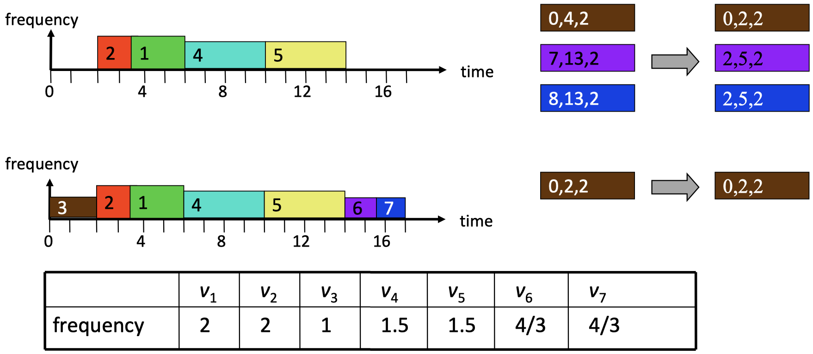

# Chapter 1: Introduction

## 1.1 Impact

**Embedded systems** are information processing systems embedded into a larger product. Usually they use feedback to influence the dynamics of the physical world by taking smart decisions in the cyber world.

{width=50%}

## 1.2 Facts

Embedded systems are often _reactive:_ reactive systems must react to stimuli from the system environment.

> "A reactive system is one which is in continual interaction with its environment and executes at a pace determined by that environment" - Bergé, 1995

ES often must meet _real-time constraints:_ For hard real-time systems, right answers arriving too late are wrong. All other time-constraints are called soft. A _guaranteed system response_ has to be explained without statistical arguments.

> "A real-time constraint is called hard, if not meeting that constraint could result in a catastrophe" - Kopetz, 1997

It is essential to _predict_ how a cyber-physical system (CPS) is going to behave under any circumstances before it is deployed. CPS must _operate dependably,_ safely, securely, efficiently and in real-time.

ES must be _efficient:_

- Energy efficient
- Code-size and data memory efficient
- Run-time efficient
- Weight efficient
- Cost efficient

ES are often _specialized_ towards a certain application or application domain: Knowledge about the expected behavior and the system environment at design time is exploited to _minimize resource usage_ and to _maximize predictability and reliability._

## 1.3 Trends

Some trends of embedded systems:

- ES communicating with each other, with servers or with the cloud. Communication is increasingly.
- Higher degree of integration on a single chip or integrated components:
    - Memory + processor + I/O units + communication
    - Use of networks-on-chip for communication between units
    - Use of homogeneous or heterogeneous multiprocessor system on a chip (MPSoC)
- Low power and energy constraints (especially for portable or unattended devices) are increasingly important, as well as temperature constraints
- There is increasing interest in energy harvesting to achieve long term autonomous operation

# Chapter 2: Software Development

_Reminder:_ Compilation of a C program to machine language works as follows:

{width=50%}

The main chain-of-events for **embedded software developments** is given by the following diagram:

{width=75%}

Software development is nowadays usually done with the support of an IDE:

- Edit and build the code
- Debug and validate the code

A better overview on how this works with embedded systems is given below:

{width=75%}

# Chapter 3: Hardware Software Interface

## 3.1 Storage

### 3.1.1 SRAM / DRAM / Flash

In a **static random access memory (SRAM),** single bits are stored in bit-stable circuits. SRAM is used for:

- Caches
- Register files within the processor core
- Small but fast memories

{width=34%}

If we want to _read_ from SRAM:

1. Pre-charge all bit-lines to average voltage
2. Decode the address ($n + m$ bits)
3. Select the row of cells using $n$ single-bit _word lines (WL)_
4. Selected bit-cells drive all _bit-lines (BL)_ ($2^m$ pairs)
5. Sense difference between bit-line pairs and read out

If we want to _write_ to SRAM:

1. Select row and overwrite the bit-lines using strong signals

In **dynamic random access memory (DRAM),** single bits are stored as charges in capacitors:

- Bit cells lose their charge when they are read, and they drain over time
- Slower access than with SRAM due to small storage capacity in comparison to the capacity of bit-lines
- Higher density than SRAM (1 vs. 6 transistors per bit)

DRAMs require _periodic refresh_ of charge:

- Performed by the memory controller
- Refresh interval is tens of ms
- DRAM is unavailable during refresh

A typical _access process_ for DRAM is given by the following four steps:

1. Bus transmission from CPU to memory controller
2. Precharge and row access from memory controller to row decoder and then from memory array to the sense amps.
3. Column access from memory controller to column decoder and then from sense amps to the data in/out buffers.
4. Data transfer and bus transmission from data in/out buffers to memory controller and from there via the bus to the CPU.

**Flash memory** is electrically modifiable, non-volatile storage. It has the following principle of operation:

- Transistors with a second "floating" gate
- Floating gate can trap electrons
- This results in a detectable change in threshold voltage

{width=50%}

### 3.1.2 Memory Map

We look at the **memory map** by exploring the example of the MSP432. Its _available memory_ is given by:

- 265 kB of built-in flash memory
- 64 kB SRAM
- 32 kB ROM (read-only memory)

The _address space_ is built up as follows:

- The processor uses 32 bit addresses. Therefore, the addressable memory space is $4 \text{ GByte} = 2^{32} \text{ Byte}$ as each memory location corresponds to 1 Byte.
- The address space is used to address the memories (reading and writing), to address the peripheral units, and to have access to debug and trace information.
- The address space is partitioned into zones, each one with a dedicated use.

_Example:_ The following is a simplified description to introduce the basic concepts:

{width=75%}

## 3.2 Input and Output

Very often, a processor needs to _exchange information with other processors_ or devices. To satisfy the various needs, there exist many _communication protocols,_ such as:

- Universal Asynchronous Receiver-Transmitter (UART)
- Serial Peripheral Interface Bus (SPI)
- Inter-Integrated Circuit (I2C)
- Universal Serial Bus (USB)

AS the principals are similar, we will just explain a representative of an asynchronous protocol (UART) and one of a synchronous protocol (SPI).

### 3.2.1 UART Protocol

The **Universal Asynchronous Receiver-Transmitter (UART)** protocol provides _serial communication_ of bits via a single signal, i.e. UART provides parallel-to-serial and serial-to-parallel conversion. The sender and the receiver need to _agree on the transmission rate._ Transmission of a serial packet starts with a start bit, followed by data bits and is finalized by using a stop bit:

{width=50%}

The receiver runs an _internal clock_ whose frequency is an exact multiple of the expected bit rat. When a _start bit_ is detected, a counter begins to count clock cycles, e.g. 8 cycles, until the midpoint of the anticipated start bit is reached. The clock counter counts a further 16 cycles, to the middle of the first _data bit,_ and so on until the _stop bit:_

{width=50%}

### 3.2.2 Memory Mapped Device Access

The configuration of the transmitter and the receiver must match, otherwise they cannot communicate. Examples of configurable parameters are:

- Transmission rate
- LSB or MSB first
- Number of bits per packet
- Parity bit
- Number of stop bits
- Interrupt-based communication
- Clock source

{width=50%}

The _clock subsampling_ block is complex, as one tries to match a large set of transmission rates with a fixed input frequency. The clock source is based on the quartz frequency (48 MHz), divided by 16 and then connected to SMCLK (in the labs, the SMCLK frequency is therefore 3 MHz).

### 3.2.3 SPI Protocol

The **Serial Peripheral Interface Bus (SPI)** protocol is typically used to communicate across short distances. It has the following characteristics:

- 4-wire synchronized (clocked) communication bus
- Supports single master and multiple slaves
- Always full-duplex: Communication is in both directions simultaneously
- Multiple Mbps transmission speeds can be achieved
- Transfer data in 4 to 16-bit serial packets

The _bus wiring_ is built-up as follows:

- MOSI (Master Out Slave In) - carries data out of the master to the slave
- MISO (Master In Slave Out) - carries data out of the slave to the master
- Both MOSI and MISO are active during every transmission
- $\bar{SS}$ (or CS) - signal to select each slave chip
- System clock SCLK - produced by the master to synchronize transfer

{width=50%}

_Example:_ The diagram below shows two examples of how a bus can be configured:

{width=75%}

## 3.3 Interrupts

### 3.3.1 Introduction

A **hardware interrupt** is an electronic alerting signal sent to the CPU from another component, either from an internal peripheral or from an external device.
The **nested vector interrupt controller (NVIC)** handles the processing of interrupts.

The way how usual ES programs look is shown by this figure:

{width=10%}

- System initialization: The beginning part of `main()` is usually dedicated to setting up your system
- Background: Most systems have an endless loop that runs forever. The background loop often contains a _low power mode (LPMx)_ command - this sleeps the CPU until an interrupt event wakes it up.
- Foreground: **Interrupt Service Routine (ISR)** runs in response to enabled hardware interrupt. These events may change modes in the background.

### 3.3.2 Processing Of Interrupts

The **vector interrupt controller (NVIC):**

- Enables and disables interrupts
- Allows to individually and globally _mask interrupts_
- Registers _interrupt service routines_ and sets the priority of interrupts.

{width=34%}

_Interrupt priorities_ are relevant if:

- Several interrupts happen at the same time
- The programmer does not mask interrupts in an ISR and therefore, _preemption of an ISR_ by another ISR may happen (_interrupt nesting_).

The **processing of an interrupt** proceeds with the steps given below:

1. An interrupt occurs: Most peripherals can generate interrupts to provide status and information.
2. It sets a flag bit in a register (_IFG register_): When an interrupt signal is received, a corresponding bit is set in the IFG register. There is such an IFG register for each interrupt source. As some interrupt sources are only on for a short duration, the CPU register the interrupt signal internally.
3. CPU/NVIC acknowledges interrupt by:
    1. Current instruction completes
    2. Saves return-to location on the stack
    3. Masks interrupts globally
    4. Determines source of interrupt
    5. Calls interrupt service routine
4. The interrupt service routine:
    1. Saves context of system
    2. Runes the interrupt's code
    3. Restores the context of the system
    4. Automatically unmasks interrupts and
    5. Continues where it left off

### 3.3.3 Polling vs. Interrupt

We compare **polling** and **interrupt** based on the utilization of the CPU by using a simplified timing model. Some important definitions:

- _Utilization_ $u$: average percentage, the processor is busy
- _Computation_ $c$: processing time of handling the event
- _Overhead_ $h$: time overhead for handling the interrupt
- _Period_ $P$: polling period
- _Interarrival time_ $T$: minimal time between two events
- _Deadline_ $D$: maximal time between event arrival and finishing event processing with $D \leq T$

{width=80%}

For the following considerations, we suppose that the interarrival time between events is $T$. This makes the results a bit easier to understand.

Some relations for _interrupt-based_ event processing:

- The average utilization is $u_i = (h + 1c) / T$
- As we need at least $h + c$ time to finish the processing of an event, we find the following constraint: $h + c \leq D \leq T$

Some relations for _polling-based_ event processing:

- The average utilization is $u_p = c / P$
- We need at least time $P + c$ to process an event that arrives shortly after a polling took place. The polling period $P$ should be larger than $c$. Therefore, we find the following constraints $2c \leq c + P \leq D \leq T$

_Design problem:_ $D$ and $T$ are given by application requirements. $h$ and $c$ are given by the implementation. When to use interrupts and when polling considering the resulting system utilization? What is the best value for the polling period $P$?

- If $D < c < c + \min(c, \, h)$ then event processing is not possible
- If $2c \leq D < h + c$ then only polling is possible. The maximal period $P = D - c$ leads to the optimal utilization $u_p = c / (D - c)$
- If $h + c \leq D < 2c$ then only interrupt is possible with $u_i = (h + c) / T$
- If $c + \max(c, \, h) \leq$ then both are possible with $u_p = c / (D - c)$ or $u_i = (h + c) / T$

Interrupt gets better in comparison to polling, if the deadline $D$ for processing interrupts gets smaller in comparison to the interarrival time $T$, if the overhead $h$ gets smaller in comparison to the computation time $c$, or if the interarrival time of events is only lower bounded by $T$.

## 3.4 Clocks and Timers

### 3.4.1 Clocks

Microcontrollers usually have many _clock sources_ that have different:

- Frequencies
- Energy consumption
- Stability (i.e. crystal-controlled clock vs. digitally controlled oscillators)

From the basic clocks, several internally available clock signals are derived. They can be used for clocking peripheral units, the CPU, the memory, and the various timers.

### 3.4.2 Watchdog Timer

**Watchdog timers** provide system fail-safety:

- If their counter ever rolls over (back to zero), they _reset the processor._ The goal here is to prevent your system from being inactive (deadlock) due to some unexpected fault.
- To prevent your system from continuously resetting itself, the counter should be reset at appropriate intervals:

{width=80%}

### 3.4.3 System Tick

**SysTick** is a simple decrementing 24 bit counter that is part of the NVIC controller. Its clock source is MCLK, and it reloads to period 1 after reaching 0. It is a very simple timer, mainly used for periodic interrupts or measuring time.

_Example:_ If MCLK has a frequency of 3 MHz, the counter rolls over every 5.6 seconds as $(2^{24}/(3 \cdot 10^6)) = 5.59$.

### 3.4.4 Timers and PWM

Usually, embedded microprocessors have several elaborate **timers** that allow to:

- capture the current time or time differences, triggered by hardware or software events
- generate interrupts when a certain time is reached
- generate interrupts when counter overflows
- generate periodic interrupts, for example in order to periodically execute tasks
- generate specific output signals, for example _pulse width modulation (PWM)_

Typically, the mentioned functions are realized via _capture and compare registers:_

- **Capture:**
    - the value of counter register is stored in the capture register at the time of the _capture event_
    - the value can be read b software
    - at the time of the capture, further actions can be triggered
- **Compare:**
    - the value of the compare register can be set by software
    - as soon as the values if the counter and compare register are equal, compare actions can be taken such as interrupt, signaling peripherals, changing pin values, resetting the counter register

{width=80%}

The **pulse width modulation (PWM)** can be used to change the average power of a signal. The use case could be to change the speed of a motor or to modulate the light intensity of an LED.

# Chapter 4: Programming Paradigms

## 4.1 Reactive Systems and Timing

### 4.1.1 Timing Guarantees

_Hard real-time systems_ can often be found in safety-critical applications. They need to provide the result of a computation within a fixed time bound.

Typical application domains are: avionics, automotive, train systems, automatic control including robotics, manufacturing, and media content production.

_Example:_ The side-airbag in a car needs to react after an event in less than 10 ms.

### 4.1.2 Real-Time Systems

In many _cyber-physical systems (CPSs),_ correct timing is a matter of correctness, not performance: an answer arriving too late is considered to be an error.

A simplified **real-time system** looks like this:

{width=50%}

Embedded controllers are often expected to finish the processing of data and events reliably within defined time bounds. Such a processing may involve seqeunces of computations and communications. Essential for the analysis and design of a real time system: _upper bounds on the execution times_ of all tasks are statically known. This also includes the communication of information via wired or wireless connection.

This value is commonly galled the _worst-case execution time (WCET)._ Analogously, one can define the lower bound on the execution time, the _best-case execution time (BCET)._

### 4.1.3 Execution Times

Modern processors increase the average performance by using caches, pipelines, branch prediction, and speculation techniques, for example. These features make the computation of the WCET very difficult. The microarchitecture has a large _time-varying internal state_ that is changed by the execution of instructions and that influence the execution times of instructions:

- Best-case: everything goes smoothly: no cache-miss, operands are ready, needed resources are free, branches are correctly predicted.
- Worst-case: everything goes wrong: all loads miss the cache, resources needed are occupied, operands are not ready.
- The span between the best case and worst case may be several hundred cycles!

The complexity for determining the WCET of tasks is:

- In the general case, it is undecidable whether a finite bound exists.
- For restricted classes of programs it is possible, in principle.

Analytic (formal) approaches exist for hardware and software:

- In case of software, it requires the analysis of the program flow and the analysis of the hardware. Bot are combined in a complex analysis flow.
- For the rest of the lecture, we assume that reliable bounds on the WCET are available.

## 4.2 Different Programming Paradigms

### 4.2.1 Overview

The concept of _concurrent tasks_ reflects our intuition about the functionality of embedded systems. Tasks help us manage the complexity of concurrent activities as happening in the system environment:

- Input data arrives from various sensors and input devices.
- The system may also receive asynchronous input events.

There are many structured ways of programming an embedded system. In this lecture, only the main principles will be covered:

- Time triggered approaches:
    - Periodic
    - Cyclic
    - Generic time-triggered scheduler
- Event triggered approaches
    - non-preemptive
    - preemptive

### 4.2.2 Time-Triggered Systems

The **pure time-triggered model** has the following characteristics:

- no interrupts are allowed, except by timers
- the schedule of tasks is computed off-line and therefore, complex sophisticated algorithms can be used
- the scheduling at run-time is fixed and therefore, it is _deterministic_
- the interaction with environment happens through _polling_

{width=50%}

With a **simple periodic TT scheduler,** a timer interrupts regularly with period $P$. All tasks have the same period $P$.

{width=50%}

Properties:

- later tasks, for example $T_2$ and $T_3$, have unpredictable starting times
- the communication between tasks or the use of common resources is safe, as there is a static ordering of tasks
- as necessary precondition, the sum WCETs of all tasks within a period is bounded by the period:

$$
\sum_k WCET(Z_k) < P
$$

With a **time-triggered cyclic executive scheduler** we assume that tasks may have different periods. To accommodate this situation, the period $P$ is _partitioned into frames_ of length $f$.

{width=50%}

We have a problem to determine a feasible schedule, if there are tasks with a long execution time. Long tasks could be partitioned into a sequence of short sub-tasks, but this is a tedious and error-prone process.

When a control application consists of several concurrent periodic tasks with individual timing constraints, the schedule has to guarantee that each periodic instance is regularly activated at its proper rate and is completed within its deadline.

Definitions:

- $\Gamma$: denotes the set of all periodic subtasks
- $\tau_i$: denotes a periodic task
- $\tau_{i, \, j}$: denotes the $j$-th instance of task $i$
- $r_{i, \, j}, \, d_{i, \, j}$: denote the release time and absolute deadline of the $j$-th instance of task $i$
- $\Phi_i$: denotes the phase of task $i$ (release time of its first instance)
- $D_i$: denotes the relative deadline of task $i$

_Example:_ The following figures show an example of a single periodic task $\tau_i$ (1) and an example of a set of periodic tasks $\Gamma$ (2):

{width=34%}

{width=75%}

The following _hypotheses_ are assumed on the tasks:

- The instances of a periodic task are regularly activated at a constant rate. The interval $T_i$ between two consecutive activations is called period. The release times satisfy:

$$
r_{i, \, j} = \Phi_i + (j-1)T_i
$$

- All instances have the same worst-case execution time $C_i$.
- All instances of a periodic task have the same relative deadline $D_i$ Therefore, the absolute deadlines satisfy:

$$
d_{i, \, j} = \Phi_i + (j-1)T_i + D_i
$$

_Example:_ The following diagram shows an example of time-triggered cyclic executive scheduling with 4 tasks:

{width=75%}

Some conditions for period $P$ and frame length $f$:

- A task executes at most once within a frame: $f \leq T_i \forall \tau_i$
- $P$ is a multiple of $f$
- Period $P$ is the least common multiple of all periods $T_k$
- Tasks start and complete within a single frame: $f \geq C_i \forall \tau_i$
- Between release time and deadline of every task there is at least one full frame:

$$
2f - \text{gcd}(T_i, \, f) \leq D_i \forall \tau_i
$$

_Example:_ The figure below shows an example of a cyclic executive scheduling:

{width=75%}

If we want to _check for the correctness of a schedule_ we proceed as follows:

- $f_{i, \, j}$ denotes the number of the frame in which that instance $j$ of task $\tau_i$ executes
- Is $P$ a multiple of all periods $T_i$?
- Is $P$ a multiple of $f$?
- Is the frame sufficiently long?

$$
\sum_{\{i \, | \, f_{i, \, j} = k \}} C_i \leq f \quad \forall 1 \leq k \leq \frac{P}{f}
$$

- Determine offsets such that instances of tasks start after their release time:

$$
\Phi_i = \min_{1 \leq j \leq P/T_i} \{(f_{i, \, j} - 1)f - (j-1)T_i \} \quad \forall \tau_i
$$

- Are deadlines respected?

$$
(j-1)T_i + \Phi_i + D_i \geq f_{i, \, j}f \quad \forall \tau_i, \, 1 \leq j \leq \frac{P}{T_i}
$$

Finally, we look at **generic time-triggered schedulers.**

In an entirely time-triggered system, the temporal control structure of all tasks is established a priori by off-line support-tools. This temporal control structure is encoded in a _Task-Descriptor List (TDL)_ that contains the cyclic schedule for all activities of the node. This schedule considers the required precedence and mutual exclusion relationships among the tasks such that an explicit coordination of the tasks by the operating system at run time is not necessary. The dispatcher is activated by a synchronized clock tick.

Summary for _time-triggered schedulers:_

- Properties:
    - deterministic schedule, conceptually simple, relatively easy to validate, test, and certify
    - no problems in using shared resources
    - external communication only via polling
    - inflexible as no adaption to the environment
    - serious problems if there are long tasks
- Extensions:
    - allow interrupts -> be careful with shared resources and the WCET of tasks
    - allow preemtable background tasks
    - check for task overruns (execution time longer than WCET) using a watchdog timer

### 4.2.3 Event Triggered Systems

In an **event triggered system,** the schedule of tasks is determined by the occurrence of external or internal events:

- _dynamic and adaptive:_ there are possible problems with respect to timing, the use of shared resources and buffer over- or underflow
- _guarantees_ can be given either off-line (if bounds on the behavior of the environment are known) or during run-time

The first scheduling process we look at is **non-preemptive event-triggered scheduling.** It is based on the following _principles:_

- To each event, there is associated a corresponding task that will be executed.
- Events are emitted by (a) external interrupts or (b) by the tasks themselves
- All events are collected in a single queue. Depending on the queuing discipline, an event is chosen for execution, i.e. the corresponding task us executed.
- Tasks cannot be preempted

One might make the following _extensions_ on the above scheduling:

- A _background task_ can run if the vent queue is empty. It will be preempted by any event processing.
- _Timed events_ are ready for execution only after a time interval elapsed. This enables periodic instantiations, for example.

{width=50%}

We elaborate some further _properties_ of non-preemptive event-triggered scheduling:

- communication between tasks does not lead to simultaneous access to shared resources, but interrupts may cause problems as they preempt running tasks
- buffer overflow may happen if too many events are generated by the environment or by tasks
- tasks with a long-running time prevent other tasks from running and may cause buffer overflow as no events are being processed during this time

Another option for event-triggered scheduling is **preemptive event-triggered scheduling.** We first look at this approach's _stack policy:_

- This case is similar to non-preemptive case, but tasks can be preempted by others. This resolves partly the problem of tasks with a long execution time.
- If the order of preemption is restricted, we can use the usual stack-based context mechanism of function calls. The context of a function contains the necessary state such as local variables and saved registers.
- Tasks must finish in LIFO order of their instantiations, this restricts flexibility of the approach.
- Shared resources must be protected, for example by disabling interrupts or by the use of semaphores.

{width=50%}

A **thread** is a unique execution of a program. Several copies of such a program may run simultaneously or at different times. Threads share the same processor and its peripherals. A thread has its _own local state._ This state consists mainly of:

- register values
- memory stack
- program counter

Several threads may have a shared state consisting of global variables. An **activation record** contains the thread local state which includes registers and local data structures. In a _context switch,_ the current CPU context goes out, and the new CPU context goes in.

With **co-operative multitasking,** each thread allows a context switch to another thread at a call to the `cswitch()` function. This function is part of the underlying runtime system. A _scheduler_ within this runtime system chooses which thread will run next.

**Preemptive multitasking** is the most general form of multitasking:

- The scheduler in the runtime system controls when context switches take place
- The scheduler also determines what thread runs next

We can visualize this with a state diagram corresponding to each single thread:

- _Run:_ A thread enters this state as it starts executing on the processor.
- _Ready:_ State of threads that are ready to execute but cannot be executed because the processor is assigned to another thread.
- _Blocked:_ A task enters this state when it waits for an event.

{width=50%}

# Chapter 5: Embedded Operating Systems

## 5.1 Introduction

An **embedded operating system (OS)** has the essential characteristic of _configurability:_

- No single operating system will fit all needs, but often no overhead for unused functions is tolerated. Therefore, configurability is needed.
- For example, there are many embedded systems without external memory, a keyboard, a screen, or a mouse.

Some examples of configurability:

- Remove unused functions/libraries
- Use conditional compilation

A **real-time operating system (RTOS)** is an operating system that supports the construction of real-time systems. They have the following two key requirements:

1. The timing behavior of the OS must be predictable: For all services of the OS, an upper bound on the execution time is necessary. For example, for every service upper bounds on blocking times need to be available, i.e. for times during which interrupts are disabled.
2. OS must manage the timing and scheduling: OS has to be aware of deadlines and should have mechanisms to take them into account in the scheduling. OS must provide precise time services with a high resolution.

## 5.2 Features and Architecture

**Device drivers** are typically handled directly by tasks instead of drivers that are managed by the operating system:

- This architecture improves timing predictability as access to devices is also handled by the scheduler
- If several tasks use the same external device and the associated driver, then the access must be carefully managed

{width=50%}

Every task can perform an _interrupt:_

- For standard OS, this would be a serious source of unreliability. But embedded programs are typically programmed in a controlled environment.
- It is possible to let interrupts directly start or stop tasks. This approach is more efficient and predictable than going through the operating system's interfaces and services.

_Protection mechanisms_ are not always necessary in embedded operating system. Embedded systems are typically designed for a single purpose, untested programs are rarely loaded, software can be considered reliable.

The main functionality of **RTOS-Kernels** is task management:

- Execution of quasi-parallel tasks on a processor using processes and threads
- CPU scheduling
- Inter-task communication
- Support of real-time clocks
- Task synchronization

_Tasks_ can have three different states:

- Running: A task enters this state when it starts executing on the processor. There is at most one task with this state in the system.
- Ready: State of those tasks that are ready to be executed but cannot be run because the processor is assigned to another task.
- Blocked: A task enters the blocked state when it executes a synchronization primitive to wait for an even, e.g. wait primitive on a semaphore or timer.

{width=70%}

A **thread** is the smallest sequence of programmed instructions that can be managed independently by a scheduler, e.g. a thread is a basic unit of CPU utilization. Multiple threads can exist within the same process and share resources such as memory, while different processes do not share these resources. Thread advantages and characteristics:

- Faster to switch between threads. Switching between user-level threads requires no major intervention by the operating system.
- Typically, an application will have a separate thread for each distinct activity.
- _Thread control block (TCB)_ stores information needed to manage and schedule a thread.

The OS maintains for each thread a _data structure (**TCB - thread control block**)_ that contains its current status such as program counter, priority, state, scheduling information, and thread name. TCBs are administered in linked lists:

{width=70%}

## 5.3 Classes of Operating Systems

**Class 1:** fast and efficient kernels. For hard real-time systems, these kernels are questionable, because they are designed to be fast, rather than to be predictable in every respect. Examples include: FreeRTOS, RT-LINUX, LynxOS.

**Class 2:** real-time extensions to standard OSs. Attempt to exploit existing and comfortable main stream operating systems. A real-time kernel runs all real-time tasks. The standard OS is executed as one task.

{width=70%}

**Class 3:** research systems try to avoid limitations of existing real-time and embedded operating systems. Typical research questions include:

- Low overhead memory protection
- Temporal protection of computing resources
- RTOS for on-chip multiprocessors

## 5.4 FreeRTOS in the ES-Lab

### 5.4.1 Introduction

**FreeRTOS** is a typical embedded operating system. It is available for many hardware platforms, open source and widely used in the industry:

- FreeRTOS is a _real-time kernel_
- Applications are organized as a collection of independent threads of execution
- Preemptive or co-operative operation, queues, binary semaphores, counting semaphores, mutexes, software timers, etc.

The typical _directory structure_ is given as:

```pseudo
FreeRTOS
    Source
        tasks.c         // functions that implement the handling of tasks
        list.c          // implementation of linked lsit data type
        queue.c         // implementation of queue and semaphore services
        timers.c        // software timer functionality
        event_group.c
        coroutine.c
        portable        // directory containing all port specific source files
```

FreeRTOS is _configured_ by a header file called `FreeRTOSCOnfig.h` that determines almost all configurations.

### 5.4.2 FreeRTOS Task Management

_Tasks_ are implemented as threads. The functionality of a thread is implemented in form of a function:

- Prototype: `void ATaskFunction(void *pvParameters);`
- Task functions are not allowed to return! They can be killed by a specific call to a FreeRTOS function, but usually run forever in an infinite loop.
- Task functions can instantiate other tasks. Each created task is a separate execution instance, with its own stack.

Thread instantiation is shown in the figure below:

{width=70%}

### 5.4.3 FreeRTOS Timers

The operating system also provides _interfaces to timers_ of the processors. AS an example, we use the FreeRTOS timer interface to replace the busy loop by a delay. In that case, the task is put into the "blocked" state instead of continuously running:

```c
void vTask1(void *pvParameters) {
    for(;;) {
        /* do something repeatedly */
        vTaskDelay(pdMS_TO_TICKS(250));     // delay by 250 ms
    }
}
```

The problem is that tasks do not execute strictly periodically. The parameters to `vTaskDelayUntil()` specify the exact tick count value at which the calling task should be moved from the "blocked" state into the "ready" state. Therefore, the task is put into the "ready" state periodically.

### 5.4.4 FreeRTOS Task States

The task states in FreeRTOS and their transitions are:

- A task that is waiting for an event is said to be in the "blocked" state, which is a sub-state of the "not running" state.
- Tasks can enter the "blocked" state to wait for two different types of events:
    - _Temporal (time-related) events:_ the event being either a delay period expiring, or an absolute time being reached
    - _Synchronization events:_ where the events originate from another task or interrupt.

{width=25%}

# Chapter 6: Aperiodic and Periodic Scheduling

## 6.1 Basic Terms and Models

**Real-time systems** can be:

- _Hard:_ A real-time task is said to be hard, if missing the deadline may cause catastrophic consequences on the environment under control.
- _Soft:_ A real-time task is called soft, if meeting its deadline is desirable for performance reasons, but missing its deadline does not cause serious damage to the environment and does not jeopardize correct system behavior.

Some definitions about _schedules._ Given a set of tasks $J = \{J_1, \, J_2,...\}$:

- A _schedule_ is an assignment of tasks to the processor, such that each task is executed until completion
- A schedule can be defined as an _integer step function_ $\sigma : R \to N$ where $\sigma(t)$ denotes the task which is executed at time $t$. If $\sigma(t) = 0$, the processor is called _idle._
- If $\sigma(t)$ changes its value at some time, then the processor performs a _context switch._
- Each interval, in which $\sigma(t)$ is constant is called a _time slice._
- A _preemptive schedule_ is a schedule in which the running task can be arbitrarily suspended at any time, to assign the CPU to another task according to a predefined scheduling policy.

Some definitions about schedules and timing:

- A schedule is said to be _feasible,_ if all tasks can be completed according to a set of specified constraints
- A set of tasks is said to be _schedulable,_ if there exists at least one algorithm that can produce a feasible schedule
- _Arrival time_ $a_i$ or _release time_ $r_i$ is the time at which a task becomes ready for execution
- _Computation time_ $C_i$ is the time necessary to the processor for executing the task without interruption
- _Deadline_ $d_i$ is the time at which a task should be completed
- _Start time_ $s_i$ is the time at which a task starts its execution
- _Finishing time_ $f_i$ is the time at which a task finishes its execution
- _Lateness_ $L_i = f_i - d_i$ represents the delay of a task completion with respect to its deadline.
- _Tardiness or exceeding time_ $E_i = \max(0, \, L_i)$ is the time a task stays active after its deadline
- _Laxity or slack time_ $X_i = d_i - a_i - C_i$ is the maximum time a task can be delayed on its activation to complete within its deadline
- Using the above definitions, we have $d_i \geq r_i + C_i$

A _periodic task_ $\tau_i$ is an infinite sequence of identical activities, called _instances or jobs,_ that are regularly activated at a constant rate with _period_ $T_i$. The activation of the first instance is called _phase_ $\Phi_i$.

_Example:_ Following is an example of a real-time model:

{width=50%}

- Computation times: $C_1 = 9, \, C_2 = 12$
- Start times: $s_i = 0, \, s_2 = 6$
- Finishing times: $f_1 = 18, \, f_2 = 28$
- Lateness: $L_1 = -4, \, L_2 = 1$
- Tardiness: $E_1 = 0, \, E_2 = 1$
- Laxity: $X_1 = 13, \, X_2 = 11$

**Precedence relations** between tasks can be described through an _acyclic directed graph_ $G$ where tasks are represented by nodes and precedence relations by edges. $G$ induces a partial order on the task set. There are different _interpretations_ possible:

- All successors of a task are activated (_concurrent task execution_). We will use this interpretation in the lecture.
- One successor of a task is activated: _non-deterministic choice_

We do _classify_ scheduling algorithm:

- With _preemptive algorithms,_ the running task can be interrupted at any time to assign the processor to another active task.
- With a _non-preemptive algorithm,_ a task, once started, is executed by the processor until completion.
- _Static algorithms_ are those in which scheduling decisions are based on fixed parameters, assigned to tasks before their activation.
- _Dynamic algorithms_ are those in which scheduling decisions are based on dynamic parameters that may change during system execution.

We introduce the following **metrics to compare schedules:**

- Average response time: $\bar{t_r} = \frac{1}{n} \sum_{i = 1}^n(f_i - r_i)$
- Total completion time: $t_c = \max_i(f_i) - \min_i(r_i)$
- Weighted sum of response time: $t_w = \frac{\sum_{i = 1}^nw_i(f_i - r_i)}{\sum_{i = 1}^n w_i}$
- Maximum lateness: $L_{max} = \max_i(f_i - d_i)$
- Number of late tasks: $N_{late} = \sum_{i = 1}^n miss(f_i)$, with $miss(f_i) = 0, \, if \, f_i \leq d_i, \, 1 \, otherwise$

## 6.2 Real-Time Scheduling of Aperiodic Tasks

We look at some algorithms for **scheduling aperiodic tasks.**

### 6.2.1 Earliest Deadline Due (EDD)

> **Jackson's Rule:** Given a set of $n$ tasks. Processing in order of non-decreasing deadlines is optimal with respect to minimizing the maximum lateness.

_Example:_

{width=40%}

### 6.2.2 Earliest Deadline First (EDF)

> **Horn's Rule:** Given a set of $n$ independent tasks with arbitrary arrival times, any algorithm that at any instant executes a task with the earliest absolute deadline among the ready tasks is optimal with respect to minimizing the maximum lateness.

{width=40%}

_Concept of proof:_ For each time interval $[t, \, t + 1)$ it is verified, whether the actual running task is the one with the earliest absolute deadline. If this is not the case, the task with the earliest absolute deadline is executed in this interval instead. This operation cannot increase the maximum lateness.

We can do an **acceptance test** to test whether an additional set of tasks is feasible to do or not:

- Worst case of finishing time of task $i$: $f_i = t + \sum_{k = 1}^i c_k(t)$
- EDF guarantee condition: $\forall i = 1,..., \, n, \, t + \sum_{k = 1}^i c_k(t) \leq d_i$

```pseudo
Algorithm: EDG_guarantee (J, J_new) {
    J' = J union {J_new};                   // ordered by deadline
    f_0 = t
    for (each J_i in J') {
        f_i = f_{i-1} + c_i(t);
        if (f_i > d_i) return (INFEASIBLE);
    }
    return (FEASIBLE);
}
```

The problem of scheduling a set of $n$ tasks with precedence constraints can be solved in polynomial time complexity if tasks are preemptable. The **EDF\*** algorithm determines a feasible schedule in the case of tasks with precedence constraints if there exists one. By the modification it is guaranteed that if there exists a valid schedule at all then:

- a task starts execution not earlier than its release time and not earlier than the finishing times of its predecessors
- all tasks finish their execution within their deadlines

_Modification of deadline:_

- Tasks must finish the execution time within its deadline
- Tasks must not finish the execution later than the maximum start time of its successor
- _Solution:_ $d_i^* = \min(d_j, \, \min(d_j^* - C_j : J_i \to J_j))$

Algorithm:

1. For any terminal node of the precedence graph set $d_i^* = d_i$
2. Select a task $i$ such that its deadline has not been modified but the deadlines of all immediate successors $j$ have been modified. If no such task exists, exit.
3. Set $d_i^* = \min(d_j, \, \min(d_j^* - C_j : J_i \to J_j))$
4. Return to step 2

_Modification of release time:_

- Task must start the execution not earlier than its release time
- Task must not start the execution earlier than the minimum finishing time of its predecessor
- _Solution:_ $r_j^* = \max(r_j, \, \max(r_i^* + C_i : J_i \to J_j))$

Algorithm:

1. For any initial node of the precedence graph set $r_i^* = r_i$
2. Select a task $j$ such that its release time has not been modified but the release times of all immediate predecessors $i$ have been modified. If no such task exists, exit.
3. Set $r_j^* = \max(r_j, \, \max(r_i^* + C_i : J_i \to J_j))$
4. Return to step 2

## 6.3 Real-Time Scheduling of Periodic Tasks

### 6.3.1 Model of Periodic Tasks

Examples of periodic tasks are sensory data acquisition, low-level actuation, control loops, action planning and system monitoring.

When an application consists of several concurrent periodic tasks with individual timing constraints, the OS has to guarantee that each periodic instance is regularly activated at its proper rate and is completed within its deadline.

The following hypotheses are assumed on the tasks:

- $r_{i, \, j} = \Phi_i + (j-1)T_i$
- $d_{i, \, j} = \Phi_i + (j-1)T_i + D_i$
- $d_{i, \, j} = \Phi_i + jT_i$
- All instances have some worst case execution time $C_i$
- All periodic tasks are independent, that is, there are no precedence relations and resource constraints
- No task can suspend itself
- All tasks are release as soon as they arrive
- All overheads in the OS kernel are assumed to be zero

_Example:_

{width=50%}

### 6.3.2 Rate Monotonic Scheduling (RM)

We make the following assumptions:

- Task priorities are assigned to tasks before execution and do not change over time (_static priority assignment_)
- RM is intrinsically preemptive: the currently executing job is preempted by a job of a task with higher priority
- Deadlines equal the period $D_i = T_i$

> **Rate-Monotonic Scheduling Algorithm:** Each task is assigned a priority. Tasks with higher request rates (that is, with shorter periods) will have higher priorities. Jobs of tasks with higher priority interrupt jobs of tasks with lower priority.

_Example:_

{width=50%}

> _Optimality:_ RM is optimal among all fixed-priority assignments in the sense that no other-fixed priority algorithm can schedule a task set that cannot be scheduled by RM.

A **critical instant** of a task is the time at which the release of a job will produce the largest response time.

> _Lemma:_ For any task, the critical instant occurs if a job is simultaneously released with all higher priority jobs.

_Proof sketch:_ Start with two tasks $\tau_1$ and $\tau_2$. The response time of a job $\tau_2$ is delayed by jobs of $\tau_1$ of higher priority:

{width=50%}

The delay may _increase_ if $\tau_1$ starts earlier. The maximum delay is achieved if $\tau_1$ and $\tau_2$ start simultaneously.

For the **proof of RM optimality with 2 tasks** we start with two tasks $\tau_1, \, \tau_2$ with periods $T_1 < T_2$. We define $F = \lfloor T_2 / T_1 \rfloor$ as the number of periods of $\tau_1$ _fully contained_ in $T_2$. We consider two cases A and B:

_Case A:_ Assume RM is not used, i.e. the priority of $\tau_2$ is the highest:

{width=50%}

> The schedule is feasible if $C_1 + C_2 \leq T_1$ and $C_2 \leq T_2$. ($A$)

_Case B:_ Assume RM is used, i.e. the priority of $\tau_1$ is the highest:

{width=50%}

> Schedule is feasible if:
>
> $$
> FC_1 + C_2 + \min(T_2 - FT_1, \, C_1) \leq T_2 \quad \text{and} \quad C_1 \leq T_1 \qquad (B)
> $$

{width=50%}

We need to show that $(A) \implies (B)$:

$$
C_1 + C_2 \leq T_1 \implies C_1 \leq T_1 \\
C_1 + C_2 \leq T_1 \implies FC_1 + C_2 \leq FC_1 + F_c2 \leq FT_1 \implies \\
FC_1 + C_2 + \min(T_2 - FT_1, \, C_1) \leq FT_1 + \min(T_2 - FT_1, \, C_1) \leq \min(T_2, \, C_1 + FT_1) \leq T_2
$$

> Given tasks $\tau_1$ and $\tau_2$ with $T_1 < T_2$, then if the schedule is feasible by an arbitrary fixed priority assignment, it is also feasible by RM.

_Schedulability analysis_ for RM: A set of periodic tasks is schedulable with RM if:

$$
\sum_{i=1}^n \frac{C_i}{T_i} \leq n(2^{1/n}-1)
$$

This condition is sufficient but not necessary. The term $U = \sum_{i = 1}^n \frac{C_i}{T_i}$ denotes the **processor utilization factor** $U$ which is the fraction of processor time spent in the execution of the task set.

### 6.3.3 Deadline Monotonic Scheduling (DM)

Assumptions for **deadline monotonic scheduling** are as in rate monotonic scheduling, but _deadlines may be smaller than the period,_ i.e. $C_i \leq D_i \leq T_i$.

> Each task is assigned a priority. Tasks with smaller relative deadlines will have higher priorities. Jobs with higher priorities interrupt jobs with lower priorities.

_Schedulability analysis_ for DM: A set of periodic tasks is schedulable with DM if:

$$
\sum_{i = 1}^n \frac{C_i}{D_i} \leq n(2^{1/n}-1).
$$

The condition is sufficient but not necessary. _Example_ with $U = 0.874, \, \sum_{i = 1}^n \frac{C_i}{D_i} = 1.08 > n(s^{1/n}-1) = 0-757$:

{width=50%}

There is also a _necessary and sufficient_ schedulability test which is computationally more involved. It is based on the following observations:

- The worst-case processor demand occurs when all tasks are released simultaneously, that is, at their critical instances
- For each task $i$, the sum of its processing time and the interference imposed by higher priority task must be less than or equal to $D_i$
- A measure of the _worst-case inference_ for task $i$ can be computed as the sum of the processing times of all higher priority tasks released before some time $t$ where tasks are ordered according to $m < n \iff D_m < D_n$:

$$
I_i = \sum_{j = 1}^{i-1} \lceil \frac{t}{T_j} \rceil C_j
$$

- The _longest response time_ $R_i$ of a job of a periodic task $i$ is computed, at the critical instant, as the sum of its computation time and the interference due to preemption by higher priority tasks: $R_i = C_i + I_i$
- Hence, the schedulability test needs to compute the smallest $R_i$ that satisfies:

$$
R_i = C_i + \sum_{j = 1}^{i-1} \lceil \frac{R_i}{T_j}C_j,
$$

for all tasks $i$. Then, $R_i \leq D_i$ must hold for all $i$. It can be shown that this condition is _necessary and sufficient._

The longest response times $R_i$ of the periodic tasks $i$ can be computed iteratively by the following algorithm:

```pseudo
Algorithm: DM_guarantee(Gamma) {
    for (each tau_i in Gamma) {
        I = 0;
        do {
            R = I + C_i;
            if (R > D_i) return (UNSCHEDULABLE);
            I = Sum_{j = 1}^{i - 1} lceil R/T_j rceil C_j;
        } while (I + C_i > R);
    }
    return (SCHEDULABLE);
}
```

### 6.3.4 EDF Scheduling

Assumptions:

- Dynamic priority assignment
- Intrinsically preemptive

Algorithm: The currently executing task is preempted whenever another periodic instance with earlier deadline becomes active:

$$
d_{i, \, j} = \Phi_i + (j-1)T_i + D_i
$$

Optimality: No other algorithm can schedule a set of periodic tasks if the set cannot be scheduled by EDF.

_Example:_

{width=50%}

A necessary and sufficient schedulability test for $D_i = T_i$:

> A set of periodic tasks is schedulable with EDF if and only if $\sum_{i = 1}^n \frac{C_i}{T_i} = U \leq 1$.

Here, $U$ denotes the _average processor utilization._

_Remarks:_ If the deadline was missed at $t_2$, then define $t_1$ as a time before $t_2$ such that (a) the processor is continuously busy in $[t_1, \, t_2]$ and (b) the processor only executes tasks that have their arrival time and their deadline in $[t_1, \, t_2]$. Why does such a time $t_1$ exist? We find such a $t_1$ by starting at $t_2$ and going backwards in time always ensuring that the processor only executes tasks that have their deadline before or at $t_2$. Because of EDF, the processor will be busy shortly before $t_2$, and it executes on the task that has deadline after $t_2$. Suppose that we reach a time such that shortly before the processor works on a task with deadline after $t_2$ or the processor is idle, then we found $t_1$: we know that there is no execution on a task with deadline after $t_2$.

Within the interval $[t_1, \, t_2]$ the total _computation time demanded_ by the periodic tasks is bounded by:

$$
C_p(t_1, \, t_2) = \sum_{i = 1}^n \lfloor \frac{t_2 - t_1}{T_i} C_i \leq \sum_{i = 1}^n \frac{t_2 - t_1}{T_i}C_i = (t_2 - t_1)U
$$

Since the deadline at time $t_2$ is missed, we must have $t_2 - t_1 < C_p(t_1, \, t_2) \leq (t_2 - t_1)U \implies U > 1$, which is _not possible._ This shows that if the utilization satisfies $U > 1$, then there is no valid schedule.

## 6.4 Real-Time Scheduling of Mixed Task Sets

### 6.4.1 Introduction

In many applications, there are aperiodic as well as periodic tasks:

- _Periodic tasks:_ time-driven, execute critical control activities with hard timing constraints aimed at guaranteeing regular activation rates.
- _Aperiodic tasks:_ event-driven, may have hard, soft, or non-real-time requirements depending on the specific application
- _Sporadic tasks:_ Offline guarantee of event-driven aperiodic tasks with critical timing constraints can be done only by making proper assumptions on the environment, that is, by assuming a _maximum arrival rate_ for each critical event. Aperiodic tasks characterized by a minimum interarrival time are called _sporadic._

### 6.4.2 Background Scheduling

**Background scheduling** is a simple solution for RM and EDF:

- Processing of aperiodic tasks in the background, i.e. execute if there aren't any pending periodic requests
- periodic tasks are not affected
- Response of aperiodic tasks may be prohibitively long and there is no possibility to assign a higher priority to them

_Example_ with rate monotonic periodic scheduling:

{width=50%}

### 6.4.3 Rate-Monotonic Polling Server

The idea of **rate-monotonic polling servers** is to introduce an artificial periodic task whose purpose it is to service aperiodic requests as soon as possible, therefore we also call it "server". The function of the **polling server (PS)** is as follows:

- At regular intervals equal to $T_s$, a PS task is instantiated. When it has the highest current priority, it serves any pending aperiodic request within the limit of its capacity $C_s$.
- If no aperiodic requests are pending, PS suspends itself until the beginning of the next period.
- Its priority (period) can be chosen to match the response time requirement of the aperiodic tasks.

_Example_ of rate-monotonic polling server scheduling:

{width=50%}

The _schedulability analysis_ of periodic tasks is:

- The interference by a server task is the same as the one introduced by an equivalent periodic task in rate-monotonic fixed-priority scheduling.
- A set of periodic tasks and a server task can be executed within their deadlines if (sufficient but not necessary):

$$
\frac{C_s}{T_s} + \sum_{i = 1}^n \frac{C_i}{T_i} \leq (n + 1)(2^{1/(n+1)}-1)
$$

If we want to _guarantee the response time of aperiodic requests_ with the assumption, that an aperiodic task is finished before a new aperiodic request arrives (with computation time $C_a$ and deadline $D_a$), a sufficient schedulability test is:

$$
(1 + \lceil \frac{C_a}{C_s} \rceil)T_s \leq D_a
$$

### 6.4.4 EDF - Total Bandwidth Server

The idea of an _EDF Total Bandwidth Server** is as follows:

- When the $k$-th aperiodic request arrives at time $t = r_k$, it receives a deadline $d_k = \max(r_k, \, d_{k-1}) + \frac{C_k}{U_s}$, where $C_k$ is the execution time of the request and $U_s$ is the server utilization factor (that is, its bandwidth). By definition, $d_0 = 0$.
- Once a deadline is assigned, the request is inserted into the ready queue of the system as any other periodic instance.

_Example_ with $U_p = 0.75, \, U_s = 0.25$ and $U_p + U_s = 1$:

{width=50%}

The _schedulability analysis_ for an EDF total bandwidth server is as follows:

> Given a set of $n$ periodic tasks with processor utilization $U_p$ and a total bandwidth server with utilization $U_2$, the whole set is schedulable by EDF if and only if $U_p + U_s \leq 1$.

_Proof:_ In each interval of time $[t_1, \, t_2]$, if $C_{ape}$ is the total execution time demanded by an aperiodic request arrived at $t_1$ or later and served with deadlines less or equal to $t_2$, then

$$
C_{ape} \leq (t_2 - t_1)U_s
$$

If this has been proven, the proof of the schedulability test follows closely that of the periodic case.

# Chapter 7: Shared Resources

## 7.1 Resource Sharing

### 7.1.1 Introduction

Examples of **shared resources** are data structures, variables, main memory area, files, set of registers, etc. Many shared resources do _not allow simultaneous access_ but require _mutual exclusion._ These resources are called **exclusive resources.** In this case, no two threads are allowed to operate on the resource at the same time.

There are several methods available to protect exclusive resources, for example:

- Disabling interrupts and preemption, or
- Using concepts like semaphores and mutex that put threads into the blocked state if necessary.

If we want to protect exclusive resource using **semaphores,** we proceed as follows:

- Each exclusive resource $R_i$ must be protected by a different _semaphore_ $S_i$. Each critical section operating on a resource must begin with a `wait(S_i)` primitive and end with a `signal(S_i)` primitive.
- All tasks blocked on the same resource are kept in a queue associated with the semaphore. When a running task executes a `wait` on a _locked semaphore,_ it enters a blocked state, until another task executes a `signal` primitive that _unlocks_ the semaphore.

Another option to ensure data consistency is maintained at all times, access to an exclusive resource must be managed using a mutual exclusion technique. Different to semaphores, one can simply **disable all interrupts:**

```pseudo
...
taskENTER_CRITICAL();
...     // access to some exclusive resource
taskEXIT_CRITICAL();
```

The last option is to use **mutual exclusion.** In FreeRTOS, a **mutex** is a special type of semaphore that is used to control access to a resource that is shared between two or more tasks:

- When used in a mutual exclusion scenario, the mutex can be thought of as a token that is associated with the resource being shared.
- For a task to access the resource legitimately, it must first successfully `take` the token. When the token holder has finished with the resource, it must `give` the token back.
- Only when the token has been returned can another task successfully take the token, and then safely access the same shared resource.

{width=75%}

### 7.1.2 Priority Inversion

**Unavoidable blocking** will happen eventually as a result of critical sections. A simple example, is shown in the diagram below. Note here that this is the kind of blocking _we want:_

{width=50%}

However, we can have **priority inversion.** In the diagram below, $J_1$ is blocked by $J_2$, which has nothing to do with the critical section, via $J_3$. This should not be possible, since $J_1$ has higher priority than $J_2$ (and $J_3$):

{width=50%}

One solution to priority inversion is to _disallow preemption_ during the execution of all critical sections. This is a simple approach, but it creates unnecessary blocking as unrelated tasks may be blocked:

{width=50%}

### 7.1.3 Priority Inheritance Protocol (PIP)

The basic idea of **resource access protocols** is to modify the priority of those tasks that cause blocking. When a task $J_i$ blocks one or more higher-priority tasks, it temporarily assumes a higher priority.

The **priority inheritance protocol** is based on the following ideas:

- Assumptions: $n$ tasks which cooperate through $m$ shared resources. Fixed priorities, all critical sections on a resource begin with `wait(S_i)` and end with a `signal(S_i)` operation.
- Basic idea: When a task $J_i$ blocks one or more higher-priority tasks, it temporarily assumes (inherits) the higher priority of the blocked tasks.
- Terms: We distinguish between a fixed **nominal priority** $P_i$ and an **active priority** $p_i$ larger or equal to $P_i$. Jobs $J_1,..., \, J_n$ are ordered with respect to nominal priority where $J_1$ has the highest priority. Jobs do not suspend themselves.

The algorithm for the priority inheritance protocol is as follows:

1. Jobs are scheduled based on their _active priorities._ Jobs with the same priority are executed in a FCFS discipline.
2. When a job $J_i$ tries to enter a critical section and the resource is blocked by a lower priority, job $J_i$ is blocked. Otherwise, it enters the critical section.
3. When a job $J_i$ is blocked, it transmits its active priority to the job $J_k$ that holds the semaphore. $J_k$ resumes and executes the rest of the critical section with a priority $p_k = p_i$ (it inherits the priority of the highest priority of the jobs blocked by it).
4. When $J_k$ exists a critical section, it unlocks the semaphore and the highest priority job blocked on that semaphore is awakened. If no other jobs are blocked by $J_k$, then $p_k$ is set to $P_k$, otherwise it is set to the highest priority of the jobs blocked by $J_k$.
5. Priority inheritance is _transitive,_ i.e. if $J_1$ is blocked by $J_2$ and $J_2$ is blocked by $J_3$, then $J_3$ inherits the priority of $J_1$ via $J_2$.

{width=50%}

We distinguish two types of **blocking** in PIP:

- _Direct blocking:_ higher-priority job tries to acquire a resource held by a lower-priority job.
- _Push-through blocking:_ medium-priority job is blocked by a lower-priority job that has inherited a higher priority from a job it directly blocks.

_Example:_ Following is another example with **nested blocking:**

{width=50%}

However, one problem still occurring is **deadlocks.** Consider the following execution of the PIP:

{width=50%}

## 7.2 Timing Anomalies

### 7.2.1 Introduction

Suppose, a real-time system works correctly with a given processor architecture. Now, you replace the processor with a faster one. Are real-time constraints still satisfied?

Unfortunately, this is not true in general. _Monotonicity_ does not hold in general, i.e. making a part of the system operate faster does not lead to a faster system execution. In other words, many software and system architectures are fragile.

### 7.2.2 Single-Processor Example

Consider the following example where replacing one processor with one that is twice as fast leads to a _deadline miss:_

{width=75%}

### 7.2.3 Multi-Processor Example

The different anomalies we are going to show in the following figures are commonly known as **Richard's Anomalies.** Consider 9 tasks with the following precedence constraints and execution times:

{width=25%}

Scheduling is preemptive fixed priority, where lower-numbered tasks have a higher priority than higher numbers. Assignment of tasks to processors is greedy.

The optimal schedule is given on a _3-processor architecture_ as follows:

{width=34%}

Consider the following anomalies:

{width=34%}

{width=34%}

## 7.3 Communication and Synchronization

The problem with **communication between tasks** is that the use of shared memory for implementing communication tasks may cause priority inversion or blocking. Therefore, either the implementation of the shared medium is _thread safe_ or the data exchange must be _protected by critical sections._

**Synchronous communication** is defined as:

- Whenever two tasks want to communicate, they must be synchronized for a message-transfer to take place (_rendez-vous_).
- They have to wait for each other, i.e. both must be at the same time ready to do the data exchange.

This has the following problems:

- In case of dynamic real-time systems, estimating the maximum blocking time for a process rendez-vous is difficult.
- Communication always needs synchronization. Therefore, the timing of the communication partners is closely linked.

**Asynchronous communication** is defined as:

- Tasks do not necessarily have to wait for each other.
- The sender just deposits its message into a channel and continues its execution. Similarly, the receiver can directly access the message if at least a message has been deposited into the channel.
- More suited for real-time systems than synchronous communication.
- **Mailbox:** Shared memory buffer, FIFO-queue, basic operations are `send` and `receive`, usually has a fixed capacity.
- **Problem:** Blocking behavior if the channel is full or empty. Alternative approach is provided by cyclical asynchronous buffers or double buffering.

_Example_ in FreeRTOS:

{width=75%}

A **Cyclical Asynchronous Buffer (CAB)** is described by:

- Non-blocking communication between tasks
- A reader gets the most recent message put into the CAB. A message is not consumed by a receiving process, but is maintained until overwritten by a new message.
- As a consequence, once the first message has been put into a CAB, a task can never be clocked during a receive-operation. Similarly, since a new message overwrites the old one, a sender can never be blocked.
- Several readers can simultaneously read a single message from the CAB.

# Chapter 8: Hardware Components

_Skipped in the lecture._

# Chapter 9: Power and Energy

## 9.1 General Remarks

The following two statements are true since a decade or longer:

> _"Power is considered as the most important constraint in embedded systems."_

> _"Power demands are increasing rapidly, yet batter capacity cannot keep up."_

The main reasons are:

- Power provisioning is expensive
- Battery capacity is growing only slowly
- Devices may overheat
- Energy harvesting is limited due to relatively low energy available density

Some remarks about _energy efficiency:_

- It is necessary to optimize HW and SW
- Use heterogeneous architectures in order to adapt to required performance and to class of application
- Apply specialization techniques

## 9.2 Power and Energy

We define the energy $E$ in terms of power $P$ and time $t$:

$$
E = \int P(t) \, dt
$$

> In some cases, faster execution also means less energy, but the opposite may be true if power has to be increased to allow for a faster execution.

_Low power vs. low energy:_

- Minimizing the _power consumption_ ($\text{voltage} \times \text{current}$) is important for:
    - the design of the power supply and voltage regulators
    - the dimensioning of interconnect between power supply and components
    - cooling
- Minimizing the _energy consumption_ is important due to:
    - restricted availability of energy
    - limited batter capacities
    - very high cost of energy
    - long lifetimes, low temperatures

We know look at the _power consumption_ a CMOS gate. The following two diagrams show the different currents present in a CMOS gate:

{width=34%}

{width=34%}

The main sources for power consumption in CMOS processors are:

- _Dynamic power consumption:_
    - charging and discharging capacitors
    - short circuit power consumption
- _Leakage and static power:_
    - gate-oxide/subthreshold/junction leakage
    - becomes one of the major factors due to shrinking feature sizes in semiconductor technology

**Power gating** is one of the most effective ways of minimizing static power consumption (_leakage_). The idea is simple: cut-off power supply to inactive units and components.

We introduce the following two (simplified) relations:

1. Average power consumption of CMOS circuit (ignoring leakage):

$$
P \sim \alpha C_LV^2_{dd}f,
$$

where:

- $V_dd$: supply voltage
- $\alpha$: switching activity
- $C_L$: load capacity
- $f$: clock frequency

2. Delay of CMOS circuits:

$$
\tau \sim C_L \frac{V_{dd}}{(V_{dd} - V_T)^2} \sim \frac{1}{V_{dd}},
$$

where:

- $V_{dd}$: supply voltage
- $V_T$: threshold voltage ($V_T << V_{dd})$

> **Dynamic Voltage Scaling (DVS): Decreasing $V_{dd}$ reduces $P$ quadratically ($f$ constant). The gate delay increases reciprocally with decreasing $V_{dd}$. The maximal frequency $f_{max}$ decreases linearly with decreasing $V_{dd}$.

In the end we have that:

$$
E \sim \alpha C_L V^2_{dd}ft = \alpha C_L V^2_{dd}(\text{\# cycles})
$$

This leads to the final possible options for _saving energy_ for a given task:

- reduce the supply voltage $V_{dd}$
- reduce switching activity $\alpha$
- reduce the load capacitance $C_L$
- reduce the number of cycles $\text{\# cycles}$

## 9.3 Techniques to Reduce Dynamic Power

We look at three different strategies to reduce the _dynamic power:_

**Parallelism:**

- $E_1 \sim V^2_{dd} (\text{\# cycles})$
- $E_2 = \frac{1}{4}E_1$

{width=50%}

**Pipelining:**

- $E_1 \sim V^2_{dd} (\text{\# cycles})$
- $E_2 = \frac{1}{4}R_1$

{width=50%}

**Very Long Instruction Word (VLIW) Architectures:**

- Large degree of parallelism
    - many parallel computational units, deeply pipelined
- Simple hardware architecture
    - explicit parallelism
    - parallelization is done offline

{width=50%}

## 9.4 Dynamic Voltage and Frequency Scaling - Optimization

We quickly revisit the previously seen relations:

- $P \sim \alpha  C_LV^2_{dd}f$
- $E \sim \alpha C_LV^2_{dd}ft = \alpha C_LV^2_{dd}(\text{\# cycles})$
- $f \sim \frac{1}{\tau} \sim V_{dd}$, where $\tau$ is the gate delay (?) and $f$ is the maximum frequency of operation

We look at different approaches in **dynamic voltage and frequency scaling (DVFS)** to find an optimal strategy. We first define:

- _gate delay:_ $\tau \sim \frac{1}{V_{dd}}$
- _execution rate:_ $f(t) \sim V_{dd}(t)$
- _invariant:_ $\int V_{dd}(t) \, dt = \text{const.}$

Consider the following two cases:

- _Case A:_ execute at voltage $x$ for $T \cdot a$ time units and at voltage $y$ for $(1-a) \cdot T$ time units. The _energy consumption_ is $T \cdot (P(x) \cdot a + P(y) \cdot (2-a))$.
- _Case B:_ execute at voltage $z = (P(x) \cdot a + P(y) \cdot (1-a))$ for $T$ time units. The _energy consumption_ is $T \cdot P(z)$.

This results in:

{width=34%}

If possible, _running at a constant_ frequency (voltage) minimizes the energy consumption for dynamic voltage scheduling. Case A is always worse if the power consumption is a convex function of the supply voltage.

Consider **real-time offline scheduling on one processor.** Let us model a set of independent tasks as follows: We suppose that a task $v_i \in V$:

- requires $c_i$ computation time at normalized processor frequency 1
- arrives at time $a_i$
- has an absolute deadline constraint $d_i$

How do we schedule these tasks such that all these tasks can be finished no later than their deadlines and the energy consumption is minimized? We look at the **YDS algorithm.** Remember:

> If possible, running at a constant frequency (voltage) minimizes the energy consumption for dynamic voltage scaling.

**YDS Optimal DVFS Algorithm for Offline Scheduling:**

1. Define the **intensity** $G([z, \, z'])$ in some time interval $[z, \, z'$: average accumulated execution time of all tasks that have arrival and deadline in $[z, \, z']$ relative to the length of the interval $z-z'$:

- $V'([z, \, z']) = \{v_i \in V : z \leq a_i < d_i \leq z' \}$
- $G([z, \, z']) = \sum_{v_i \in V'([z, \, z'])} c_i / (z'-z)$

2. Execute the jobs in the interval with the highest intensity by using the earliest-deadline first schedule and running at the intensity as the frequency.

{width=50%}

3. Adjust the arrival times and deadlines by excluding the possibility to execute at the previous critical intervals.

{width=50%}

4. Run the algorithm for the revised input again.

{width=50%}

5. Put the pieces together.

{width=50%}

**YDS Optimal DVFS Algorithm for Online Scheduling:** The idea is simple, we continuously update to the best schedule for all arrived tasks:

{width=50%}

{width=50%}

{width=50%}

{width=50%}

_Remarks on the YDS Algorithm:_

- Offline:
    - The algorithm guarantees the minimal energy consumption while satisfying the timing constraints.
    - The time complexity is $O(n^3)$, where $n$ is the number of tasks in $V$
- Online:
    - Compared to the optimal offline solution, the online schedule uses at most 27 times of the minimal energy consumption.

## 9.5 Dynamic Power Management

**Dynamic power management (DPM)** tries to assign the optimal power saving states during program execution. _Example:_ StrongARM SA1100:

{width=50%}

It is desired that a _shutdown_ only happens during _long waiting times._ This leads to a trade-off between energy saving and overhead.

We define the **break-even time** as the minimum waiting time required to compensate the cost of entering an inactive (sleep) state. Entering an inactive state is beneficial only if the waiting time is longer than the break-even time. We make the following assumptions for the calculation:

- No performance penalty is tolerated
- An ideal power management that has the _full_ knowledge of the future workload trace.

Consider the following two scenarios:

{width=50%}

- Scenario 1 (no transition): $E_1 = T_w \cdot P_w$
- Scenario 2 (state transition): $E_2 = T_{sd} \cdot P_{sd} + T_{wu} \cdot P_{wu} + (T_w - T_{sd} - T_{wu}) \cdot P_s$

We can calculate the _break-even time_ by limiting for $T_w$ such that $E_2 \leq E_1$ which results in the following **break-even constraint**

$$
T_{w} \geq \frac{T_{sd} \cdot (P_{sd} - P_s) + T_{wu} \cdot (P_{wu} - P_s)}{P_w - P_s},
$$

and the following **time constraint:** $T_w \geq T_{ds} + T_{wu}$.

## 9.6 Battery-Operated Systems and Energy Harvesting

### 9.6.1 Introduction

Battery operation is mainly due to no continuous battery source being availability and mobility. With respect to this, **energy harvesting** is interesting because:

- prolong lifetime of battery-operated devices
- infinite lifetime using rechargeable batteries
- autonomous operation

_Example:_ Characteristics of a solar panel:

- Variable output power:
    - Illuminance level
    - Electrical operation point
    - Temperature, age,...
- I-V-Characteristics
    - Non-linear
    - Dependent on ambient
- Maximum power point tracking
    - Dynamic algorithm to find $P^*$

{width=34%}

### 9.6.2 Maximal Power Point Tracking

A simple **maximal power point tracking algorithm** looks as follows:

{width=50%}

The typical challenges in (solar) harvesting systems are as follows:

- What is the optimal maximum capacity of the battery?
- What is the optimal area of the solar cell?
- How can we control the application such that a continuous system operation is possible, even under varying input energy?

### 9.6.3 Application Control

A controller can adapt the service of the consumer device, for example the sampling rate for its sensors or the transmission rate of information. As a result, the power consumption changes proportionally. A _precondition for correctness_ of application control is to never run out of energy. Example for an optimality criterion could be to maximize the lowest service of the consumer.

_Formal model:_

{width=50%}

- harvested and use energy in $[t, \, t+1]$: $p(t)$ and $u(t)$
- battery model: $b(t + 1) = \min\{b(t) + p(t) - u(t), \, B \}$
- failure state: $b(t) + p(t) - u(t) < 0$
- utility: $U(t_1, \, t_2) = \sum_{t_1 \leq \tau < t_2} \mu(u(\tau))$

_Remark:_ $\mu$ is a strictly concave function. Higher used energy gives a reduced reward for the overall utility.

What do we want? We would like to determine an optimal control $u^*(t)$ for the time interval $[t, \, t + 1)$ for all $t$ in $[0, \, T)$ with the following properties:

- $\forall 0 \leq t < T : b^*(t) + p(t) - u^*(t) \geq 0$
- There is no feasible use function $u(t)$ with a larger minimal energy: $\forall u : \min_{0 \leq t < T} \{u(t) \} \leq \min_{0 \leq t < T} \{u^*(t) \}$
- The use function maximizes the utility $U(0, \, T)$.
- We suppose that the battery has the same or better state at the end than at the start of the interval, i.e. $b^*(T) \geq b^*(0)$.

> **Theorem:** Given a use function $u^*(t), \, t \in [0, \, T),$ such that the system never enters a failure state. If $u^*(t)$ is optimal with respect to maximizing the minimal used energy among all use functions and maximizes the utility $U(t, \, T)$, then the following relations hold for all $\tau \in (0, \, T)$:
> $$
> u^*(\tau - 1) < u^*(\tau) \Rightarrow b^*(\tau) = 0 \quad \text{empty battery} \\
> u^*(\tau - 1) > u^*(\tau) \Rightarrow b^*(\tau) = B \quad \text{full battery}
> $$

How can we efficiently compute an optimal use function?

- There are several options available as we just need to solve a convex optimization problem.
- A simple but inefficient possibility is to convert the problem into a linear program.

At first, suppose that the utility is simply given by $U(0, \, T) = \sum_{0 \leq \tau < T} u(\tau)$. Then, the linear program has the form:

- maximize $\sum_{0 \leq \tau < T}u(\tau)$
- $\forall \tau \in [0, \, T) : b(\tau + 1) = b(\tau) - u(\tau) + p(\tau)$
- $\forall \tau \in [0, \, T) : 0 \leq b(\tau + 1) \leq B$
- $\forall \tau \in [0, \, T) : u(\tau) \geq 0$
- $b(T) = b(0) = b_0$

_Example:_ You are given the following graph, showing the amount of energy we are harvesting during 6 time units:

{width=34%}

If we want to determine the battery capacity and the optimal utilization, we proceed as follows:

1. In total, we harvest $1 + 2 + 3 + 2 + 1 = 9$ energy, which leads to an optimal utilization (over 6 time units) of $\frac{9}{6} = 1.5$ (shown with the red dots).
2. Determine the _critical point_ for the battery capacity and allow the capacity to be $0$ there. In our case that's at $T = 2$, since the previous two time intervals we used more energy than we were harvesting.
3. Determine the battery capacity for the other time units based on $b(2) = 0$ (shown with the green dots).
4. Check that $b^*(0) \geq b^*(T)$.

{width=34%}

But what happens if the estimation of the future incoming energy is not correct?

- If it was correct, then we would just compute the whole future application control now and would not change anything anymore.
- This will not work as errors will accumulate, and we will end up with many infeasible situations, i.e. the battery is completely empty, and we are forced to stop the application.
- One possibility to overcome this problem is given by **finite horizon control:**
    - At time $t$, we compute the optimal control using the currently available battery state $b(t)$ with predictions $\sim{p}(\tau)$ for all $t \leq \tau < t + T$ and $b(t + T) = b(t)$.
    - From the computed optimal use function $u(\tau)$ for all $t \leq \tau < t + T$ we just take the first use value $u(t)$ in order to control the application.
    - At the next time step, we take as initial battery state the actual state. Therefore, we take mispredictions into account. For the estimated future energy, we also take the new estimations.
