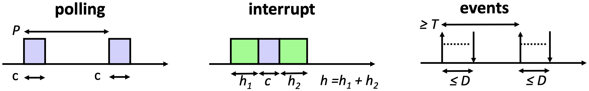

# Chapter 1: Introduction

## 1.1 Impact

**Embedded systems** are information processing systems embedded into a larger product. Usually they use feedback to influence the dynamics of the physical world by taking smart decisions in the cyber world.

{width=50%}

## 1.2 Facts

Embedded systems are often _reactive:_ reactive systems must react to stimuli from the system environment.

> "A reactive system is one which is in continual interaction with its environment and executes at a pace determined by that environment" - Bergé, 1995

ES often must meet _real-time constraints:_ For hard real-time systems, right answers arriving too late are wrong. All other time-constraints are called soft. A _guaranteed system response_ has to be explained without statistical arguments.

> "A real-time constraint is called hard, if not meeting that constraint could result in a catastrophe" - Kopetz, 1997

It is essential to _predict_ how a cyber-physical system (CPS) is going to behave under any circumstances before it is deployed. CPS must _operate dependably,_ safely, securely, efficiently and in real-time.

ES must be _efficient:_

- Energy efficient
- Code-size and data memory efficient
- Run-time efficient
- Weight efficient
- Cost efficient

ES are often _specialized_ towards a certain application or application domain: Knowledge about the expected behavior and the system environment at design time is exploited to _minimize resource usage_ and to _maximize predictability and reliability._

## 1.3 Trends

Some trends of embedded systems:

- ES communicating with each other, with servers or with the cloud. Communication is increasingly.
- Higher degree of integration on a single chip or integrated components:
    - Memory + processor + I/O units + communication
    - Use of networks-on-chip for communication between units
    - Use of homogeneous or heterogeneous multiprocessor system on a chip (MPSoC)
- Low power and energy constraints (especially for portable or unattended devices) are increasingly important, as well as temperature constraints
- There is increasing interest in energy harvesting to achieve long term autonomous operation

# Chapter 2: Software Development

_Reminder:_ Compilation of a C program to machine language works as follows:

{width=50%}

The main chain-of-events for **embedded software developments** is given by the following diagram:

{width=75%}

Software development is nowadays usually done with the support of an IDE:

- Edit and build the code
- Debug and validate the code

A better overview on how this works with embedded systems is given below:

{width=75%}

# Chapter 3: Hardware Software Interface

## 3.1 Storage

### 3.1.1 SRAM / DRAM / Flash

In a **static random access memory (SRAM),** single bits are stored in bit-stable circuits. SRAM is used for:

- Caches
- Register files within the processor core
- Small but fast memories

{width=34%}

If we want to _read_ from SRAM:

1. Pre-charge all bit-lines to average voltage
2. Decode the address ($n + m$ bits)
3. Select the row of cells using $n$ single-bit _word lines (WL)_
4. Selected bit-cells drive all _bit-lines (BL)_ ($2^m$ pairs)
5. Sense difference between bit-line pairs and read out

If we want to _write_ to SRAM:

1. Select row and overwrite the bit-lines using strong signals

In **dynamic random access memory (DRAM),** single bits are stored as charges in capacitors:

- Bit cells lose their charge when they are read, and they drain over time
- Slower access than with SRAM due to small storage capacity in comparison to the capacity of bit-lines
- Higher density than SRAM (1 vs. 6 transistors per bit)

DRAMs require _periodic refresh_ of charge:

- Performed by the memory controller
- Refresh interval is tens of ms
- DRAM is unavailable during refresh

A typical _access process_ for DRAM is given by the following four steps:

1. Bus transmission from CPU to memory controller
2. Precharge and row access from memory controller to row decoder and then from memory array to the sense amps.
3. Column access from memory controller to column decoder and then from sense amps to the data in/out buffers.
4. Data transfer and bus transmission from data in/out buffers to memory controller and from there via the bus to the CPU.

**Flash memory** is electrically modifiable, non-volatile storage. It has the following principle of operation:

- Transistors with a second "floating" gate
- Floating gate can trap electrons
- This results in a detectable change in threshold voltage

{width=50%}

### 3.1.2 Memory Map

We look at the **memory map** by exploring the example of the MSP432. Its _available memory_ is given by:

- 265 kB of built-in flash memory
- 64 kB SRAM
- 32 kB ROM (read-only memory)

The _address space_ is built up as follows:

- The processor uses 32 bit addresses. Therefore, the addressable memory space is $4 \text{ GByte} = 2^{32} \text{ Byte}$ as each memory location corresponds to 1 Byte.
- The address space is used to address the memories (reading and writing), to address the peripheral units, and to have access to debug and trace information.
- The address space is partitioned into zones, each one with a dedicated use.

_Example:_ The following is a simplified description to introduce the basic concepts:

{width=75%}

## 3.2 Input and Output

Very often, a processor needs to _exchange information with other processors_ or devices. To satisfy the various needs, there exist many _communication protocols,_ such as:

- Universal Asynchronous Receiver-Transmitter (UART)
- Serial Peripheral Interface Bus (SPI)
- Inter-Integrated Circuit (I2C)
- Universal Serial Bus (USB)

AS the principals are similar, we will just explain a representative of an asynchronous protocol (UART) and one of a synchronous protocol (SPI).

### 3.2.1 UART Protocol

The **Universal Asynchronous Receiver-Transmitter (UART)** protocol provides _serial communication_ of bits via a single signal, i.e. UART provides parallel-to-serial and serial-to-parallel conversion. The sender and the receiver need to _agree on the transmission rate._ Transmission of a serial packet starts with a start bit, followed by data bits and is finalized by using a stop bit:

{width=50%}

The receiver runs an _internal clock_ whose frequency is an exact multiple of the expected bit rat. When a _start bit_ is detected, a counter begins to count clock cycles, e.g. 8 cycles, until the midpoint of the anticipated start bit is reached. The clock counter counts a further 16 cycles, to the middle of the first _data bit,_ and so on until the _stop bit:_

{width=50%}

### 3.2.2 Memory Mapped Device Access

The configuration of the transmitter and the receiver must match, otherwise they cannot communicate. Examples of configurable parameters are:

- Transmission rate
- LSB or MSB first
- Number of bits per packet
- Parity bit
- Number of stop bits
- Interrupt-based communication
- Clock source

{width=50%}

The _clock subsampling_ block is complex, as one tries to match a large set of transmission rates with a fixed input frequency. The clock source is based on the quartz frequency (48 MHz), divided by 16 and then connected to SMCLK (in the labs, the SMCLK frequency is therefore 3 MHz).

### 3.2.3 SPI Protocol

The **Serial Peripheral Interface Bus (SPI)** protocol is typically used to communicate across short distances. It has the following characteristics:

- 4-wire synchronized (clocked) communication bus
- Supports single master and multiple slaves
- Always full-duplex: Communication is in both directions simultaneously
- Multiple Mbps transmission speeds can be achieved
- Transfer data in 4 to 16-bit serial packets

The _bus wiring_ is built-up as follows:

- MOSI (Master Out Slave In) - carries data out of the master to the slave
- MISO (Master In Slave Out) - carries data out of the slave to the master
- Both MOSI and MISO are active during every transmission
- $\bar{SS}$ (or CS) - signal to select each slave chip
- System clock SCLK - produced by the master to synchronize transfer

{width=50%}

_Example:_ The diagram below shows two examples of how a bus can be configured:

{width=75%}

## 3.3 Interrupts

### 3.3.1 Introduction

A **hardware interrupt** is an electronic alerting signal sent to the CPU from another component, either from an internal peripheral or from an external device.
The **nested vector interrupt controller (NVIC)** handles the processing of interrupts.

The way how usual ES programs look is shown by this figure:

{width=10%}

- System initialization: The beginning part of `main()` is usually dedicated to setting up your system
- Background: Most systems have an endless loop that runs forever. The background loop often contains a _low power mode (LPMx)_ command - this sleeps the CPU until an interrupt event wakes it up.
- Foreground: **Interrupt Service Routine (ISR)** runs in response to enabled hardware interrupt. These events may change modes in the background.

### 3.3.2 Processing Of Interrupts

The **vector interrupt controller (NVIC):**

- Enables and disables interrupts
- Allows to individually and globally _mask interrupts_
- Registers _interrupt service routines_ and sets the priority of interrupts.

{width=34%}

_Interrupt priorities_ are relevant if:

- Several interrupts happen at the same time
- The programmer does not mask interrupts in an ISR and therefore, _preemption of an ISR_ by another ISR may happen (_interrupt nesting_).

The **processing of an interrupt** proceeds with the steps given below:

1. An interrupt occurs: Most peripherals can generate interrupts to provide status and information.
2. It sets a flag bit in a register (_IFG register_): When an interrupt signal is received, a corresponding bit is set in the IFG register. There is such an IFG register for each interrupt source. As some interrupt sources are only on for a short duration, the CPU register the interrupt signal internally.
3. CPU/NVIC acknowledges interrupt by:
    1. Current instruction completes
    2. Saves return-to location on the stack
    3. Masks interrupts globally
    4. Determines source of interrupt
    5. Calls interrupt service routine
4. The interrupt service routine:
    1. Saves context of system
    2. Runes the interrupt's code
    3. Restores the context of the system
    4. Automatically unmasks interrupts and
    5. Continues where it left off

### 3.3.3 Polling vs. Interrupt

We compare **polling** and **interrupt** based on the utilization of the CPU by using a simplified timing model. Some important definitions:

- _Utilization_ $u$: average percentage, the processor is busy
- _Computation_ $c$: processing time of handling the event
- _Overhead_ $h$: time overhead for handling the interrupt
- _Period_ $P$: polling period
- _Interarrival time_ $T$: minimal time between two events
- _Deadline_ $D$: maximal time between event arrival and finishing event processing with $D \leq T$

{width=80%}

For the following considerations, we suppose that the interarrival time between events is $T$. This makes the results a bit easier to understand.

Some relations for _interrupt-based_ event processing:

- The average utilization is $u_i = (h + 1c) / T$
- As we need at least $h + c$ time to finish the processing of an event, we find the following constraint: $h + c \leq D \leq T$

Some relations for _polling-based_ event processing:

- The average utilization is $u_p = c / P$
- We need at least time $P + c$ to process an event that arrives shortly after a polling took place. The polling period $P$ should be larger than $c$. Therefore, we find the following constraints $2c \leq c + P \leq D \leq T$

_Design problem:_ $D$ and $T$ are given by application requirements. $h$ and $c$ are given by the implementation. When to use interrupts and when polling considering the resulting system utilization? What is the best value for the polling period $P$?

- If $D < c < c + \min(c, \, h)$ then event processing is not possible
- If $2c \leq D < h + c$ then only polling is possible. The maximal period $P = D - c$ leads to the optimal utilization $u_p = c / (D - c)$
- If $h + c \leq D < 2c$ then only interrupt is possible with $u_i = (h + c) / T$
- If $c + \max(c, \, h) \leq$ then both are possible with $u_p = c / (D - c)$ or $u_i = (h + c) / T$

Interrupt gets better in comparison to polling, if the deadline $D$ for processing interrupts gets smaller in comparison to the interarrival time $T$, if the overhead $h$ gets smaller in comparison to the computation time $c$, or if the interarrival time of events is only lower bounded by $T$.

## 3.4 Clocks and Timers

### 3.4.1 Clocks

Microcontrollers usually have many _clock sources_ that have different:

- Frequencies
- Energy consumption
- Stability (i.e. crystal-controlled clock vs. digitally controlled oscillators)

From the basic clocks, several internally available clock signals are derived. They can be used for clocking peripheral units, the CPU, the memory, and the various timers.

### 3.4.2 Watchdog Timer

**Watchdog timers** provide system fail-safety:

- If their counter ever rolls over (back to zero), they _reset the processor._ The goal here is to prevent your system from being inactive (deadlock) due to some unexpected fault.
- To prevent your system from continuously resetting itself, the counter should be reset at appropriate intervals:

{width=80%}

### 3.4.3 System Tick

**SysTick** is a simple decrementing 24 bit counter that is part of the NVIC controller. Its clock source is MCLK, and it reloads to period 1 after reaching 0. It is a very simple timer, mainly used for periodic interrupts or measuring time.

_Example:_ If MCLK has a frequency of 3 MHz, the counter rolls over every 5.6 seconds as $(2^{24}/(3 \cdot 10^6)) = 5.59$.

### 3.4.4 Timers and PWM

Usually, embedded microprocessors have several elaborate **timers** that allow to:

- capture the current time or time differences, triggered by hardware or software events
- generate interrupts when a certain time is reached
- generate interrupts when counter overflows
- generate periodic interrupts, for example in order to periodically execute tasks
- generate specific output signals, for example _pulse width modulation (PWM)_

Typically, the mentioned functions are realized via _capture and compare registers:_

- **Capture:**
    - the value of counter register is stored in the capture register at the time of the _capture event_
    - the value can be read b software
    - at the time of the capture, further actions can be triggered
- **Compare:**
    - the value of the compare register can be set by software
    - as soon as the values if the counter and compare register are equal, compare actions can be taken such as interrupt, signaling peripherals, changing pin values, resetting the counter register

{width=80%}

The **pulse width modulation (PWM)** can be used to change the average power of a signal. The use case could be to change the speed of a motor or to modulate the light intensity of an LED.

# Chapter 4: Programming Paradigms

## 4.1 Reactive Systems and Timing

### 4.1.1 Timing Guarantees

_Hard real-time systems_ can often be found in safety-critical applications. They need to provide the result of a computation within a fixed time bound.

Typical application domains are: avionics, automotive, train systems, automatic control including robotics, manufacturing, and media content production.

_Example:_ The side-airbag in a car needs to react after an event in less than 10 ms.

### 4.1.2 Real-Time Systems

In many _cyber-physical systems (CPSs),_ correct timing is a matter of correctness, not performance: an answer arriving too late is considered to be an error.

A simplified **real-time system** looks like this:

{width=50%}

Embedded controllers are often expected to finish the processing of data and events reliably within defined time bounds. Such a processing may involve seqeunces of computations and communications. Essential for the analysis and design of a real time system: _upper bounds on the execution times_ of all tasks are statically known. This also includes the communication of information via wired or wireless connection.

This value is commonly galled the _worst-case execution time (WCET)._ Analogously, one can define the lower bound on the execution time, the _best-case execution time (BCET)._

### 4.1.3 Execution Times

Modern processors increase the average performance by using caches, pipelines, branch prediction, and speculation techniques, for example. These features make the computation of the WCET very difficult. The microarchitecture has a large _time-varying internal state_ that is changed by the execution of instructions and that influence the execution times of instructions:

- Best-case: everything goes smoothly: no cache-miss, operands are ready, needed resources are free, branches are correctly predicted.
- Worst-case: everything goes wrong: all loads miss the cache, resources needed are occupied, operands are not ready.
- The span between the best case and worst case may be several hundred cycles!

The complexity for determining the WCET of tasks is:

- In the general case, it is undecidable whether a finite bound exists.
- For restricted classes of programs it is possible, in principle.

Analytic (formal) approaches exist for hardware and software:

- In case of software, it requires the analysis of the program flow and the analysis of the hardware. Bot are combined in a complex analysis flow.
- For the rest of the lecture, we assume that reliable bounds on the WCET are available.

## 4.2 Different Programming Paradigms

### 4.2.1 Overview

The concept of _concurrent tasks_ reflects our intuition about the functionality of embedded systems. Tasks help us manage the complexity of concurrent activities as happening in the system environment:

- Input data arrives from various sensors and input devices.
- The system may also receive asynchronous input events.

There are many structured ways of programming an embedded system. In this lecture, only the main principles will be covered:

- Time triggered approaches:
    - Periodic
    - Cyclic
    - Generic time-triggered scheduler
- Event triggered approaches
    - non-preemptive
    - preemptive

### 4.2.2 Time-Triggered Systems

The **pure time-triggered model** has the following characteristics:

- no interrupts are allowed, except by timers
- the schedule of tasks is computed off-line and therefore, complex sophisticated algorithms can be used
- the scheduling at run-time is fixed and therefore, it is _deterministic_
- the interaction with environment happens through _polling_

{width=50%}

With a **simple periodic TT scheduler,** a timer interrupts regularly with period $P$. All tasks have the same period $P$.

{width=50%}

Properties:

- later tasks, for example $T_2$ and $T_3$, have unpredictable starting times
- the communication between tasks or the use of common resources is safe, as there is a static ordering of tasks
- as necessary precondition, the sum WCETs of all tasks within a period is bounded by the period:

$$
\sum_k WCET(Z_k) < P
$$

With a **time-triggered cyclic executive scheduler** we assume that tasks may have different periods. To accommodate this situation, the period $P$ is _partitioned into frames_ of length $f$.

{width=50%}

We have a problem to determine a feasible schedule, if there are tasks with a long execution time. Long tasks could be partitioned into a sequence of short sub-tasks, but this is a tedious and error-prone process.

When a control application consists of several concurrent periodic tasks with individual timing constraints, the schedule has to guarantee that each periodic instance is regularly activated at its proper rate and is completed within its deadline.

Definitions:

- $\Gamma$: denotes the set of all periodic subtasks
- $\tau_i$: denotes a periodic task
- $\tau_{i, \, j}$: denotes the $j$-th instance of task $i$
- $r_{i, \, j}, \, d_{i, \, j}$: denote the release time and absolute deadline of the $j$-th instance of task $i$
- $\Phi_i$: denotes the phase of task $i$ (release time of its first instance)
- $D_i$: denotes the relative deadline of task $i$

_Example:_ The following figures show an example of a single periodic task $\tau_i$ (1) and an example of a set of periodic tasks $\Gamma$ (2):

{width=34%}

{width=75%}

The following _hypotheses_ are assumed on the tasks:

- The instances of a periodic task are regularly activated at a constant rate. The interval $T_i$ between two consecutive activations is called period. The release times satisfy:

$$
r_{i, \, j} = \Phi_i + (j-1)T_i
$$

- All instances have the same worst-case execution time $C_i$.
- All instances of a periodic task have the same relative deadline $D_i$ Therefore, the absolute deadlines satisfy:

$$
d_{i, \, j} = \Phi_i + (j-1)T_i + D_i
$$

_Example:_ The following diagram shows an example of time-triggered cyclic executive scheduling with 4 tasks:

{width=75%}

Some conditions for period $P$ and frame length $f$:

- A task executes at most once within a frame: $f \leq T_i \forall \tau_i$
- $P$ is a multiple of $f$
- Period $P$ is the least common multiple of all periods $T_k$
- Tasks start and complete within a single frame: $f \geq C_i \forall \tau_i$
- Between release time and deadline of every task there is at least one full frame:

$$
2f - \text{gcd}(T_i, \, f) \leq D_i \forall \tau_i
$$

_Example:_ The figure below shows an example of a cyclic executive scheduling:

{width=75%}

If we want to _check for the correctness of a schedule_ we proceed as follows:

- $f_{i, \, j}$ denotes the number of the frame in which that instance $j$ of task $\tau_i$ executes
- Is $P$ a multiple of all periods $T_i$?
- Is $P$ a multiple of $f$?
- Is the frame sufficiently long?

$$
\sum_{\{i \, | \, f_{i, \, j} = k \}} C_i \leq f \quad \forall 1 \leq k \leq \frac{P}{f}
$$

- Determine offsets such that instances of tasks start after their release time:

$$
\Phi_i = \min_{1 \leq j \leq P/T_i} \{(f_{i, \, j} - 1)f - (j-1)T_i \} \quad \forall \tau_i
$$

- Are deadlines respected?

$$
(j-1)T_i + \Phi_i + D_i \geq f_{i, \, j}f \quad \forall \tau_i, \, 1 \leq j \leq \frac{P}{T_i}
$$

Finally, we look at **generic time-triggered schedulers.**

In an entirely time-triggered system, the temporal control structure of all tasks is established a priori by off-line support-tools. This temporal control structure is encoded in a _Task-Descriptor List (TDL)_ that contains the cyclic schedule for all activities of the node. This schedule considers the required precedence and mutual exclusion relationships among the tasks such that an explicit coordination of the tasks by the operating system at run time is not necessary. The dispatcher is activated by a synchronized clock tick.

Summary for _time-triggered schedulers:_

- Properties:
    - deterministic schedule, conceptually simple, relatively easy to validate, test, and certify
    - no problems in using shared resources
    - external communication only via polling
    - inflexible as no adaption to the environment
    - serious problems if there are long tasks
- Extensions:
    - allow interrupts -> be careful with shared resources and the WCET of tasks
    - allow preemtable background tasks
    - check for task overruns (execution time longer than WCET) using a watchdog timer
