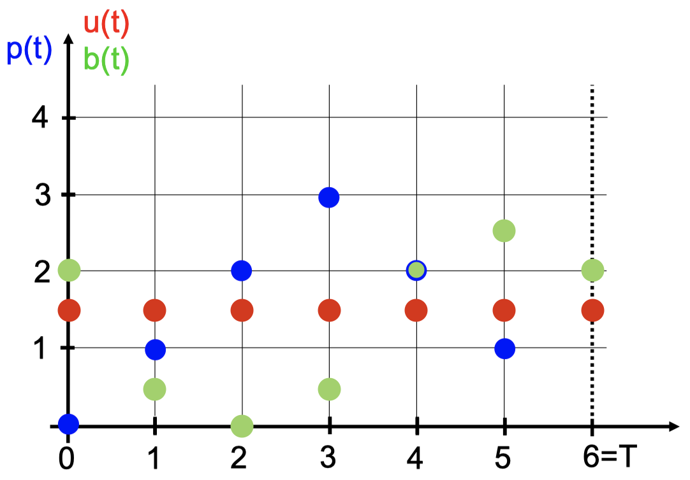

## 9.6 Battery-Operated Systems and Energy Harvesting

### 9.6.1 Introduction

Battery operation is mainly due to no continuous battery source being availability and mobility. With respect to this, **energy harvesting** is interesting because:

- prolong lifetime of battery-operated devices
- infinite lifetime using rechargeable batteries
- autonomous operation

_Example:_ Characteristics of a solar panel:

- Variable output power:
    - Illuminance level
    - Electrical operation point
    - Temperature, age,...
- I-V-Characteristics
    - Non-linear
    - Dependent on ambient
- Maximum power point tracking
    - Dynamic algorithm to find $P^*$

{width=34%}

### 9.6.2 Maximal Power Point Tracking

A simple **maximal power point tracking algorithm** looks as follows:

{width=50%}

The typical challenges in (solar) harvesting systems are as follows:

- What is the optimal maximum capacity of the battery?
- What is the optimal area of the solar cell?
- How can we control the application such that a continuous system operation is possible, even under varying input energy?

### 9.6.3 Application Control

A controller can adapt the service of the consumer device, for example the sampling rate for its sensors or the transmission rate of information. As a result, the power consumption changes proportionally. A _precondition for correctness_ of application control is to never run out of energy. Example for an optimality criterion could be to maximize the lowest service of the consumer.

_Formal model:_

{width=50%}

- harvested and use energy in $[t, \, t+1]$: $p(t)$ and $u(t)$
- battery model: $b(t + 1) = \min\{b(t) + p(t) - u(t), \, B \}$
- failure state: $b(t) + p(t) - u(t) < 0$
- utility: $U(t_1, \, t_2) = \sum_{t_1 \leq \tau < t_2} \mu(u(\tau))$

_Remark:_ $\mu$ is a strictly concave function. Higher used energy gives a reduced reward for the overall utility.

What do we want? We would like to determine an optimal control $u^*(t)$ for the time interval $[t, \, t + 1)$ for all $t$ in $[0, \, T)$ with the following properties:

- $\forall 0 \leq t < T : b^*(t) + p(t) - u^*(t) \geq 0$
- There is no feasible use function $u(t)$ with a larger minimal energy: $\forall u : \min_{0 \leq t < T} \{u(t) \} \leq \min_{0 \leq t < T} \{u^*(t) \}$
- The use function maximizes the utility $U(0, \, T)$.
- We suppose that the battery has the same or better state at the end than at the start of the interval, i.e. $b^*(T) \geq b^*(0)$.

> **Theorem:** Given a use function $u^*(t), \, t \in [0, \, T),$ such that the system never enters a failure state. If $u^*(t)$ is optimal with respect to maximizing the minimal used energy among all use functions and maximizes the utility $U(t, \, T)$, then the following relations hold for all $\tau \in (0, \, T)$:
> $$
> u^*(\tau - 1) < u^*(\tau) \Rightarrow b^*(\tau) = 0 \quad \text{empty battery} \\
> u^*(\tau - 1) > u^*(\tau) \Rightarrow b^*(\tau) = B \quad \text{full battery}
> $$

How can we efficiently compute an optimal use function?

- There are several options available as we just need to solve a convex optimization problem.
- A simple but inefficient possibility is to convert the problem into a linear program.

At first, suppose that the utility is simply given by $U(0, \, T) = \sum_{0 \leq \tau < T} u(\tau)$. Then, the linear program has the form:

- maximize $\sum_{0 \leq \tau < T}u(\tau)$
- $\forall \tau \in [0, \, T) : b(\tau + 1) = b(\tau) - u(\tau) + p(\tau)$
- $\forall \tau \in [0, \, T) : 0 \leq b(\tau + 1) \leq B$
- $\forall \tau \in [0, \, T) : u(\tau) \geq 0$
- $b(T) = b(0) = b_0$

_Example:_ You are given the following graph, showing the amount of energy we are harvesting during 6 time units:

{width=34%}

If we want to determine the battery capacity and the optimal utilization, we proceed as follows:

1. In total, we harvest $1 + 2 + 3 + 2 + 1 = 9$ energy, which leads to an optimal utilization (over 6 time units) of $\frac{9}{6} = 1.5$ (shown with the red dots).
2. Determine the _critical point_ for the battery capacity and allow the capacity to be $0$ there. In our case that's at $T = 2$, since the previous two time intervals we used more energy than we were harvesting.
3. Determine the battery capacity for the other time units based on $b(2) = 0$ (shown with the green dots).
4. Check that $b^*(0) \geq b^*(T)$.

{width=34%}

But what happens if the estimation of the future incoming energy is not correct?

- If it was correct, then we would just compute the whole future application control now and would not change anything anymore.
- This will not work as errors will accumulate, and we will end up with many infeasible situations, i.e. the battery is completely empty, and we are forced to stop the application.
- One possibility to overcome this problem is given by **finite horizon control:**
    - At time $t$, we compute the optimal control using the currently available battery state $b(t)$ with predictions $\sim{p}(\tau)$ for all $t \leq \tau < t + T$ and $b(t + T) = b(t)$.
    - From the computed optimal use function $u(\tau)$ for all $t \leq \tau < t + T$ we just take the first use value $u(t)$ in order to control the application.
    - At the next time step, we take as initial battery state the actual state. Therefore, we take mispredictions into account. For the estimated future energy, we also take the new estimations.
