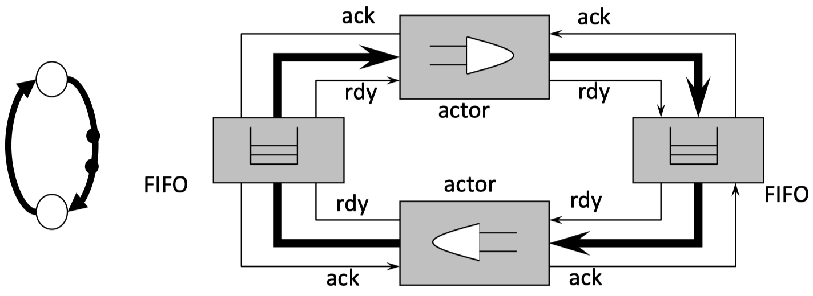

# Chapter 10: Architecture Synthesis

## 10.1 Introduction

The goal of **architecture synthesis** is to determine a hardware architecture that efficiently executes a given algorithm. The major tasks are:

- _Allocation:_ determine the necessary hardware resources
- _Scheduling:_ determine the timing of individual operations
- _Binding:_ determine the relation between individual operations of the algorithm and hardware resources

Synthesis methods can often be applied independently of granularity of algorithms, e.g. whether an operation is a whole complex task or a single operation.

## 10.2 Specification Models

_Formal specification_ of the desired functionality and the structure of an embedded system is a necessary step for using computer aided design methods. There exist _many formalism_ and models of computation, see also the models used for real-time software and general specification models for the whole system.

### 10.2.1 Dependence Graph (DG)

A **dependence graph** is a directed graph $G = (V, \, E)$ in which $E \subseteq V \times V$ is a partial order. If $(v_1, \, v_2) \in E$, then $v_1$ is called an _immediate predecessor_ of $v_2$ and $v_2$ is called an _immediate successor_ of $v_1$. Suppose $E^*$ is the transitive closure of $E$. If $(v_1, \, v_2) \in E^*$, then $v_1$ is called a _predecessor_ of $v_2$ and $v_2$ is called a _successor_ of $v_1$.

A dependence graph describes the order of relations for the execution of single operations or tasks. Nodes correspond to tasks or operations, edges correspond to relations ("execute after"). A dependence graph is _acyclic._

_Example:_

{width=70%}

### 10.2.2 Marked Graph (MG)

A **marked graph** $G = (V, \, A, \, del)$ consists of:

- nodes $v \in V$
- edges $a = (v_i, \, v_j) \in A, \, A \subseteq V \times V$
- number of initial tokens (_markings_) on edges $del : A \to \mathbb{Z}^{\geq 0}$

The **marking** is often represented in forms of a vector, i.e.

$$
del = \begin{bmatrix} del_1 \\ \cdots \\ del_i \\ cdots \\ del_{|A|}  \end{bmatrix}
$$

{width=50%}

The **token** on the edges correspond to the data that is stored in FIFO queues. A _node_ is called **activated** if on every input edge there is at least one token. A node can _fire_ if it is activated. The **firing of a node** $v_i$ removes from each input edge a token and adds a token to each output edge. The output token correspond to the processed data.

_Example:_ Consider the following diagram which models a digital filter with infinite impulse response (IIR):

{width=50%}

There are different possibilities to implement marked graphs in hardware or software directly. Only the most simple possibilities are shown here:

- Hardware implementation as a synchronous digital circuit:
    - Actors are implemented as combinatorial circuits.
    - Tokens correspond to synchronously clocked shift registers

{width=50%}

- Hardware implementation as a self-timed asynchronous circuit:
    - Actors and FIFO registers are implemented as independent units.
    - The coordination and synchronization of firings is implemented using a handshake protocol.
    - Delay insensitive direct implementation of the semantics of marked graph.

{width=50%}

### 10.2.3 Models for Architecture Synthesis

- A **sequence graph** $G_S = (V_S, \, E_S)$ is a dependence graph with a single start node and a single end node. $V_S$ denotes the operations of the algorithm and $E_S$ denotes the dependence relations.
- A **resource graph** $G_R = (V_R, \, E_R), \, V_R = V_S \cup V_T$ models resource bindings. $V_T$ denotes the resource types of the architecture and $G_R$ is a bipartite graph. An edge $(v_s, \, v_t) \in E_R$ represents the availability of a resource type $v_t$ for an operation $v_s$.
- The **cots function** is defined as $c : V_T \to \mathbb{Z}$.
- The **execution times** $w : E_R \to \mathbb{Z}^{\geq 0}$ are assigned to each edge $(v_s, \, v_t) \in E_R$ and denote the execution time of operation $v_s \in V_S$ on resource type $v_t \in V_T$.

_Example:_ Consider the following algorithm for differential equation:

```c
int diffeq(int x, int y, int u, int dx, int a) {
    int x1, u1, y1;
    while(x < a) {
        x1 = x + dx;
        u1 = u - (3 * x * u * dx) - (3 * y * dx);
        y1 = y + u * dx;
        x = x1;
        u = u1;
        y = y1;
    }
}
```

The corresponding _sequence graph_ $G_S = (V_S, \, E_S)$ is given by:

{width=34%}

The corresponding _resource graph_ with one instance of a multiplier (cost 8) and one instance of an ALU (cost 3) is given by:

{width=34%}

Some more definitions:

- An **allocation** is a function $\alpha : V_T \to \mathbb{Z}^{\geq 0}$ that assigns to each resource type $v_t \in V_T$ the number $\alpha(v_t)$ of available instances.
- A **binding** is defined by functions $\beta : V_S \to V_T$ and $\gamma : V_S \to \mathbb{Z}^{\geq 0}$. Here, $\beta(v_s) = v_t$ and $\gamma(v_s) = r$ denote that operation $v_s \in V_S$ is implemented on the $r$-th instance of resource type $v_t \in V_T$.
- A **schedule** is a function $\tau : V_S \to \mathbb{Z}^{> 0}$ that determines the starting times of operations. A schedule is feasible if the conditions $\tau(v_j) - \tau(v_i) \geq w(v_i) \, \forall (v_i, \, v_j) \in E_S$ are satisfied. $w(v_i) = w(v_i, \, \beta(v_i))$ denotes the execution time of operation $v_i$.
- The **latency** $L$ of a schedule is the time difference between start node $v_0$ and end node $v_n$: $L = \tau(v_n) - \tau(v_0)$.

An _example binding_ with $\alpha(r_1) = 4$ and $\alpha(r_2) = 2$ of our previous differential example could be:

{width=50%}

An _exampling scheduling_ with $L = \tau(v_12) - \tau(v_0) = 7$ is shown below:

{width=34%}

## 10.3 Multiobjective Optimization

Architecture synthesis is an optimization problem with more than one objective:

- Latency of the algorithm that is implemented
- Hardware cost (memory, communication, computing units, etc.)
- Power and energy consumption

Optimization problems with several objects are called **multiobjective optimization problems.** Synthesis or design problems are usually multiobjective.

A solution $a \in X$ weakly **Pareto-dominates** a solution $b \in X$, denoted as $a \preceq b$, if it is at least as good in all objectives, i.e. $f_i(a) \leq f_i(b)$ for all $1 \leq i \leq n$. Solution $a$ is better than $b$, denoted as $a \prec b$, iff. $(a \preceq b) \land (b \npreceq a)$.

{width=50%}

A solution is named **Pareto-optimal,** if it is not Pareto-dominated by any other solution in $X$. The set of all Pareto-optimal solutions is denoted as the **Pareto-optimal set** and its image in objective space as the **Pareto-optimal front.**

## 10.4 Architecture Synthesis without Resource Constraints

### 10.4.1 Introduction

The corresponding scheduling method can be used:

- as a preparatory step for the general synthesis problem
- to determine bounds on feasible schedules in the general case
- if there is a dedicated resource for each operation

> Given is a sequence graph $G_S(V_S, \, E_S)$ and a resource graph $G_R(V_R, \, E_R)$. Then the latency minimization without resource constraints with $\alpha(v_i) \to \infty$ for all $v_i \in V_T$ is defined as:
>
> $$
> L = \min\{\tau(v_n) - \tau(v_0) : \tau(v_j) - \tau(v_i) \geq w(v_i, \, \beta(v_i)) \, \forall (v_i, \, v_j) \in E_S \}
> $$

### 10.4.2 ASAP Algorithm

The **ASAP Algorithm** is given by:

```pseudo
ASAP(G_S(V_S, E_S), w) {
    tau(v_0) = 1;
    REPEAT {
        Determine v_i whose predecessors are planed;
        tau(v_i) = max{tau(v_j) + w(v_j) forall (v_j, v_i) in E_S};
    } UNTIL (v_n is planned);
    RETURN (tau);
}
```

_Example_ with $w(v_i) = 1$:

{width=34%}

### 10.4.3 ALAP Algorithm

The **ALAP Algorithm** is given by:

```pseudo
ALAP(G_S(V_S, E_S), w, L_{max}) {
    tau(v_n) = L_{max} + 1;
    REPEAT {
        Determine v_i whose successors are planed;
        tau(v_i) = min{tau(v_j) forall (v_i, v_j) in E_S} - w(v_i);
    } UNTIL (v_0 is planned)
    RETURN (tau);
}
```

_Example_ with $L_{max} = 7$ and $w(v_i) = 1$:

{width=34%}

## 10.5 Architecture Synthesis with Resource Constraints

### 10.5.1 List Scheduling

**List scheduling** is one of the most widely used algorithms for scheduling under resource constraints. Its principles are:

- To each operation there is a priority assigned which denotes the urgency of being scheduled. This priority is static, i.e. determined before the list scheduling.
- The algorithm schedules one time step after the other
- $U_k$ denotes the set of operations that (a) are mapped onto resource $v_k$ and (b) whose predecessors finished.
- $T_k$ denotes the currently running operations mapped to resource $v_k$.

The **list scheduling algorithm** is given as:

```pseudo
LIST(G_S(V_S, E_S), G_R(V_R, E_R), alpha, beta, priorities) {
    t = 1;
    REPEAT {
        FORALL v_k in V_T {
            Determine candidates to be scheduled U_k;       // v in V_S with beta(v) = v_k
            Determine running operations T_k;
            Choose S_k subseteq U_k with maximal priority and |S_k| + |T_k| <= alpha(v_k);
            tau(v_i) = t forall v_i in S_k;
        }
        t = t + 1;
    } UNTIL (v_n planned);
    RETURN (tau);
}
```

_Example:_ Consider the following sequence graph $G_S$ and resource graph $G_R$:

{width=50%}

A solution via list scheduling could look as follows:

{width=20%}

- In the example, the solution is independent of the chosen priority function.
- Because of the greedy selection principle, all resources are occupied in the first time step.
- List scheduling is a _heuristic_ algorithm: In this example, it does not yield the minimal latency!
