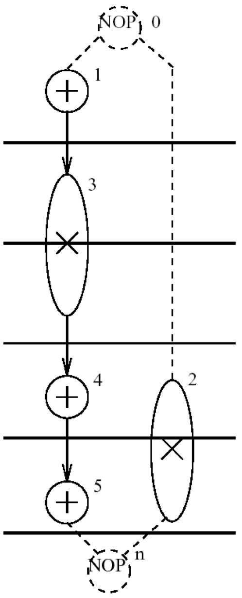
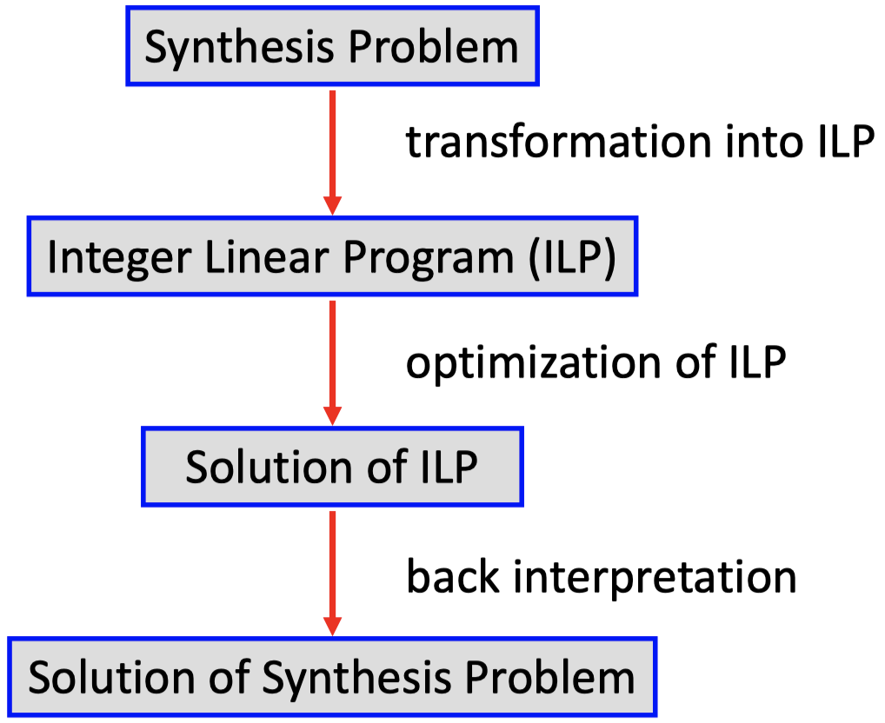
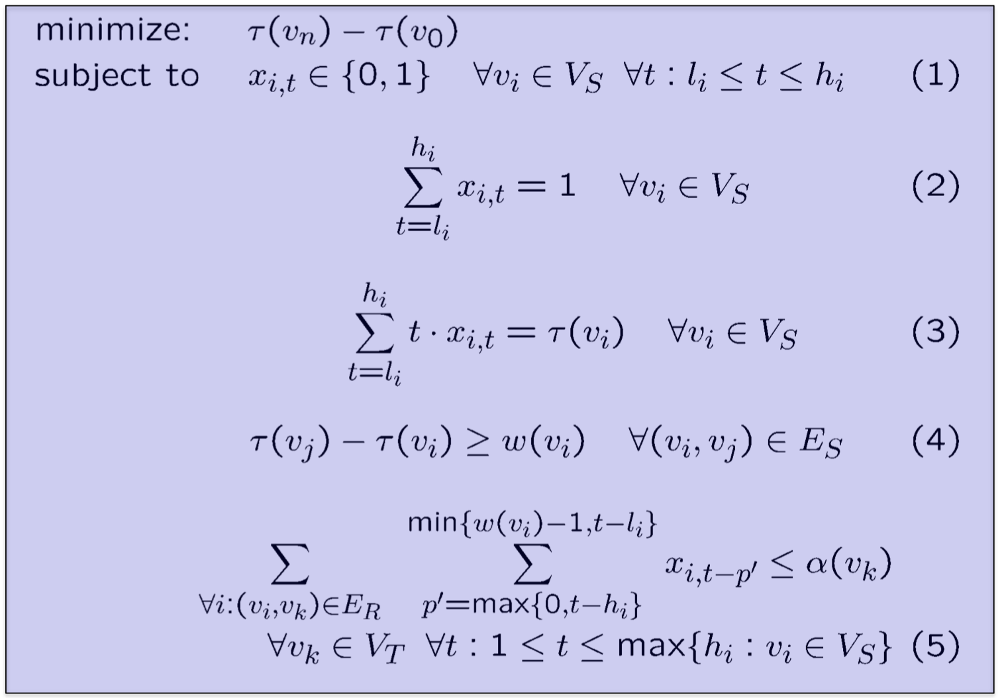
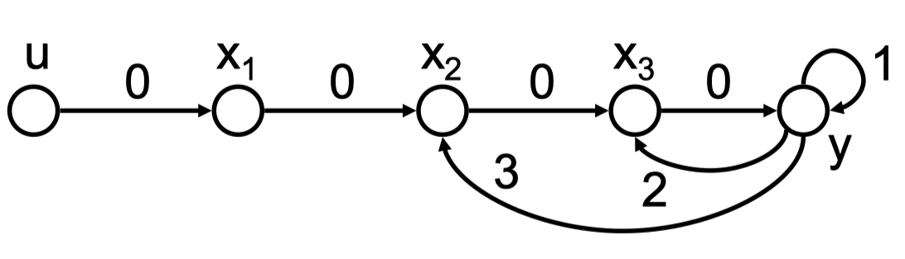
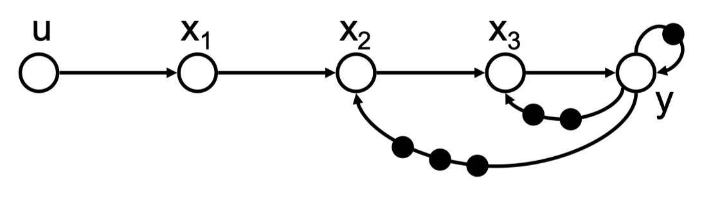
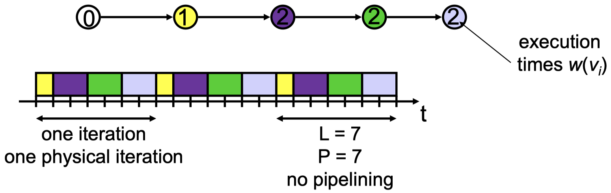
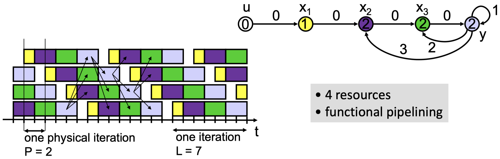

With an **optimal** solution the latency is even smaller than with "normal" list scheduling. An example of an optimal algorithm is the transformation into an _integer linear program_ as described next.

{width=20%}

## 10.5.2 Integer Linear Programming

The principle of using **integer linear programming (ILP)** for solving optimization problems is as follows:

{width=34%}

ILP yields the _optimal_ solution to the synthesis problem as it is based on an exact mathematical description of the problem. It solves scheduling, binding and allocation simultaneously.

For the following example, we use the following assumptions:

- The binding is determined already, i.e. every operation $v_i$ has a unique execution time $w(v_i)$.
- We have determined the earliest and latest starting times of operations $v_i$ as $l_i$ and $h_i$, respectively. To this end, we can use the ASAP and ALAP algorithms that have been introduced earlier. The maximal latency $L_{max}$ is chosen such that a feasible solution to the problem exists.

Then:

{width=50%}

_Explanations:_

1. declares variables $x$ to be binary
2. makes sure that exactly one variable $x_{i, \, t}$ for all $t$ has the value 1, all others are 0.
3. determines the relation between variables $x$ and starting times of operations $/tau$. In particular, if $x_{i, \, t} = 1$ then the operation $v_i$ starts at time $t$, i.e. $\tau(v_i) = t$.
4. guarantees that all precedence constraints are satisfied.
5. makes sure that the resource constraints are not violated. For all resource types $v_k \in V_T$ and for all time instances $t$ it is guaranteed that the number of active operations does not increase the number of available resource instances.

## 10.6 Architecture Synthesis for Iterative Algorithms and Marked Graphs

### 10.6.1 Introduction

**Iterative algorithms** consist of a set of indexed equations that are evaluated for all values of an index variable $l$:

$$
x_i[l] = F_i[..., \, x_j[l-d_{ji}],...] \quad \forall l \, \forall i \in I
$$

Here, $x_i$ denotes a set of indexed variables, $F_i$ denote arbitrary functions and $d_{ij}$ are constant index displacements.

We show different _representations_ of the same iterative algorithm:

- One indexed equation with constant index dependencies:

$$
y[l] = au[l] + by[l-1] + cy[l-2] + dy[l-3] \quad \forall l
$$

- Equivalent set of indexed equations

$$
\begin{aligned}
x_1[l] = au[l] \quad &\forall l \\
x_2[l] = x_1[l] + dy[l-3] \quad &\forall l \\ 
x_3[l] = x_2[l] + cy[l-2] \quad &\forall l \\
y[l] = x_3[l] + by[l-1] \quad &\forall l
\end{aligned}
$$

- _Extended sequence graph_ $G_s = (V_S, \, E_S, \, d)$: To each edge $(v_i, \, v_j) \in E_S$ there is associated the index displacement $d_{ij}$. An edge $(v_i, \, v_j) \in E_S$ denotes that the variable corresponding to $v_j$ depends on variable corresponding to $v_i$ with displacement $d_{ij}$.

{width=34%}

- Equivalent _marked graph:_

{width=34%}

### 10.6.2 Iterative Algorithms

Several terms concerning **iterative algorithms:**

- An _iteration_ is the set of all operations necessary to compute all variables $x_i[l]$ for a fixed index $l$.
- The _iteration interval_ $P$ is the time distance between two successive iterations of an iterative algorithm. $\frac{1}{P}$ denotes the _throughput_ of the implementation.
- The _latency_ $L$ is the maximal time distance between the starting and the finishing times of operations belonging to one iteration.
- In a pipelined implementation (_functional pipelining_), there exist time instances where the operations of different iterations are executed simultaneously.

The _implementation principles_ for iterative algorithms are as follows:

- A simple possibility, the edges with $d_{ij} > 0$ are removed from the extended sequence graph. The resulting simple sequence graph is implemented using standard methods. Example with unlimited resources:

{width=34%}

- Using **functional pipelining:** Successive iterations overlap and a higher throughput ($\frac{1}{P}$) is obtained. Example with unlimited resources but _data dependencies across iterations:_

{width=50%}

Again, we can use _integer linear programming_ to solve the synthesis problem for iterative algorithms:

- Starting points is the ILP formulation given for simple sequence graphs
- Now, we use the extended sequence graph
- ASAP and ALAP scheduling for upper and lower bounds $h_i$ and $l_i$ use only edges with $d_{ij} = 0$
- We suppose, that a suitable _iteration interval_ $P$ is chosen beforehand. If this is too small, no feasible solution to the ILP exists and $P$ needs to be increased.

We take the same equations for ILP as before, except:

$$
\tau(v_j) - \tau(v_i) \geq w(v_i) - d_{ij} \cdot P \quad \forall (v_i, \, v_j) \in E_S \qquad \text{(4)} \\
\sum_{\forall i : (v_i, \, v_k) \in E_R} \sum_{p' = 0}^{w(v_i) - 1} \sum_{\forall p : l_i \leq z - p' + p \cdot P \leq h_i} x_{i, \, t - p' + p \cdot P} \leq \alpha (v_k) \quad \forall 1 \leq t \leq P, \, \forall v_k \in V_T \qquad \text{(5)}
$$
