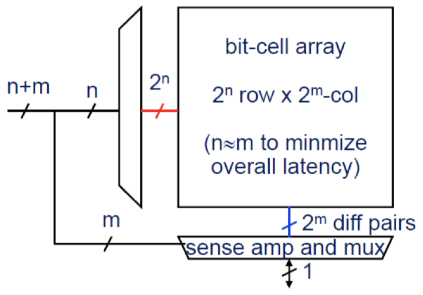

# Chapter 3: Hardware Software Interface

## 3.1 Storage

### 3.1.1 SRAM / DRAM / Flash

In a **static random access memory (SRAM),** single bits are stored in bit-stable circuits. SRAM is used for:

- Caches
- Register files within the processor core
- Small but fast memories

{width=34%}

If we want to _read_ from SRAM:

1. Pre-charge all bit-lines to average voltage
2. Decode the address ($n + m$ bits)
3. Select the row of cells using $n$ single-bit _word lines (WL)_
4. Selected bit-cells drive all _bit-lines (BL)_ ($2^m$ pairs)
5. Sense difference between bit-line pairs and read out

If we want to _write_ to SRAM:

1. Select row and overwrite the bit-lines using strong signals

In **dynamic random access memory (DRAM),** single bits are stored as charges in capacitors:

- Bit cells lose their charge when they are read, and they drain over time
- Slower access than with SRAM due to small storage capacity in comparison to the capacity of bit-lines
- Higher density than SRAM (1 vs. 6 transistors per bit)

DRAMs require _periodic refresh_ of charge:

- Performed by the memory controller
- Refresh interval is tens of ms
- DRAM is unavailable during refresh