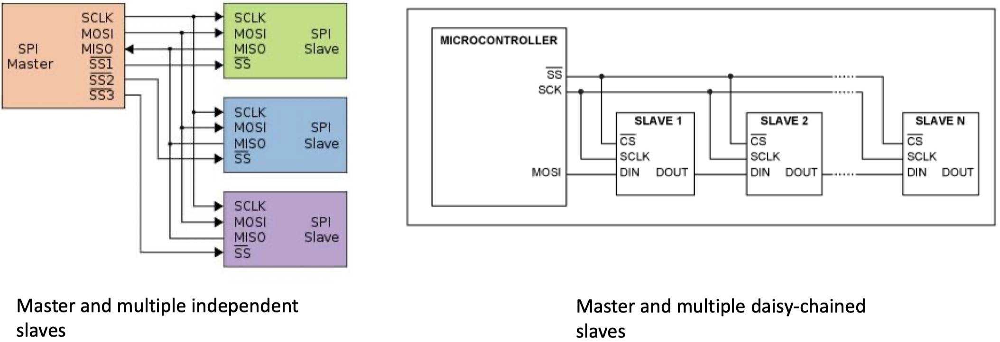
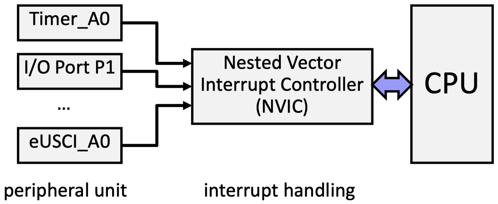
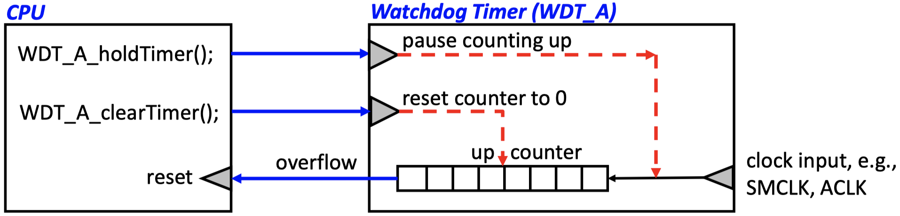

### 3.2.3 SPI Protocol

The **Serial Peripheral Interface Bus (SPI)** protocol is typically used to communicate across short distances. It has the following characteristics:

- 4-wire synchronized (clocked) communication bus
- Supports single master and multiple slaves
- Always full-duplex: Communication is in both directions simultaneously
- Multiple Mbps transmission speeds can be achieved
- Transfer data in 4 to 16-bit serial packets

The _bus wiring_ is built-up as follows:

- MOSI (Master Out Slave In) - carries data out of the master to the slave
- MISO (Master In Slave Out) - carries data out of the slave to the master
- Both MOSI and MISO are active during every transmission
- $\bar{SS}$ (or CS) - signal to select each slave chip
- System clock SCLK - produced by the master to synchronize transfer

{width=50%}

_Example:_ The diagram below shows two examples of how a bus can be configured:

{width=75%}

## 3.3 Interrupts

### 3.3.1 Introduction

A **hardware interrupt** is an electronic alerting signal sent to the CPU from another component, either from an internal peripheral or from an external device.
The **nested vector interrupt controller (NVIC)** handles the processing of interrupts.

The way how usual ES programs look is shown by this figure:

{width=10%}

- System initialization: The beginning part of `main()` is usually dedicated to setting up your system
- Background: Most systems have an endless loop that runs forever. The background loop often contains a _low power mode (LPMx)_ command - this sleeps the CPU until an interrupt event wakes it up.
- Foreground: **Interrupt Service Routine (ISR)** runs in response to enabled hardware interrupt. These events may change modes in the background.

### 3.3.2 Processing Of Interrupts

The **vector interrupt controller (NVIC):**

- Enables and disables interrupts
- Allows to individually and globally _mask interrupts_
- Registers _interrupt service routines_ and sets the priority of interrupts.

{width=34%}

_Interrupt priorities_ are relevant if:

- Several interrupts happen at the same time
- The programmer does not mask interrupts in an ISR and therefore, _preemption of an ISR_ by another ISR may happen (_interrupt nesting_).

The **processing of an interrupt** proceeds with the steps given below:

1. An interrupt occurs: Most peripherals can generate interrupts to provide status and information.
2. It sets a flag bit in a register (_IFG register_): When an interrupt signal is received, a corresponding bit is set in the IFG register. There is such an IFG register for each interrupt source. As some interrupt sources are only on for a short duration, the CPU register the interrupt signal internally.
3. CPU/NVIC acknowledges interrupt by:
    1. Current instruction completes
    2. Saves return-to location on the stack
    3. Masks interrupts globally
    4. Determines source of interrupt
    5. Calls interrupt service routine
4. The interrupt service routine:
    1. Saves context of system
    2. Runes the interrupt's code
    3. Restores the context of the system
    4. Automatically unmasks interrupts and
    5. Continues where it left off

### 3.3.3 Polling vs. Interrupt

We compare **polling** and **interrupt** based on the utilization of the CPU by using a simplified timing model. Some important definitions:

- _Utilization_ $u$: average percentage, the processor is busy
- _Computation_ $c$: processing time of handling the event
- _Overhead_ $h$: time overhead for handling the interrupt
- _Period_ $P$: polling period
- _Interarrival time_ $T$: minimal time between two events
- _Deadline_ $D$: maximal time between event arrival and finishing event processing with $D \leq T$

{width=80%}

For the following considerations, we suppose that the interarrival time between events is $T$. This makes the results a bit easier to understand.

Some relations for _interrupt-based_ event processing:

- The average utilization is $u_i = (h + 1c) / T$
- As we need at least $h + c$ time to finish the processing of an event, we find the following constraint: $h + c \leq D \leq T$

Some relations for _polling-based_ event processing:

- The average utilization is $u_p = c / P$
- We need at least time $P + c$ to process an event that arrives shortly after a polling took place. The polling period $P$ should be larger than $c$. Therefore, we find the following constraints $2c \leq c + P \leq D \leq T$

_Design problem:_ $D$ and $T$ are given by application requirements. $h$ and $c$ are given by the implementation. When to use interrupts and when polling considering the resulting system utilization? What is the best value for the polling period $P$?

- If $D < c < c + \min(c, \, h)$ then event processing is not possible
- If $2c \leq D < h + c$ then only polling is possible. The maximal period $P = D - c$ leads to the optimal utilization $u_p = c / (D - c)$
- If $h + c \leq D < 2c$ then only interrupt is possible with $u_i = (h + c) / T$
- If $c + \max(c, \, h) \leq$ then both are possible with $u_p = c / (D - c)$ or $u_i = (h + c) / T$

Interrupt gets better in comparison to polling, if the deadline $D$ for processing interrupts gets smaller in comparison to the interarrival time $T$, if the overhead $h$ gets smaller in comparison to the computation time $c$, or if the interarrival time of events is only lower bounded by $T$.

## 3.4 Clocks and Timers

### 3.4.1 Clocks

Microcontrollers usually have many _clock sources_ that have different:

- Frequencies
- Energy consumption
- Stability (i.e. crystal-controlled clock vs. digitally controlled oscillators)

From the basic clocks, several internally available clock signals are derived. They can be used for clocking peripheral units, the CPU, the memory, and the various timers.

### 3.4.2 Watchdog Timer

**Watchdog timers** provide system fail-safety:

- If their counter ever rolls over (back to zero), they _reset the processor._ The goal here is to prevent your system from being inactive (deadlock) due to some unexpected fault.
- To prevent your system from continuously resetting itself, the counter should be reset at appropriate intervals:

{width=80%}

### 3.4.3 System Tick

**SysTick** is a simple decrementing 24 bit counter that is part of the NVIC controller. Its clock source is MCLK, and it reloads to period 1 after reaching 0. It is a very simple timer, mainly used for periodic interrupts or measuring time.

_Example:_ If MCLK has a frequency of 3 MHz, the counter rolls over every 5.6 seconds as $(2^{24}/(3 \cdot 10^6)) = 5.59$.

### 3.4.4 Timers and PWM

Usually, embedded microprocessors have several elaborate **timers** that allow to:

- capture the current time or time differences, triggered by hardware or software events
- generate interrupts when a certain time is reached
- generate interrupts when counter overflows
- generate periodic interrupts, for example in order to periodically execute tasks
- generate specific output signals, for example _pulse width modulation (PWM)_

Typically, the mentioned functions are realized via _capture and compare registers:_

- **Capture:**
    - the value of counter register is stored in the capture register at the time of the _capture event_
    - the value can be read b software
    - at the time of the capture, further actions can be triggered
- **Compare:**
    - the value of the compare register can be set by software
    - as soon as the values if the counter and compare register are equal, compare actions can be taken such as interrupt, signaling peripherals, changing pin values, resetting the counter register

{width=80%}
