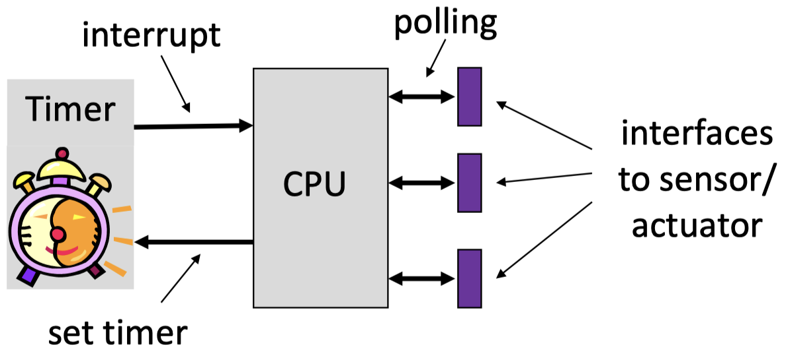
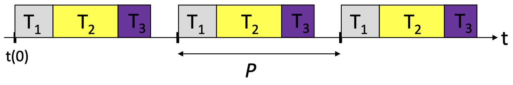
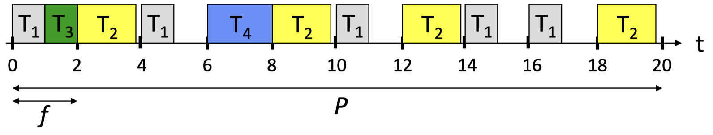
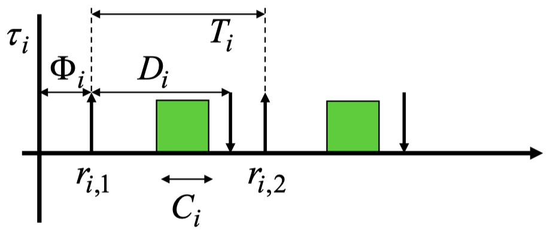

The **pulse width modulation (PWM)** can be used to change the average power of a signal. The use case could be to change the speed of a motor or to modulate the light intensity of an LED.

# Chapter 4: Programming Paradigms

## 4.1 Reactive Systems and Timing

### 4.1.1 Timing Guarantees

_Hard real-time systems_ can often be found in safety-critical applications. They need to provide the result of a computation within a fixed time bound.

Typical application domains are: avionics, automotive, train systems, automatic control including robotics, manufacturing, and media content production.

_Example:_ The side-airbag in a car needs to react after an event in less than 10 ms.

### 4.1.2 Real-Time Systems

In many _cyber-physical systems (CPSs),_ correct timing is a matter of correctness, not performance: an answer arriving too late is considered to be an error.

A simplified **real-time system** looks like this:

{width=50%}

Embedded controllers are often expected to finish the processing of data and events reliably within defined time bounds. Such a processing may involve seqeunces of computations and communications. Essential for the analysis and design of a real time system: _upper bounds on the execution times_ of all tasks are statically known. This also includes the communication of information via wired or wireless connection.

This value is commonly galled the _worst-case execution time (WCET)._ Analogously, one can define the lower bound on the execution time, the _best-case execution time (BCET)._

### 4.1.3 Execution Times

Modern processors increase the average performance by using caches, pipelines, branch prediction, and speculation techniques, for example. These features make the computation of the WCET very difficult. The microarchitecture has a large _time-varying internal state_ that is changed by the execution of instructions and that influence the execution times of instructions:

- Best-case: everything goes smoothly: no cache-miss, operands are ready, needed resources are free, branches are correctly predicted.
- Worst-case: everything goes wrong: all loads miss the cache, resources needed are occupied, operands are not ready.
- The span between the best case and worst case may be several hundred cycles!

The complexity for determining the WCET of tasks is:

- In the general case, it is undecidable whether a finite bound exists.
- For restricted classes of programs it is possible, in principle.

Analytic (formal) approaches exist for hardware and software:

- In case of software, it requires the analysis of the program flow and the analysis of the hardware. Bot are combined in a complex analysis flow.
- For the rest of the lecture, we assume that reliable bounds on the WCET are available.

## 4.2 Different Programming Paradigms

### 4.2.1 Overview

The concept of _concurrent tasks_ reflects our intuition about the functionality of embedded systems. Tasks help us manage the complexity of concurrent activities as happening in the system environment:

- Input data arrives from various sensors and input devices.
- The system may also receive asynchronous input events.

There are many structured ways of programming an embedded system. In this lecture, only the main principles will be covered:

- Time triggered approaches:
    - Periodic
    - Cyclic
    - Generic time-triggered scheduler
- Event triggered approaches
    - non-preemptive
    - preemptive

### 4.2.2 Time-Triggered Systems

The **pure time-triggered model** has the following characteristics:

- no interrupts are allowed, except by timers
- the schedule of tasks is computed off-line and therefore, complex sophisticated algorithms can be used
- the scheduling at run-time is fixed and therefore, it is _deterministic_
- the interaction with environment happens through _polling_

{width=50%}

With a **simple periodic TT scheduler,** a timer interrupts regularly with period $P$. All tasks have the same period $P$.

{width=50%}

Properties:

- later tasks, for example $T_2$ and $T_3$, have unpredictable starting times
- the communication between tasks or the use of common resources is safe, as there is a static ordering of tasks
- as necessary precondition, the sum WCETs of all tasks within a period is bounded by the period:

$$
\sum_k WCET(Z_k) < P
$$

With a **time-triggered cyclic executive scheduler** we assume that tasks may have different periods. To accommodate this situation, the period $P$ is _partitioned into frames_ of length $f$.

{width=50%}

We have a problem to determine a feasible schedule, if there are tasks with a long execution time. Long tasks could be partitioned into a sequence of short sub-tasks, but this is a tedious and error-prone process.

When a control application consists of several concurrent periodic tasks with individual timing constraints, the schedule has to guarantee that each periodic instance is regularly activated at its proper rate and is completed within its deadline.

Definitions:

- $\Gamma$: denotes the set of all periodic subtasks
- $\tau_i$: denotes a periodic task
- $\tau_{i, \, j}$: denotes the $j$-th instance of task $i$
- $r_{i, \, j}, \, d_{i, \, j}$: denote the release time and absolute deadline of the $j$-th instance of task $i$
- $\Phi_i$: denotes the phase of task $i$ (release time of its first instance)
- $D_i$: denotes the relative deadline of task $i$

_Example:_ The following figures show an example of a single periodic task $\tau_i$ (1) and an example of a set of periodic tasks $\Gamma$ (2):

{width=34%}

{width=75%}

The following _hypotheses_ are assumed on the tasks:

- The instances of a periodic task are regularly activated at a constant rate. The interval $T_i$ between two consecutive activations is called period. The release times satisfy:

$$
r_{i, \, j} = \Phi_i + (j-1)T_i
$$

- All instances have the same worst-case execution time $C_i$.
- All instances of a periodic task have the same relative deadline $D_i$ Therefore, the absolute deadlines satisfy:

$$
d_{i, \, j} = \Phi_i + (j-1)T_i + D_i
$$

_Example:_ The following diagram shows an example of time-triggered cyclic executive scheduling with 4 tasks:

{width=75%}

Some conditions for period $P$ and frame length $f$:

- A task executes at most once within a frame: $f \leq T_i \forall \tau_i$
- $P$ is a multiple of $f$
- Period $P$ is the least common multiple of all periods $T_k$
- Tasks start and complete within a single frame: $f \geq C_i \forall \tau_i$
- Between release time and deadline of every task there is at least one full frame:

$$
2f - \text{gcd}(T_i, \, f) \leq D_i \forall \tau_i
$$

_Example:_ The figure below shows an example of a cyclic executive scheduling:

{width=75%}

If we want to _check for the correctness of a schedule_ we proceed as follows:

- $f_{i, \, j}$ denotes the number of the frame in which that instance $j$ of task $\tau_i$ executes
- Is $P$ a multiple of all periods $T_i$?
- Is $P$ a multiple of $f$?
- Is the frame sufficiently long?

$$
\sum_{\{i \, | \, f_{i, \, j} = k \}} C_i \leq f \quad \forall 1 \leq k \leq \frac{P}{f}
$$

- Determine offsets such that instances of tasks start after their release time:

$$
\Phi_i = \min_{1 \leq j \leq P/T_i} \{(f_{i, \, j} - 1)f - (j-1)T_i \} \quad \forall \tau_i
$$

- Are deadlines respected?

$$
(j-1)T_i + \Phi_i + D_i \geq f_{i, \, j}f \quad \forall \tau_i, \, 1 \leq j \leq \frac{P}{T_i}
$$

Finally, we look at **generic time-triggered schedulers.**

In an entirely time-triggered system, the temporal control structure of all tasks is established a priori by off-line support-tools. This temporal control structure is encoded in a _Task-Descriptor List (TDL)_ that contains the cyclic schedule for all activities of the node. This schedule considers the required precedence and mutual exclusion relationships among the tasks such that an explicit coordination of the tasks by the operating system at run time is not necessary. The dispatcher is activated by a synchronized clock tick.

Summary for _time-triggered schedulers:_

- Properties:
    - deterministic schedule, conceptually simple, relatively easy to validate, test, and certify
    - no problems in using shared resources
    - external communication only via polling
    - inflexible as no adaption to the environment
    - serious problems if there are long tasks
- Extensions:
    - allow interrupts -> be careful with shared resources and the WCET of tasks
    - allow preemtable background tasks
    - check for task overruns (execution time longer than WCET) using a watchdog timer
