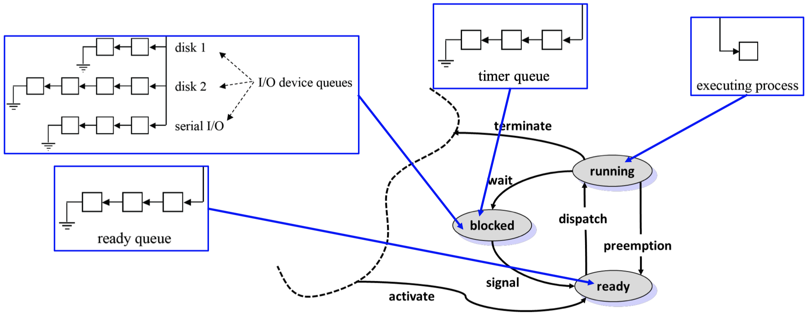
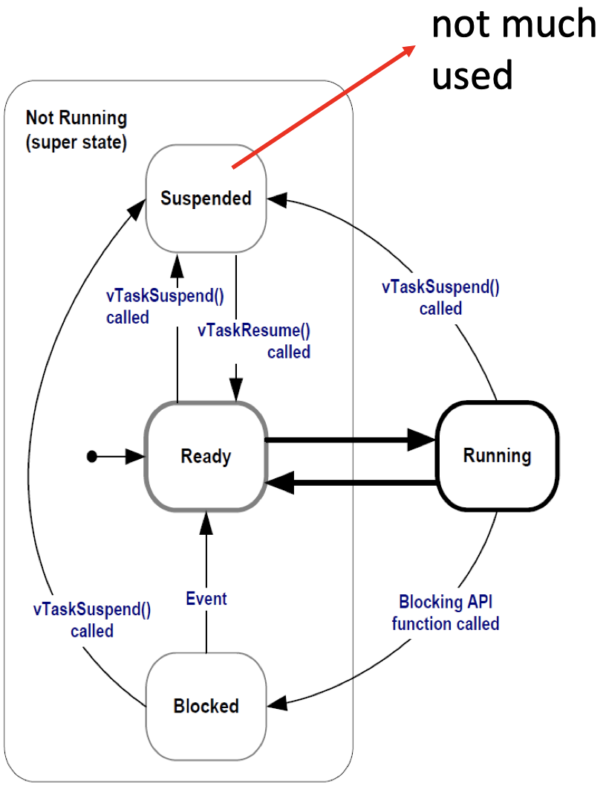

### 4.2.3 Event Triggered Systems

In an **event triggered system,** the schedule of tasks is determined by the occurrence of external or internal events:

- _dynamic and adaptive:_ there are possible problems with respect to timing, the use of shared resources and buffer over- or underflow
- _guarantees_ can be given either off-line (if bounds on the behavior of the environment are known) or during run-time

The first scheduling process we look at is **non-preemptive event-triggered scheduling.** It is based on the following _principles:_

- To each event, there is associated a corresponding task that will be executed.
- Events are emitted by (a) external interrupts or (b) by the tasks themselves
- All events are collected in a single queue. Depending on the queuing discipline, an event is chosen for execution, i.e. the corresponding task us executed.
- Tasks cannot be preempted

One might make the following _extensions_ on the above scheduling:

- A _background task_ can run if the vent queue is empty. It will be preempted by any event processing.
- _Timed events_ are ready for execution only after a time interval elapsed. This enables periodic instantiations, for example.

{width=50%}

We elaborate some further _properties_ of non-preemptive event-triggered scheduling:

- communication between tasks does not lead to simultaneous access to shared resources, but interrupts may cause problems as they preempt running tasks
- buffer overflow may happen if too many events are generated by the environment or by tasks
- tasks with a long-running time prevent other tasks from running and may cause buffer overflow as no events are being processed during this time

Another option for event-triggered scheduling is **preemptive event-triggered scheduling.** We first look at this approach's _stack policy:_

- This case is similar to non-preemptive case, but tasks can be preempted by others. This resolves partly the problem of tasks with a long execution time.
- If the order of preemption is restricted, we can use the usual stack-based context mechanism of function calls. The context of a function contains the necessary state such as local variables and saved registers.
- Tasks must finish in LIFO order of their instantiations, this restricts flexibility of the approach.
- Shared resources must be protected, for example by disabling interrupts or by the use of semaphores.

{width=50%}

A **thread** is a unique execution of a program. Several copies of such a program may run simultaneously or at different times. Threads share the same processor and its peripherals. A thread has its _own local state._ This state consists mainly of:

- register values
- memory stack
- program counter

Several threads may have a shared state consisting of global variables. An **activation record** contains the thread local state which includes registers and local data structures. In a _context switch,_ the current CPU context goes out, and the new CPU context goes in.

With **co-operative multitasking,** each thread allows a context switch to another thread at a call to the `cswitch()` function. This function is part of the underlying runtime system. A _scheduler_ within this runtime system chooses which thread will run next.

**Preemptive multitasking** is the most general form of multitasking:

- The scheduler in the runtime system controls when context switches take place
- The scheduler also determines what thread runs next

We can visualize this with a state diagram corresponding to each single thread:

- _Run:_ A thread enters this state as it starts executing on the processor.
- _Ready:_ State of threads that are ready to execute but cannot be executed because the processor is assigned to another thread.
- _Blocked:_ A task enters this state when it waits for an event.

{width=50%}

# Chapter 5: Embedded Operating Systems

## 5.1 Introduction

An **embedded operating system (OS)** has the essential characteristic of _configurability:_

- No single operating system will fit all needs, but often no overhead for unused functions is tolerated. Therefore, configurability is needed.
- For example, there are many embedded systems without external memory, a keyboard, a screen, or a mouse.

Some examples of configurability:

- Remove unused functions/libraries
- Use conditional compilation

A **real-time operating system (RTOS)** is an operating system that supports the construction of real-time systems. They have the following two key requirements:

1. The timing behavior of the OS must be predictable: For all services of the OS, an upper bound on the execution time is necessary. For example, for every service upper bounds on blocking times need to be available, i.e. for times during which interrupts are disabled.
2. OS must manage the timing and scheduling: OS has to be aware of deadlines and should have mechanisms to take them into account in the scheduling. OS must provide precise time services with a high resolution.

## 5.2 Features and Architecture

**Device drivers** are typically handled directly by tasks instead of drivers that are managed by the operating system:

- This architecture improves timing predictability as access to devices is also handled by the scheduler
- If several tasks use the same external device and the associated driver, then the access must be carefully managed

{width=50%}

Every task can perform an _interrupt:_

- For standard OS, this would be a serious source of unreliability. But embedded programs are typically programmed in a controlled environment.
- It is possible to let interrupts directly start or stop tasks. This approach is more efficient and predictable than going through the operating system's interfaces and services.

_Protection mechanisms_ are not always necessary in embedded operating system. Embedded systems are typically designed for a single purpose, untested programs are rarely loaded, software can be considered reliable.

The main functionality of **RTOS-Kernels** is task management:

- Execution of quasi-parallel tasks on a processor using processes and threads
- CPU scheduling
- Inter-task communication
- Support of real-time clocks
- Task synchronization

_Tasks_ can have three different states:

- Running: A task enters this state when it starts executing on the processor. There is at most one task with this state in the system.
- Ready: State of those tasks that are ready to be executed but cannot be run because the processor is assigned to another task.
- Blocked: A task enters the blocked state when it executes a synchronization primitive to wait for an even, e.g. wait primitive on a semaphore or timer.

{width=70%}

A **thread** is the smallest sequence of programmed instructions that can be managed independently by a scheduler, e.g. a thread is a basic unit of CPU utilization. Multiple threads can exist within the same process and share resources such as memory, while different processes do not share these resources. Thread advantages and characteristics:

- Faster to switch between threads. Switching between user-level threads requires no major intervention by the operating system.
- Typically, an application will have a separate thread for each distinct activity.
- _Thread control block (TCB)_ stores information needed to manage and schedule a thread.

The OS maintains for each thread a _data structure (**TCB - thread control block**)_ that contains its current status such as program counter, priority, state, scheduling information, and thread name. TCBs are administered in linked lists:

{width=70%}

## 5.3 Classes of Operating Systems

**Class 1:** fast and efficient kernels. For hard real-time systems, these kernels are questionable, because they are designed to be fast, rather than to be predictable in every respect. Examples include: FreeRTOS, RT-LINUX, LynxOS.

**Class 2:** real-time extensions to standard OSs. Attempt to exploit existing and comfortable main stream operating systems. A real-time kernel runs all real-time tasks. The standard OS is executed as one task.

{width=70%}

**Class 3:** research systems try to avoid limitations of existing real-time and embedded operating systems. Typical research questions include:

- Low overhead memory protection
- Temporal protection of computing resources
- RTOS for on-chip multiprocessors

## 5.4 FreeRTOS in the ES-Lab

### 5.4.1 Introduction

**FreeRTOS** is a typical embedded operating system. It is available for many hardware platforms, open source and widely used in the industry:

- FreeRTOS is a _real-time kernel_
- Applications are organized as a collection of independent threads of execution
- Preemptive or co-operative operation, queues, binary semaphores, counting semaphores, mutexes, software timers, etc.

The typical _directory structure_ is given as:

```pseudo
FreeRTOS
    Source
        tasks.c         // functions that implement the handling of tasks
        list.c          // implementation of linked lsit data type
        queue.c         // implementation of queue and semaphore services
        timers.c        // software timer functionality
        event_group.c
        coroutine.c
        portable        // directory containing all port specific source files
```

FreeRTOS is _configured_ by a header file called `FreeRTOSCOnfig.h` that determines almost all configurations.

### 5.4.2 FreeRTOS Task Management

_Tasks_ are implemented as threads. The functionality of a thread is implemented in form of a function:

- Prototype: `void ATaskFunction(void *pvParameters);`
- Task functions are not allowed to return! They can be killed by a specific call to a FreeRTOS function, but usually run forever in an infinite loop.
- Task functions can instantiate other tasks. Each created task is a separate execution instance, with its own stack.

Thread instantiation is shown in the figure below:

{width=70%}

### 5.4.3 FreeRTOS Timers

The operating system also provides _interfaces to timers_ of the processors. AS an example, we use the FreeRTOS timer interface to replace the busy loop by a delay. In that case, the task is put into the "blocked" state instead of continuously running:

```c
void vTask1(void *pvParameters) {
    for(;;) {
        /* do something repeatedly */
        vTaskDelay(pdMS_TO_TICKS(250));     // delay by 250 ms
    }
}
```

The problem is that tasks do not execute strictly periodically. The parameters to `vTaskDelayUntil()` specify the exact tick count value at which the calling task should be moved from the "blocked" state into the "ready" state. Therefore, the task is put into the "ready" state periodically.

### 5.4.4 FreeRTOS Task States

The task states in FreeRTOS and their transitions are:

- A task that is waiting for an event is said to be in the "blocked" state, which is a sub-state of the "not running" state.
- Tasks can enter the "blocked" state to wait for two different types of events:
    - _Temporal (time-related) events:_ the event being either a delay period expiring, or an absolute time being reached
    - _Synchronization events:_ where the events originate from another task or interrupt.

{width=25%}
