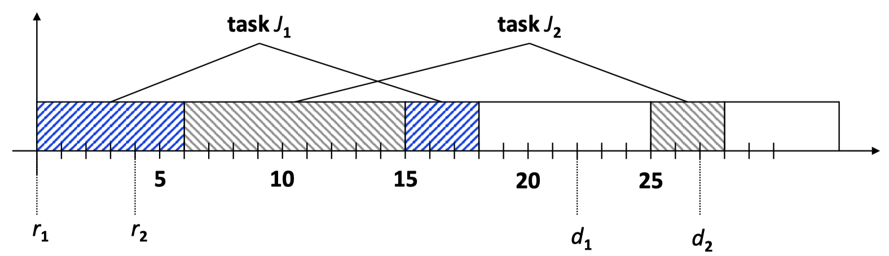
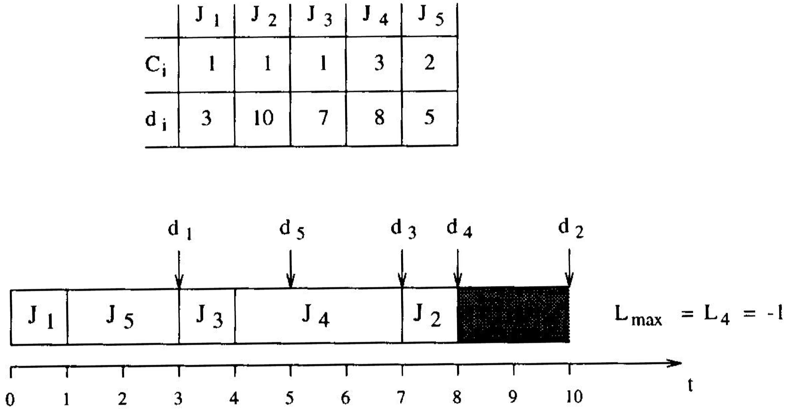
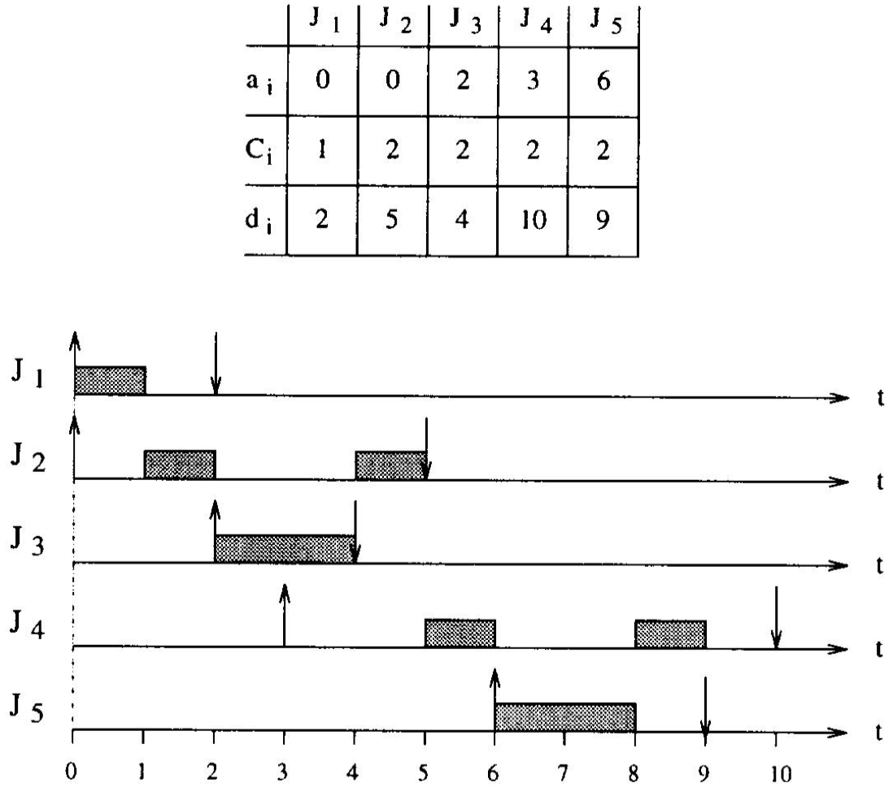
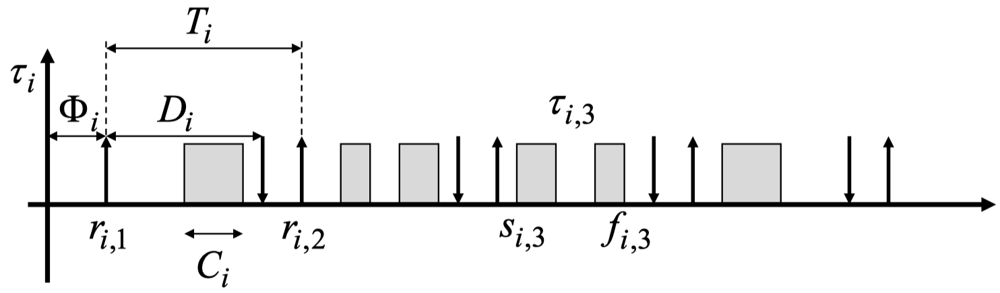
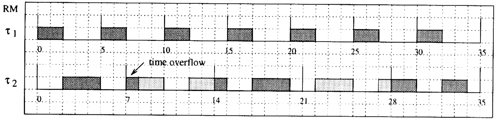

# Chapter 6: Aperiodic and Periodic Scheduling

## 6.1 Basic Terms and Models

**Real-time systems** can be:

- _Hard:_ A real-time task is said to be hard, if missing the deadline may cause catastrophic consequences on the environment under control.
- _Soft:_ A real-time task is called soft, if meeting its deadline is desirable for performance reasons, but missing its deadline does not cause serious damage to the environment and does not jeopardize correct system behavior.

Some definitions about _schedules._ Given a set of tasks $J = \{J_1, \, J_2,...\}$:

- A _schedule_ is an assignment of tasks to the processor, such that each task is executed until completion
- A schedule can be defined as an _integer step function_ $\sigma : R \to N$ where $\sigma(t)$ denotes the task which is executed at time $t$. If $\sigma(t) = 0$, the processor is called _idle._
- If $\sigma(t)$ changes its value at some time, then the processor performs a _context switch._
- Each interval, in which $\sigma(t)$ is constant is called a _time slice._
- A _preemptive schedule_ is a schedule in which the running task can be arbitrarily suspended at any time, to assign the CPU to another task according to a predefined scheduling policy.

Some definitions about schedules and timing:

- A schedule is said to be _feasible,_ if all tasks can be completed according to a set of specified constraints
- A set of tasks is said to be _schedulable,_ if there exists at least one algorithm that can produce a feasible schedule
- _Arrival time_ $a_i$ or _release time_ $r_i$ is the time at which a task becomes ready for execution
- _Computation time_ $C_i$ is the time necessary to the processor for executing the task without interruption
- _Deadline_ $d_i$ is the time at which a task should be completed
- _Start time_ $s_i$ is the time at which a task starts its execution
- _Finishing time_ $f_i$ is the time at which a task finishes its execution
- _Lateness_ $L_i = f_i - d_i$ represents the delay of a task completion with respect to its deadline.
- _Tardiness or exceeding time_ $E_i = \max(0, \, L_i)$ is the time a task stays active after its deadline
- _Laxity or slack time_ $X_i = d_i - a_i - C_i$ is the maximum time a task can be delayed on its activation to complete within its deadline
- Using the above definitions, we have $d_i \geq r_i + C_i$

A _periodic task_ $\tau_i$ is an infinite sequence of identical activities, called _instances or jobs,_ that are regularly activated at a constant rate with _period_ $T_i$. The activation of the first instance is called _phase_ $\Phi_i$.

_Example:_ Following is an example of a real-time model:

{width=50%}

- Computation times: $C_1 = 9, \, C_2 = 12$
- Start times: $s_i = 0, \, s_2 = 6$
- Finishing times: $f_1 = 18, \, f_2 = 28$
- Lateness: $L_1 = -4, \, L_2 = 1$
- Tardiness: $E_1 = 0, \, E_2 = 1$
- Laxity: $X_1 = 13, \, X_2 = 11$

**Precedence relations** between tasks can be described through an _acyclic directed graph_ $G$ where tasks are represented by nodes and precedence relations by edges. $G$ induces a partial order on the task set. There are different _interpretations_ possible:

- All successors of a task are activated (_concurrent task execution_). We will use this interpretation in the lecture.
- One successor of a task is activated: _non-deterministic choice_

We do _classify_ scheduling algorithm:

- With _preemptive algorithms,_ the running task can be interrupted at any time to assign the processor to another active task.
- With a _non-preemptive algorithm,_ a task, once started, is executed by the processor until completion.
- _Static algorithms_ are those in which scheduling decisions are based on fixed parameters, assigned to tasks before their activation.
- _Dynamic algorithms_ are those in which scheduling decisions are based on dynamic parameters that may change during system execution.

We introduce the following **metrics to compare schedules:**

- Average response time: $\bar{t_r} = \frac{1}{n} \sum_{i = 1}^n(f_i - r_i)$
- Total completion time: $t_c = \max_i(f_i) - \min_i(r_i)$
- Weighted sum of response time: $t_w = \frac{\sum_{i = 1}^nw_i(f_i - r_i)}{\sum_{i = 1}^n w_i}$
- Maximum lateness: $L_{max} = \max_i(f_i - d_i)$
- Number of late tasks: $N_{late} = \sum_{i = 1}^n miss(f_i)$, with $miss(f_i) = 0, \, if \, f_i \leq d_i, \, 1 \, otherwise$

## 6.2 Real-Time Scheduling of Aperiodic Tasks

We look at some algorithms for **scheduling aperiodic tasks.**

### 6.2.1 Earliest Deadline Due (EDD)

> **Jackson's Rule:** Given a set of $n$ tasks. Processing in order of non-decreasing deadlines is optimal with respect to minimizing the maximum lateness.

_Example:_

{width=40%}

### 6.2.2 Earliest Deadline First (EDF)

> **Horn's Rule:** Given a set of $n$ independent tasks with arbitrary arrival times, any algorithm that at any instant executes a task with the earliest absolute deadline among the ready tasks is optimal with respect to minimizing the maximum lateness.

{width=40%}

_Concept of proof:_ For each time interval $[t, \, t + 1)$ it is verified, whether the actual running task is the one with the earliest absolute deadline. If this is not the case, the task with the earliest absolute deadline is executed in this interval instead. This operation cannot increase the maximum lateness.

We can do an **acceptance test** to test whether an additional set of tasks is feasible to do or not:

- Worst case of finishing time of task $i$: $f_i = t + \sum_{k = 1}^i c_k(t)$
- EDF guarantee condition: $\forall i = 1,..., \, n, \, t + \sum_{k = 1}^i c_k(t) \leq d_i$

```pseudo
Algorithm: EDG_guarantee (J, J_new) {
    J' = J union {J_new};                   // ordered by deadline
    f_0 = t
    for (each J_i in J') {
        f_i = f_{i-1} + c_i(t);
        if (f_i > d_i) return (INFEASIBLE);
    }
    return (FEASIBLE);
}
```

The problem of scheduling a set of $n$ tasks with precedence constraints can be solved in polynomial time complexity if tasks are preemptable. The **EDF\*** algorithm determines a feasible schedule in the case of tasks with precedence constraints if there exists one. By the modification it is guaranteed that if there exists a valid schedule at all then:

- a task starts execution not earlier than its release time and not earlier than the finishing times of its predecessors
- all tasks finish their execution within their deadlines

_Modification of deadline:_

- Tasks must finish the execution time within its deadline
- Tasks must not finish the execution later than the maximum start time of its successor
- _Solution:_ $d_i^* = \min(d_j, \, \min(d_j^* - C_j : J_i \to J_j))$

Algorithm:

1. For any terminal node of the precedence graph set $d_i^* = d_i$
2. Select a task $i$ such that its deadline has not been modified but the deadlines of all immediate successors $j$ have been modified. If no such task exists, exit.
3. Set $d_i^* = \min(d_j, \, \min(d_j^* - C_j : J_i \to J_j))$
4. Return to step 2

_Modification of release time:_

- Task must start the execution not earlier than its release time
- Task must not start the execution earlier than the minimum finishing time of its predecessor
- _Solution:_ $r_j^* = \max(r_j, \, \max(r_i^* + C_i : J_i \to J_j))$

Algorithm:

1. For any initial node of the precedence graph set $r_i^* = r_i$
2. Select a task $j$ such that its release time has not been modified but the release times of all immediate predecessors $i$ have been modified. If no such task exists, exit.
3. Set $r_j^* = \max(r_j, \, \max(r_i^* + C_i : J_i \to J_j))$
4. Return to step 2

## 6.3 Real-Time Scheduling of Periodic Tasks

### 6.3.1 Model of Periodic Tasks

Examples of periodic tasks are sensory data acquisition, low-level actuation, control loops, action planning and system monitoring.

When an application consists of several concurrent periodic tasks with individual timing constraints, the OS has to guarantee that each periodic instance is regularly activated at its proper rate and is completed within its deadline.

The following hypotheses are assumed on the tasks:

- $r_{i, \, j} = \Phi_i + (j-1)T_i$
- $d_{i, \, j} = \Phi_i + (j-1)T_i + D_i$
- $d_{i, \, j} = \Phi_i + jT_i$
- All instances have some worst case execution time $C_i$
- All periodic tasks are independent, that is, there are no precedence relations and resource constraints
- No task can suspend itself
- All tasks are release as soon as they arrive
- All overheads in the OS kernel are assumed to be zero

_Example:_

{width=50%}

### 6.3.2 Rate Monotonic Scheduling (RM)

We make the following assumptions:

- Task priorities are assigned to tasks before execution and do not change over time (_static priority assignment_)
- RM is intrinsically preemptive: the currently executing job is preempted by a job of a task with higher priority
- Deadlines equal the period $D_i = T_i$

> **Rate-Monotonic Scheduling Algorithm:** Each task is assigned a priority. Tasks with higher request rates (that is, with shorter periods) will have higher priorities. Jobs of tasks with higher priority interrupt jobs of tasks with lower priority.

_Example:_

{width=50%}

> _Optimality:_ RM is optimal among all fixed-priority assignments in the sense that no other-fixed priority algorithm can schedule a task set that cannot be scheduled by RM.

A **critical instant** of a task is the time at which the release of a job will produce the largest response time.

> _Lemma:_ For any task, the critical instant occurs if a job is simultaneously released with all higher priority jobs.

_Proof sketch:_ Start with two tasks $\tau_1$ and $\tau_2$. The response time of a job $\tau_2$ is delayed by jobs of $\tau_1$ of higher priority:

{width=50%}

The delay may _increase_ if $\tau_1$ starts earlier. The maximum delay is achieved if $\tau_1$ and $\tau_2$ start simultaneously.

For the **proof of RM optimality with 2 tasks** we start with two tasks $\tau_1, \, \tau_2$ with periods $T_1 < T_2$. We define $F = \lfloor T_2 / T_1 \rfloor$ as the number of periods of $\tau_1$ _fully contained_ in $T_2$. We consider two cases A and B:

_Case A:_ Assume RM is not used, i.e. the priority of $\tau_2$ is the highest:

{width=50%}

> The schedule is feasible if $C_1 + C_2 \leq T_1$ and $C_2 \leq T_2$. ($A$)

_Case B:_ Assume RM is used, i.e. the priority of $\tau_1$ is the highest:

{width=50%}

> Schedule is feasible if:
>
> $$
> FC_1 + C_2 + \min(T_2 - FT_1, \, C_1) \leq T_2 \quad \text{and} \quad C_1 \leq T_1 \qquad (B)
> $$
