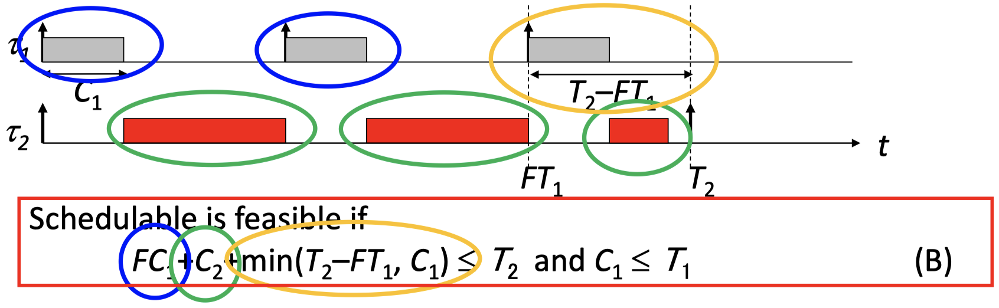
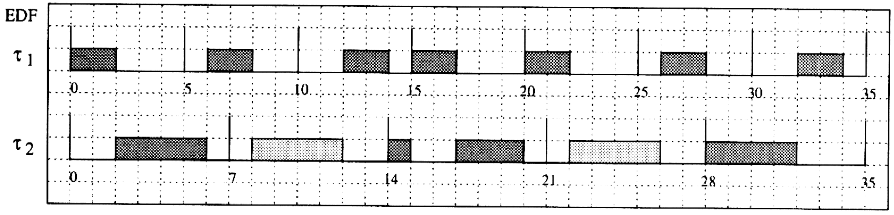

{width=50%}

We need to show that $(A) \implies (B)$:

$$
C_1 + C_2 \leq T_1 \implies C_1 \leq T_1 \\
C_1 + C_2 \leq T_1 \implies FC_1 + C_2 \leq FC_1 + F_c2 \leq FT_1 \implies \\
FC_1 + C_2 + \min(T_2 - FT_1, \, C_1) \leq FT_1 + \min(T_2 - FT_1, \, C_1) \leq \min(T_2, \, C_1 + FT_1) \leq T_2
$$

> Given tasks $\tau_1$ and $\tau_2$ with $T_1 < T_2$, then if the schedule is feasible by an arbitrary fixed priority assignment, it is also feasible by RM.

_Schedulability analysis_ for RM: A set of periodic tasks is schedulable with RM if:

$$
\sum_{i=1}^n \frac{C_i}{T_i} \leq n(2^{1/n}-1)
$$

This condition is sufficient but not necessary. The term $U = \sum_{i = 1}^n \frac{C_i}{T_i}$ denotes the **processor utilization factor** $U$ which is the fraction of processor time spent in the execution of the task set.

### 6.3.3 Deadline Monotonic Scheduling (DM)

Assumptions for **deadline monotonic scheduling** are as in rate monotonic scheduling, but _deadlines may be smaller than the period,_ i.e. $C_i \leq D_i \leq T_i$.

> Each task is assigned a priority. Tasks with smaller relative deadlines will have higher priorities. Jobs with higher priorities interrupt jobs with lower priorities.

_Schedulability analysis_ for DM: A set of periodic tasks is schedulable with DM if:

$$
\sum_{i = 1}^n \frac{C_i}{D_i} \leq n(2^{1/n}-1).
$$

The condition is sufficient but not necessary. _Example_ with $U = 0.874, \, \sum_{i = 1}^n \frac{C_i}{D_i} = 1.08 > n(s^{1/n}-1) = 0-757$:

{width=50%}

There is also a _necessary and sufficient_ schedulability test which is computationally more involved. It is based on the following observations:

- The worst-case processor demand occurs when all tasks are released simultaneously, that is, at their critical instances
- For each task $i$, the sum of its processing time and the interference imposed by higher priority task must be less than or equal to $D_i$
- A measure of the _worst-case inference_ for task $i$ can be computed as the sum of the processing times of all higher priority tasks released before some time $t$ where tasks are ordered according to $m < n \iff D_m < D_n$:

$$
I_i = \sum_{j = 1}^{i-1} \lceil \frac{t}{T_j} \rceil C_j
$$

- The _longest response time_ $R_i$ of a job of a periodic task $i$ is computed, at the critical instant, as the sum of its computation time and the interference due to preemption by higher priority tasks: $R_i = C_i + I_i$
- Hence, the schedulability test needs to compute the smallest $R_i$ that satisfies:

$$
R_i = C_i + \sum_{j = 1}^{i-1} \lceil \frac{R_i}{T_j}C_j,
$$

for all tasks $i$. Then, $R_i \leq D_i$ must hold for all $i$. It can be shown that this condition is _necessary and sufficient._

The longest response times $R_i$ of the periodic tasks $i$ can be computed iteratively by the following algorithm:

```pseudo
Algorithm: DM_guarantee(Gamma) {
    for (each tau_i in Gamma) {
        I = 0;
        do {
            R = I + C_i;
            if (R > D_i) return (UNSCHEDULABLE);
            I = Sum_{j = 1}^{i - 1} lceil R/T_j rceil C_j;
        } while (I + C_i > R);
    }
    return (SCHEDULABLE);
}
```

### 6.3.4 EDF Scheduling

Assumptions:

- Dynamic priority assignment
- Intrinsically preemptive

Algorithm: The currently executing task is preempted whenever another periodic instance with earlier deadline becomes active:

$$
d_{i, \, j} = \Phi_i + (j-1)T_i + D_i
$$

Optimality: No other algorithm can schedule a set of periodic tasks if the set cannot be scheduled by EDF.

_Example:_

{width=50%}

A necessary and sufficient schedulability test for $D_i = T_i$:

> A set of periodic tasks is schedulable with EDF if and only if $\sum_{i = 1}^n \frac{C_i}{T_i} = U \leq 1$.

Here, $U$ denotes the _average processor utilization._

_Remarks:_ If the deadline was missed at $t_2$, then define $t_1$ as a time before $t_2$ such that (a) the processor is continuously busy in $[t_1, \, t_2]$ and (b) the processor only executes tasks that have their arrival time and their deadline in $[t_1, \, t_2]$. Why does such a time $t_1$ exist? We find such a $t_1$ by starting at $t_2$ and going backwards in time always ensuring that the processor only executes tasks that have their deadline before or at $t_2$. Because of EDF, the processor will be busy shortly before $t_2$, and it executes on the task that has deadline after $t_2$. Suppose that we reach a time such that shortly before the processor works on a task with deadline after $t_2$ or the processor is idle, then we found $t_1$: we know that there is no execution on a task with deadline after $t_2$.

Within the interval $[t_1, \, t_2]$ the total _computation time demanded_ by the periodic tasks is bounded by:

$$
C_p(t_1, \, t_2) = \sum_{i = 1}^n \lfloor \frac{t_2 - t_1}{T_i} C_i \leq \sum_{i = 1}^n \frac{t_2 - t_1}{T_i}C_i = (t_2 - t_1)U
$$

Since the deadline at time $t_2$ is missed, we must have $t_2 - t_1 < C_p(t_1, \, t_2) \leq (t_2 - t_1)U \implies U > 1$, which is _not possible._ This shows that if the utilization satisfies $U > 1$, then there is no valid schedule.

## 6.4 Real-Time Scheduling of Mixed Task Sets

### 6.4.1 Introduction

In many applications, there are aperiodic as well as periodic tasks:

- _Periodic tasks:_ time-driven, execute critical control activities with hard timing constraints aimed at guaranteeing regular activation rates.
- _Aperiodic tasks:_ event-driven, may have hard, soft, or non-real-time requirements depending on the specific application
- _Sporadic tasks:_ Offline guarantee of event-driven aperiodic tasks with critical timing constraints can be done only by making proper assumptions on the environment, that is, by assuming a _maximum arrival rate_ for each critical event. Aperiodic tasks characterized by a minimum interarrival time are called _sporadic._

### 6.4.2 Background Scheduling

**Background scheduling** is a simple solution for RM and EDF:

- Processing of aperiodic tasks in the background, i.e. execute if there aren't any pending periodic requests
- periodic tasks are not affected
- Response of aperiodic tasks may be prohibitively long and there is no possibility to assign a higher priority to them

_Example_ with rate monotonic periodic scheduling:

{width=50%}

### 6.4.3 Rate-Monotonic Polling Server

The idea of **rate-monotonic polling servers** is to introduce an artificial periodic task whose purpose it is to service aperiodic requests as soon as possible, therefore we also call it "server". The function of the **polling server (PS)** is as follows:

- At regular intervals equal to $T_s$, a PS task is instantiated. When it has the highest current priority, it serves any pending aperiodic request within the limit of its capacity $C_s$.
- If no aperiodic requests are pending, PS suspends itself until the beginning of the next period.
- Its priority (period) can be chosen to match the response time requirement of the aperiodic tasks.

_Example_ of rate-monotonic polling server scheduling:

{width=50%}

The _schedulability analysis_ of periodic tasks is:

- The interference by a server task is the same as the one introduced by an equivalent periodic task in rate-monotonic fixed-priority scheduling.
- A set of periodic tasks and a server task can be executed within their deadlines if (sufficient but not necessary):

$$
\frac{C_s}{T_s} + \sum_{i = 1}^n \frac{C_i}{T_i} \leq (n + 1)(2^{1/(n+1)}-1)
$$

If we want to _guarantee the response time of aperiodic requests_ with the assumption, that an aperiodic task is finished before a new aperiodic request arrives (with computation time $C_a$ and deadline $D_a$), a sufficient schedulability test is:

$$
(1 + \lceil \frac{C_a}{C_s} \rceil)T_s \leq D_a
$$

### 6.4.4 EDF - Total Bandwidth Server

The idea of an _EDF Total Bandwidth Server** is as follows:

- When the $k$-th aperiodic request arrives at time $t = r_k$, it receives a deadline $d_k = \max(r_k, \, d_{k-1}) + \frac{C_k}{U_s}$, where $C_k$ is the execution time of the request and $U_s$ is the server utilization factor (that is, its bandwidth). By definition, $d_0 = 0$.
- Once a deadline is assigned, the request is inserted into the ready queue of the system as any other periodic instance.

_Example_ with $U_p = 0.75, \, U_s = 0.25$ and $U_p + U_s = 1$:

{width=50%}

The _schedulability analysis_ for an EDF total bandwidth server is as follows:

> Given a set of $n$ periodic tasks with processor utilization $U_p$ and a total bandwidth server with utilization $U_2$, the whole set is schedulable by EDF if and only if $U_p + U_s \leq 1$.

_Proof:_ In each interval of time $[t_1, \, t_2]$, if $C_{ape}$ is the total execution time demanded by an aperiodic request arrived at $t_1$ or later and served with deadlines less or equal to $t_2$, then

$$
C_{ape} \leq (t_2 - t_1)U_s
$$

If this has been proven, the proof of the schedulability test follows closely that of the periodic case.

# Chapter 7: Shared Resources

## 7.1 Resource Sharing

### 7.1.1 Introduction

Examples of **shared resources** are data structures, variables, main memory area, files, set of registers, etc. Many shared resources do _not allow simultaneous access_ but require _mutual exclusion._ These resources are called **exclusive resources.** In this case, no two threads are allowed to operate on the resource at the same time.

There are several methods available to protect exclusive resources, for example:

- Disabling interrupts and preemption, or
- Using concepts like semaphores and mutex that put threads into the blocked state if necessary.
