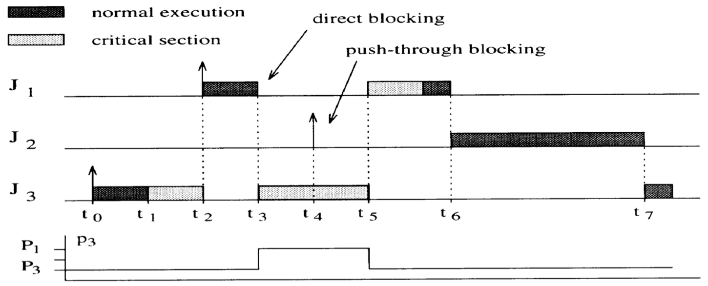
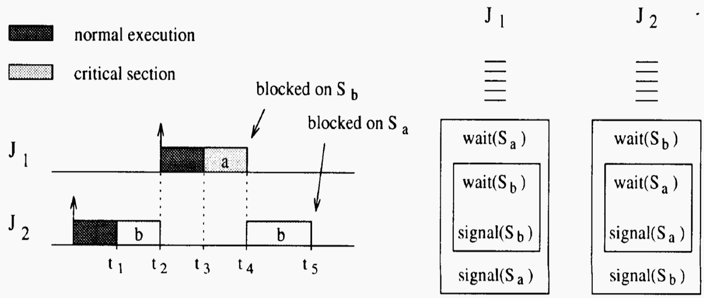
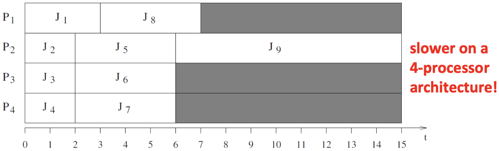

If we want to protect exclusive resource using **semaphores,** we proceed as follows:

- Each exclusive resource $R_i$ must be protected by a different _semaphore_ $S_i$. Each critical section operating on a resource must begin with a `wait(S_i)` primitive and end with a `signal(S_i)` primitive.
- All tasks blocked on the same resource are kept in a queue associated with the semaphore. When a running task executes a `wait` on a _locked semaphore,_ it enters a blocked state, until another task executes a `signal` primitive that _unlocks_ the semaphore.

Another option to ensure data consistency is maintained at all times, access to an exclusive resource must be managed using a mutual exclusion technique. Different to semaphores, one can simply **disable all interrupts:**

```pseudo
...
taskENTER_CRITICAL();
...     // access to some exclusive resource
taskEXIT_CRITICAL();
```

The last option is to use **mutual exclusion.** In FreeRTOS, a **mutex** is a special type of semaphore that is used to control access to a resource that is shared between two or more tasks:

- When used in a mutual exclusion scenario, the mutex can be thought of as a token that is associated with the resource being shared.
- For a task to access the resource legitimately, it must first successfully `take` the token. When the token holder has finished with the resource, it must `give` the token back.
- Only when the token has been returned can another task successfully take the token, and then safely access the same shared resource.

{width=75%}

### 7.1.2 Priority Inversion

**Unavoidable blocking** will happen eventually as a result of critical sections. A simple example, is shown in the diagram below. Note here that this is the kind of blocking _we want:_

{width=50%}

However, we can have **priority inversion.** In the diagram below, $J_1$ is blocked by $J_2$, which has nothing to do with the critical section, via $J_3$. This should not be possible, since $J_1$ has higher priority than $J_2$ (and $J_3$):

{width=50%}

One solution to priority inversion is to _disallow preemption_ during the execution of all critical sections. This is a simple approach, but it creates unnecessary blocking as unrelated tasks may be blocked:

{width=50%}

### 7.1.3 Priority Inheritance Protocol (PIP)

The basic idea of **resource access protocols** is to modify the priority of those tasks that cause blocking. When a task $J_i$ blocks one or more higher-priority tasks, it temporarily assumes a higher priority.

The **priority inheritance protocol** is based on the following ideas:

- Assumptions: $n$ tasks which cooperate through $m$ shared resources. Fixed priorities, all critical sections on a resource begin with `wait(S_i)` and end with a `signal(S_i)` operation.
- Basic idea: When a task $J_i$ blocks one or more higher-priority tasks, it temporarily assumes (inherits) the higher priority of the blocked tasks.
- Terms: We distinguish between a fixed **nominal priority** $P_i$ and an **active priority** $p_i$ larger or equal to $P_i$. Jobs $J_1,..., \, J_n$ are ordered with respect to nominal priority where $J_1$ has the highest priority. Jobs do not suspend themselves.

The algorithm for the priority inheritance protocol is as follows:

1. Jobs are scheduled based on their _active priorities._ Jobs with the same priority are executed in a FCFS discipline.
2. When a job $J_i$ tries to enter a critical section and the resource is blocked by a lower priority, job $J_i$ is blocked. Otherwise, it enters the critical section.
3. When a job $J_i$ is blocked, it transmits its active priority to the job $J_k$ that holds the semaphore. $J_k$ resumes and executes the rest of the critical section with a priority $p_k = p_i$ (it inherits the priority of the highest priority of the jobs blocked by it).
4. When $J_k$ exists a critical section, it unlocks the semaphore and the highest priority job blocked on that semaphore is awakened. If no other jobs are blocked by $J_k$, then $p_k$ is set to $P_k$, otherwise it is set to the highest priority of the jobs blocked by $J_k$.
5. Priority inheritance is _transitive,_ i.e. if $J_1$ is blocked by $J_2$ and $J_2$ is blocked by $J_3$, then $J_3$ inherits the priority of $J_1$ via $J_2$.

{width=50%}

We distinguish two types of **blocking** in PIP:

- _Direct blocking:_ higher-priority job tries to acquire a resource held by a lower-priority job.
- _Push-through blocking:_ medium-priority job is blocked by a lower-priority job that has inherited a higher priority from a job it directly blocks.

_Example:_ Following is another example with **nested blocking:**

{width=50%}

However, one problem still occurring is **deadlocks.** Consider the following execution of the PIP:

{width=50%}

## 7.2 Timing Anomalies

### 7.2.1 Introduction

Suppose, a real-time system works correctly with a given processor architecture. Now, you replace the processor with a faster one. Are real-time constraints still satisfied?

Unfortunately, this is not true in general. _Monotonicity_ does not hold in general, i.e. making a part of the system operate faster does not lead to a faster system execution. In other words, many software and system architectures are fragile.

### 7.2.2 Single-Processor Example

Consider the following example where replacing one processor with one that is twice as fast leads to a _deadline miss:_

{width=75%}

### 7.2.3 Multi-Processor Example

The different anomalies we are going to show in the following figures are commonly known as **Richard's Anomalies.** Consider 9 tasks with the following precedence constraints and execution times:

{width=25%}

Scheduling is preemptive fixed priority, where lower-numbered tasks have a higher priority than higher numbers. Assignment of tasks to processors is greedy.

The optimal schedule is given on a _3-processor architecture_ as follows:

{width=34%}

Consider the following anomalies:

{width=34%}

{width=34%}

## 7.3 Communication and Synchronization

The problem with **communication between tasks** is that the use of shared memory for implementing communication tasks may cause priority inversion or blocking. Therefore, either the implementation of the shared medium is _thread safe_ or the data exchange must be _protected by critical sections._

**Synchronous communication** is defined as:

- Whenever two tasks want to communicate, they must be synchronized for a message-transfer to take place (_rendez-vous_).
- They have to wait for each other, i.e. both must be at the same time ready to do the data exchange.

This has the following problems:

- In case of dynamic real-time systems, estimating the maximum blocking time for a process rendez-vous is difficult.
- Communication always needs synchronization. Therefore, the timing of the communication partners is closely linked.

**Asynchronous communication** is defined as:

- Tasks do not necessarily have to wait for each other.
- The sender just deposits its message into a channel and continues its execution. Similarly, the receiver can directly access the message if at least a message has been deposited into the channel.
- More suited for real-time systems than synchronous communication.
- **Mailbox:** Shared memory buffer, FIFO-queue, basic operations are `send` and `receive`, usually has a fixed capacity.
- **Problem:** Blocking behavior if the channel is full or empty. Alternative approach is provided by cyclical asynchronous buffers or double buffering.

_Example_ in FreeRTOS:

{width=75%}

A **Cyclical Asynchronous Buffer (CAB)** is described by:

- Non-blocking communication between tasks
- A reader gets the most recent message put into the CAB. A message is not consumed by a receiving process, but is maintained until overwritten by a new message.
- As a consequence, once the first message has been put into a CAB, a task can never be clocked during a receive-operation. Similarly, since a new message overwrites the old one, a sender can never be blocked.
- Several readers can simultaneously read a single message from the CAB.

# Chapter 8: Hardware Components

_Skipped in the lecture._

# Chapter 9: Power and Energy

## 9.1 General Remarks

The following two statements are true since a decade or longer:

> _"Power is considered as the most important constraint in embedded systems."_

> _"Power demands are increasing rapidly, yet batter capacity cannot keep up."_

The main reasons are:

- Power provisioning is expensive
- Battery capacity is growing only slowly
- Devices may overheat
- Energy harvesting is limited due to relatively low energy available density

Some remarks about _energy efficiency:_

- It is necessary to optimize HW and SW
- Use heterogeneous architectures in order to adapt to required performance and to class of application
- Apply specialization techniques

## 9.2 Power and Energy

We define the energy $E$ in terms of power $P$ and time $t$:

$$
E = \int P(t) \, dt
$$

> In some cases, faster execution also means less energy, but the opposite may be true if power has to be increased to allow for a faster execution.

_Low power vs. low energy:_

- Minimizing the _power consumption_ ($\text{voltage} \times \text{current}$) is important for:
    - the design of the power supply and voltage regulators
    - the dimensioning of interconnect between power supply and components
    - cooling
- Minimizing the _energy consumption_ is important due to:
    - restricted availability of energy
    - limited batter capacities
    - very high cost of energy
    - long lifetimes, low temperatures
