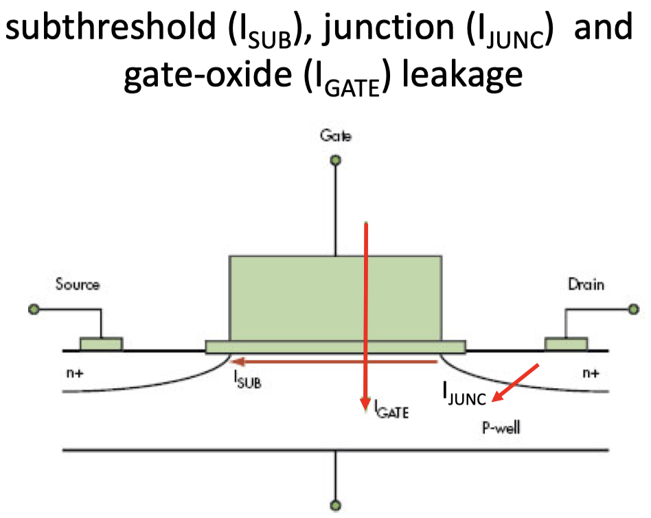
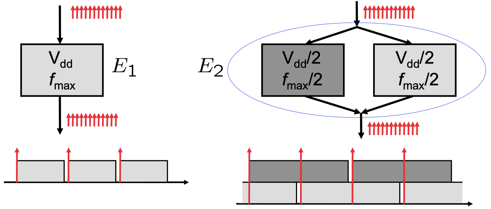
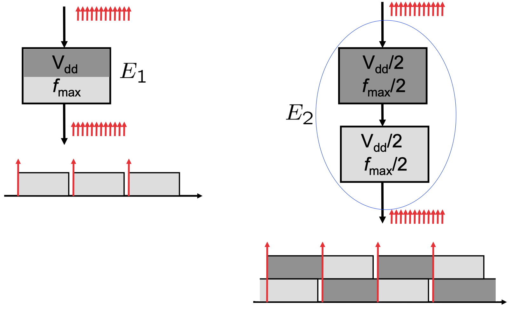
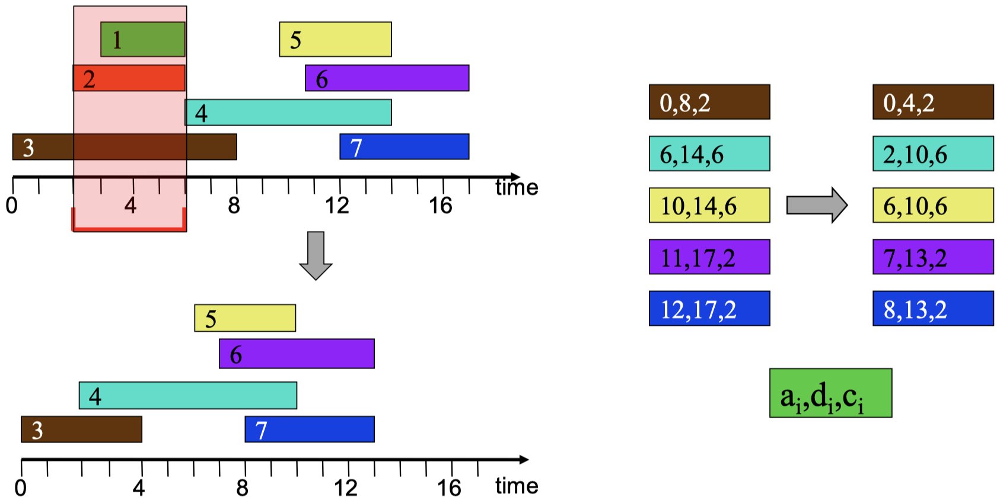
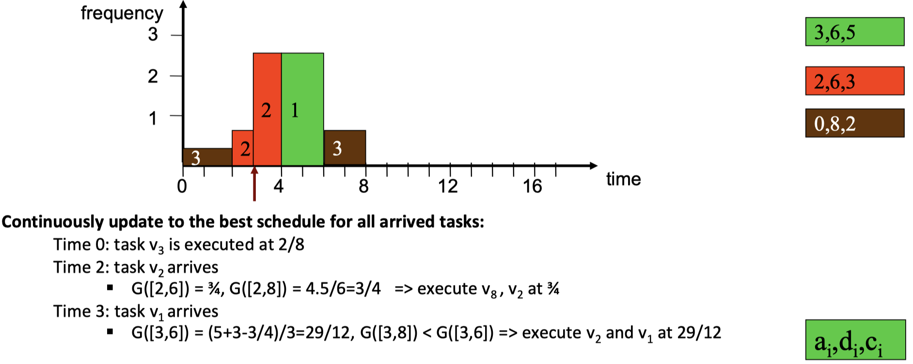
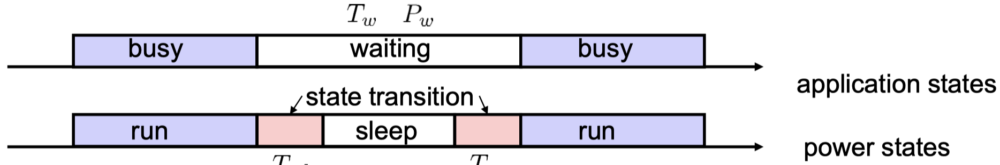

We know look at the _power consumption_ a CMOS gate. The following two diagrams show the different currents present in a CMOS gate:

{width=34%}

{width=34%}

The main sources for power consumption in CMOS processors are:

- _Dynamic power consumption:_
    - charging and discharging capacitors
    - short circuit power consumption
- _Leakage and static power:_
    - gate-oxide/subthreshold/junction leakage
    - becomes one of the major factors due to shrinking feature sizes in semiconductor technology

**Power gating** is one of the most effective ways of minimizing static power consumption (_leakage_). The idea is simple: cut-off power supply to inactive units and components.

We introduce the following two (simplified) relations:

1. Average power consumption of CMOS circuit (ignoring leakage):

$$
P \sim \alpha C_LV^2_{dd}f,
$$

where:

- $V_dd$: supply voltage
- $\alpha$: switching activity
- $C_L$: load capacity
- $f$: clock frequency

2. Delay of CMOS circuits:

$$
\tau \sim C_L \frac{V_{dd}}{(V_{dd} - V_T)^2} \sim \frac{1}{V_{dd}},
$$

where:

- $V_{dd}$: supply voltage
- $V_T$: threshold voltage ($V_T << V_{dd})$

> **Dynamic Voltage Scaling (DVS): Decreasing $V_{dd}$ reduces $P$ quadratically ($f$ constant). The gate delay increases reciprocally with decreasing $V_{dd}$. The maximal frequency $f_{max}$ decreases linearly with decreasing $V_{dd}$.

In the end we have that:

$$
E \sim \alpha C_L V^2_{dd}ft = \alpha C_L V^2_{dd}(\text{\# cycles})
$$

This leads to the final possible options for _saving energy_ for a given task:

- reduce the supply voltage $V_{dd}$
- reduce switching activity $\alpha$
- reduce the load capacitance $C_L$
- reduce the number of cycles $\text{\# cycles}$

## 9.3 Techniques to Reduce Dynamic Power

We look at three different strategies to reduce the _dynamic power:_

**Parallelism:**

- $E_1 \sim V^2_{dd} (\text{\# cycles})$
- $E_2 = \frac{1}{4}E_1$

{width=50%}

**Pipelining:**

- $E_1 \sim V^2_{dd} (\text{\# cycles})$
- $E_2 = \frac{1}{4}R_1$

{width=50%}

**Very Long Instruction Word (VLIW) Architectures:**

- Large degree of parallelism
    - many parallel computational units, deeply pipelined
- Simple hardware architecture
    - explicit parallelism
    - parallelization is done offline

{width=50%}

## 9.4 Dynamic Voltage and Frequency Scaling - Optimization

We quickly revisit the previously seen relations:

- $P \sim \alpha  C_LV^2_{dd}f$
- $E \sim \alpha C_LV^2_{dd}ft = \alpha C_LV^2_{dd}(\text{\# cycles})$
- $f \sim \frac{1}{\tau} \sim V_{dd}$, where $\tau$ is the gate delay (?) and $f$ is the maximum frequency of operation

We look at different approaches in **dynamic voltage and frequency scaling (DVFS)** to find an optimal strategy. We first define:

- _gate delay:_ $\tau \sim \frac{1}{V_{dd}}$
- _execution rate:_ $f(t) \sim V_{dd}(t)$
- _invariant:_ $\int V_{dd}(t) \, dt = \text{const.}$

Consider the following two cases:

- _Case A:_ execute at voltage $x$ for $T \cdot a$ time units and at voltage $y$ for $(1-a) \cdot T$ time units. The _energy consumption_ is $T \cdot (P(x) \cdot a + P(y) \cdot (2-a))$.
- _Case B:_ execute at voltage $z = (P(x) \cdot a + P(y) \cdot (1-a))$ for $T$ time units. The _energy consumption_ is $T \cdot P(z)$.

This results in:

{width=34%}

If possible, _running at a constant_ frequency (voltage) minimizes the energy consumption for dynamic voltage scheduling. Case A is always worse if the power consumption is a convex function of the supply voltage.

Consider **real-time offline scheduling on one processor.** Let us model a set of independent tasks as follows: We suppose that a task $v_i \in V$:

- requires $c_i$ computation time at normalized processor frequency 1
- arrives at time $a_i$
- has an absolute deadline constraint $d_i$

How do we schedule these tasks such that all these tasks can be finished no later than their deadlines and the energy consumption is minimized? We look at the **YDS algorithm.** Remember:

> If possible, running at a constant frequency (voltage) minimizes the energy consumption for dynamic voltage scaling.

**YDS Optimal DVFS Algorithm for Offline Scheduling:**

1. Define the **intensity** $G([z, \, z'])$ in some time interval $[z, \, z'$: average accumulated execution time of all tasks that have arrival and deadline in $[z, \, z']$ relative to the length of the interval $z-z'$:

- $V'([z, \, z']) = \{v_i \in V : z \leq a_i < d_i \leq z' \}$
- $G([z, \, z']) = \sum_{v_i \in V'([z, \, z'])} c_i / (z'-z)$

2. Execute the jobs in the interval with the highest intensity by using the earliest-deadline first schedule and running at the intensity as the frequency.

{width=50%}

3. Adjust the arrival times and deadlines by excluding the possibility to execute at the previous critical intervals.

{width=50%}

4. Run the algorithm for the revised input again.

{width=50%}

5. Put the pieces together.

{width=50%}

**YDS Optimal DVFS Algorithm for Online Scheduling:** The idea is simple, we continuously update to the best schedule for all arrived tasks:

{width=50%}

{width=50%}

{width=50%}

{width=50%}

_Remarks on the YDS Algorithm:_

- Offline:
    - The algorithm guarantees the minimal energy consumption while satisfying the timing constraints.
    - The time complexity is $O(n^3)$, where $n$ is the number of tasks in $V$
- Online:
    - Compared to the optimal offline solution, the online schedule uses at most 27 times of the minimal energy consumption.

## 9.5 Dynamic Power Management

**Dynamic power management (DPM)** tries to assign the optimal power saving states during program execution. _Example:_ StrongARM SA1100:

{width=50%}

It is desired that a _shutdown_ only happens during _long waiting times._ This leads to a trade-off between energy saving and overhead.

We define the **break-even time** as the minimum waiting time required to compensate the cost of entering an inactive (sleep) state. Entering an inactive state is beneficial only if the waiting time is longer than the break-even time. We make the following assumptions for the calculation:

- No performance penalty is tolerated
- An ideal power management that has the _full_ knowledge of the future workload trace.

Consider the following two scenarios:

{width=50%}

- Scenario 1 (no transition): $E_1 = T_w \cdot P_w$
- Scenario 2 (state transition): $E_2 = T_{sd} \cdot P_{sd} + T_{wu} \cdot P_{wu} + (T_w - T_{sd} - T_{wu}) \cdot P_s$

We can calculate the _break-even time_ by limiting for $T_w$ such that $E_2 \leq E_1$ which results in the following **break-even constraint**

$$
T_{w} \geq \frac{T_{sd} \cdot (P_{sd} - P_s) + T_{wu} \cdot (P_{wu} - P_s)}{P_w - P_s},
$$

and the following **time constraint:** $T_w \geq T_{ds} + T_{wu}$.
