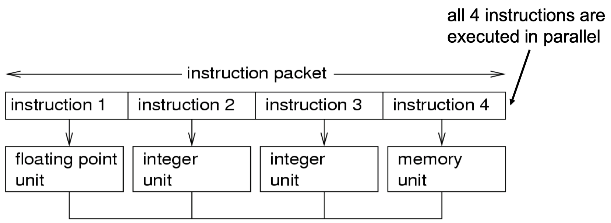

We know look at the _power consumption_ a CMOS gate. The following two diagrams show the different currents present in a CMOS gate:

{width=34%}

{width=34%}

The main sources for power consumption in CMOS processors are:

- _Dynamic power consumption:_
    - charging and discharging capacitors
    - short circuit power consumption
- _Leakage and static power:_
    - gate-oxide/subthreshold/junction leakage
    - becomes one of the major factors due to shrinking feature sizes in semiconductor technology

**Power gating** is one of the most effective ways of minimizing static power consumption (_leakage_). The idea is simple: cut-off power supply to inactive units and components.

We introduce the following two (simplified) relations:

1. Average power consumption of CMOS circuit (ignoring leakage):

$$
P \sim \alpha C_LV^2_{dd}f,
$$

where:

- $V_dd$: supply voltage
- $\alpha$: switching activity
- $C_L$: load capacity
- $f$: clock frequency

2. Delay of CMOS circuits:

$$
\tau \sim C_L \frac{V_{dd}}{(V_{dd} - V_T)^2} \sim \frac{1}{V_{dd}},
$$

where:

- $V_{dd}$: supply voltage
- $V_T$: threshold voltage ($V_T << V_{dd})$

> **Dynamic Voltage Scaling (DVS): Decreasing $V_{dd}$ reduces $P$ quadratically ($f$ constant). The gate delay increases reciprocally with decreasing $V_{dd}$. The maximal frequency $f_{max}$ decreases linearly with decreasing $V_{dd}$.

In the end we have that:

$$
E \sim \alpha C_L V^2_{dd}ft = \alpha C_L V^2_{dd}(\text{\# cycles})
$$

This leads to the final possible options for _saving energy_ for a given task:

- reduce the supply voltage $V_{dd}$
- reduce switching activity $\alpha$
- reduce the load capacitance $C_L$
- reduce the number of cycles $\text{\# cycles}$

## 9.3 Techniques to Reduce Dynamic Power

We look at three different strategies to reduce the _dynamic power:_

**Parallelism:**

- $E_1 \sim V^2_{dd} (\text{\# cycles})$
- $E_2 = \frac{1}{4}E_1$

{width=50%}

**Pipelining:**

- $E_1 \sim V^2_{dd} (\text{\# cycles})$
- $E_2 = \frac{1}{4}R_1$

{width=50%}

**Very Long Instruction Word (VLIW) Architectures:**

- Large degree of parallelism
    - many parallel computational units, deeply pipelined
- Simple hardware architecture
    - explicit parallelism
    - parallelization is done offline

{width=50%}

## 9.4 Dynamic Voltage and Frequency Scaling - Optimization
