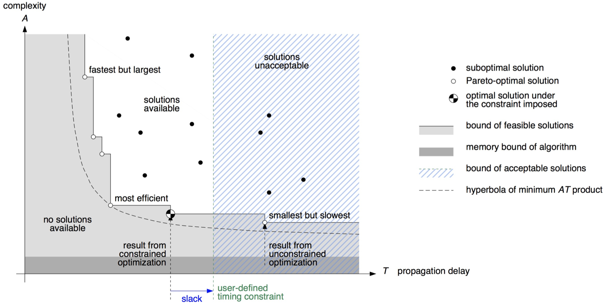
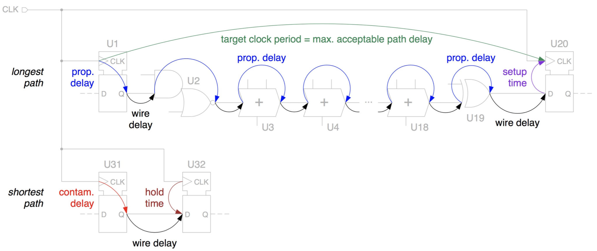
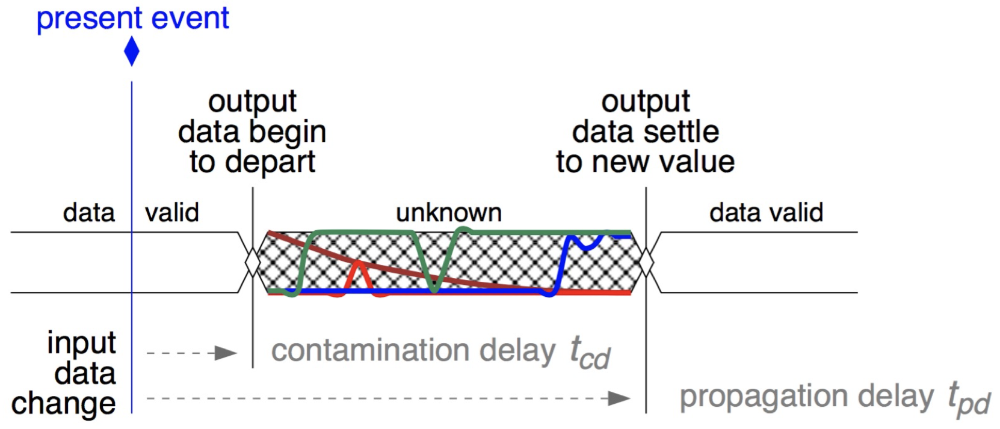
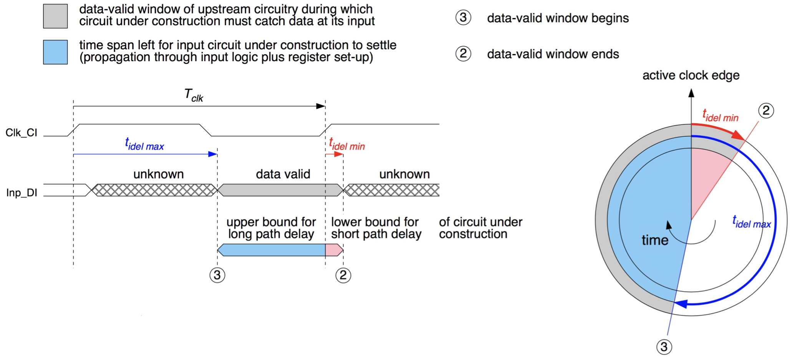

# Chapter 1 : Introduction to Microelectronics

## 1.1 Economic Impact

**Microelectronics** is acting as a technology driver that enables or expedites a range of industrial, commercial, and service activities. One might consider:

- Computer and software industry
- Telecommunications and media industry
- Commerce, logistics, and transportation
- Natural science and medicine
- Power generation and distribution
- Finance and administration

We make the following observation:

> Observation: Microelectronics is *the* enabler of information technology.

## 1.2 Microelectronics Viewed From Different Perspectives

### 12.2.1 Circuit Complexity

An **integrated circuit (IC)** is an electronic component that incorporates and interconnects a multitude of miniature electronic devices, mostly *transistors*, on a single piece f semiconductor material, typically *silicon*.
Many such circuits are jointly manufactured on a thin semiconductor wafer with a diameter of typically 300 mm before they get cut apart to become (*naked*) **dies**.

The vast majority of ICs or **(micro)chips** get individually encapsulated in a hermetic package before being soldered onto **printed circuit boards (PCB)**.

### 1.2.2 The marketing point of view

#### General-purpose ICs

The function of a *general-purpose IC* is either so simple or so generic that the component is being used in a multitude of applications and typically sold in huge quantities. Examples are gates, flip-flops, adders, RAMs, ROMs, etc.

#### Application-specific integrated circuit

*Application-specific integrated circuits (ASIC)* are being specified and designed with a particular purpose, equipment, or processing algorithm in mind. Today's highly-integrated ASICs are quite complex and include powerful subsystems.

The term **system-on-a-chip (SoC)** has been coined to reflect this development.

We further divide ASICs into the following categories:

- *Application-specific standard product (ASSP):* An ASSP is being sold to various customers for incorporation into their own products. Examples include graphics accelerators, multimedia chips, etc.
- *User-specific integrated circuit (USIC):* A USIC is being designed and produced for a single company that seeks a competitive advantage for their products, they are not intended to be marketed as such. Popular USICs include the Apple A4 SoC introduced with the iPad in 2010 and its successors.

### 1.2.3 The Fabrication Point of View

**Field-programmable logic (FPL)** uses neither custom layout structures nor proprietary photomasks. Instead, pre-manufactured subcircuits get configured into the target via purely electrical means, such as programmable links.

Compared to mask-programmed ICs:

- Easy and extremely fast to modify
- I/O subcircuits, clock and power distribution, embedded memories, testability, etc. come at no extra effort shut in the component
- Large overhead in terms of area, delay and energy

The basic structure of an FPGA is composed of the following elements:

- Look-up table (LUT) in Logic Block: Performs the logic operations
- Flip-Flop (FF): Performs the storing of the results of the LUT
- Wires: Connect elements to one another, both Logic and clock
- Input/Output pads: These physically available ports get signals in and out of the FPGA

To what extent is a circuit manufactured to user specifications?

- _Full-custom IC:_ All fabrication layers, full set of photomasks.
- _Semi-custom IC:_ A few metal layers only, subset of photomasks.
- _Field-programmable logic:_ Customization occurs electrically, no masks involved.
- _Standard part:_ Catalog part with no customization whatsoever.

## 1.2.4 The Business Point of View

How are the industrial activities shared among business partners?

We look at several players in the semiconductor market:

- _Integrated device manufacturer (IDM):_ A chip vendor who operates his own wafer processing facilities.
- _Silicon foundry:_ A company that operates a wafer processing line and that offers its manufacturing services to others.
- _Fabless chip vendor:_ Develops and markets proprietary semiconductor components but has their manufacturing commissioned to an independent silicon foundry.
- _Fab-lite chip vendor:_ Retains just the specialized manufacturing capabilities to integrate sensors, actuators, RF components, or photonic devices a Si substrate along with electronic circuitry.
- _Intellectual property (IP) vendor:_ A company that develops hardware subfunctions and licenses them to others for incorporation into their own ICs.
- _System house:_ A company that integrates both hardware and software into their products. Hardware is based on microprocessors, memories, ASSPs and FPGAs. USICs are being designed if and only if they provide competitive advantage.

## 1.2.5 The Design Engineer's Point of View

Which levels of detail are being addressed during a part's design?

- _Hand layout:_ Desired geometric shapes are manually drawn to scale. This allows for optimum density, performance and device matching. However, it is slow, cumbersome, and prone to errors.
- _Cell-based design by means of schematic entry:_ Manual drawing of cell-level circuits followed by automatic place & route.
    - _Standard cells:_ Small universal building blocks, preestablished layout, full characterized, e.g. logic gates, flip-flops, adders, etc.
    - _Megacells:_ Much larger size and complexity than standard cells, e.g. microprocessor cores.
    - _Macrocells:_ Layout put together on a per-case basis according to specs from a limited collection of layout tiles, e.g. RAM and ROM.

_Example:_ An example of a standard cell would be a 3-input NOR gate:

{width=67%}

_Figure 2.1:_ Icon (a), simulation model (b), test vector set (c), transistor-level schematic (d), detailed layout (e), and cell abstract (f).

**Automatic circuit synthesis** is based on the following processes:

- Logic synthesis: Accepts logic equations, truth tables, and state graphs. Generates a gate-level netlists for combinatorial logic and for finite state machines (FSM). This whole process is absorbed in today's EDA flows.
- Register transfer level (RTL) synthesis: The circuit is viewed as a network of storage elements, such as registers and also RAMs, held together by combinational logic. Behavioral specs are allowed to include arithmetic functions, string operations, arrays, enumerated types, etc.

**Architecture synthesis** starts from a purely algorithmic description. Source code includes no explicit indications for how to marshal data processing operations and hardware resource. It follows 5 steps:

1. Identify the computational and storage requirements.
2. Select a suitable building block for each processing and storage operation.
3. Establish a cycle-based schedule for carrying out the algorithm.
4. Decide on a hardware organization able to execute the resulting work plan.
5. Translate the data moves and operations for each clock cycle into the necessary instruction for RTL synthesis.

**Design with virtual components (VCs)** works based on HDL synthesis packages made available to others on a commercial basis. In contrast to standard cells, macro- and megacells, which are process-specific (_hard modules_), VCs are portable across fabrication technologies (_soft modules_).

In summary, we have seen the following options for capturing a design with EDA tools:

- Hand layout: Confined to niches.
- Schematic entry: Important at its time, largely confined to analog circuit design today.
- RTL synthesis: VHDL or SystemVerilog code is automatically translated to gate-level netlist. Universally adopted.
- Architecture synthesis: SW code is automatically translated to an RTL synthesis model.
- Incorporation of VCs: Purchased HDL code is automatically translated to gate-level netlist. Routine practice today.

Multiple of the above-mentioned approaches are usually combined!

## 1.3 The VLSI Design Flow

### 1.3.1 Major Stages in Digital VLSI Design

At the stage of **system-level design,** the decisions take determine the final outcome more than anything else:

- Specify the functionality and characteristics of the systems
- Partition the system's functionality into subtasks
- Explore alternative hardware and software tradeoffs
- Decide on interfaces and protocols for data exchange
- Define, model, evaluate, and refine the various subtasks

The final result after the above steps is the **system-level model.**

The next step is the **algorithm design** which is concerned with streamlining computations in view of their implementation in hardware:

- Cut down computational burden and memory requirements
- Find compromises between computational complexity and accuracy
- Contain effects due to finite word-length computation
- Quantify the minimum required computational resources

The result of the algorithm design is the **bit-true software model.**

The **architecture design** takes important high-level decisions:

- Partition a computational task in view of hardware realization
- Organize the interplay of the various subtasks
- Define datapaths and controllers
- Decide on a circuit style and fabrication process

The result of the architecture design is a **high-level block diagram and preliminary floorplan.**

The **physical design** consists of the following steps:

1. Floorplanning
2. Padframe generation and power distribution
3. Initial placement of cells
4. Clock tree insertion
5. Detailed routing
6. Chip assembly
7. Substitution of detailed layout for cell abstracts

The result is _polygon layout data for mask preparation._

Prior to fabrication, all layout data needs to be checked to protect against fatal mishaps. The set of available instruments includes:

- Check conformity of layout with geometric rules
- Search for patters likely to be detrimental to yield
- Layout extraction to obtain the actual circuit netlist
- Post-layout simulation

### 1.3.3 FPGA

_Reconfigurable computing_ describes computer architecture combining some flexibility of software with the high performance of hardware by processing with very flexible high speed computing fabrics like **field-programmable gate array (FPGAs).**

- The main difference compared to _ordinary microprocessors_ is the ability to make substantial changes to the datapath itself in addition to the control flow.
- The main difference compared to _custom hardware_ is the possibility to adapt new hardware during runtime by "loading" a new circuit on the reconfigurable fabric.

The basic structure of an FPGA is composed of the following components:

- Look-up table (LUT): This element performs logic operations.
- Flip-Flop (FF): This register element stores the result of the LUT.
- Wires: These elements connect elements to one another, both logic and clock.
- Input/Output (I/O) pads: These physically available ports get signals in and out of the FPGA.

How can we implement any circuit in an FPGA? Combinational logic is represented by a truth table. Truth tables are implemented in small memories (LUTs). The input values are used to address the LUT and retrieve the value of the function corresponding to the input values.

A LUT is basically a multiplexer that evaluates the truth table stored in the configuration SRAM cells. Sequential logic is handled by adding a flip-flop to the output LUT, i.e. a clocked storage element. This is called a _basic logic element (BLE)._

_Example:_ Consider this simplified Xilinix Configurable Logic Block (CLB):

{width=67%}

Before an FPGA is programmed, it doesn't know which CLBs will be connected. Connections are designed dependent, so there are wires everywhere, both for data and the clock! CLBs are typically arranged in a grid, with wires on all sides. To connect CLBs to wires, _connection boxes_ are used: these blocks allow inputs and outputs of CLBs to connect to different wires. Inside a connection box, there are configurable switches.

{width=50%}

In those switch boxes (connection boxes) there are _short channels_ (useful for connecting adjacent CLBs) and _long channels_ (useful for connecting separated CLBS), this reduces routing delay for non-adjacent CLBs.

The FPGA fabric includes embedded memory elements that can be used as random-access memory (RAM), read-only memory (ROM), or shift registers. These elements are block RAMs (BRAMs), LUTs, and shift registers.

- Using LUTs as SRAM is called _distributed RAM._
- Included dedicated RAM components in the FPGA fabric are called _block RAM._

The **I/O PADs** connect the signals from the PCB to the internal logic. The **IOBs** are organized in banks. All the PADs in the same bank share a common supply voltage.
The I/O Blocks (IOB) support a wide range of commercial standards, both single ended and differential.

# Chapter 2: SystemVerilog Design -- Introduction and Basics

## 2.1 Overview

During the next few lectures we will:

- Learn to describe digital hardware efficiently using HDL:
    - Combinational circuits
    - Sequential building blocks and Finite State Machines
    - Rely on regular and simple structures
- Be able to program FPGAs to realize digital circuits
    - This will be valuable in many fields
    - You will be able to use what you learn also to design ASIC circuits
- Learn how to verify the correct functionality of these circuits
    - Writing testbenches in HDL

**Hardware Description Languages (HDL)** is not _really_ a programming language, however it looks a lot like one. HDL was developed to simplify circuit schematics.

We quickly compare VHDL and SystemVerilog:

| VHDL                     | SystemVerilog            |
| :----------------------- | :----------------------- |
| Case-insensitive         | Case-sensitive           |
| 9 different logic values | 4 different logic values |
| More verbose             | Compact code             |
| Strong type checking     | Not much checking        |
| More popular in Europe   | More popular in US       |

For this lecture we will be using SystemVerilog. Both of them are very similar, i.e. key concepts are identical.

## 2.2 Drawing Circuit Schematics

### 2.2.1 `module`

A **module** is defined by the _name_ of the block, some optional _parameters_, and some _signal names_ with a direction and a type.

```vhdl
module top #(parameter int Width = 16) (
    input   logic               clk_i,
    input   logic               rst_ni,
    input   logic               mode_i,
    input   logic [Width-1:0]   data_in_i,
    output  logic [Width-1:0]   result_o
);
```

_Remark:_ Some notes on good practices using HDL:

- Always use one file per SystemVerilog module
- Make sure that the file and the module are named the same
- SystemVerilog is case-sensitive, try to stick to one way of describing inputs/outputs/logic etc.

### 2.2.2 `body`

The **body** describes the function. We declare **local wires** to use for internal connections.

```vhdl
// Declare signals to be used in the module
logic [Width-1:0] first, second;
logic [Width-1:0] combine_and, combine_or;
```

### 2.2.3 `instantiation`

One can include other modules in his own module. This allows for some level of hierarchy. Below is a code example where two instances of the component `ffs`, called `i_reg_1` and `frank`, are instantiated. These are described in some other module.

```vhdl
// Instantiate two blocks with different names i_reg_1 and frank
ffs #(.Width(Width)) i_reg_1 (
    .clk_i(clk_i), .rst_ni(rst_ni), .in_i(data_in_i), .out_o(first));
ffs #(.Width(Width)) frank (
    .clk_i(clk_i), .rst_ni(rst_ni), .in_i(first), .out_o(second));
)
```

The module we instantiated (`ffs`) will be described separately. One must make sure that the module description and the instantiation match.

### 2.2.4 Comments

SystemVerilog uses C++ style comments, i.e. everything after `//` is a comment. One could also use `/*...*/`, but we do not recommend that.

## 2.3 More on HDL

What we have look at so far is called **structural HDL.** The circuit includes other circuits which are interconnected. There is no other information than interconnections and instantiations.

A **netlist** is a structural HDL that instantiates only library components. The library components are simple pre-designed circuits with physical properties. Once we have a circuit netlist, it has a corresponding physical form, and it can be manufactured.

Additional benefits of HDL came much later:

- _Simulation:_ It was soon discovered that we could also see how a digital circuit described in HDL is working.
- _Synthesis:_ Logic synthesis algorithms can map the HDL description into a library of common logic gates such as AND, OR gates using boolean algebra resulting in a _gate-level netlist._

## 2.4 Data Type of HDL

### 2.4.1 Logic Values

In SystemVerilog with have 4 different **logic values:**

- _0:_ logic low value
- _1:_ logic high value
- _X:_ used for a) a drive conflict, i.e. when a wire is driven by two sources at the same time, b) when we do not really know the value of a wire, and c) if we do not care what the input is
- _Z:_ used as the inactive logic state, i.e. when we do not drive the output.

### 2.4.2 `logic`

The main data type we use in SystemVerilog is **logic.** If we are defining wires, inputs, outputs, signals and constants we use `logic`. If a constant is only used in one module, we can declare them as `localparam`. We can use the `assign` statement to connect these signals/constants.

```vhdl
module top (
    input   logic data_in_i,
    output  logic results_ready_o
);

    logic   first, second;
    logic   third;
    localparam ZERO         = 1'b0;         // constant definition

    assign first            = data_in_i;    // this connects first to data_in_i
    assign results_ready_o  = third;        // connections represent electrical wires
    assign third            = first;        // the order you define them is not important
    assign second           = ZERO;         // assign a constant value to a wire
```

### 2.4.3 `wire/reg`

One annoying exception are **tristate wires.** These need to be `wire` or `reg`.

Tristate wires are wires that can be both written to and ream from, they cannot be `logic`.

### 2.4.4 `logic` Arrays

If we need more than one bit, `logic` can also be an array. Arrays can be as large as one wants, the range can be specified as one likes to. WE can define the array from MSB to LSB, wehich we call the _standard packed format._ An array can also have multiple dimensions: `logic [15:0][7:0] varname`

```vhdl
logic   [7:0] eight_bit_bus;
logic   [15:0] big bus;
logic   [0:0] tiny_bus;
logic   fist, second, third;

assign eight_bit_bus = 8'b0000_0000;    // assigning a constant
assign big_bus[15:8] = eight_bit_bus;   // partial assignment
assign first         = big_bus[3];      // picking out single bits
```

### 2.4.5 Packed vs. Unpacked Arrays

In _packed_ arrays, dimensions are declared after the type and before the data identifier name: `logic [15:0] some_wire_name` They are ordered from MSB to LSB.

In _unpacked_ arrays, dimensions are declared after the data identifier: `int some_name [0:15]` They can be ordered in both ways, but ETH _insists_ on ordering from LSB to MSB. The shorthand `int some_name [8]` is equivalent to `int some_name [0:7]`. They can be used with any type, but ETH _insists_ that they are not used for logic types.

### 2.4.6 Accessing and Assigning Vectors

We use `{ }` to combine vectors together:

```vhdl
assign y = {a[2], a[1], a[0], a[3]}
assign x = {a[0], a[0], a[0], a[0]}
assign x = {4{a[0]}}                // It is possible to define multiple copies
```

### 2.4.7 `typedef`

SystemVerilog gives us great flexibility by allowing us to define new subtypes using `typedef`.

- This causes a lot of problems.
- Consistent use of coding styles is very important in debugging.

```vhdl
typedef logic [7:0] u8_t;
logic         [31:0] u32_word;
u8_t          [1:0] u16_word;
u8_t          byte3, byte2, byte1, byte0;

assign u16_word = {byte1, byte0};
assign u32_word = {byte3, byte2, u16_word};
```

### 2.4.8 Numbers

**Numbers** in SystemVerilog are expressed in the form `N'Bxx`, e.g. `8'b0000_0001`. In detail:

- `N` is the number of bits.
- `B` is the base and can be `b` (binary), `h` (hexadecimal), `d` (decimal), or `o` (octal)
- `xx` is the number, i.e. the value expressed in the chosen base. Apart from numbers this can also include `X` and `Z` as values.

## 2.5 Naming Conventions

The basic idea of the **naming conventions** used at IIS is to add a `_` and a regular suffix to identify special signals:

| Type          | Suffix    | Description                                        |
| :------------ | :-------- | :------------------------------------------------- |
| inputs        | `_i`      | Signals that are declared input in the module      |
| outputs       | `_o`      | Signals that are declared output in the module     |
| types         | `_t`      | Type definitions                                   |
| reset         | `_r`      | Asynchronous reset used for flip-flops and latches |
| clock         | `_c`      | Clock signals for flip-flops and latches           |
| active low    | `_n`      | Signals that are active when they have the value 0 |

## 2.6 Simple Implementations

### 2.6.1 Basic Logic Functions

```vhdl
assign y0 =  ~a;        // NOT
assign y1 =   a & b;    // AND
assign y2 =   a | b;    // OR
assign y3 =   a ^ b;    // XOR
assign y4 = ~(a & b);   // NAND
assign y5 = ~(a | b);   // NOR
```

### 2.6.2 Simple Multiplexers

**Multiplexers** are very common building blocks in digital design.

```vhdl
module mux2(
    input  logic [3:0] data0_i, data1_i,
    input  logic       select_i,
    output loigc [3:0] result_o
);

assign result_o = select_i ? data1_i : data0_i;
```

_Remark:_ In SystemVerilog we can also use the **ternary operator:** `assign value = condition ? true : false;`

**Multi-level multiplexers** can also be defined:

```vhdl
module mux4(
    input  logic [3:0] data0_i, data1_i, data2_i, data3_i,
    input  logic [1:0] select_i,
    output logic [3:0] result_0
);

assign result_o = (select_i == 2'b11) ? data3_i :
                  (select_i == 2'b10) ? data2_i :
                  (select_i == 2'b01) ? data1_i :
                  data0_i;
```

### 2.6.3 Bitwise vs. Logical Operators

**Bitwise operators** are of the form `~, &, |, ^, =`. They will work on all bits of a vector and result in a vector of the same size. They are used to implement simple boolean functions.

**Logical operators** are of the form `!, &&, ||, ==, !=`. They will generate a true or false results and are used as a condition in, for example, ternary operators.

# Chapter 3: SystemVerilog Design -- Sequential Circuits

## 3.1 Introduction to Circuits

**Combinational circuits** generate an output using only the present inputs. They are simple, but also a bit limited. There are only so many functions you can describe.

**Sequential circuits** have memory. The output of a sequential circuit is a function of present inputs and all _past inputs._ The present **state** of the sequential circuit is saved internally.

In VLSI 1 we will use _synchronous single edge triggered circuits._ The state will be saved in rising (falling) edge triggered flip-flops (registers). This is the simplest way to design digital circuits. The largest part of a sequential circuit is actually combinational. Sequential circuits divide the operation into time slots. Present state and the inputs are used to calculate the next state. The next state is saved in the flip-flops.

The **clock signal** is used to tell when to move from one state to the next state.

## 3.2 Sequential Circuits

_Register Transfer Level (RTL)_ is a generic way of designing digital circuits:

- State is stored in registers
- During a time slot, inputs and present state is used to calculate the next state
- Next state is stored in a register
- The clock moves the circuit from the present state to next state

RTL defines the datapath circuits, which process data and do the main work, and _finite state machines,_ which generate control signals for the datapath, defining what operations will be done.

Sequential circuits will need the `always` statement. We call this statement a _process._ `always `has a **sensitivity** list: every time a signal in the sensitivity list changes, the body of `always` is executed.

_Remark:_ The process body is executed _sequentially,_ unlike normal descriptions in SystemVerilog.

```vhdl
module example(
    //...
);

logic state_q, state_d, a_i, cnt;
always @ (state_q, a_i, cnt) begin
    state_d = 1' bo;
    if(cnt == 1' b1) begin
        state_d = state_q;
    end else begin
        state_d = a_i;
    end
end // always
```

As we see in the example, we use `begin ... end` for longer statements. If one has only a single statement in the process, SystemVerilog allows you to skip `begin ... end`, but it is not recommended doing so.

The example above results in a combinational circuit. It will do the same as `assign state_d = (cnt) ? state_q : a_i;`.

_Remarks:_

- You cannot assign the same signal in multiple processes! Basically, one process determines the value of a signal.
- A signal assigned in a process cannot be assigned to by a concurrent statement.
- Only _one_ of the three statements in the example below can be used to determine the value of `state_d`.

```vhdl
module example (
    //...
);

logic a, state_d;

// either this statement
always @ (a) begin
    state_d = ~a;
end

// or this statement
always @ (a) begin
    state_d <=a;
end

// or this, but only one of the three
assign state_d = 1'b0;

endmodule
```

_Remark:_

- `=` is a _blocking statement._ In a `always` block, the line of code will be executed only after its previous line has executed. Hence, they happen one after another.
- `<=` is a _non-blocking statement._ This means that in a `always` block, every line will be executed in parallel, hence leading to the implementation of sequential elements.

## 3.3 States

The way you store a **state** in Verilog is by _forgetting_ to define the output signal for all cases. In the example below, we don't know what happens when `cnt == 1' b0`. We therefore preserve the prior value of `state_q` and _memorize_ it:

```vhdl
// Warning: Older Verilog Syntax
// COMBINATIONAL
always @ (state_d, a_i, cnt) begin
    state_q <= 1' b0;
    if (cnt == 1'b1) begin
        state_q <= state_d;
    end else begin
        state_q <= a_i;
    end
end

// SEQUENTIAL
always @ (state_d, a_i, cnt) begin
    // no initial value for state_q
    if (cnt == 1' b1) begin
        state_q <= state_d;
        // no else statement
    end
end

// D-type latch definition
always @ (state_d, clk_c) begin
    if (clk_c == 1' b1) begin
        state_Q <= state_d;
    end
end
```

The sensitivity list can have _attributes,_ such as:

- `posedge` is a transition from 0 to 1
- `negedge` is a transition from 1 to 0

We usually also add a `reset` signal to determine initial values of flip-flops. Traditionally, the Reset is active low. New FPGAs use an active high reset (in that case we'd write `@posedge rst_i`):

```
// Warning: Older Verilog Syntax
always @ (posedge clk_ci, negedge rst_ni) begin
    if (rst_ni == 1'b0) begin
        ff_q <= 1' b0;
    end else begin
        ff_q <= ff_d;
    end
end
```

SystemVerilog introduces _intent_ to `always` statements. There are three different `always` statements in SystemVerilog:

- Combinational circuit: `always_comb`
- Latches: `always_latch`
- Flip-flops: `always_ff`

`always_comb` has no sensitivity list. The process will be triggered when signals change. This essentially replace the old syntax of `always @ (*)`. We revisit the previous examples again:

- Combinational: `always_comb`
    - No sensitivity list needed
    - We will use blocking (`=`) statements

```vhdl
always_comb begin
    state_d = 1' b0;
    if (cnt == 1' b1) begin
        state_d = state_q;
    end else begin
        state_d = a_1;
    end
end
```

- Latches: `always_latch`
    - We will rarely use latches
    - This example is without a reset
    - We will use non-blocking (`<=`) statements

```vhdl
always_latch @ (clk_ci) begin
    if (clk_ci == 1'b1) begin
        state_q <= state_d;
    end
end
```

- Flip-flops: `always_ff`
    - Our main state holding element
    - This example is without a reset
    - We will use non-blocking (`<=`) statements

```vhdl
always_ff @ (posedge clk_ci) begin
    state_q <= state_d;
end
```

## 3.4 More on Naming Conventions

We expand our naming conventions a bit:

- We will add `_d` to signals that will be the _next state_ signals of an FF
    - The `_d` signal will be assigned in a `always_comb` process
- We will add `_q` to signals that will be the _present state_ if an FF
    - The `_q` signals will be assigned in a `always_ff` process

## 3.5 FSM Design

The basic SystemVerilog template for an FSM looks as follows:

- Next state logic: Calculates the next state `state_d` depending on inputs and present `state_q`
- State holding element: One register with a reset
- Output logic:
    - Moore: Only dependent in state
    - Mealy: Dependent on state and inputs

```vhdl
// Next State Logic
assign state_d = (cont) ? state_q : ~state_q;

// State Holding Element
always_ff @ (posedge clk_ci, negedge rst_ni) begin
    if (rst_ni == 1'b0) begin
        state_q <= 1' b0;
    end else begin
        state_q <= state_d;
    end
end

// Output Calculation
assign out_o = ~state_q;
```

Your typical digital circuit will have two parts:

{width=65%}

**Enumerated types** can be very handy for states:

- In an enumerated type you provide a list of names: these will internally map to binary code, it is up to the tool to decide.
- One can test and assign these types: makes code readable.
- Very useful for next-state code: notice the initial statement to prevent accidental sequential code.

```vhdl
typedef enum logic [1:0] {
    Init,
    Run,
    Stop,
    Wait} state_t;          // name of the type

state_t state_q, state_d;   // instances of the type

always_comb begin
    state_d = state_q;      // init
    if (state_q == Run) begin
        state_d = Wait;
    end else if ((state_q == Stop) || state_q == Wait) begin
        if (cont == 1'b1) begin
            state_d = Run;
        end
    end else if (state_q == Init) begin
        state_d = Run;
    end
end
```

One can also use `case` statements in a process:

- `case` can help a lot: more readable code in next state calculations.
- `default` is important: it maps all parasitic states
- Initial assignment is still useful

```vhdl
typedef enum log [1:0] {
    Init,
    Run,
    Stop,
    Wait} state_t;          // name of the type

state_t state_q, state_d;   // instances of the type

always_comb begin
    state_d = state_q;      // init

    case(state_q)
        Run:            state_d = Wait;
        Stop, Wait:     begin
            if (cont == 1'b1) begin
                state_d = Run;
            end
        end
        Init:           state_d = Run;
        default:        state_d = state_q;
    endcase
end
```

# Chapter 4: Functional Verification

## 4.1 Introduction

**Verification** can have different motivations:

- During specification: Is the circuit I want to design really what is needed?
- During design: Have I indeed designed a circuit that does what I specify?
- During testing: Once manufactured, can I tell working circuits from faulty ones?

We distinguish between _functional_ and _parametric verification:_

- Functional verification is about what the circuit does
    - Given a set of inputs, what is the expected behavior of the circuit?
    - Described using algorithms, equations, state-graphs, truth tables etc.
- Parametric verification is making sure physical properties are correct
    - This relates to physically measurable qualities, speed, area, power, throughput etc.
    - Units like Mbits/s, mA, nW, pF, etc.

We focus on functional verification. Ideally, we would have _formal specifications:_

- All requirements would be described formally
- We could then compare our designs mathematically and prove that they are correct

## 4.2 Fault Detection

The basic steps to **uncover a bug** are as follows:

1. Activate/sensitize: Set of inputs that will trigger a situation in which the circuit will misbehave is needed
2. Propagate: Make sure that the faulty behavior reaches an observable point. Real circuits have only limited number of I/Os and are more limited. Simulators will be able to allow you to peek into the circuit.
3. Observe/compare: The activated fault must generate a different output than an expected response.
4. Need _simulation vectors_ (input) and expected responses (outputs).

Since it is not feasible to test for every possible input, how do we choose?

- We can only afford to test for a _tiny fraction_ of possible inputs. Somehow we need to select a suitable set of input vectors that gives us sufficient coverage of the functionality.
- This is called **directed testing.** Vectors are chosen according to some method. There are some methods to help us determine if these vectors are sufficient.

Some methods to choose inputs are:

- Vector corresponding to common operation of circuit: Basic functional tests, representative inputs for the operation.
- Chosen corner cases: Cases that cause exceptions, overflows, activate seldom used functionality.
- Randomly chosen vectors: _Directed random testing_ describes the case when random vectors are constructed in a meaningful way.

SystemVerilog has built-in functions to support random vector generation.

_Example:_ Below we show an example of random code in SystemVerilog. These functions will only work in simulation and are only used in processes.

```vhdl
// let us declare some variables for examples
int          a, b;              // integer values, by default integer is signed
logic [7:0]  e, f;              // 8 bit vectors, by default logic is insigned
logic [15:0] g, i, j;           // 16 bit vectors
int          OK;                // return value for succes

// the following is in a process
a = $random;                    // a will be a random variable
b = $random(45);                // b will be a random variable from a PRNG an initial seed of 45

e = $urandom;                   // e will be a random unsigned integer
f = $urandom_range(7);          // f will return an unsigned value between 0 and 7
g = $urandom_range(15, 8);      // g will return an unsigned value between 8 and 15

OK = std::randomize (i, j) with {i != j;};      // make i, j random, with a condition
```

Here are some methods to detect if we have enough vectors:

- _Code coverage:_ check if all lines of code have been simulated. This needs support from the simulator.
- Monitoring _toggle counts_ of all nodes in the circuit, i.e. see if everything has toggled at least once.

So now that we have some inputs, how do we get correct outputs? We need to check if the outputs of the circuit matches expectations. We call these vectors **expected responses.** How do we get those? We need a trusted model of the circuit we want to build. This is called the **golden model.**

The golden model is based on the circuit specifications as the starting point. For well-defined mathematical functions, this is quite easy to do. There might already be an implementation in a computer language, e.g. Matlab. Standard interfaces have an agreed upon behavior, and there are pre-defined models for such interfaces that can be used. Otherwise, a model has to be constructed first.

So in the end, we need to simulate our circuit. The wishlist for the simulation is as follows:

- We need a notion of time: So far, we did not care about what happens when.
- We need _stimulus_ (inputs) for our circuit: Generate the inputs, read them from a file, get them from a running program.
- We have to collect the actual outputs of our circuit: Record what the circuit has generated so that we can compare later on.
- We need to compare the outputs to the expected responses: A report at the end of the simulation is essential, we will not check manually.

## 4.3 Timing

**Timing** from our point of view:

- The _clock signal_ orders operations: Circuit moves to present state with the rising clock ($\uparrow$). We have one clock period to determine the next state.
- Inputs are applied ($A$) within the clock period: They need to arrive before the next clock edge (**setup time**), but sufficiently later than the present clock edge (**hold time**).
- Every clock period generates an output that needs to be tested ($T$): We need to wait at least for the **propagation delay** from the present edge and at most **contamination delay** after the next edge.

_Example:_ Consider this possible timing to ($A$) apply, ($T$) test, and ($\uparrow$) clock:

{width=85%}

So, for every clock cycle of the circuit we are simulating:

1. Start with a clock signal to start the period ($\uparrow$)
2. Wait for some time (_stimulus application time_) before we do anything
3. Somehow find and apply ($A$) the new stimulus for the next clock edge
4. Wait for some more rime (_response acquisition time_), to allow signals to propagate to the outputs
5. Collect and test ($T$) the output and record and compare it against the expectations
6. Wait until the clock period is over
7. Apply new clock signal ($\uparrow$) to finish the period

Some further explanation on $AT \uparrow$ timing:

{width=80%}

## 4.4 Testbench

**Testbench** is a virtual environment to test circuits. It is mostly written using HDL, we will see more about this next week. They allow the circuit/module under test to be instantiated.

A testbench is self-sufficient:

- Normally, there are no inputs/outputs to the testbench
- Provides a clock, reset, and other control signals
- Supplies the inputs
- Collects the outputs and compares the result

The following figure shows a typical testbench for a digital circuit:

{width=80%}

Modern simulators provide a rich environment:

- Offer basic programming over a TCL interface
- Can instantiate HDL circuits
- Can generate stimuli: Read in files, connect to running programs
- Record outputs: dump waveforms and/or list to files

## 4.5 Properties & Assertions

SystemVerilog has two things that can help with formal specifications:

- **Properties**
    - A boolean-valued expressions written in SystemVerilog
    - It is a fact about your design, can be either true or false
    - Usually embedded in the source code
- **Assertions**
    - A directive to a verification tool to prove that _property_
    - Is a way of formally describing the specification

_Example:_ Consider the following simple property and assertion: We first define a very simple property:

```vhdl
property Nonzero;
    (Address > 0);
endproperty
```

This property will be true when the value of `Address` is larger than 0. An _assertion_ can now check for this property:

```vhdl
assert property (Nonzero);
```

What are properties and assertions good for?

- Describe the intent of the design better
- Find bugs and source of the bugs faster
- Allows additional ways of measuring functional coverage

**Immediate assertions** (or _procedural assertions_) are assertions which can only used within a `always` or `initial` block. They are evaluated during simulation and usually used for simple error messages, not for formal methods:

```vhdl
always @ (posedge clk_ci) begin
    
    // assert (EXPRESSION) ACTION BLOCK
    a_wrong: assert (data_o === expected) begin
                ok_cnt = ok_cnt + 1;
             end else begin
                $inf("Received wrong output");
                err_cnt++;
             end
    a_second: assert (data_o === 4' bXXXX) $error ("Output is all X");
end
```

**Concurrent assertions** are more interesting. They always start with the keyword `assert property`:

- They run concurrently
- Usually have their own sampling events, i.e. clocks, defined
- Most have a pre-condition (_antecedent_) and a main condition (_precedent_)

```vhdl
// label: assert property ( @ (posedge clk_ci) PRECONDITION -> CONDITION);
a_example: assert property ( @ (posedge clk_ci) a |-> b;)
// this assertion says that when the clk_ci rises, if a is true, b should be true as well
```

There are three main variations, but we will concentrate only on `assert`:

- `assert property` specifies a property what will hold true
- `cover property` means that the simulator will check if property has occurred and count it
- `assume proeprty` defines a constraint for the formal verifier

There are some tricky parts when defining a clock for `assert property`:

- It is OK to define a clock for every `assert property`:

```vhdl
assert property ( @ (posedge clk_ci) a |-> b);
```

- You can also put an `assert property` within a procedure:

```vhdl
always @ (posedge clk_ci) begin
//..
    assert property (a |-> b);
//..
end
```

- A third option is to define a default `clocking` block

```vhdl
default clocking cb @ (posedge clk_ci)
endclocking

//..
assert property (a |-> b);
```

We distinguish between _holds, vacuous hold,_ and _implications:_

```vhdl
assert property ( @ (posedge clk_ci) a |-> b);
```

- In this assertion, we say that if `a` is true, `b` should **hold** true: The evaluation of this property is made at the rising clock edge.
- But, if `a` is false, then the property is said to **hold vacuously:** Since the antecedent is false, the rest has not been evaluated.
- The implication operation `|->` says that `a` and `b` should hold true in the _same_ clock cycle. We might also use the implication operator `|=>`:

```vhdl
assert property ( @ (posedge clk_ci) a |=> b);
```

- It says that if `a` holds true, `b` should hold true in the _next cycle._

Furthermore, we can use the **delay operator** `##N` for sequences:

```vhdl
assert property (a |=> ##1 b);  // b holds 2 cycles after a
assert property (a |-> ##2 b):  // b holds 2 cycles after a
assert property ( (a ##1 c ##3 d) |=> b)
// first a has to be true
// in the next cycle c has to be true
// three cycles later d has to be true
// then, bhas to hold true in the next cycle
```

There are many more variations of the delay operator syntax:

```vhdl
assert property (a[*3] ##1 |=> b);  // a ##1 a ##1 a ##1
assert property ((a ##[1:4] c) |-> b);
// after a is true, c can be true in 1, 2, 3, or 4 cycles
// b has to hold in the same cycle as c
assert property ((a[*4:$] ##1) c |-> b);
// after a is true for at least 4+ cycles, when c is trie, b has to hold
```

Especially during simulations, assertions can cause a lot of _overhead._ There are four states that every assertion can have:

- _Inactive:_ no match between the property and the simulation state
- _Active:_ there is a (partial) match between the property and the simulation state
- _Pass:_ it has been proven that the property holds
- _Fail:_ it has been proven that the property does not hold

# Chapter 5: SystemVerilog Design -- Simulation & Synthesis

## 5.1 Modelling Timing

_Remark:_ In this lecture we use flip-flops which are triggered with a rising edge.

_Reminder:_

- Synchronous circuits use a clock signal to order operation: Simplifies things.
- State holding element could be a latch (level) or a flip-flop (edge): Flip-flops are simpler to learn.
- We will talk about rising edge triggered circuits.

### 5.1.1 Timing From Our Point of View

The _clock signal_ orders operations. The circuit moves to the present state with the rising clock ($\uparrow$). We have one clock period to determine the next state.
Inputs are applied ($A$) within the block period and every clock period generates an output that needs to be tested ($T$).

### 5.1.2 Timing in HDL

Behavioral HDL does not really have a notion of time. All assignments are made in parallel, they just describe connections. The only ordering is made by **clock** signals that tell us to move to the next state. WE do not describe the timing when we describe the circuit.
When behavioral HDL is mapped to real circuits (i.e. _compiled_) they gain physical properties. Wires end up having physical delays, gates that realize logic functions need time to produce outputs, and sequential elements have forbidden times when inputs should not change. If we are to simulate physical circuits, we need to model all the above.

It is a good idea to use a similar testbench for behavioral and real circuits. In behavioral HDL, outputs will be available when states and inputs are available. In real implementations, the outputs will take some materialize, thus a testbench working with real circuits has to wait sufficiently for the output.

It is, however, important to note that _timing in HDL code cannot be converted into actual circuits!_

### 5.1.3 Modelling Timing in SystemVerilog

The first order of business for modelling time in SystemVerilog, are variables of type `time`:

- SystemVerilog has a dedicated type called `time`
- Values of type `time` accept common shortcuts such as `s, ms, us, ns, ps`
- There is no space between the number and the unit allowed

```vhdl
localparam time PERIOD = 100ns;     // Declare a local constant for 100ns
time sim_time;                      // Declare a variable of type time
```

The _default_ time unit and timing _resolution_ should be defined:

```vhdl
timeunit 1ns;           // Default time unit for all units enclosed
timeprecision 0.1ns;    // Precision of timing, rounded to this value
```

**Time specifiers** in SystemVerilog consist of the symbols `#` and `@`:

- SystemVerilog uses absolute time specifications with `#`
- Events are specified with `@`

```vhdl
#10;                    // delay of 10 timeunits
#20ns;                  // delay of 10 nano seconds
#(Period/2);            // delay of half a period

@(rst_ni);              // we have seen these in always statements
@(negedge rst_ni);      // they trigger when there is an edge change
```

However, we have already seen that everything in HDL happens at the same time. We need a way to order things. **Blocking** statements in sequential process are the way to go: `initial`

- Same as `always`, but triggers only once at the beginning of the execution
- There is also the often unused `final` executed when everything finishes

```vhdl
timeunit 1ns;               // default itme unit if no unit is given
timeprecision 100ps;        // precision of time: 0.1ns increment

initial begin               // start of the block, triggers automatically
    a = 1'b0;               // a is directly assigned the value 0
    #10;                    // 10ns passes
    a = 1'b1;               // nothing else happens
end
```

We can get even fancier with `wait` statements. Tricky: if `rst_ni` was already 1 before the statement, it will execute immediately.

```vhdl
timeunit 1ns;
timeprecision 100ps;

initial begin
    a = 1'b0;                           // a is directly assigned to 0
    wait (rst_ni) $info ("reset");      // wait for rst_ni to become 1, print message
    @ (posedge clk);                    // then wait for the next rising edge of the clock
    #10; a = 1'b1;                      // then wait for 10 timeunits, then assign 1 to a
end
```

## 5.2 Building A Testbench


Putting all these statements from the previous subchapter into use:

```vhdl
localparam time HALF_PERIOD                 = 10ns;     // Half clock period
localparam time STIMULI_APPLICATION_TIME    = 5ns;      // constants for stimulus application ...
localparam time RESPONSE_ACQUISITION_TIME   = 15ns;     // .. and response acquisition
logic clk;                                              // internal signal for clock

always begin                                            // triggers always
    clk = 1; #(HALF_PERIOD); clk = 0; #(HALF_PERIOD);   // generate the clk signal
end

initial begin                                           // this is for applying stimulus
    start = 1'b0;                                       // initial value
    @(posedge clk);                                     // wait for clk
    #STIMULI_APPLICATION_TIME;                          // wait for application time
    start = 1'b1;                                       // now we can assign new value
end

initial begin                                           // this process works in parallel
    @(posedge clk);                                     // wait for clk
    #RESPONSE_ACQUISITION_TIME;                         // wait a bit more
    record_result = out_mut;                            // record the new value
end
```

The simulation of our circuit will be running hardware in software! This means we need a way to capture the parallelism. Time cannot advance until all operations in parallel have taken place. This leads to the **event driven simulation:** For a given time:

- Set all signals at this time to their present values
- All processes that trigger with a change

We therefore must distinguish between two different times:

- Simulation time: the stopwatch within the simulation
- Wall clock time: the actual time spent in the simulation

Event driven simulation makes use of an **event queue:**

- A change in the sensitivity list triggers the process: The process is evaluated, new events will be added to the queue
- If there is a time posted: Event waits the time, otherwise a $\delta$ time is inserted. $\delta$ time does not advance simulation time, it is simply used for the ordering of events.

{width=60%}

The **testbench** provides the environment for the simulation:

- A clock is generated to order events
- Inputs are applied ($A$) at the correct time
- Changes in clock and input activates processes which generate events
- Events can trigger changes to signals in $\delta$ time or after some specified time ($\#$)
- If there are no combinational loops, the result will settle eventually
- Output is sampled ($T$) and compared to the expected result

The simulation will run until the event queue runs out! We need a way to stop processes when we are done. For this we can use _helper_ signals.

Now we need to apply stimulus, and we need to compare the resulting outputs to expected values. Where do we get this information from?

- As discussed already, a golden model is frequently used
- Inputs are generated by:
    - Direct random methods
    - Known testcases for the circuit
    - Formal analysis of corner cases

Since both inputs and outputs will be in some file on our disk, we need to read them. SystemVerilog provides system tasks and functions:

- All system tasks and functions start with `$` in the name
- These functions are useful mainly for testbenches and verification

```vhdl
logic [15:0] some_signal;                               // standard declare
$display("Value is [%h]", some_signal);                 // type to stdout
integer in_fd = $fopen("../simvectors/in.txt", "r");    // open file
string read_value;                                      // define a string
integer num_chars = $fgets(read_value, in_fd);          // get string from file
if (num_chars == 0)                                     // check if we read something
    $fatal("could not read from file");                 // generate error message
$fclose(in_fd);                                         // close file
$finish;                                                // end simulation
```

_Example:_ Consider this simple code where we read from a file with `$redmem{b, h}`. `$readmemb$` will read files formatted with Verilog syntax: `00_00` is the first line and `0111` is the next line.

```vhdl
module tesbench1 ();                                // testbench does not have inputs
    int vectornum, errors;                          // book keeping variables
    logic [3:0] testvectors [10000:0];              // array of testvectors

    initial begin
        $readmemb("example.tv", testvectors);       // Read vectors
        vectornum = 0; errors = 0;                  // Initialize
    end

    always begin
        // bulk of testbench is here
        vectornum = vectornum + 1;
        if (testvectors[vectornum] === 4'bx) begin
            $display("%d tests completed with %d errors"),
                vectornum, errors);
            $finish;                                // End simulation
        end
    end
endmodule
```

_Example:_ We might also use `$fscanf` to read from files:

```vhdl
initial begin
    integer stim_fd =
        $fopen("stimuli_rgb_proc.txt", "r");
    if (stimf_fd == 0) begin
        $fatal("Could not open stimuli file!");
    end
    atim = '0;
    wait(rst_n);
    while (!$feof(stim_fd)) begin
        @ (posedge clk);
        #STIM_APPLICATION_TIME;
        $fscan(stim_fd, "%h\n", stim);
    end
    $fclose(stim_fd);
end
```

We can use functions and structures in SystemVerilog:

- SystemVerilog borrows from classical programming languages.
- One can call functions and procedures: They can be quite useful for testbenches.
- Signals can be merged into a struct: Makes it easy to define function calls.
- Practical when we use a packed format: Data in a packed format is stored one after another.

Often, `struct` can be used to make life easier. The `struct packed` type will store everything one after another in memory!

```vhdl
typedef struct packed {
    logic [2:0] switch;
    logic       hsync;
    logic [7:0] b;
} data_t;

data_t stim;

rgb_proc dut(                       // instantiate DUT
    .clk_i      (clk),              // clock
    .rst_ni     (rst_n),            // reset
    .switch_i   (stim.switch),      // signals from struct
    .b_i        (stim.b)            // can be in any order
    .hsync_i    (stim.hsync)
);

// ... Rest of the testbench
$fscanf(fd, "%b\n", stim)           // entire line in one time
```

There are some additional tricks in SystemVerilog to help us, for example, with code re-use:

- We can use `package`s to keep definitions we use over and over again
- One can pass `parameter`s to modules without changing the code
- There are `generate` statements that can control what hardware gets described depending on the parameters.

We follow these simple rules:

- Use parameters when you will re-use modules with different options
- Packages work when the same information is used in many files
- One also doesn't have to use either of them

`generate` statements can control how HW is generated. It comes in two variations: `if` and `for`:

```vhdl
generate
    if (TypeIsPosedge) begin : gen_posedge
        always @ (posedge clk) foo <= bar;
    end else begin : gen_negedge
        always @ (negedge clk) foo <= bar;
    end
endgenerate

generate
    for (genvar ii = 0; ii < NumberOfBuses; ii++) begin : gen_bus
        my_bus #(.index(ii)) i_my_bus (.foo(foo), .bar(bar[ii]));
    end
endgenerate
```

## 5.3 HDL Synthesis

There is more than one circuit possible! Circuit design is a balancing act between different constraints:

- Do you want to be small or fast
- Do you want to be energy-efficient or high-performance
- There is no ideal circuit

We make the main decision on these before writing HDL: Which architecture to use? Which technology to use?
After your HDL code is done, there will be different implementations. The **synthesizer** can convert your code into different circuits.

The following figure shows different optimization goals during synthesis:

{width=80%}

_Reminder:_ The following figure shows again the propagation and contamination delay, as well as the hold and setup time:

{width=80%}

Telling the synthesizer what you want is fixing different constraints:

- Timing determines many of the properties indirectly:
    - A faster circuit will be larger
    - A large circuit will consume more power
    - Therefore, timing is the main constraint to tell what kind of circuit you want
- The clock period determines all internal timing:
    - We will only consider circuits with a single clock domain
    - Larger real circuits are a bit more involved
- What about the boundary conditions, input and outputs of your circuit?
    - We need to know about the environment
    - In industrial design, these are the most important constraints

_Input/Output delays_ set the boundary conditions of IC design. Once you specify the clock period, all timing _inside_ the circuit is known. The problem is what happens at the boundary of your circuit:

- Compared to a reference clock, when do the inputs arrive at the latest/earliest?
- What is the earliest/latest time the outputs will appear in every cycle?
- We will use timing constraints for input and output to complete the timing description.

Those conditions are specified by stating the **delay of the environment:**

- Input delay of 1ns means that inputs will come 1ns _after the clock edge._
- Output delay of 2ns means that outputs have to appear 2ns _before the next clock edge._

{width=50%}

_The view from the input:_

{width=80%}

_The view from the output:_

{width=80%}
