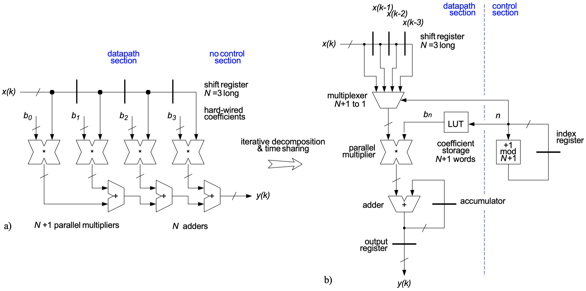
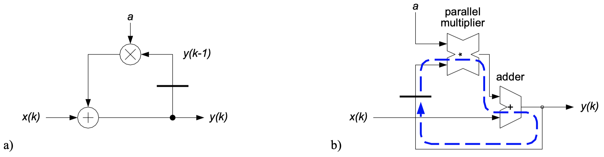
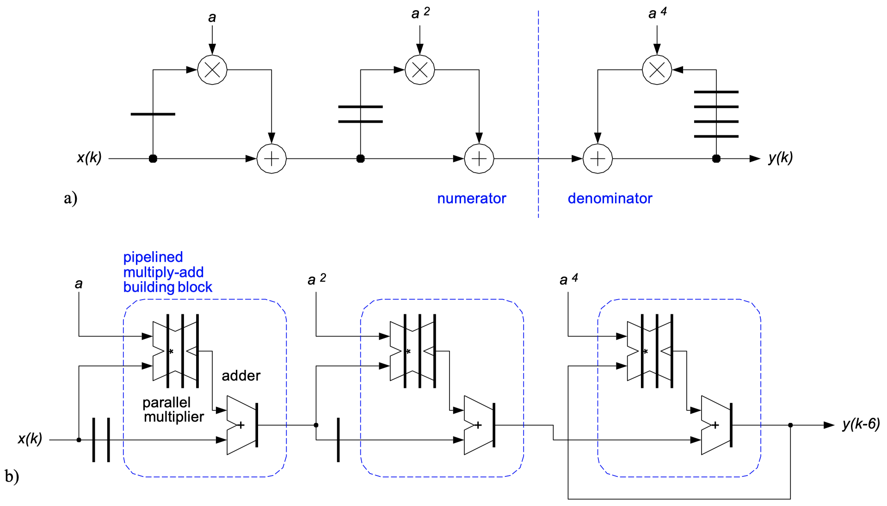
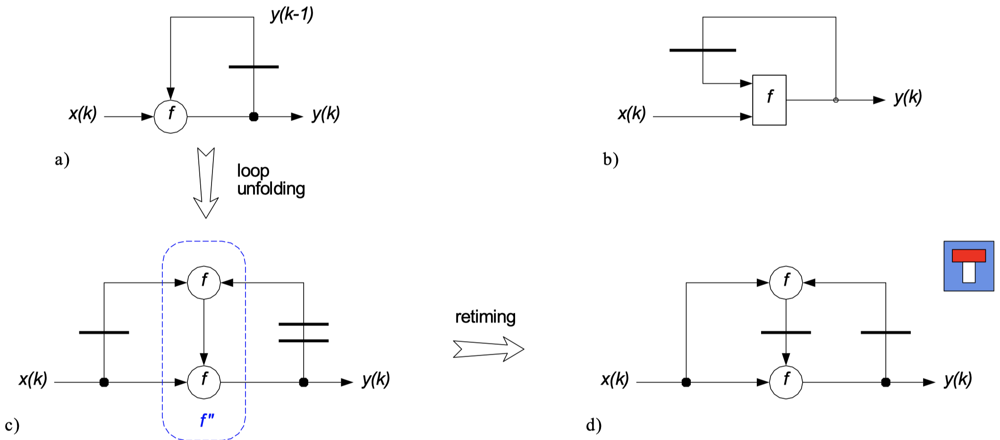
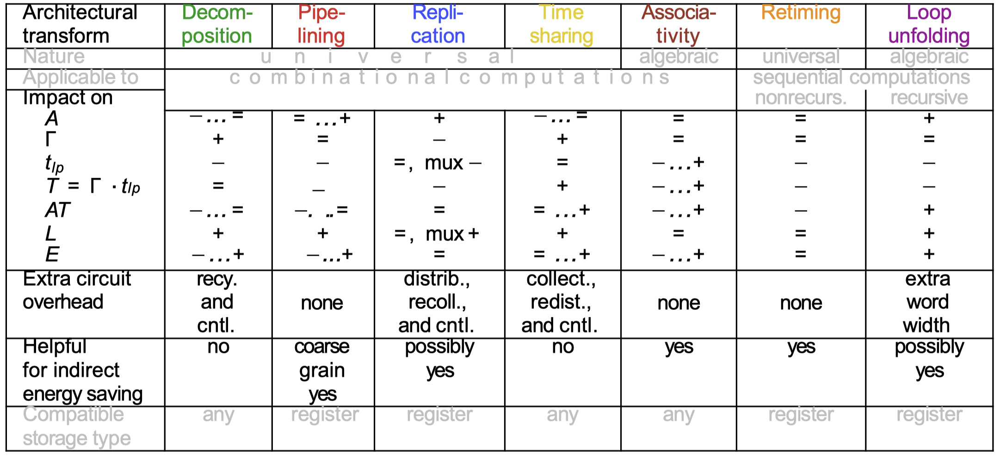

### 6.5.3 Iterative Decomposition & Timesharing Revisited

Decomposing and timesharing sequential computation is straightforward and can significantly reduce datapath hardware. Functional memory requirements remain the same as in the isomorphic architecture. There is somewhat of a mixed blessing energy-wise:

- + More uniform combinational depth reduces glitching activity
- - Extra multiplexers necessary to route, recycle, collect, and/or redistribute

_Example:_ Consider the following third order traversal filter:

{width=75%}

### 6.5.4 Digest

_Retiming_ can help to optimize datapath architectures for sequential computations without affecting functionality nor latency:

1. Retiming, pipelining and combinations of the two can improve throughput of arbitrary feedforward computations
2. The associative law allows one to take full advantage of the above transforms by having a DDG rearranged beforehand.
3. Iterative decomposition and timesharing are the two options available for reducing circuit size.
4. Highly time-multiplexed architectures dissipate energy on ancillary activities that do not directly contribute to data computation.

## 6.6 Equivalence Transforms For Recursive Computations

A computation is termed (_sequential and_) **recursive** if:

1. Result is dependent on earlier outcomes of the computation itself.
2. Edges with weights greater than zero are present in the DDG.
3. Circular paths (of non-zero weight) exist in the DDG.

### 6.6.1 The Feedback Bottleneck

Recursions such as $y(k) = ay(k-1) + x(k)$ which in the $z$ domain corresponds to the transfer function $H(z) = \frac{Y(z)}{X(z)} = \frac{1}{1 - az^{-1}}$ have many technical applications, such as IIR filters, differential pulse code modulation encoders, or servo loops.

They impose a _stiff timing constraint,_ however. The following figure shows a DDG (a) and an isomorphic architecture (b):

{width=75%}

This has an iteration bound of $\sum_{loop} t = t_{reg} + t_* + t_+ = t_{lp} \leq T_{cp}$:

- This is no problem as long as the long path constraint can be met with available and affordable technology
- However, there is no obvious solution otherwise, recursion is a real _bottleneck_

### 6.6.2 Unfolding of First-Order Blocks

The key idea to solve the above-mentioned problem is to real the timing constraint by inserting additional latency registers into the feedback loop. A tentative solution must look like:

$$
H(z) = \frac{Y(z)}{X(z)} = \frac{N(z)}{1 - a^pz^{-p}},
$$

where $N(z)$ is here to compensate for the changes due to the new denominator. Recalling the sum of geometric series we easily establish $N(z)$ as:

$$
N(z) = \frac{1-a^pz^{-p}}{1-az^{-1}} = \sum_{n = 0}^{p-1}a^nz^{-n}.
$$

The new transfer function then becomes:

$$
H(z) = \frac{\sum_{n = 0}^{p-1}a^nz^{-n}}{1-a^pz^{-p}}
$$

and the new recursion in the time domain follows as $y(k) = a^py(k-p) + \sum_{n = 0}^{p-1}a^nx(k-n)$.

After unfolding by a factor of $p = 4$, the original recursion takes on the form

$$
y(k) = a^4y(k-4) + a^3x(k-3) + a^2x(k-2) + ax(k-1) + x(k).
$$

The _net result_ is that the denominator now includes $p$ unit delays rather than one! The following figure shows a DDG (a) unfolded by $p = 4$ and a high-performance architecture (b):

{width=75%}

### 6.6.3 Non-Linear or General Loops

The most general case of a first-order recursion goes like $y(k) = f(y(k-1), \, x(k))$ and can be unfolded an arbitrary number of times, e.g. with $p = 2$ it becomes $y(k) = f(f(y(k-2), \, x(k-1)), \, x(k))$.

The figure below shows an original DDG (a) and an isomorphic architecture (b), as well as a DDG after unfolding by a factor of $p = 2$ (c), and the same DDG with retiming added on top (d):

{width=75%}

All successful architectural transforms for recursive computations take advantage of algorithmic properties such as linearity, fixed coefficients, associativity, limited word width or of a very limited set of registers states. When the state size is large and the recurrence is not a closed-form function of specific classes, our methods for generating a high degree of concurrency cannot be applied.

### 6.6.4 Digest

| **Architectural transform** | _Decomposition_ | _Pipelining_ | _Replication_ | _Timesharing_ | _Associativity etc._ | _Retiming_ | _Loop unfolding_ |
| :-------------------------- | :-------------- | :----------- | :------------ | :------------ | :------------------- | :--------- | :--------------- |
| **Nature** | universal | universal | universal | universal | algebraic | universal | algebraic |
| **Applicable to** | combinational | combinational | combinational | combinational | combinational | sequential non-recursive | sequential recursive |

## 6.7 Generalization Of The Transform Approach

{width=75%}

# Chapter 7: Introduction to Embedded System Design

_Left out for now, may will be added later if considered important for the exam._
