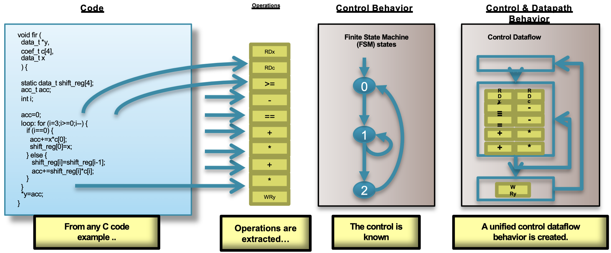
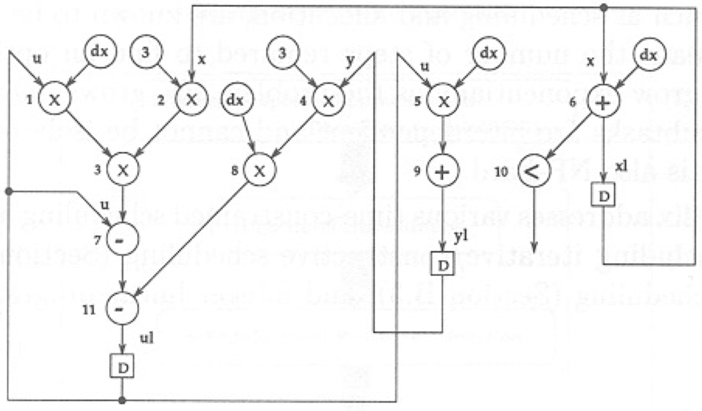
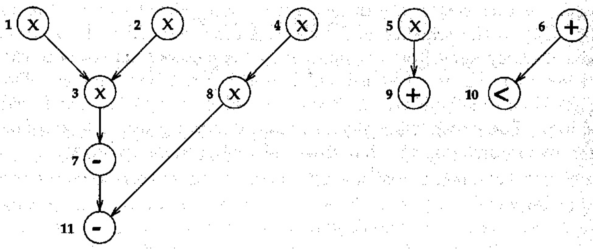
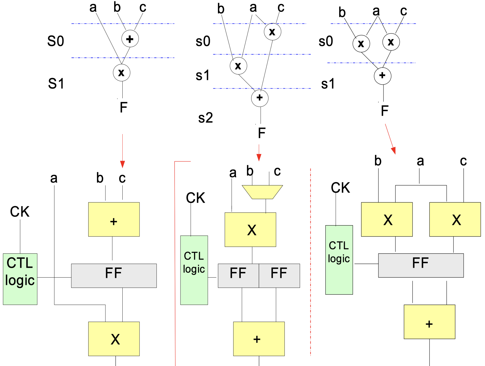
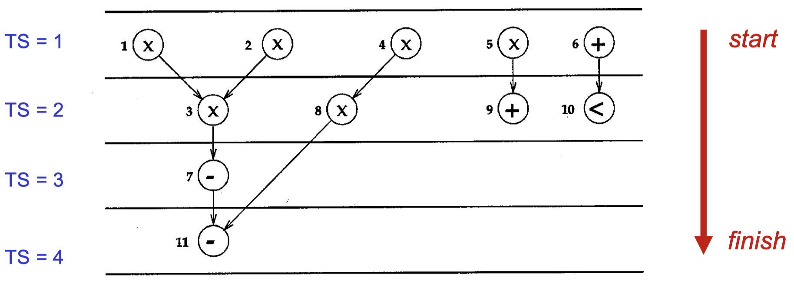
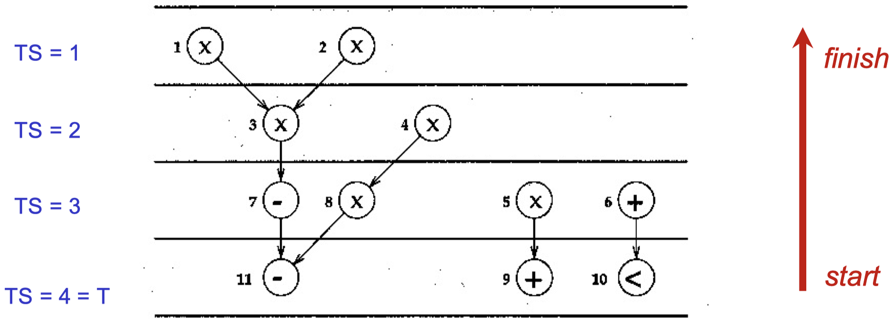
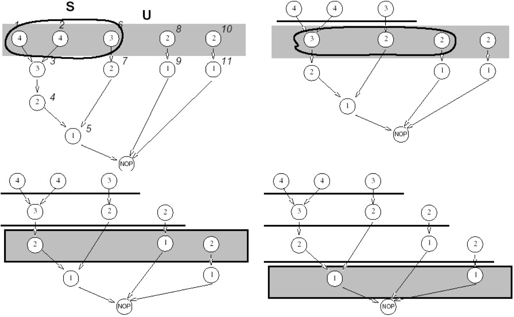
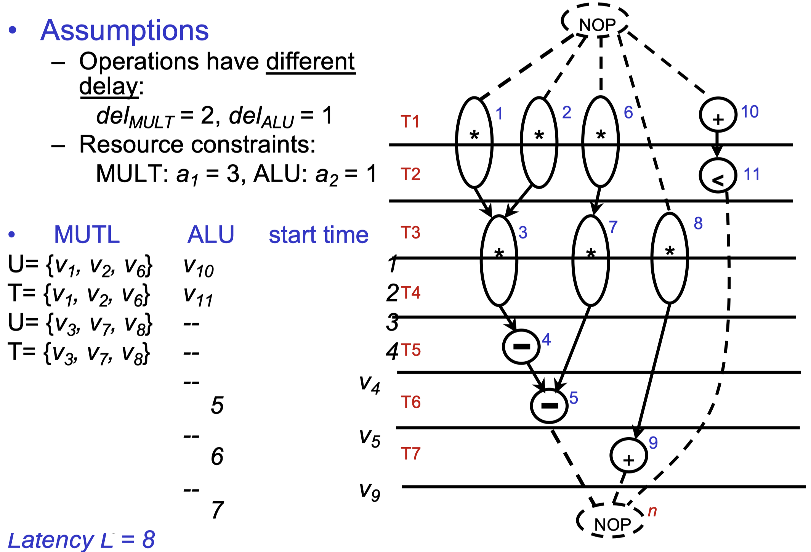
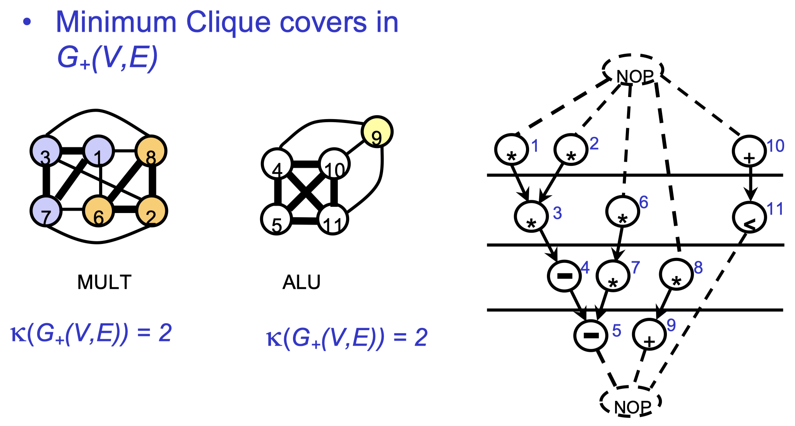
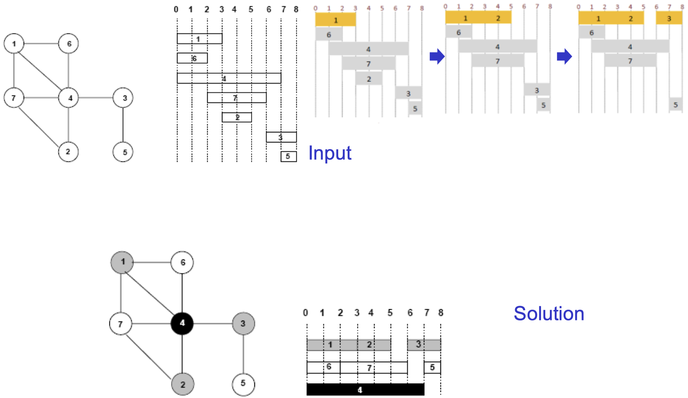

# Chapter 8: High Level Synthesis (HLS)

**High level synthesis (HLS)** describes the process of converting a high-level description of a design to RTL:

- Input: High-level languages (C, system C, SystemVerilog) or behavioral HDL such as Verilog or VHDL
- Constraints: Resource constraints and timing constraints
- Output: Operation scheduling and binding as well as control generation and RTL architecture

## 8.1 Control & Datapath Extraction

{width=80%}

## 8.2 Scheduling & Binding

**Scheduling** and **binding** are at the heart of HLS:

- Scheduling determines in which clock cycle an operation will occur. This takes into account the control, dataflow and user directives. The allocation of resources can be constrained too.
- Binding determines which library cell is used for each operation. This takes into account the component delays and user directives.

_Scheduling_ is based on the following three steps:

1. The operations in the control flow graph are mapped into clock cycles.
2. The technology and user constraints impact the schedule. A faster technology may allow more operations to occur in the same clock cycle.
3. The code also impacts the schedule. Code implications and data dependencies must be obeyed.

_Binding_ is where operations are mapped to cores from the hardware library. The _binding decision_ decides between "sharing" and "not sharing". Given some schedule where, for example, a multiplier is used two times but in two separate cycles, binding may decide to share the multipliers. Or it may decide that the cost of sharing ("muxing") would impact timing, and it may decide not to share them.

When doing a mapping of operations to time slots, i.e. cycles, operations that lie in different cycles can share a single resource (**resource sharing**). Different schedules may lead to different levels of resource sharing.

## 8.3 Data Flow Graphs

We start with an example. Consider the following algorithmic description:

```c
while(x < a) {
    xl = x + dx;
    ul = u - (3 * x * u * dx) - (3 * y * dx);
    yl = y + u * dx;
    x = xl; y = yl; u = ul;
}
```

From this description we can build the following **control data flow graph (CDFG):**

{width=60%}

By removing all control edges, we get the following **precedence graphs:**

{width=60%}

If we furthermore add the source and output nodes as well as some pseudo start and end nodes we will get a **sequence graph:**

{width=60%}

It is important to note that _scheduling affects the RTL!_ An example is shown in the figure below:

{width=50%}

## 8.4 Scheduling, Allocation and Assignment

### 8.4.1 ASAP & ALAP Scheduling

**As Soon as Possible (ASAP) scheduling** is based on the following ideas:

- Unconstrained minimum latency scheduling
- Uses topological sorting of the sequencing graph
- Gives _optimum_ solution to scheduling problem
- Schedules first the first node $n_0 \to T1$ until last node $n_v$ is scheduled
- $C_i$ is the completion time (delay) of predecessor $i$ of node $j$

```pseudo
Input: DFG G = (N, E)
Output: ASAP Schedule

1:  TS_0 = 1;       /* Set initial time step */
2:  While (Unscheduled nodes exist) {
3:      Select a node n_i whose predecessors have already been scheduled;
4:      Schedule node n_j to time step TS_j = max{TS_i + (C_i)} for all n_i -> n_j;   
}
```

{width=50%}

Another option is **As Late as Possible (ALAP) scheduling.** It is based on:

- Latency-constrained scheduling (latency is _fixed_)
- Uses reversed topological sorting of the sequencing graph
- If over-constrained (latency too small), solution _may not exist_
- Schedule first the last node $n_v \to T$, until first node $n_0$ is scheduled
- $C_i$ is the completion time (delay) of predecessor $i$ of node $j$

```pseudo
Input: DFG G = (N, E), IterationPeriod = T (Latency)
Output: ALAP Schedule

1:  TS_0 = T;   /* Set initial time step */
3:  While (Unscheduled nodes exist) {
4:      Select a node n_i whose successors have already been scheduled;
5:      Schedue node n_i to time step TS_i = min{TS_j - (C_i)} for all n_i -> n_j;
}
```

{width=50%}

The **slack** defines the freedom of scheduling of an operator. It is calculated as $S_i = TS_i^{ALAP} - TS_i^{ASAP}$.

Some observations about ALAP and ASAP:

- No consideration is given to resource constraints
- No priority is given to nodes on the critical path
- As a result, less critical nodes may be scheduled ahead of critical nodes
- List scheduling techniques (see later on) overcome this problem by utilizing a more global node selection criterion

### 8.4.2 Hu's Algorithm

We consider a simple case of the scheduling problem:

- Each operation has unit delay
- Each operation can be implemented by the same operator

**Hu's algorithm** has the following properties:

- Greedy in polynomial time
- Optimal for trees and single type operations
- Computes minimum number of resources for a given latency, or
- Computes minimum latency subject to resource constraints

The basic idea is as follows:

- Label operations based on their distance from the sink
- Try to schedule the nodes with higher labels first, i.e. most "critical" operations have priority

```pseudo
HU (G(V, E), a) {
    Label the vertices  // a = resource constraint (scalar)
                        // label = length f longest path passing thorugh the vertex

    l = 1;
    repeat {
        U = unscheduled vertices in V whose predecessors have been already scheduled
        Select S subseteq U such that |S| <= a and labels in S are maximal
        Schedule the S operations at step l by setting:
            t_i = l, for all v_i in S;
            l = l+1;
    } until v_n is scheduled
}
```

_Example:_ The following figure shows an example of Hu's algorithm for $a = 3$:

{width=70%}

### 8.4.3 List Scheduling

**List scheduling** is based on:

- Extend Hu's idea to several operators
- Greedy algorithm for ML-RCS and ML-LCS (does not guarantee optimum solution)
- Similar to Hu's algorithm
- Considers a more general case

We distinguish between two list scheduling algorithms:

- **ML-RC:** Minimize latency under resource constraint. Resource constraint is represented by a vector `a`, indexed by the resource type
- **MR-LC:** Minimize resource under latency constraint. Latency constraint is given and resource constraint vector `a` is to be minimized.

We furthermore define:

- The _candidate operations_ $U_{l, \, k}$, those operations of type $k$ whose predecessors have already been scheduled early enough, i.e. completed at step $l$:

$$
U_{l, \, k} = \{v_i \subseteq V : type(v_i) = 0 \text{ and } t_j + d_j \leq l, \text{ for all } j: (v_j, \, v_i) \subseteq E\}
$$

- The _unfinished operations_ $T_{l, \, k}$, those operations of type $k$ that started at earlier cycles but whose executions have not finished at step $l$:

$$
T_{l, \, k} = \{v_i \subseteq V : type(v_i) = k \text{ and } t_i + d_i > l \}
$$

- A _priority list_ where we list operators according to some heuristic urgency measure

```pseudo
# ML-RC

LIST_L (G(V, E), a) {           // resource constraints specified by vector a
    l = 1;
    repeat {
        for each resource type k {
            U_lk = candidate operations available in step l
            T_lk = unfinished operations (in progress)
            Select S_k subseteq U_lk such that |S_k| + |T_LK| <= A_K
            Schedule the S_k operations at step l
        }
        l = l + 1;
    } until v_n is scheduled;
}
```

_Example:_ The figure below shows an example of the execution of the ML-RC algorithm:

{width=70%}

```pseudo
# MR-LC

LIST_R (G(V, E), lambda') {
    a = 1;
    l = 1;
    Compute latest possible starting times t^L using ALAP algorithm
    repeat {
        for each resource type k {
            U_lk = candidate operations;
            Compute slack {s_i = t^L_i - l, for all v_i in U_lk};
            Schedule operations with zero slack, update a;
            Schedule additional S_k subseteq U_lk requiring no additional resources
        }
        l = l + 1;
    } until v_n is scheduled;
}
```

### 8.4.4 Allocation/Binding

We now focus on the **binding and sharing problem.** Given a scheduled sequencing graph, we consider the operation types independently. We encounter:

- Operation compatibility
    - Same type
    - Non-concurrent
- Conflicting operations
    - Concurrent, different types
    - Dual to compatibility

**Allocation** means resource binding:

- Spatial mapping between operations and resources
- operators can be dedicated or generic
- Operators and registers need to be allocated

We can solve the problem with a **resource compatibility graph** $G_+(V, \, E)$:

- $V$ represents operations
- $E$ represents compatible operation pairs

Operations are _compatible_ if they are not concurrent and can be implemented by resources of the same type. We then partition the graph into a minimum number of _cliques._ A **clique** is a maximal complete subgraph:

{width=70%}

We finally introduce quickly the **left-edge algorithm** by means of the following figure:

{width=70%}
