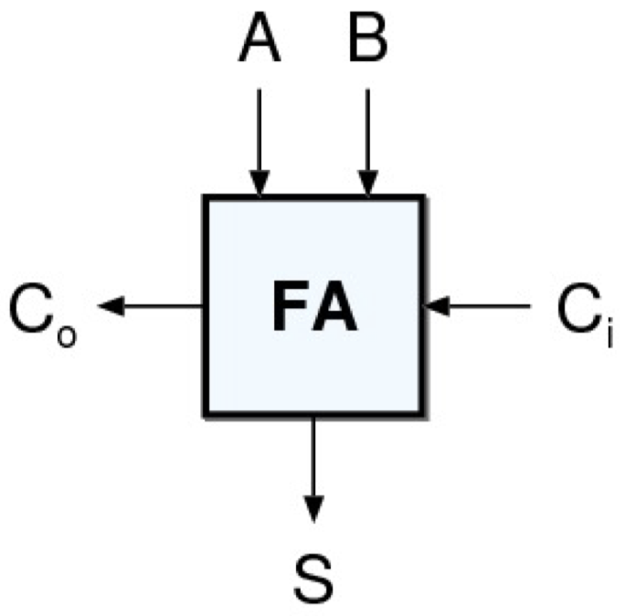
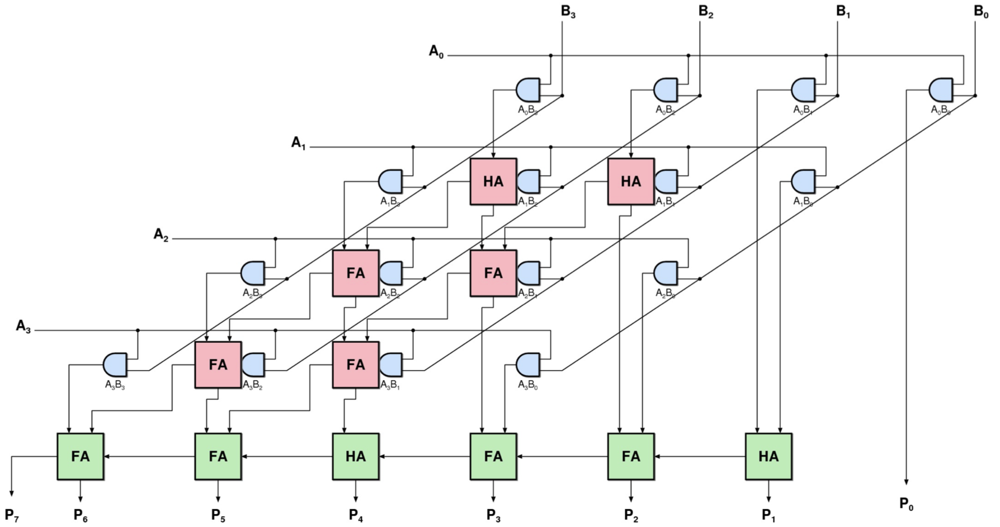

# Chapter 9: Arithmetic Circuits

## 9.1 Introduction

**Arithmetic circuits** are the core of every digital circuit. Everything else is side-dish, arithmetic circuits really are the heart of the digital system.
Furthermore, they decide the performance of the system. They dictate the clock rate, speed, and area. In other words, if arithmetic circuits are optimized, performance will improve.

These are the different types of arithmetic circuits, in order of complexity:

- Shift / Rotate
- Compare
- Increment / Decrement
- Negation
- Addition / Subtraction
- Multiplication
- Division
- Square Root
- Exponentiation
- Logarithmic / Trigonometric Functions

## 9.2 Adders

**Addition** is the most important operation in computer arithmetic. We will focus on:

- Adding 1-bit numbers (counting bits)
- Adding two numbers (basics of addition)
- Circuits based on adders (subtractors, comparators)
- Adding multiple numbers (chains of adders)

### 9.2.1 Half-Adder (2, 2) Counter

The **Half Adder (HA)** is the simplest arithmetic block. It can add two 1-bit numbers, resulting in a 2-bit number. Furthermore, it can be realized easily:

|  A  |  B  | $C_o$ |  S  |
|:---:|:---:|:-----:|:---:|
|  0  |  0  |   0   |  0  |
|  0  |  1  |   0   |  1  |
|  1  |  0  |   0   |  1  |
|  1  |  1  |   1   |  0  |

By simply looking at the table we come to the conclusion that the output $C_o$ is determined by a `AND` gate and output $S$ by a `XOR` gate.

{width=20%}

### 9.2.2 Full-Adder (3, 2) Counter

The **Full Adder (FA)** is the _essential_ arithmetic block. It can add three 1-bit numbers, and the result is a 2-bit number. There are many realizations both at gate and transistor level. Since it is used in building many arithmetic operations, the performance of one FA influences the overall performance greatly.

{width=20%}

### 9.2.3 Ripple Carry Adder (RCA)

If we want to add multiple digits, we proceed similar to decimal addition. Starting from the right, each digit is added and the carry from one digit is added to the digit to the left:

{width=40%}

We use a **Ripple Carry Adder (RCA)** to add multiple digits:

{width=60%}

The **curse of the carry** is that the most significant output of the adder depends on the least significant input. For a $n$-digit binary number we will therefore always have $n+1$ stages.

If we want to _add more than two numbers,_ there are some tricks to increase the speed of ripple carry adders: either use an _array of ripple carry adders_ or use _carry save adder trees._ Carry save adder trees are based on the idea that instead of using carry propagate adders (the adders we have seen so far), carry save adders are used to reduce multiple inputs to two, and then a single carry propagate adders is used to sum up.

_Array of Ripple Carry Adders:_

{width=60%}

_Carry Save Principle:_

{width=60%}

- An array of carry save adders reduces the inputs to two
- A final (fast) carry propagate adder (CPA) merges the two numbers
- The performance is mostly dedicated by CPA

{width=20%}

## 9.3 Multipliers

Some basic facts about **multipliers:**

- Largest common arithmetic block, requires a lot of calculation
- Has three parts: partial product generation, carry save tree to reduce partial products, carry propagate adders to finalize the addition
- Adder performance, again, is important
- Many optimization alternatives

_Binary multiplication_ is exactly the same as decimal multiplication:

{width=40%}

If we want to generate the _partial products,_ we easily achieve this by `AND` gates: when $0$ we get all zeroes, and when $1$ we get the multiplicand itself.
After that we have to reduce the partial products (job of the carry save adder) and finally generate the result by means of a large, fast carry propagate adder.

{width=40%}

## 9.4 Other Functions

Several wee-known arithmetic operations are based on adders:

### 9.4.1 Negating Two's Complement Numbers

- To negate a two's complement number we calculate: $-A = \bar{A} + 1$
- All bits are inverted
- One is added to the result

{width=20%}

### 9.4.2 Incrementer

- `B` input is zero
- Carry-in ($C_{in}$) of the adder can be used as the increment input
- Decrementer similar in principle

{width=20%}

### 9.4.3 Subtracter

- $B$ input is inverted
- $C_{in}$ of the adder is used to complement $B$

{width=20%}

We might also proceed as follows:

- $B$ input is inverted
- $C_{in}$ of the adder is used to complement $B$
- It can be made programmable so that both additions and subtractions can be performed at the same time

{width=20%}

### 9.4.4 Comparator

**Comparators** are based on a subtractor. We have the following rules:

```pseudo
(A  = B) = EQ
(A != B) = not EQ
(A  > B) = GE + EQ
(A >= B) = GE
(A  < B) = not GE
(A <= B) = not GE + EQ
```

{width=20%}

### 9.4.5 Shifters

We have the following different **shift** operators:

- Logical shifter, shifts value to the left or right and fills empty spaces with 0's
    - `11001 >> 2 = 00110`
    - `11001 >> 2 = 00100`
- Arithmetic shifters, same as logical, but on rights shift, fills empty space with the old most significant bit
    - `11001 >>> 2 = 11110`
    - `11001 <<< 2 = 00100`

## 9.5 Making Adders Faster

### 9.5.1 Full-Adder Revisited

Consider the path from $C_i$ to $C_o$:

- If $A = 1$ and $B = 1$, a carry is _generated_ no matter what the value of the carry input ($C_i$) is
- If only $A = 1$ or only $B = 1$, the value of the carry input is _propagated_ to the carry output

Therefore, the Full Adder functionality can be expressed by propagate ($P$) and generate ($G$) signals:

```pseudo
G = A & B
P = A ^ B

S = P ^ Ci
Co = G | (Ci & P)
```

{width=20%}

### 9.5.2 Fast Adders

The speed of the adder depends on how fast the carry can be propagated / pre-calculated. The idea is to divide a large adder into a chain of small adders:

- The critical path is extremely rare (_Carry Skip_)
- Worst case we need to add one to the result (_Carry Increment_)
- There are only two possible values of carry (_Carry Select_)
- Calculate the carry in advance (_Carry Lookahead_)

#### Divide and Conquer

{width=75%}

#### Carry Skip Adder

{width=75%}

- $P_{i-1:k} = 0$, i.e. if not all propagate signals from bit $i-1$ to bit $k$ are $1$, the result of the carry is generated within this block

{width=75%}

- $P_{i-1:k} = 1$, the carry of the previous block is propagated

#### Carry Increment Adder

{width=75%}

- $C_{in}$ to each level is assumed to be $0$
- When the carry is known, in the worst case the output is incremented

#### Carry Select Adder

{width=75%}

- Two parallel adders, one assumes $C_{in}$ to be $0$, the other to be $1$
- Once the previous stage decides on the carry, the correct branch is selected

### 9.5.3 Parallel Prefix Adders

**Parallel Prefix Adders (PPA)** represent a systematic approach to designing optimized adders. They have three stages:

- Pre-Processing
- Carry Propagation
- Post-Processing

The adders only different in the way the carry propagation is calculated. Pre- and post-processing are identical:

{width=75%}

_Combined Propagate Generate Signals_ are written as $(G_{i:j}^k, \, P_{i:j}^k)$. The example signal is covering the bit range $1$ to $j$ at the $k^{th}$ stage of carry propagation. The goal is to calculate $(G_{n_0}^k, \, P_{n:0}^k)$ for all $n$ in any number of $k$ stages.

We have the following two _parallel prefix operations:_

{width=50%}

- _Merge:_ Merges two adjacent $(P, \, G)$ ranges
- _Feedthrough:_ Just copies the signals to the next stage

We have the following _performance parameters_ of PPA:

- Number of black dots: Determines the circuit area, since only the merge operators contain real logic
- Number of stages: Determines the critical path, the more stages, the longer the critical path
- Maximum fan out: How many inputs are driven by a single cell, determines stage delay. The more connections, the higher the delay.

_Examples:_ Here is a list of some known PPAs:

#### Ripple Carry Adder

{width=50%}

#### Sklansky

{width=50%}

#### Carry Increment Adder

{width=50%}

#### Brent Kung Adder

{width=50%}

#### Kogge Stone

{width=50%}

#### Huan Carlsson

{width=50%}

### 9.5.4 Summary Adders

We summarize the most important points of the different adders:

- RCA is a very efficient adder. It is the smallest and simplest adder, for small bit widths it is not too slow either.
- BK offers a good compromise. A traditional carry lookahead adder is BK with 4-bit groups.
- SK suffers from high fanout. In theory, it is very fast, high fanout slows it down.
- KS and HC are very fast, but suffer from routing. They are the fastest adders, but are resource and routing intensive.
