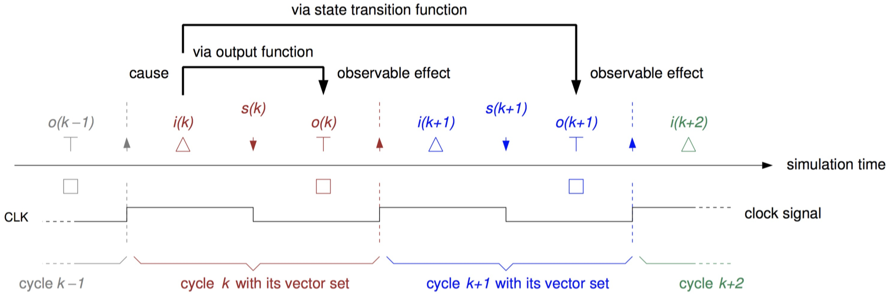
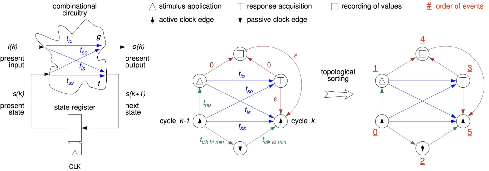

# Chapter 4: Functional Verification

## 4.1 Introduction

**Verification** can have different motivations:

- During specification: Is the circuit I want to design really what is needed?
- During design: Have I indeed designed a circuit that does what I specify?
- During testing: Once manufactured, can I tell working circuits from faulty ones?

We distinguish between _functional_ and _parametric verification:_

- Functional verification is about what the circuit does
    - Given a set of inputs, what is the expected behavior of the circuit?
    - Described using algorithms, equations, state-graphs, truth tables etc.
- Parametric verification is making sure physical properties are correct
    - This relates to physically measurable qualities, speed, area, power, throughput etc.
    - Units like Mbits/s, mA, nW, pF, etc.

We focus on functional verification. Ideally, we would have _formal specifications:_

- All requirements would be described formally
- We could then compare our designs mathematically and prove that they are correct

## 4.2 Fault Detection

The basic steps to **uncover a bug** are as follows:

1. Activate/sensitize: Set of inputs that will trigger a situation in which the circuit will misbehave is needed
2. Propagate: Make sure that the faulty behavior reaches an observable point. Real circuits have only limited number of I/Os and are more limited. Simulators will be able to allow you to peek into the circuit.
3. Observe/compare: The activated fault must generate a different output than an expected response.
4. Need _simulation vectors_ (input) and expected responses (outputs).

Since it is not feasible to test for every possible input, how do we choose?

- We can only afford to test for a _tiny fraction_ of possible inputs. Somehow we need to select a suitable set of input vectors that gives us sufficient coverage of the functionality.
- This is called **directed testing.** Vectors are chosen according to some method. There are some methods to help us determine if these vectors are sufficient.

Some methods to choose inputs are:

- Vector corresponding to common operation of circuit: Basic functional tests, representative inputs for the operation.
- Chosen corner cases: Cases that cause exceptions, overflows, activate seldom used functionality.
- Randomly chosen vectors: _Directed random testing_ describes the case when random vectors are constructed in a meaningful way.

SystemVerilog has built-in functions to support random vector generation.

_Example:_ Below we show an example of random code in SystemVerilog. These functions will only work in simulation and are only used in processes.

```vhdl
// let us declare some variables for examples
int          a, b;              // integer values, by default integer is signed
logic [7:0]  e, f;              // 8 bit vectors, by default logic is insigned
logic [15:0] g, i, j;           // 16 bit vectors
int          OK;                // return value for succes

// the following is in a process
a = $random;                    // a will be a random variable
b = $random(45);                // b will be a random variable from a PRNG an initial seed of 45

e = $urandom;                   // e will be a random unsigned integer
f = $urandom_range(7);          // f will return an unsigned value between 0 and 7
g = $urandom_range(15, 8);      // g will return an unsigned value between 8 and 15

OK = std::randomize (i, j) with {i != j;};      // make i, j random, with a condition
```

Here are some methods to detect if we have enough vectors:

- _Code coverage:_ check if all lines of code have been simulated. This needs support from the simulator.
- Monitoring _toggle counts_ of all nodes in the circuit, i.e. see if everything has toggled at least once.

So now that we have some inputs, how do we get correct outputs? We need to check if the outputs of the circuit matches expectations. We call these vectors **expected responses.** How do we get those? We need a trusted model of the circuit we want to build. This is called the **golden model.**

The golden model is based on the circuit specifications as the starting point. For well-defined mathematical functions, this is quite easy to do. There might already be an implementation in a computer language, e.g. Matlab. Standard interfaces have an agreed upon behavior, and there are pre-defined models for such interfaces that can be used. Otherwise, a model has to be constructed first.

So in the end, we need to simulate our circuit. The wishlist for the simulation is as follows:

- We need a notion of time: So far, we did not care about what happens when.
- We need _stimulus_ (inputs) for our circuit: Generate the inputs, read them from a file, get them from a running program.
- We have to collect the actual outputs of our circuit: Record what the circuit has generated so that we can compare later on.
- We need to compare the outputs to the expected responses: A report at the end of the simulation is essential, we will not check manually.

## 4.3 Timing

**Timing** from our point of view:

- The _clock signal_ orders operations: Circuit moves to present state with the rising clock ($\uparrow$). We have one clock period to determine the next state.
- Inputs are applied ($A$) within the clock period: They need to arrive before the next clock edge (**setup time**), but sufficiently later than the present clock edge (**hold time**).
- Every clock period generates an output that needs to be tested ($T$): We need to wait at least for the **propagation delay** from the present edge and at most **contamination delay** after the next edge.

_Example:_ Consider this possible timing to ($A$) apply, ($T$) test, and ($\uparrow$) clock:

{width=85%}

So, for every clock cycle of the circuit we are simulating:

1. Start with a clock signal to start the period ($\uparrow$)
2. Wait for some time (_stimulus application time_) before we do anything
3. Somehow find and apply ($A$) the new stimulus for the next clock edge
4. Wait for some more rime (_response acquisition time_), to allow signals to propagate to the outputs
5. Collect and test ($T$) the output and record and compare it against the expectations
6. Wait until the clock period is over
7. Apply new clock signal ($\uparrow$) to finish the period

Some further explanation on $AT \uparrow$ timing:

{width=80%}

## 4.4 Testbench

**Testbench** is a virtual environment to test circuits. It is mostly written using HDL, we will see more about this next week. They allow the circuit/module under test to be instantiated.

A testbench is self-sufficient:

- Normally, there are no inputs/outputs to the testbench
- Provides a clock, reset, and other control signals
- Supplies the inputs
- Collects the outputs and compares the result

The following figure shows a typical testbench for a digital circuit:

{width=80%}

Modern simulators provide a rich environment:

- Offer basic programming over a TCL interface
- Can instantiate HDL circuits
- Can generate stimuli: Read in files, connect to running programs
- Record outputs: dump waveforms and/or list to files

## 4.5 Properties & Assertions

SystemVerilog has two things that can help with formal specifications:

- **Properties**
    - A boolean-valued expressions written in SystemVerilog
    - It is a fact about your design, can be either true or false
    - Usually embedded in the source code
- **Assertions**
    - A directive to a verification tool to prove that _property_
    - Is a way of formally describing the specification

_Example:_ Consider the following simple property and assertion: We first define a very simple property:

```vhdl
property Nonzero;
    (Address > 0);
endproperty
```

This property will be true when the value of `Address` is larger than 0. An _assertion_ can now check for this property:

```vhdl
assert property (Nonzero);
```

What are properties and assertions good for?

- Describe the intent of the design better
- Find bugs and source of the bugs faster
- Allows additional ways of measuring functional coverage

**Immediate assertions** (or _procedural assertions_) are assertions which can only used within a `always` or `initial` block. They are evaluated during simulation and usually used for simple error messages, not for formal methods:

```vhdl
always @ (posedge clk_ci) begin
    
    // assert (EXPRESSION) ACTION BLOCK
    a_wrong: assert (data_o === expected) begin
                ok_cnt = ok_cnt + 1;
             end else begin
                $inf("Received wrong output");
                err_cnt++;
             end
    a_second: assert (data_o === 4' bXXXX) $error ("Output is all X");
end
```

**Concurrent assertions** are more interesting. They always start with the keyword `assert property`:

- They run concurrently
- Usually have their own sampling events, i.e. clocks, defined
- Most have a pre-condition (_antecedent_) and a main condition (_precedent_)

```vhdl
// label: assert property ( @ (posedge clk_ci) PRECONDITION -> CONDITION);
a_example: assert property ( @ (posedge clk_ci) a |-> b;)
// this assertion says that when the clk_ci rises, if a is true, b should be true as well
```

There are three main variations, but we will concentrate only on `assert`:

- `assert property` specifies a property what will hold true
- `cover property` means that the simulator will check if property has occurred and count it
- `assume proeprty` defines a constraint for the formal verifier

There are some tricky parts when defining a clock for `assert property`:

- It is OK to define a clock for every `assert property`:

```vhdl
assert property ( @ (posedge clk_ci) a |-> b);
```

- You can also put an `assert property` within a procedure:

```vhdl
always @ (posedge clk_ci) begin
//..
    assert property (a |-> b);
//..
end
```

- A third option is to define a default `clocking` block

```vhdl
default clocking cb @ (posedge clk_ci)
endclocking

//..
assert property (a |-> b);
```

We distinguish between _holds, vacuous hold,_ and _implications:_

```vhdl
assert property ( @ (posedge clk_ci) a |-> b);
```

- In this assertion, we say that if `a` is true, `b` should **hold** true: The evaluation of this property is made at the rising clock edge.
- But, if `a` is false, then the property is said to **hold vacuously:** Since the antecedent is false, the rest has not been evaluated.
- The implication operation `|->` says that `a` and `b` should hold true in the _same_ clock cycle. We might also use the implication operator `|=>`:

```vhdl
assert property ( @ (posedge clk_ci) a |=> b);
```

- It says that if `a` holds true, `b` should hold true in the _next cycle._

Furthermore, we can use the **delay operator** `##N` for sequences:

```vhdl
assert property (a |=> ##1 b);  // b holds 2 cycles after a
assert property (a |-> ##2 b):  // b holds 2 cycles after a
assert property ( (a ##1 c ##3 d) |=> b)
// first a has to be true
// in the next cycle c has to be true
// three cycles later d has to be true
// then, bhas to hold true in the next cycle
```

There are many more variations of the delay operator syntax:

```vhdl
assert property (a[*3] ##1 |=> b);  // a ##1 a ##1 a ##1
assert property ((a ##[1:4] c) |-> b);
// after a is true, c can be true in 1, 2, 3, or 4 cycles
// b has to hold in the same cycle as c
assert property ((a[*4:$] ##1) c |-> b);
// after a is true for at least 4+ cycles, when c is trie, b has to hold
```

Especially during simulations, assertions can cause a lot of _overhead._ There are four states that every assertion can have:

- _Inactive:_ no match between the property and the simulation state
- _Active:_ there is a (partial) match between the property and the simulation state
- _Pass:_ it has been proven that the property holds
- _Fail:_ it has been proven that the property does not hold
