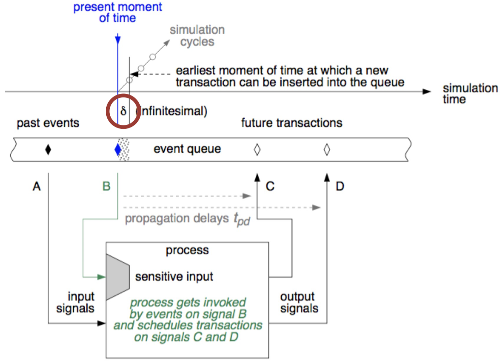
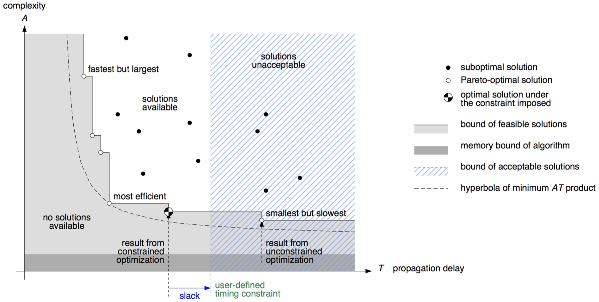
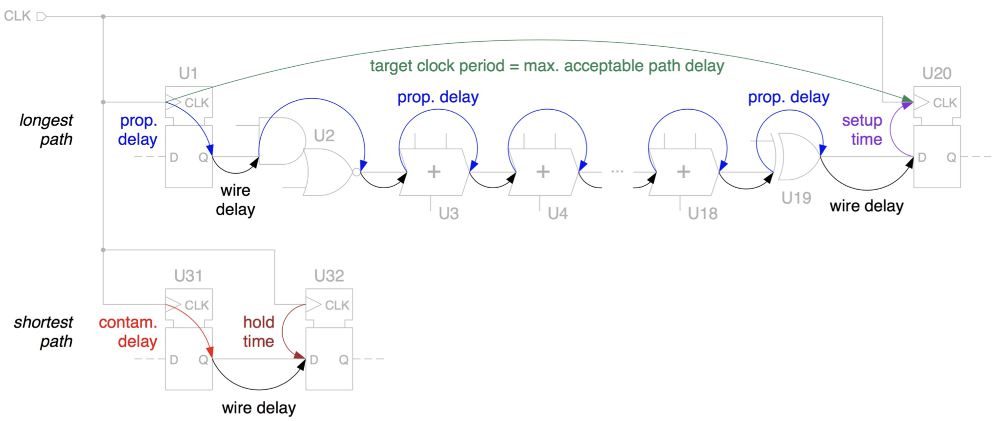
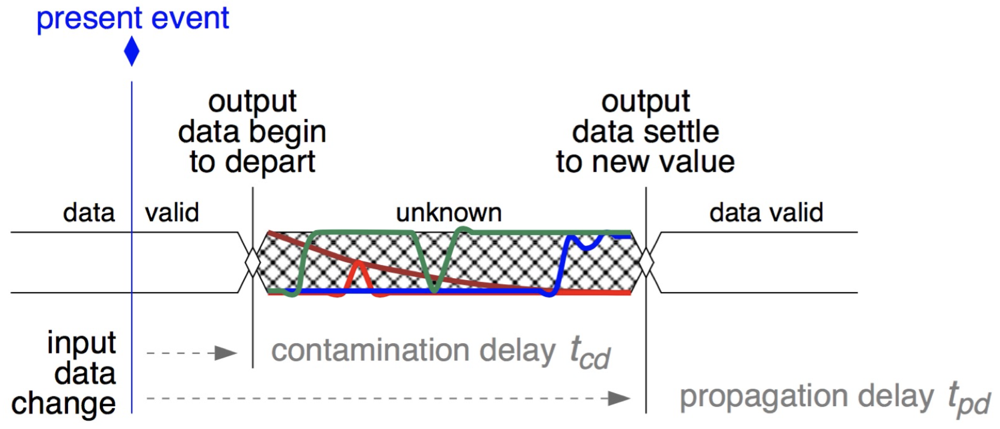
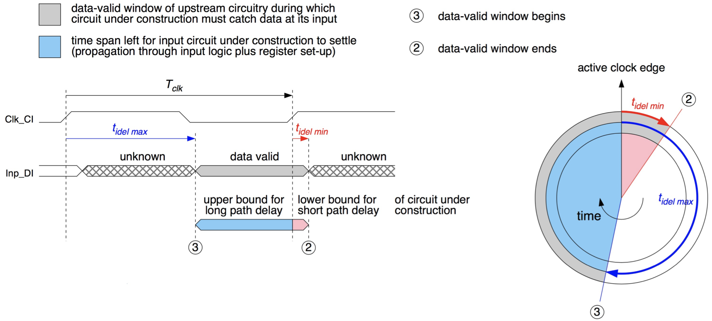
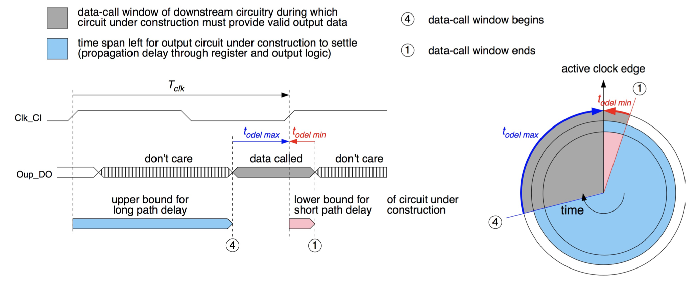

# Chapter 5: SystemVerilog Design -- Simulation & Synthesis

## 5.1 Modelling Timing

_Remark:_ In this lecture we use flip-flops which are triggered with a rising edge.

_Reminder:_

- Synchronous circuits use a clock signal to order operation: Simplifies things.
- State holding element could be a latch (level) or a flip-flop (edge): Flip-flops are simpler to learn.
- We will talk about rising edge triggered circuits.

### 5.1.1 Timing From Our Point of View

The _clock signal_ orders operations. The circuit moves to the present state with the rising clock ($\uparrow$). We have one clock period to determine the next state.
Inputs are applied ($A$) within the block period and every clock period generates an output that needs to be tested ($T$).

### 5.1.2 Timing in HDL

Behavioral HDL does not really have a notion of time. All assignments are made in parallel, they just describe connections. The only ordering is made by **clock** signals that tell us to move to the next state. WE do not describe the timing when we describe the circuit.
When behavioral HDL is mapped to real circuits (i.e. _compiled_) they gain physical properties. Wires end up having physical delays, gates that realize logic functions need time to produce outputs, and sequential elements have forbidden times when inputs should not change. If we are to simulate physical circuits, we need to model all the above.

It is a good idea to use a similar testbench for behavioral and real circuits. In behavioral HDL, outputs will be available when states and inputs are available. In real implementations, the outputs will take some materialize, thus a testbench working with real circuits has to wait sufficiently for the output.

It is, however, important to note that _timing in HDL code cannot be converted into actual circuits!_

### 5.1.3 Modelling Timing in SystemVerilog

The first order of business for modelling time in SystemVerilog, are variables of type `time`:

- SystemVerilog has a dedicated type called `time`
- Values of type `time` accept common shortcuts such as `s, ms, us, ns, ps`
- There is no space between the number and the unit allowed

```vhdl
localparam time PERIOD = 100ns;     // Declare a local constant for 100ns
time sim_time;                      // Declare a variable of type time
```

The _default_ time unit and timing _resolution_ should be defined:

```vhdl
timeunit 1ns;           // Default time unit for all units enclosed
timeprecision 0.1ns;    // Precision of timing, rounded to this value
```

**Time specifiers** in SystemVerilog consist of the symbols `#` and `@`:

- SystemVerilog uses absolute time specifications with `#`
- Events are specified with `@`

```vhdl
#10;                    // delay of 10 timeunits
#20ns;                  // delay of 10 nano seconds
#(Period/2);            // delay of half a period

@(rst_ni);              // we have seen these in always statements
@(negedge rst_ni);      // they trigger when there is an edge change
```

However, we have already seen that everything in HDL happens at the same time. We need a way to order things. **Blocking** statements in sequential process are the way to go: `initial`

- Same as `always`, but triggers only once at the beginning of the execution
- There is also the often unused `final` executed when everything finishes

```vhdl
timeunit 1ns;               // default itme unit if no unit is given
timeprecision 100ps;        // precision of time: 0.1ns increment

initial begin               // start of the block, triggers automatically
    a = 1'b0;               // a is directly assigned the value 0
    #10;                    // 10ns passes
    a = 1'b1;               // nothing else happens
end
```

We can get even fancier with `wait` statements. Tricky: if `rst_ni` was already 1 before the statement, it will execute immediately.

```vhdl
timeunit 1ns;
timeprecision 100ps;

initial begin
    a = 1'b0;                           // a is directly assigned to 0
    wait (rst_ni) $info ("reset");      // wait for rst_ni to become 1, print message
    @ (posedge clk);                    // then wait for the next rising edge of the clock
    #10; a = 1'b1;                      // then wait for 10 timeunits, then assign 1 to a
end
```

## 5.2 Building A Testbench


Putting all these statements from the previous subchapter into use:

```vhdl
localparam time HALF_PERIOD                 = 10ns;     // Half clock period
localparam time STIMULI_APPLICATION_TIME    = 5ns;      // constants for stimulus application ...
localparam time RESPONSE_ACQUISITION_TIME   = 15ns;     // .. and response acquisition
logic clk;                                              // internal signal for clock

always begin                                            // triggers always
    clk = 1; #(HALF_PERIOD); clk = 0; #(HALF_PERIOD);   // generate the clk signal
end

initial begin                                           // this is for applying stimulus
    start = 1'b0;                                       // initial value
    @(posedge clk);                                     // wait for clk
    #STIMULI_APPLICATION_TIME;                          // wait for application time
    start = 1'b1;                                       // now we can assign new value
end

initial begin                                           // this process works in parallel
    @(posedge clk);                                     // wait for clk
    #RESPONSE_ACQUISITION_TIME;                         // wait a bit more
    record_result = out_mut;                            // record the new value
end
```

The simulation of our circuit will be running hardware in software! This means we need a way to capture the parallelism. Time cannot advance until all operations in parallel have taken place. This leads to the **event driven simulation:** For a given time:

- Set all signals at this time to their present values
- All processes that trigger with a change

We therefore must distinguish between two different times:

- Simulation time: the stopwatch within the simulation
- Wall clock time: the actual time spent in the simulation

Event driven simulation makes use of an **event queue:**

- A change in the sensitivity list triggers the process: The process is evaluated, new events will be added to the queue
- If there is a time posted: Event waits the time, otherwise a $\delta$ time is inserted. $\delta$ time does not advance simulation time, it is simply used for the ordering of events.

{width=60%}

The **testbench** provides the environment for the simulation:

- A clock is generated to order events
- Inputs are applied ($A$) at the correct time
- Changes in clock and input activates processes which generate events
- Events can trigger changes to signals in $\delta$ time or after some specified time ($\#$)
- If there are no combinational loops, the result will settle eventually
- Output is sampled ($T$) and compared to the expected result

The simulation will run until the event queue runs out! We need a way to stop processes when we are done. For this we can use _helper_ signals.

Now we need to apply stimulus, and we need to compare the resulting outputs to expected values. Where do we get this information from?

- As discussed already, a golden model is frequently used
- Inputs are generated by:
    - Direct random methods
    - Known testcases for the circuit
    - Formal analysis of corner cases

Since both inputs and outputs will be in some file on our disk, we need to read them. SystemVerilog provides system tasks and functions:

- All system tasks and functions start with `$` in the name
- These functions are useful mainly for testbenches and verification

```vhdl
logic [15:0] some_signal;                               // standard declare
$display("Value is [%h]", some_signal);                 // type to stdout
integer in_fd = $fopen("../simvectors/in.txt", "r");    // open file
string read_value;                                      // define a string
integer num_chars = $fgets(read_value, in_fd);          // get string from file
if (num_chars == 0)                                     // check if we read something
    $fatal("could not read from file");                 // generate error message
$fclose(in_fd);                                         // close file
$finish;                                                // end simulation
```

_Example:_ Consider this simple code where we read from a file with `$redmem{b, h}`. `$readmemb$` will read files formatted with Verilog syntax: `00_00` is the first line and `0111` is the next line.

```vhdl
module tesbench1 ();                                // testbench does not have inputs
    int vectornum, errors;                          // book keeping variables
    logic [3:0] testvectors [10000:0];              // array of testvectors

    initial begin
        $readmemb("example.tv", testvectors);       // Read vectors
        vectornum = 0; errors = 0;                  // Initialize
    end

    always begin
        // bulk of testbench is here
        vectornum = vectornum + 1;
        if (testvectors[vectornum] === 4'bx) begin
            $display("%d tests completed with %d errors"),
                vectornum, errors);
            $finish;                                // End simulation
        end
    end
endmodule
```

_Example:_ We might also use `$fscanf` to read from files:

```vhdl
initial begin
    integer stim_fd =
        $fopen("stimuli_rgb_proc.txt", "r");
    if (stimf_fd == 0) begin
        $fatal("Could not open stimuli file!");
    end
    atim = '0;
    wait(rst_n);
    while (!$feof(stim_fd)) begin
        @ (posedge clk);
        #STIM_APPLICATION_TIME;
        $fscan(stim_fd, "%h\n", stim);
    end
    $fclose(stim_fd);
end
```

We can use functions and structures in SystemVerilog:

- SystemVerilog borrows from classical programming languages.
- One can call functions and procedures: They can be quite useful for testbenches.
- Signals can be merged into a struct: Makes it easy to define function calls.
- Practical when we use a packed format: Data in a packed format is stored one after another.

Often, `struct` can be used to make life easier. The `struct packed` type will store everything one after another in memory!

```vhdl
typedef struct packed {
    logic [2:0] switch;
    logic       hsync;
    logic [7:0] b;
} data_t;

data_t stim;

rgb_proc dut(                       // instantiate DUT
    .clk_i      (clk),              // clock
    .rst_ni     (rst_n),            // reset
    .switch_i   (stim.switch),      // signals from struct
    .b_i        (stim.b)            // can be in any order
    .hsync_i    (stim.hsync)
);

// ... Rest of the testbench
$fscanf(fd, "%b\n", stim)           // entire line in one time
```

There are some additional tricks in SystemVerilog to help us, for example, with code re-use:

- We can use `package`s to keep definitions we use over and over again
- One can pass `parameter`s to modules without changing the code
- There are `generate` statements that can control what hardware gets described depending on the parameters.

We follow these simple rules:

- Use parameters when you will re-use modules with different options
- Packages work when the same information is used in many files
- One also doesn't have to use either of them

`generate` statements can control how HW is generated. It comes in two variations: `if` and `for`:

```vhdl
generate
    if (TypeIsPosedge) begin : gen_posedge
        always @ (posedge clk) foo <= bar;
    end else begin : gen_negedge
        always @ (negedge clk) foo <= bar;
    end
endgenerate

generate
    for (genvar ii = 0; ii < NumberOfBuses; ii++) begin : gen_bus
        my_bus #(.index(ii)) i_my_bus (.foo(foo), .bar(bar[ii]));
    end
endgenerate
```

## 5.3 HDL Synthesis

There is more than one circuit possible! Circuit design is a balancing act between different constraints:

- Do you want to be small or fast
- Do you want to be energy-efficient or high-performance
- There is no ideal circuit

We make the main decision on these before writing HDL: Which architecture to use? Which technology to use?
After your HDL code is done, there will be different implementations. The **synthesizer** can convert your code into different circuits.

The following figure shows different optimization goals during synthesis:

{width=80%}

_Reminder:_ The following figure shows again the propagation and contamination delay, as well as the hold and setup time:

{width=80%}

Telling the synthesizer what you want is fixing different constraints:

- Timing determines many of the properties indirectly:
    - A faster circuit will be larger
    - A large circuit will consume more power
    - Therefore, timing is the main constraint to tell what kind of circuit you want
- The clock period determines all internal timing:
    - We will only consider circuits with a single clock domain
    - Larger real circuits are a bit more involved
- What about the boundary conditions, input and outputs of your circuit?
    - We need to know about the environment
    - In industrial design, these are the most important constraints

_Input/Output delays_ set the boundary conditions of IC design. Once you specify the clock period, all timing _inside_ the circuit is known. The problem is what happens at the boundary of your circuit:

- Compared to a reference clock, when do the inputs arrive at the latest/earliest?
- What is the earliest/latest time the outputs will appear in every cycle?
- We will use timing constraints for input and output to complete the timing description.

Those conditions are specified by stating the **delay of the environment:**

- Input delay of 1ns means that inputs will come 1ns _after the clock edge._
- Output delay of 2ns means that outputs have to appear 2ns _before the next clock edge._

{width=50%}

_The view from the input:_

{width=80%}

_The view from the output:_

{width=80%}
