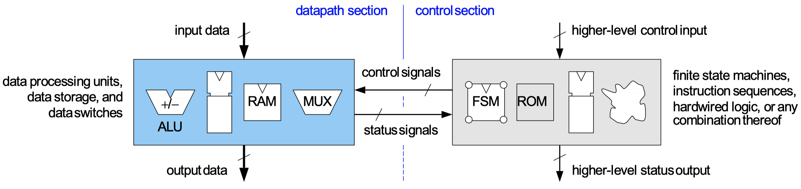
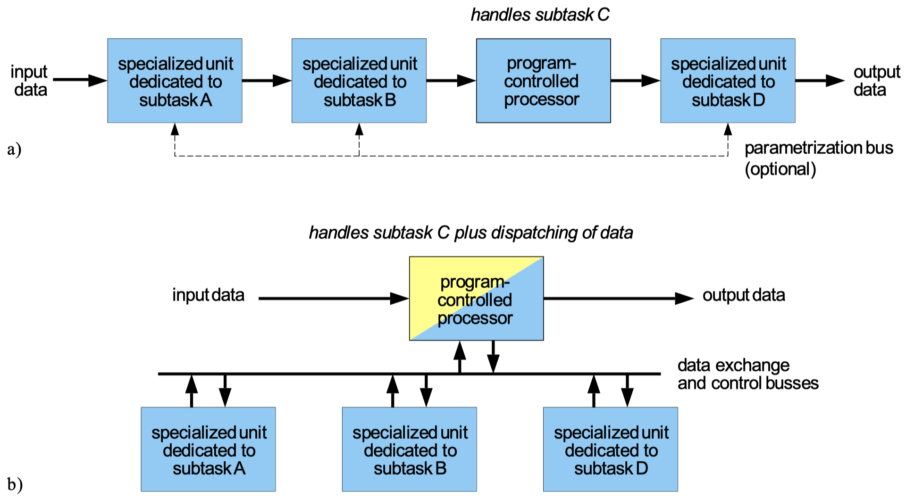
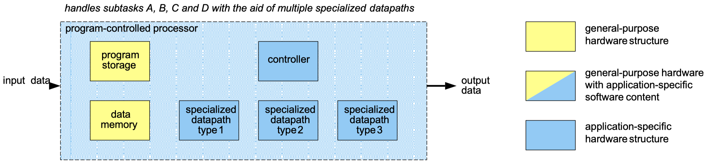
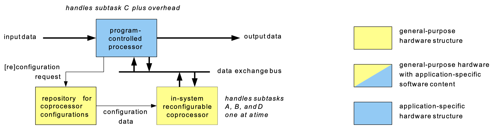
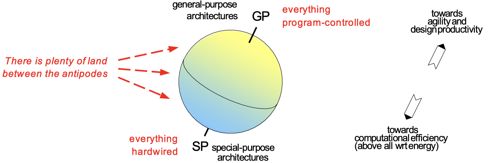

# Chapter 6: From Algorithm To Architectures

You will learn about the options for tailoring hardware to data and signal processing algorithms:

- General-purpose vs. special-purpose architectures and all sorts of compromises between the two
- A toolbox for optimizing VLSI architectures
    - Iterative decomposition, pipe lining, replication, timesharing
    - Algebraic transforms
    - Retiming
    - Loop unfolding, pipeline interleaving
- Options for temporary storage of data, such as register files, SRAM, and DRAM

The goals of _architecture design_ are as follows:

1. Decide on the necessary hardware resources for carrying out computations from data and signal processing
2. Organize their interplay such as to meet target specifications
3. Concerns:
    - Functional correctness
    - Performance targets
    - Circuit size
    - Energy efficiency
    - Agility
    - Engineering effort and time to market

## 6.1 The Architectural Solution Space

### 6.1.1 The antipodes

With a **fully programmable** architecture we mean an _instruction processor:_

- Instructions et processor execute one program instruction after the other in consecutive _fetch-load-execute-store_ cycles.
- The ALU (arithmetic-logic unit) carries out data manipulations.

We distinguish between datapath and control section:

{width=85%}

Following is an overview of the main differences between general purpose and special purpose hardware architectures:

| Topic | General purpose | Special purpose |
| :---- | :-------------- | :-------------- |
| Algorithm | any, not known apriori | fixed, must be known |
| Execution model | fetch-load-execute-store | process data item and pass on |
| Datapath | ALU plus memory | customized design |
| Controller | with program microcode | typically hardwired |
| Performance indicator | instructions per second, runtime of benchmarks | data throughput |
| Strengths | highly flexible, immediately available, routine design flow, low up-front cost | room for max. performance, highly energy-efficient, lean circuitry |

### 6.1.2 What an algorithm suitable for a dedicated VLSI architecture?

What makes an algorithm suitable for dedicated VLSI architectures?

We list the different ideas and requirements:

1. Loose coupling between major processing tasks
    - Clear functional partitioning among tasks
    - Stream-like interactions between them
2. Simple control flow
    - Course of operations does not depend on the data being processed
    - No need for overly many modes of operations, data formats, etc.
3. Regular data flow, recurrence of a few identical operations
4. Reasonable and design-time analyzable storage requirements
5. Suited to implementation with "tuned" precision arithmetic
6. non-recursive linear time-invariant computation over some algebraic field
7. No transcendental functions
8. Extensive usage of operations unavailable from instruction sets

### 6.1.3 There is plenty of land between the antipodes

We introduce some important templates which we use to move from general purpose architectures to more specialized architecture.

The following figure shows a chain of general-purpose processor and dedicated satellites (a), host computer with specialized fixed-function blocks or coprocessors (b):

{width=80%}

An intermediate form is an **application-specific instruction set processor (ASIP):**

1. Program-controlled operation (highly flexible)
2. Application-specific features confined to datapath circuitry
3. Single thread of execution, easily extended to multiple threads

{width=80%}

ASIP combines excellent throughput and low power with the agility of a program-controlled architecture.

LISA (Language for Instruction Set Architectures) provides a framework for accelerating ASIP design. The design flow essentially goes like:

1. Define the most adequate instruction set for a target application.
2. Refine the architecture into a cycle-accurate model
3. Cast your architecture into an RTL-type model

System-level software tools then generate VHDL synthesis code (from the RTL model).

Another important concept is **reconfigurable computing:**

The general purpose of reconfigurable computing is:

1. Designers come up with a specific circuit structure for each major piece of suitable computation.
2. All configurations get stored in memory.
3. Whenever the host encounters a call to one of those computations, it downloads the pertaining configuration file into the FPL.
4. Host feeds coprocessor with data and fetches results.
5. Host proceeds after computation completes.

Furthermore, there are **domain-specific programmable platforms (DSPP):**

1. Instruction-set-programmable processor
2. Hardwired circuits
3. Electrically configurable fabrics (FPL)
4. Various types of memories

DSPP are platform ICs. Specifications are done using a domain-specific high-level language. Developer tools assign the most adequate execution units. The FPL is used to extend datapaths and/or instruction sets where beneficial and all inactive subcircuits are turned off.

Pros and cons of DSPP:

- + Good performance
- + Energy-efficient
- + One platform covers a range of applications and products
- + Simplified design
- - Transistors used lavishly, many subcircuits may never be put to service in a given application or product
- - Developer tools are in their infancy

### 6.1.4 Digest

We have gained the following insights:

## 6.2 Dedicated VLSI Architectures And How To Design Them

### 6.2.1 Remodeling in the algorithmic domain

Most processing algorithms must be reworked for hardware. Departures from some mathematically ideal algorithm are almost always necessary to arrive at an economically feasible solution:

- _Digital filter:_ Tolerate a somewhat lower stopband suppression in exchange for a reduced computational burden.
- _Viterbi decoder:_ Sacrifice 0.1 dB or so of coding gain for the benefit of doing computations in a more economical way.

_Example:_ We might replace the autocorrelation function given by:

$$
ACF_{xx}(k) = r_{xx}(k) = \sum_{n = - \infty}^{\infty} x(n) \cdot x(n + k)
$$

by the average magnitude difference function:

$$
AMDF_{xx}(k) = r_{xx}^J(k) = \sum_{n = 0}^{N-1} |x(n) - x(n + k)|
$$
