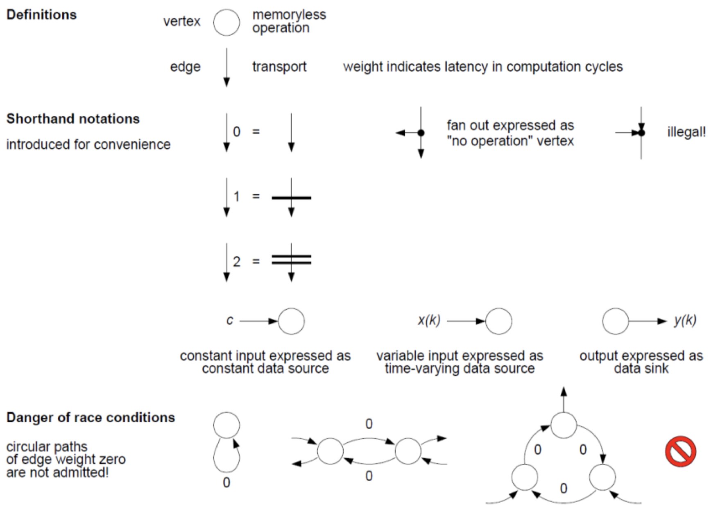
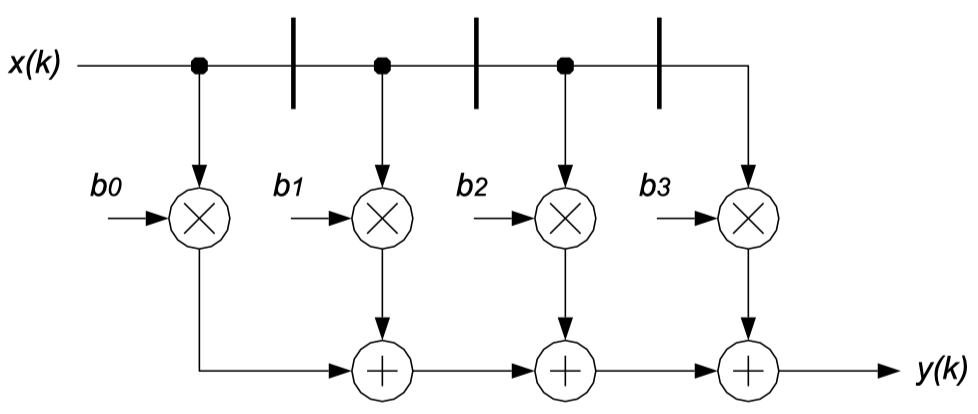

There is room for remodeling computations in two distinct domains:

- Processing algorithm: Alternative choices in the algorithm domain. How to tailor an algorithm such as to cut the computational burden, to trim down memory requirements, and/or to speed up calculations without incurring unacceptable implementation losses?
- Hardware architecture: Equivalence transforms in the architectural domain. How to (re-)organize a computation such as to optimize throughput, circuit size, energy efficiency and overall costs while leaving the input-to-output relationship unchanged except, possibly, for latency?

In conclusion, it is always necessary to balance many contradicting requirements to arrive at a working and marketable embodiment of an algorithm.

Let us formalize how we describe an algorithm: with **data dependency graphs (DDG):**

{width=70%}

_Example:_ Consider the following algorithm: $y(k) = \sum_{n = 0}^{N = 3} b_nx(k-n)$. Its representation as a DDG graph looks as follows:

{width=40%}

We introduce different figures of merit for hardware architectures:

- _Cycles per data item_ ($\Gamma$): number of computation cycles between releasing two subsequent data items.
- _Longest path delay_ ($t_{lp}$): the laps of time required for data to propagate along the longest path. A circuit cannot function correctly unless $t_{lp} \leq T_{cp}$.
- _Time per data item_ ($T$): the lapse time between releasing two subsequent data items. $T = \Gamma \cdot T_{cp} \geq \Gamma \cdot t_{lp}$
- _Data throughput_ ($\Theta$): $\Theta = \frac{1}{T} = \frac{f_{cp}}{\Gamma}$
- _Latency_ ($L$): number of computation cycles from a data item entering a circuit until the pertaining result becomes available.
- _Circuit size_ ($A$): expressed in $mm^2$ or $GE$ (gate equivalent).
- _Size-time product_ ($AT$): the hardware resources spent to obtain a given throughput. $AT = \frac{A}{\Theta}$.
- _Energy per data item_ ($E$): the amount of energy dissipated for a given computation on a data item, e.g. $nJ/sample$. $E = PT$.

We can do some metrics for our previously shown DDG. We allow the following approximations: interconnected delays are neglected, delays of arithmetic operations are summed up, glitching is ignored. This leads to the following metrics:

- $A = 3A_{reg} + 4A_* + 3A_+$
- $\Gamma = 1$
- $t_{lp} = t_{reg} + t_* + 3t_+$
- $AT = (3A_{reg} + 4A_* + 3A_+)(t_{reg} + t_* + 3t_+)$
- $L = 0$
- $E = 3E_{reg} + 4E_* + 3R_+$

Let's quickly focus on the difference between _computation cycles_ and _clock period:_ A computation period $T_{cp}$ is the time span that separates two consecutive computation cycles. During each computation cycle, fresh data emanates from a register, propagates through combinational circuitry before the result gets stored in the next analogous register. The _computation rate_ denotes the inverse, i.e. $f_{cp} = \frac{1}{T_{cp}}$.

For all circuits that adhere to single-edge-triggered one-phase clocking, computation cycle and clock period are the _same:_

$$
f_{cp} = f_{clk} \iff T_{cp} = T_{clk}
$$

## 6.3 Equivalence Transforms For Combinational Computations

First, what do we mean by **combinational computation?** A computation is termed _combinational_ if:

1. Result depends on the present arguments exclusively
2. All edges in the DDG have weight zero.
3. DDG is free of circular paths.

There are multiple options for implementing transforms at the architecture level:

- _Decomposing_ function $f$ into a sequence of subfunctions that get executed one after the other on the same hardware
- _Pipelining_ of the functional unit for $f$ to improve computation rate by cutting down combinational depth.
- _Replicating_ the hardware for $f$ and having all units work concurrently.

### 6.3.1 Iterative Decomposition

The idea of **iterative decomposition** is to perform a step-by-step execution by sharing one HW execution unit. The figure below shows the DDG (a) and a hardware configuration (b) for $d = 3$:

{width=80%}

The performance and cost analysis of the iterative decomposition is as follows:

- $\frac{A_f}{d} + A_{reg} + A_{ctl} \leq A(d) \leq A_f + A_{reg} + A_{ctl}$
- $\Gamma(d) = d$
- $t_{lp}(d) \simeq \frac{t_f}{d} + t_{reg}$
- $L(d) = d$
- $E(d) \gtrless E_f + E_{reg}$

Iterative decomposition is attractive when a computation makes repetitive use of a single subfunction because a lot of area can be saved. It is unattractive when subfunctions are very disparate and, therefore, cannot be made to share much hardware resources.
