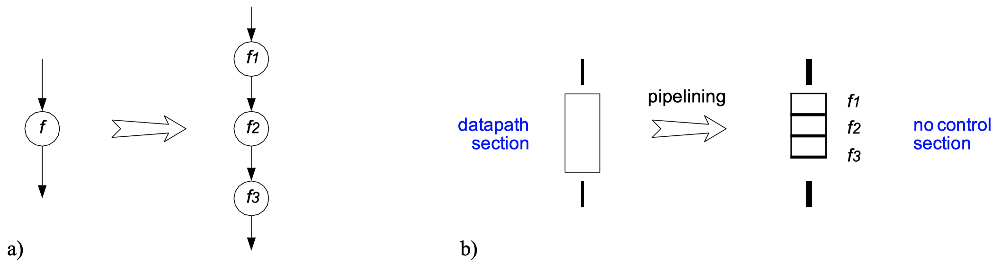
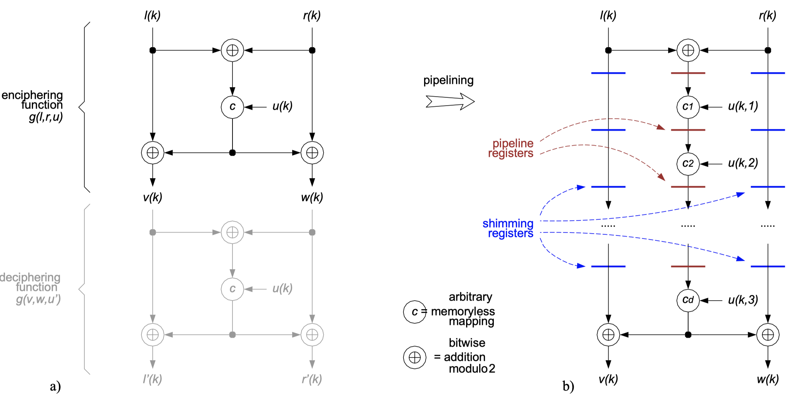
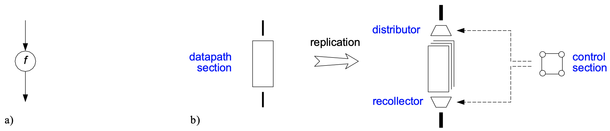
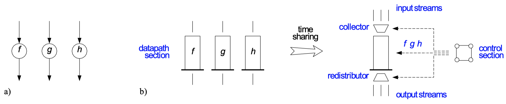
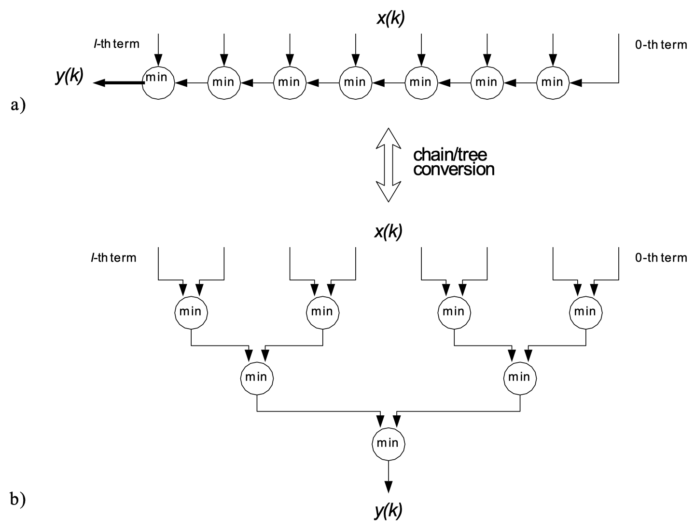
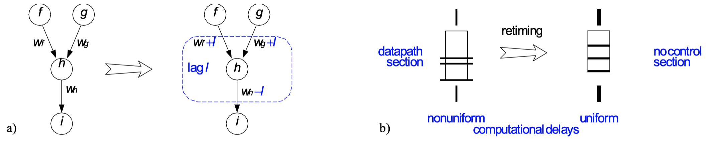
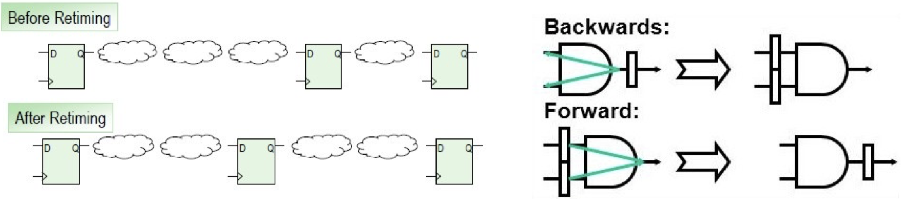
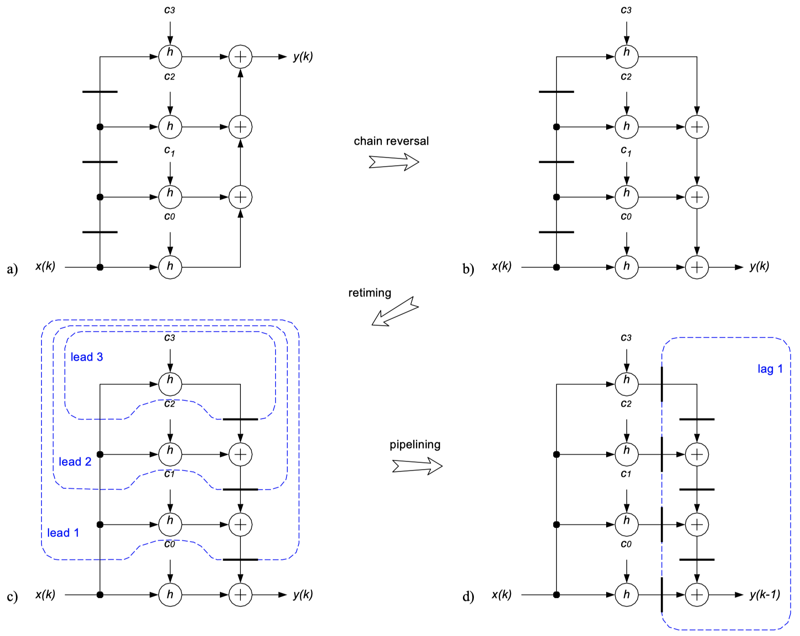

### 6.3.2 Pipelining

The idea of **pipelining** is to have an assembly line operated by specialized workers. The following figure shows a DDG (a) and a hardware configuration (b) for $p = 3$:

{width=80%}

The performance and cost analysis for pipelining is as follows:

- $A(p) = A_f + p \cdot A_{reg}$
- $\Gamma(p) = 1$
- $t_{lp}(p) \simeq \frac{t_f}{p} + t_{reg}$
- $AT(p) \simeq p \cdot A_{reg} \cdot t_{reg} + (A_{reg} \cdot t_f + A_f \cdot t_{reg}) + \frac{1}{p} A_f \cdot t_f$
- $L(p) = p$
- $E(p) > (\text {fine grain}) < (\text{coarse grain}) E_f + E_{reg}$

As one can see by the performance analysis, we must distinguish between two regimes of pipelining:

- **Coarse grain pipelining:**
    - Few register are evenly inserted into a deep combinational network. This results in a little extra area for much better throughput, the $AT$-product is lowered dramatically and glitching is reduced.
- **Fine grain pipelining:**
    - The combinational delay in each stage approaches the register delay. This results in a diminishing speedup for more and more overhead, the $AT$-product augments significantly and there is a significant register activity added, which results in a waste of energy.

There is a _theoretical bound_ for pipelines: Pipeline stages must accommodate at least one 2-input `nand` or `nor`. Therefore, the computation rate and clock frequency are bounded:

$$
T_{cp} \geq \min(t_{lp}) = \min(t_{gate}) + t_{reg} = \min(t_{nand}, \, t_{nor}) + t_{su \, ff} + t_{pd \, ff}
$$

The following figure shows pipelining in the presence of _multiple feedforward paths._ (a) shows the DDG before and (b) shows the DDG after pipelining:

{width=70%}

### 6.3.3 Replication

The idea of **replication** is to add a block which processes some data multiple times, i.e. to create a multi-piston pump. The figure below shows a DDG (a) and a hardware configuration (b) for $q = 3$:

{width=80%}

The performance and cost analysis for replication is as follows:

- $A(q) = q(A_f + A_{reg}) + A_{ctl}$
- $\Gamma(q) = \frac{1}{q}$
- $t_{lp}(q) \simeq t_f + t_{reg}$
- $AT(q) \simeq (A_f + A_{reg} + \frac{1}{a}A_{ctl})(t_f + t_{reg}) \simeq (A_f + A_{reg})(t_f + t_{reg})$
- $L(q) = 1$
- $E(q) \simeq E_f + E_{reg} + E_{ctl}$

The computer industry has been pushed towards replication because:

- CMOS offered more room for increasing circuit complexity than for pushing clock frequencies higher.
- The faster the clock, the smaller the region on a semiconductor die that can be reached within a single clock period.
- Fine grain pipelines dissipate a lot of energy for relatively little computation.

### 6.3.4 Time Sharing

The idea of **timesharing** is based on the fact that many applications ask for the simultaneous processing of multiple parallel data streams. We share some hardware resource over multiple clockcycles to implement multiple nodes. The figure below shows a DDG (a) and a hardware configuration (b) for $s = 3$:

{width=80%}

The performance and cost analysis for timesharing is as follows:

- $\max_{f, \, g, \, h}(A) + A_{reg} + A_{ctl} \leq A(s) \leq \sum_{f, \, g, \, h} A + A_{reg} + A_{ctl}$
- $\Gamma(s) = s$
- $t_{lp}(s) \simeq \max_{f, \, g, \, h}(t) + t_{reg}$
- $L(s) = s$
- $E(s) \simeq s \cdot \max_{f, \, g, \, h}(E) + E_{reg} + E_{ctl}$

Timesharing is _favorable_ when one monofunctional datapath proves sufficient because all streams are to be processed in exactly the same way. It is _unattractive_ when subfunctions are very disparate, because no savings can be obtained from concentrating their processing into one multifunctional datapath.

### 6.3.5 Associativity and Other Algebraic Transform

We first want to distinguish between _universal_ and _algebraic transforms:_

- **Universal transforms:** Whether and how to apply them can be decided from the DDG alone, no matter what operations the vertices stand for.
     - Iterative decomposition
     - Pipelining
     - Replication
     - Timesharing
- **Algebraic transforms:** Take advantage of specific algebraic properties of the operations involved.
    - Associativity transform and commutativity transforms
    - Horner's scheme for evaluating polynomials
    - Method of finite differences to calculate equidistant values
    - Karatsuba multiplication for wide data words

_Example:_ Consider the following **associativity transform.** It shows an 8-way minimum function with (a) a chain-type DDG and (b) a tree-type DDG:

{width=60%}

### 6.3.6 Digest

_Equivalence transforms_ that help to optimize combinational computations are given by iterative decomposition, pipelining, replication, algebraic transforms, and timesharing.

Furthermore:

- Iterative decomposition and timesharing are most effective when a computational unit can be used several times.
- Pipelining is generally superior to replication.
- Pipelining and iterative decomposition are complementary, they both can contribute to lowering the $AT$-product.
- Lowering $AT$ always implies cutting down the longest path $t_{lp}$

## 6.4 Options For Temporary Storage Of Data

Why and when do we need to store data? Except for trivial SSI/MSI circuits, any IC includes some form of memory. This is either because:

- The data processing algorithm is of sequential nature and, therefore, asks for _functional memory._
- _Nonfunctional storage_ got introduced into the circuit as a consequence of architectural transformations.

The different architectural options for temporary storage of data are:

- _On-chip register,_ built from individual flip-flops or latches.
- _On-chip memory,_ i.e. SRAM macrocells (or possibly embedded DRAM)
- _Off-chip memory,_ i.e. SRAM or DRAM catalog parts.

### 6.4.1 Data Access Patterns

We can distinguish between different **data access patterns:**

- RAMs impose access on a one-data-word-after-the-other basis
- Registers allow for simultaneous access to all data words stored

### 6.4.2 Wiring and the cost of going off-chip

Off-chip memories add to pin count, package count, and board space. Furthermore, they result in extra parasitic capacitance, extra delays, and extra energy dissipation. 

Additionally, commodity RAMs impose bidirectional pads which requires special attention:

- Stationary and transient drive conflicts must be avoided.
- Test patterns must address bidirectional operation and high-impedance states.
- Electrical and timing measurements become more complicated.

In conclusion, _off-chip storage_ is associated with important penalties.

### 6.4.3 Digest

There is no such thing as an optimal solution for temporary storage of data, what is best strongly depends on the situation and requirements:

- Only registers allow for simultaneous access to all data, but occupy a lot of die area per bit.
- SRAMs can hold more significant quantities of data but are slower than registers, yet faster than DRAMs.
- DRAMs require periodical refresh, this means that power dissipates even when idle.
- DRAM and Flash memories are cost-efficient for large data quantities.
- Flash is used for permanent storage, but is much slower than RAM.

## 6.5 Equivalence Transforms For Non-Recursive Computations

What do we mean by **non-recursive computation?** A computation is termed (sequential and) non-recursive if:

1. Result is dependent on past arguments, not just present.
2. Edges with weights greater than zero are present in the DDG.
3. DDG is free of circular paths.

### 6.5.1 Retiming

**Retiming** is _not_ pipelining! Retiming uses registers that already exists. The idea is to repartition workloads evenly for all workers on an assembly line. The figure below shows a DDG (a) and a hardware configuration (b) for $l = 1$:

{width=80%}

Another view on retiming is given by the following figure:

{width=80%}

Retiming imposes some formal rules. To be legal, any retiming must observe the following:

1. Neither outputs nor sources of time-varying inputs may be part of a supervertex that is to be retimed.
2. When a supervertex is assigned a lag (_lead_) by $l$ computation cycles, the weights of all its incoming edges are in- (or de-) cremented by $l$ and the weights f all its outgoing edges are de- (in-) cremented by $l$.
3. No edge weight may be changed to assume a negative value.
4. Any circular path must always include at least one edge of strictly positive weight

### 6.5.2 Pipelining Revisited

**Pipelining** imposes the same rules as retiming except:

1. Any supervertex to be assigned a lag _must include_ all outputs (all time-varying outputs).

In comparison, both transforms aim at shortening the longest path. Pipelining increases latency as registers are added and retiming leaves the latency unchanged as registers get reallocated.

_Example:_ Non-linear time-invariant third order correlator:

{width=70%}
