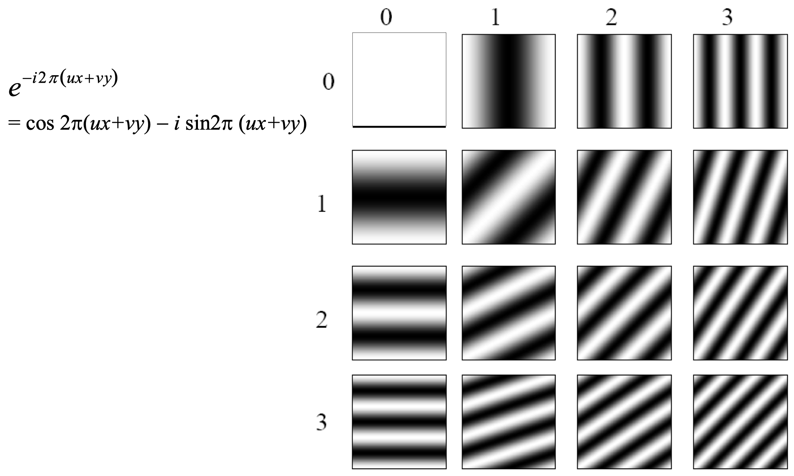
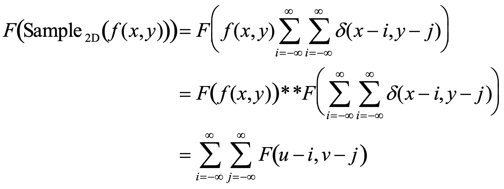
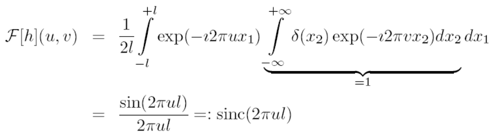

# 1. The Digital Image

## 1.1 What is an image?

### Image as a 2D signal

The **signal** is a function depending on some variable with physical meaning. The **image** is a continuous function, where we either have 2 variables `x y` which are the coordinates, or, in case of a video, three variables `x y` and the corresponding time in the video. Usually, the value of the function is the **brightness**.

_Images in Python:_

```python
    # Load a picture into Python
    import cv2
    img = cv2.imread('foo.jpg')

    # Display the image in Python
    cv2.imshow('My image', img)
    cv2.waitKey(0)

    # Print the image data array
    img

    # Print the size of the image array and create a subimage
    img.shape
    subimg = img[72:92, 62:82]
```

```python
    # Random image in Python
    import numpy as np
    import cv2
    t = np.random.rand(64, 64)
    cv2.imshow('Random', t)
    cv2.waitKey(0)
```

In summary, an **image** is a picture or pattern of a value varying in space and/or time. It is the representation of a _continuous_ function to a _discrete_ domain: `f : R^n -> S`.

As an example, for grayscale CCD images, `n = 2` and `S = R^+`.

### What is a pixel?

_A pixel is not a little square!_

**Pixels** are point measurements of a function (of the above described continuous function).

## 1.2 Where do images come from?

There are several things where pictures can come from:

- Digital cameras
- MRI scanners
- Computer graphics packages
- Body scanners
- Many more...

### Digital cameras

Simplified, the **digital camera** consists of the following parts and is said to be a _Charge Coupled Device (CCD)_:

{width=50%}

The **sensor array** can be < 1 cm^2 and is an array of _photosites_. Each photosite is a bucket of electrical charge, and this charge is proportional to the incident light intensity during the exposure.

The **analog to digital conversion (ADC)** measure the charge and digitizes the result. The conversion happens line by line in that charges in each photosite move down through the sensor array.

Example:

{width=50%}

Because each bucket has a finite capacity, if a photosite bucket is full, it can overflow to other buckets, which leads to **blooming**.

Even without any light, there will still be some current which can degrade the quality of a picture. CCD's produce thermally-generated charge, which results in a _non-zero output_ even in darkness. This effect is called the **dark current**.

## 1.3 CMOS

**CMOS** sensors have the same sensor elements as CCD. Each photo sensor has its own amplifier, which results in more noise and a lower sensitivity. However, since CMOS photo sensor use standard CMOS technology, we might put other components on the chip (such as "smart pixels").

### CCD vs. CMOS

_CCD_

- Mature technology
- Specific technology
- High production cost
- High power consumption
- Blooming
- Sequential readout

_CMOS_

- More recent technology
- Cheap
- Lower power consumption
- Less sensitive
- Per pixel amplification
- Random pixel access
- On chip integration with other components

### Rolling shutter

By resetting each line in the sensor line by line (the "shutter"), each line will start capturing light a little before the line below and so on. Each line in the picture is therefore a little behind in time as the line above.

## 1.4 Sampling in 1D

**Sampling** in 1D takes a function, and returns a vector whose elements are values of that function at the sample points.

Example:

{width=50%}

Sampling solves one problem with working with continuous functions. How do we store and compute with them? A common scheme for representing continuous functions is with **samples**: we simply write down the function's values as discrete values at many sample points.

### Reconstruction

**Reconstruction** describes the process of making samples back into a continuous function. We might do this for several reasons:

- For output where we need a realizable method
- For analysis or processing, where we need a mathematical method
- Instead of "guessing" what the function did in between sample points

### Undersampling

Unsurprisingly, if we undersample some function, we loose information.

Example: If we undersample the following `sin` wave, it gets indistinguishable from lower frequencies:

_Sample:_

{width=50%}

_Reconstruction 1:_

{width=50%}

_Reconstruction 2:_

{width=50%}

This effect is what we call **aliasing**, i.e. _"Signals travelling in disguise as other frequencies"_.

## 1.5 Sampling in 2D

**Sampling** in 2D takes a function and returns an array. We allow the array to be infinite dimensional and to have negative as well as positive indices.

Example:

_Function:_

{width=50%}

_Sample:_

{width=50%}

### Reconstruction

In 2D, a simple way to reconstruct a function from a sample is to use **bilinear interpolation**, which works essentially the same as linear interpolation: we calculate two lines in each direction, and then take the intersection of the two lines.

Example:

{width=50%}

## 1.6 Nyquist Frequency

We define the **Nyquist Frequency** as half the sampling frequency of a discrete signal processing system. The concept tells us, that if the signal's maximum frequency is at most the Nyquist frequency, then we can reconstruct the signal.

## 1.7 Quantization

When sampling, real valued functions will get digital values, i.e. integer values. This means that **quantization** is lossy: after quantization, the original signal cannot be reconstructed anymore.

This is in contrast to sampling, as a sampled but not quantized signal _can_ be reconstructed.

### Usual quantization intervals

The following are the most widely used quantization intervals:

- Grayscale image: `8 bit = 2^8 = 256` gray values
- Color image RGB (3 channels): `8 bit/channel = 2^24 = 16.7M` colors
- 12 bit or 16 bit for some sensors

## 1.8 Image Properties

### Image resolution

Simply tells the amount of pixels our pictures has.

### Geometric resolution

_How many pixels per area?_

Tells us how many pixels we have per a given area (e.g. how many pixels per square centimeter of picture).

### Radiometric resolution

_How many bits per pixel?_

Tells us how much information each pixel can store.

## 1.9 Image Noise

A common model is the **additive Gaussian noise**, which means that we measure some signal with our processor but have some deviation/noise in our measurement:

{width=50%}

One might also use the much more meaningful assumption of **Poisson noise**:

{width=50%}

### SNR

The **signal-to-noise ration (SNR)** `s` is an index of image quality:

{width=50%}

## 1.10 Color Cameras

We consider three different common concepts:

1. Prism (with three different sensors)
2. Filter mosaic
3. Filter wheel

### Prism

With this type of camera, we separate the light into three beams using two _dichroic prisms_. However, this requires three sensors and a very precise alignment. The plus of this concept is that there is a very good color separation.

### Filter Mosaic

With this concept, one coats the filter directly on the sensor.

### Filter wheel

For static scenes, we can rotate multiple filters in front of the lens. This allows for more than 3 colors.

### Prism vs. mosaic vs. wheel

| Approach   | Prism            | Mosaic          | Wheel                   |
| ---------- | ---------------- | --------------- | ----------------------- |
| # Sensors  | 3                | 1               | 1                       |
| Separation | High             | Average         | Good                    |
| Cost       | High             | Low             | Average                 |
| Framerate  | High             | High            | Low                     |
| Artefacts  | Low              | Aliasing        | Motion                  |
| Bands      | 3                | 3               | 3 or more               |
| Type       | High-end cameras | Low-end cameras | Scientific applications |

### Color CMOS sensor (Foveon's X3)

{width=50%}

In contrast to a filter mosaic, we truly measure each color at each pixel, instead of either red, blue or green per pixel.

# 2. Image Segmentation

> Image segmentation is the ultimate classification problem. Once solved, Computer Vision is solved.

## 2.1 What is Image Segmentation?

**Image segmentation** partitions an image into regions of interest. It is the first stage in many automatic image analysis systems.

A _complete segmentation_ of an image `I` is a finite set of regions `R_1,..., R_N`, such that:

{width=50%}

_Excluding dark pixels from an image:_

```python
    img = cv2.imread('BlobsIP.png') # An 8-bit image
    cv2.imshow('BlobsIP', img)
    cv2.waitKey(0)
    img.shape --> [244 767 3]
    hist = np.histogram(img, bins=256)
    cv2.imshow('Histogram', hist)
    cv2.waitKey(0)
    cv2.imshow('Mask', img[:,:,1] > 20)
    cv2.waitKey(0)
```

### Segmentation quality

The **quality** of a segmentation depends on what you want to do with it. Segmentation algorithms must be chosen and evaluated with an application in mind.

## 2.2 Thresholding

**Thresholding** is a simple segmentation process. It produces a binary image `B` by labeling each pixel in or out of the region of interest by comparison of the graylevel with a threshold `T`:

{width=50%}

### How do we choose T?

There are several ways to choose `T`:

- Trial and error
- Compare results with ground truth
- Automatic methods (we'll discuss ROC curves later on)

## 2.3 Chromakeying

If we can control the background of a picture, segmentation becomes easier. Assume we use a green screen.

**Chromakeying** describes the process of plain distance measuring, in this case for green:

{width=50%}

This has some problems:

- Variation is _not_ the same in all three channels
- The alpha mask is hard: `I_comp = I_alpha I_a + (1 - I_alpha) I_b`

### Background color variation

Colors in the background may vary a lot (especially the intensity of colors and especially of green).

On way which can make segmentation easier is to **normalize colors** (per pixel):

- Intensity `I = R + G + B`
- Normalized color `(r, g, b) = (R/I, G/I, B/I)`

## 2.4 ROC Analysis

A **Receiver Operating Characteristic (ROC)** curve characterizes the performance of a binary classifier. A binary classifier distinguishes between two different types of things, e.g.:

- Healthy/afflicted patients
- Pregnancy tests
- Object detection
- Foreground/background image pixels

### Classification errors

Binary classifiers make errors. There are two types of input to a binary classifier:

- positives
- negatives

This results in four possible outcomes in any test:

- True positive
- True negative
- _False negative_
- _False positive_

### ROC Curve

The **ROC curve** characterizes the error trade-off in binary classification tasks. It plots the TP fraction against the FP fraction:

- _TP fraction_ (**sensitivity**) is `True positive count / positive count`
- _FP fraction_ (1-sensitivity) is `False positive count / negative count`

The result could look something like this:

{width=50%}

### Operating points

We can choose an **operating point** by assigning relative costs and values to each outcome:

- `V_TN`: value of true negative
- `V_TP`: value of true positive
- `C_FN`: cost of false negative
- `C_FP`: cost of false positive

When we assigned these costs, we can choose the point on the ROC curve with **gradient**:

{width=50%}

For simplicity, we often set `V_TN = V_TP = 0`.
¨

## 2.5 Limits of Thresholding

Why can we segment images much better by eye than through thresholding processes? Because we can consider the context of the whole image.

We might improve results by considering _image context_ through **surface coherence**.

## 2.6 Pixels

### Pixel connectivity

We need to define which pixels are connected/neighbors.

We define two different types of **pixel neighborhoods**:

{width=50%}

### Pixel paths

A **4-connected path** between pixels `p_1` and `p_n` is a set of pixels `{p_1, p_2,..., p_n}` such that `p_i` is a 4-neighbor of `p_i+1`.

In an **8-connected path**, `p_i` is an 8-neighbor of `p_i+1`.

### Connected regions

A region is 4-connected if it contains a 4-connected path between any two of its pixels. Analog, a region is 8-connected if it contains an 8-connected path between any two of its pixels.

## 2.7 Region growing

**Region growing** is defined by the following steps:

1. Start from a seed point/pixel or region
2. Add neighboring pixels that satisfy the criteria defining the region
3. Repeat until we can include no more pixels

In code, this could look like the following example:

```python
def regionGrow(I, seed) :
    X, Y = I.shape
    visited = np.zeros((X, Y))
    visited[seed] = 1
    boundary = []
    boundary.append(seed)

    while len(boundary) > 0 :
            nextPoint = boundary.pop()
            # Here is the important function which defines the region criteria
            if include(nextPoint, seed) :
                visited[nextpoint] = 2
                for (x, y) in neighbors(nextPoint) :
                    if visted[x, y] == 0 :
                        boundary.append((x, y))
                        visited [x, y] = 1
```

### Variations

There are three key indicators which lead to variation:

- Seed selection
- Inclusion criteria
- Boundary constraints and snakes

**Seed selection** can happen in different ways. This may be either by hand (point and click), or automatically by conservative thresholding.

The **inclusion criteria** could either be done by graylevel thresholding or by a _graylevel distribution model_:

- Use mean `mu` and standard deviation `sigma` in seed region and then:
  - include if `(I(x, y) - mu)^2 < (n sigma)^2` (with for example `n = 3`)
  - this also leads to the ability to update the mean and standard deviation after every iteration

### Snakes

A **snake** is an active contour. It is a polygon, i.e., an ordered set of points joined up by lines. Each point on the contour moves away from the seed while its image neighborhood satisfies an inclusion criterion.

## 2.8 Distance Measures

With a **plain background-subtraction metric** we do the following calculations:

- `I_alpha = | I - I_bg | > T`
- `T = [20 20 10]` (for example)
- `I_bg` is the background image

The background image is obtained by a "previous image", for example before a car drives into the scene. The color of the background is determined on a per-pixel basis.

When possible, we should fit a Gaussian model per pixel, just as we did for an entire green-screen. This leads to the following, better way of doing distance measurements:

{width=50%}

## 2.9 Spatial Relations

We introduce the concept of **Markov Random Field** for spatial relations:

- _Markov chains_ have a 1D structure. At every time, there is one state (which enables use of dynamic programming)
- _Markov Random Fields_ break this 1D structure. It is a field of sites, each of which has a label. The labels at one site depend on others, there are no 1D structure dependencies.

### Solving MRFs with graph cuts

_something something_

## 2.10 Morphological Operations

**Morphological operators** are local pixel transformers for processing region shapes. They are most often used on binary images. Logical transformations are based on comparison of pixel neighborhoods with a pattern.

### Example: 8-neighbor erode

The **8-neighbor erode** works by simply erasing any foreground pixel that has one eight-connected neighbor that belongs to the background.

_Example:_

{width=50%}

The contrast to this function is the **8-neighbor dilate**, where we simply paint any background pixel that has one 8-connected neighbor that is foreground.

### Structuring elements

Morphological operations take two arguments:

- A binary image
- A structuring element

We compare the structuring element to the neighborhood of each pixel, which determines the output of the morphological operation.

We can think of **binary images** and the structuring elements as _sets_ containing the pixels with value `1`.

{width=50%}

### Fitting, Hitting and Missing

We define the following three terms:

- `S` _fits_ `I` at `x` if `{y : y = x + s, s in S} subset I`
- `S` _hits_ `I` at `x` if `{y : y = x - s, s in S} intersection I != emptyset`
- `S` _misses_ `I` at `x` if `{y : y = x - s, s in S} intersection I = emptyset`

### Erosion

The image `E = I circ- S` is the **erosion** of image `I` by structuring element `S`:

{width=50%}

### Opening and Closing

The **opening** of `I` by `S` is defined by:

{width=50%}

The **closing** of `I` by `S` is defined by:

{width=50%}

### Skeletonization and the Medial Axis Transform

The **skeleton** and **medial axis transform (MAT)** are stick-figure representations of a region `X subset R^2`.
Simply speaking, one might start a "grass fire" at the boundary of the region, and the skeleton is then defined as the set of points at which two fire fronts meet.

Example:

{width=50%}

With a **medial axis transform** you remember for each point on the skeleton the distance you travelled to get to that point. This way, the whole shape can be reconstructed from a MAT.

# 3. Convolution and Filtering

## 3.1 Linear Shift-Invariant Filtering

**Linear shift-invariant filtering** is about modifying pixels base don its _neighborhood_. Linear means that it should be a _linear combination_ of neighbors. Shift-invariant means that we do the _same thing for each pixel_. This approach is useful for:

- Low-level image processing operations
- Smoothing and noise reduction
- Sharpening
- Detecting or enhancing features

### 3.1.1 Linear Filtering

$L$ is a **linear** operation if:

$$
L[\alpha I_1 + \beta I_2] = \alpha L [I_1] + \beta L [I_2]
$$

Linear operations can be written as:

$$
I'(x, \, y) = \sum_{(i, \, j) \in \mathcal{N}(x, \, y)} K(x, \, y; \, i, \, j)I(i, \, j)
$$

Where $I$ is the input image, $I'$ is the output of the operation, and $K$ is the **kernel** of the operation. $\mathcal{N}(m, \, n)$ denotes the _neighborhood_ of $(m, \, n)$.

> Operations are **shift-invariant** if $K$ does _not_ depend on $(x, \, y)$, i.e. we when using the same weights everywhere!

## 3.2 Correlation

In this approach, we take a **correlation mask** and apply it to an image.

> Correlation is as if we had a template (the mask), and search for it in our image.

This would look as follows:

{width=50%}

The linear operation of correlation looks as follows:

$$
I' = K \circ I \\ I'(x, \, y) = \sum_{(i, \, j) \in \mathcal{N}(x, \, y)}K(i, \, j)I(x+i, \, y + j)
$$

This represents the linear weights as an image.

## 3.3 Convolution

> Compared to correlation, where we looked at the neighborhood of a pixel and applied what we learned from the neighborhood to the single pixel, in convolution we look at a single pixel and apply what we can learn from it to its neighborhood.

{width=50%}

The linear operation of convolution is given by:

$$
I' = K * I \\ I' (x, \, y) = \sum_{(i, \, j) \in \mathcal{N}(x, \, y)}K(i, \, j)I(x-i, \, y-j)
$$

This too represents the linear weights as an image, it is actually the same as correlation, but with a reversed kernel.

### 3.3.1 Correlation vs Convolution

{width=50%}

## 3.4 Separable Kernels

**Separable filters** can be written as $K(m, \, n) = f(m)g(n)$. For a rectangular neighborhood with size $(2M + 1) \times (2N + 1)$, $I'(m, \, n) = f * (g * I(\mathcal{N}(m, \, n)))$. We can rewrite this to:

$$
I''(m, \, n) = \sum_{j = -N}^N g(j)I(m, \, n-j) \\ I'(m, \, n) = \sum_{i = -M}^Mf(i)I''(m-i, \, n)
$$

## 3.5 Gaussian Kernel

The idea of the **Gaussian kernel** is that we weight the contributions of neighboring pixels by their nearness:

{width=50%}

### 3.5.1 Gaussian Smoothing Kernels

The amount of smoothing when using Gaussian kernels depends on $\sigma$ and on the window size.

The top 5 reasons to use Gaussian smoothing are:

1. Rotationally symmetric
2. Has a single lobe (neighbor's influence decreases monotonically)
3. Still one lobe in frequency domain (no corruption from high frequencies)
4. Simple relationship to $\sigma$
5. Easy to implement efficiently

## 3.6 Filter Examples

**Differential filters**

- _Prewitt operator:_

$$
\begin{bmatrix}
    -1 & 0 & 1 \\
    -1 & 0 & 1 \\
    -1 & 0 & 1
\end{bmatrix}
$$

- _Sobel operator:_

$$
\begin{bmatrix}
    -1 & 0 & 1 \\
    -2 & 0 & 2 \\
    -1 & 0 & 1
\end{bmatrix}
$$

**High-pass filters**

- _Laplacian operator:_

$$
\begin{bmatrix}
    0 & 1 & 0 \\
    1 & -4 & 1 \\
    0 & 1 & 0
\end{bmatrix}
$$

- _High-pass filter:_

$$
\begin{bmatrix}
    -1 & -1 & -1 \\
    -1 & 8 & -1 \\
    -1 & -1 & -1
\end{bmatrix}
$$

# 4. Image Features

## 4.1 Template Matching

**Template matching** describes the problem of locating an object, described by a template $t(x, \, y)$, in the image $s(x, \, y)$. This is done by searching for the best match by minimizing mean-squared error:

$$
\begin{aligned}
    E(p, \, q) &= \sum_{x = - \infty}^{\infty} \sum_{y = - \infty}^{\infty} \lbrack s(x, \, y) - t(x-p, \, y-q) \rbrack^2 \\
    &= \sum_{x = - \infty}^{\infty} \sum_{y = - \infty}^{\infty} |s(x, \, y)|^2 + \sum_{x = - \infty}^{\infty} \sum_{y = - \infty}^{\infty} |t(x, \, y)|^2 - 2 \cdot \sum_{x = - \infty}^{\infty} \sum_{y = - \infty}^{\infty} s(x, \, y) \cdot t(x-p, \, y-q)
\end{aligned}
$$

Equivalently, we can _maximize_ the **area correlation**:

$$
r(p, \, q) = \sum_{x = - \infty}^{\infty} \sum_{y = - \infty}^{\infty} s(x, \, y) \cdot t(x-p, \, y-q) = s(p, \, q) * t(-p, \, -q)
$$

The area correlation is equivalent to the convolution of image $s(x, \, y)$ with impulse response $t(-x, \, -y)$.

## 4.2 Edge Detection

One idea, in a continuous-space, is to detect the local gradient:

$$
|\text{grad}(f(x, \, y))| = \sqrt{(\frac{\partial f}{\partial x})^2 + (\frac{\partial f}{\partial y})^2}
$$

We mostly use the following **edge detection filters**:

{width=50%}

### 4.2.1 Laplacian Operator

The idea of a **Laplacian operator** is to detect discontinuities by considering the second derivative and searching for _zero-crossings_ (those mark edge locations):

$$
\nabla^2 f(x, \, y) = \frac{\partial^2 fx, \, y()}{\partial x^2} + \frac{\partial^2 f(x, \, y)}{\partial y^2}
$$

{width=50%}

We can do a _discrete-space approximation_ by convolution with a $3 \times 3$ impulse response:

$$
\begin{bmatrix}
    0 & 1 & 0 \\
    1 & -4 & 1 \\
    0 & 1 & 0
\end{bmatrix} \quad \text{or} \quad \begin{bmatrix}
    1 & 1 & 1 \\
    1 & -8 & 1 \\
    1 & 1 & 1
\end{bmatrix}
$$

However, the Laplacian operator is sensitive to very fine detail and noise, so we might want to blur the image first.

#### Laplacian of Gaussian

Blurring the image with Gaussian and Laplacian operator can be combined into convolution with **Laplacian of Gaussian operator** (LoG):

$$
\text{LoG}(x, \, y) = - \frac{1}{\pi \sigma^4} \lbrack 1 - \frac{x^2 + y^2}{2 \sigma^2} \rbrack exp ( - \frac{x^2 + y^2}{2 \sigma^2} )
$$

### 4.2.2 Canny Edge Detector

The **Canny edge detector** works with the following steps:

1. Smooth the image with a Gaussian filter
2. Compute the gradient magnitude and angle (Sobel, Prewitt, etc.):

$$
M(x, \, y) = \sqrt{( \frac{\partial f}{\partial x} )^2 + ( \frac{\partial f}{\partial y} )^2} \quad \text{and} \quad \alpha(x, \, y) = \tan^{-1} ( \frac{\partial f}{\partial y} \big / \frac{\partial f}{\partial x} )
$$

3. Apply nonmaxima suppression to gradient magnitude image
4. Double thresholding to detect strong and weak edge pixels
5. Reject weak edge pixels not connected with strong edge pixels

#### Canny nonmaxima suppression

The **Canny nonmaxima suppression** works as follows:

1. Quantize the edge normal to one of the four directions: horizontal, -45deg, vertical, +45deg
2. If $M(x, \, y)$ is smaller than either of its neighbors in edge normal direction, then suppress is, else keep it

#### Canny Thresholding

When using a Canny edge detector, we do double thresholding of the gradient magnitude:

- Strong edge: $M(x, \, y) \geq \Theta_{high}$
- Weak edge: $\Theta_{high} > M(x, \, y) \geq \Theta_{low}$

A typical setting for the thresholds would be $\frac{\Theta_{high}}{\Theta_{low}} \in \lbrack 2, \, 3 \rbrack$.

### 4.2.3 Hough Transform

The **Hough transform** solves the problem of fitting a straight line (or curve) to a set of edge pixels. The Hough transform is a _generalized template matching technique_.

It works the following way:

1. For an edge pixel in the $(x, \, y)$ plane we can draw the different lines that cross the edge pixel (all lines have the form $y = mx + c$). We can draw the $m$ and $c$ values in a $(m, \, c)$ plane and see that all those lines are linearly dependent:

{width=50%}

2. If we have multiple edge pixels, we can do the same procedure for each of those, giving us a line in the $(m, \, c)$ plane for each edge pixel.
3. We then subdivide the $(m, \, c)$ plane into discrete "bins" and initialize the bin count of each bin to $0$. Each time a bin is crossed by one of the lines of the different edge pixels, we increase its count by one.
4. We then simply have to detect the peaks in the $(m, \, c)$ plane to get our fitted straight line:

{width=50%}

We might encounter an infinite-slope problem, which can be avoided with an alternative parameterization:

{width=50%}

## 4.3 Detecting Corner Points

Many applications benefit from features localized in $(x, \, y)$. If edges are well localized but only in one direction, we might want to **detect corners**.

The desirable properties of a corner detector are:

- accurate localization
- invariance against shift, rotation, scale, and brightness change
- robust against noise, high repeatability

*something something what patterns can be localized most accurately?*

{width=50%}

### 4.3.1 Feature Point Extraction

We have that $SSD \simeq \delta^T M \delta$. Now if we shift our patterns over the picture, we assume it to change the following way:

{width=50%}

Now we want to find points for which the following is large:

$$
\min \delta^T M \delta \text{ for } ||\delta || = 1
$$

i.e. we want to maximize the eigenvalues of $M$.

#### Keypoint Detection

*something something*

{width=50%}

# 5. Fourier Transform

## 5.1 Introduction

The idea of the **Fourier Transform** is to represent functions in a new basis. We might think of functions as vectors, with many components, where we can apply a linear transformation to transform the basis (i.e. a dot product with each basis elements).

In the expressions, $u$ and $v$ select the basis elements, so a function of $x$ and $y$ becomes a function of $u$ and $v$. The **basis elements** have the form $e^{-i2 \pi (ux + vy)} = \cos 2 \pi (ux + vy) - i \sin 2 \pi (ux + vy)$. Or:

$$
F(g(x, \, y))(u, \, v) = \int \int_{\mathbb{R}^2} g(x, \, y)e^{i2 \pi (ux + vy)}\text{d}x \text{dy}
$$

The **discrete Fourier transform** therefore is of the form:

$$
F = Uf
$$

where:

- $F$ is the transformed image
- $U$ is the Fourier transform base
- $f$ is the vectorized image

## 5.2 Fourier Basis Functions

{width=50%}

## 5.3 Phase and Magnitude

The Fourier transform of a real function is complex. It's difficult to plot and to visualize, and instead, we can think of the phase and magnitude of the transform.

The **phase** is the phase of the complex transform, and the **magnitude** is the magnitude of the complex transform. An interesting fact is that all natural images have about the _same magnitude transform_, hence the phase seems to matter much more than the magnitude does.

## 5.4 Convolution Theorem

The **Convolution Theorem** goes as follows:

> The Fourier transform of the convolution of two functions is the product of their Fourier transforms: $F.G = U(f**g)$.
>
> The Fourier transform of the product of two functions is the convolution of the Fourier transform: $F**G = U(f.g)$.

## 5.5 Sampling

The idea of **sampling** is to go from a continuous world to a discrete world, i.e. from a function to a vector. Samples are typically measured on a _regular grid_.

For example, we might want to be able to approximate integrals sensibly.

$$
\text{Sample}_{\text{2D}}(f(x, \, y)) = \sum_{i = - \infty}^{\infty} \sum_{j = - \infty}^{\infty} f(x, \, y) \delta (x-i, \, y-j) = f(x, \, y) \sum_{i = - \infty}^{\infty} \sum_{j = - \infty}^{\infty} \delta (x-i, \, y-j)
$$

### 5.5.1 Fourier Transform of a Sampled Signal

The _Fourier transform of a sampled signal_ is given by the following equalities:

{width=50%}

### 5.5.2 Nyquist Sampling Theorem

The **Nyquist theorem** says that the sampling frequency must be at least twice the highest frequency, i.e. $\omega_s \geq 2 \omega$. If this is not the case, the signal needs to be bandlimited before sampling, e.g. with a low-pass filter.

## 5.2 Image Restoration

### 5.2.1 Image Restoration Problem

If we have an image transformation of the form:

$$
f(x) \to h(x) \to g(x) \to \tilde{h}(x) \to f(x)
$$

Then, the **inverse kernel** $\tilde{h}(x)$ should compensate the effect of the _image degradation_ $h(x)$, i.e.

$$
(\tilde{h} * h)(x) = \delta(x)
$$

$\tilde{h}$ may be determined more easily in the Fourier space, since:

$$
\mathcal{F}[\tilde{h}](u, \, v) \cdot \mathcal{F}[h](u, \, v) = 1.
$$

To determine $\mathcal{F}[\tilde{h}]$ we need to estimate:

1. The distortion model $h(x)$ or $\mathcal{F}[h](u, \, v)$
2. The parameters of $h(x)$, e.g. $r$ for defocussing

### 5.2.2 Image Restoration: Motion Blur

The **kernel for motion blur** is given by: $h(x) = \frac{1}{2l}(\theta(x_1 + l) - \theta(x_1 - l)) \delta(x_2)$, i.e. the transformation of a light dot into a small line in $x_1$ direction.

The Fourier transformation of this is given by:

{width=50%}

Which leads to:

- $\hat{h}(u) = \mathcal{F}[h](u) = \text{sinc}(2 \pi ul)$
- $\mathcal{F}[\tilde{h}](u) = \frac{1}{\hat{h}(u)}$

However, the following problems arise:

- The convolution with the kernel $h$ completely cancels the frequencies $\frac{v}{2l}$ for $v \in \mathbb{Z}$. Vanishing frequencies cannot be recovered!
- There is a lot of noise amplification for $\mathcal{F}[h](u, \, v) << 1$.

### 5.2.3 Avoiding Noise Amplification

We can avoid **noise amplification** by a _regularized reconstruction filter_ of the form:

$$
\tilde{\mathcal{F}}[\tilde{h}](u, \, v) = \frac{\mathcal{F}[h]}{|\mathcal{F}[h]|^2 + \epsilon}
$$.

The size of $\epsilon$ implicitly determines an estimate of the noise level in the image, since we discard signal which are dampened below the size $\epsilon$.

# 6. Unitary Transform

## 6.1 Introduction

A digital image can be written as a **matrix**:

$$
f = \begin{bmatrix}
    f(0, \, 0) && f(1, \, 0) && \cdots && f(N-1, \, 0) \\
    f(0, \, 1) && f(1, \, 1) && \cdots && f(N-1, \, 1) \\
    \vdots && \vdots && && \vdots \\
    f(0, \, L-1) && f(1, \, L-1) && \cdots && f(N-1, \, L-1)
\end{bmatrix}
$$

The pixels $f(x, \, y)$ are sorted into the matrix in natural order. This results in $f(x, \, y) = f_{xy}$, where $f_{xy}$ denotes an individual element in common matrix notation.

We might also write an image as a single **vector** of length $L \cdot N$. This makes the math easier:

$$
\vec{f} = \begin{bmatrix}
    f(0, \, 0) \\ f(1, \, 0) \\ \vdots \\ f(N-1, \, 0) \\ f(0, \, 1) \\ \vdots \\ f(N-1, \, 1) \\ \vdots \\ f(N-1, \, L-1)
\end{bmatrix}
$$

## 6.2 Linear Image Processing

Any linear image processing algorithm can be written as:

$$
\vec{g} = H \vec{f}
$$

We define a **linear operator** $O[.]$ as:

$$
O[\alpha_1 \cdot \vec{f}_1 + \alpha_2 \cdot \vec{f}_2] = \alpha_1 \cdot O[\vec{f}_1] + \alpha_2 \cdot O[\vec{f}_2]
$$

for all scalars $\alpha_1, \, \alpha_2$.

But how does one choose $H$

- so $\vec{g}$ separates the salient features from the rest of the image signal?
- so $\vec{g}$ looks better?
- in order for $\vec{g}$ to be sparse?

## 6.3 Unitary Transforms

For a **unitary transform** we might proceed as follows:

1. Sort samples $f(x, \, y)$ of a $M \times N$ image into a column vector of length $MN$
2. Compute the transform coefficients of $\vec{c} = A \vec{f}$, where $A$ is a matrix of size $MN \times MN$

The transform $A$ is said to be **unitary**, if and only if:

$$
A^{-1} = A^{*T} = A^H
$$

If $A$ is real valued, i.e. if $A = A^*$, then the transform is said to be **orthonormal**.

### 6.3.1 Energy Conservation

For any unitary transform $\vec{c} = A \vec{f}$, we obtain

$$
||\vec{c}||^2 = \vec{c}^H\vec{c} = \vec{f}^H A^H A \vec{f} = ||\vec{f}||^2
$$

This means, that every unitary transform is simply a rotation of the coordinate system (and, possibly, sign flips). The vector lengths, i.e. the "energies", are conserved!

### 6.3.2 Image Collection

We might denote **image collections** in the following way:

1. $f_i$ as one image
2. $F = [f_1 \, f_2 \, \cdots \, f_n]$ as an image collection
3. $R_{ff} = E[f_i \, . \, f_i^H] = \frac{F.F^H}{n}$ as an image collection _auto-correlation function_

### 6.3.3 Energy Distribution

With unitary transforms, energy is conserved, but often will be _unevenly distributed_ among the coefficients.

For the auto-correlation matrix, we have that:

$$
R_{cc} = E[\vec{c}\vec{c}^H] = E[A \vec{f} \cdot \vec{f}^H A^H] = A R_{ff}A^H
$$

This leads to the mean squared values (i.e. the "average energies") of the coefficients $c_i$ being on the diagonal of $R_{cc}$:

$$
E[c_i^2] = [R_{cc}]_{i,i} = [AR_{ff}A^H]_{i,i}
$$

### 6.3.4 Eigenmatrix of Auto-Correlation Matrix

The **eigenmatrix** $\Theta$ of an auto-correlation matrix $R_{ff}$ fulfills the following rules:

- $\Theta$ is unitary
- The columns of $\Theta$ form a set of eigenvectors of $R_{ff}$, i.e. $R_{ff} \Theta = \Theta \Lambda$, where $\Lambda$ is a diagonal matrix of eigenvalues $\lambda_i$.
- $R_{ff}$ is symmetric non-negative definite, hence $\lambda_i \geq 0$ for all $i$
- $R_{ff}$ is a normal matrix, i.e. $R_{ff}^HR_{ff} = R_{ff}R_{ff}^H$, hence the unitary eigenmatrix exists

### 6.3.5 Karhunen-Loeve Transform (aka PCA)

The **Karhunen-Loeve transform** (_KL-transform_) describes the unitary transform with the matrix $A = \Theta^H$, where the columns of $\Theta$ are ordered according to decreasing eigenvalues.

- The transform coefficients are pairwise uncorrelated
- No other unitary transform packs as much energy into the first $J$ coefficients, where $J$ is arbitrary
- Mean squared approximation error by choosing only the first $J$ coefficients is minimized

_Example:_

{width=50%}

### 6.3.6 Basis Images and Eigenimages

For any unitary transform, the _inverse transform_ $\vec{f} = A^H \vec{c}$ can be interpreted in terms of the superposition of basis images (columns of $A^H$) of size $M \times N$.
If the transform is a KL transform, the basis images, which are the eigenvectors of the auto-correlation matrix $R_{ff}$, are called **eigenimages.**
If energy concentration works well, only a limited number of eigenimages is needed to approximate a set of images with a small error. These eigenimages form an optimal linear subspace of dimensionality $J$.

To recognize complex patterns, e.g. faces, large portions of an image might have to be considered. With a transform of the form $\vec{c} = W\vec{f}$ we can reduce the dimensionality from $M \times N$ to $J$ by representing the image by $J$ coefficients.

### 6.3.7 Simple Recognition

For a **simple recognition** we can use the _simple euclidean distance (SSD)_ between two images and let the best match "win":

$$
\text{arg min}_i D_i = ||I_i - I||
$$

However, this is computationally expensive, i.e. it requires the presented image to be correlated with every image in the database!

### 6.3.8 Eigenspace Matching

We consider the PCA (aka KLT aka closes rank-k approximation property of SVD) $\hat{I}_i \simeq Ep_i$. Then:

$$
I_i - I = \hat{I}_i - \hat{I} \simeq E(p_i - p) \\ ||I_i - I|| \simeq ||p_i - p|| \\ \text{arg min}_i D_i = ||I_i - I|| \simeq ||p_i - p||
$$

with $\hat{I} = I - \bar{I}$ and $p = E^T \hat{I}$. This is _much cheaper to compute!_

### 6.3.9 Fisherfaces

The key ideas of **Fisherfaces** are as follows:

- Find directions where the ratio between/within individual variances are maximized
- Linearly project to the basis where the dimensions with good signal/noise ratios are maximized

{width=50%}

The eigenimage method maximizes _scatter_ within the linear subspace over the entire image set, regardless of the classification tasks:

$$
W_{opt} = \text{arg max}_W ( \text{det} ( WRW^H ) )
$$

The idea of the **Fisher linear discriminant analysis** is to maximize between-class scatter, while minimizing within-class scatter:

{width=50%}

#### Fisher Images and Varying Illumination

All images of the same Lambertian surface with different illumination (without shadows) lie in a 3D linear subspace. There is a single point source at infinity such that:

{width=50%}

# 7. Image Compression

## 7.1 JPEG Image Compression

### 7.1.1 Block-Based Discrete Cosine Transform (DCT)

We essentially do discrete **Cosine Transform** on our image we wish to compress:

{width=50%}

**DCT** is a variant of discrete Fourier transform with real numbers and a very fast implementation. We can choose the block size, its size will have an influence on the transform:

- Small blocks: faster computation and correlation between neighboring pixels
- Large blocks: better compression in smooth regions

### 7.1.2 Image Compression Using DCT

DCT enables _image compression_ by concentrating most image information in the low frequencies. We loose unimportant image info, i.e. high frequencies, by cutting $B(u, \, v)$ in the bottom right corner. The decoder computes the inverse DCT (iDCT).

## 7.2 Image Pyramid

{width=50%}

The application of **scaled representations,** such as _image pyramids_, is to look at coarse scaled and then refine with finer scaled. For example, a "good" edge at a finer scale has parents at some coarser scale.

### 7.2.1 Gaussian Pyramid

The different levels of the **Gaussian Pyramid** are smooth with Gaussians, since a Gaussian times a Gaussian is another Gaussian.

{width=50%}

### 7.2.2 Laplacian Pyramid

For the synthesis of a **Laplacian Pyramid** we have that:

- It preserves the difference between unsampled Gaussian pyramid levels and Gaussian pyramid levels
- It's a band pass filter: Each level represents spatial frequencies unrepresented at other levels

{width=50%}

## 7.3 Discrete Wavelet Transform

### 7.3.1 Haar Transform

The **Haar Transform** with the _Haar Basis_ has the following properties:

- Real and orthogonal
- Transition at each scale $p$ is localized according to $q$

_Comparison of DCT and Haar basis:_

{width=50%}

### 7.3.2 Lifting

_Analysis filters:_

{width=50%}

_Synthesis filters:_

{width=50%}

# 8. Optical Flow

## 8.1 Brightness Constancy

We define **optical flow** as the apparent motion of brightness patterns. Ideally, the optical flow is the _projection_ of the three-dimensional velocity vectors of the image.

$I(x, \, y, \, t)$ is the brightness at $(x, \, y)$ at time $t$. This way we can define:

_Brightness constancy assumption:_

$$
I(x + \frac{dx}{dt}\delta t, \, y + \frac{dy}{dt}\delta t, \, t + \delta t) = I(x, \, y, \, t)
$$

_Optical flow constraint equation:_

$$
\frac{dI}{dt} = \frac{\partial I}{\partial x} \frac{dx}{dt} + \frac{\partial I}{\partial y} \frac{dy}{dt} + \frac{\partial I}{\partial t} = 0
$$

## 8.2 The Aperture Problem

If we do the following substitution:

$$
u = \frac{dx}{dt}, \, v = \frac{dy}{dt}, \, I_x = \frac{\partial I}{\partial x}, \, I_y = \frac{\partial I}{\partial y}, \, I_t = \frac{\partial I}{\partial t}
$$

we arrive at the following equation:

$$
I_x u + I_y v + I_t = 0
$$

However, this is one equation in two unknowns, which is known as the **Aperture Problem.**

{width=50%}

Optical flow is not always well-defined! We can compare the different kinds of flows:

- _Motion Field:_ Projection of 3D motion field
- _Normal Flow:_ Observed tangent motion
- _Optical Flow:_ Apparent motion of the brightness pattern, hopefully equal to motion field

{width=50%}

## 8.3 Regularization

We might use the **Horn & Schuck algorithm,** described as follows:

- We have an additional smoothness constraint

$$
e_s = \int \int ((u_x^2 + u_y^2) + (v_x^2 + v_y^2)) dxdy
$$

- besides our Optical Flow constraint equation term:

$$
e_c = \int \int (I_x u + I_y v + I_t)^2 dxdy
$$

The goal is to _minimize_ $e_s + \lambda e_c$ !s

## 8.4 Lucas-Kanade

{width=50%}

With respect to singularities and the aperture problem, we proceed as follows. Let:

$$
M = \sum (\nabla I)(\nabla I)^T \quad \text{and} \quad b = \begin{bmatrix} - \sum I_x I_t \\ - \sum I_y I_t  \end{bmatrix}
$$

Then, the algorithm is as simple as solving at each pixel for $U$ in $MU = b$. $M$ is _singular_ if all gradient vectors point in the same direction.

## 8.5 Coarse To Fine

The local gradient method has some limitation:

- Fails when the intensity structure within the window is poor
- Fails when the displacement is large (typical operating range is motion of 1 pixel per iteration!)

We can combat this with a Pyramid or "_Coarse-to-fine_" estimation:

{width=50%}

## 8.6 Parametric Motion Models

_Global_ motion models offer:

- more constrained solutions than smoothness models (Horn-Schunck)
- integration over a larger area than a translation-only model can accommodate (Lucas-Kanade)

## 8.7 Bayesian Flow

Some low-level human motion illusions can be explained by adding an uncertainty model to the Lucas-Kanade tracking.

This will result in the brightness constancy equation _with noise_ to be:

$$
I(x, \, y, \, t) = I(x + v_x \delta t, \, y + v_y \delta t, \, t + \delta t) + \eta
$$

## 8.8 SSD Tracking

For large displacements, we do _template matching_ as we used in stereo disparity search:

1. Define a small area around a pixel as the template
2. Match the template against each pixel within a search are in the next image
3. Use a mean measure such as correlation, normalized correlation, or sum-of-squares difference
4. Choose the maximum (or minimum) as the match

{width=50%}

# 9. Video Compression

## 9.1 Perception Of Motion

The human visual system is specifically sensitive to motion. Our eyes follow motion automatically. Some distortions, however, are not as perceivable as in image coding.

Visual perception is limited to <24Hz, therefore, a succession of images will be perceived as continuous if the frequency is sufficiently high. We still need to avoid aliasing (i.e. the "wheel effect"), therefore high-rendering frame-rates desired in computer games (needed due to absence of motion blur).

## 9.2 Bloch's Law

**Bloch's Law** states that for human perception, it doesn't really matter whether we see something at 100% brightness for 10ms, or something at 50% for 20ms.

## 9.3 Video Format

A **video** is essentially a sequence of 2D images, so for storing a video, we need to simply store each 2D image and their corresponding place in time.

### 9.3.1 Interlaced Video Format

The **interlaced video format** consists of two temporally shifted half images, which increases the frequency from 25 to 50 Hz (for example).

{width=50%}

This results in a reduction of spatial resolution.

## 9.4 Lossy Video Compression

With **lossy video compression** we take advantage of redundancy:

- Spatial correlation between neighboring pixels
- Temporal correlation between frames

With the above information, we can _drop perceptually unimportant details._

### 9.4.1 Temporal Processing

With a usually high frame rate, we have significant temporal redundancy. We have two possible representations along temporal dimension:

- _Transform/subband methods:_
    - Good for textbook case of constant velocity uniform global motion
    - Inefficient for nonuniform motion, i.e. real-world motion
    - Requires many frame stores
- _Predictive methods:_
    - Good performance using only two frame stores
    - However, simple frame differencing is not enough

The goal is to exploit temporal redundancy by **predicting the current frame** based on previously coded frames. There are three types of **coded frames:**

- _I-frame:_ Intra-coded frame, coded independently of all other frames
- _P-frame:_ Predicatively coded frame, coded based on previously coded frame
- _B-frame:_ Bi-directionally predicted frame, coded based on both previous and future coded frames

{width=50%}

Temporal redundancy reduction may be _ineffective_ when there are many scene changes or when there is high motion.

### 9.4.2 Video Compressor Diagram

{width=50%}

### 9.4.3 Motion-compensated Prediction

Simple frame differencing fails when there is motion. We can account for motion with a **motion-compensated (MC) prediction.** The practical approach to this is so called **Block-Matching Motion Estimation:**

- Partition each frame into blocks, e.g. 16x16 pixels
- Describe the motion of each block
- No object identification required
- Good, robust performance

{width=50%}

_Example of fast motion estimation search: 3-step log search_

{width=50%}

### 9.4.4 Bidirectional MC Prediction

{width=50%}

**Bidirectional MC-Prediction** is used to estimate a block in the current frame from a block in:

1. Previous frame
2. Future frame
3. Average of a block from the previous frame and a block from the future frame
4. Neither, i.e. code the current block without prediction

## 9.5 Basic Video Compression Architecture

### 9.5.1 Example Video Encoder

{width=50%}

### 9.5.2 Example Video Decoder

{width=50%}

## 9.6 Objective Quality Measure: PSNR

The error for one pixel, as the difference between the original and decoded value:

$$
e(v, \, h) = \hat{x}(v, \, h) - x(v, \, h))
$$

The mean-squared-error, MSE, over an image:

$$
e_{mse} = \sqrt{\frac{1}{N \cdot M} \sum_{v = 1}^N \sum_{h = 1}^M e^2(v, \, h)}
$$

The peak-signal-to-noise-ration is then given by:

$$
PSNR = \frac{(\text{maximum value of } x)^2}{e_{mse}^2} = 10 \cdot \log_10 \Big(\frac{(2^K)^2}{e_{mse}^2} \Big) \text{dB}
$$

# 10. Radon Transform

## 10.1 Medical Imaging

There are two forms of _radiation sources:_

- Outside the body: X-rays and ultrasound
- Inside the body: magnetic resonance imaging (MRI), positron emission tomography (PET), and single photon emission computed tomography (SPECT)

### 10.1.1 Computed Tomography (CT)

The idea behind _CT data collection_ is to quantify the tendency of objects to absorb or scatter x-rays given by the optical density of the material measured in terms of attenuation coefficient.

A _CT image setup_ could look as follows:

{width=50%}

### 10.1.2 Image Reconstruction

The mathematical problem posed by **CT reconstruction** is to calculate the image data from the projection values. For the simple image of four pixels shown, algebra can be used to solve for the pixel values. For the larger images of clinical CT, algebraic solutions become unfeasible.

{width=50%}

### 10.1.3 Image Acquisition

The basic principle setup for **CT image acquisition** looks as follows:

{width=50%}

The intensity of the X-ray where it hits the detector depends on the width of the object and the length of the path travelled through the object and the air.

X-rays, moving along a straight line, have at distance $s$ the _intensity_ $I(s)$. This means, that if the x-ray travelled $\delta s$ distance, its intensity will be reduced by $\delta I(s)$.
The reduction depends on the intensity and _optical density_ $u(s)$ of the material. For small $\delta s$, it holds that:

$$
\frac{\delta I(s)}{I(s)} = - u(s) \delta s
$$

Combining all the contributions to the reduction in the intensity of an X-ray travelling along line $L$ given by all the parts of the body that it travels through, the **attenuation** (i.e. reduction in intensity) is given by:

$$
Rf(L) = \int_L f(x) |dx|
$$

This is also called the **Radon transform** of function $f(x, \, y)$.

## 10.2 The Radon Transform

### 10.2.1 Introduction

{width=50%}

This X-ray will pass through a series of points $(x, \, y)$ at which the optical density is $u(x, \, y)$. Using the equation for a straight line these points are given by:

$$
(x, \, y) = (\rho \cos(\theta) - s \sin(\theta), \, \rho \sin(\theta) + s \cos(\theta)),
$$

where $s$ is the arc length. In this case, we now have:

$$
I_{finish} = I_{start}^{-R(\rho, \, \theta)}
$$

where:

$$
R(\rho, \, \theta) = \int_{- \infty}^{\infty} \int_{- \infty}^{\infty} u(x, \, y) \delta(\rho - x \cos(\theta) - y \sin (\theta)) \, dx \, dy,
$$

where $\delta(x, \, y)$ is the Dirac Delta function.

### 10.2.2 Properties

_Linearity:_

$$
g(x, \, y) = \sum_q \alpha_q g_q (x, \, y) \implies \hat{g}(\rho, \, \theta) = \sum_q \alpha q \hat{g}_q(\rho, \, \theta))
$$

_Shifting:_

$$
h(x, \, y) = g(x-x_0, \, y-y_0) \implies \\ \hat{h}(\rho, \, \theta) = \hat{g}(\rho - x_0 \cos(\theta) - y_0 \sin(\theta), \, \theta)
$$

_Rotation:_

$$
h(r, \, \phi) = g(r, \, \phi - \phi_0) \implies \\ \hat{h}(\rho, \, \theta) = \hat{g}(\rho, \, \theta - \phi_0)
$$

_Convolution:_

$$
h(x, \, y) = f(x, \, y) ** g(x, \, y) \implies \\ \hat{h}(\rho, \, \theta) = \hat{f}(\rho, \, \theta) * \hat{g}(\rho, \theta)
$$

### 10.2.3 Point Source

Here, an arbitrary point source $(x^*, \, y^*)$ is assumed:

$$
g(x, \, y) = \delta(x-x^*) \delta(y-y^*) \implies \\ \hat{g}(\rho, \, \theta) = \delta(\rho - x^* \cos(\theta) - y^* \sin(\theta))
$$

The figure below illustrates a point source and the corresponding Radon transform:

{width=50%}

### 10.2.4 Image Reconstruction: Algebraic Formulation

We assume that the attenuation of the material within each pixel is constant and proportional to the area of the pixel illuminated by the beam, i.e.:

$$
k_{ij} = \frac{\text{area of pixel } j \text{ illuminated by ray } i}{\text{total area of pixel } j}, \quad i = 1, \, ..., \, l, \, \, j = 1, \, ..., \, nm
$$

Hence, the algebraic model reads as:

$$
Kf = g,
$$

where $f$ is the BW plane/volumetric image to be retrieved (reshaped into a vector) and $g$ is the attenuation measurements from the CT system.

We can then transform the over determined matrix $K$ into a system of _normal equations:_

$$
K^TKf = K^Tg
$$

However, this solution does not exist, is not unique or not continuously dependent on the given data.

## 10.3 Fourier / Central Slice Theorem

The **Fourier / Central Slice Theorem** is as following:

$$
\mathcal{G}(q, \, 0) = \mathcal{F}(q \cos(0), \, q \sin(0)),
$$

where $\mathcal{G}$ is the 1D Fourier transform of the attenuation measurements $g = Rf$ and $\mathcal{F}$ is the 2D Fourier transform of the object slice $f(x, \, y)$ evaluated at a particular point.

In words:

> The Fourier transform of a parallel projection of an image $f(x, \, y)$ taken at an angle $\theta$ gives a slice of the two-dimensional transform, $F(u, \, v)$, subtending an angle $\theta$ with the $u$-axis. In other words, the Fourier transform of $P_{\theta}(t)$ gives the values of $F(u, \, v)$ along line $BB$ in the following figure:

{width=50%}

## 10.4 Filtered Backprojection

### 10.4.1 Algorithm

{width=50%}

### 10.4.2 Improvements

We can apply a high-pass filter after the 1D FT projection. This will help with improving blurriness when using the naive backprojection algorithm:

{width=50%}
