**Visual Computing - Lecture notes week 10**

- Author: Ruben Schenk
- Date: 13.12.2021
- Contact: ruben.schenk@inf.ethz.ch

### 4.2.3 L-Systems (Implicit)

#### Introduction

The underlying computational system to **L-systems** is simple:

- The geometry is governed by simple rules
- The end result has interesting, useful, and surprising properties
- **L** stands for _Lindenmayer,_ the inventor of these types of systems

A **L-system** is a set of grammar rules, a start symbol, and semantics, i.e. a way of interpreting the grammar strings.

_Example:_ We define our grammar to have a start string `AAA` and the following two rules:

```bnf
rule 1: A -> BBC
rule 2: B -> abA
```

We might furthermore define the following semantics:

```bnf
a = forward 10
b = left rand(10, 40)
A = right rand(10, 40), foward 5
C = disc diameter rand(2, 5), forward 10
```

This can lead to something like the following geometry:

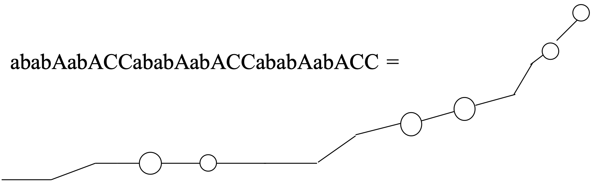

#### von Kock Snowflake Curve

We define the following grammar:

```bnf
Symbols: {F, +, -}
Start symbol: {F}
Rules: F -> F+F--F+F
Semantics:
- F = forward 1
- + = rotate left 60
- - = rotate right 60
```

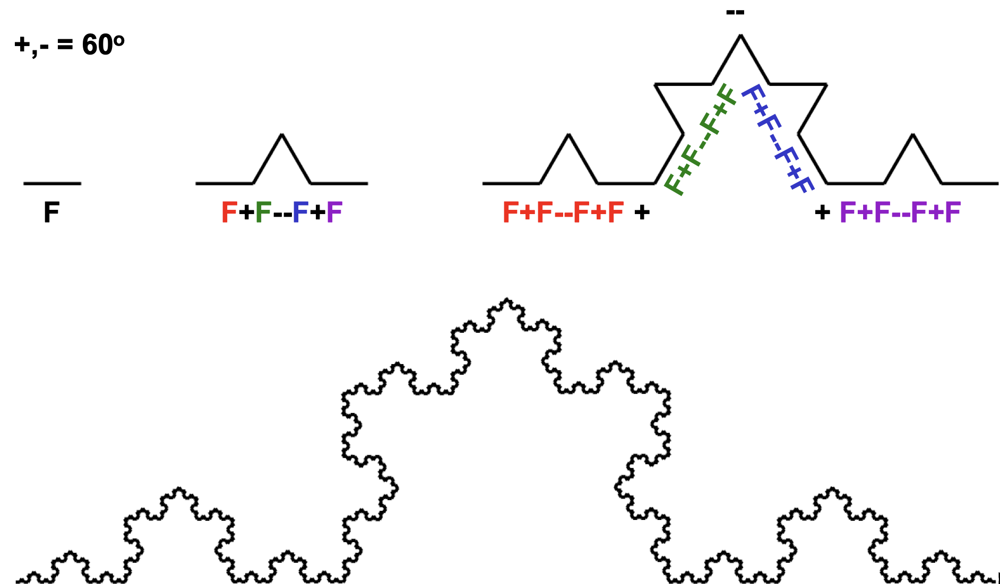

#### Branching Structures

We assume that `[` pushes the state onto the stack and `]` pops the state from the stack. We use `[` to start a branch and `]` when finished to return to its base.

With those additional symbols, we can define three rules for different types of branching:

- _Monopodial:_ The trunk extends undeviated to the top and branches extend perpendicularly: `T -> T[+B][-B]T`
- _Sympodial:_ The trunk deviates to the top and branches extend perpedicularly: `T -> T[--B]+T`
- _Binary:_ Trunk terminates at the first branching point and branches deviate uniformly: `T -> T[+B][-B]`

_Example:_ The following figure shows an example of the L-System `F -> F[+F]F[-F]F`:

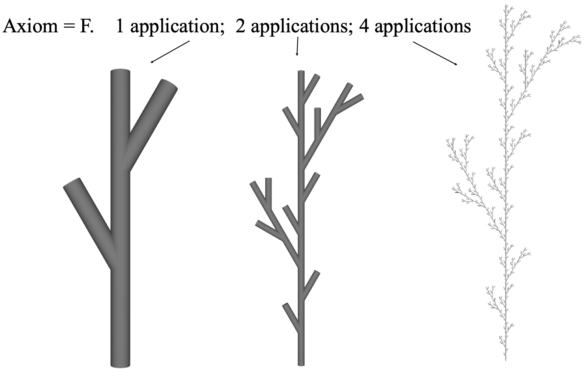

#### Stochastic L-System

In **stochastic L-systems** we have conditional firing of rules:

```bnf
F -> <something> : probability1
F -> <something> : probability2
...
```

_Example:_ We can generate random bushes with the following three rules:

```bnf
F -> F[+F]F[-F]F : 0.33
F -> F[+F]F : 0.33
F -> F[-F]F : 0.34
```

Multiple applications of the above rules will lead to a geometry similar to the figure below:

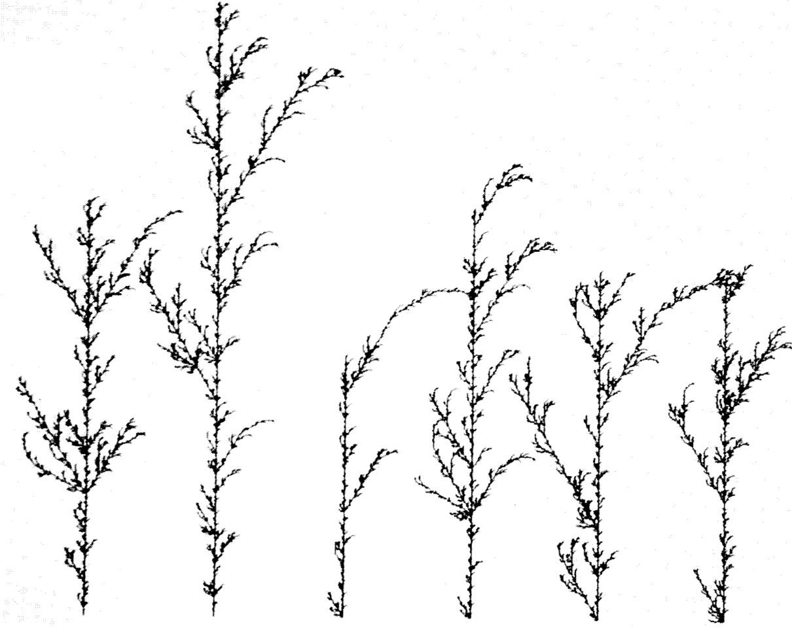

### 4.2.4 Point Cloud (Explicit)

**Point clouds** are the simplest representation for geometries, they are simply a list of points:

- Easily represent any kind of geometry
- Useful for large datasets (>> 1 point per pixel)
- Difficult to draw in undersampled regions
- Hard to do processing and simulation

### 4.2.5 Polygonal Mesh (Explicit)

In a **polygonal mesh,** we store vertices and polygons (most often triangles or quads). They are easier to do processing, simulation, and adaptive sampling.
This is perhaps the most common representation in computer graphics.

A **polygon** consists of vertices $v_0, \, v_1,..., \, v_{n-1}$ and edges $\{(v_0, \, v_1), \, (v_1, \, v_2),... \}$. The line segments must for a closed loop!

A **polygonal mesh** is a set $M = \langle V, \, E, \, F \rangle$, consisting of a set of vertices $V$, a set of edge $E$, and a set of faces $F$. It has the following properties:

- Every edge belongs to at least one polygon
- The intersection of two polygons in $M$ is either empty, a vertex, or an edge

Let's introduce some useful definitions:

- _Vertex degree (Valence):_ Number of edges incident to a vertex.
- _Boundary:_ The set of all edges that belong to only one polygon

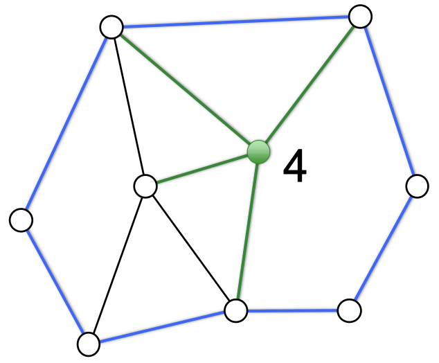

#### Mesh Data Structures

With **mesh datastructures** we can store the geometry and topology of some object:

- _Geometry:_ The vertex locations
- _Topology:_ How vertices are connected (i.e. the edges and faces)

The simplest storage option for mesh datastructures is to simply store them in a **indexed face set:**

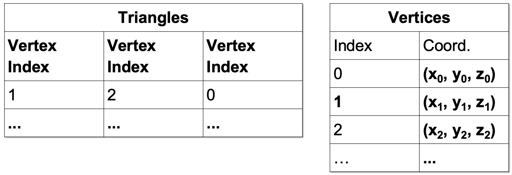

### 4.2.6 Surface Normals

We can describe the power of a (light) beam in terms of it's **irradiance,** i.e. the enery per time, per area, or:

$$
E = \frac{\Phi}{A},
$$

where $\Phi$ is the flux of the beam of light and $A$ is the surface area to which the beam is incident.

If the beam is incident to an angled surface, it will cover more area, and therefore the irradiance must be smaller! **Lambert's Law** states that the irradiance at some surface is proportional to the cosine of the angle between the light direction and the surface normal, or:

$$
E = \frac{\Phi}{A'} = \frac{\Phi \cos \theta}{A}
$$

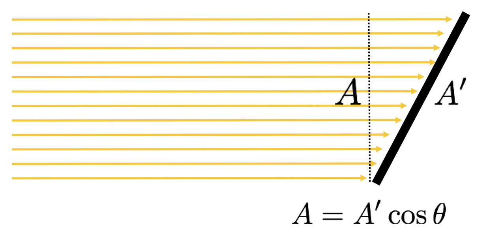

#### N-dot-L Lightning

**N-dot-L lightning** is one of the most basic ways to shade a suface: One simply takes the dot product of a unit surface normal (_N_) and the unit direction to the light source (_L_).

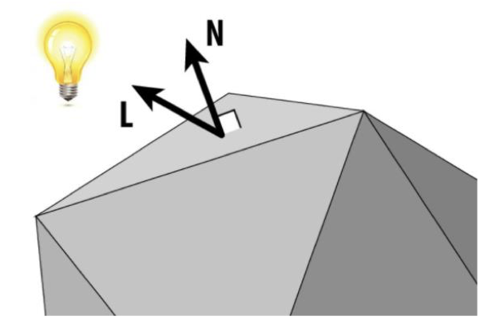

## 4.3 Texture Mapping

### 4.3.1 Texture Coordinates

**Texture coordinates** define a mapping from surface coordinates (points on a triangle) to points in the texture domain.

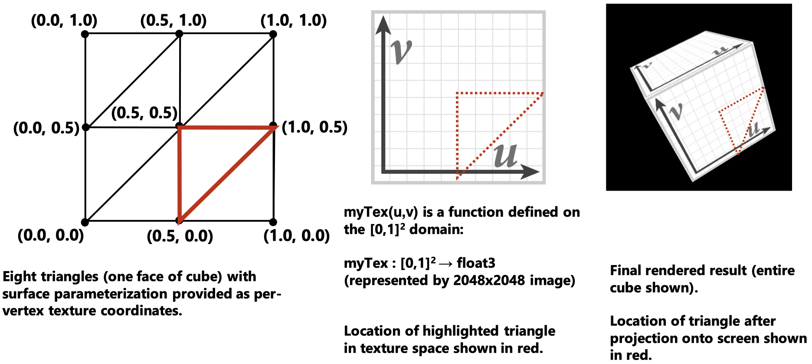

### 4.3.2 Texture Space Samples

To do a texture mapping, we need some space samples. WE can sample some some positions in the $XY$ screen space and then use the same sample positions in the texture sapce.
However, this can lead to **perspective-incorrect interpolation:**

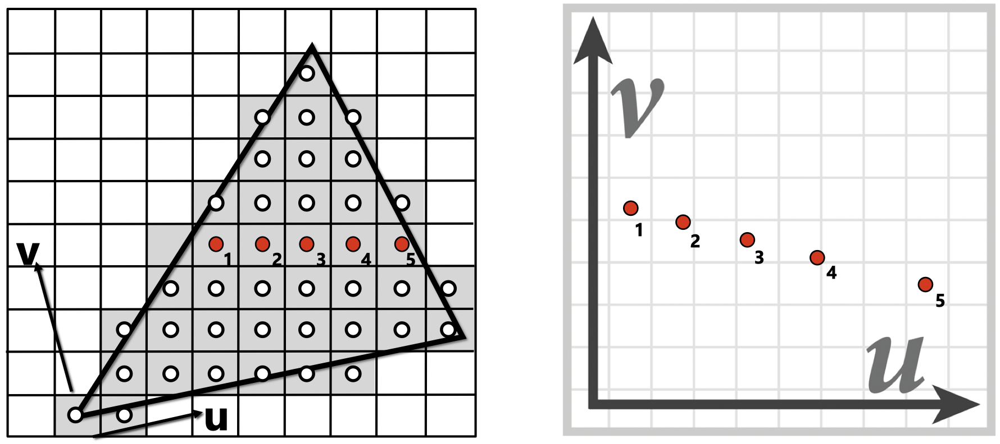

This is due to perspective projection. Barycentric interpolation of values in $XY$ screen coordinates do not correspond to values that vary linearly on the original triangle!

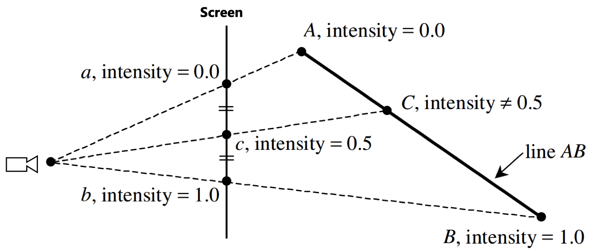

### 4.3.3 Filtering Textures

Due to resizing, our rendering pixels from our image may be much larger or smaller than the pixels available of our texture. This leads to minification and magnification:

- _Minification:_ The area of screen pixel maps to a large region of texture (filtering required). One texel corresponds to far lesse than a pixel on the screen.
- _Magnification:_ The area of screen pixel maps to a tiny region of texture (interpolation required). One texel maps to many screen pixels.

#### Mipmap (L. Williams 83)

The idea of the **Mipmap** is to prefilter the texture data to remove high frequencies. Texels at higher levels store the itnegral of the texture function over a region of texture space (downsampled images), i.e. they represent low-pass filtered versions of the original texture signal.

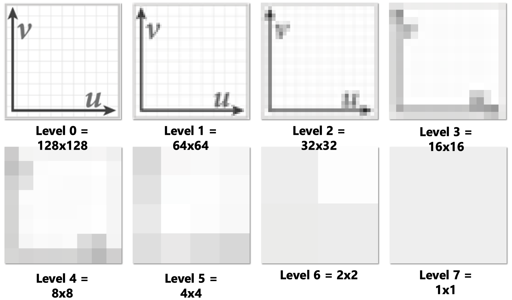

To decide which level $d$ to use, we calculate the differences between texture coordinate values of neighboring screen samples:

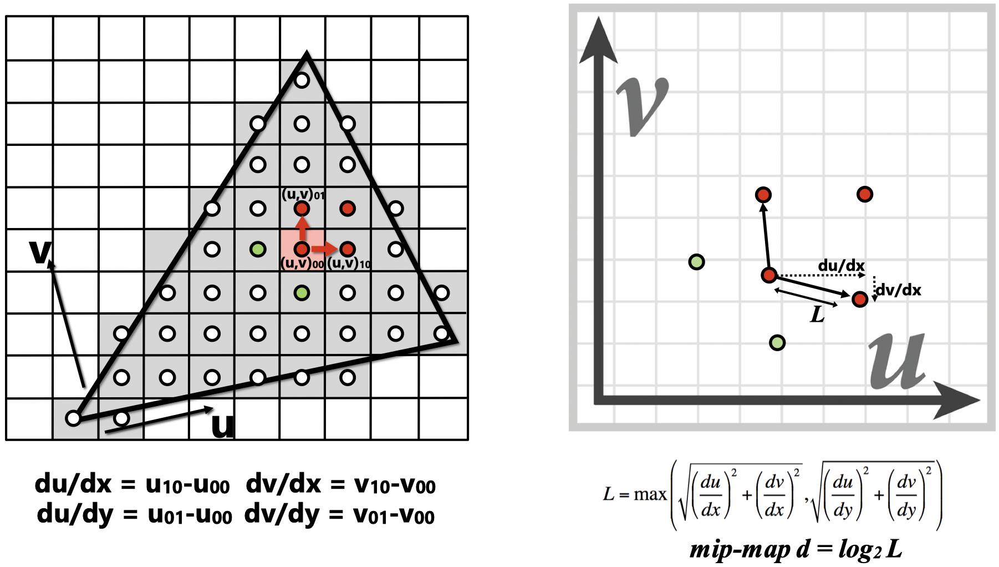

# 5. The Rasterization Pipeline

## 5.1 Occlusion

### 5.1.1 Introduction

**Occlusion** tries to answer a important question we have already seen: Given some number of overlapping triangles, which triangle is visible at each pixel?

We will explore some technqiues to solve this problem in the following sub-chapters.

### 5.1.2 The Depth Buffer (Z-Buffer)

We can determine the occlusion by using a **Z-buffer.** For each voerage sample point, the depth-buffer stores the depth of the closest triangle at this sample point that has been processed by the render so far. We use a grayscale value for each sample point to indicate the distance:

- Black = indicates a small distance
- White = indicates a large distance

_Example: Rendering three opaque triangles_

1. We start by processing a yellow triangle with depth 0.5:

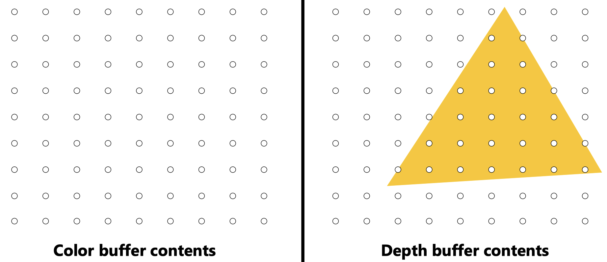

2. After processing the first triangle, we end up with a color buffer and depth buffer as shown below:

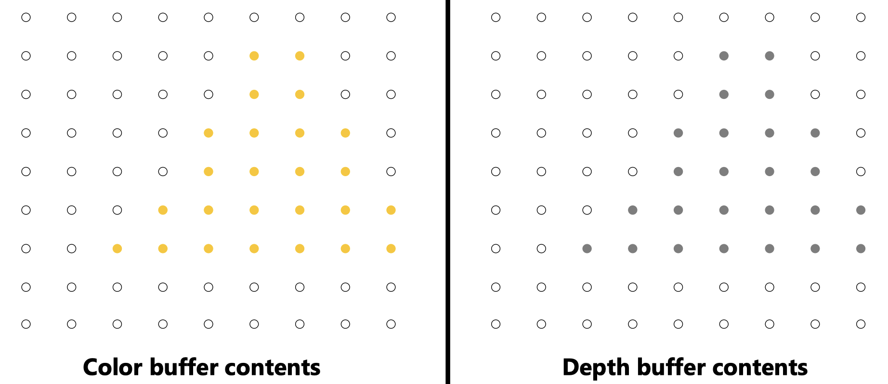

3. Next we process a blue triangle with depth 0.75. We end up with buffers like this:


4. Finally, we process a red triangle with depth 0.25. Our final color and depth buffer looks like this:

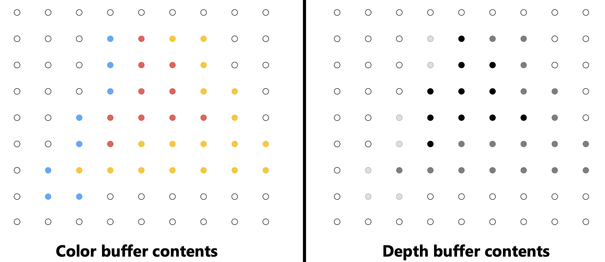

5. The final picture is:


The occlusion algorithm using the depth buffer is simple and given by:

```c
bool pass_depth_test(d1, d2) {
    return d1 < d2;
}

depth_test(tri_d, tri_color, x, y) {
    if(pass_depth_test(tri_d, zbuffer[x][y])) {
        zbuffer[x][y] = tri_d;
        color[x][y] = tri_color;
    }
}
```

## 5.2 Compositing

### 5.2.1 Alpha / RGBA

We can represent _opacity_ as alpha. **Alpha** describes the opacityof an object:

- Fully opaque: $\alpha = 1$
- 50% transaprent: $\alpha = 0.5$
- Fully transparent: $\alpha = 0$

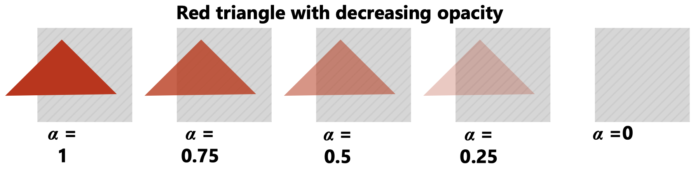

### 5.2.2 The Over Operator

The **over operator** defines what happens if we composite image `B` with opacity $\alpha_B$ over an image `A` with opacity $\alpha_A$.
We have the images `A` and `B` as:

$$
A = [A_r \quad A_g \quad A_b \quad \alpha_A]^T \\
B = [B_r \quad B_g \quad B_b \quad \alpha_B]^T
$$

The _composited color_ is then given by:

$$
C = \alpha_BB + (1 - \alpha_B)\alpha_AA
$$

Furthermore, the opacity of the "image of overlap" is given by:

$$
\alpha_C = \alpha_B + (1 - \alpha_B)\alpha_A
$$

We might do some optimization and use _premultiplied alpha._ The result is equivalent to above:

$$
A' = [\alpha_AA_r \quad \alpha_AA_g \quad \alpha_AA_b \quad \alpha_A]^T \\
B' = [\alpha_BB_r \quad \alpha_BB_g \quad \alpha_AA_b \quad \alpha_B]^T \\
C' = B' + (1 - \alpha_B)A'
$$

The color buffer algorithm with semi-transparent surfaces is given by:

```c
over(c1, c2) {
    return c1 + (1 - c1.a) * c2;
}

update_color_buffer(tri_d, tri_color, x, y) {
    if(pass_depth_test(tri_d, zbuffer[x][y])) {
        color[x][y] = over(tri_color, color[x][y]);
    }
}
```

_Remark:_ Triangles must be rendered in back to front order!

## 5.3 End-to-end Rasterization Pipeline

### 5.3.1 The Real-time Graphics Pipeline

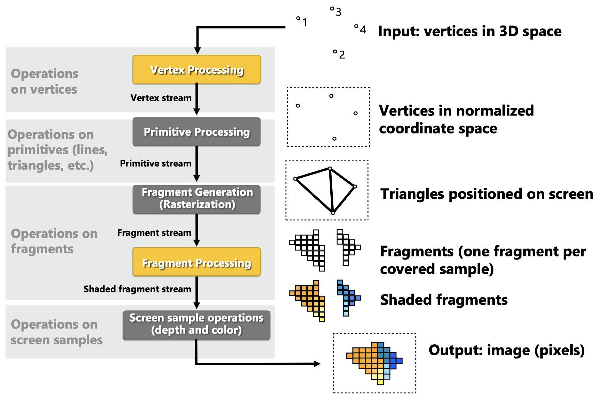

### 5.3.2 Drawing Triangles: Step-by-step

#### Inputs

We are given the following inputs:

```c
list_of_positions = {
    v0x, v0y, v0z,
    v1x, v1y, v1z,
    v2x, v2y, v2z,
    v3x, v3y, v3z,
    v4x, v4y, v4z,
    v5x, v5y, v5z,
};

list_of_textcoords = {
    v0u, v0v,
    v1u, v1v,
    v2u, v2v,
    v3u, v3v,
    v4u, v4v,
    v5u, v5v
};
```

Additionally:

- Some texture map
- Object-to-camera-space transform `T`
- Perspective projection transform `P`
- Size of the output image `(W, H)`

#### Step 1

Transform the triangle vertices into the camera space:

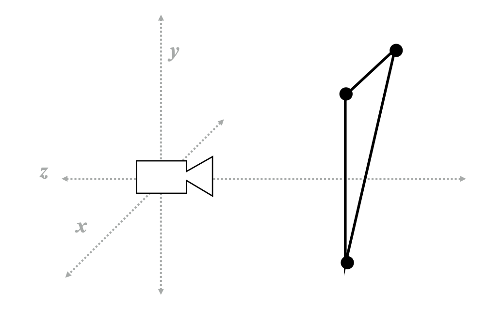

#### Step 2

Apply the perspective projection transform to transform the triangle vertices into a normalized coordinate space:

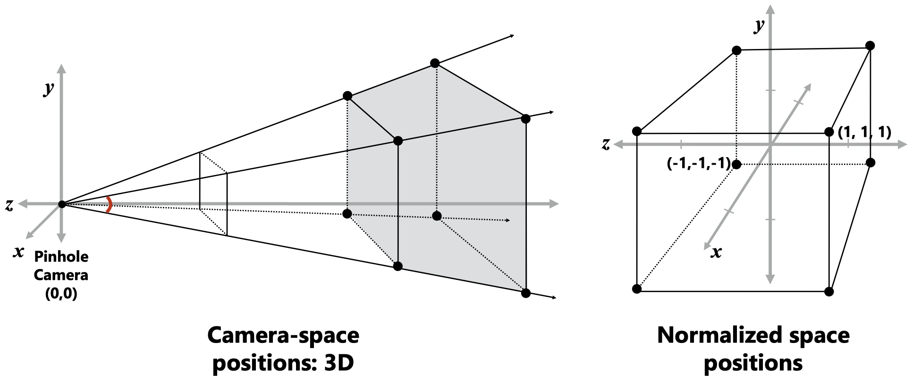

#### Step 3

Discard triangles that lie completely outside the unit cube (since they are off screen) and clip triangles that extend beyon the unit cube to the unit cube:

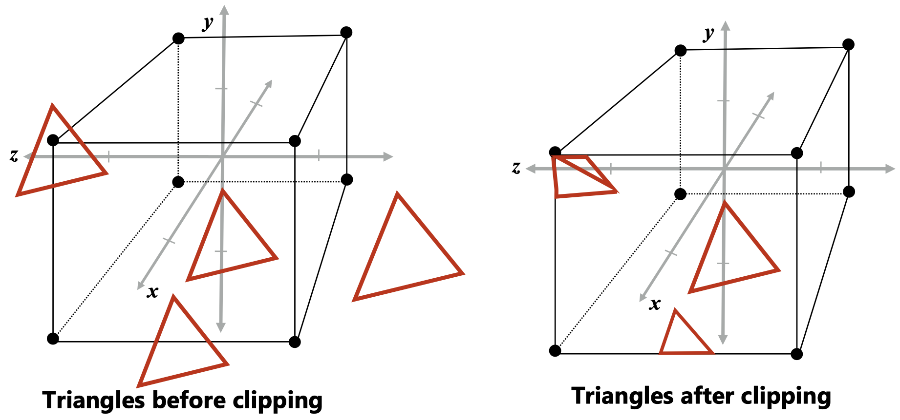

#### Step 4

Transform the vertex $xy$ positions from the normalized coordinates into the screen coordinates (based on the screen size `(w, h)`):

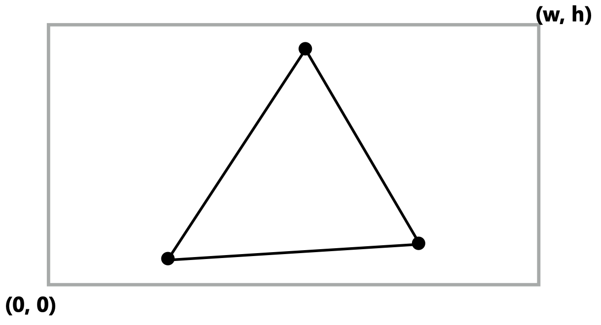

#### Step 5

Preprocess the triangles, i.e. compute the triangle edge equations and the triangle attribute equations.

#### Step 6

Do the sample coverage and evaluate attributes `Z, u, v` at all overed samples:

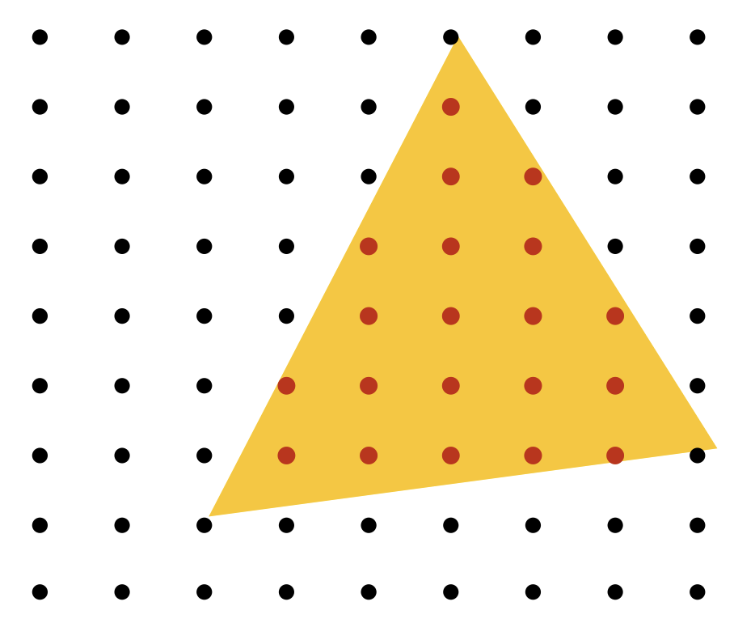

#### Step 7

Compute the triangle color at the sample point through color interpolation, sample texture map, or more advanced shading algorithms:

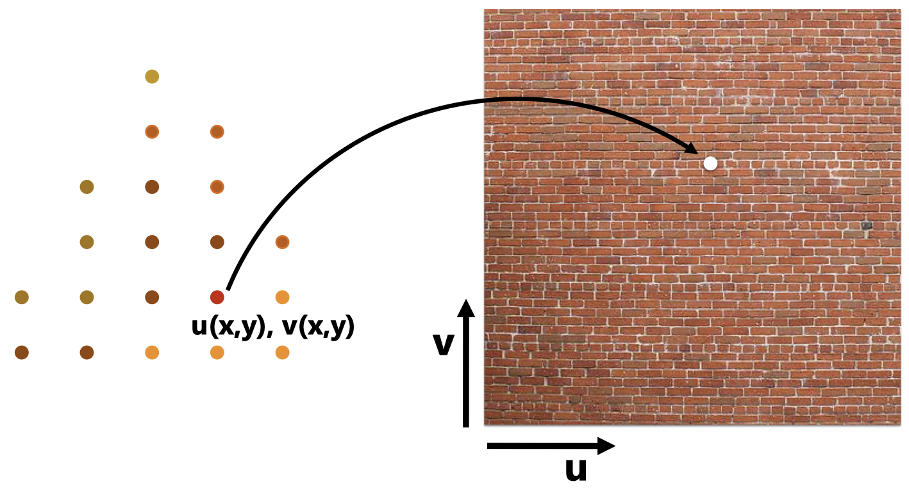

#### Step 8

Perform the depth test and update the depth value at the covered samples:

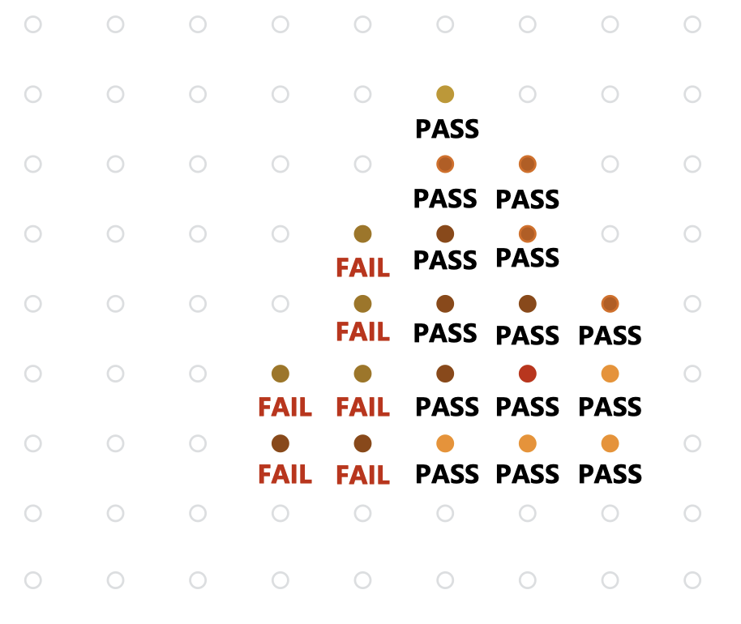

#### Step 9

Update the color buffer if the depth test passed:

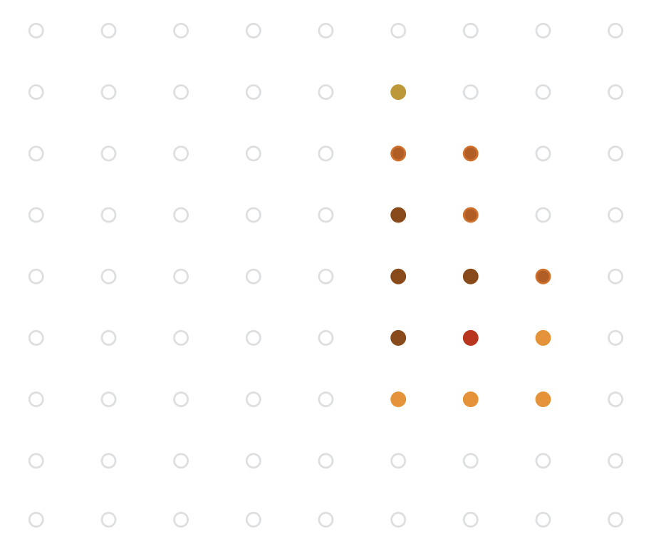

### 5.3.3 Shadow Mapping

**Shadow mapping** is a multi-pass rasterization approach:

- We render every scene (depth buffer only) from the location of the light source. Everything "seen" from this point of view is directly lit.
- We then render the scene from the location of the camera. We need to transform every screen sample to ligh coordinate frames and perform a depth test (if the test fails, the sample is in the shadow).

## 5.4 Reflections

### 5.4.1 Modelling Reflections

Reflections are modelled based on an environment mapping:

1. Place the camera at the origin of the location of the reflective object, and render 6 different views.
2. Use the real camera ray relfected about the surface normal to determine which texel in the cube map it hits.
3. This will approxiamte the appearance of the reflective surface.

### 5.4.2 GPUs

GPU's are specialized processor for executing graphics pipeline computations. They render highly complex 3D scenes:

- 100's of thousands to millions of triangles in a scene
- Complex vertex and fragment shader computations
- High resolution screen outputs (2-4 Mpixel + supersampling)
- 30-60 fps
