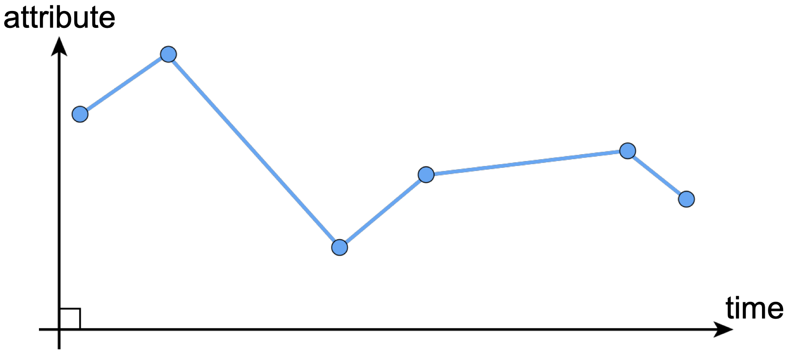
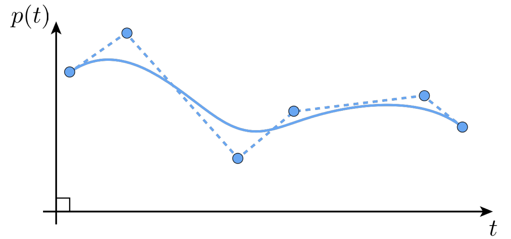
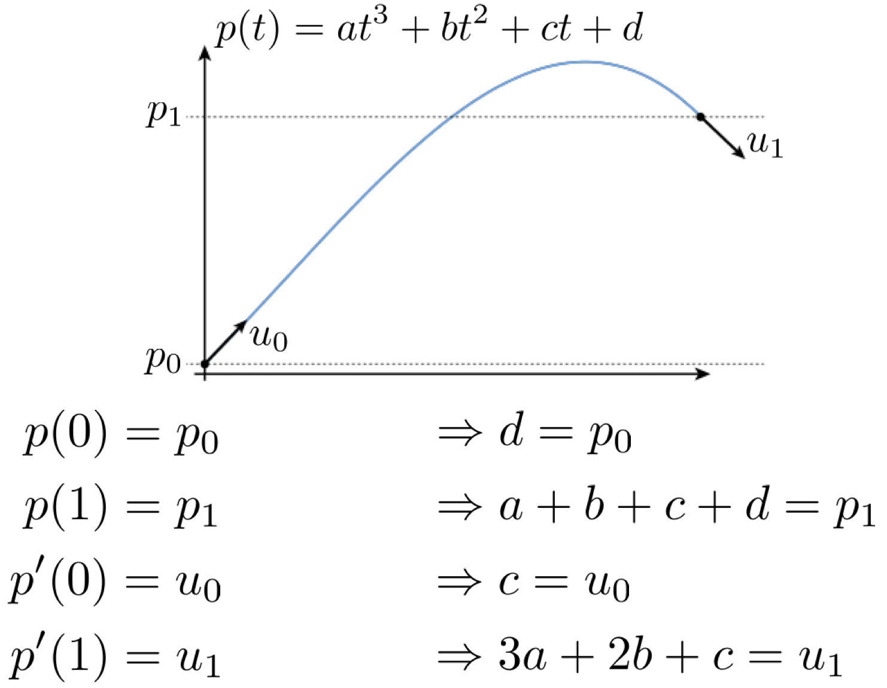
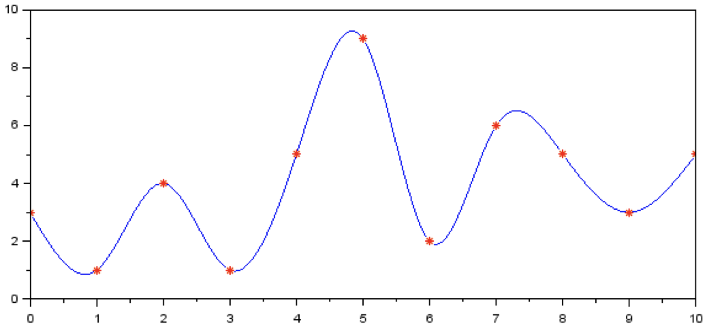

**Visual Computing - Lecture notes week 12**

- Author: Ruben Schenk
- Date: 14.12.2021
- Contact: ruben.schenk@inf.ethz.ch

# 8. Computer Animation

## 8.1 Describing Motion

### 8.1.1 Introduction

How we describe motion on a computer is probably the most important question to answer when talking about motion in general. From a computer graphics perspective, there are three main techniques to that:

- Artist directed, such as keyframing
- Data-driven, such as motion capturing
- Procedural, such as simulations

### 8.1.2 Keyframing

**Keyframing** is an important yet quite "simple" idea of describing motion. The basic idea is to specify important events in our motion only, and let the computer to fill in the rest via interpolation or approximation.

## 8.2 Spline Interpolation

### 8.2.1 Interpolation

The basic idea behin **interpolation** data is to connect the dots, i.e. the given sample points. One such technique is _piecewise linear interpoaltion:_

It might be simple, but it yields a rather rough motion.

Another common interpolation technique is _piecewise polynomial interpolation:_

### 8.2.2 Splines

In general, a **spline** is any piecewise polynomial function. In 1D, splines interpolate data over the real line:

$$
(t_i, \, f_i), \quad i = 0,...,n
$$

"_Interpolates_" in that case just means that the function exactly passes through those values, i.e.:

$$
f(t_i) = f_i \quad \forall i
$$

The only other condition is that the function is a _polynomial_ when restriczed to any interval between the knots:

$$
\text{for } t_i \leq t \leq t_{i+1}, \, f(t) = \sum_{j = 1}^d c_it^j =: p_i(t)
$$

The splines most commonly used for interpolation are _cubic,_ i.e. $d = 3.$

### 8.2.3 Fitting Cubic Polynomials To Endpoints

If we want to connect two end points with a cubic polynomial, there are many different solutions! Cubic polynomials have four _degrees of freedom,_ namely the four coefficients $(a, \, b, \, c, \, d)$ that we can manipulate and control.

However, we only need two degrees of freedom to specify the endpoints!

$$
p(t) = at^3 + bt^2 + ct + d \\
p(0) = p_0 \Rightarrow d = p_0
p(1) = p_1 \Rightarrow a + b + c + d = p_1
$$

This leaves us with four unknowns but only two equations, which is obviously not enough to determine the curve.

However, what if we also want to match the _derivatives_ at the endpoints?

Then we end up with 4 equations and 4 unknowns, which lets us uniquely identify the cubic polynomial we are looking for.

### 8.2.4 Natural Splines

**Natural splines** are piecewise splines made out f cubic polynomials $p_i$.

We want three conditions to hold for our natural splines:

1. Interpolation at both endpoints:

$$
p_i(t_i) = f_i, \, p_i(t_{i + 1}) = f_{i + 1}, \quad i = 0,...,n-1
$$

2. Tangents agree at the endpoints, i.e. $C^1$ continuity:

$$
p'_i(t_{i + 1}) = p'_{i + 1}(t_{i + 1}), \quad i = 0,...,n-2
$$

3. Curvatures agree at the endpoints, i.e. $C^2$ continuity:

$$
p''_i(t_{i+1}) P p''_{i+1}(t_{i+1}), \quad i = 0,...,n-2
$$
