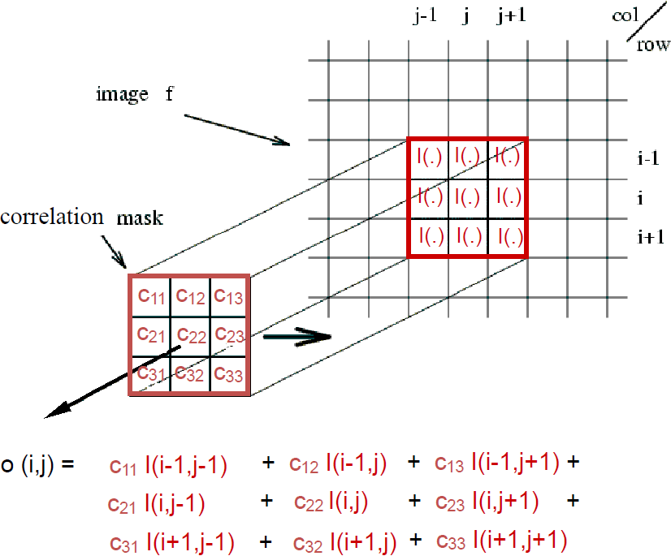
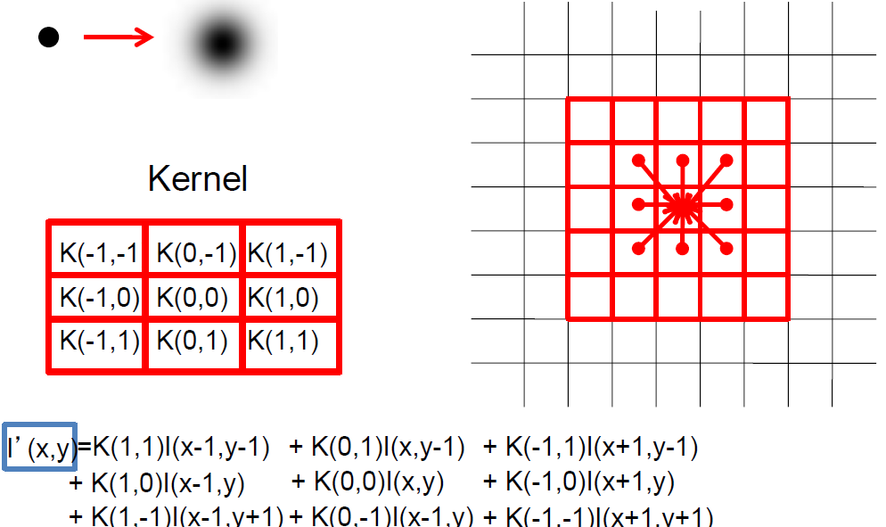
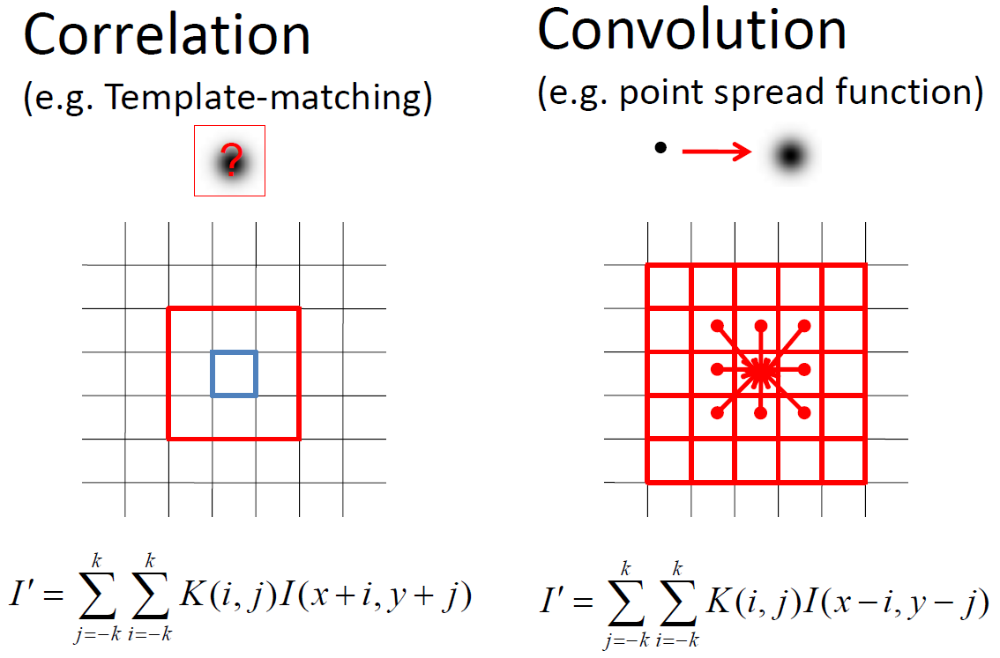
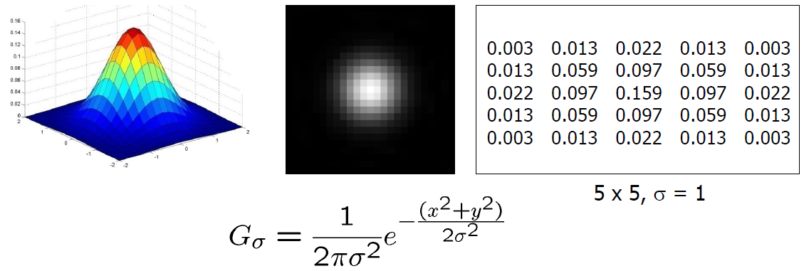
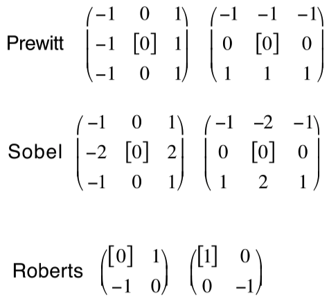
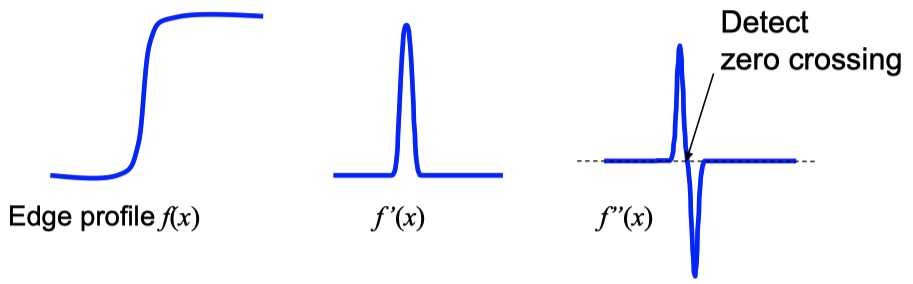
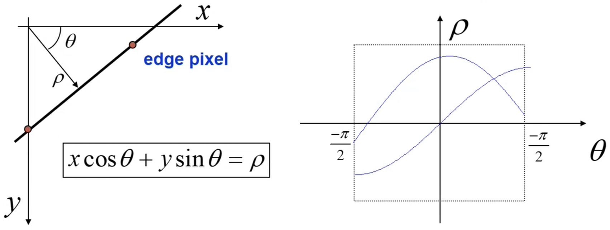

**Visual Computing - Lecture notes week 3**

- Author: Ruben Schenk
- Date: 19.10.2021
- Contact: ruben.schenk@inf.ethz.ch

# 3. Convolution and Filtering

## 3.1 Linear Shift-Invariant Filtering

**Linear shift-invariant filtering** is about modifying pixels base don its _neighborhood_. Linear means that it should be a _linear combination_ of neighbors. Shift-invariant means that we do the _same thing for each pixel_. This approach is useful for:

- Low-level image processing operations
- Smoothing and noise reduction
- Sharpening
- Detecting or enhancing features

### 3.1.1 Linear Filtering

$L$ is a **linear** operation if:

$$
L[\alpha I_1 + \beta I_2] = \alpha L [I_1] + \beta L [I_2]
$$

Linear operations can be written as:

$$
I'(x, \, y) = \sum_{(i, \, j) \in \mathcal{N}(x, \, y)} K(x, \, y; \, i, \, j)I(i, \, j)
$$

Where $I$ is the input image, $I'$ is the output of the operation, and $K$ is the **kernel** of the operation. $\mathcal{N}(m, \, n)$ denotes the _neighborhood_ of $(m, \, n)$.

> Operations are **shift-invariant** if $K$ does _not_ depend on $(x, \, y)$, i.e. we when using the same weights everywhere!

## 3.2 Correlation

In this approach, we take a **correlation mask** and apply it to an image.

> Correlation is as if we had a template (the mask), and search for it in our image.

This would look as follows:

The linear operation of correlation looks as follows:

$$
I' = K \circ I \\ I'(x, \, y) = \sum_{(i, \, j) \in \mathcal{N}(x, \, y)}K(i, \, j)I(x+i, \, y + j)
$$

This represents the linear weights as an image.

## 3.3 Convolution

> Compared to correlation, where we looked at the neighborhood of a pixel and applied what we learned from the neighborhood to the single pixel, in convolution we look at a single pixel and apply what we can learn from it to its neighborhood.

The linear operation of convolution is given by:

$$
I' = K * I \\ I' (x, \, y) = \sum_{(i, \, j) \in \mathcal{N}(x, \, y)}K(i, \, j)I(x-i, \, y-j)
$$

This too represents the linear weights as an image, it is actually the same as correlation, but with a reversed kernel.

### 3.3.1 Correlation vs Convolution

## 3.4 Separable Kernels

**Separable filters** can be written as $K(m, \, n) = f(m)g(n)$. For a rectangular neighborhood with size $(2M + 1) \times (2N + 1)$, $I'(m, \, n) = f * (g * I(\mathcal{N}(m, \, n)))$. We can rewrite this to:

$$
I''(m, \, n) = \sum_{j = -N}^N g(j)I(m, \, n-j) \\ I'(m, \, n) = \sum_{i = -M}^Mf(i)I''(m-i, \, n)
$$

## 3.5 Gaussian Kernel

The idea of the **Gaussian kernel** is that we weight the contributions of neighboring pixels by their nearness:

### 3.5.1 Gaussian Smoothing Kernels

The amount of smoothing when using Gaussian kernels depends on $\sigma$ and on the window size.

The top 5 reasons to use Gaussian smoothing are:

1. Rotationally symmetric
2. Has a single lobe (neighbor's influence decreases monotonically)
3. Still one lobe in frequency domain (no corruption from high frequencies)
4. Simple relationship to $\sigma$
5. Easy to implement efficiently

## 3.6 Filter Examples

**Differential filters**

- _Prewitt operator:_

$$
\begin{bmatrix}
    -1 & 0 & 1 \\
    -1 & 0 & 1 \\
    -1 & 0 & 1
\end{bmatrix}
$$

- _Sobel operator:_

$$
\begin{bmatrix}
    -1 & 0 & 1 \\
    -2 & 0 & 2 \\
    -1 & 0 & 1
\end{bmatrix}
$$

**High-pass filters**

- _Laplacian operator:_

$$
\begin{bmatrix}
    0 & 1 & 0 \\
    1 & -4 & 1 \\
    0 & 1 & 0
\end{bmatrix}
$$

- _High-pass filter:_

$$
\begin{bmatrix}
    -1 & -1 & -1 \\
    -1 & 8 & -1 \\
    -1 & -1 & -1
\end{bmatrix}
$$

# 4. Image Features

## 4.1 Template Matching

**Template matching** describes the problem of locating an object, described by a template $t(x, \, y)$, in the image $s(x, \, y)$. This is done by searching for the best match by minimizing mean-squared error:

$$
\begin{aligned}
    E(p, \, q) &= \sum_{x = - \infty}^{\infty} \sum_{y = - \infty}^{\infty} \lbrack s(x, \, y) - t(x-p, \, y-q) \rbrack^2 \\
    &= \sum_{x = - \infty}^{\infty} \sum_{y = - \infty}^{\infty} |s(x, \, y)|^2 + \sum_{x = - \infty}^{\infty} \sum_{y = - \infty}^{\infty} |t(x, \, y)|^2 - 2 \cdot \sum_{x = - \infty}^{\infty} \sum_{y = - \infty}^{\infty} s(x, \, y) \cdot t(x-p, \, y-q)
\end{aligned}
$$

Equivalently, we can _maximize_ the **area correlation**:

$$
r(p, \, q) = \sum_{x = - \infty}^{\infty} \sum_{y = - \infty}^{\infty} s(x, \, y) \cdot t(x-p, \, y-q) = s(p, \, q) * t(-p, \, -q)
$$

The area correlation is equivalent to the convolution of image $s(x, \, y)$ with impulse response $t(-x, \, -y)$.

## 4.2 Edge Detection

One idea, in a continuous-space, is to detect the local gradient:

$$
|\text{grad}(f(x, \, y))| = \sqrt{\lparen \frac{\partial f}{\partial x} \rparen^2 + \lparen \frac{\partial f}{\partial y} \rparen^2}
$$

We mostly use the following **edge detection filters**:

### 4.2.1 Laplacian Operator

The idea of a **Laplacian operator** is to detect discontinuities by considering the second derivative and searching for _zero-crossings_ (those mark edge locations):

$$
\nabla^2 f(x, \, y) = \frac{\partial^2 fx, \, y()}{\partial x^2} + \frac{\partial^2 f(x, \, y)}{\partial y^2}
$$

We can do a _discrete-space approximation_ by convolution with a $3 \times 3$ impulse response:

$$
\begin{bmatrix}
    0 & 1 & 0 \\
    1 & -4 & 1 \\
    0 & 1 & 0
\end{bmatrix} \quad \text{or} \quad \begin{bmatrix}
    1 & 1 & 1 \\
    1 & -8 & 1 \\
    1 & 1 & 1
\end{bmatrix}
$$

However, the Laplacian operator is sensitive to very fine detail and noise, so we might want to blur the image first.

#### Laplacian of Gaussian

Blurring the image with Gaussian and Laplacian operator can be combined into convolution with **Laplacian of Gaussian operator** (LoG):

$$
\text{LoG}(x, \, y) = - \frac{1}{\pi \sigma^4} \lbrack 1 - \frac{x^2 + y^2}{2 \sigma^2} \rbrack exp \lparen - \frac{x^2 + y^2}{2 \sigma^2} \rparen
$$

### 4.2.2 Canny Edge Detector

The **Canny edge detector** works with the following steps:

1. Smooth the image with a Gaussian filter
2. Compute the gradient magnitude and angle (Sobel, Prewitt, etc.):

$$
M(x, \, y) = \sqrt{\lparen \frac{\partial f}{\partial x} \rparen^2 + \lparen \frac{\partial f}{\partial y} \rparen^2} \quad \text{and} \quad \alpha(x, \, y) = \tan^{-1} \lparen \frac{\partial f}{\partial y} \big / \frac{\partial f}{\partial x} \rparen
$$

3. Apply nonmaxima suppression to gradient magnitude image
4. Double thresholding to detect strong and weak edge pixels
5. Reject weak edge pixels not connected with strong edge pixels

#### Canny nonmaxima suppression

The **Canny nonmaxima suppression** works as follows:

1. Quantize the edge normal to one of the four directions: horizontal, -45deg, vertical, +45deg
2. If $M(x, \, y)$ is smaller than either of its neighbors in edge normal direction, then suppress is, else keep it

#### Canny Thresholding

When using a Canny edge detector, we do double thresholding of the gradient magnitude:

- Strong edge: $M(x, \, y) \geq \Theta_{high}$
- Weak edge: $\Theta_{high} > M(x, \, y) \geq \Theta_{low}$

A typical setting for the thresholds would be $\frac{\Theta_{high}}{\Theta_{low}} \in \lbrack 2, \, 3 \rbrack$.

### 4.2.3 Hough Transform

The **Hough transform** solves the problem of fitting a straight line (or curve) to a set of edge pixels. The Hough transform is a _generalized template matching technique_.

It works the following way:

1. For an edge pixel in the $(x, \, y)$ plane we can draw the different lines that cross the edge pixel (all lines have the form $y = mx + c$). We can draw the $m$ and $c$ values in a $(m, \, c)$ plane and see that all those lines are linearly dependent:

2. If we have multiple edge pixels, we can do the same procedure for each of those, giving us a line in the $(m, \, c)$ plane for each edge pixel.
3. We then subdivide the $(m, \, c)$ plane into discrete "bins" and initialize the bin count of each bin to $0$. Each time a bin is crossed by one of the lines of the different edge pixels, we increase its count by one.
4. We then simply have to detect the peaks in the $(m, \, c)$ plane to get our fitted straight line:

We might encounter an infinite-slope problem, which can be avoided with an alternative parameterization:

## 4.3 Detecting Corner Points

Many applications benefit from features localized in $(x, \, y)$. If edges are well localized but only in one direction, we might want to **detect corners**.

The desirable properties of a corner detector are:

- accurate localization
- invariance against shift, rotation, scale, and brightness change
- robust against noise, high repeatability

*something something what patterns can be localized most accurately?*

### 4.3.1 Feature Point Extraction

We have that $SSD \simeq \delta^T M \delta$. Now if we shift our patterns over the picture, we assume it to change the following way:

Now we want to find points for which the following is large:

$$
\min \delta^T M \delta \text{ for } ||\delta || = 1
$$

i.e. we want to maximize the eigenvalues of $M$.

#### Keypoint Detection

*something something*

