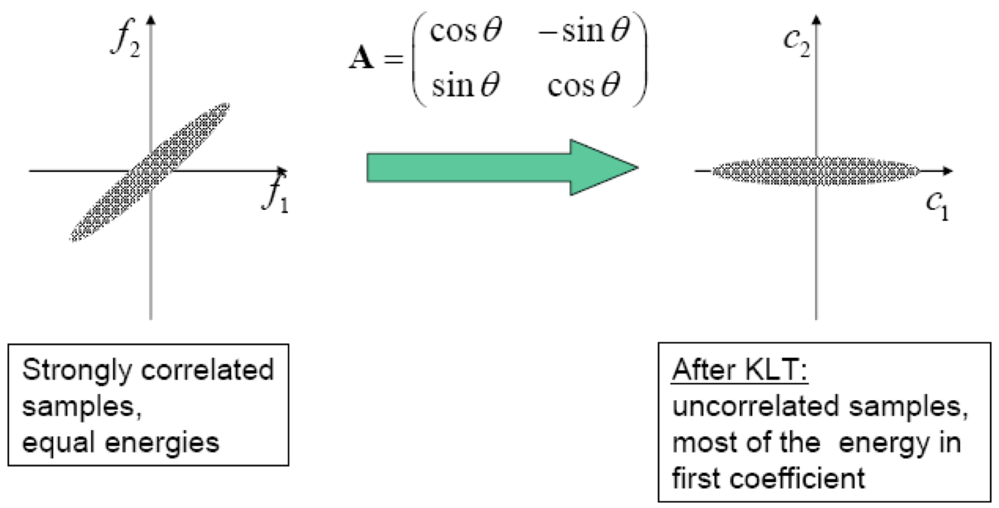
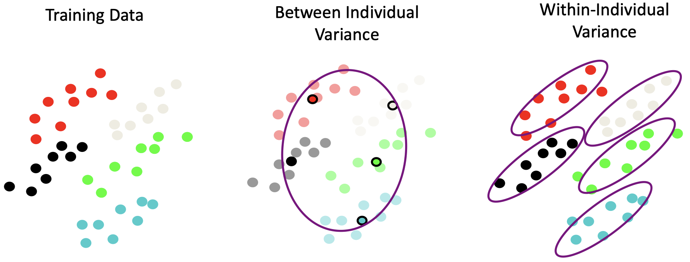
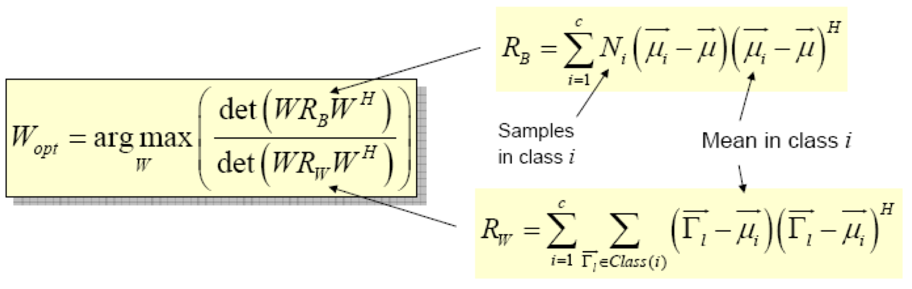
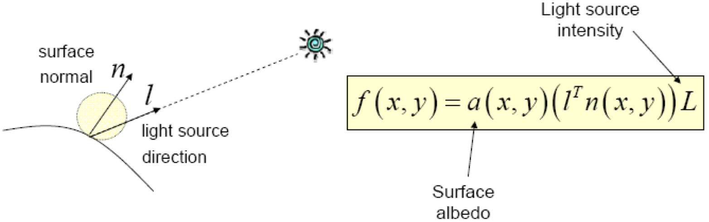
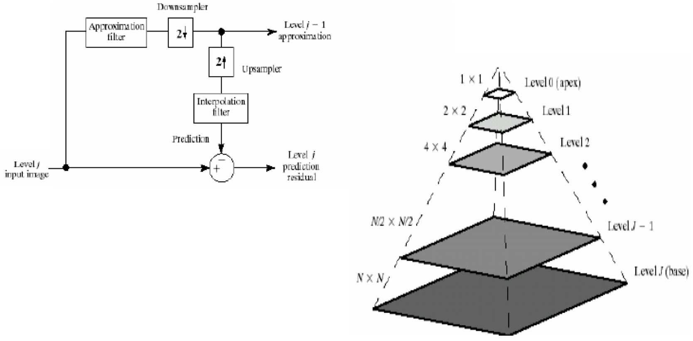
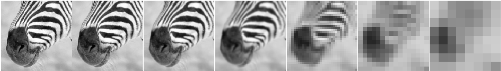
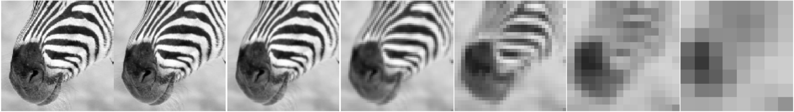
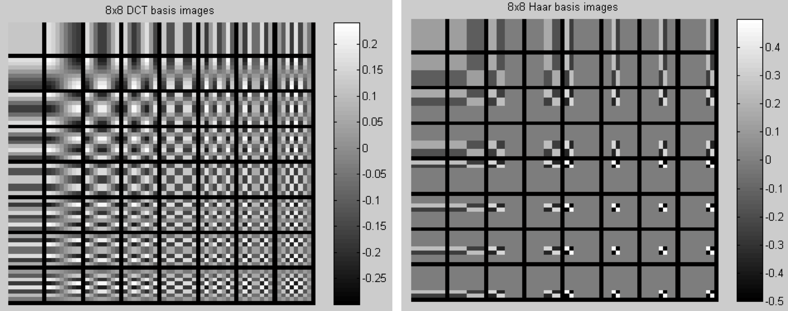
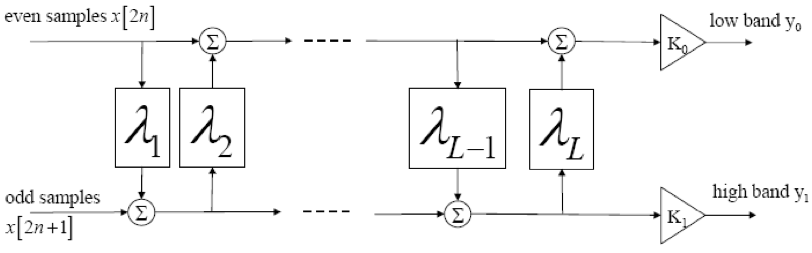
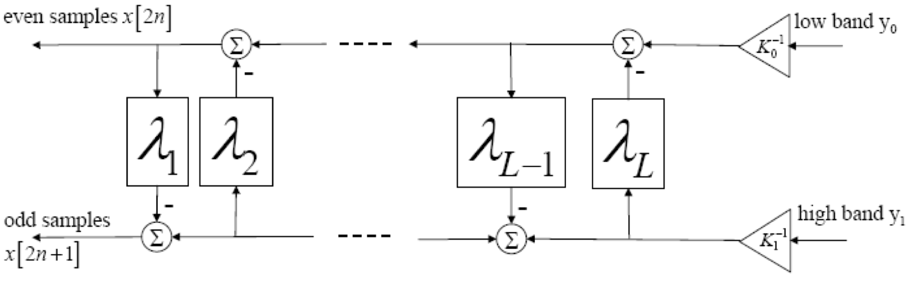

**Visual Computing - Lecture notes week 5**

- Author: Ruben Schenk
- Date: 02.11.2021
- Contact: ruben.schenk@inf.ethz.ch

# 6. Unitary Transform

## 6.1 Introduction

A digital image can be written as a **matrix**:

$$
f = \begin{bmatrix}
    f(0, \, 0) && f(1, \, 0) && \cdots && f(N-1, \, 0) \\
    f(0, \, 1) && f(1, \, 1) && \cdots && f(N-1, \, 1) \\
    \vdots && \vdots && && \vdots \\
    f(0, \, L-1) && f(1, \, L-1) && \cdots && f(N-1, \, L-1)
\end{bmatrix}
$$

The pixels $f(x, \, y)$ are sorted into the matrix in natural order. This results in $f(x, \, y) = f_{xy}$, where $f_{xy}$ denotes an individualy element in common matrix notation.\Vec{f} =

We might also write an image as a single **vector** of length $L \cdot N$. This makes the math easier:

$$
\vec{f} = \begin{bmatrix}
    f(0, \, 0) \\ f(1, \, 0) \\ \vdots \\ f(N-1, \, 0) \\ f(0, \, 1) \\ \vdots \\ f(N-1, \, 1) \\ \vdots \\ f(N-1, \, L-1)
\end{bmatrix}
$$

## 6.2 Linear Image Processing

Any linear image processing algorithm can be written as:

$$\vec{g} = H \vec{f}$$

We define a **linear operator** $O[.]$ as:

$$O[\alpha_1 \cdot \vec{f}_1 + \alpha_2 \cdot \vec{f}_2] = \alpha_1 \cdot O[\vec{f}_1] + \alpha_2 \cdot O[\vec{f}_2]$$

for all scalars $\alpha_1, \, \alpha_2$.

But how does one choose $H$

- so $\vec{g}$ separates the salient features from the rest of the image signal?
- so $\vec{g}$ looks better?
- in order for $\vec{g}$ to be sparse?

## 6.3 Unitary Transforms

For a **unitary transform** we might proceed as follows:

1. Sort samples $f(x, \, y)$ of a $M \times N$ image into a column vector of length $MN$
2. Compute the transform coefficients of $\vec{c} = A \vec{f}$, where $A$ is a matrix of size $MN \times MN$

The transform $A$ is said to be **unitary**, if and only if:

$$A^{-1} = A^{*T} = A^H$$

If $A$ is real valued, i.e. if $A = A^*$, then the transform is said to be **orthonormal**.

### 6.3.1 Energy Conservation

For any unitary transform $\vec{c} = A \vec{f}$, we obtain

$$||\vec{c}||^2 = \vec{c}^H\vec{c} = \vec{f}^H A^H A \vec{f} = ||\vec{f}||^2$$

This means, that every unitary transform is simply a rotation of the coordinate system (and, possibly, sign flips). The vector lengths, i.e. the "energies", are conserved!

### 6.3.2 Image Collection

We might denote **image collections** in the following way:

1. $f_i$ as one image
2. $F = [f_1 \, f_2 \, \cdots \, f_n]$ as an image collection
3. $R_{ff} = E[f_i \, . \, f_i^H] = \frac{F.F^H}{n}$ as an image collection _auto-correlation function_

### 6.3.3 Energy Distribution

With unitary transforms, energy is conserved, but often will be _unevenly distributed_ among the coefficients.

For the auto-correlation matrix, we have that:

$$R_{cc} = E[\vec{c}\vec{c}^H] = E[A \vec{f} \cdot \vec{f}^H A^H] = A R_{ff}A^H$$

This leads to the mean squarede values (i.e. the "average energies") of the coefficients $c_i$ being on the diagonal of $R_{cc}$$:

$$E[c_i^2] = [R_{cc}]_{i,i} = [AR_{ff}A^H]_{i,i}$$

### 6.3.4 Eigenmatrix of Auto-Correlation Matrix

The **eigenmatrix** $\Theta$ of an auto-correlation matrix $R_{ff}$ fulfills the following rules:

- $\Theta$ is unitary
- The columns of $\Theta$ form a set of eigenvectors of $R_{ff}$, i.e. $R_{ff} \Theta = \Theta \Lambda$, where $\Lambda$ is a diagonal matrix of eigenvalues $\lambda_i$.
- $R_{ff}$ is symmetric non-negative definite, hence $\lambda_i \geq 0$ for all $i$
- $R_{ff}$ is a normal matrix, i.e. $R_{ff}^HR_{ff} = R_{ff}R_{ff}^H$, hence the unitary eigenmatrix exists

### 6.3.5 Karhunen-Loeve Transform (aka PCA)

The **Karhunen-Loeve transform** (_KL-transform_) describes the unitary transform with the matrix $A = \Theta^H$, where the columns of $\Theta$ are ordered according to decreasing eigenvalues.

- The transform coefficients are pairwise uncorrelated
- No other unitary transform packs as much energy into the first $J$ coefficients, where $J$ is arbitrary
- Mean squared approximation error by choosing only the first $J$ coefficients is minimized

_Example:_

### 6.3.6 Basis Images and Eigenimages

For any unitary transform, the _inverse transform_ $\vec{f} = A^H \vec{c}$ can be interpreted in terms of the superposition of basis images (columns of $A^H$) of size $M \times N$.
If the transform is a KL transform, the basis images, which are the eigenvectors of the autocorrelation matrix $R_{ff}$, are called **eigenimages.**
If energy concentration works well, only a limited number of eigenimages is needed to approximate a set of images with a small error. These eigenimages form an optimal linear subspace of dimensionality $J$.

To recognize complex patterns, e.g. faces, large portions of an image might have to be considered. With a transform of the form $\vec{c} = W\vec{f}$ we can reduce the dimensionality from $M \times N$ to $J$ by representing the image by $J$ coefficients.

### 6.3.7 Simple Recognition

For a **simple recognition** we can use the _simple euclidean distance (SSD)_ between two images and let the best match "win":

$$\text{arg min}_i D_i = ||I_i - I||$$

However, this is computationally expensive, i.e. it requires the presented image to be correlated with every image in the database!

### 6.3.8 Eigenspace Matching

We consider the PCA (aka KLT aka closes rank-k approximation property of SVD) $\hat{I}_i \simeq Ep_i$. Then:

$$I_i - I = \hat{I}_i - \hat{I} \simeq E(p_i - p) \\ ||I_i - I|| \simeq ||p_i - p|| \\ \text{arg min}_i D_i = ||I_i - I|| \simeq ||p_i - p||$$

with $\hat{I} = I - \bar{I}$ and $p = E^T \hat{I}$. This is _much cheaper to compute!_

### 6.3.9 Fisherfaces

The key ideas of **Fisherfaces** are as follows:

- Find directions where the ratio between/within individual variances are maximized
- Linearly project to the basis where the dimensions with good signal/noise ratios are maximized

The eigenimage method maximizes _scatter_ within the linear subspace over the entire image set, regardless of the classification tasks:

$$W_{opt} = \text{arg max}_W \lparen \text{det} \lparen WRW^H \rparen \rparen$$

The idea of the **Fisher linear discrimant analysis** is to maximize between-class scatter, while minimizing within-class scatter:

#### Fisher Images and Varying Illumination

All images of the same Lambertian surface with different illumination (without shadows) lie in a 3D linear subspace. There is a single point source at infinity such that:

# 7. Image Compression

## 7.1 JPEG Image Compression

### 7.1.1 Block-Based Discrete Cosine Transform (DCT)

We essential discrete **Cosine Transform** on our image we wish to compress:

**DCT** is a variant of discrete Fourier transform with real numbers and a very fast implementation. We can choose the block size, its size will have an influence on the transform:

- Small blocks: faster computation and correlation between neighboring pixels
- Large blocks: better compression in smooth regions

### 7.1.2 Image Compression Using DCT

DCT enables _image compression_ by concentrating most image information in the low frequencies. We loose unimportant image info, i.e. high frequencies, by cutting $B(u, \, v)$ at the bottom right corner. The decoder computes the inverse DCT (iDCT).

## 7.2 Image Pyramid

The application of **scaled representations,** such as _image pyramids_, is to look at corase scaled and then refine with finer scaled. For example, a "good" edge at a finer scale has parents at some coarser scale.

### 7.2.1 Gaussian Pyramid

The different levels of the **Gaussian Pyramid** are smooth with Gaussians, since a Gaussian times a Gaussian is another Gaussian.

### 7.2.2 Laplacian Pyramid

For the synthesis of a **Laplacian Pyramid** we have that:

- It preserves the difference between unsampled Gaussian pyramid levels and Gaussian pyramid levels
- It's a band pass filter: Each level represents spatial frequencies unrepresented at other levels

## 7.3 Discrete Wavelet Transform

### 7.3.1 Haar Transform

The **Haar Transform** with the _Haar Basis_ has the following properties:

- Real and orthogonal
- Transition at each scale $p$ is localized according to $q$

_Comparison of DCT and Haar basis:_

### 7.3.2 Lifting

_Analysis filters:_

_Synthesis filters:_

