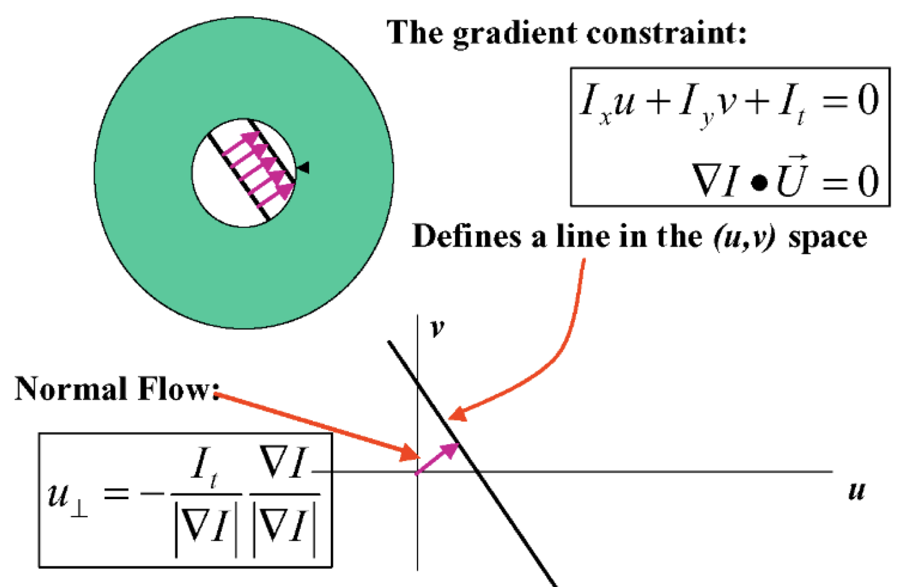
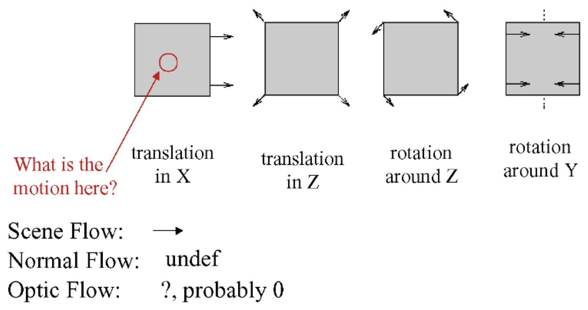
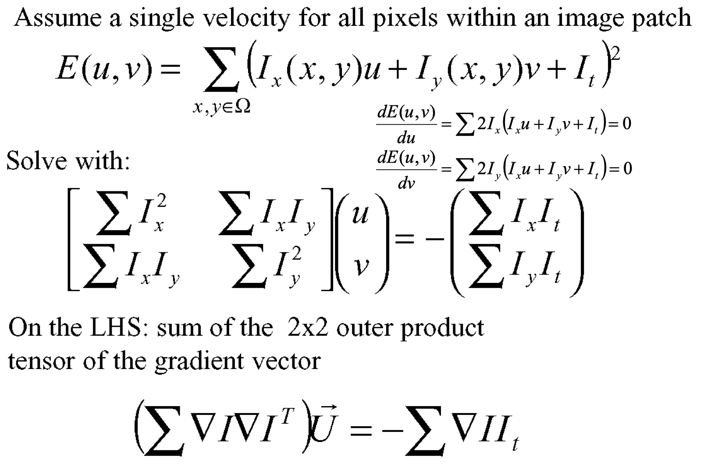
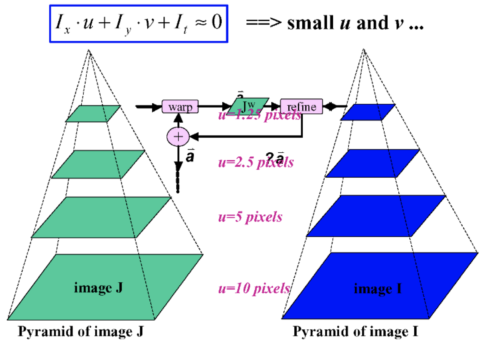

**Visual Computing - Lecture notes week 6**

- Author: Ruben Schenk
- Date: 11.11.2021
- Contact: ruben.schenk@inf.ethz.ch

# 8. Optical Flow

## 8.1 Brigthness Constancy

We define **optical flow** as the apparent motion of brightness patterns. Ideally, the optical flow is the _projection_ of the three-dimensional volcity vectors of the image.

$I(x, \, y, \, t)$ is the brightness at $(x, \, y)$ at time $t$. This way we can define:

_Brightness constancy assumption:_

$$I(x + \frac{dx}{dt}\delta t, \, y + \frac{dy}{dt}\delta t, \, t + \delta t) = I(x, \, y, \, t)$$

_Optical flow constraint equation:_

$$\frac{dI}{dt} = \frac{\partial I}{\partial x} \frac{dx}{dt} + \frac{\partial I}{\partial y} \frac{dy}{dt} + \frac{\partial I}{\partial t} = 0$$

## 8.2 The Aperture Problem

If we do the following substitution:

$$u = \frac{dx}{dt}, \, v = \frac{dy}{dt}, \, I_x = \frac{\partial I}{\partial x}, \, I_y = \frac{\partial I}{\partial y}, \, I_t = \frac{\partial I}{\partial t}$$

we arrive at the following equation:

$$I_x u + I_y v + I_t = 0$$

However, this is one equation in two unknowns, which is known as the **Aperture Problem.**

Optical flow is not always well defined! We can compare the different kinds of flows:

- _Motion Field:_ Projection of 3D motion field
- _Normal Flow:_ Observed tangent motion
- _Optical Flow:_ Apparent motion of the brightness pattern, hopefully equal to motion field

## 8.3 Regularization

We might use the **Horn & Schuck algorithm,** described as follows:

- We have an additional smoothness constraint

$$e_s = \int \int ((u_x^2 + u_y^2) + (v_x^2 + v_y^2)) dxdy$$

- besides our Optical Flow constraint equation term:

$$e_c = \int \int (I_x u + I_y v + I_t)^2 dxdy$$

The goal is to _minimize_ $e_s + \lambda e_c$ !s

## 8.4 Lucas-Kanade

With respect to singularities and the aperture problem, we proceed as follows. Let:

$$M = \sum (\nabla I)(\nabla I)^T \quad \text{and} \quad b = \begin{bmatrix} - \sum I_x I_t \\ - \sum I_y I_t  \end{bmatrix}$$

Then, the algorithm is as simple as solving at each pixel for $U$ in $MU = b$. $M$ is _singular_ if all gradient vectors point in the same direction.

## 8.5 Corase To Fine

The local gradient method has some limitation:

- Fails when the intensity structure within the window is poor
- Fails when the displacement is large (typical operating range is motion of 1 pixel per iteration!)

We can combat this with a Pyramid or "_Coarse-to-fine_" estimation:

## 8.6 Parametric Motion Models

_Global_ motion models offer:

- more constrained solutions than smoothness models (Horn-Schunck)
- integration over a larger area than a translation-only model can accomodate (Lucas-Kanade)

## 8.7 SSD Tracking

## 8.8 Robust Flow

## 8.9 Bayesian Flow
