## 8.7 Bayesian Flow

Some low-level human motion illusions can be explained by adding an uncertainty model to the Lucas-Kanade tracking.

This will result in the brightness constancy equation _with noise_ to be:

$$
I(x, \, y, \, t) = I(x + v_x \delta t, \, y + v_y \delta t, \, t + \delta t) + \eta
$$

## 8.8 SSD Tracking

For large displacements, we do _template matching_ as we used in stereo disparity search:

1. Define a small area around a pixel as the template
2. Match the template against each pixel within a search are in the next image
3. Use a mean measure such as correlation, normalized correlation, or sum-of-squares difference
4. Choose the maximum (or minimum) as the match

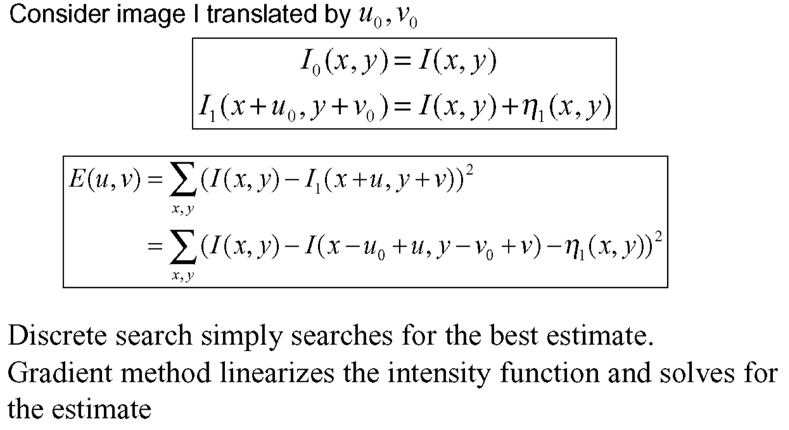{width=50%}

# 9. Video Compression

## 9.1 Perception Of Motion

The human visual system is specifically sensitive to motion. Our eyes follow motion automatically. Some distortions, however, are not as perceivable as in image coding.

Visual perception is limited to <24Hz, therefore, a succession of images will be perceived as continuous if the frequency is sufficiently high. We still need to avoid aliasing (i.e. the "wheel effect"), therefore high-rendering frame-rates desired in computer games (needed due to absence of motion blur).

## 9.2 Bloch's Law

**Bloch's Law** states that for human perception, it doesn't really matter whether we see something at 100% brightness for 10ms, or something at 50% for 20ms.

## 9.3 Video Format

A **video** is essentially a sequence of 2D images, so for storing a video, we need to simply store each 2D image and their corresponding place in time.

### 9.3.1 Interlaced Video Format

The **interlaced video format** consists of two temporally shifted half images, which increases the frequency from 25 to 50 Hz (for example).

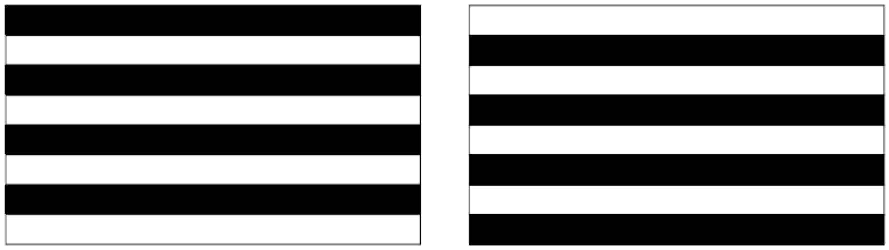{width=50%}

This results in a reduction of spatial resolution.

## 9.4 Lossy Video Compression

With **lossy video compression** we take advantage of redundancy:

- Spatial correlation between neighboring pixels
- Temporal correlation between frames

With the above information, we can _drop perceptually unimportant details._

### 9.4.1 Temporal Processing

With a usually high frame rate, we have significant temporal redundancy. We have two possible representations along temporal dimension:

- _Transform/subband methods:_
    - Good for textbook case of constant velocity uniform global motion
    - Inefficient for nonuniform motion, i.e. real-world motion
    - Requires many frame stores
- _Predictive methods:_
    - Good performance using only two frame stores
    - However, simple frame differencing is not enough

The goal is to exploit temporal redundancy by **predicting the current frame** based on previously coded frames. There are three types of **coded frames:**

- _I-frame:_ Intra-coded frame, coded independently of all other frames
- _P-frame:_ Predicatively coded frame, coded based on previously coded frame
- _B-frame:_ Bi-directionally predicted frame, coded based on both previous and future coded frames

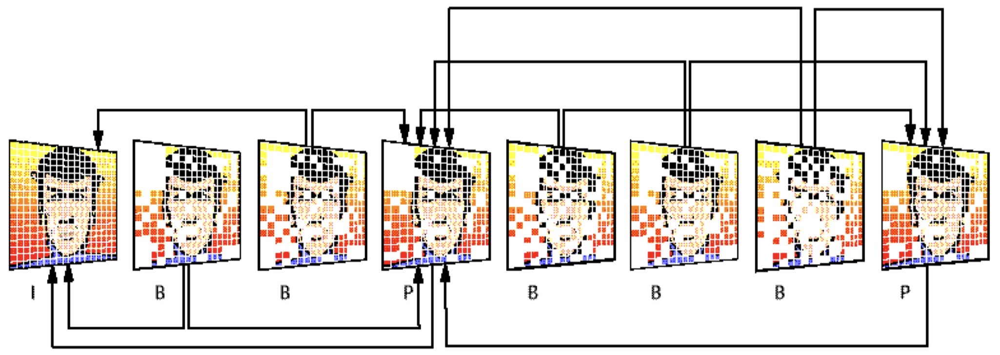{width=50%}

Temporal redundancy reduction may be _ineffective_ when there are many scene changes or when there is high motion.

### 9.4.2 Video Compressor Diagram

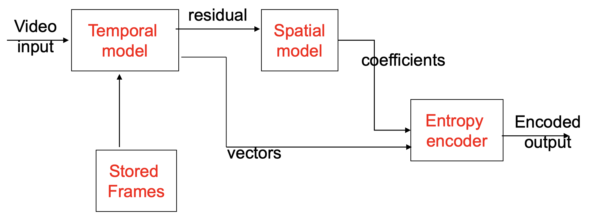{width=50%}

### 9.4.3 Motion-compensated Prediction

Simple frame differencing fails when there is motion. We can account for motion with a **motion-compensated (MC) prediction.** The practical approach to this is so called **Block-Matching Motion Estimation:**

- Partition each frame into blocks, e.g. 16x16 pixels
- Describe the motion of each block
- No object identification required
- Good, robust performance

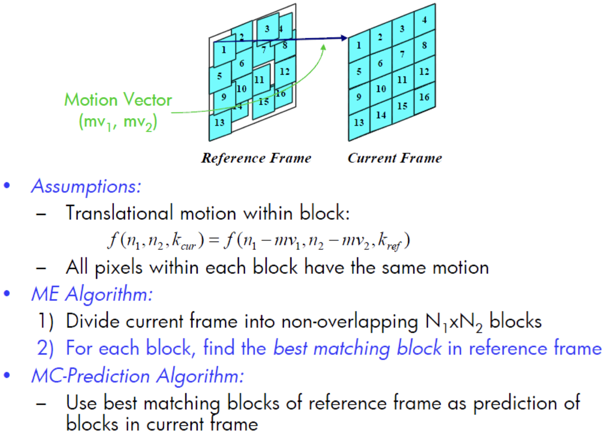{width=50%}

_Example of fast motion estimation search: 3-step log search_

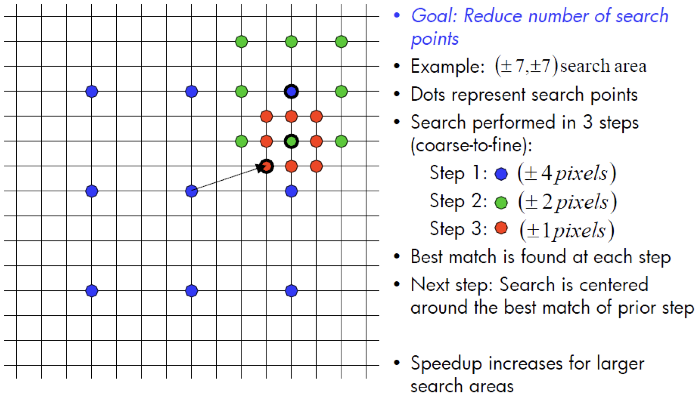{width=50%}

### 9.4.4 Bidirectional MC Prediction

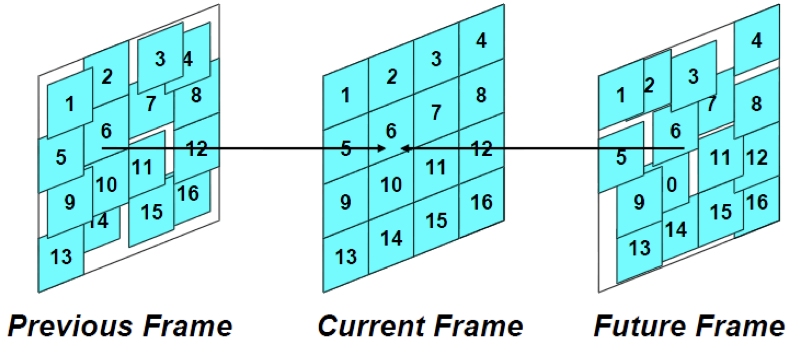{width=50%}

**Bidirectional MC-Prediction** is used to estimate a block in the current frame from a block in:

1. Previous frame
2. Future frame
3. Average of a block from the previous frame and a block from the future frame
4. Neither, i.e. code the current block without prediction

## 9.5 Basic Video Compression Architecture

### 9.5.1 Example Video Encoder

{width=50%}

### 9.5.2 Example Video Decoder

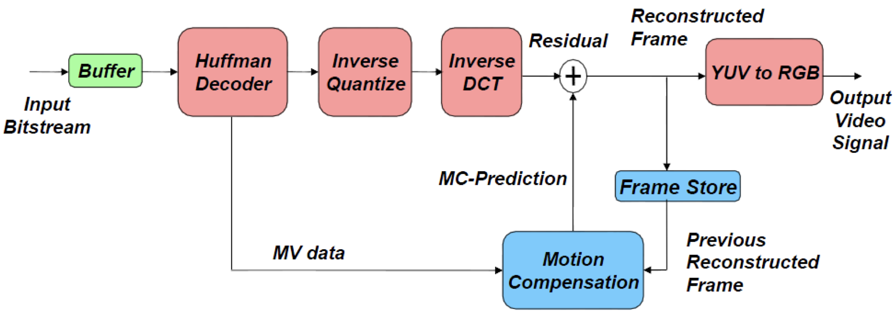{width=50%}

## 9.6 Objective Quality Measure: PSNR

The error for one pixel, as the difference between the original and decoded value:

$$
e(v, \, h) = \hat{x}(v, \, h) - x(v, \, h))
$$

The mean-squared-error, MSE, over an image:

$$
e_{mse} = \sqrt{\frac{1}{N \cdot M} \sum_{v = 1}^N \sum_{h = 1}^M e^2(v, \, h)}
$$

The peak-signal-to-noise-ration is then given by:

$$
PSNR = \frac{(\text{maximum value of } x)^2}{e_{mse}^2} = 10 \cdot \log_10 \Big(\frac{(2^K)^2}{e_{mse}^2} \Big) \text{dB}
$$

# 10. Radon Transform

## 10.1 Medical Imaging

There are two forms of _radiation sources:_

- Outside the body: X-rays and ultrasound
- Inside the body: magnetic resonance imaging (MRI), positron emission tomography (PET), and single photon emission computed tomography (SPECT)

### 10.1.1 Computed Tomography (CT)

The idea behind _CT data collection_ is to quantify the tendency of objects to absorb or scatter x-rays given by the optical density of the material measured in terms of attenuation coefficient.

A _CT image setup_ could look as follows:

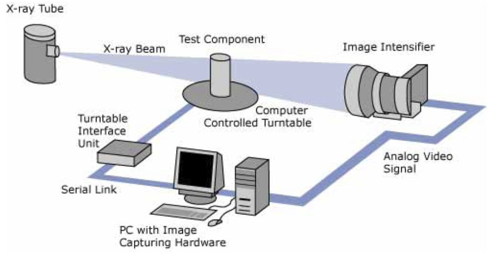{width=50%}

### 10.1.2 Image Reconstruction

The mathematical problem posed by **CT reconstruction** is to calculate the image data from the projection values. For the simple image of four pixels shown, algebra can be used to solve for the pixel values. For the larger images of clinical CT, algebraic solutions become unfeasible.

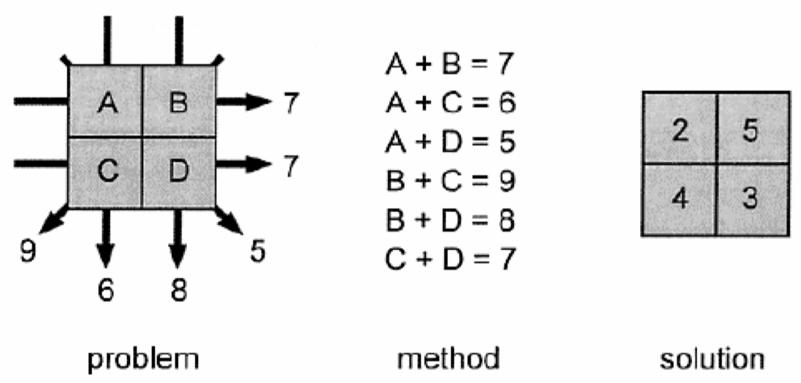{width=50%}

### 10.1.3 Image Acquisition

The basic principle setup for **CT image acquisition** looks as follows:

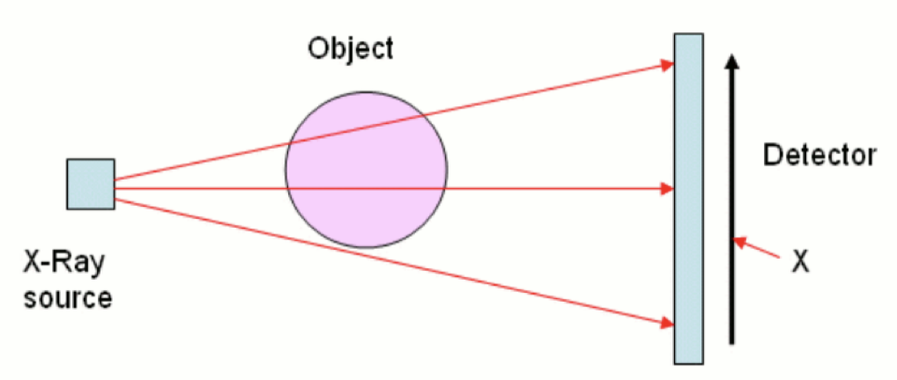{width=50%}

The intensity of the X-ray where it hits the detector depends on the width of the object and the length of the path travelled through the object and the air.

X-rays, moving along a straight line, have at distance $s$ the _intensity_ $I(s)$. This means, that if the x-ray travelled $\delta s$ distance, its intensity will be reduced by $\delta I(s)$.
The reduction depends on the intensity and _optical density_ $u(s)$ of the material. For small $\delta s$, it holds that:

$$
\frac{\delta I(s)}{I(s)} = - u(s) \delta s
$$

Combining all the contributions to the reduction in the intensity of an X-ray travelling along line $L$ given by all the parts of the body that it travels through, the **attenuation** (i.e. reduction in intensity) is given by:

$$
Rf(L) = \int_L f(x) |dx|
$$

This is also called the **Radon transform** of function $f(x, \, y)$.

## 10.2 The Radon Transform

### 10.2.1 Introduction

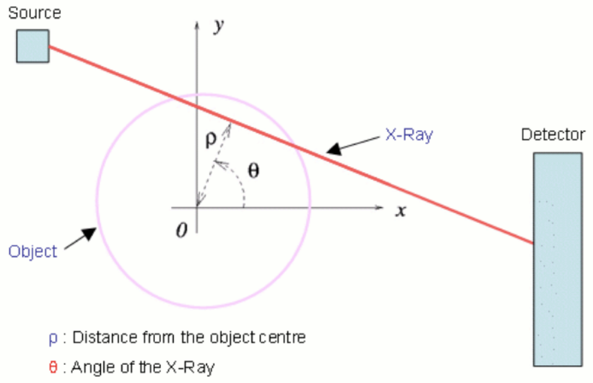{width=50%}

This X-ray will pass through a series of points $(x, \, y)$ at which the optical density is $u(x, \, y)$. Using the equation for a straight line these points are given by:

$$
(x, \, y) = (\rho \cos(\theta) - s \sin(\theta), \, \rho \sin(\theta) + s \cos(\theta)),
$$

where $s$ is the arc length. In this case, we now have:

$$
I_{finish} = I_{start}^{-R(\rho, \, \theta)}
$$

where:

$$
R(\rho, \, \theta) = \int_{- \infty}^{\infty} \int_{- \infty}^{\infty} u(x, \, y) \delta(\rho - x \cos(\theta) - y \sin (\theta)) \, dx \, dy,
$$

where $\delta(x, \, y)$ is the Dirac Delta function.

### 10.2.2 Properties

_Linearity:_

$$
g(x, \, y) = \sum_q \alpha_q g_q (x, \, y) \implies \hat{g}(\rho, \, \theta) = \sum_q \alpha q \hat{g}_q(\rho, \, \theta))
$$

_Shifting:_

$$
h(x, \, y) = g(x-x_0, \, y-y_0) \implies \\ \hat{h}(\rho, \, \theta) = \hat{g}(\rho - x_0 \cos(\theta) - y_0 \sin(\theta), \, \theta)
$$

_Rotation:_

$$
h(r, \, \phi) = g(r, \, \phi - \phi_0) \implies \\ \hat{h}(\rho, \, \theta) = \hat{g}(\rho, \, \theta - \phi_0)
$$

_Convolution:_

$$
h(x, \, y) = f(x, \, y) ** g(x, \, y) \implies \\ \hat{h}(\rho, \, \theta) = \hat{f}(\rho, \, \theta) * \hat{g}(\rho, \theta)
$$

### 10.2.3 Point Source

Here, an arbitrary point source $(x^*, \, y^*)$ is assumed:

$$
g(x, \, y) = \delta(x-x^*) \delta(y-y^*) \implies \\ \hat{g}(\rho, \, \theta) = \delta(\rho - x^* \cos(\theta) - y^* \sin(\theta))
$$

The figure below illustrates a point source and the corresponding Radon transform:

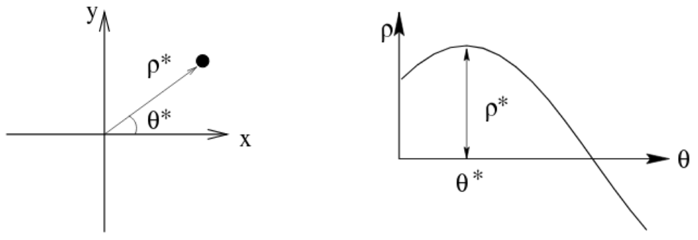{width=50%}

### 10.2.4 Image Reconstruction: Algebraic Formulation

We assume that the attenuation of the material within each pixel is constant and proportional to the area of the pixel illuminated by the beam, i.e.:

$$
k_{ij} = \frac{\text{area of pixel } j \text{ illuminated by ray } i}{\text{total area of pixel } j}, \quad i = 1, \, ..., \, l, \, \, j = 1, \, ..., \, nm
$$

Hence, the algebraic model reads as:

$$
Kf = g,
$$

where $f$ is the BW plane/volumetric image to be retrieved (reshaped into a vector) and $g$ is the attenuation measurements from the CT system.

We can then transform the over determined matrix $K$ into a system of _normal equations:_

$$
K^TKf = K^Tg
$$

However, this solution does not exist, is not unique or not continuously dependent on the given data.

## 10.3 Fourier / Central Slice Theorem

The **Fourier / Central Slice Theorem** is as following:

$$
\mathcal{G}(q, \, 0) = \mathcal{F}(q \cos(0), \, q \sin(0)),
$$

where $\mathcal{G}$ is the 1D Fourier transform of the attenuation measurements $g = Rf$ and $\mathcal{F}$ is the 2D Fourier transform of the object slice $f(x, \, y)$ evaluated at a particular point.

In words:

> The Fourier transform of a parallel projection of an image $f(x, \, y)$ taken at an angle $\theta$ gives a slice of the two-dimensional transform, $F(u, \, v)$, subtending an angle $\theta$ with the $u$-axis. In other words, the Fourier transform of $P_{\theta}(t)$ gives the values of $F(u, \, v)$ along line $BB$ in the following figure:

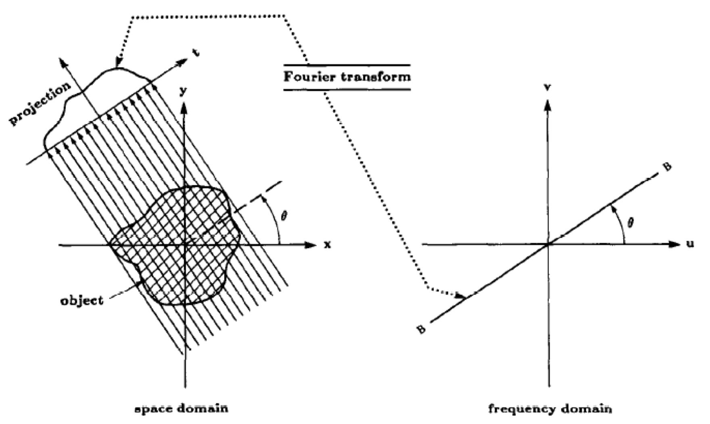{width=50%}

## 10.4 Filtered Backprojection

### 10.4.1 Algorithm

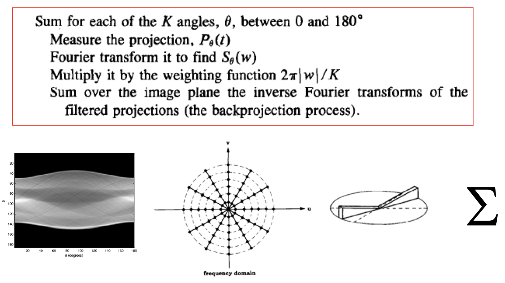{width=50%}

### 10.4.2 Improvements

We can apply a high-pass filter after the 1D FT projection. This will help with improving blurriness when using the naive backprojection algorithm:

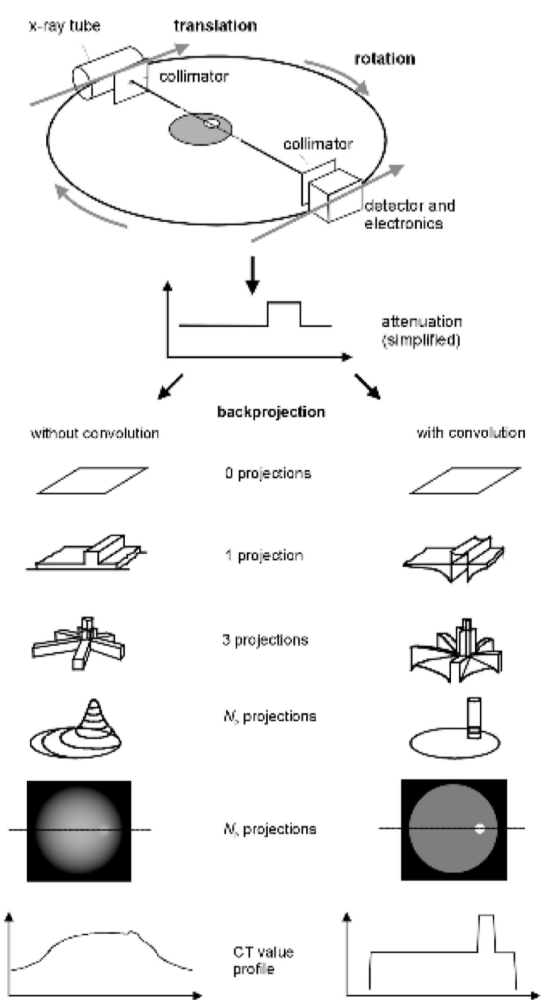{width=50%}
