# Part 2: Computer Graphics

# 1. Introduction

## 1.1 Computer Graphics

**Computer graphics** describes the use of computers to synthesize and manipulate visual information.

It is used in many, if not all the movies we see today to synthesize movie scenes which are fictional or too expensive to shoot in real life.

In general, computer graphics is about building computational models of the real world!

## 1.2 Foundations Of Computer Graphics

Building models of the world demands sophisticated theory and systems, such as:

- geometric representations
- sampling theory
- integration and optimization
- perception
- physics-based modeling
- parallel, heterogeneous processing
- graphics-specific programming languages

## 1.3 Modeling And Drawing A Cube

We start by exploring how we draw a cube, i.e. how we describe a cube and how we can visualize our model.

We assume our cube to be as follows:

- Centered at origin `(0, 0, 0)`
- Has dimensions `2 x 2 x 2`
- Edges are aligned with `x, y, z` axes

We can then define the coordinates of the cube _vertices_ to be:

```bnf
A: (1, 1, 1)        E: (1, 1, -1)
B: (-1, 1, 1)       F: (-1, 1, -1)
C: (1, -1, 1)       G: (1, -1, -1)
D: (-1, -1, 1)      H: (-1, -1, -1)
```

With the information above, we can define the _edges_ of our cube to be:

```bnf
AB, CD, EF, GH,
AC, BD, EG, FH,
AE, CG, BF, DH
```

But how do we draw our 3D vertices as a 2D flat image? The basic strategy is:

1. Map the 3D vertices to 2D points in the image
2. Draw straight lines between 2D points corresponding to the edges

## 1.4 Perspective Projection

The **perspective projection** describes what a simple _pinhole_ model of a camera does:

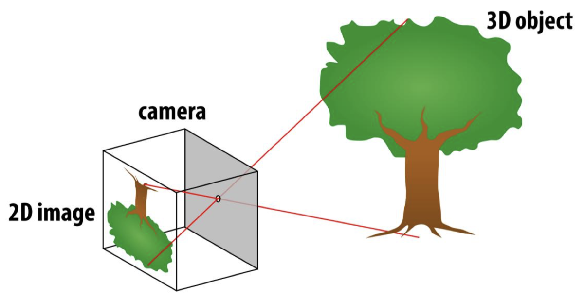{width=50%}

With this simple projection we can answer the following question: Where does a point `p = (x, y, z)` from our real world end up in the image `q = (u, v)`?

$$
\begin{aligned}
&v = \frac{y}{z}, \quad \text{(v is simply the slope y/z)} \\
&u = \frac{x}{z}
\end{aligned}
$$

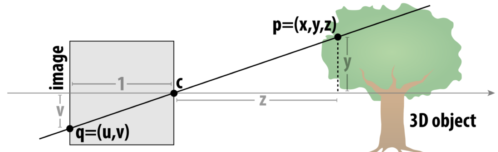{width=50%}

Applying the above learned information, we can draw our cube, assuming that the camera is at `c = (2, 3, 5)`, as follows:

1. We get the following coordinates for our vertices of the cube:

```bnf
A: (1/4, 1/2)       E: (1/6, 1/3)
B: (3/4, 1/2)       F: (1/2, 1/3)
C: (1/4, 1)         G: (1/6, 2/3)
D: (3/4, 1)         H: (1/2, 2/3)
```

2. We can draw the points on a 2D grid and connect the points which belong to our previously defined edges:

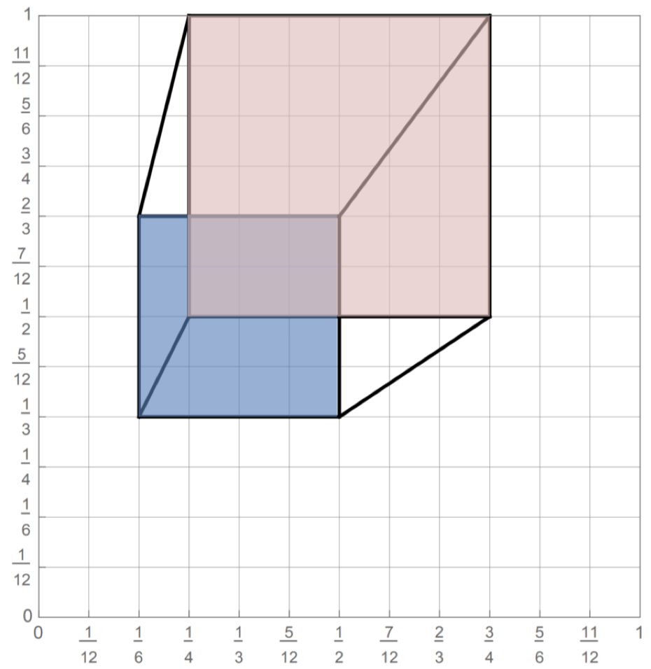{width=50%}

## 1.5 Drawing On A Raster Display

### 1.5.1 Introduction

Considering we have solved our cube representation, a natural question to ask would be how a computer can draw lines.
A common abstraction is that an image is represented as a _2D grid of pixels._ Each pixel can take on a unique color value.

**Rasterization** describes the process of converting a continuous object to a discrete representation on a pixel grid (or _raster grid_). However, this approach leads to a fundamental question which we must solve: Which pixels should we color in to depict the line?

1. One simple approach is to light up all pixels intersected by the line:

{width=50%}

2. In modern graphics hardware, we use an approached called the _diamond rule:_

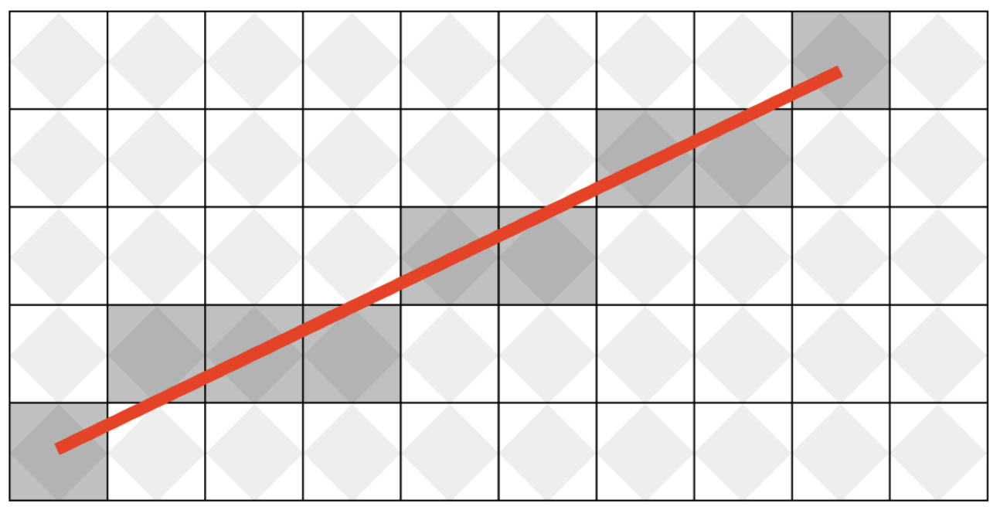{width=50%}

The last question we might want to answer is how do we find the pixels satisfying a chosen rasterization rule? We could check every single pixel in the image to see if it meets the condition.
However, considering the `O(n)` pixels in an image with respect to the at most `O(n)` "lit up" pixels, we have to do way too much computation.

### 1.5.2 Incremental Line Rasterization

Let's assume that a line is represented with integer endpoints `(u1, v1)` and `(u2, v2)`, and a slope `s = (v2 - v1)/(u2 - u1)`. We consider the very easy special case where:

- `u1 < u2, v1 < v2`, i.e. the line points towards the upper-right
- `0 < s < 1`, i.e. there is more change in `x` than in `y`

A common optimization for drawing the pixels is the so-called **Bresenham algorithm:**

```c
v = v1;
for(u = u1; u <= u2; u++) {
    v += s;
    draw(u, round(v));
}
```

# 2. Drawing Triangles

## 2.1 Introduction

If you know how to draw a triangle, you'll go a long way!

But why triangles and not other shapes, like squares, circles, or stars? Because you can make a lot of different shapes with triangles, such as squares, stars, etc.
They provide a very good compromise between their overall power of representing different shapes and the need for specialized software and hardware to handle them effectively.

We introduce the following two definitions:

- **Coverage:** What pixels does an object/triangle cover in the image?
- **Occlusion:** What object/triangle is closest to the camera in each pixel?

## 2.2 The Visibility Problem

We state the following informal definition of the **visibility problem:** What scene geometry is visible within each screen pixel?

This question somewhat corresponds to out two definitions from before:

- What scene geometry projects into a screen pixel? (_coverage_)
- Which geometry is visible from the camera at that pixel? (_occlusion_)

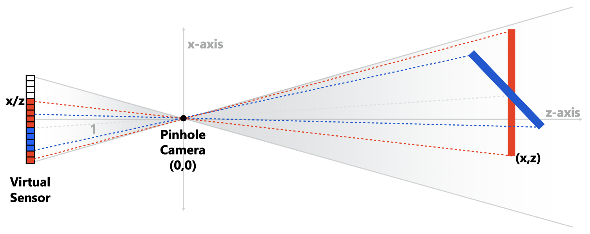{width=50%}

Said differently, in terms of _rays,_ the visibility problem becomes:

- What scene geometry is hit by a ray from a pixel through the pinhole? (_coverage_)
- What object is the first hit along that ray? (_occlusion_)

## 2.3 Computing Triangle Coverage

Similar to the line problem from the previous chapter, the main question we have to answer is which pixel is _covered_ by a triangle.

_Example:_

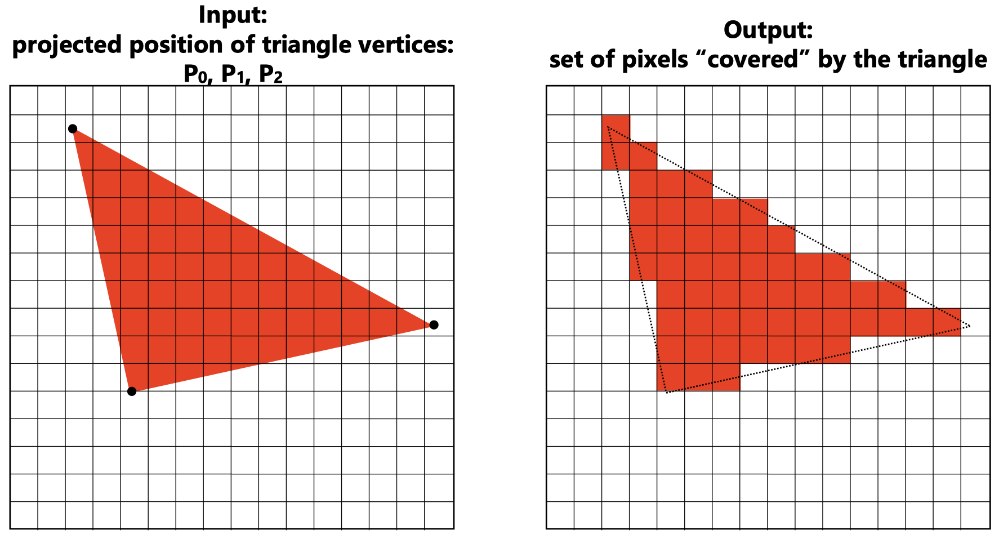{width=50%}

But what do we do with pixels that are only _partially covered_ by the triangle? One option is to compute the fraction of pixel area which is covered by the triangle, and then color the pixel according to this fraction:

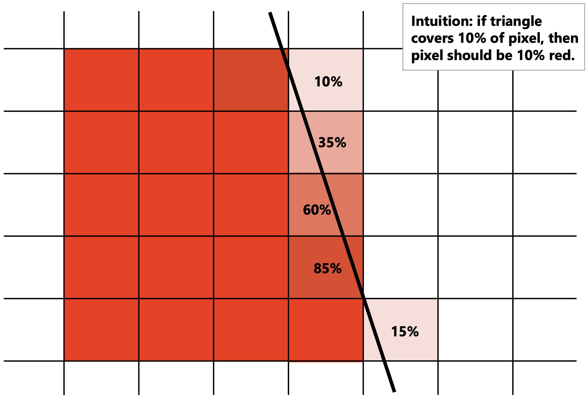{width=50%}

However, computing the area covered by a triangle can get tricky very fast, for example when dealing with the interactions between multiple triangles.
We may estimate the amount of overlap between a triangle and a pixel through _sampling._

## 2.4 Sampling 101

Consider a continuous function and 5 discrete measurement, our _samples:_

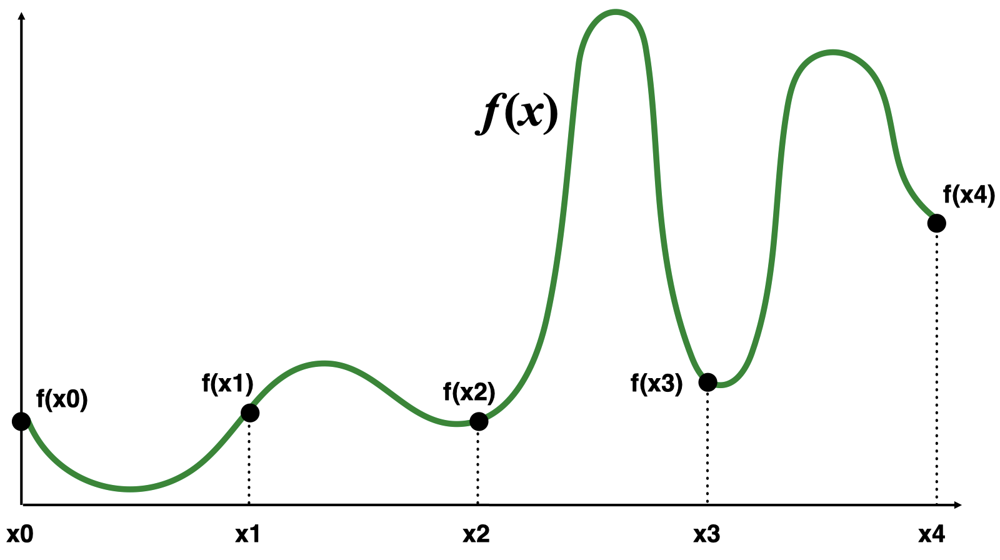{width=50%}

We can _reconstruct_ (or approximate) our original continuous functions with our discrete values through **sampling.**

### 2.4.1 Piecewise Constant Approximation

We define the reconstructed function $f_{recon}(x)$ to be the value of the sample closest to $x$, i.e. the nearest neighbor:

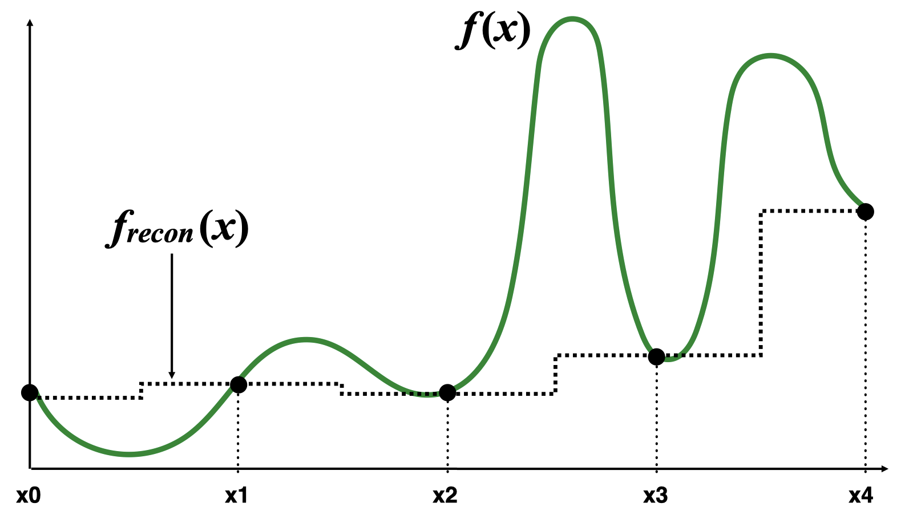{width=50%}

### 2.4.2 Piecewise Linear Approximation

We define the reconstructed function $f_{recon}(x)$ to be the linear interpolation between two samples closest to $x$.

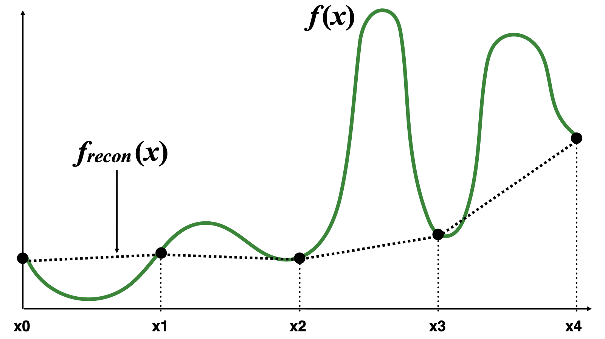{width=50%}

### 2.4.3 More Accuracy

The simplest and most obvious way to reconstruct our original 1D signal more accurately is to sample the signal more densely, i.e. to _increase the sampling rate._

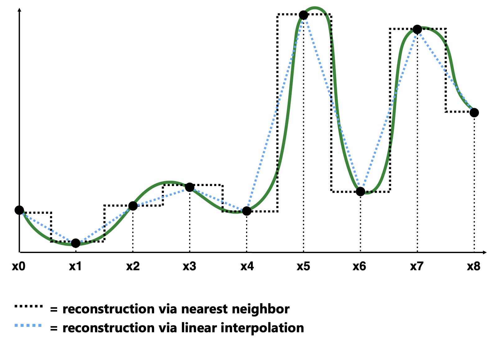{width=50%}

### 2.4.4 Mathematical Representation Of Sampling

Consider the _Dirac delta:_

$$
\begin{aligned}
&\delta(x) = \begin{cases} 0, &\text{for } x \neq 0 \\ \text{undefined}, &\text{at } x = 0  \end{cases}, \quad \text{such that} \\
&\int_{- \infty}^{\infty} \delta(x) \, dx = 1
\end{aligned}
$$

An _impulse_ has a **sifting property** which we define as follows:

$$
\int_{- \infty}^{\infty} f(x)\delta(x-a) \, dx = f(a),
$$

with an impulse occurring at $x = a$. Sampling the function is equivalent to multiplying it (inner product) by the Dirac delta!

#### Reconstruction As Convolution

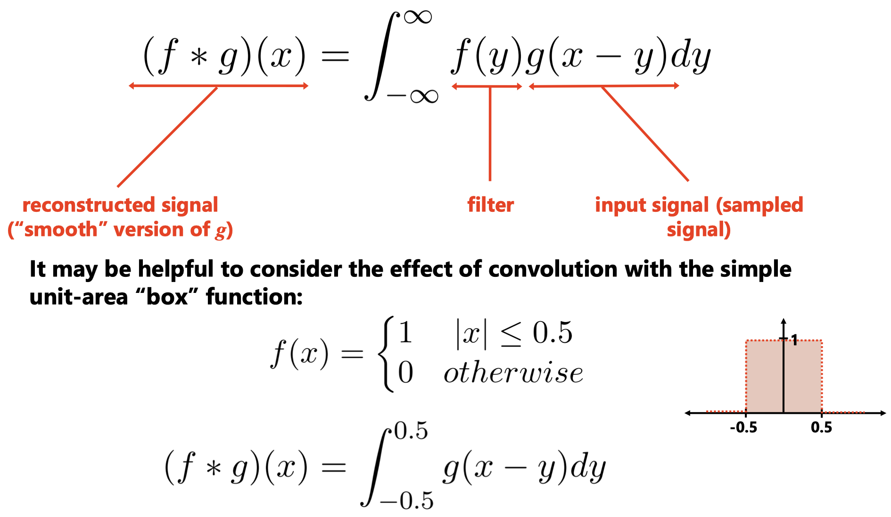{width=50%}

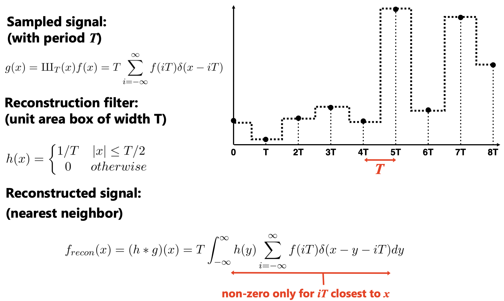{width=50%}

## 2.5 Coverage As A 2D Signal

We can think of the coverage as a 2D signal and define:

$$
\text{coverage}(x, \, y) = \begin{cases} 1, &\text{if the triangle contains point }(x, \, y) \\ 0, &\text{otherwise} \end{cases}
$$

We choose a point in the pixel which is said to be the _coverage sample point._

_Example:_

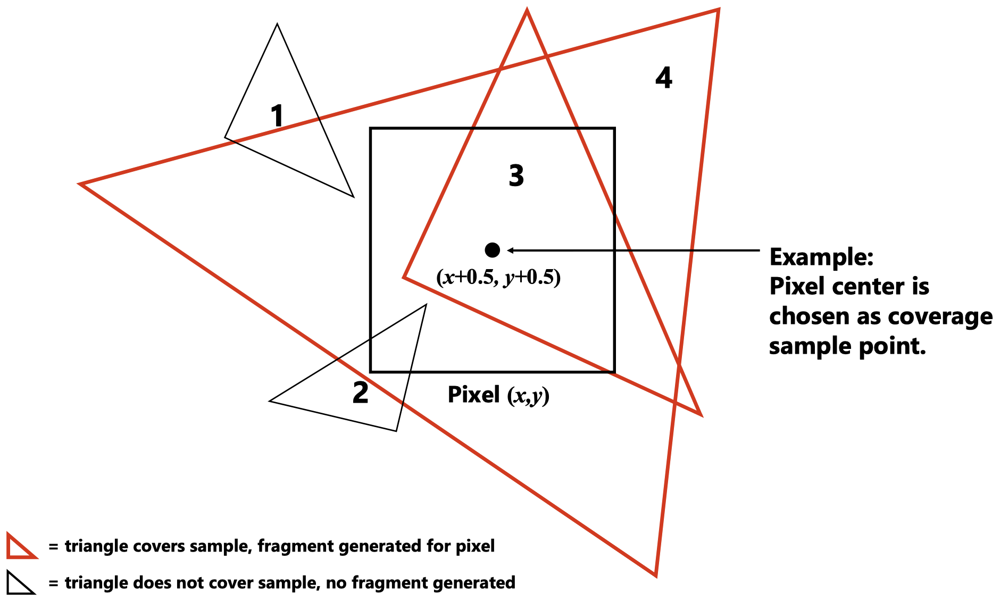{width=50%}

One (literal) edge case we have to consider is what happens if the edge of a triangle exactly falls onto our sample point. The OpenGL/Direct3D **edge rules** are:

When an edge falls directly on a screen sample point, the sample is classified as within the triangle if the edge is a _top edge_ or a _left edge:_

- Top edge: horizontal edge that is above all other edges
- Left edge: edge that is not exactly horizontal and is on the left side of the triangle

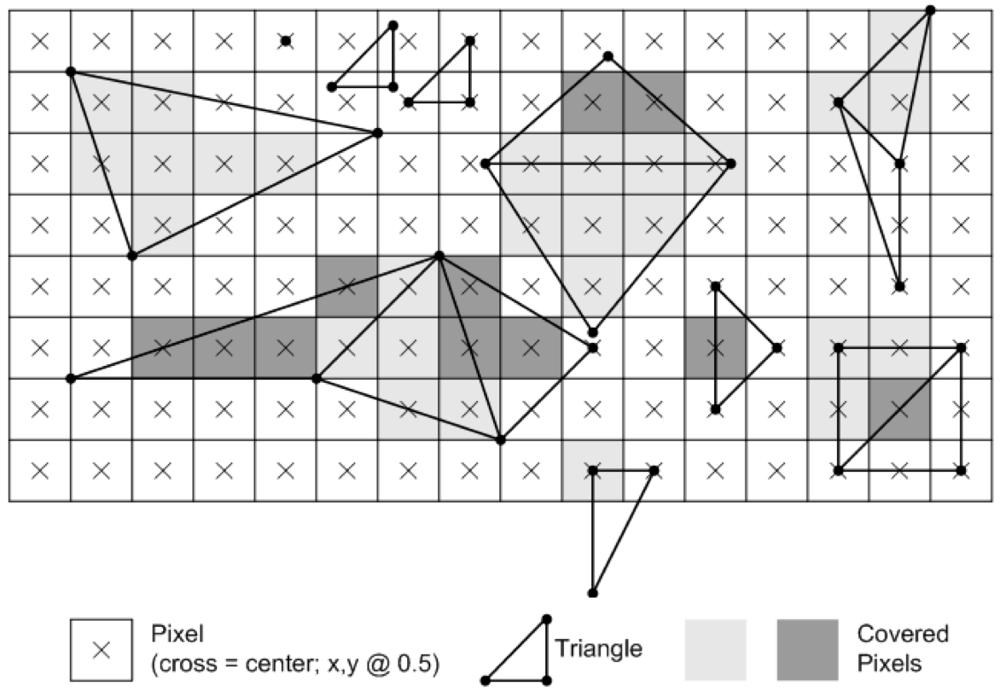{width=50%}

## 2.6 Aliasing

### 2.6.1 1D Example

**Aliasing** describes the observation that high frequencies in an original signal masquerade as low frequencies after reconstruction due to undersampling:

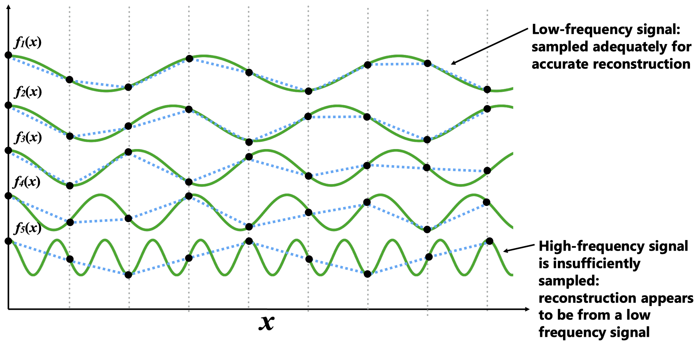{width=50%}

This leads to one obvious question when sampling: How densely should we be sampling?

### 2.6.2 Nyquist-Shannon Theorem

The _Nyquist-Shannon theorem_ says that a signal can be perfectly reconstructed if it is sampled with period $T < \frac{1}{2 \omega_0}$.

### 2.6.3 Supersampling

We can increase the density of the sampling coverage signal. The following example shows _stratified sampling_ using four samples per pixel:

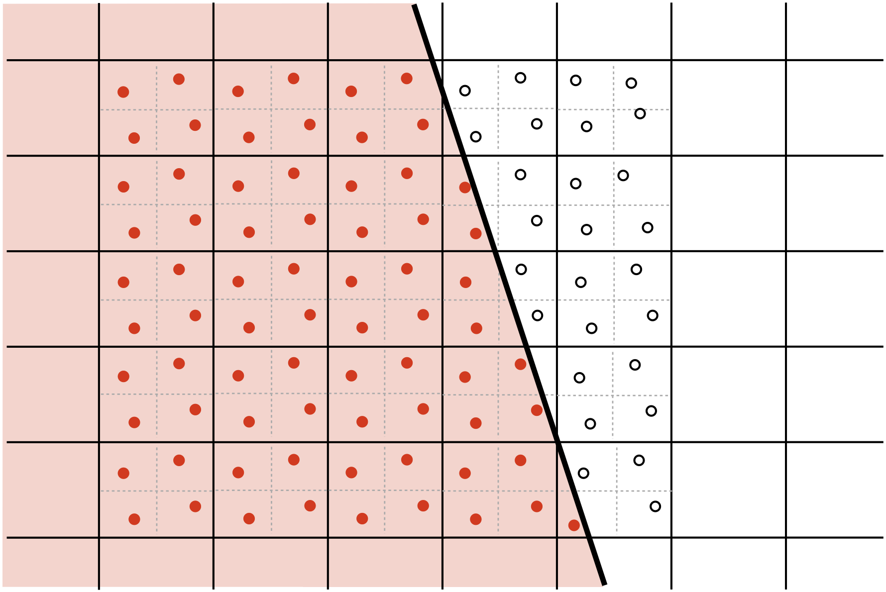{width=50%}

However, we now have more samples than pixels! This means we have to **resample**, i.e. converting from one discrete sampled representation to another:

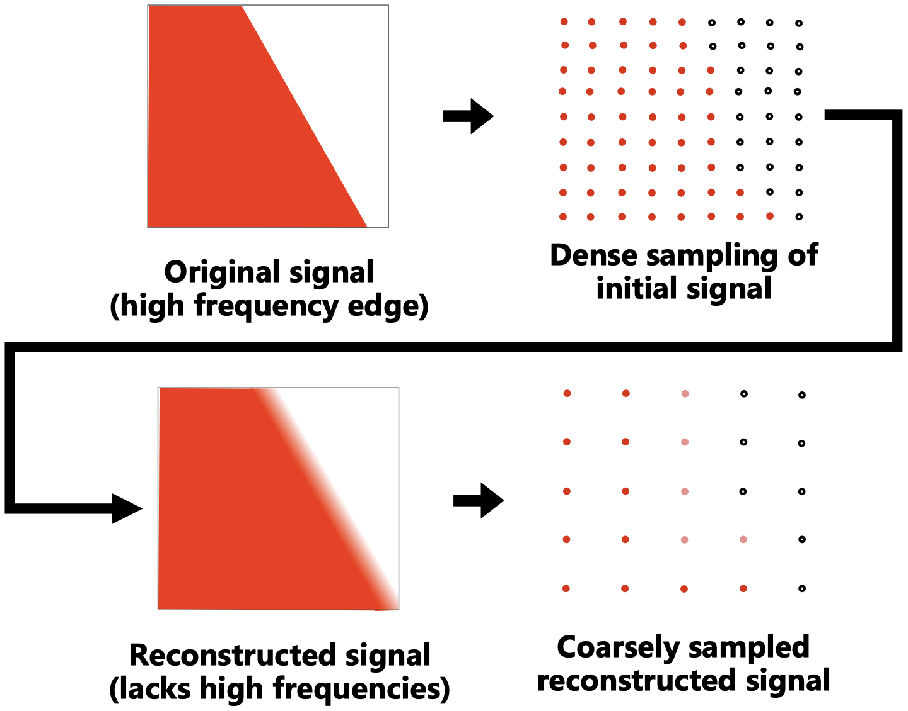{width=50%}

## 2.7 Sampling Triangle Coverage

### 2.7.1 Point-In-Triangle Test

To decide whether a sample point is inside the triangle we have to test whether it is "inside" all the three edges of the triangle.

For a point with the tree vertices $P_0, \, P_1, \, P_2$, we define:

$$
\begin{aligned}
&P_i = (X_i, \, Y_i) \\
&dX_i = X_{i+1} - X_i \\
&dY_i = Y_{i+1} - Y_i \\
&E_i(x, \, y) = (x - X_i) dY_i - (y-Y_i)dX_i = A_ix + B_iy + C_i \\
&E_i(x, \, y) = \begin{cases} 0, &\text{if point is on the edge} \\ >0, &\text{if point is outside of the edge} \\ <0, &\text{if point is inside the edge}  \end{cases}
\end{aligned}
$$

This leaves us with the following mathematical definition of whether a sample point $S = (sx, \, sy)$ is inside or outside a triangle:

$$
\begin{aligned}
\text{inside}(sx, \, sy) = &E_0(sx, \, sy) < 0 \, \&\& \\ &E_1(sx, \, sy) < 0 \, \&\& \\ &E_2(sx, \, sy) < 0
\end{aligned}
$$

### 2.7.2 Incremental Triangle Traversal

Another approach is based on the idea that rather than testing all possible points on a screen, we traverse them incrementally:

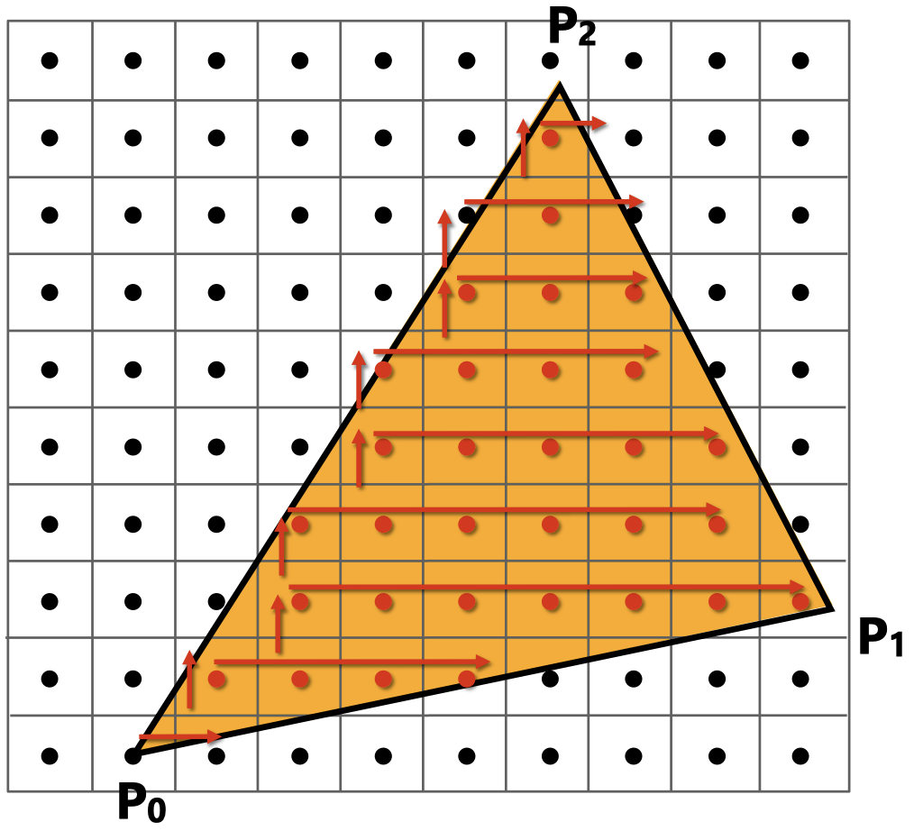{width=50%}

### 2.7.3 Tiled Triangle Traversal

A modern approach is to traverse the triangle in blocks. We test all samples in the block against the triangle in parallel:

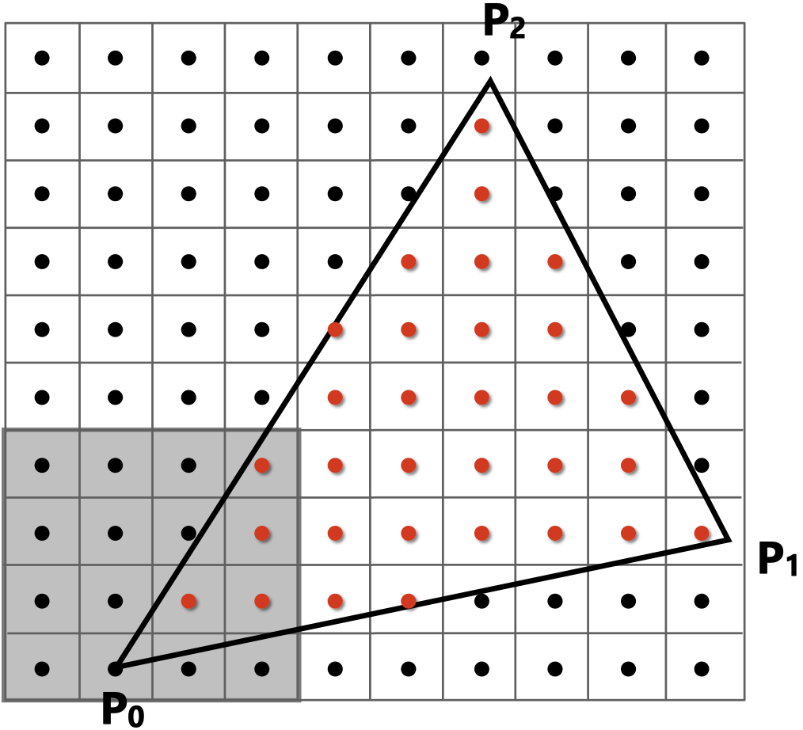{width=50%}
